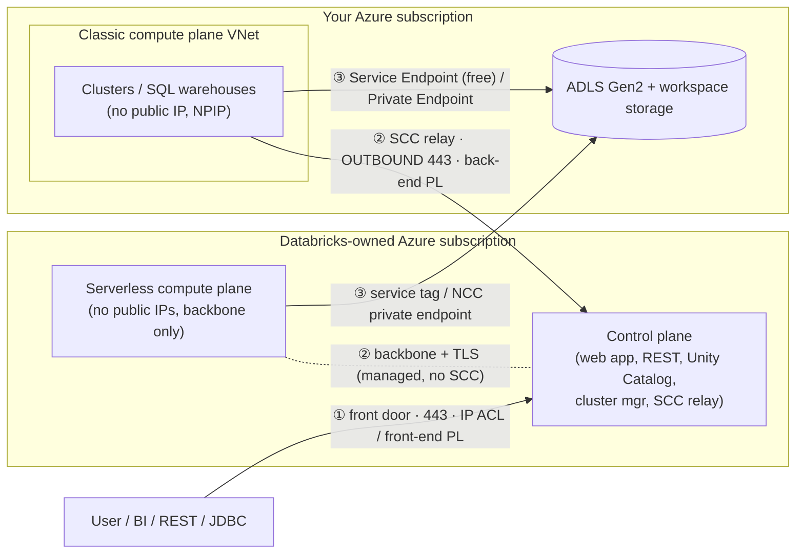
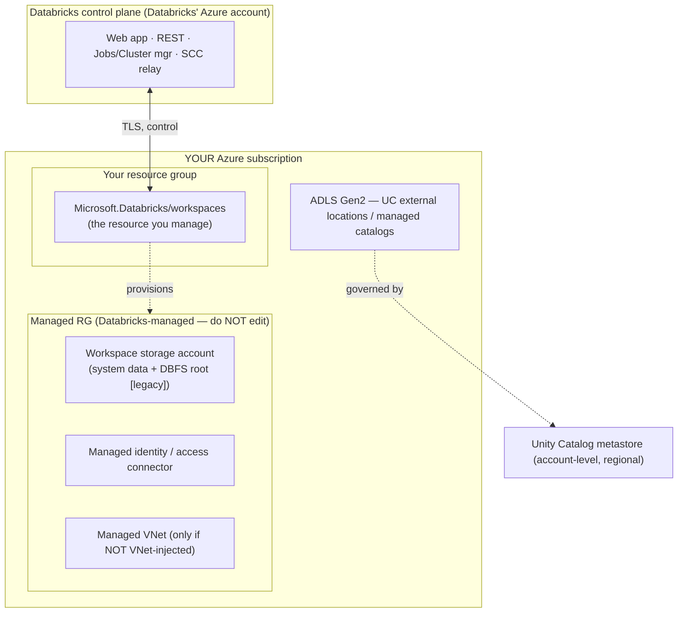

# Topic 2 — Architecture & Default Connectivity (Azure-first)

> **Stage 2 · Azure Databricks Networking & Security** — for the **FDE / RSA /
> Solutions Architect** who has to *explain* this to a customer's security team,
> not hand-configure it. This is the whiteboard the whole track rests on: once you
> can say **what runs where, who owns it, which way connections point, and where
> data lives**, every later control (VNet injection, SCC, Private Link, NCC,
> exfiltration protection) is just *"harden one hop on this map."*
>
> **This one page covers all three subtopics:**
> - **2.1 — Control plane vs compute plane** (what runs where, who manages it)
> - **2.2 — The three connectivity paths** (the only three doors that carry traffic)
> - **2.3 — Deployment & workspace storage** (what you create, where the bytes land)
>
> Companion interactive page: `index.html` (tabbed, one interactive architecture
> diagram per subtopic). Static topology: `architecture.svg`.

---

## 🧠 Topic mental model (hold this in your head)

> **Azure Databricks is an airport with exactly three doors.**
>
> - The **control plane** is the **control tower** — Databricks runs it in *their*
>   Azure subscription. It *schedules and directs*; it never holds the cargo.
> - The **compute plane** is the **runway + aircraft** where your data is actually
>   processed. **Classic** = your runway at *your* airport (your subscription/VNet);
>   **serverless** = you rent runway at *Databricks'* airport.
> - Your **data** lives in *your* storage (ADLS Gen2 behind Unity Catalog) and is
>   read by the compute plane — it **never** flows through the control tower.
>
> **The one sentence:** *Databricks runs the brain in its own subscription; your
> data is processed in the compute plane and never leaves your storage; and
> connections only ever point **outward** from compute to control.*
>
> **The three doors (the scaffold for the entire curriculum):**
> ① **User → Databricks** (front door) · ② **Compute ↔ Control** (staff intercom,
> outbound-only) · ③ **Compute → Storage** (loading dock). Every later lesson is
> *"how do I lock door N?"*

---

## Why this topic matters to an architect

- **It decides where controls even apply.** You can attach an NSG, a UDR, a
  firewall, or a Private Endpoint in the **classic** plane because it's *your* VNet.
  You **cannot** in serverless — there's no VNet of yours, which is exactly why
  **NCC** exists (Stage 5). Knowing the plane tells you which toolbox is on the table.
- **It explains the "no inbound ports" boundary** — the platform's single most
  important security property — as a *reversed, outbound-only* connection, not magic.
- **It frames the "is our data on the internet?" conversation** — a lot of traffic
  is already off the public internet by default, so you stop customers over-buying
  Private Link they don't need.
- **It's the opener in every security review and SA interview:** *"walk me through
  the architecture."* Get *who-owns-what* and *where-data-lives* right and you've
  established credibility in the first two minutes.

---

## Terms used here (define-before-use)

This is an early topic, so most terms get their **deep dive later** — here's the
2–3 line gloss to read this page top-to-bottom, plus the module that owns the full
treatment.

| Term | Plain-language gloss | Owning module |
| --- | --- | --- |
| **VNet** (virtual network) | Your private, isolated network in Azure — the address space your VMs live in and the boundary you attach firewalls/routes to. | Deep dive **Stage 3** |
| **Subnet** | A slice of a VNet's address range; the classic plane uses a **host** subnet and a **container** subnet. | **Stage 3** |
| **NSG** (network security group) | A stateful allow/deny firewall on a subnet/NIC, filtering by port/IP/service tag. | **Stage 1.3 / 3** |
| **UDR** (user-defined route) | A custom routing rule that overrides Azure defaults — e.g. "send all egress to my firewall." | **Stage 3 / 4** |
| **NAT Gateway** | An Azure egress device giving outbound traffic a **stable public source IP** (for partner allowlists) without allowing any inbound. | **Stage 3 / 4** |
| **Service Endpoint** | A **free** way to reach an Azure PaaS service (e.g. ADLS) over the Microsoft backbone, allowlisted by subnet on the storage firewall. | **Stage 4** |
| **Private Endpoint** | A **private IP inside your VNet** mapping to an Azure service, so traffic never uses a public IP (per-GB cost). | **Stage 4 / 5** |
| **Private Link** | The Azure feature behind private endpoints; for Databricks it privatises the **front-end** (user→CP) and **back-end** (compute→CP) paths. | **Stage 4** |
| **SCC relay** (Secure Cluster Connectivity) | A control-plane endpoint classic clusters dial **outbound** to (443), forming a reverse tunnel so nothing dials inbound to your VMs. | **Stage 3.3** |
| **NCC** (Network Connectivity Configuration) | An account-level, regional object giving **serverless** compute its egress/private-connectivity rules — the serverless answer to "VNet controls." | **Stage 5** |
| **Service tag** (`AzureDatabricksServerless`) | A Microsoft-maintained label for a set of service IP ranges, used in firewall/NSG rules instead of raw IPs. | **Stage 4 / 5** |
| **Managed resource group (RG)** | A locked RG Databricks creates **in your subscription** for the workspace's plumbing (storage, identity, disks, managed VNet) — viewable, not editable. | This topic (2.3) |
| **Microsoft backbone** | Microsoft's private global network carrying Azure-to-Azure traffic **without traversing the public internet**. | This topic (2.1) |
| **Access Connector** | The Azure managed identity Unity Catalog uses to reach ADLS Gen2 without secrets. | **Stage 7** |

---

# 2.1 — Control plane vs compute plane

## What it is (plain language)

Azure Databricks is split into **two planes** — two separate sets of machines, run
by two parties, in two Azure subscriptions:

- **Control plane — the brains.** The web UI, REST APIs, notebook/job/query/cluster
  managers, Unity Catalog metadata + access decisions, and the **SCC relay**.
  **Databricks runs it, in the Databricks-owned Azure subscription.** You have **no
  network knobs inside it** — you secure the *paths to and from* it.
- **Compute plane — the muscle.** Where your clusters / SQL warehouses actually run
  Spark on your data. Two flavours, and the only real difference is *whose
  subscription/VNet the compute VMs live in*:
  - **Classic** — runs **in your subscription**, inside a VNet you can see and
    control (managed-default, or your own via VNet injection).
  - **Serverless** — runs **in the Databricks-owned subscription**, pre-warmed and
    fully managed; you never see the VMs.
- **Your data never lives in the control plane.** It's in **your** ADLS Gen2 /
  workspace storage and is read **directly** by the compute plane.

**Analogy:** control plane = airport **control tower** (directs, never holds
cargo); compute plane = **runway + aircraft**. Classic = your runway; serverless =
rented runway at Databricks' airport.

> **Backbone, not internet (say this to the security team):** *all* classic
> compute ↔ control-plane traffic rides the **Microsoft backbone**, not the public
> internet — **even with SCC disabled**. Private Link later removes the public-*IP*
> hop; the traffic was already off the open internet.

## The plane split — what an architect explains

| | **Classic compute plane** | **Serverless compute plane** |
| --- | --- | --- |
| Runs in | **Your** Azure subscription | **Databricks-owned** subscription |
| Network you control | The VNet (managed default *or* VNet injection) | None — no customer VNet |
| VMs visible to you | Yes (in a managed RG) | No |
| Public IPs on compute | **No** (SCC / No Public IP) | **No** |
| CP ↔ compute path | SCC relay, **outbound 443**, over backbone | Always over the backbone + TLS (no SCC) |
| Secure egress with | NSG / UDR / NAT / Firewall / Private Endpoint | **NCC** + serverless network policies (Stage 5) |
| Startup | Minutes (VMs provision) | Seconds (pre-warmed) |
| Where data lives | Your ADLS Gen2 + workspace storage | Your ADLS Gen2 + workspace **default storage** |

**Portal naming gotcha:** a classic workspace is labelled a **"Hybrid workspace"**
in the Azure Portal (CLI `--compute-mode Hybrid`). "Hybrid" = classic compute in
your subscription, *not* hybrid-cloud.

## The secure boundary — connections point *outward* (this is the exam answer)

With **Secure Cluster Connectivity (SCC) / No Public IP (NPIP)** — the **default**
for new classic workspaces:

1. Cluster VMs have **no public IPs**; your VNet has **no open inbound ports**.
   Nothing on the internet — or the control plane — can dial *into* a cluster.
2. So how does "start this job" arrive? **The cluster dials out first.** At start,
   each cluster opens an **outbound** connection on **port 443** to the **SCC
   relay**, forming a reverse tunnel.
3. The control plane sends instructions **back down that already-open tunnel** — it
   never initiates inbound. *(You call support; they answer on your open line — they
   can't call your phone.)*
4. For a **stable outbound IP** (so partners like Salesforce can allowlist you),
   route egress through an **Azure NAT Gateway**.

**Serverless** reaches the same property differently: serverless VMs **also have no
public IPs**, and CP ↔ serverless is **always over the backbone** — you secure its
egress with **NCC**, not NSGs.

> **Why this is the interview answer:** "no inbound ports" isn't magic — it's a
> **reversed (outbound-initiated) connection**. Saying *who dials whom, in which
> direction, on which port* is what separates understood from memorised.

## Where the data actually lives

- **Business data** → **your** ADLS Gen2, governed by **Unity Catalog external
  locations**, in your subscription. Read directly by compute; **never** through the
  control plane.
- **Workspace storage account** (classic) → in your subscription (inside the managed
  RG); holds **workspace system data** (job results, notebook revisions, cluster
  logs) + the legacy **DBFS root**. Don't delete it; don't put governed data in it.
- **Control plane** → stores **metadata + orchestration only** (configs, job defs,
  query plans). Never your table data.

**The line a security team wants to hear:** *"Customer data stays in the customer's
storage and is processed in the compute plane; the control plane holds metadata and
orchestration only."*

## 2.1 illustrative config (the only "config surface" here = creation defaults)

```hcl
# Illustrative — a workspace with the secure boundary ON (NPIP), managed VNet.
# Full apply-ready VNet-injection/SCC IaC lives in Stage 3 (hands-on artifact).
resource "azurerm_databricks_workspace" "this" {
  name                = "adb-arch-demo"
  resource_group_name = "adb-rg"
  location            = "eastus"
  sku                 = "premium"          # Premium: unlocks Private Link, CMK, IP ACLs later
  custom_parameters {
    no_public_ip = true                    # THE secure boundary: no public IPs, no inbound ports,
  }                                        # clusters dial OUT to the SCC relay on 443
  managed_resource_group_name = "databricks-rg-adb-arch-demo"  # plumbing lands in YOUR sub
}
```

**Azure Portal:** Create a resource → Azure Databricks → **Basics** (Premium) →
**Networking** (Secure Cluster Connectivity *No Public IP* = **Yes**; "own VNet" =
No for managed, Yes for injection) → Review + create. Verify: workspace → **Managed
Resource Group** → a cluster VM → **Properties → Networking** → **Public IP is
empty**.

> ⚠️ After **2026-03-31**, new Azure VNets default to **no outbound internet** — a
> new workspace needs an explicit egress (**NAT Gateway**) or clusters won't start.

---

# 2.2 — The three connectivity paths

## What it is (plain language)

Given the two planes, **only three connections actually carry traffic**, and almost
every control on the platform protects one of them:

| # | Path | Who talks to whom | Office-building analogy |
| --- | --- | --- | --- |
| **①** | **User / app → Databricks** (front-end) | Browser, BI (JDBC/ODBC), REST/CLI reaching the workspace URL | **Front door** — how visitors get in |
| **②** | **Compute ↔ Control plane** (back-end) | The cluster phoning home to be managed / run jobs | **Staff intercom to head office** |
| **③** | **Compute → Storage** (data path) | The cluster reading/writing your data in ADLS Gen2 | **Loading dock** |

Secure a building and you ask exactly three questions: who comes in the front door,
how staff reach head office, how the dock is locked. Same three for Databricks.

> **The "already private" nuance security teams probe:** Path ② (classic) and all
> serverless traffic are on the **Microsoft backbone by default**. "Public IP" here
> means *routable over the backbone*, not *exposed to the open internet*. Private
> Link removes the public-IP *hop* the auditor cares about — it doesn't "get you off
> the internet" (you mostly already are).

## Path ① — User → Databricks (front-end / inbound)

**What travels:** browser → workspace UI, REST API, JDBC/ODBC from BI tools,
Databricks Connect. Destination = the workspace URL
`adb-<id>.<n>.azuredatabricks.net` over **HTTPS 443**. **Identical for classic and
serverless** — the front door is always the control plane.

**Controls, weakest → strongest:**
- **Public + open** (default) — anyone with valid Entra ID creds can reach the
  login page. *Unlocked door, guard checks ID inside.*
- **IP access lists** — allow only specific public CIDRs (e.g. corp VPN egress).
  Premium. *A guest list at the door.*
- **Front-end Private Link** — traffic enters via a **private endpoint in your
  transit VNet**; with **Public network access = Disabled** the public door is
  bricked up. *A private tunnel; the street door no longer exists.* (Needs a
  `browser_authentication` endpoint for SSO callbacks — Stage 4 detail.)

## Path ② — Compute ↔ Control plane (back-end) — *differs most by plane*

**Classic (SCC / No Public IP):** cluster **initiates outbound** to the SCC relay
on **443** → reverse tunnel → control plane manages it down that tunnel. **No
public IPs, no inbound ports.** With SCC alone the relay hop is a control-plane
**public IP over the backbone**; **back-end Private Link** (`databricks_ui_api` PE
in your VNet) replaces it with a private IP end-to-end. Stable egress IP via **NAT
Gateway**.

**Serverless (no SCC, always backbone):** runs in the Databricks account → no VNet
of yours, **no SCC relay**, but **still no public IPs**. CP ↔ serverless is
**always backbone + TLS**, managed by Databricks. You **can't peer to it or pin a
static IP** — its egress IPs are dynamic. *That single fact is why NCC exists.*

## Path ③ — Compute → Storage (the data path security teams scrutinise most)

**Classic → ADLS Gen2**, insecure → secure:
- **Public endpoint** — reachable publicly; gated only by identity (Access
  Connector + UC).
- **Storage firewall + Service Endpoint** (`Microsoft.Storage` on the workspace
  subnets) — default-deny, allow those subnet IDs; rides the backbone. **Free, no
  NIC, no DNS change.** *A staff-only backbone corridor.*
- **Private Endpoint** — a real NIC with a **private IP** for storage in your VNet;
  needs Private DNS; per-GB cost; works across peering/on-prem. *A private unlisted
  line for the warehouse.*

**Serverless → ADLS Gen2 (where NCC comes in):** serverless can't be on your subnet
and has dynamic IPs, so the classic "allow my subnet" trick changes:
- **NCC** (account-level, regional; attach to up to 50 workspaces) is the serverless
  "how does my compute reach my storage privately."
- **Default** = allow the **`AzureDatabricksServerless.<region>`** service tag on
  the storage firewall.
  > ⚠️ **Time-sensitive (verify):** by **2026-06-09** a storage account allowlisting
  > serverless must onboard to an **Azure Network Security Perimeter (NSP)** + allow
  > the service tag; the older "allow serverless subnet IDs" pattern is retiring.
- **Private Endpoints via NCC** — Databricks raises a PE request; you approve it;
  serverless reaches storage over a private IP. Use only when mandated (limits: 10
  NCCs/region, 100 PEs/region, 50 workspaces/NCC).

## The three paths on one diagram



## The three paths side by side

| | ① User → DBX | ② Compute ↔ Control | ③ Compute → Storage |
| --- | --- | --- | --- |
| **Direction** | Inbound to control plane | Outbound from compute (SCC reverses it) | Outbound from compute |
| **Default transport** | Public IP + TLS (443) | Backbone (public-IP hop) | Public endpoint / backbone |
| **Classic control** | IP access list / front-end PL | **SCC + VNet injection**, back-end PL | Storage firewall + Service/Private Endpoint |
| **Serverless control** | Same (front-end PL / IP ACL) | Managed, backbone + TLS (no SCC) | **NCC** service tag / NCC private endpoint |
| **Hardened ("no public hop")** | Front-end PL + public access Disabled | Back-end PL (`databricks_ui_api`) | Private Endpoint / NCC PE |
| **Key port(s)** | 443 | 443 (SCC); back-end PL also 6666, 8443–8451, 3306 | 443 to storage |

## 2.2 illustrative config (where each path's controls live)

The three paths are the *scaffold* — each control gets its full IaC in its own
Stage. Here are the representative knobs an architect points at:

```hcl
# Path ① — lock the front door at deploy time (corporate-only access).
resource "azurerm_databricks_workspace" "this" {
  sku                           = "premium"   # IP access lists / Private Link need Premium
  public_network_access_enabled = false       # ① reject public access (front-end PL required)
  # ... name / resource_group_name / location ...
}
# Path ① — workspace IP access list (Databricks CLI), the cheap middle ground:
# databricks ip-access-lists create \
#   --json '{"label":"corp","list_type":"ALLOW","ip_addresses":["203.0.113.0/24"]}'

# Path ③ — default-deny storage firewall + free Service Endpoint on the workspace subnet.
resource "azurerm_storage_account_network_rules" "adls" {
  storage_account_id         = azurerm_storage_account.data.id
  default_action             = "Deny"                          # ③ default-deny
  virtual_network_subnet_ids = [azurerm_subnet.container.id]   # allow only the workspace subnet
}
```

> Path ② (SCC / back-end Private Link) is configured at workspace creation
> (`no_public_ip = true`, shown in 2.1); the full VNet-injection + Private Link IaC
> is the **Stage 3–4** hands-on artifact. **Portal:** Path ① — workspace → Settings →
> Security → IP access lists; Path ③ — storage account → Networking → "Enabled from
> selected virtual networks" → add the workspace subnet.

---

# 2.3 — Deployment & workspace storage

## What it is (plain language)

- **Azure Databricks is a first-party Azure service** — `Microsoft.Databricks/workspaces`,
  sold/billed/RBAC'd by Azure itself. Create it via Portal, ARM/Bicep, `az`, or
  Terraform; govern *creation* with Azure RBAC, Policy, locks, and tags. (First-party
  app ID: `2ff814a6-3304-4ab8-85cb-cd0e6f879c1d`.)
- **One `create`, two resource groups:**
  1. **Your RG** — holds the `Microsoft.Databricks/workspaces` object you manage.
  2. **The managed RG** — Databricks-created/managed **in your subscription**;
     holds the **workspace storage account**, **managed identity / access connector**
     plumbing, the **managed VNet** (if you didn't inject your own), and cluster
     disks. **Viewable, not editable — lock it, never hand-edit or delete it.**
- **Workspace storage account** = Databricks' **housekeeping** (job results, notebook
  revisions, cluster logs) + the legacy **DBFS root**. **Not your data lake.**
- **The account → workspace → metastore spine** is the governance backbone every
  later lesson hangs off.

**Analogy:** the **account** is company HQ; each **workspace** a branch office; the
**workspace storage account** that branch's supply closet (internal paperwork);
**Unity Catalog + ADLS Gen2** the secured central warehouse where the real inventory
(your data) lives.

## The two resource groups + the governance spine



**The spine an architect must get right:**
- **Account** (`accounts.azuredatabricks.net`) — identity (users/groups/SPs, SCIM),
  workspace lifecycle, **Unity Catalog metastores**, billing. Holds **many**
  workspaces + metastores.
- **Workspace** — runtime/collaboration unit; one region; attaches to one metastore.
- **Metastore** — **account-level, regional** governance root; **one per region**,
  shared by that region's workspaces; three-level namespace `catalog.schema.object`.

> **Two role systems (classic interview trap):** **Azure RBAC** (Contributor/Owner)
> *creates the workspace resource*; a **Databricks account admin** (bootstrapped by
> an Entra ID **Global Administrator**) *governs the account + metastore*. Granting
> one does **not** grant the other.

## Why NOT workspace storage / DBFS root for governed data

| Concern | Workspace storage / DBFS root | Unity Catalog + ADLS Gen2 |
| --- | --- | --- |
| Governance | Workspace-scoped, coarse | Central metastore, fine-grained grants, ABAC, row/column |
| Lineage & audit | None for raw paths | Full lineage + `system.access` audit |
| Isolation | Shared, hard to segment | Per-catalog/schema physical separation |
| Status | **Deprecated / legacy** | Recommended, GA |

**Rule of thumb:** *housekeeping in workspace storage; governed data in ADLS Gen2
behind Unity Catalog — never the DBFS root.* New accounts are provisioned **without**
DBFS root/mounts by default.

## 2.3 illustrative config + tier reality

```hcl
# Illustrative — first-party workspace (Premium, managed VNet, NPIP).
# Azure auto-creates the managed RG (workspace storage, identity, managed VNet) in YOUR sub.
resource "azurerm_databricks_workspace" "this" {
  name                          = "adb-workspace"
  resource_group_name           = "adb-rg"
  location                      = "eastus"
  sku                           = "premium"        # Standard tier is EOL 2026-10-01
  managed_resource_group_name   = "adb-managed-rg" # name it so it's identifiable; contents are read-only
  public_network_access_enabled = true             # set false + Private Link later (Stage 4)
  custom_parameters { no_public_ip = true }        # SCC / NPIP
}
```

**Azure Portal:** Create a resource → Azure Databricks → **Basics** (Premium) →
optionally name the **Managed Resource Group** → **Networking** (managed vs own
VNet, NPIP, public access) → **Review + create**. Then **Account Console**
(`accounts.azuredatabricks.net`) → create a **metastore** (region-matched) → assign
workspaces.

> ⚠️ **Standard tier is EOL 2026-10-01** — treat **Premium** as baseline (Private
> Link, CMK, IP access lists, CSP are Premium-only). ⚠️ Deleting the workspace
> storage account makes the workspace **unrecoverable** — lock the managed RG.

---

## Decision guide (what an architect recommends)

| Situation | Recommend | Why |
| --- | --- | --- |
| Regulated customer (FSI/health/gov), mandates network-path control | **Classic + VNet injection + SCC**, step up to **Private Link / NCC PE** | Custom firewall, UDR, exfiltration protection; removes the public-IP hop |
| Speed, elasticity, low ops; NCC meets the security bar | **Serverless** | Seconds to start, no VNet to run; cheaper/simpler default |
| Cost-sensitive but wants private storage | **Storage firewall + Service Endpoint** (classic) | Free, backbone-private; no per-GB endpoint cost |
| Cheap front-door hardening without full PL build | **IP access lists** | Middle ground for Path ① |
| Any real production workspace | **Premium tier**, **governed data in UC + ADLS Gen2** | Standard EOL 2026-10-01; UC gives lineage/grants/audit |

**Start free, step up only when mandated:** SCC + VNet injection (Path ②) and
storage firewall + Service Endpoint (Path ③) cost nothing and are backbone-private.
Add Private Link / NCC private endpoints only when a regulator demands *no public-IP
hop* or on-prem/cross-peering reach (endpoint + per-GB cost; Premium prerequisite).

---

## Uses, edge cases & limitations

- **Uses:** the reference map for every "secure my workspace / no public internet"
  conversation and the scaffold for the whole track; a triage map for connectivity
  bugs — *which path* fails tells you which control to inspect (front-end PL/DNS for
  ①, SCC/egress for ②, storage firewall/endpoint/NCC for ③).
- **Edge cases:** the *"it's already private"* trap (Path ② is on the backbone by
  default — don't oversell Private Link); **serverless ≠ classic on Paths ②/③** (no
  subnet, no static IP — use NCC + the `AzureDatabricksServerless` service tag);
  Power BI/Tableau over front-end Private Link need a private route via the transit
  VNet; the **NSP/service-tag migration (2026-06-09)** and **default-outbound
  retirement (2026-03-31)**.
- **Limitations:** front-/back-end Private Link, IP access lists, and CMK require
  **Premium**; front-end Private Link needs **VNet injection + SCC**; only **one
  `browser_authentication` endpoint per region per private DNS zone**; NCC quotas
  (10 NCCs/region, 100 private endpoints/region, 50 workspaces/NCC); classic and
  serverless planes are always **co-regional** with the workspace; you have **no
  network control inside the control plane or the serverless plane** by design.

## FDE field notes

**Common customer asks (security/network team):**
- *"Does our data ever leave our subscription / touch the control plane?"* — No.
  Business data stays in **your** ADLS Gen2; the control plane holds **metadata +
  orchestration only**.
- *"Does any traffic hit the public internet between clusters and Databricks?"* — No.
  Classic compute ↔ control = **Microsoft backbone** (SCC relay, outbound 443);
  serverless ↔ control = **always backbone**. Private Link removes the public-*IP*
  hop, not the internet (it was never on it).
- *"Can you give us a stable egress IP for our partner/storage allowlist?"* — Yes
  for **classic** via **Azure NAT Gateway**. Serverless egress IPs are dynamic —
  pivot them to the **`AzureDatabricksServerless` service tag / NCC**.
- *"We put an NSG on everything — where for serverless?"* — You can't; no customer
  VNet. That's exactly what **NCC** is for (Stage 5).
- *"Why two resource groups, can we delete the managed one?"* — No; deleting
  workspace storage makes the workspace unrecoverable.
- *"Do we need Premium?"* — Yes for any real customer; Standard is EOL 2026-10-01
  and Private Link / CMK / IP ACLs / CSP are Premium-only.

**Talk-track (positioning):** *"Two planes: Databricks runs the brain in its own
subscription; your data is processed in the compute plane and never leaves your
storage. Classic puts compute in your VNet so you own the network controls;
serverless trades that VNet for speed and uses NCC. There are only three traffic
paths — users in, clusters to control, clusters to data — and we secure each one
independently. A lot is already off the public internet by default; Private Link/NCC
just removes the last public-IP hop the auditor cares about."*

**What breaks in the field + FIRST diagnostic check:**
- *Clusters stuck "Pending" on a fresh VNet (post-2026-03-31)* → check **outbound
  egress**: is there a **NAT Gateway** (or UDR→firewall) on the compute subnets? New
  Azure VNets have no default outbound, so the cluster can't reach the SCC relay.
- *"We see a public IP" panic* → check the **cluster VM → Properties → Networking**
  in the managed RG; under NPIP the **Public IP field is empty**.
- *Intermittent control-plane loss after a firewall lockdown* → check whether they
  allowlisted the **SCC relay by raw IP** instead of **FQDN**. Databricks rotates the
  IPs behind the relay FQDNs — allowlist the **domain names**.
- *Serverless can't reach firewalled storage* → check the **NCC** bound to the
  workspace + the storage firewall allowlist (**`AzureDatabricksServerless.<region>`**
  service tag / NCC PE), **not** the (non-existent) compute VNet.
- *"Private now" but ADLS still public* → Paths ①–② locked, Path ③ forgotten. Check
  storage account → **Networking** → is public access still "Enabled from all networks"?
- *Jobs/notebooks fail on `dbfs:/` paths* → new accounts ship **without DBFS root**;
  migrate to a **UC volume / external location**, don't re-enable DBFS.
- *"I'm Owner but can't admin the account/metastore"* → wrong role system: Azure RBAC
  creates the resource; a **Databricks account admin** governs the account/metastore.

**Decision rule for the engagement:** see the Decision guide above — classic + VNet
injection + SCC for regulated network-path control; serverless when speed/low-ops win
and NCC meets the bar; Premium + UC-on-ADLS as the non-negotiable baseline.

---

## Common mistakes / gotchas

- **Thinking customer data passes through the control plane.** It doesn't — control
  plane = metadata + orchestration; compute reads data directly from your storage.
- **Trying to put an NSG/UDR/Private Endpoint "on serverless."** No customer VNet —
  that's why **NCC** exists.
- **Forgetting connection *direction*.** The control plane never dials into your
  cluster; the cluster dials **out** to the SCC relay (443). "No inbound ports" is a
  consequence of that reversal.
- **Confusing front-end vs back-end Private Link.** Front-end = *users in*; back-end
  = *clusters → control plane*. Independent endpoints; a "fully private" workspace
  needs both + web-auth + (for serverless) NCC.
- **Applying classic storage patterns to serverless** ("just allow my subnet").
  Serverless = NCC + service tag / NCC private endpoint.
- **Confusing ports.** SCC relay = **443**. Back-end PL transport **6666**, 8443–8451,
  3306 belong to Stage 4 — don't attribute them to SCC.
- **Looking for a "classic" workspace in the Portal** — it's **"Hybrid workspace"** now.
- **Putting governed data in workspace storage / DBFS root** instead of UC external
  locations on ADLS Gen2.
- **Hand-editing/deleting the managed RG** — bricks the workspace. Treat as read-only; lock it.
- **Confusing the two role systems** — Azure Owner ≠ Databricks account admin.
- **Assuming one global metastore** — metastores are **regional**; one per region.

---

## References

- [High-level architecture — Azure Databricks](https://learn.microsoft.com/azure/databricks/getting-started/high-level-architecture) — control vs classic/serverless compute plane, workspace storage, account/workspace/metastore, "Hybrid workspace" label, where data lives. (Updated 2026-03.)
- [Secure cluster connectivity (No Public IP)](https://learn.microsoft.com/azure/databricks/security/network/classic/secure-cluster-connectivity) — no open ports/no public IPs, cluster→relay outbound **443**, backbone note, NAT egress, post-2026-03-31 default-outbound change. (Updated 2026-05.)
- [Azure Private Link concepts (front-end / back-end)](https://learn.microsoft.com/azure/databricks/security/network/concepts/private-link) — the Private Link types, ports 443/6666/3306/8443–8451, transit vs workspace VNet, `databricks_ui_api` / `browser_authentication`.
- [Serverless compute plane networking (NCC)](https://learn.microsoft.com/azure/databricks/security/network/serverless-network-security/) — CP↔serverless over backbone, NCC, `AzureDatabricksServerless` service tag + NSP onboarding by 2026-06-09. (Updated 2026-06.)
- [Networking (landing) — Azure Databricks](https://learn.microsoft.com/azure/databricks/security/network/) — front-end networking, back-end Private Link, VNet injection, IP access lists, storage firewall.
- [Manage your account / subscription (tiers)](https://learn.microsoft.com/azure/databricks/admin/account-settings/) — account console, account vs Azure Portal roles, first-party app ID, **Standard tier EOL 2026-10-01**.
- [What is DBFS?](https://learn.microsoft.com/azure/databricks/dbfs/) — DBFS root/mounts deprecated; new accounts provisioned without them.

> Verified against current Azure Databricks docs (architecture 2026-03, SCC 2026-05,
> Private Link concepts 2026-05, serverless networking 2026-06). The **NSP/service-tag
> migration (2026-06-09)**, **default-outbound retirement (2026-03-31)**, and
> **Standard-tier EOL (2026-10-01)** are time-sensitive — reconfirm before quoting a
> customer.
