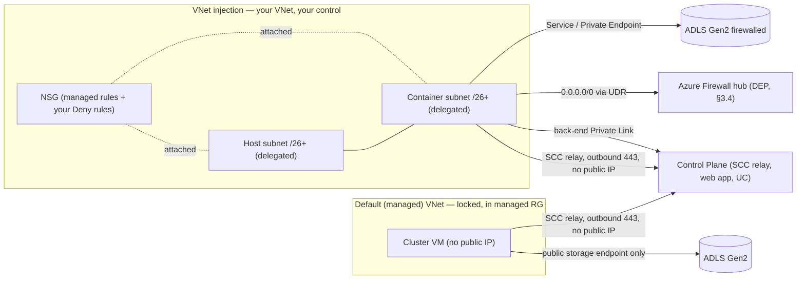
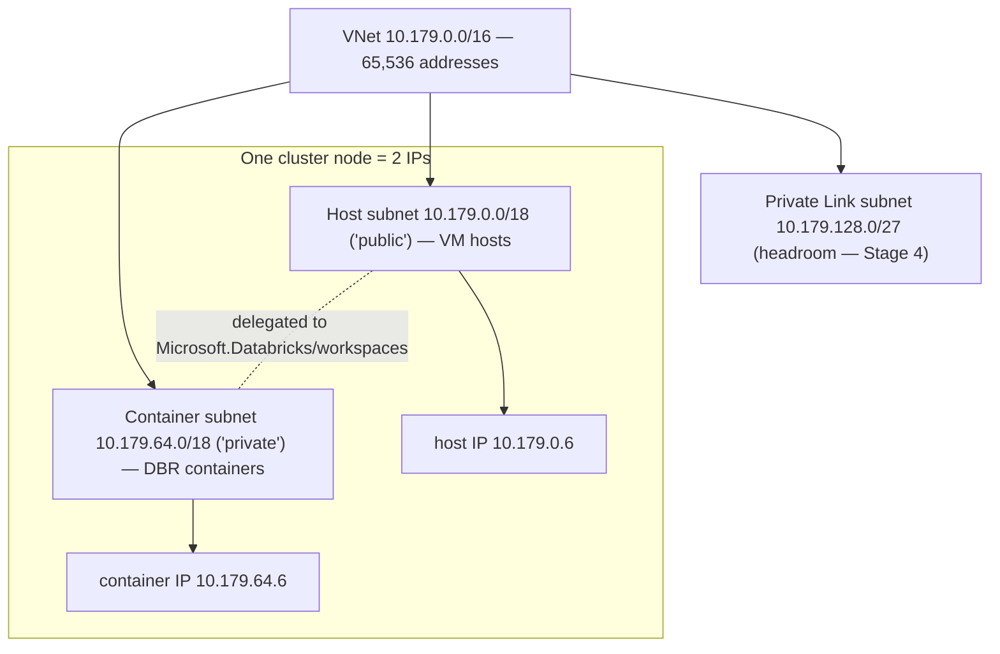
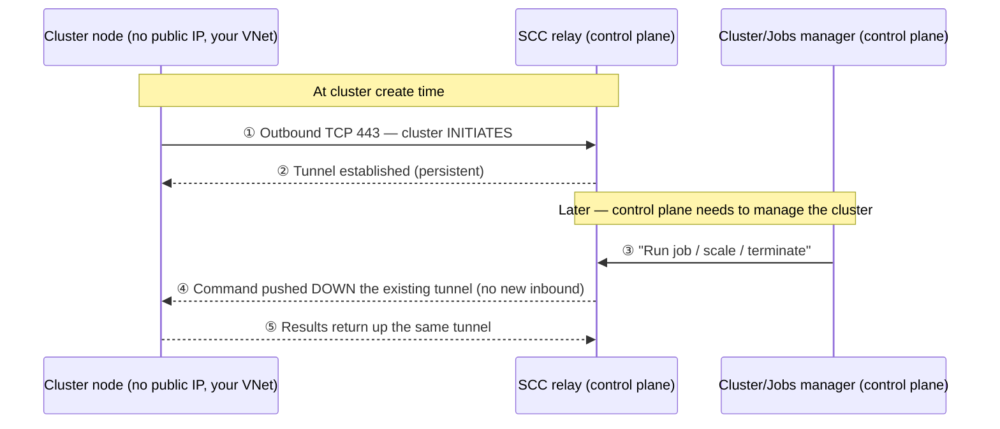
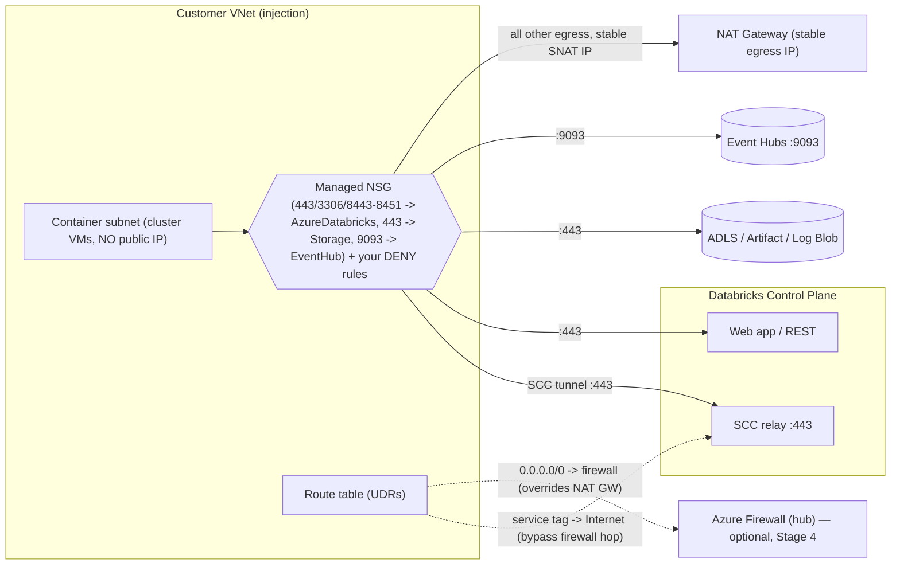
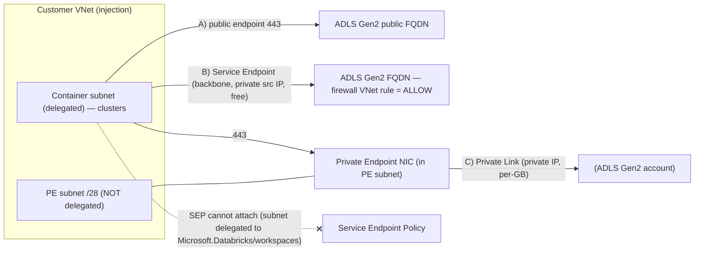

# Stage 3 — Classic Compute Plane Networking (Azure-first)

> **Topic page (architect altitude).** This is the consolidated lesson for the
> whole module. Classic compute is where Databricks runs Spark on **VMs in *your*
> Azure subscription / VNet** — so it is the one compute model where the customer's
> network team actually owns and hardens the pipes. Five subtopics, in the order you
> design them:
>
> - **3.1** Default (managed) VNet vs **VNet injection** — *who owns the network.*
> - **3.2** Subnets & address-space **sizing** — *how big, and why it's permanent.*
> - **3.3** **Secure Cluster Connectivity (SCC) / No Public IP** — *securing path ② (compute ↔ control).*
> - **3.4** **Egress** — NSG, UDR, NAT gateway — *the outbound plumbing under paths ② and ③.*
> - **3.5** **Compute → storage** — public / service / private endpoints — *securing path ③ (cluster → your data).*
>
> Builds on Stage 1 (IP/CIDR, NSG fundamentals) and Stage 2 (two planes, **three
> connectivity paths**). The next stage (Private Link / DNS / transit) removes the
> last public hops these controls leave in place.

---

## 🧠 Mental model for the whole module (hold this in your head)

> **Classic compute is a building you lease land for and fit out yourself.** Stage 2
> told you there are only **three doors** (① users in, ② compute ↔ control, ③ compute
> → your data). Stage 3 is the *construction project* for the building behind doors ②
> and ③:
>
> 1. **Pick the lot** — managed VNet (a *locked serviced apartment* you can't remodel)
>    vs **VNet injection** (a *plot of land you build on*). **This choice is permanent.**
> 2. **Pour the foundation** — two equal "address streets" (host + container subnets);
>    you can never re-pave them, so size for **peak occupancy** on day one.
> 3. **Wire the intercom (SCC)** — the building always **dials out** to the control
>    plane, so there's never an inbound door to guard.
> 4. **Build the loading dock (egress)** — **NSG** decides *if* a truck may leave,
>    **UDR** decides *which road*, **NAT gateway** decides *what return address* it leaves from.
> 5. **Run a private corridor to the shop (storage)** — public endpoint, a **Service
>    Endpoint** (recognised badge over the backbone), or a **Private Endpoint** (a
>    branch counter inside your building).
>
> **The one sentence to carry into a customer room:** *SCC keeps clusters private in
> both VNet models — VNet injection is what lets you own and harden every other hop,
> and almost every sizing/egress/storage decision in this module is a **one-way door**
> you must get right on day one.*

---

## Terms used here (define-before-use)

Quick glosses for terms this module leans on, with the module that owns the deep
dive — so the page reads top-to-bottom without an unexplained term.

| Term | 2–3 line plain gloss | Owns the deep dive |
| --- | --- | --- |
| **VNet (Azure Virtual Network)** | An isolated private IP address space in your subscription where VMs get private IPs and talk to each other. | Stage 1 / 2.2 (back-ref) |
| **Subnet · CIDR / `/n`** | A subnet is a slice of the VNet range; CIDR `/n` counts the fixed network bits — *bigger number = smaller block* (`/26` = 64 addrs, `/24` = 256). | Stage 1.1 (back-ref) |
| **NSG (Network Security Group)** | A stateful allow/deny firewall on a subnet or NIC. It filters by IP/port/service-tag at **L4** — not by FQDN. | §3.4 here |
| **UDR (User-Defined Route) / route table** | A custom routing rule that overrides Azure's defaults — e.g. "send all `0.0.0.0/0` to my firewall." | §3.4 here |
| **NIC (Network Interface Card)** | The virtual adapter giving a VM/container an IP on a subnet; a Databricks node gets one host NIC + one container NIC (the "2 IPs per node"). | §3.2 here |
| **NAT gateway / SNAT** | Azure egress device giving a subnet a **stable, static outbound (SNAT) public IP** and scaling SNAT ports to avoid port exhaustion. | §3.3 / §3.4 here |
| **Service tag** | A Microsoft-maintained named group of IP ranges (e.g. `AzureDatabricks`, `Storage`, `EventHub`) you reference in NSG/UDR rules instead of raw IPs; Microsoft keeps them current. | §3.4 here |
| **Service endpoint vs Private endpoint** | A *service endpoint* routes a subnet's traffic to an Azure PaaS over the backbone (free, subnet-scoped); a *private endpoint* gives the service a **private IP (NIC) inside your VNet** (per-GB cost, works from on-prem). | §3.5 here |
| **SCC / No Public IP (NPIP)** | Secure Cluster Connectivity — cluster VMs have no public IP and no open inbound ports; the cluster dials **out** to the SCC relay. | §3.3 here |
| **SCC relay** | The control-plane endpoint the cluster dials out to (443); it tunnels management traffic *back down* the connection the cluster opened. | §3.3 here |
| **Subnet delegation** | Handing a named Azure service (`Microsoft.Databricks/workspaces`) permission to deploy into and manage a specific subnet. | §3.1 here |
| **Network intent policy** | The service-managed set of NSG rules + network settings Databricks applies and keeps reconciled on the delegated subnets. | §3.1 here |
| **DEP (data exfiltration protection)** | Forcing egress through an Azure Firewall that allowlists only approved FQDNs, so data can't leave to arbitrary hosts. | §3.4 here / Stage 4 |
| **Back-end Private Link / Private DNS zone** | Private Link gives a public Azure service a private IP in your VNet; *back-end* PL makes the compute → control hop fully private (resolved via `privatelink.azuredatabricks.net`). | Stage 4 (fwd-ref) |
| **NCC (Network Connectivity Configuration)** | The *serverless* equivalent of this module's controls — serverless isn't in your VNet, so subnet-scoped controls don't apply. | Stage 4/5 (fwd-ref) |
| **RFC 1918** | The private IPv4 ranges (`10/8`, `172.16/12`, `192.168/16`) safe to use inside a VNet without colliding with the public internet. | Stage 1.1 (back-ref) |

---

## Where each subtopic sits on the three-path scaffold (from Stage 2.2)

| Path | What travels | Stage-3 control |
| --- | --- | --- |
| **① User → Databricks** | Browser / BI / REST → workspace URL | *Not in Stage 3* — IP access lists / front-end Private Link (Stage 4) |
| **② Compute ↔ Control** | Cluster phones home to be managed | **3.3 SCC** closes the inbound half; **3.4 egress** carries the outbound half; back-end PL (Stage 4) makes it private |
| **③ Compute → Storage** | Cluster reads/writes your ADLS data | **3.5 service/private endpoint + storage firewall**; **3.4 egress** is the plumbing it leaves through |
| **(All paths)** | — | **3.1 injection** decides who owns the pipes; **3.2 sizing** decides how many nodes can ever run |

> **Static topology** for the whole module is saved alongside this lesson as
> [`architecture.svg`](architecture.svg) (also embedded in `index.html`) — one
> picture: managed-vs-injected VNet, the two delegated subnets, SCC outbound to the
> relay, the NSG→UDR→NAT egress chain, and the three storage routes to one ADLS
> account.

---

# 3.1 — Default (managed) VNet vs VNet injection

## What it is / why it matters

Every classic workspace runs its cluster VMs (driver + workers) inside an Azure
**VNet** in *your* subscription. The only question is **who owns and configures it**:

- **Default (managed) VNet** — if you don't pick a network, Databricks **auto-creates
  a locked VNet** in the workspace's **managed resource group**. You don't size it,
  can't edit its NSGs, can't add routes/endpoints. Zero config, works out of the box.
  *Analogy: a serviced apartment — furnished, locked, move-in ready, but you can't
  knock down a wall.*
- **VNet injection** — you pre-create the VNet + its two subnets, then deploy the
  workspace into it. Now *you* own the address space, NSG egress rules, UDRs,
  service/private endpoints, and on-prem connectivity. *Analogy: a plot of land you
  build on.* **This is the enterprise baseline.**

**The choice is irreversible** (you can't convert managed → injection; that's a
rebuild + migration) and it **gates every advanced control**: NSG egress rules,
UDR→firewall, service/private endpoints to ADLS, back-end Private Link, on-prem
routing — *all require injection*. SCC / No Public IP itself works in **both**
models; injection adds the *customization* around it.

## Traffic path

- **Managed VNet:** `cluster (private IP, no public IP) → SCC relay (outbound 443) →
  control plane`, and `cluster → ADLS over the public storage endpoint` (no firewall
  lockdown possible). Secure-by-default for path ②; path ③ and egress are wide open.
- **Injection:** *identical* control↔compute path, but now you can bolt on NSG egress
  allowlists, a UDR sending `0.0.0.0/0` to Azure Firewall (DEP, §3.4), a
  `Microsoft.Storage` service endpoint or private endpoint to ADLS (§3.5), and
  back-end Private Link to the control plane (Stage 4).

### The pieces injection adds

- **Subnet delegation to `Microsoft.Databricks/workspaces`** — both subnets must be
  delegated. Delegation hands Databricks permission to deploy NICs, attach the managed
  NSG rules, and apply the network intent policy. *Analogy: giving a trusted
  contractor a key to one room so they can install and maintain the fixtures there.*
  The Portal adds it automatically; in Terraform/Bicep you declare it explicitly
  before the workspace deploys.
- **The network intent policy (the "immutable" managed config)** — a service-managed
  set of NSG rules + settings Databricks **owns and keeps reconciled** on the
  delegated subnets. The docs say *"Do not modify or delete these rules"* — if you
  change them, Databricks reverts them. You **add** your own Deny rules; you don't
  **edit** the managed ones. Internal policies also **block cross-cluster /
  cross-workspace traffic** even in the same VNet — a built-in isolation guarantee.

## WHY IT BREAKS (cause → effect)

- **"We'll start managed for the POC and inject later."** → Cause: the choice is set
  at creation and **not convertible**. Effect: a managed workspace that later needs
  Private Link/firewall is a **full rebuild + migration**. *First move:* default any
  production-bound workspace to injection on day one.
- **IaC deploy fails (`SubnetMissingRequiredDelegation`-style).** → Cause: a subnet
  isn't delegated to `Microsoft.Databricks/workspaces`. Effect: workspace won't
  deploy / subnets unusable. *First check:* `az network vnet subnet show … --query
  delegations` on both subnets.
- **"Our NSG tightening doesn't stick."** → Cause: someone edited a *managed* rule;
  the intent policy reconciles it back. *First check:* confirm you added your **own**
  Deny rule alongside the managed ones — never edited a managed one.

## ONE illustrative config (not exhaustive)

Full apply-ready VNet-injection IaC is deferred to the **module hands-on artifact**
(see decision at the end). This shows only the lines that *teach the point*: the
delegation block and the one flag that declares injection.

```hcl
resource "azurerm_subnet" "host" {                 # "public" subnet — both are PRIVATE under SCC
  name                 = "adb-host"
  virtual_network_name = azurerm_virtual_network.adb.name
  resource_group_name  = "adb-rg"
  address_prefixes     = ["10.179.0.0/18"]
  delegation {                                      # REQUIRED: lets Databricks manage the subnet
    name = "databricks-del"
    service_delegation {
      name    = "Microsoft.Databricks/workspaces"
      actions = ["Microsoft.Network/virtualNetworks/subnets/join/action",
                 "Microsoft.Network/virtualNetworks/subnets/prepareNetworkPolicies/action",
                 "Microsoft.Network/virtualNetworks/subnets/unprepareNetworkPolicies/action"]
    }
  }
}

resource "azurerm_databricks_workspace" "this" {
  name                = "adb-injected"
  resource_group_name = "adb-rg"
  location            = "eastus"
  sku                 = "premium"                   # Premium needed for PL / IP ACLs downstream
  custom_parameters {
    virtual_network_id  = azurerm_virtual_network.adb.id   # <-- THIS declares VNet injection
    public_subnet_name  = azurerm_subnet.host.name
    private_subnet_name = azurerm_subnet.container.name
    no_public_ip        = true                      # SCC / NPIP — recommended in both models
  }
}
```

**Portal:** Create → Azure Databricks → **Networking** tab → *Deploy … in your own
VNet = Yes* → pick the VNet + host/container subnets → leave *No Public IP = Yes*.
The managed VNet is simply the **absence** of these network fields (don't inject).
Verify post-deploy: VNet → Subnets → both show an attached NSG + *Delegation =
`Microsoft.Databricks/workspaces`*.



## Comparison table

| Dimension | Default (managed) VNet | VNet injection |
| --- | --- | --- |
| Who owns the VNet | Databricks, locked, in managed RG | You, in your subscription |
| CIDR / address space | Auto, not selectable | You choose (`/16`–`/24` VNet, subnets ≥ `/26`) |
| NSG egress Deny rules | ❌ can't add | ✅ add (don't edit managed ones) |
| UDR / route to firewall (DEP) | ❌ | ✅ |
| Service / private endpoint to ADLS | ❌ | ✅ |
| Back-end Private Link | ❌ | ✅ |
| On-prem (UDR / ExpressRoute) | ❌ | ✅ |
| SCC / No Public IP | ✅ default | ✅ default, recommended |
| Convert later | ❌ not convertible | n/a |
| Use it for | POC / demo / training | Any production / regulated workload |

## Uses, edge cases & limitations

- **Uses:** *managed* = throwaway POC/demo/training with zero network requirements;
  *injection* = every production/regulated deployment and the prerequisite for storage
  firewalling, firewall egress, private endpoints, back-end PL, on-prem access.
- **Edge cases:** irreversibility (managed → injection = rebuild); IP exhaustion in
  under-sized injected subnets (§3.2, can't resize in place); **Service Endpoint
  *Policy*** availability is a moving target — *workspaces created on/after
  **2025-07-14** support service endpoint policies by default; older workspaces need
  **account-team enablement*** (requires injection + SCC + an **unlocked RG**); editing
  managed NSG rules is futile (intent policy reverts); the managed network policy blocks
  cross-cluster/cross-workspace traffic — don't design around it.
- **Limitations:** managed VNet is opaque and locked (security teams can't inspect/harden
  it; can't host VMs in the managed RG); injection needs **Network Contributor** and
  co-regional, same-subscription, dedicated (non-shared) subnets; subnet CIDRs are
  **immutable** post-deploy; managed-vs-injection is **permanent**.

## FDE field notes

- **Customer asks:** *"Can we change our mind later?"* → No, it's not convertible — get
  it right on day one. *"Can our security team apply Deny rules to the Databricks
  network?"* → Only with injection. *"Can we firewall egress / reach private ADLS /
  on-prem SQL?"* → All require injection. *"Does the managed VNet mean public IPs?"* →
  No — SCC/NPIP is default in **both**.
- **Talk-track:** *"The managed VNet is move-in-ready for a sandbox but it's locked.
  For anything facing a security review, inject into a VNet you own so your IPAM, NSG
  Deny rules, firewall egress, and Private Link are all on the table. The catch is the
  choice is permanent — so we default production-bound workspaces to injection."*
- **What breaks + first check:** deploy fails → confirm both subnets declare the
  delegation; tightening doesn't stick → you edited a managed rule (add your own
  instead); clusters won't launch at scale → subnet size vs peak nodes (§3.2); SEP
  "isn't available" → check workspace creation date + injection + SCC + unlocked RG.
- **Decision rule:** managed VNet **only** for throwaway POC/demo/training with zero
  network needs; **injection** for anything production-bound or regulated (and note it
  needs Premium for the downstream controls). When in doubt, **default to injection** —
  the cost of an unused capability is near-zero; the cost of being wrong is a rebuild.

---

# 3.2 — Subnets & address-space sizing

## What it is / why it matters

A VNet-injected workspace needs **two dedicated subnets** in your VNet:

- **Container subnet** (Portal label "private subnet") — the DBR **container** for each
  node (driver/executor) gets its IP here; this is where Spark runs.
- **Host subnet** (Portal label "public subnet") — the Azure **VM host** for each node
  gets its IP here.

*Analogy: a cluster node is a **duplex** — the host subnet is the street the building
sits on, the container subnet is the street the tenant's mailbox is on; every node
needs an address on **both** streets, so the streets must be the **same length**.*
Under SCC **both subnets are private** — nothing in the "public" subnet gets a public
IP; prefer the host/container names (the Portal still shows public/private).

**Why it matters:** *"Subnet CIDR ranges cannot be changed after deployment."*
Sizing is **permanent** — a too-small subnet **caps how many nodes the workspace can
ever run**, and the only fixes involve downtime. It also decides whether you can add a
Private Link subnet later (Stage 4 needs its own subnet in the VNet).

## Traffic path / the sizing math

Each node burns **one IP in each subnet**, so a 10-node cluster uses 10 host IPs **and**
10 container IPs. Size the two subnets **the same** — nodes consume them in lockstep,
so the smaller one is the real ceiling.

- **CIDR limits:** VNet **`/16` → `/24`**; each subnet **up to `/26`** (the recommended
  floor; technical min `/28`, but don't go below `/26`).
- **Azure reserves 5 IPs per subnet** (first four + last) → **usable = total − 5**. A
  `/26` (64) gives **59 usable**, not 64.
- **Max nodes ≈ `2^(32 − subnet_prefix) − 5`**, counted across **all running clusters
  at once** (not per cluster).

| Subnet size | Total | Usable (−5) | ≈ Max nodes |
| --- | --- | --- | --- |
| `/26` | 64 | 59 | ~59 |
| `/24` | 256 | 251 | ~251 |
| `/22` | 1,024 | 1,019 | ~1,019 |
| `/20` | 4,096 | 4,091 | ~4,091 |

**Worked example:** VNet `10.179.0.0/16`; host `10.179.0.0/18`, container
`10.179.64.0/18` (each `/18` = 16,379 usable — far above one workspace's peak) — and
it leaves `10.179.128.0/18` **free** inside the `/16` for a `/27`–`/28` Private Link
subnet later. Sizing the **VNet a couple of bits larger** than the subnets is the
whole point of the recommendation.

## WHY IT BREAKS (cause → effect)

- **Cluster won't start / autoscale stalls (insufficient-IP error).** → Cause: subnet
  sized for *today's* cluster, not **peak concurrent** nodes; autoscaling + parallel
  jobs + pools consume IPs simultaneously, and terminating nodes hold IPs briefly.
  *First check:* free-IP count on **both** host and container subnets vs peak nodes ×
  2 — not the size of the one cluster that failed.
- **Back-end Private Link down after "we moved the workspace."** → Cause: a
  network-config migration re-homed the workspace to a **new VNet**; the old private
  endpoint + `privatelink.azuredatabricks.net` Private DNS zone are tied to the old
  VNet. *First check:* whether a migration ran; delete + recreate the PE and zone.

**Changing CIDR after deploy (downtime, VNet-injection only):** you cannot edit a
subnet CIDR in place. Two supported paths, both with downtime: (1) **Update workspace
network configuration** *(Public Preview)* — ARM redeploy onto a new larger VNet; you
**must terminate all clusters/jobs first** (that *is* the downtime), ~15 min apply,
**Terraform not supported**, and **back-end PL breaks** on the VNet move; or (2)
**contact your account team** for a CIDR increase. There is no zero-downtime
self-service resize — **size correctly on day one.**

## ONE illustrative config (not exhaustive)

The permanent, must-be-right-day-one part is the **sizing + delegation** (the full
deployable workspace module is in §3.3 / the hands-on artifact):

```hcl
resource "azurerm_virtual_network" "adb" {
  name                = "adb-vnet"
  location            = "eastus"
  resource_group_name = "adb-rg"
  address_space       = ["10.179.0.0/16"]      # /16: room for big subnets + a future PL subnet
}
resource "azurerm_subnet" "host" {             # one host IP per node
  name                 = "adb-host"
  resource_group_name  = "adb-rg"
  virtual_network_name = azurerm_virtual_network.adb.name
  address_prefixes     = ["10.179.0.0/18"]     # /18 = 16,379 usable — far above one workspace's peak
  delegation { name = "databricks-del"
    service_delegation { name = "Microsoft.Databricks/workspaces"
      actions = ["Microsoft.Network/virtualNetworks/subnets/join/action",
                 "Microsoft.Network/virtualNetworks/subnets/prepareNetworkPolicies/action",
                 "Microsoft.Network/virtualNetworks/subnets/unprepareNetworkPolicies/action"] } }
}
resource "azurerm_subnet" "container" {        # MUST equal host size, MUST NOT overlap
  name                 = "adb-container"
  resource_group_name  = "adb-rg"
  virtual_network_name = azurerm_virtual_network.adb.name
  address_prefixes     = ["10.179.64.0/18"]
  # ...same delegation block...
}
# 10.179.128.0/18 left FREE in the /16 — headroom for a /27–/28 Private Link subnet (Stage 4).
```

**Portal:** Create a VNet, set the IPv4 space a couple of bits larger than the subnets,
**+ Add subnet** twice (host + container, equal size, non-overlapping, leave a gap),
then deploy the workspace into them. Verify: VNet → Subnets → both show an NSG +
delegation; after a cluster runs, the managed RG shows VMs/NICs in **both** subnets.



## Comparison table — picking a subnet size

| Subnet | Usable | ≈ Max nodes | Use when | Watch out for |
| --- | --- | --- | --- | --- |
| `/26` | 59 | ~59 | Dev / small / capped clusters | Recommended floor; easy to exhaust under autoscale |
| `/24` | 251 | ~251 | Typical team workspace | Fine for most; still budget for peak concurrency |
| `/22` | 1,019 | ~1,019 | Large shared / big jobs | Keep the VNet `/n` small enough to fit a PL subnet |
| `/21`–`/20` | 2,043 / 4,091 | ~2,043 / ~4,091 | Very large / many concurrent clusters | A `/20` subnet needs a `/19`–`/18` VNet for headroom |

## Uses, edge cases & limitations

- **Uses:** every injection deployment; the first sizing decision before SCC, egress,
  and Private Link layer on top — the number you bring to a capacity-planning chat.
- **Edge cases:** IP exhaustion under autoscale (budget peak, not average); multiple
  workspaces in one VNet (subnets can't be shared — plan the VNet to hold them all); no
  room left for a Stage-4 PL subnet; a CIDR change breaks back-end PL; new VNets after
  **2026-03-31** have no default outbound — pair subnets with a NAT gateway (§3.4).
- **Limitations:** VNet `/16`–`/24`, subnets ≥ `/26`; CIDR **immutable in place**
  (resize = downtime, injection-only); **Terraform not supported** for the
  update-network-config flow; both subnets must be **delegated**.

## FDE field notes

- **Customer asks:** *"How many nodes can this workspace ever run?"* → the formula
  (usable IPs in one subnet, across all running clusters). *"Can we resize later?"* →
  no in-place resize; it's a downtime migration or account-team increase. *"How big a
  CIDR do you need?"* → come with a number: peak nodes × 2 + 5, rounded to a `/n`, plus
  VNet headroom. *"Will it collide with on-prem?"* → must be RFC 1918 space not
  overlapping anything reachable over ExpressRoute/VPN.
- **Talk-track:** *"Sizing is a one-way door — the subnet CIDR is permanent, so we size
  for your **peak concurrent** node count on day one and leave the VNet a couple of bits
  larger so back-end Private Link fits later without a re-home."*
- **Decision rule:** dev/small → `/26`; typical team → `/24`; large/concurrent →
  `/22`–`/20` (verify VNet leaves PL room). **When peak is unknown, size up** — IPs are
  free; a resize is a downtime outage.

---

# 3.3 — Secure Cluster Connectivity (SCC) / No Public IP

## What it is / why it matters

**SCC (a.k.a. No Public IP / NPIP)** means your **cluster VMs get no public IP** and
your VNet has **no open inbound ports**. Normally a control plane that manages a VM
would have to *call into* it (open an inbound port, attach a public IP). SCC **flips
the direction**: the cluster places one **outbound** call to a Databricks endpoint
called the **SCC relay**, and the control plane sends all commands back down that
already-open connection. Nothing needs to reach *in*, so there is **nothing to attack
from the internet**.

*Analogy — the customer-service callback:* without SCC the control plane is a manager
who has to knock on each cluster's front door (an open inbound port). With SCC the
cluster **phones the manager first** and keeps the line open — the manager just talks
back down the call. **You can't knock on a door that doesn't exist.**

**Why it matters:** SCC is the **recommended baseline** and **on by default** for new
workspaces (`enableNoPublicIp` defaults to `true` in API `2024-05-01`+). In a security
review, "do cluster VMs have public IPs?" and "are inbound ports open?" are the first
two questions — with SCC the answer to both is *no*. The senior nuance: **which way the
call goes**, and **what SCC does *not* yet protect** (the control-plane-side public
endpoint, until Private Link).

## Traffic path (the heart of it — draw this)

1. **Cluster create** → each node opens **one outbound TCP 443 (HTTPS/TLS)** connection
   to the control-plane **SCC relay** (a *different* control-plane IP than the web app /
   REST API). The cluster is the **client**; the connection is established **from inside
   your VNet, outward**.
2. That connection becomes a persistent **tunnel**.
3. When the control plane needs to manage the cluster (run a job, scale, terminate), it
   **does not open a new inbound connection** — it pushes the request **back down the
   tunnel** the cluster opened.
4. Result: **no inbound NSG rule, no public IP on the VM, no listening port.** The only
   thing your network must permit is **outbound 443 to the SCC relay** (+ the other
   egress in §3.4).



**The most-probed nuance — why CP↔DP still uses public IPs until Private Link:** "No
public IP" means the *VM* has no public IP and there are *no inbound ports*. It does
**not** mean the connection avoids public addressing entirely. The cluster's
**outbound** call to the SCC relay still targets a **public IP endpoint** of the
control plane (resolved via public DNS — that's why the `AzureDatabricks` **service
tag** appears in your egress allowlist). The *transport* rides the **Microsoft
backbone** (true even with SCC disabled), but the *endpoint addressing* is public.
**Back-end Private Link** (Stage 4) replaces that public-IP hop with a private endpoint
— after which the `AzureDatabricks` egress tag is no longer required.

> **Recap:** *SCC closes the **inbound** door and removes public IPs from your VMs.
> Private Link then makes the remaining **outbound** call private too.* SCC is
> necessary but not sufficient for a fully private deployment.

**Egress / stable IP:** because the cluster now initiates everything outbound, egress is
the thing you manage. Managed VNet + SCC → Databricks auto-creates a NAT gateway you
can't modify. Injection + SCC (recommended) → **you** attach an **Azure NAT Gateway**
(Standard, static IP) to **both** subnets for a **stable egress IP** partners can
allowlist. **Don't use an egress load balancer** (SNAT port exhaustion). After
**2026-03-31** new Azure VNets default to **no implicit outbound** — so a NAT gateway is
effectively **mandatory** for new injected workspaces.

## WHY IT BREAKS (cause → effect)

- **Clusters fail to start / time out on launch.** → Cause: **outbound 443 to
  `AzureDatabricks`** is blocked, or no NAT gateway on a new VNet. *First check:* egress
  to the `AzureDatabricks` service tag + a NAT gateway on both subnets — **not** inbound
  rules.
- **Worked, then stopped after a firewall/IP change.** → Cause: someone allowlisted the
  SCC relay by **raw IP**; Databricks rotates those IPs. *First check:* switch to the
  `AzureDatabricks` **service tag / FQDN**.
- **VM unexpectedly shows a public IP.** → Cause: SCC didn't apply. *First check:*
  Managed RG → VM → Properties → Networking → **Public IP must be empty.**

## ONE illustrative config (not exhaustive)

`no_public_ip = true` **is the entire SCC switch in IaC** — everything else is the
injection scaffold it sits on. Full NAT/NSG wiring is in the hands-on artifact.

```hcl
resource "azurerm_databricks_workspace" "this" {
  name                = "adb-scc-ws"
  resource_group_name = "adb-rg"
  location            = "eastus"
  sku                 = "premium"
  custom_parameters {
    no_public_ip        = true                       # <-- THIS is SCC / No Public IP
    virtual_network_id  = var.vnet_id
    public_subnet_name  = var.host_subnet_name       # "public" = host subnet (still PRIVATE under SCC)
    private_subnet_name = var.container_subnet_name
    public_subnet_network_security_group_association_id  = var.host_nsg_assoc_id
    private_subnet_network_security_group_association_id = var.container_nsg_assoc_id
  }
}
```

**ARM:** set `parameters.enableNoPublicIp.value = true` (defaults to `true` in API
`2024-05-01`+). **Portal:** Create → Networking → *Secure Cluster Connectivity (No
Public IP) = Yes* (the default). Adding SCC to an existing workspace requires injection,
**stopping all compute**, and **>15 min** downtime — it's not a hot toggle.

## Comparison table — SCC disabled vs enabled vs + Private Link

| Aspect | SCC disabled (legacy) | SCC enabled (default) | + back-end Private Link |
| --- | --- | --- | --- |
| Cluster VM public IP | Yes (one/node) | **No** | No |
| Open inbound ports | Yes | **No** | No |
| Call direction | CP **inbound** into VNet | Cluster **outbound** to relay | Cluster outbound to **private** relay |
| CP-side endpoint | Public IP (CP NAT) | **Public IP** (SCC relay) | **Private IP** (PE) |
| Needs `AzureDatabricks` egress tag | Yes | **Yes** | **No longer required** |
| Admin burden | Inbound + outbound | **Outbound only** | Outbound only, fully private |

## Uses, edge cases & limitations

- **Uses:** the default secure baseline for every classic workspace; clears "no public
  IPs / no inbound ports" in a questionnaire at no cost beyond egress; stable-egress
  allowlisting via NAT.
- **Edge cases:** adding SCC to an existing workspace = stop compute + >15 min downtime;
  firewall/NSG drift if you allowlist by IP (prefer service tag/FQDN); egress LB → SNAT
  exhaustion; **serverless doesn't use SCC** (different mechanism, also no public IPs —
  don't conflate).
- **Limitations:** SCC does **not** make the control-plane connection private (relay is
  public until back-end PL); it secures **path ② only**; managed VNet + SCC gives an
  unmodifiable auto-NAT; requires explicit egress (NAT), increasingly mandatory after
  2026-03-31.

## FDE field notes

- **Customer asks:** *"Do VMs have public IPs / open inbound ports?"* → No to both.
  *"Does any management traffic hit the public internet?"* → inbound path is gone, but
  the outbound relay call targets a **public** CP endpoint over the backbone **until
  back-end PL**. *"Stable egress IP?"* → yes, NAT gateway + static Standard IP. *"Is it
  default?"* → yes for new Portal/ARM workspaces.
- **Talk-track:** *"SCC flips the call direction — your cluster phones the control plane
  outbound, so no public IP and no inbound port. It's the secure default at no cost
  beyond egress. To make that outbound hop private too, layer on back-end Private Link."*
- **Decision rule:** **always keep SCC on** (never disable except a brief rollback); add
  **back-end Private Link** only when a regulatory profile mandates *no control-plane
  traffic on a public IP* (costs more, needs Premium); add **UDR → Azure Firewall** for
  egress/exfiltration control (§3.4).

---

# 3.4 — Egress: NSG rules, UDRs, NAT gateway

## What it is / why it matters

Three Azure primitives control **outbound (egress)** traffic from your cluster subnets:

- **NSG** — a stateful allow/deny list (by protocol/port/destination). *Bouncer with a
  guest list.* Databricks **auto-manages** the baseline outbound rules; you add **deny**
  rules around them.
- **UDR** — a route-table entry that **overrides** Azure's default routing. *Detour sign
  rerouting cars through a checkpoint.* NSG says *whether* a packet may leave; UDR says
  *where it goes*.
- **Azure NAT Gateway** — gives a private subnet a **single stable public IP** for
  outbound (SNAT) while blocking unsolicited inbound. *The building's shared mail-truck.*

**One-line framing:** **NSG = *allowed?*, UDR = *which path?*, NAT = *what public IP /
who scales the ports?*** Under SCC the VMs are private, so they need an explicit egress
path to reach the **control plane / SCC relay, metastore, artifact & log storage,
telemetry** — plus data sources and library repos. Get egress wrong and clusters won't
start, libraries won't install, or data can leave anywhere.

## Traffic path — what a cluster must reach (service tags, not raw IPs)

| Destination (service tag) | Port | What it's for |
| --- | --- | --- |
| **AzureDatabricks** | TCP 443 | Databricks infra, data sources, library repos; SCC relay tunnel + web app/REST |
| **AzureDatabricks** | TCP 3306 | Legacy Hive metastore |
| **AzureDatabricks** | TCP 8443 | Internal compute → control-plane API calls |
| **AzureDatabricks** | TCP 8444 | Unity Catalog logging + lineage streaming |
| **AzureDatabricks** | TCP 8445–8451 | Reserved for future use (open the whole 8443–8451 range) |
| **Storage** | TCP 443 | Artifact + log Blob storage (DBR images, init/cluster logs) |
| **EventHub** | TCP 9093 | Telemetry / logging to Azure Event Hubs |
| **Sql** | TCP 3306 | Legacy metastore via `Sql` tag — being removed for new workspaces |

Plus: **Microsoft Entra ID** tag (optional, for cluster auth to other Azure resources)
and **ports 111 + 2049** (NFS-based library installs if you tighten egress).

- **NSG baseline (managed):** with VNet injection, Databricks auto-provisions exactly
  these outbound rules via subnet delegation — **do not modify or delete them** (delete
  the 8443–8451 rule and UC lineage/internal calls break; the platform re-adds it,
  churning your IaC). With SCC enabled there are **no inbound rules** opening internet
  ports (inbound 22 + 5557 from `AzureDatabricks` are added **only if SCC is disabled** —
  the old model you avoid). **What you add:** Deny rules on *other*/peered subnets'
  NSGs to cut lateral movement; optionally a region-scoped `Storage` service-endpoint
  rule (§3.5).
- **UDRs — two reasons:** (1) **fix broken routing** — if a `0.0.0.0/0` route forces all
  traffic to on-prem (forced tunneling), cluster traffic to `AzureDatabricks` is
  black-holed; add UDRs sending the required service tags **straight to Internet**.
  (2) **force egress through a firewall** — add `0.0.0.0/0 → Virtual appliance (Azure
  Firewall private IP)` so all *other* egress is inspected/allowlisted (the DEP
  pattern), while keeping the service-tag→Internet UDRs so the **SCC relay skips the
  firewall hop**.
- **NAT Gateway:** managed VNet auto-creates one (unmodifiable); injection → **you**
  attach one to **both** subnets for a stable allowlist-able IP (the Databricks
  recommendation, effectively required after 2026-03-31). **No route table needed** — it
  "just works"; you only add UDRs to *override* it.

> **Routing precedence (important):** a `0.0.0.0/0` UDR to an NVA/firewall or VNet
> gateway **overrides the NAT Gateway**. Azure order: *UDR to NVA/gateway » NAT Gateway »
> instance public IP » LB outbound rules » default system route.* So if you both attach
> a NAT Gateway **and** route `0.0.0.0/0` to a firewall, the **firewall's** IP is the
> egress source — allowlist *that*, not the NAT IP.

## WHY IT BREAKS (cause → effect)

- **Clusters never reach "Running" on a brand-new VNet.** → Cause: post-2026-03-31 no
  implicit outbound. *First check:* a NAT Gateway on **both** subnets — don't assume a
  CP outage.
- **Clusters launch but UC lineage/logging or internal calls fail.** → Cause: the
  managed **8443–8451** outbound rule was deleted/edited or shadowed by a higher-priority
  deny. *First check:* that managed rule.
- **Intermittent artifact/log failures in a region-paired region.** → Cause: a workspace's
  *secondary* artifact storage lives in the paired region (Japan East → Japan West) and
  the region-scoped `Storage`/`EventHub` UDR omits it. *First check:* include the
  secondary region's tag.
- **Partner allowlist rejects traffic despite a NAT Gateway.** → Cause: a `0.0.0.0/0 →
  firewall` UDR overrides the NAT; the firewall's IP is the real source. *First check:*
  the route table for that UDR — allowlist the firewall IP instead.
- **`pip install` hangs after egress hardening.** → Cause: NFS ports closed / repos
  blocked. *First check:* ports **111 + 2049** open and PyPI/CRAN/Maven FQDNs allowed at
  the firewall.

## ONE illustrative config (not exhaustive)

The point: a stable NAT + a firewall UDR that keeps the relay direct + a deny rule
on a *neighbor* subnet (never the managed Databricks NSG). Full module → hands-on
artifact.

```hcl
resource "azurerm_nat_gateway" "adb" {                       # stable egress (mandatory for new VNets)
  name = "adb-nat"; location = "eastus"; resource_group_name = "adb-rg"; sku_name = "Standard"
}
# (associate a Static Standard public IP + attach to BOTH subnets — omitted for brevity)

resource "azurerm_route" "to_firewall" {                     # all other egress -> Azure Firewall
  name = "to-firewall"; resource_group_name = "adb-rg"; route_table_name = azurerm_route_table.adb.name
  address_prefix = "0.0.0.0/0"
  next_hop_type  = "VirtualAppliance"
  next_hop_in_ip_address = "10.10.0.4"                       # NOTE: this 0.0.0.0/0 UDR OVERRIDES the NAT GW
}
resource "azurerm_route" "databricks_direct" {               # keep SCC relay DIRECT (skip firewall hop)
  name = "databricks-direct"; resource_group_name = "adb-rg"; route_table_name = azurerm_route_table.adb.name
  address_prefix = "AzureDatabricks"                          # service tag as route prefix (repeat: Storage, EventHub)
  next_hop_type  = "Internet"
}
resource "azurerm_network_security_rule" "deny_to_adb" {     # harden a NEIGHBOR subnet — NOT the managed ADB NSG
  name = "deny-to-databricks"; resource_group_name = "adb-rg"; network_security_group_name = "neighbor-nsg"
  priority = 4000; direction = "Outbound"; access = "Deny"; protocol = "*"
  source_port_range = "*"; destination_port_range = "*"; source_address_prefix = "*"
  destination_address_prefix = "10.179.0.0/16"               # the Databricks VNet range
}
```

**Portal:** NAT gateway → attach to both subnets; Route tables → add `0.0.0.0/0 →
Virtual appliance` (firewall IP) + `AzureDatabricks/Storage/EventHub → Internet`,
associate to both subnets; inspect the managed NSG outbound rules (read-only intent —
don't delete), add Deny rules on neighbor subnets.



## Comparison table — egress methods

| Method | Controls | Stable IP? | Filters traffic? | Cost | Use when |
| --- | --- | --- | --- | --- | --- |
| **NAT Gateway** | Outbound SNAT for a subnet | **Yes** (1–16 IPs) | No | Hourly + per-GB | Default egress for injection; allowlists; avoids SNAT exhaustion |
| **UDR → Azure Firewall** | *Path* + FQDN filtering at the firewall | Yes (FW IP) | **Yes** (FQDN, logging) | FW hourly + per-GB | DEP; regulated egress allowlists |
| **UDR → Internet (service tag)** | Keep required destinations direct | Via NAT behind it | No | Free | Bypass forced-tunnel; keep relay off the firewall hop |
| **NSG deny rules** | *Whether* a connection is allowed (L4) | n/a | L4 only | Free | Block lateral movement |
| **Egress load balancer** | Outbound (legacy) | Yes | No | LB cost | **Avoid with SCC** (SNAT exhaustion) |
| **Default outbound access** | Implicit outbound | No | No | Free | **Gone for new VNets after 2026-03-31** |

## Uses, edge cases & limitations

- **Uses:** make SCC clusters start with least-privilege egress; present a stable
  outbound IP for partner/IP-access-list allowlists; front the exfiltration-protection
  design (NSG denies + UDR→firewall).
- **Edge cases:** post-2026-03-31 no implicit outbound; region-paired secondary storage;
  Private Link removes the `AzureDatabricks` UDR (but keep Metastore/Artifact/Log/EventHub
  routes); UDR overrides NAT; tightening egress breaks library installs (open 111/2049);
  the `Sql` tag / 3306 is being removed for new workspaces.
- **Limitations:** can't edit managed NSG rules (harden around them); **NSGs are L4 only**
  — "only pypi.org" needs **Azure Firewall** application rules; the `AzureDatabricks` tag
  can't be region-restricted like Storage/EventHub; one NAT Gateway per subnet, single-VNet;
  no egress LB with SCC; StandardV2 NAT isn't an in-place upgrade / not in every region.

## FDE field notes

- **Customer asks:** *"Does cluster traffic hit the public internet?"* → by default yes
  (relay/Storage/EventHub egress on 443 via NAT, encrypted; backbone) — remove with
  back-end PL. *"One stable egress IP?"* → NAT gateway + Static Standard IP on both
  subnets. *"Stop a notebook exfiltrating?"* → NSG denies (L4) + UDR → Azure Firewall
  (FQDN). *"Why can't we edit the NSG rules?"* → platform-managed via delegation; harden
  around them.
- **Talk-track:** *"NSG decides if a packet may leave, UDR decides where it goes, NAT
  decides what public IP you leave from. Give every injection workspace a NAT for a
  stable IP, then add NSG denies and a firewall UDR only when the security team mandates
  outbound allowlisting."*
- **Decision rule:** **always** a NAT Gateway (stable, no SNAT exhaustion); **always**
  NSG deny on neighbor subnets (free, cuts lateral movement); add **UDR → Azure Firewall**
  only for regulated/exfiltration-sensitive FQDN allowlisting — keep service-tag→Internet
  UDRs so the relay skips the hop.

---

# 3.5 — Compute → storage: public / service / private endpoints

## What it is / why it matters

When a classic cluster reads a Delta table it makes an outbound HTTPS call to an **ADLS
Gen2** account — by default over its **public endpoint** (`https://<account>.dfs.core.
windows.net`, a public IP). A **storage firewall** lets you slam that public door shut;
you re-open a *controlled* door one of two ways:

- **Service Endpoint** — flip `Microsoft.Storage` on your **subnet** so Storage traffic
  leaves over the **Azure backbone** with the subnet's **private IP** as source, then add
  a **VNet rule** on the storage firewall ("trust this subnet"). *Free, no DNS change.*
  *Analogy: a staff-only backbone corridor to the shop's back door; the guard recognises
  your building's badge.*
- **Private Endpoint** — drop a **NIC with a private IP** that *is* the storage account
  inside your VNet; the FQDN now resolves to that private IP (via a **Private DNS
  Zone**). *Costs hourly + per-GB, needs DNS, but works from on-prem.* *Analogy: the shop
  opens a private branch counter inside your building.*

**Why it matters:** "Service Endpoint vs Private Endpoint for storage — when and why?"
is one of the most common review/interview questions on this track. Get it wrong and you
either overspend on Private Endpoints or fail a no-public-IP review. And there's a classic
trap: the obvious tool for *which* accounts a subnet may reach — a **Service Endpoint
Policy** — **silently breaks** on Databricks subnets because they're delegated to a
managed service. (Networking decides *where* a packet may go; **Unity Catalog** + an
Access Connector managed identity decides *who* may read — this is the networking half.)

## Traffic path (three routes to one account)

- **A. Public endpoint (insecure baseline):** `cluster (no public IP) → NAT/egress
  (public src IP) → <acct>.dfs.core.windows.net (public IP)`, identity is the only gate —
  a leaked SAS/over-broad role is reachable from the whole internet.
- **B. Storage firewall + Service Endpoint:** set *Public network access = Enabled from
  selected VNets and IPs* (default-deny). Azure injects a more-specific route
  (`nextHopType = VirtualNetworkServiceEndpoint`) that **overrides any `0.0.0.0/0` UDR**,
  so Storage traffic goes straight over the **backbone**; source becomes the VM's
  **private IP**; the firewall matches your **VNet rule** → allow. **DNS unchanged**
  (still public FQDN). Free, subnet+service scoped, egress-only, same-region
  (`Microsoft.Storage.Global` for cross-region), **no on-prem**.
- **C. Private Endpoint:** a **NIC + private IP** in a **dedicated `/27`–`/28` PE subnet**
  (not the delegated subnets), a Private Link mapping to that account's **`dfs`**
  subresource (add **`blob`** if `wasbs`/Blob APIs are used — that's a *second* PE), and a
  **mandatory DNS override** via `privatelink.dfs.core.windows.net` (and/or `.blob.`)
  linked to your VNet. Then you can set **Public network access = Disabled** entirely.
  Real private IP (works from peered VNets + **on-prem** over VPN/ExpressRoute),
  per-account/subresource, GPv2 only, **costs** hourly + per-GB.

**Why Service Endpoint *Policies* fail here:** a SEP is an *allow-only* list of accounts a
subnet may reach. But the Databricks subnets are **delegated to a managed service**, and
the docs are explicit that *"Azure Service Endpoint Policies aren't supported for any
managed Azure services that are deployed into your virtual network."* Because a SEP denies
anything unlisted — including the managed service's own infrastructure storage —
attaching one can **break the workspace**. Use a **Private Endpoint + firewall Disabled**,
or **Azure Firewall + UDR FQDN allowlist** (§3.4) for exfiltration control.



## WHY IT BREAKS (cause → effect)

- **Clusters suddenly can't read after lockdown.** → Cause: `default_action = Deny` set
  **before** the VNet rule / Service Endpoint existed on **both** subnets. *First check:*
  both host + container subnets are in the account's VNet rules; add the rule *before*
  Deny, in a maintenance window (the source-IP switch drops open connections).
- **"PE created but reads still fail / resolve a public IP."** → Cause: the VNet isn't
  linked to `privatelink.dfs.core.windows.net` (or on-prem custom DNS doesn't forward
  `privatelink.*`). *First check:* `nslookup <acct>.dfs.core.windows.net` from a cluster
  — a public IP = DNS, the #1 PE failure.
- **Blob/`wasbs` code fails on a `dfs`-only PE.** → Cause: wrong subresource. *First
  check:* you need a **second** PE + `privatelink.blob.*` zone for `blob`.
- **Workspace flaky after attaching a SEP.** → Cause: SEP unsupported on the delegated
  subnet; it denies the managed-service infra storage. *First check:* remove the SEP.

## ONE illustrative config (not exhaustive)

Service Endpoint path (free) — lock the account, allow only the ADB subnets:

```hcl
resource "azurerm_subnet" "container" {
  name = "adb-container"; resource_group_name = "adb-rg"; virtual_network_name = "adb-vnet"
  address_prefixes  = ["10.179.64.0/18"]
  service_endpoints = ["Microsoft.Storage"]                 # <-- the Service Endpoint switch
  delegation { name = "databricks-del"
    service_delegation { name = "Microsoft.Databricks/workspaces" } }   # <-- still required
}
resource "azurerm_storage_account_network_rules" "lake" {
  storage_account_id         = azurerm_storage_account.lake.id
  default_action             = "Deny"                       # <-- closes the public door
  bypass                     = ["AzureServices"]
  virtual_network_subnet_ids = [azurerm_subnet.host.id, azurerm_subnet.container.id]  # the VNet rule
}
# DNS unchanged: <acct>.dfs.core.windows.net still resolves public.
# A Service Endpoint POLICY is NOT usable here (delegated subnet -> would deny everything).
```

Private Endpoint path (private IP, needs DNS, paid): an `azurerm_private_endpoint`
targeting the **`dfs`** subresource in a dedicated `/28` PE subnet, with a
`private_dns_zone_group` writing the A record into `privatelink.dfs.core.windows.net`
(linked to your VNet), then set the storage account's `public_network_access_enabled =
false`.

**Portal:** Storage account → Networking → *Enabled from selected VNets/IPs* → + Add the
host + container subnets (auto-creates the service endpoint) → Save. **Or** Private
endpoint connections → + Private endpoint → sub-resource `dfs` → dedicated PE subnet →
*Integrate with private DNS zone = Yes* → set Public network access = Disabled.

## Comparison table — Public vs Service vs Private Endpoint

| Dimension | Public endpoint | **Service Endpoint** | **Private Endpoint** |
| --- | --- | --- | --- |
| What it is | Public IP + identity | Subnet switch + storage VNet rule | NIC + private IP in your VNet |
| Traffic path | Egress (NAT) → public IP | Azure **backbone**, private src IP | **Private Link**, stays private |
| Scope | n/a | Per subnet + per service | Per account + subresource |
| New private IP / DNS change? | No / No | No / **No** | **Yes / Yes** (`privatelink.dfs…`) |
| Cost | Storage egress only | **Free** | **Hourly + per-GB** |
| Reaches on-prem? | Yes (public) | **No** | **Yes** (VPN/ExpressRoute) |
| Public access can be Disabled? | No | No | **Yes** |
| Restrict *which* accounts? | Identity only | SEP — **not on ADB subnets** | Inherent (1 PE = 1 account) |
| Use when… | Dev/test, non-sensitive | Default for most ADB→ADLS; cost-sensitive; same-region | Regulated / no-public mandate; on-prem; exfiltration lockdown |

## Uses, edge cases & limitations

- **Uses:** *Service Endpoint* = the free, default hardening for same-region ADB → ADLS;
  *Private Endpoint* = no-public-endpoint mandates, hybrid/on-prem reach, per-account DNS
  isolation.
- **Edge cases:** the source-IP switch breaks live jobs (add rule before Deny, in a
  window); wrong/missing subresource (`dfs` vs `blob`); **DNS is the #1 PE failure**;
  Service Endpoint ≠ on-prem (allow its public NAT IP via an IP rule); SEP can't gate ADB
  egress; **serverless is different** — not in your VNet, use an **NCC**.
- **Limitations:** Service Endpoints free but subnet-scoped, same-region, no on-prem, DNS
  unchanged; Private Endpoints per-account/subresource, GPv2-only, cost, need Private DNS
  + a dedicated non-delegated PE subnet (size the VNet for it — §3.2). Both secure the
  **classic** path only; pair with **Unity Catalog managed identities** for auth.

## FDE field notes

- **Customer asks:** *"Does cluster→storage traffic hit the public internet?"* → Service
  Endpoint: no, backbone with private src (FQDN still public, route doesn't leave Azure);
  PE: private end-to-end. *"Can we set storage to Public access = Disabled?"* → only with a
  PE. *"Stop exfiltration to someone else's account?"* → not a SEP — Azure Firewall + UDR
  or PE + Disabled. *"Will on-prem ETL reach the locked account?"* → not via the subnet's
  SE; allow its public NAT IP or use a PE.
- **Talk-track:** *"Start free: a Service Endpoint + firewall Deny keeps data on
  Microsoft's backbone and off the public internet — clears most reviews at zero cost.
  Step up to a Private Endpoint only when a mandate says no public endpoint at all, when
  on-prem must reach the account, or for per-account DNS isolation — then you pay hourly +
  per-GB."*
- **Decision rule:** **default** → Service Endpoint + firewall Deny (cost-sensitive,
  same-region, cloud-only). **Escalate** → Private Endpoint + Public access Disabled for
  regulated/hybrid/cross-region/per-account isolation. **Serverless in scope?** Neither
  applies to your subnets — pivot to an **NCC**. Don't pay for PEs by reflex; confirm the
  *actual* mandate (no-public-IP vs no-internet-route) first.

---

## Module decision guide — what an architect recommends

| Customer situation | Recommend | Why |
| --- | --- | --- |
| Throwaway POC / demo / training, zero network needs | **Managed VNet + SCC** | Zero config; still no public IPs |
| Any production / regulated workload | **VNet injection + SCC + NAT gateway** | Owns the pipes; free, backbone-private baseline; stable egress IP |
| Need a stable egress IP for a partner/SaaS allowlist | **+ Static Standard NAT IP** on both subnets | Stable SNAT source; avoid egress LB (port exhaustion) |
| "No control-plane traffic on a public IP" mandate | **+ back-end Private Link** (Stage 4) | Makes the outbound relay/web-app hop private; drops the `AzureDatabricks` egress tag |
| FQDN-level outbound allowlisting / exfiltration control | **+ UDR → Azure Firewall (DEP)** | NSGs are L4 only; firewall does FQDN rules; keep service-tag→Internet UDRs |
| Lock storage, cost-sensitive, same-region | **Service Endpoint + firewall Deny** | Free, backbone, no DNS; clears most reviews |
| "No public endpoint at all" / on-prem reach / per-account isolation | **Private Endpoint + Public access Disabled** | Private IP end-to-end; works from on-prem; pay hourly + per-GB |
| Serverless in scope | **NCC** (Stage 4/5) — *not* SE/PE/NSG | No customer VNet; subnet-scoped controls don't apply |

> **Rule of thumb:** **size for peak and inject on day one; start free, step up only when
> mandated.** SCC + NAT-gateway egress and storage-firewall + Service Endpoint cost
> nothing and are backbone-private. Add Private Link / Private Endpoints only when a
> regulator demands *no public-IP hop* or on-prem reach. Premium tier is the
> non-negotiable baseline for the downstream controls.

## Common mistakes / gotchas (module-wide)

- Choosing the **managed VNet** for a "quick" workspace that later needs Private
  Link/firewall — then rebuilding.
- **Forgetting subnet delegation** in IaC (Portal auto-adds it; Terraform/Bicep must).
- **Editing the Databricks-managed NSG rules** — the intent policy reverts them; add your
  own Deny rules elsewhere.
- **Reading `/n` backwards**, forgetting the **2-IPs-per-node** rule or the **5 reserved
  IPs**, and sizing for today's cluster not **peak concurrency** — all cause IP exhaustion
  with no in-place fix.
- **Assuming "No Public IP" = no public addressing at all** — the outbound relay call
  still hits a public CP IP until Private Link.
- **Allowlisting raw SCC relay / storage IPs** instead of FQDNs/service tags → outages on
  IP rotation.
- **Forgetting the NAT gateway** on a new VNet post-2026-03-31 → clusters won't start.
- **Using an egress LB** with SCC → SNAT port exhaustion.
- **Routing the SCC relay through the firewall** → unnecessary hop; keep a
  service-tag→Internet UDR.
- **Setting the storage firewall to Deny before adding the VNet rule** → instant outage.
- **Putting the PE NIC in the delegated subnet**, or **forgetting `dfs` vs `blob`** + the
  matching DNS zone — the #1 "PE created but can't read" cause.
- **Reaching for a Service Endpoint Policy** on a delegated Databricks subnet — it can't
  attach and denies the infra storage.
- **Confusing `privatelink.dfs.core.windows.net` (storage) with
  `privatelink.azuredatabricks.net` (workspace)** — different zones, different purposes.

## Hands-on artifact decision

These five subtopics share one coherent infrastructure surface — a VNet-injected,
SCC-enabled, NAT-egressed workspace reading firewalled ADLS Gen2. A **single Terraform
module + Portal/CLI runbook** covering 3.1–3.5 together would add genuine value over the
illustrative snippets above (it's apply-ready, not teaching-sized). Per the
one-page-per-topic granularity rule, that artifact is **deferred** and should be authored
as **one** `main.tf` + `runbook.md` for the module (not per subtopic). The snippets in
this lesson are deliberately *illustrative*, not a build manual.

## References (Azure-first; verified 2026-06-26)

- [Deploy Azure Databricks in your Azure VNet (VNet injection)](https://learn.microsoft.com/azure/databricks/security/network/classic/vnet-inject) — injection requirements, CIDR `/16`–`/24`, subnets up to `/26` (min `/28`), 5 reserved IPs, 2 IPs/node, host/container = public/private (both private under SCC), auto delegation, managed NSG rules (443/3306/8443–8451 → AzureDatabricks; 443 → Storage; 9093 → EventHub; 3306 → Sql), port purposes, ports 111/2049, NAT-for-egress, "subnet CIDR cannot be changed," default-outbound retirement. *(updated 2026-06-25)*
- [Classic compute plane networking (overview)](https://learn.microsoft.com/azure/databricks/security/network/classic/) — locked default VNet; what injection enables; CP↔classic-DP over the backbone; secure storage with service/private endpoints. *(updated 2026-05-22)*
- [Enable secure cluster connectivity (SCC)](https://learn.microsoft.com/azure/databricks/security/network/classic/secure-cluster-connectivity) — NPIP, cluster initiates outbound 443 to the SCC relay, commands down the tunnel, `enableNoPublicIp` default `true` (API `2024-05-01`+), NAT egress, no egress LB, FQDN allowlisting, 2026-03-31 change.
- [User-defined route settings for Azure Databricks](https://learn.microsoft.com/azure/databricks/security/network/classic/udr) — service-tag UDRs (AzureDatabricks/Storage/EventHub → Internet), IP-based UDRs, port 3306, region-paired secondary storage, Private Link variant.
- [Configure service endpoint policies for storage from classic compute](https://learn.microsoft.com/azure/databricks/security/network/classic/service-endpoints) — service endpoints vs *policies*, the **2025-07-14** support cutoff, injection + SCC + unlocked-RG requirements, attach to the public subnet, `/services/Azure/Databricks` alias.
- [Update workspace network configuration](https://learn.microsoft.com/azure/databricks/security/network/classic/update-workspaces) — Public-Preview migration, terminate/restart clusters (downtime), ~15-min apply, back-end PL breaks on VNet move, Terraform not supported.
- [Azure NAT Gateway overview](https://learn.microsoft.com/azure/nat-gateway/nat-overview) — SNAT, dynamic ports, up to 16 IPs, 50 Gbps (Standard) / 100 Gbps (StandardV2), routing precedence (UDR to NVA/gateway overrides NAT GW).
- [Azure service tags overview](https://learn.microsoft.com/azure/virtual-network/service-tags-overview) — AzureDatabricks, Storage, EventHub, Sql, AzureActiveDirectory.
- [Azure Storage firewall rules (network security)](https://learn.microsoft.com/azure/storage/common/storage-network-security) — VNet rules, IP rules, trusted-services exception, public-access settings.
- [Virtual network service endpoints](https://learn.microsoft.com/azure/virtual-network/virtual-network-service-endpoints-overview) and [service endpoint **policies**](https://learn.microsoft.com/azure/virtual-network/virtual-network-service-endpoint-policies-overview) — backbone routing, source-IP switch, DNS unchanged, no on-prem; managed services (other than SQL MI) unsupported (the delegated-subnet reason).
- [What is a private endpoint?](https://learn.microsoft.com/azure/private-link/private-endpoint-overview) and [Private endpoint DNS](https://learn.microsoft.com/azure/private-link/private-endpoint-dns) — NIC + private IP, GPv2, `dfs`/`blob` subresources, `privatelink.dfs.core.windows.net` / `privatelink.blob.core.windows.net`.
- [Use Azure managed identities in Unity Catalog to access storage](https://learn.microsoft.com/azure/databricks/connect/unity-catalog/cloud-storage/azure-managed-identities) — the authorization layer paired with these network controls.
- [Terraform `azurerm_databricks_workspace`](https://registry.terraform.io/providers/hashicorp/azurerm/latest/docs/resources/databricks_workspace) — `custom_parameters` (`virtual_network_id`, `public_subnet_name`, `private_subnet_name`, `*_network_security_group_association_id`, `no_public_ip`).

> **Verified against Azure Databricks + Azure docs on 2026-06-26.** Version-sensitive
> (reconfirm before quoting a customer): Service Endpoint **Policy** support (2025-07-14
> cutoff + account-team enablement for older workspaces), the *Update workspace network
> configuration* Public-Preview status, the **2026-03-31** default-outbound-access
> retirement, the `enableNoPublicIp` default, ports (443 relay, 3306 legacy metastore,
> 8443–8451, 9093), and Standard vs StandardV2 NAT capabilities.
