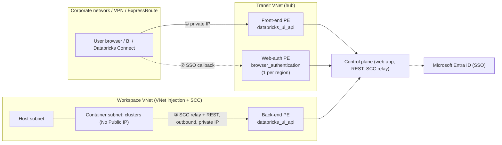
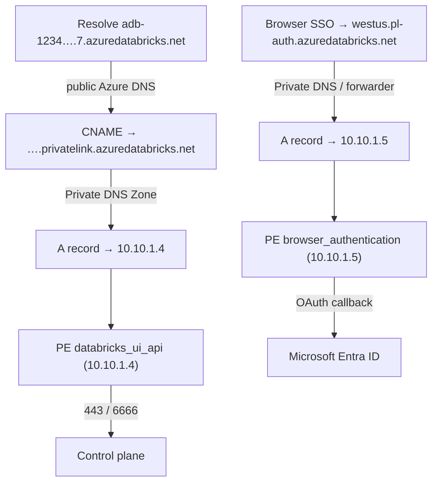
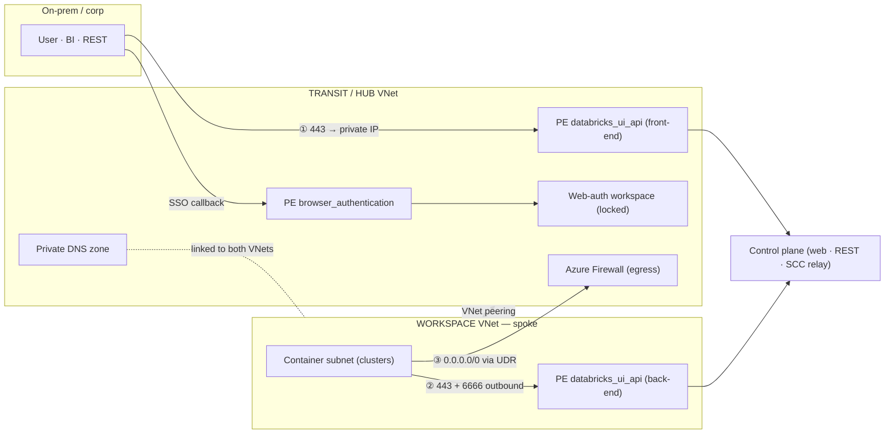
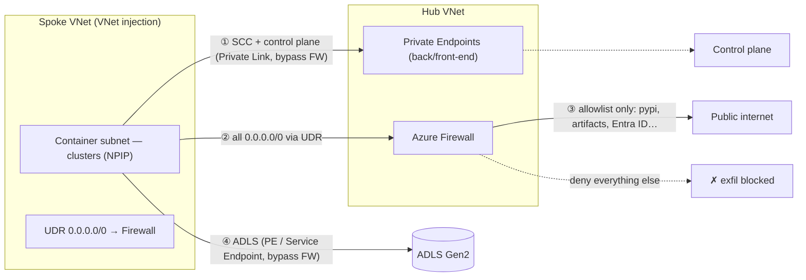

# Topic 4 — Private Link, DNS & Topologies (Azure-first)

> **Stage 4 · Azure Databricks Networking & Security** — for the **FDE / RSA /
> Solutions Architect** who has to *design and defend* a "no public internet"
> Databricks architecture to a customer's security team. This is the stage where
> the three connectivity paths from Stage 2 stop being *backbone-private-by-default*
> and become *fully private with no public-IP hop* — the reference answer to every
> regulated (FSI / health / gov) network review.
>
> **This one page covers all four subtopics:**
> - **4.1 — Private Link connection types** (front-end / back-end / web-auth — *what* the endpoints are)
> - **4.2 — Private DNS for Private Link** (the switch that makes anyone actually use the private IP)
> - **4.3 — Transit / hub-and-spoke** (*where* you physically put the endpoints, and how VNets wire together)
> - **4.4 — Data exfiltration protection (DEP)** (force egress through one inspected, default-deny chokepoint)
>
> Companion interactive page: `index.html` (tabbed, one interactive architecture
> diagram per subtopic). Static topology: `architecture.svg`. A focused hands-on
> **`main.tf`** ships for the DEP firewall/UDR (see 4.4 — the only subtopic where
> standalone IaC adds value over the in-lesson snippets).

---

## 🧠 Topic mental model (hold this in your head)

> **Private Link is a building retrofit, not a new building.** Stage 2 gave you a
> building (the workspace) with three doors — ① users in, ② clusters to head
> office, ③ clusters to the warehouse — already reachable over the *Microsoft
> backbone* but with a *public phone number* anyone can dial.
>
> - **4.1 installs three private extensions** — one per direction: **front-end**
>   (the line staff dial *in* on), **back-end** (the line the cluster-room dials
>   *out* on), **web-auth** (the receptionist's line that confirms a caller is
>   allowed). The public number stays printed on the card; the building just gets
>   unlisted internal lines.
> - **4.2 edits the company directory (DNS)** so anyone who dials the *public*
>   number is quietly rerouted to the private line. Without the directory edit, the
>   private line exists but nobody lands on it.
> - **4.3 builds one guarded lobby (the transit/hub VNet)** with the front desk,
>   directory, and switchboard, then wires every floor (workspace spoke) back to
>   it — build the private front door once, reuse it fleet-wide.
> - **4.4 puts a customs officer on the single exit (Azure Firewall)** so the only
>   way data leaves to the public street is past a short printed guest list (FQDN
>   allowlist) — everything else is turned away.
>
> **The one sentence:** *Private Link swaps the public hop on each of the three
> paths for a private IP; DNS decides whether anyone lands on it; hub-and-spoke
> decides where the endpoints physically live; and DEP forces the residual
> internet egress through one inspected chokepoint — flip **Public Network Access =
> Disabled** once all three paths are private.*
>
> **Where it sits in the three-path scaffold (Stage 2.2):** ① **user → Databricks**
> → privatized by **front-end** (+ **web-auth** for SSO). ② **compute ↔ control**
> → privatized by **back-end** (removes the last public hop SCC left). ③ **compute
> → storage** stays on a Service/Private Endpoint and DEP keeps stray internet
> egress off the firewall-bypassed private paths.

---

## Why this topic matters to an architect

- **It is the literal answer to the regulated security review.** "Prove no
  Databricks traffic touches the public internet" and "prove a compromised
  notebook can't POST our data out" are answered by *front-end + back-end +
  web-auth Private Link + `publicNetworkAccess=Disabled`* (4.1–4.3) and *Azure
  Firewall + UDR default-deny egress* (4.4).
- **It separates "already private" from "needs work."** Stage 2 traffic is
  backbone-private by default — Private Link removes the public-*IP* hop, it
  doesn't "get you off the internet." Knowing this stops customers over-buying
  Private Link they don't need (and over-paying per-GB).
- **It surfaces the sharpest operational edges on the platform:** the *web-auth
  single-point-of-failure* (delete it → region-wide login outage), *DNS is the
  #1 cause of "it doesn't work"*, and *routing SCC through the firewall* (the
  classic DEP self-inflicted outage). An architect who can name these has *run*
  Private Link, not just read about it.
- **It is a design-time decision.** Retrofitting a firewall hub, UDRs, and DNS
  forwarding onto a live workspace means routing changes, terminate-all-compute
  windows (15+ min), and an outage. Get it into the reference architecture up front.

---

## Terms used here (define-before-use)

This stage builds on Stages 0–3; here are the 2–3 line glosses so you can read
top-to-bottom, plus the module that owns the full deep dive.

| Term | Plain-language gloss | Owning module |
| --- | --- | --- |
| **Private Link** | The Azure feature that lets a normally-public service be reached over a **private IP inside your VNet**, across the Microsoft backbone — the traffic never touches the public internet. | This topic (4.1) |
| **Private Endpoint (PE)** | The concrete thing Private Link creates: a **NIC with a private IP** in your subnet that maps to a specific target service. A PE *is* a NIC. | **Stage 2.5 / 4.1** |
| **`groupId` / target sub-resource** | The Azure label on a PE saying *which part* of a service it connects to. Azure Databricks has exactly **two**: `databricks_ui_api` and `browser_authentication`. | This topic (4.1) |
| **VNet injection** | Deploying the workspace into *your own* VNet (host + container subnets) instead of the Databricks-managed one, so you own NSGs/UDRs. Prerequisite for back-end Private Link and DEP. | **Stage 3** |
| **SCC / No Public IP (NPIP)** | Secure Cluster Connectivity: clusters have no public IP and no inbound ports; they dial *out* to the control plane's **SCC relay**. Private Link makes that outbound hop private. | **Stage 2.3 / 3** |
| **SCC relay** | The Databricks-managed control-plane endpoint a No-Public-IP cluster dials outbound to (reverse tunnel), so the CP reaches the cluster with no inbound door. | **Stage 2.3** |
| **Private DNS Zone** | An Azure-private "phonebook" (`privatelink.azuredatabricks.net`) that resolves the workspace URL to the PE's *private* IP instead of the public one. | This topic (4.2) |
| **CNAME / A record** | An A record maps a name → an IP; a CNAME maps a name → another name. ADB Private Link uses a public CNAME that hands off to a private-zone A record. | **Stage 0.4** |
| **Conditional forwarding** | A DNS-server rule: "for these domains, ask *that* upstream resolver." Used to send Databricks domains to Azure's resolver `168.63.129.16`. | **Stage 0.5 / 4.2** |
| **Transit VNet (hub)** | A central "hub" VNet carrying user / VPN / ExpressRoute traffic and hosting the inbound (front-end + web-auth) endpoints; workspace VNets peer to it as spokes. | This topic (4.3) |
| **VNet peering** | A direct private link between two VNets so they route to each other over the backbone. Gives **IP reachability only — not DNS**. | **Stage 0.5** |
| **NSG** (network security group) | A stateful allow/deny firewall on a subnet/NIC, filtering by port/IP/service tag. Coarse, free; can't do FQDN allowlists. | **Stage 0.3 / 3** |
| **UDR** (user-defined route) | A custom route overriding Azure's defaults — here `0.0.0.0/0 → firewall` to force egress through the chokepoint. | **Stage 0.3 / 3** |
| **Service tag** | A Microsoft-maintained, auto-updated label for a set of IP ranges (`AzureDatabricks`, `Storage.<Region>`) used in routes/NSGs instead of raw IPs. | **Stage 0.3 / 3** |
| **Azure Firewall** | A managed, stateful, FQDN-aware firewall; **application rules** allow by FQDN, **network rules** by IP/port/service tag. The DEP chokepoint. | This topic (4.4) |
| **Service Endpoint** | A free, egress-only way to reach Azure PaaS over the backbone from a subnet (no NIC/private IP, no DNS change). | **Stage 2.5 / 3** |
| **Microsoft Entra ID** | Azure's identity provider (formerly Azure AD); issues the SSO/OAuth tokens the `browser_authentication` callback completes. | **Stage 5 (identity)** |

---

# 4.1 — Private Link connection types

## What it is (plain language)

- **Azure Private Link** lets a service that normally lives at a *public* address
  be reached over a **private IP inside your VNet**, across the Microsoft
  backbone. A **Private Endpoint** is the concrete artefact: a **NIC with a private
  IP** in *your* subnet that maps to a target service via a chosen **target
  sub-resource** (`groupId`).
- For Azure Databricks there are **three connection types**, each securing one of
  the three connectivity paths:
  - **Back-end** (Azure docs now say *"classic compute plane"*) — clusters in your
    VNet → the **control plane** (SCC relay + workspace REST/web app).
  - **Front-end** (Azure docs now say *"inbound"*) — users / BI / REST → the
    **workspace** UI and API.
  - **Web-auth** (*browser authentication*) — the SSO/OAuth login callback from
    Microsoft Entra ID, made to work over the private path. **One per region.**

**Analogy:** the workspace ships with a *public phone number*. Private Link gives
it an *unlisted internal extension* (a private IP); **front-end** = the line staff
dial in on, **back-end** = the line the cluster-room dials out on, **web-auth** =
the receptionist's dedicated line that confirms a caller is allowed in.

> **Two facts to anchor on:** (1) Only **two `groupId`s** exist:
> `databricks_ui_api` (used by **both** front-end and back-end) and
> `browser_authentication` (SSO only). The *direction* and the *VNet you place it
> in* make a `databricks_ui_api` endpoint "front-end" vs "back-end" — not a
> different sub-resource. (2) **Private Link does not replace SCC.** SCC already
> removed public IPs and reversed the call direction; back-end Private Link removes
> the *last public hop* — the cluster's outbound call to the control plane.

## Traffic path — which path, which endpoint, which direction

| Path (Stage 2.2) | Connection type | Direction | `groupId` | Lives in which VNet |
| --- | --- | --- | --- | --- |
| User → workspace UI/API | **Front-end (inbound)** | inbound to CP | `databricks_ui_api` | **Transit** VNet |
| SSO login callback | **Web-auth (browser auth)** | inbound to CP | `browser_authentication` | **Transit** VNet (web-auth workspace) |
| Cluster → control plane (SCC relay + REST) | **Back-end (classic)** | outbound from DP | `databricks_ui_api` | **Workspace** VNet |

**Back-end path:** cluster resolves `adb-<id>.<n>.azuredatabricks.net` → the
`privatelink.azuredatabricks.net` zone answers with the **private IP** of the
back-end PE → traffic goes cluster → PE NIC → backbone → control plane. Two
channels ride it: the **SCC relay** (reverse tunnel) and **REST/web-app** control.

**Front-end path:** user on the corporate net/VPN resolves the workspace URL →
private DNS returns the **transit-VNet private IP** → browser/BI/Databricks Connect
→ PE → backbone → control plane.

**Web-auth path:** browser SSO redirects through `<region>.pl-auth.azuredatabricks.net`
to complete the Entra ID callback; the `browser_authentication` PE privatizes
**only that callback** (not REST API auth).

## WHY IT BREAKS (cause → effect)

- **Forget web-auth entirely** → REST works, but **browser login spins/fails
  region-wide** because the OAuth callback to `<region>.pl-auth…` is still public
  and blocked on the locked-down network. *This is the single most common Private
  Link outage.*
- **Wrong NSG mode** → back-end needs `NoAzureDatabricksRules` (the public-allow
  rules are unwanted once the path is private); a hybrid public front-end needs
  `AllRules`. Mix them up → cluster connectivity drops.
- **Delete the web-auth host workspace** → the single regional
  `browser_authentication` endpoint vanishes → **every workspace in the region
  loses browser login.**
- **Don't link the private DNS zone to the workspace VNet** → clusters resolve the
  **public** IP → back-end Private Link silently does nothing → cluster start fails
  with `Control Plane Request Failure`.

## 4.1 illustrative config (one snippet — the three endpoints + the two flags)

```hcl
# Illustrative — the three Private Endpoints. Full apply-ready module is deferred;
# only DEP (4.4) ships a standalone main.tf. Prereqs: Premium + VNet injection + SCC.

# BACK-END: databricks_ui_api in the WORKSPACE VNet (cluster -> control plane)
resource "azurerm_private_endpoint" "backend" {
  subnet_id           = var.workspace_pe_subnet_id          # dedicated /27 in the workspace VNet
  private_service_connection {
    private_connection_resource_id = var.workspace_id
    subresource_names              = ["databricks_ui_api"]  # back-end uses the SAME groupId as front-end
    is_manual_connection           = false
  }
  private_dns_zone_group { private_dns_zone_ids = [azurerm_private_dns_zone.adb.id] }
}
# FRONT-END: same groupId, but placed in the TRANSIT VNet (user -> workspace)
#   subnet_id = var.transit_pe_subnet_id ; subresource_names = ["databricks_ui_api"]
# WEB-AUTH:  browser_authentication on the LOCKED web-auth workspace (1 per region)
#   private_connection_resource_id = var.webauth_workspace_id
#   subresource_names = ["browser_authentication"]

# The two workspace-side flags that distinguish each mode:
#   Back-end-only / full isolation: public_network_access_enabled=false, NSG="NoAzureDatabricksRules"
#   Front-end hybrid (public stays on, gated by IP ACLs): public_network_access_enabled=true, NSG="AllRules"
```

**Azure Portal:** workspace → **Settings → Networking → Private endpoint
connections → + Private endpoint** → **Target sub-resource** (`databricks_ui_api`
or `browser_authentication`) → pick the **transit** (front-end/web-auth) or
**workspace** (back-end) VNet + PE subnet → **Integrate with private DNS zone =
Yes**. For full isolation, flip each production workspace's **Allow Public Network
Access = Disabled** once all three exist.



---

# 4.2 — Private DNS for Private Link

## What it is (plain language)

- **DNS** turns a name like `adb-1234….7.azuredatabricks.net` into an IP. By
  default that name resolves to a **public IP** of the control plane. Once you
  create a Private Endpoint (a private IP in your VNet), you must **override DNS**
  so the *same name* resolves to that **private IP** — otherwise traffic keeps
  going out the public door.
- An **Azure Private DNS Zone** is a private phonebook scoped to your VNet(s). For
  Databricks Private Link the zone name is **always**
  `privatelink.azuredatabricks.net` (fixed, can't be renamed).

**Analogy:** Private Link installs the private phone line; **Private DNS is the
company directory edit** that quietly reroutes anyone who dials the public number
to the private line. The business card never changes — only the directory's answer.

> **Hold this in your head:** *Private Link gives you a private IP; DNS is the
> switch that decides whether anyone lands on it.* If a Private Link deployment
> "doesn't work," suspect the directory (DNS) before the phone line (the endpoint).

## Traffic path — the resolution chain

The override is a CNAME→A chain. The public zone hands out a **CNAME** to the
`privatelink` name; your **private zone** holds the **A record** to the private IP:

```
adb-1234….7.azuredatabricks.net
   └─(CNAME, public Azure DNS)→ adb-1234….7.privatelink.azuredatabricks.net
          └─(A record, your Private DNS Zone)→ 10.10.1.4   ← private IP of the PE
```

`nslookup` from inside the VNet proves it: the public name shows as an **alias**,
the **Address** is the PE's private IP. Two records, two sub-resources:

| Sub-resource | Carries | A-record name | Points to |
| --- | --- | --- | --- |
| `databricks_ui_api` | Workspace UI/REST/Databricks Connect + (back-end) SCC relay | `adb-<id>.<n>` | private IP of the `databricks_ui_api` PE |
| `browser_authentication` | The SSO/OAuth callback from Entra ID | `<region>.pl-auth` (e.g. `westus.pl-auth`) | private IP of the `browser_authentication` PE |

**Custom / on-prem DNS** (where enterprises trip): Azure's automatic integration
only helps machines that resolve via Azure DNS. Shops running their own DNS use
**conditional forwarding** of `*.azuredatabricks.net`,
`*.privatelink.azuredatabricks.net`, and `*.databricksapps.com` to Azure's resolver
`168.63.129.16` (recommended), or hand-maintained A records.

## WHY IT BREAKS (cause → effect)

- **PE created but no DNS record / zone not linked** → every client still resolves
  the **public** IP → the PE is invisible → `Control Plane Request Failure` on
  cluster start (back-end) or public traffic instead of private.
- **`databricks_ui_api` record present but `browser_authentication` (pl-auth)
  forgotten** → workspace loads, then the **SSO callback fails** (OAuth denial) —
  login page appears, then bounces.
- **Zone not linked to a particular spoke/transit VNet** → *some* users private,
  *some* public, inconsistently.
- **Full FQDN put in the A-record `name` field** → the record name is just the
  **host label** (`adb-<id>.<n>` or `pl-auth.<region>`); the zone supplies the
  suffix. Wrong name → no resolution.
- **Multiple control-plane SSO instances in a region** → you may need **several**
  `pl-auth` A records; guessing them → partial SSO failure. Ask the account team.

## 4.2 illustrative config (one snippet — zone, two records, VNet link)

```hcl
# Illustrative DNS. With Portal "Integrate with private DNS zone = Yes" these are auto-created;
# author them explicitly when you manage DNS as code or run custom DNS.
resource "azurerm_private_dns_zone" "adb" {
  name                = "privatelink.azuredatabricks.net"   # FIXED zone name — do not change
  resource_group_name = "dns-rg"
}
resource "azurerm_private_dns_a_record" "workspace" {       # adb-<id>.<n> -> databricks_ui_api PE IP
  name      = "adb-1234567890123456.7"                      # host LABEL only (zone supplies the suffix)
  zone_name = azurerm_private_dns_zone.adb.name
  resource_group_name = "dns-rg"
  ttl       = 10                                            # low TTL while cutting over
  records   = [azurerm_private_endpoint.ui_api.private_service_connection[0].private_ip_address]
}
resource "azurerm_private_dns_a_record" "webauth" {         # <region>.pl-auth -> browser_authentication PE IP
  name      = "westus.pl-auth"                              # regional, shared; required for front-end SSO
  zone_name = azurerm_private_dns_zone.adb.name
  resource_group_name = "dns-rg"
  ttl       = 10
  records   = [azurerm_private_endpoint.browser_auth.private_service_connection[0].private_ip_address]
}
# Link the zone to EVERY VNet that must resolve privately (repeat per VNet):
resource "azurerm_private_dns_zone_virtual_network_link" "ws" {
  private_dns_zone_name = azurerm_private_dns_zone.adb.name
  virtual_network_id    = azurerm_virtual_network.workspace.id
  resource_group_name   = "dns-rg"
  registration_enabled  = false                            # resolution only
}
```

**Custom DNS (enterprise hub):** conditional-forward `*.azuredatabricks.net`,
`*.privatelink.azuredatabricks.net`, `*.databricksapps.com` to `168.63.129.16` and
ensure the resolver VNet is linked to the zone. **Verify:**
`nslookup adb-<id>.<n>.azuredatabricks.net` from a VM in the VNet must return the
**private** IP, with the public name shown as an alias.

> **Ports on the PE subnet** (only if you keep an NSG network policy on it): allow
> inbound **443** (UI/REST), **6666** (SCC relay), **3306** (legacy metastore),
> **8443–8451** (internal). The interview pair is **443 + 6666**.



---

# 4.3 — Transit / hub-and-spoke

## What it is (plain language)

- A **hub-and-spoke** network is a central **hub VNet** that every other VNet
  (**spokes**) peers to. Spokes don't talk directly — they route through the hub,
  where shared services live (firewall, DNS, VPN/ExpressRoute gateway, and
  **shared private endpoints**).
- A **transit VNet** is the specific hub all *user/client* traffic enters through.
  For Databricks it holds the **front-end** `databricks_ui_api` PE and the
  **web-auth** `browser_authentication` PE.
- A **workspace VNet** is the spoke you inject each workspace into (host +
  container subnets). It also holds the **back-end** `databricks_ui_api` PE.

**Analogy:** the transit/hub VNet is the **guarded lobby of an office tower** —
everyone enters through one reception desk where security, the directory (DNS), and
the switchboard live; each team's floor (a workspace spoke) wires back to the lobby,
never to each other.

> **The one sentence:** *build the private front door, DNS, and egress firewall
> once in a transit VNet, then peer every workspace spoke to it — but peering only
> gives you a hallway (IP reachability); you still need the shared DNS zone to tell
> everyone the lobby's room number (the private IP).*

## Traffic path + the two VNets

| VNet | Role | PEs it holds |
| --- | --- | --- |
| **Transit (hub)** | Central ingress for all user/client traffic; shared services; primary egress route | `databricks_ui_api` (front-end), `browser_authentication` |
| **Workspace (spoke)** | Hosts the injected workspace | `databricks_ui_api` (back-end) |

- **① Front-end:** user → workspace URL → private IP of the front-end PE in the
  transit VNet, port **443**; SSO additionally hits the `browser_authentication` PE.
- **② Back-end:** clusters in the container subnet → **outbound** (NPIP/SCC) over
  **443** (REST/web app) + **6666** (SCC relay) → back-end PE → control plane.
- **③ Egress:** a UDR sends `0.0.0.0/0` to the hub Azure Firewall (4.4) — but
  **don't route the SCC relay through the firewall** (extra hop, can break it).

**Standard vs Simplified** (the core decision — *blast radius vs cost/effort*):

- **Standard (recommended, production):** a **dedicated transit VNet** as the hub,
  with a **dedicated, locked web-auth workspace** (`WEB_AUTH_DO_NOT_DELETE_<region>`)
  whose only job is to host the regional `browser_authentication` PE. Isolates the
  single-point-of-failure SSO endpoint from any real workspace's lifecycle.
- **Simplified (non-prod / single-workspace-per-region):** host
  `browser_authentication` on an **existing** workspace (combined with its
  `databricks_ui_api` PE). Less infra — but deleting that host breaks SSO for every
  workspace in the region.

**Subnet sizing (verified):** transit PE subnet `/26`–`/25`; web-auth workspace
host+container `/28` or `/27` each; workspace classic (back-end) PE subnet `/27`.

## WHY IT BREAKS (cause → effect)

- **Peering without DNS linking** → IP reachability but **public** name resolution
  → `Control Plane Request Failure`. Peering ≠ name resolution; link the zone to
  *both* VNets (or conditional-forward).
- **Forget port 6666 on the PE-subnet NSG** → front-end works, **clusters fail**
  (back-end SCC relay blocked).
- **Route SCC (6666) through the hub firewall** → extra hop that breaks back-end
  connectivity; exclude SCC from the egress UDR.
- **Put `browser_authentication` on a deletable workspace (Simplified) in prod** →
  one `terraform destroy` kills SSO region-wide.
- **Under-size the transit PE subnet** → IP exhaustion as you add workspaces.

## 4.3 illustrative config (one snippet — peering + PE placement + DNS link)

```hcl
# Illustrative standard hub-and-spoke skeleton. Workspace/VNet-injection blocks (Stage 3)
# omitted; the value here is the TOPOLOGY decision — where each PE lives + DNS linking.

# Peering: spoke <-> hub (both directions; allow forwarded traffic for hub-firewall egress)
resource "azurerm_virtual_network_peering" "ws_to_hub" {
  virtual_network_name      = azurerm_virtual_network.ws.name        # spoke
  remote_virtual_network_id = azurerm_virtual_network.transit.id     # hub
  allow_forwarded_traffic   = true
  resource_group_name       = "ws-rg"
  name                      = "ws-to-hub"
}
# FRONT-END PE in the TRANSIT VNet; BACK-END PE in the WORKSPACE VNet — SAME groupId,
# location is what makes one front-end and the other back-end (see 4.1 snippet).
resource "azurerm_private_endpoint" "front_end" {
  subnet_id = azurerm_subnet.transit_pe.id                           # /26–/25 in the hub
  resource_group_name = "hub-rg" ; location = var.region ; name = "adb-front-end-pe"
  private_service_connection {
    private_connection_resource_id = azurerm_databricks_workspace.ws.id
    subresource_names = ["databricks_ui_api"] ; is_manual_connection = false ; name = "adb-fe-psc"
  }
  private_dns_zone_group { name = "adb-dns" ; private_dns_zone_ids = [azurerm_private_dns_zone.adb.id] }
}
# Link the ONE private DNS zone to BOTH VNets so clusters AND users resolve to the private IP.
```

**Portal:** create the front-end PE (transit VNet) and back-end PE (workspace VNet)
per 4.1; create RG/VNet/workspace `WEB_AUTH_DO_NOT_DELETE_<region>` (NPIP=Yes,
VNet injection=Yes, Public Network Access=Disabled, NSG=`NoAzureDatabricksRules`),
add a **Delete lock**, and create *only* its `browser_authentication` PE. **Stop all
compute** before NSG/Private Link changes on an existing workspace (15+ min).



---

# 4.4 — Data exfiltration protection (DEP)

## What it is (plain language)

- **Data exfiltration** = data leaving your environment to somewhere it shouldn't
  (a malicious tunnel out, a notebook quietly `POST`ing a dataset to a random host).
- **DEP** is the *architecture pattern* that makes that almost impossible: put
  compute in a locked-down VNet, force **every** outbound packet through a **single
  inspected chokepoint** (an **Azure Firewall** in a central **hub**), and only let
  traffic out to a short, explicit **FQDN allowlist**.
- It is not one switch — it's the **combination** of VNet injection + SCC +
  **back-end Private Link** + **UDR** (`0.0.0.0/0 → firewall`) + an **FQDN
  allowlist**. **Back-end** Private Link is the egress-relevant piece: it carries
  SCC/control-plane traffic privately so it **bypasses the firewall**. Front-end
  Private Link is the separate *inbound* control.

**Analogy:** DEP is an **airport with one exit door and a customs officer**. People
move freely inside the terminal (VNet); the only way out to the street (internet) is
past the officer (Azure Firewall), who checks a printed guest list (FQDN allowlist)
and turns away anyone not on it. Staff and supply deliveries (control plane / SCC,
your ADLS data) use **private service tunnels** that never touch the public door.

> **The one sentence:** *force every internet-bound packet through one inspected,
> default-deny chokepoint — but keep the control plane and your storage on private
> paths so they bypass the chokepoint entirely.*

## Traffic path — four flows, two of them bypass the firewall

1. **Control plane + SCC** → over **back-end Private Link** (private, bypasses FW).
   With Private Link on, *"the **Azure Databricks service tag isn't required**"* in
   the UDR — it drops out entirely.
2. **Internet-bound `0.0.0.0/0`** → via UDR → **Azure Firewall** → allowlist only.
3. **ADLS / your storage** → Private Endpoint or Service Endpoint (bypasses FW;
   routing data through the firewall would be ruinous per-GB).
4. **Everything else** → firewall **default-deny** → exfil dropped at the exit.

**UDR set when Private Link IS enabled** (the DEP recommendation):

| Destination | Next hop |
| --- | --- |
| `0.0.0.0/0` | Virtual appliance → **Azure Firewall** |
| Metastore / Artifact / Log Blob / Event Hubs IPs (or `Storage`/`EventHub` service tags) | Internet (Azure backbone — bypass FW) |

The `AzureDatabricks` service tag is **absent** (Private Link carries it). *Without*
Private Link you'd add `AzureDatabricks → Internet` so the firewall doesn't
black-hole the relay. **Use service tags, not raw IPs** — Microsoft auto-updates the
ranges. **Allowlist the SCC relay by FQDN** (`tunnel.<region>.azuredatabricks.net`)
never by IP — the IPs rotate for multi-AZ.

**The allowlist (East US example — always pull exact FQDNs from the IP/domain doc):**
artifact blob `dbartifactsprodeastus.blob.core.windows.net` (443), system tables
`ucstprdeastus.dfs.core.windows.net` (443), log blob `dblogprodeastus.blob.core.windows.net`
(443), metastore `consolidated-eastus-prod-metastore.mysql.database.azure.com`
(**3306/TCP**, skip if UC-only), Event Hubs `…observabilityeventhubs.servicebus.windows.net`
(**9093/TCP**), library repos `*.pypi.org`/`*.pythonhosted.org`/`*.cran.r-project.org`/
`*.maven.org`/`*.ubuntu.com` (443, only if needed), Entra ID `*.microsoftonline.com` (443).

## WHY IT BREAKS (cause → effect)

- **Attach the `0.0.0.0/0`→firewall UDR *before* allowlisting (or Private Link)** →
  clusters can't reach the relay/artifacts → **clusters won't launch.** Sequence:
  allowlist/Private-Link *first*, then attach the route. (Check firewall **deny
  logs** for the artifact-blob / `tunnel.<region>` FQDN.)
- **Route SCC through the firewall** → extra latency, per-GB cost, and stale FQDN
  rules silently break cluster control. Keep it on Private Link.
- **Forget `*.pypi.org` etc.** → `pip install` / cluster init fails. Forget the
  **region's secondary** artifact/metastore storage → intermittent failures.
- **Route table not associated with *both* host and container subnets** → the
  un-routed subnet's egress **escapes the firewall** (an exfil leak).
- **Assume DEP covers serverless** → it doesn't; serverless egress is **NCC +
  network policies** (Stage 5), not your firewall.

## 4.4 illustrative config (one snippet — firewall allowlist + the forcing UDR)

```hcl
# Illustrative DEP core. A focused, apply-ready main.tf ships alongside this lesson
# (firewall + policy + rule collections + UDR + subnet associations) — DEP is the one
# subtopic where standalone IaC adds value (it's the deliverable the network team applies).
resource "azurerm_firewall" "hub" {
  name = "adb-hub-fw" ; sku_name = "AZFW_VNet" ; sku_tier = "Standard"   # Standard = FQDN app rules
  firewall_policy_id = azurerm_firewall_policy.dep.id
  resource_group_name = "adb-hub-rg" ; location = var.region
  ip_configuration {
    name = "fw-ipconfig"
    subnet_id = azurerm_subnet.fw.id          # MUST be named "AzureFirewallSubnet"
    public_ip_address_id = var.fw_pip         # stable egress IP for downstream allowlists
  }
}
# Application rules: allow ONLY the FQDNs Databricks needs (East US example).
#   destination_fqdns = ["dbartifactsprodeastus.blob.core.windows.net",
#     "ucstprdeastus.dfs.core.windows.net","dblogprodeastus.blob.core.windows.net",
#     "*.pypi.org","*.ubuntu.com","login.microsoftonline.com"] ; protocols Https/443
# Network rules: metastore 3306/TCP, Event Hubs 9093/TCP.

# The forcing function: 0.0.0.0/0 -> firewall private IP, on BOTH host+container subnets.
resource "azurerm_route" "to_firewall" {
  route_table_name = azurerm_route_table.spoke.name ; resource_group_name = "adb-rg"
  name = "to-firewall" ; address_prefix = "0.0.0.0/0"
  next_hop_type = "VirtualAppliance"
  next_hop_in_ip_address = azurerm_firewall.hub.ip_configuration[0].private_ip_address
}
# With back-end Private Link enabled, NO AzureDatabricks service-tag route is needed.
# Carve out storage so artifact/log blob stays on the backbone (bypass FW):
#   azurerm_route "storage" { address_prefix = "Storage.EastUS" ; next_hop_type = "Internet" }
```

**Portal:** create the Firewall in the hub (subnet `AzureFirewallSubnet`, Standard
SKU + a Firewall Policy); peer hub↔spoke (allow forwarded traffic); create a route
table with `0.0.0.0/0 → Virtual appliance → firewall private IP` + carve-out routes,
associate to **both** subnets; add the allowlist (application + network rules);
enable back-end Private Link + **Public network access = Disabled**.
**⚠️ Allowlist / Private Link FIRST, then attach the default route**, or cluster
launches break.



---

## Comparison tables

### The three Private Link connection types (4.1)

| | **Back-end (classic)** | **Front-end (inbound)** | **Web-auth (browser auth)** |
| --- | --- | --- | --- |
| Secures | Cluster → control plane (SCC relay + REST) | User/BI/REST → workspace | SSO/OAuth login callback |
| Direction | Outbound (DP → CP) | Inbound (user → CP) | Inbound (auth callback) |
| `groupId` | `databricks_ui_api` | `databricks_ui_api` | `browser_authentication` |
| Lives in | **Workspace** VNet | **Transit** VNet | **Transit** VNet (web-auth workspace) |
| How many | 1 per workspace VNet (shareable) | 1 per transit VNet (shareable) | **1 per region / DNS zone** |
| Required NSG Rules | `NoAzureDatabricksRules` | `AllRules` (hybrid) | `NoAzureDatabricksRules` |
| Can stand alone? | **Yes** (independent of front-end) | Yes | Only with front-end / full isolation |

### Egress controls for classic compute (4.4)

| Control | Restricts | Granularity | Cost | Use when |
| --- | --- | --- | --- | --- |
| No control (default) | Nothing (open internet) | — | NAT only | Dev sandboxes |
| NAT gateway only | Gives stable egress IP; still open | Source IP | Hourly + per-GB | Need predictable IP, not exfil protection |
| NSG egress rules | By IP/port/service tag | Coarse | Free | Cheap coarse guardrail |
| Service Endpoint Policy | Storage egress to *approved accounts* | Per storage account | Free | Stop data going to *unapproved* ADLS |
| **Azure Firewall + UDR (DEP)** | **All egress, to FQDN/port allowlist** | **FQDN + port** | **Hourly + per-GB** | **Regulated; the exfil-proof pattern** |
| Full Private Link (no internet) | Control + data plane fully private | N/A | PE per-GB | Maximum isolation; pair *with* DEP |

---

## Uses, edge cases & limitations

- **Uses:** the reference architecture for any "no public internet / prove no
  exfil" Databricks engagement — front-end + back-end + web-auth Private Link +
  `publicNetworkAccess=Disabled` (4.1–4.3) plus Azure Firewall + UDR default-deny
  egress (4.4); fleet-scale via one transit hub reused across spokes.
- **Edge cases:**
  - **Web-auth single point of failure** — deleting the host workspace/endpoint
    breaks browser login for the *whole region*; lock it.
  - **Custom DNS** must resolve **both** the workspace URL *and* `<region>.pl-auth…`
    to private IPs; some regions need **multiple** `pl-auth` A records (ask the
    account team) — and a shared PE under custom DNS hits a **single-entry**
    constraint (prefer one `databricks_ui_api` PE per workspace).
  - **Third-party SaaS** (Power BI service, partner tools) that can't traverse the
    transit VNet needs **hybrid access** (IP access lists) or an on-prem gateway.
  - **Region secondary storage** — some regions keep secondary artifact/metastore
    storage in a *different* region; allowlist **both**.
  - **Serverless ≠ classic** — DEP/UDR/firewall is for classic compute in your
    VNet; serverless egress is **NCC + network policies** (Stage 5).
  - **Existing-workspace conversion** terminates all compute; the network update
    can take **15+ minutes**.
- **Limitations:** Premium plan only; back-end/full isolation require **VNet
  injection + SCC**; only **two `groupId`s** exist; PEs are **region-specific**;
  **one `browser_authentication` per region per DNS zone**; per-endpoint +
  data-transfer cost (full isolation is the most expensive); Azure Firewall is
  hourly + **per-GB processed** (keep data/control-plane *off* it); Standard SKU
  filters by FQDN/SNI only — deep TLS inspection needs **Premium**; DEP is not a
  substitute for in-product controls (disable notebook download/export too —
  the firewall doesn't see browser downloads). *Inbound Private Link for some
  performance-intensive services (Zerobus Ingest, Lakebase) may be in Preview —
  verify before relying on it.*

---

## FDE field notes

**Common customer asks (security/network team):**
- *"Does any Databricks traffic ever hit the public internet?"* — With all three
  Private Link types + `publicNetworkAccess=Disabled`, no: users,
  clusters→control plane, and the SSO callback ride private IPs over the backbone;
  only the explicit FQDN allowlist (pypi, artifacts, Entra ID) egresses, via the
  firewall's single public IP.
- *"Prove a compromised notebook can't POST our data out."* — The firewall's
  implicit **deny-all** + the FQDN allowlist; show the rule collection.
- *"Can we keep a few trusted corporate IPs / Power BI on the public URL during
  rollout?"* — Yes: front-end **hybrid** (`publicNetworkAccess=Enabled` +
  `AllRules`) gated by IP access lists.
- *"Will Private Link replace SCC / VNet injection?"* — No; it complements them and
  they're prerequisites for back-end.
- *"Give us one stable egress IP for partner allowlists."* — The Azure Firewall's
  **public IP** (classic). Serverless IPs are dynamic — pivot to the service tag / NCC.
- *"Does this cover serverless SQL warehouses?"* — **No** — set this expectation
  early; serverless = NCC + network policies (Stage 5).

**Talk-track (positioning):** *"Private Link puts every Databricks path — user-in,
cluster-out, and the SSO callback — on a private IP inside your VNet, so we can set
Public Network Access to Disabled and answer 'nothing touches the internet.' DNS is
the switch that actually moves traffic onto those private IPs. We build the private
front door, DNS, and one inspected egress firewall once in a transit hub and reuse
it across every workspace spoke. The control plane and your storage stay on private
paths that bypass the firewall — so you pay to inspect a trickle of genuine internet
egress, not your data — and web-auth is the shared region-wide piece we protect with
a delete lock."*

**What breaks in the field + FIRST diagnostic check:**
- *Browser login spins/fails but REST works* → web-auth missing or its DNS wrong.
  **First check:** does `<region>.pl-auth.azuredatabricks.net` resolve to the
  `browser_authentication` PE's private IP from the client?
- *Cluster start fails `Control Plane Request Failure`* → back-end path not actually
  private. **First check:** is `privatelink.azuredatabricks.net` linked to the
  **workspace** VNet, and does the workspace URL resolve to the private IP from a
  cluster subnet?
- *Connectivity drops after enabling back-end* → wrong NSG mode. **First check:**
  `NoAzureDatabricksRules` for back-end, `AllRules` for hybrid front-end.
- *Region-wide login outage* → web-auth host workspace/endpoint deleted. **First
  check:** does `WEB_AUTH_DO_NOT_DELETE_<region>` still exist with a `Delete` lock?
- *Clusters won't launch after the UDR goes on* → UDR attached before
  allowlist/Private Link. **First check:** firewall **deny logs** for the
  artifact-blob / `tunnel.<region>` FQDN.
- *Egress "leaks" past the firewall* → route table on only one subnet. **First
  check:** is it associated with **both** host *and* container subnets?

**Decision rule for the engagement:**
- **Regulated / no-public-internet (FSI, health, gov), Premium** → all three
  Private Link types + `publicNetworkAccess=Disabled` + **DEP** (hub Azure Firewall
  + UDR + back-end PL + Service Endpoint Policy). Most secure, most expensive.
- **Data-plane-only compliance** ("clusters must not egress to the internet") →
  **back-end alone**, leave users public.
- **Restrict user ingress but some SaaS can't traverse the hub** → **front-end
  hybrid** with IP access lists.
- **No regulatory driver / cost-sensitive** → **IP access lists** (front door) +
  **storage firewall + Service Endpoint** (free) is the cheaper baseline — don't
  sell per-endpoint Private Link or a firewall the customer doesn't need.
- **Topology:** **Standard** (dedicated transit VNet + locked web-auth workspace)
  for production/multi-workspace/regulated; **Simplified** only for non-prod or a
  genuine single-workspace-per-region.

---

## Decision guide (what an architect recommends)

| Situation | Recommend | Why |
| --- | --- | --- |
| Regulated, "no public internet" mandate, Premium | **All 3 PL types + Public Access Disabled + DEP** | The complete private-isolation + exfil-proof reference pattern |
| Clusters must not egress to internet (data-plane compliance) | **Back-end PL alone** | Removes the last public hop on path ②; users stay public |
| Restrict user ingress, but Power BI/SaaS can't reach the hub | **Front-end hybrid** + IP access lists | Private for corp users, trusted public IPs still allowed |
| Fleet of workspaces per region | **Standard hub-and-spoke** (transit VNet + locked web-auth) | Build private ingress/DNS/egress once, reuse fleet-wide; low blast radius |
| Non-prod / single workspace per region | **Simplified** (combined PE host) | Less infra; accept region-wide SSO blast radius |
| Enterprise already running on-prem/central DNS | **Custom DNS + conditional forwarding** | Forwarding beats hand-maintained A records |
| Greenfield Azure-DNS shop | **Azure-integrated Private DNS** ("Integrate = Yes") | Least manual, least to break |
| Stop data going to *wrong storage account* (cheap) | **Service Endpoint Policy** | Free, narrow — complements DEP's internet allowlist |
| Dev sandbox / low sensitivity | **NSG egress rules + Service Endpoint Policy** | Free guardrails; skip the firewall's hourly + per-GB cost |

**Start free, step up only when mandated:** SCC + VNet injection + storage firewall
+ Service Endpoint cost nothing and are backbone-private. Add Private Link / DEP
only when a regulator demands *no public-IP hop* or a *provable internet allowlist*.

---

## Common mistakes / gotchas

- **Mixing up the NSG mode** — back-end = `NoAzureDatabricksRules`; hybrid front-end
  = `AllRules`. Not interchangeable.
- **Forgetting web-auth** — front-end works for REST, but browser SSO spins forever.
- **Creating a `databricks_ui_api` PE on the web-auth workspace** — it should host
  *only* `browser_authentication` and run no workloads.
- **Not locking the web-auth workspace** — an accidental delete = regional outage.
- **Creating the PE but not the DNS record / not linking the zone** — the PE is
  invisible; clusters resolve the public IP and Private Link silently does nothing.
- **Putting the full FQDN in the A-record `name`** — it's just the host label.
- **Peering without DNS linking** — IP reachability ≠ name resolution.
- **Routing SCC (6666) / control-plane through the firewall** — extra hop, cost,
  fragile FQDN rules; keep it on Private Link.
- **Attaching the `0.0.0.0/0`→firewall UDR before allowlisting / Private Link** —
  clusters can't reach the relay/artifacts and won't launch.
- **Route table on only one subnet** — the un-routed subnet's egress escapes the FW.
- **Pinning SCC/artifact destinations to IPs** instead of FQDNs/service tags —
  outages when Azure rotates IPs.
- **Sending ADLS data through the firewall** — ruinous per-GB cost; keep it on
  Private/Service Endpoints.
- **Assuming Private Link replaces SCC, or that DEP covers serverless** — it
  complements SCC; serverless needs NCC + network policies.
- **Leaving the workspace public** — DEP without `Public network access = Disabled`
  + Private Link still leaves a public path.

---

## References

- [Azure Private Link concepts (Azure Databricks)](https://learn.microsoft.com/azure/databricks/security/network/concepts/private-link) — three types (inbound/outbound/classic), the choose-the-right-implementation table, `groupId`s, NSG-rule modes, one-web-auth-per-region rule, ports 443/6666/3306/8443–8451. *(updated 2026-05)*
- [Configure classic compute plane (back-end) private connectivity](https://learn.microsoft.com/azure/databricks/security/network/classic/private-link-standard) — `databricks_ui_api` in the workspace VNet, `NoAzureDatabricksRules`, DNS A-records, "Control Plane Request Failure". *(updated 2026-05-04)*
- [Configure Inbound (front-end) Private Link](https://learn.microsoft.com/azure/databricks/security/network/front-end/front-end-private-connect) — transit VNet, hybrid vs no-public, the locked `WEB_AUTH_DO_NOT_DELETE` workspace, `browser_authentication`, `<region>.pl-auth.azuredatabricks.net`, custom-DNS forwarding. *(updated 2026-06-23)*
- [User-defined route settings for Azure Databricks](https://learn.microsoft.com/azure/databricks/security/network/classic/udr) — UDR rules, service tags (`AzureDatabricks`, `Storage`, `EventHub`), 3306 metastore, **"If Azure Private Link is enabled… the Azure Databricks service tag isn't required."** *(doc 2026-05-04)*
- [IP addresses and domains for Azure Databricks services](https://learn.microsoft.com/azure/databricks/resources/ip-domain-region) — exact per-region FQDNs/ports (metastore 3306, artifact/log blob 443, system-tables `dfs`, Event Hubs 9093, SCC relay `tunnel.<region>.azuredatabricks.net`). *(doc 2026-06-23)*
- [Phase 4: Design network architecture (deployment guide)](https://learn.microsoft.com/azure/databricks/lakehouse-architecture/deployment-guide/network) — DEP, hub-and-spoke, "install the firewall in a separate hub subnet, attach a UDR to route 0.0.0.0/0 through it." *(doc 2026-06-17)*
- [Configure domain name firewall rules](https://learn.microsoft.com/azure/databricks/resources/firewall-rules) · [Hub-spoke topology in Azure](https://learn.microsoft.com/azure/architecture/networking/architecture/hub-spoke) · [Azure Private DNS Zone overview](https://learn.microsoft.com/azure/dns/private-dns-overview) · [What is `168.63.129.16`](https://learn.microsoft.com/azure/virtual-network/what-is-ip-address-168-63-129-16).
- [Databricks blog: Data exfiltration protection with Azure Databricks](https://www.databricks.com/blog/data-exfiltration-protection-with-azure-databricks) — canonical reference architecture (official Databricks blog).
- Terraform: [`azurerm_private_endpoint`](https://registry.terraform.io/providers/hashicorp/azurerm/latest/docs/resources/private_endpoint) · [`azurerm_private_dns_zone_virtual_network_link`](https://registry.terraform.io/providers/hashicorp/azurerm/latest/docs/resources/private_dns_zone_virtual_network_link) · [`azurerm_firewall`](https://registry.terraform.io/providers/hashicorp/azurerm/latest/docs/resources/firewall).

> Verified against current Azure Databricks docs (Private Link concepts 2026-05,
> back-end 2026-05-04, front-end/DNS 2026-06-23, UDR 2026-05-04, IP/domain
> 2026-06-23, deployment guide 2026-06-17; live-checked 2026-06-26). The fixed zone
> name, the two `groupId`s, the `pl-auth` SSO pattern, the one-web-auth-per-region
> rule, ports (443/6666/3306/8443–8451), the custom-DNS forwarding domains, and the
> "Private Link removes the AzureDatabricks service tag from the UDR" rule are
> version- and region-sensitive — reconfirm in the docs (and get the exact
> per-region FQDNs / SSO domain list from the Databricks account team) before
> quoting to a customer. GA/Preview status for inbound Private Link on
> performance-intensive services is version-sensitive — verify.
