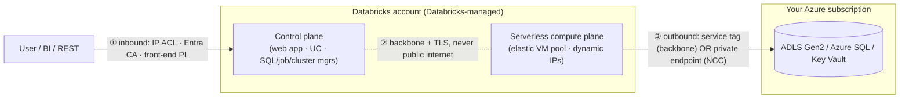
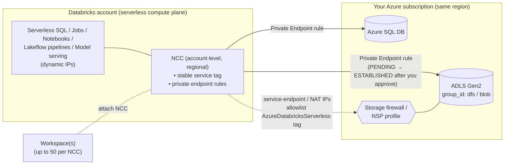
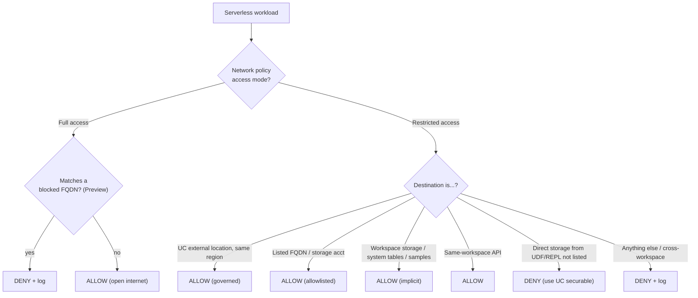
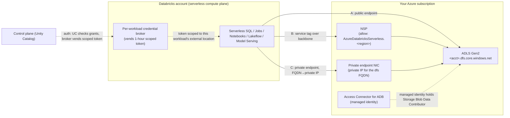

# Topic 5 — Serverless Networking (Azure-first)

> **Stage 5 · Azure Databricks Networking & Security** — for the **FDE / RSA /
> Solutions Architect** who has to *explain* to a customer's security team how a
> compute plane they **don't own** stays private and controlled. Stages 2–4 were
> all about **classic** compute in *your* VNet (VNet injection, SCC, Private Link,
> DNS, exfiltration protection). Serverless flips the model: the compute runs in
> **Databricks'** account, so the entire classic toolkit — peering, NSGs, UDRs, a
> static NAT IP you allowlist — **does not apply**. This page is the *why*, and the
> two account-level constructs that replace them.
>
> **This one page covers all four subtopics:**
> - **5.1 — Serverless architecture & why networking differs** (the trust boundary moves)
> - **5.2 — Network Connectivity Configuration (NCC)** (how serverless reaches *your* resources)
> - **5.3 — Serverless egress control / network policies** (whether an outbound call is allowed at all)
> - **5.4 — Serverless storage access patterns** (the three ways to a firewalled ADLS Gen2)
>
> Companion interactive page: `index.html` (tabbed, one interactive architecture
> diagram per subtopic). Static topology: `architecture.svg`.

---

## 🧠 Topic mental model (hold this in your head)

> **Serverless compute is a ride-share, not a car you own.**
>
> - With **classic** compute the car is yours: you know its licence plate (the
>   source IP / subnet), you control the garage and the route out, so you secure it
>   by **recognising the plate** (allowlist your subnet / NAT IP).
> - With **serverless** a car shows up on demand and leaves after — you never own
>   the plate, so you **can't allowlist an IP**. You secure it by trusting the
>   **service** (the `AzureDatabricksServerless` tag / an NCC private endpoint) and
>   by controlling **where it's allowed to drive** (a deny-by-default egress policy).
>
> **The one sentence:** *In serverless the compute is Databricks', not yours — so
> you secure path ③ by **service identity** (service tag or NCC private endpoint)
> and **deny-by-default egress** (network policy), never by chasing an IP; path ②
> is already private (backbone + TLS) and not yours to configure.*
>
> **Where it sits in the three-path scaffold (Stage 2.2):**
> - **① user → Databricks** — *unchanged* by serverless (you still log in to the
>   control plane; same front-end controls).
> - **② compute ↔ control** — for serverless this is **internal to Databricks,
>   always backbone + TLS, never public, not configurable**. The reassuring path.
> - **③ compute → your storage** — the **only** path you configure. Home of NCC
>   (5.2), egress control (5.3), and the three storage patterns (5.4).

---

## Why this topic matters to an architect

- **It resets the customer's mental model.** A security team used to "give me the
  cluster's IP and I'll allowlist it" will be confused by serverless. Your job is to
  explain *why there is no IP to give* and *what replaces it* — service identity and
  egress policy, not a firewall box you operate.
- **It reproduces the classic exfiltration story without a customer VNet.** The
  classic answer is "VNet injection + SCC + Private Link + Azure Firewall + UDR"
  (Stage 3–4). The serverless answer is **NCC (private path) + a restricted network
  policy (egress allowlist)** — and regulated customers ask for it by name.
- **It is two separate locks.** Serverless storage access only works if **network
  reachability** (firewall trusts serverless) **and** **authorization** (managed
  identity + UC grant) both pass. The #1 serverless ticket — "classic works,
  serverless doesn't" — is almost always the *network* lock, not the grant.
- **It is a cost conversation.** Service-tag/backbone egress is free of
  data-processing charges; NCC private endpoints bill **per hour per rule** and add
  per-GB cost. "Use Private Link to be safe" quietly blows up bills.

---

## Terms used here (define-before-use)

This topic borrows several terms whose deep dive lives elsewhere. Quick glosses so
you can read top-to-bottom; the owning module has the full treatment.

| Term | Plain-language gloss | Owning module |
| --- | --- | --- |
| **Control plane** | Databricks-managed backend (web app, Unity Catalog, SQL/job/cluster managers, SCC relay) in the Databricks account; same for classic and serverless. | **Stage 2.1** |
| **Compute plane** | Where your code runs. *Classic* = VMs in your VNet; *serverless* = VMs in Databricks' account. | **Stage 2.1** |
| **Three connectivity paths** | The curriculum's map: ① user→Databricks, ② compute↔control, ③ compute→storage. | **Stage 2.2** |
| **VNet injection / SCC** | Classic-plane patterns: deploy compute into *your* VNet; clusters dial **outbound** to the SCC relay (no inbound ports). Serverless has neither. | **Stage 3** |
| **NSG / UDR / Azure Firewall** | Customer-owned network controls (allow/deny firewall, custom route, central egress firewall) — what you **cannot** place in front of serverless. | **Stage 1.3 / 3.4** |
| **NAT IP / SNAT** | Stable outbound source IP a managed network translates to. In classic *you* own it; in serverless the NAT IPs are Databricks', dynamic, not allowlistable. | **Stage 3.4** |
| **Service tag** | An Azure-maintained, auto-updating named set of IP ranges (here `AzureDatabricksServerless`, regionally scoped). You allowlist the *name*; Azure keeps the IPs current. | **Stage 1.3 / this topic** |
| **Service endpoint** | An egress-only on-ramp keeping a subnet's PaaS traffic (e.g. Storage) on the **Azure backbone**, not the public internet; no private IP/NIC. | **Stage 4** |
| **Private endpoint (PE)** | A NIC with a **private IP** mapping a PaaS resource's FQDN to a private address. For serverless it's created *through NCC*. | **Stage 4 / 5.2** |
| **`group_id` (subresource)** | The specific sub-service a PE targets (ADLS Gen2: `dfs` = hierarchical data path, `blob` = blob access). | **5.2 / 5.4** |
| **FQDN** | Fully Qualified Domain Name — the full DNS name of a host (e.g. `myadls.dfs.core.windows.net`). Egress policy allowlists by FQDN, not IP. | **Stage 4 (DNS)** |
| **NSP** (Azure Network Security Perimeter) | A newer Azure construct that wraps PaaS resources in a policy boundary so you can write **service-tag** inbound rules; the recommended place to allowlist serverless. | **5.4 (deep dive)** |
| **NCC** (Network Connectivity Configuration) | An **account-level, regional** Databricks object that gives serverless private/firewalled connectivity to your resources; bound to workspaces. | **5.2 (deep dive)** |
| **Network policy / egress control** | Account-level, deny-by-default outbound control for serverless (Full vs Restricted) — the serverless replacement for your NSG/UDR/firewall. | **5.3 (deep dive)** |
| **Access Connector / managed identity** | A first-party Azure resource holding an Entra ID managed identity UC uses to *authenticate* to storage (separate from *network* reachability). | **Stage 7 / 5.4** |
| **Unity Catalog external location** | A UC securable mapping `abfss://…` to a storage credential; the governed way serverless reaches data under restricted egress (not raw `abfss://` from user code). | **Stage 7** |
| **Azure backbone** | Microsoft's private global network — Azure-to-Azure traffic off the public internet even on a public FQDN. | **Stage 2.1 / 4** |

---

# 5.1 — Serverless architecture & why networking differs

## What it is (plain language)

- **Serverless compute** means Databricks runs the cluster VMs for you, inside a
  network that **Databricks owns and manages** — the **serverless compute plane** —
  instead of inside your VNet. You submit a query or job; Databricks spins compute up
  in seconds from a warm pool and tears it down after. You never see a VM, subnet, or IP.
- The **control plane** (web app, SQL/jobs/cluster managers, Unity Catalog) lives in
  the **Databricks account** — the same control plane whether you use classic or
  serverless.
- In **classic** the cluster VMs live in **your subscription** inside the VNet you
  injected. In **serverless** they live in the **Databricks account**, in a region
  Databricks picks to **match your workspace**.

**Analogy:** classic is a car *you own and park in your own garage*; serverless is a
*ride-share* — you don't own the plate, so you can't pin a sticker on it. You secure
it by trusting the **service**, not a fixed vehicle.

**Why it matters:** every classic networking control assumes you know the compute's
**source IP / subnet**. Serverless has **no fixed IP and no subnet you can peer to**,
so peering, static-IP allowlists, and your own UDR/firewall in the data path don't
apply. Connectivity is instead governed by two account-level constructs — **NCC** (5.2)
and **network policies** (5.3).

## Two compute planes, one control plane

| | Classic compute plane | Serverless compute plane |
| --- | --- | --- |
| **Where it runs** | *Your* Azure subscription | *Databricks'* Azure account |
| **Network** | The VNet you injected (Stage 3) | A Databricks-managed boundary |
| **Source IP of compute** | Your subnet / stable NAT egress IP (yours) | Databricks NAT / service-endpoint pool (dynamic, not yours) |
| **Region** | The workspace region | **Same region** as the workspace (co-regional) |
| **Isolation** | "Natural" — your own subscription | Databricks-provided: per-workspace boundary + inter-cluster controls |
| **Controls you use** | VNet injection, SCC, NSG, UDR, Private Link, DEP firewall | **NCC**, **network policies (egress control)**, storage-firewall service tag |
| **Startup** | Minutes (VMs provision) | Seconds (warm pool) |
| **IP exhaustion risk** | Real — you size CIDR (Stage 3) | **None** — no subnet to exhaust |

## Why "no fixed IP" kills the classic toolkit (cause → effect)

Serverless compute is drawn from a **shared, elastic pool**; Databricks rotates
outbound IPs as it scales. Two consequences:

- **You cannot VNet-peer to it** — peering connects two VNets you both control; you
  don't own the serverless network, so there is nothing to peer to.
- **You cannot whitelist a single static IP** — the egress IP is one of a **dynamic
  pool**; hard-coding today's IPs on your storage firewall would break tomorrow.

So "how do I let *only* Databricks serverless reach my ADLS?" is answered not with
"allow IP a.b.c.d" but with a construct that **tracks the moving pool for you**: the
**`AzureDatabricksServerless` service tag** (auto-updating) or a **private endpoint
via NCC**. **The construct exists because the IP doesn't.**

## The three paths — classic vs serverless

1. **① Inbound (user → Databricks)** — *unchanged*: the user reaches the **control
   plane** (workspace URL, REST, BI). Secure it with IP access lists, Entra ID
   conditional access, or front-end Private Link. Serverless doesn't change who you
   log in to.
2. **② Control plane ↔ compute** — for serverless this is an **internal Databricks
   hop, always over the cloud backbone with TLS, never the public internet**. You
   don't configure it — Databricks owns both ends. (Contrast classic: the cluster in
   *your* VNet dials out via the SCC relay; you can add back-end Private Link.)
3. **③ Outbound (compute → your storage)** — the path **you must configure**.
   Serverless reaches your ADLS Gen2 / Azure SQL / Key Vault over the backbone via a
   **service tag**, or over a **private endpoint** (NCC). Egress control (5.3) decides
   whether the call is even allowed.



## 5.1 illustrative config (the constructs that replace the classic toolkit)

There is **nothing to provision for the serverless plane itself** — it's
Databricks-managed and the **CP ↔ serverless backbone + TLS path is automatic and not
configurable**. What you configure (5.2/5.3) is the **outbound** path. Preview:

```hcl
# Illustrative — the two account-level constructs that REPLACE classic peering / IP-allowlists.
# Full builds are 5.2 (NCC) and 5.3 (egress policy). Provider at ACCOUNT scope; Premium tier.
resource "databricks_mws_network_connectivity_config" "this" {
  name   = "ncc-eastus2-prod"
  region = "eastus2"          # MUST equal the workspace region — serverless plane is co-regional
}
resource "databricks_mws_ncc_binding" "this" {
  network_connectivity_config_id = databricks_mws_network_connectivity_config.this.id
  workspace_id                   = var.workspace_id   # bind so this workspace's serverless uses it
}
```

**Account Console:** Settings → Feature enablement → enable **Serverless compute**
(Premium tier). Then create a **SQL Warehouse → Type = Serverless** — no VNet/subnet/CIDR
is ever requested. *(No standalone IaC ships for 5.1 — it's the conceptual foundation;
the deployable build is the 5.2 hands-on artifact.)*

> ⚠️ The control-plane ↔ serverless path is **not** a setting. If asked "how do I
> encrypt/privatize that hop," the answer is "Databricks already does — backbone + TLS,
> by design." Don't go hunting for a toggle.

---

# 5.2 — Network Connectivity Configuration (NCC)

## What it is (plain language)

- A **Network Connectivity Configuration (NCC)** is an **account-level, regional**
  object you create in the **Account Console**, then **attach to one or more
  workspaces**. It is the *single control point* for how serverless compute in that
  region reaches your private Azure resources.
- It does two jobs:
  1. **Stable subnets / service tag (backbone model):** serverless egress is
     recognisable via the **`AzureDatabricksServerless`** service tag you allowlist on
     a storage firewall (over the Azure backbone).
  2. **Private endpoints:** you add **private endpoint rules** to the NCC; Databricks
     provisions Azure Private Endpoints *from its serverless network* into your
     resource (ADLS, Azure SQL, …); you approve them on your side.

**Analogy:** classic VNet injection is *your house with your own locks*. Serverless is
*a serviced office building you don't own* — the **NCC is the building's loading dock
and approved-courier list**: you can't fit your own door, but you register which
couriers (private endpoints) and backbone lanes (service tag) may reach your stockroom (ADLS).

**Why it matters:** serverless runs on **dynamic IPs in the Databricks account** — you
can't peer or whitelist a static IP. The NCC is the *only* supported way to give that
compute private/firewalled access to your data. It's an **account/regional boundary**
(one NCC can serve a whole BU's workspaces in a region — or you split NCCs for logical
isolation), and **cost is a first-class trade-off** (service tag is free of
data-processing charges; private endpoints bill **per hour per rule regardless of state**).

## Where NCC fits — and what you don't configure

| Path | Classic compute | Serverless (this lesson) |
| --- | --- | --- |
| ① User → control plane | Front-end PL / IP access list | (unchanged — front-end) |
| ② Compute ↔ control plane | SCC relay / back-end PL | **Always over Azure backbone (TLS), managed by Databricks — nothing to configure** |
| ③ Compute → your storage | Your subnet + Service/Private Endpoint | **NCC** — service tag (backbone) or NCC private endpoints |

NCC governs **only path ③** for serverless. Path ② is fully managed — no SCC relay to
set up, no back-end Private Link to wire.

## How it works — deep dive



- **A. Account-level, regional, binds to workspaces.** Created by an **account admin**
  scoped to **one region**; only workspaces **in the same region** can attach. After
  attaching, **wait ~10 minutes** and **restart running serverless resources**.
  Databricks recommends **one NCC per business unit + region**; use **separate NCCs**
  when isolation boundaries genuinely differ (the serverless analogue of "separate VNets").
- **B. Service tag (firewall / backbone model).** With no private endpoint, serverless
  reaches Azure Storage over **service endpoints** and other resources via **NAT IPs**,
  all on the backbone. You make the storage firewall trust it with the
  **`AzureDatabricksServerless.<region>`** service tag (auto-updating). The recommended
  place is an **Azure NSP** in **Transition mode** (see 5.4). *Free of data-processing
  charges; allow-from-a-shared-service rather than a dedicated private IP.*
- **C. Private endpoint rules (dedicated private IP).** Add a rule pointing at a
  **resource ID + `group_id`**; Databricks provisions a PE from its serverless network
  into your resource. **Approval handshake:** rule starts `PENDING`; you **approve** on
  your resource → `ESTABLISHED` (other states: `REJECTED`, `DISCONNECTED`, `EXPIRED`
  after 14 days unapproved). **ADLS Gen2 needs the right `group_id`:** `dfs` for the
  data path (and UC model logging), `blob` for blob (model-serving artifacts) — one per
  rule. *Real private IP; billed **per hour per rule regardless of state**.*
- **D. What you do NOT configure.** Compute ↔ control plane is always backbone + TLS,
  fully managed. NCC is *only* about reaching **your** resources (path ③).

## 5.2 illustrative config

```hcl
# Illustrative — account-level NCC + an NCC→ADLS private endpoint + workspace binding.
# Provider at ACCOUNT scope (account_id); Premium plan; NCC region == workspace region.
# Cost: each private endpoint rule is billed by Azure per hour regardless of state.
resource "databricks_mws_network_connectivity_config" "this" {
  name   = "ncc-eastus-bu1"
  region = "eastus"                       # regional object; workspaces must match this region
}
resource "databricks_mws_ncc_private_endpoint_rule" "adls_dfs" {
  network_connectivity_config_id = databricks_mws_network_connectivity_config.this.id
  resource_id                    = azurerm_storage_account.data.id
  group_id                       = "dfs"  # "blob" for blob-path access (e.g. model-serving artifacts)
}
resource "databricks_mws_ncc_binding" "bind" {
  network_connectivity_config_id = databricks_mws_network_connectivity_config.this.id
  workspace_id                   = var.workspace_id   # ≤ 50 workspaces per NCC, same region
}
```

**Account Console:** Security → **Network connectivity configurations** → Add (name +
region) → Workspaces → (workspace) → Update workspace → select NCC → wait ~10 min +
restart serverless. **Private endpoint:** NCC → Private endpoint rules → Add (paste
resource ID + `group_id`) → status `PENDING` → Azure portal → storage account →
Networking → Private endpoint connections → **Approve** → refresh until `ESTABLISHED`.

> *Hands-on decision: a Terraform companion (`main.tf`) **is** the right artifact for
> this module — NCC + private endpoint rule + binding is exactly the enterprise shape
> teams provision as code, and it ties 5.2/5.4 together. The service-tag/NSP path is
> mostly Azure-portal-driven and shown inline.*

> ⚠️ Azure **App Gateway v2** private endpoints can **only** be created via the
> **REST API** (needs `resource_id`, `group_id`, `domain_names`) — not the UI.

---

# 5.3 — Serverless egress control / network policies

## What it is (plain language)

- **Serverless egress control** lets an account admin say: "serverless notebooks, jobs,
  SQL, pipelines, model serving and Apps may only make outbound connections to *these*
  destinations — block everything else." Configured through a **network policy**.
- A **network policy** is an **account-level** object setting the **network access
  mode** for the workspaces it's attached to:
  - **Full access** — unrestricted outbound internet (the open default).
  - **Restricted access** — **deny-by-default**: outbound blocked unless the
    destination is a UC external location, or an FQDN / Azure storage account you
    explicitly listed.

**Analogy:** NCC is the *private hallway* to your storage; a **restricted policy is the
building's exit turnstile** — by default nobody leaves, and only names on the approved
list get through.

**Why it matters:** serverless runs in **Databricks' account** — you can't put an NSG
or Azure Firewall in front of it. The network policy **is** your egress firewall for
that plane and the primary **data-exfiltration control**: it stops a malicious/careless
UDF from POSTing your data to `evil.example.com`, and it forces data access through
governed Unity Catalog securables.

> **Tier & status:** Requires the **Premium tier**; account-admin managed. Serverless
> egress control is GA; the *Block internet destinations* sub-feature is in **Public
> Preview** (verified 2026-06). Verify GA/Preview before quoting a customer.

## How it works — deep dive

In **restricted** mode, outbound is limited to:
1. **Unity Catalog external locations** — allowed **by default** (no need to list).
   *Constraint: the UC region must equal the Azure storage account region.*
2. **Explicitly enumerated FQDNs** — internet domains you add (partner API, package repo).
3. **Explicitly enumerated Azure storage accounts**.
4. **Same-workspace workspace APIs** — **cross-workspace access is denied**.

> **Implicitly allowed (even in restricted mode):** the storage account associated with
> your workspace (workspace storage), essential **system tables**, and **sample
> datasets** (read-only).

- **B. "No direct storage access" — the UDF/REPL rule (exfil-critical).** In restricted
  mode, **direct access to cloud storage from user code (UDFs, REPLs, notebook Python)
  is prohibited by default.** Use **Databricks abstractions** — UC securables or DBFS
  mounts pointing at a listed storage account. *Why:* a UDF running arbitrary Python
  (`requests.get(...)`) is the classic exfiltration vector; forcing reads through UC
  means every access is **governed and audited**. *Escape hatch (sparingly):* add the
  storage account's **exact FQDN** under Allowed domains — never just `*.dfs.core.windows.net`
  (that opens every storage account in the region). SQL UDF network access needs an
  account-team request.
- **C. Enforcement covers private endpoints too.** Even traffic over an NCC private
  endpoint must have its destination in UC or in the policy — otherwise denied. **NCC =
  "can I reach it privately?"; network policy = "am I *allowed* to reach it at all?"
  Both must say yes.**
- **D. Dry-run mode.** Stage a restricted policy and **log violations without blocking**
  (per-product: Databricks SQL / AI model serving / All products). Violations land in
  `system.access.outbound_network` with `access_type = DRY_RUN_DENIAL`; real blocks show
  `DROP`. *Caveat:* enforcement for **external gen-AI models via Model Serving**
  continues even in dry-run.
- **E. Block internet destinations (Public Preview) — block-list, not allow-list.** Stay
  in **Full access** but **block specific bad FQDNs**. REST API only; **always enforced**
  and **takes precedence over allowed destinations**. "Allow broadly, block narrowly" is
  permitted; the reverse is rejected.
- **F. Default policy & binding.** Every account has a **default policy** (editable, not
  deletable; Premium+ only) applied to any unassigned workspace. A workspace binds to
  **exactly one** policy; a policy can cover many.



## 5.3 illustrative config

```hcl
# Illustrative — deny-by-default serverless egress policy with a small allowlist.
# Premium tier; provider at ACCOUNT scope. UC external locations are allowed by default.
resource "databricks_account_network_policy" "restricted" {
  network_policy_id = "serverless-restricted"
  egress = {
    network_access = {
      restriction_mode = "RESTRICTED_ACCESS"           # deny-by-default; FULL_ACCESS = open
      allowed_internet_destinations = [
        { destination = "partner-api.example.com", internet_destination_type = "DNS_NAME" }
      ]                                                  # max 100 FQDNs; 2,500 total destinations
      allowed_storage_destinations = [
        { azure_storage_account = "mydatalake", azure_storage_service = "dfs" }
      ]
    }
  }
}
```

```sql
-- Audit what got denied (or would have, in dry-run):
SELECT event_time, workspace_id, access_type, network_source_type, destination
FROM system.access.outbound_network
WHERE event_time >= CURRENT_TIMESTAMP() - INTERVAL 2 HOUR
ORDER BY event_time DESC;
-- access_type = 'DROP' = blocked; 'DRY_RUN_DENIAL' = would have been blocked.
```

**Account Console:** Security → **Networking** → **Context-based ingress & egress
control** → Create network policy → **Egress** tab → choose **Restricted access** → add
**Allowed domains** / **Allowed storage destinations** → (optional) enable **dry-run** →
assign to a workspace. **After changing access/dry-run mode you MUST restart serverless
compute** (SQL warehouse stop/start, pipeline restart, endpoint redeploy, notebook
detach/reattach). Account-level network-policy APIs need an **OAuth** token (PATs rejected).

---

# 5.4 — Serverless storage access patterns

## What it is (plain language)

When serverless reaches your **ADLS Gen2** (in your subscription), traffic crosses from
Databricks' network into yours, and your storage firewall has to be told to trust it.
**Three connectivity patterns**, least → most locked-down:

1. **Public (no firewall)** — storage accepts traffic from any network; serverless uses
   the public endpoint. Simplest, least secure (dev/PoC only).
2. **Storage firewall + service tag via NSP (recommended default)** — storage stays
   firewalled; you allowlist *Databricks' serverless egress* by the
   **`AzureDatabricksServerless.<region>`** service tag on a **Network Security
   Perimeter**. Traffic rides the **Azure backbone** — no public internet, no per-GB charge.
3. **Private Endpoints via NCC** — Databricks raises a private endpoint into your
   storage; the FQDN resolves to a **private IP**; traffic never touches a public IP. Use
   when a private-link mandate requires it.

On top of *all three*, **authorization** is separate: a **managed identity** (the
**Access Connector for Azure Databricks**) registered in Unity Catalog, with the actual
call using a **short-lived (1-hour) scoped credential** vended per-workload.

**Analogy — "two doors, two keys":** the network pattern only opens the **front door**
(reachability); the **managed identity + 1-hour scoped token** is the **keycard**
(authorization — which floors you may enter, expiring in an hour). Open the wrong lock
and you still can't get in.

**Why it matters:** the #1 serverless ticket is "my serverless SQL warehouse can't read
my firewalled ADLS, but my classic cluster can." The cause is almost always that the
**storage firewall** wasn't told to trust serverless (network layer), even though the
**managed identity grant** (auth layer) is fine — or vice-versa. Reason about both layers.

## How it works — deep dive



- **A. Two layers — network vs auth.** Every access succeeds only if **both** pass:
  **network reachability** (storage firewall: public / NSP service tag / private
  endpoint) **and** **authorization** (UC grant → storage credential = managed identity
  → Azure RBAC `Storage Blob Data Contributor`). A firewalled account with a correct
  grant still fails if the firewall doesn't trust serverless; a wide-open account still
  fails if the grant is missing.
- **B. Pattern A — Public endpoint.** `Public network access = Enabled from all
  networks`; TLS + managed-identity auth still apply. Insecure default — flagged in any
  review. Zero networking cost/config.
- **C. Pattern B — Service tag via NSP (recommended).** Create an NSP, associate the
  storage account in **Transition mode** (evaluates NSP rules first, falls back to the
  storage firewall on no-match), add an inbound rule **Source Type = Service Tag →
  `AzureDatabricksServerless.<region>`**. Traffic on the **backbone — no data-processing
  charge**. Prefer the **regional** tag over the global one. Default unless a policy
  mandates private endpoints.
- **D. Pattern C — Private Endpoints via NCC.** In the NCC, add a PE rule (resource ID +
  `dfs`/`blob`); Databricks raises the request; **you approve** on the storage side;
  once `ESTABLISHED` the FQDN resolves to a **private IP** from the serverless plane (you
  do **not** manage a Private DNS Zone — unlike classic back-end PL). *Knock-on:* if you
  set storage to accept **only** private endpoints, your **classic** compute must *also*
  reach it via a PE. Most expensive, most ops-heavy.
- **E. Authorization — Access Connector / managed identity.** A first-party Azure
  resource holding a managed identity; grant it **`Storage Blob Data Contributor`** on
  the account. In UC, wrap it in a **storage credential** + **external location**; UC
  `GRANT`s govern who uses it. **Why managed identity over a service principal:** no
  secrets to rotate, and — crucially — a managed identity can reach storage **protected
  by network rules** (trusted as a *resource instance*), which a service principal cannot.
- **F. Short-lived scoped credentials.** The serverless plane holds no storage keys and
  doesn't proxy bytes through the control plane. UC checks grants, then a **credential
  broker vends a 1-hour scoped credential** specific to that workload + external
  location. **Confused-deputy / lateral-movement protection:** a compromised workload
  can't reach storage it wasn't granted, and the credential is useless an hour later.

## 5.4 illustrative config

```bicep
// Illustrative — allow serverless (service tag) into a firewalled ADLS Gen2 via NSP.
// Verify the exact NSP API version / property names against current Azure docs (schema still stabilizing).
resource inbound 'Microsoft.Network/networkSecurityPerimeters/profiles/accessRules@2023-08-01-preview' = {
  name: '${nspName}/${profileName}/allow-databricks-serverless'
  properties: {
    direction: 'Inbound'
    addressPrefixes: []
    serviceTags: [ 'AzureDatabricksServerless.${region}' ]   // regional tag limits exposure
  }
}
```

```sql
-- Authorization layer (all three patterns): wrap the managed identity, govern with UC grants.
CREATE STORAGE CREDENTIAL adls_cred
  WITH AZURE_MANAGED_IDENTITY ( ACCESS_CONNECTOR_ID = '/subscriptions/.../accessConnectors/adb-connector' );
CREATE EXTERNAL LOCATION data_lake
  URL 'abfss://raw@myadls.dfs.core.windows.net/' WITH (STORAGE CREDENTIAL adls_cred);
GRANT READ FILES ON EXTERNAL LOCATION data_lake TO `data-eng`;
-- A serverless query then gets a 1-hour scoped token to this location at runtime.
```

**Portal (Pattern B):** search **Network security perimeters** → Create (region =
workspace region) → Settings → Resources → Associate the storage account (confirm
**Transition** mode) → Profiles → Inbound access rules → Add (Service Tag →
`AzureDatabricksServerless.<region>`). **Stay in Transition** — Enforced bypasses the
storage firewall for *every* service, breaking anything not also onboarded to the NSP.

---

## Comparison tables

### Classic vs serverless connectivity (5.1)

| Dimension | Classic compute plane | Serverless compute plane |
| --- | --- | --- |
| Location | Your subscription / VNet | Databricks account network |
| Compute source IP | Yours (subnet + stable NAT IP) | Databricks' dynamic NAT / service-endpoint pool |
| CP ↔ compute path | Cluster → SCC relay (can add back-end PL) | Internal hop, **always backbone + TLS**, not configurable |
| Peering to compute | Possible (your VNet) | **Not possible** |
| Whitelist by IP | Yes — your stable NAT IP | **No** — service tag or private endpoint |
| Outbound control | NSG + UDR + your Azure Firewall (DEP) | **Network policies** — deny-by-default |
| IP exhaustion risk | Real (you size CIDR) | **None** |
| Tier | Standard+ (PL needs Premium) | **Premium** |

### Serverless storage access options (5.2 / 5.4)

| | **A. Public** | **B. Service tag (NSP)** | **C. Private endpoint (NCC)** |
| --- | --- | --- | --- |
| Storage firewall | Off | On (NSP, Transition) | On (PE-only optional) |
| What you allowlist | Nothing | `AzureDatabricksServerless.<region>` tag | A dedicated private endpoint |
| Path | Public IP | **Azure backbone** | Private IP (FQDN→PE) |
| Networking cost | Lowest | **Low (backbone, no data-proc charge)** | Highest (per-hour per-rule + per-GB) |
| Ops overhead | None | Low (auto-updating tag) | High (approve, limits, restarts) |
| Plan | Any | Any | **Premium** |
| When | Dev / PoC | **Default for prod** | Private-link mandate only |

### Egress control vs NCC vs classic DEP (5.3)

| | **Network policy (5.3)** | **NCC (5.2)** | **Classic DEP (3.4)** |
| --- | --- | --- | --- |
| Question it answers | *Am I allowed* to make this call? | *How* do I reach you privately? | Both, for the classic VNet plane |
| Plane | Serverless | Serverless | Classic (your VNet) |
| Mechanism | Account-level allow/deny | Service/private endpoints | VNet injection + SCC + PL + Firewall + UDR |
| Exfil control | **Yes — primary serverless control** | Partial (private path only) | Yes |
| Tier | Premium | Premium | Premium |

---

## Uses, edge cases & limitations

- **Uses:** SQL warehouses, ad-hoc notebooks, jobs, Lakeflow Declarative Pipelines,
  Model Serving, Databricks Apps — zero infra-management, instant elastic scale, no CIDR
  sizing. Letting a security team allowlist Databricks by **service** (tag) or **private
  endpoint** rather than chasing IPs. Reproducing the classic exfiltration posture
  (**NCC private path + restricted policy**) on serverless. Per-BU isolation via separate NCCs.
- **Edge cases:**
  - **"Give me the IP" requests** — redirect to the `AzureDatabricksServerless` service
    tag or an NCC private endpoint; the old "allowlist serverless **subnet IDs**" approach
    is being phased out in favour of **NSP + service tag** (auto-updating).
  - **ADLS needs `dfs` *and* sometimes `blob`** — model serving downloads artifacts over
    `blob`; UC model logging needs `dfs`; one `group_id` per rule.
  - **Approval is manual + stateful** — a PE rule sits `PENDING` until approved on the
    resource, and **expires after 14 days**.
  - **Direct raw-storage access from UDF/notebook code is denied** in restricted mode —
    route through UC external locations; add the *exact* FQDN, never the base domain.
  - **Model Serving builds** fetch PyPI/conda at build time (`network_source_type = ML
    Build`); **provisioned-throughput endpoints** don't support granular FQDN filtering
    (restricted mode blocks all internet for them).
  - **Cross-region** storage incurs transfer + serverless networking egress charges —
    keep workspace, serverless plane, and storage **co-regional**.
  - **PE-only storage forces classic onto PE too**; **service principals cannot** reach
    firewalled storage (use the managed identity).
  - **NSP Enforced mode** bypasses the storage firewall for all services — stay in **Transition**.
- **Limitations (verified, Azure):**
  - **Premium plan** for serverless, egress control, and serverless Private Link.
  - **≤ 10 NCCs/region**, **≤ 100 private endpoints/region**, **≤ 50 workspaces/NCC**;
    NCC and workspace **co-regional**. PE rules **billed per hour regardless of state**.
  - Egress policy: **100 FQDNs / 2,500 destinations** per policy; **one policy per
    workspace**; account-level **OAuth** token (PATs rejected); MLflow DBFS artifact
    uploads capped at 5 GB under these controls.
  - You **cannot** put your own Azure Firewall *in the data path* of serverless egress
    (DEP-style); you get policy-based egress control, not a firewall box you operate.
  - CP ↔ serverless backbone path is **not customer-configurable** (already private + TLS).

---

## FDE field notes

**Common customer asks (security/network team):**
- *"Does my query text or data cross the public internet between your control plane and
  serverless compute?"* — No. The CP↔serverless hop is **always backbone + TLS**, by
  design, not customer-configurable.
- *"Give me the stable egress IP and I'll allowlist it on our ADLS firewall."* — There is
  no static IP. Use the regional **`AzureDatabricksServerless.<region>`** service tag
  (auto-updating) on an NSP, or an **NCC private endpoint**.
- *"How is our compute isolated from other customers if it's in Databricks' network?"* —
  Per-workspace network boundary + inter-cluster controls + **ephemeral, 1-hour scoped
  credentials**; a workload has no privileges outside its scope.
- *"Can we put our own Azure Firewall in the serverless egress path like classic DEP?"* —
  No; you get **policy-based egress control** (deny-by-default), not a firewall box you operate.
- *"What stops a data scientist's UDF from POSTing our data out?"* — a **restricted
  network policy** (deny-by-default egress) + forcing data access through UC.
- *"Do we have to use private endpoints, or is the service tag enough?"* — Service tag
  meets "firewall on, no public internet" at near-zero cost; reserve PEs for actual
  Private Link mandates.
- *"Why is our Azure bill creeping up after onboarding serverless private endpoints?"* —
  PEs bill **per hour per rule regardless of state**; delete unused rules.

**Talk-track (positioning):** *"Serverless removes the VNet, CIDR, and IP-allowlisting
work entirely — you secure it by **service identity** (the `AzureDatabricksServerless`
service tag or an NCC private endpoint) and **deny-by-default egress policies**, not by
chasing IPs. The control-plane hop is already private; the only path you configure is
outbound to your storage. Keep your ADLS firewall on, trust the service tag over the
backbone, and add private endpoints only when a regulator actually mandates Private Link."*

**What breaks in the field + FIRST diagnostic check:**
- *"Classic reads firewalled ADLS, serverless can't"* → **check the network lock, not the
  grant**: is the storage account on an NSP with an inbound rule for
  `AzureDatabricksServerless.<region>` (or an `ESTABLISHED` PE)? The correct managed-identity
  grant is the common red herring.
- *NCC private endpoint never connects* → check the **PE connection state on the storage
  side**; a rule stuck `PENDING` means nobody approved it (it `EXPIRED` if left >14 days).
- *Rules applied but serverless still fails* → check whether **serverless compute was
  restarted** after the NCC attach/change (~10 min propagation + restart).
- *NCC missing from the workspace dropdown* → check the **NCC region vs workspace region**
  (must be co-regional).
- *Jobs/notebooks fail outbound after enforcement* → query `system.access.outbound_network`
  for `access_type = 'DROP'` — it names the exact FQDN/storage to allowlist (or shows you
  skipped the compute restart).
- *Model Serving won't deploy / can't log models* → check `network_source_type = ML Build`
  denials (allowlist the repos), and the **PE `group_id`** — serving needs **both** `blob`
  and `dfs`; a `dfs`-only PE silently breaks artifact access.
- *Code reading storage directly (storage SDK in a UDF) fails* → expected in restricted
  mode; move the read to a **UC securable** rather than widening the allowlist.

**Decision rule for the engagement:** Recommend **serverless** for the Premium customer
who wants instant start-up, elastic scale, and no CIDR/IP-exhaustion burden. For storage,
default to **Pattern B (service tag via NSP)** — meets "firewall on, no public internet"
on any plan at near-zero cost. Add **NCC private endpoints (Pattern C)** + a **restricted
network policy** only when a regulated profile (FSI/health/gov) **mandates** Private
Link / deny-by-default egress, and price in per-rule cost + the scale ceilings. Stay on
**classic + VNet injection (+ DEP firewall)** when a regulator mandates that **all**
compute stay in the customer's subscription, requires a **customer-operated firewall in
the data path**, or needs an instance/GPU type serverless doesn't offer. All of this is **Premium**.

---

## Decision guide (what an architect recommends)

| Situation | Recommend | Why |
| --- | --- | --- |
| Premium customer wants speed/elasticity, no VNet ops | **Serverless** | Seconds to start, no CIDR/IP-exhaustion; NCC + egress policy meet the bar |
| Firewalled ADLS, "no public internet" but no PL mandate | **Pattern B — service tag via NSP** | Backbone-private, free of data-proc charges, auto-updating tag |
| Regulated profile mandates Private Link / forbids service tags | **Pattern C — NCC private endpoint** | Dedicated private IP, FQDN→private; accept per-hour per-rule cost |
| Need deny-by-default exfiltration control on serverless | **Restricted network policy + NCC** | Only outbound control on that plane; reproduces classic DEP posture |
| Just block a few known-bad domains, stay otherwise open | **Block internet destinations** (Preview, Full access) | Lightweight block-list; no allowlist to maintain |
| Regulator requires *all* compute in your sub / a firewall box in the path | **Classic + VNet injection + DEP** | Serverless can't host your own firewall in the data path |
| Dev / PoC, non-sensitive data | **Pattern A — public** | Zero config; never sign off for production |

**Start free, step up only when mandated:** service tag via NSP (Pattern B) and a
restricted policy cost little and are backbone-private. Add NCC private endpoints only
when a regulator demands *no public path* or on-prem-style routing (per-hour per-rule +
per-GB; Premium prerequisite). Always **dry-run** a restricted policy first.

---

## Common mistakes / gotchas

- **Assuming classic controls apply** — peering to serverless or allowlisting a single
  egress IP. Neither works; use NCC + service tag / private endpoint.
- **Hard-coding serverless IPs / subnet IDs** — they change. Steer to **NSP +
  `AzureDatabricksServerless` service tag** (auto-updating); the subnet-ID approach is
  being phased out as the recommended pattern.
- **Thinking CP↔compute traffic is public** — it's always backbone + TLS. Don't promise
  to "privatize" a hop that's already private.
- **Fixing only one of the two locks** — granting the managed identity but leaving the
  firewall blind to serverless (or vice-versa). Check **network *and* auth**.
- **Defaulting to private endpoints "to be safe"** when a free service tag on the backbone
  meets the bar — PE is for *mandates*, not defaults; it bills per hour per rule.
- **Forgetting to approve the PE** on the storage side — the rule sits `PENDING` forever.
- **Only adding `dfs`** (or only `blob`) and wondering why model serving fails.
- **Allowlisting the base storage domain** (`*.dfs.core.windows.net`) instead of the
  specific account FQDN — silently opens every storage account in the region.
- **Enforcing a restricted policy without dry-run first** → broken jobs, failed model
  builds, Apps UI errors.
- **Not restarting compute** after an NCC attach / access-mode / dry-run change.
- **Region mismatch** (NCC vs workspace; UC vs storage; cross-region storage) → failures
  or cross-region egress charges.
- **Using a PAT for account-level network-policy APIs** — they need an account-admin **OAuth** token.
- **Assuming a private endpoint bypasses the egress policy** — PE traffic is still subject
  to the allowlist.
- **NSP in Enforced mode** taking down every other service that touches the account — stay
  in **Transition**.

---

## References

- [Serverless compute plane networking (NCC overview)](https://learn.microsoft.com/azure/databricks/security/network/serverless-network-security/) — NCC is account-level/regional; CP↔serverless always backbone + TLS; service tag vs private endpoints; NSP recommendation. (Updated 2026-06.)
- [High-level architecture — control plane, classic vs serverless compute plane](https://learn.microsoft.com/azure/databricks/getting-started/high-level-architecture) — serverless runs in the Databricks account; both planes co-regional. (Updated 2026-03.)
- [Configure private connectivity to Azure resources (serverless Private Link)](https://learn.microsoft.com/azure/databricks/security/network/serverless-network-security/serverless-private-link) — create/attach NCC, PE rules, approval flow, limits: **10 NCCs/region, 100 PEs/region, 50 workspaces/NCC**, Premium.
- [Manage private endpoint rules](https://learn.microsoft.com/azure/databricks/security/network/serverless-network-security/manage-private-endpoint-rules) — connection states (PENDING/ESTABLISHED/…), 14-day expiry, `group_id` (`dfs`/`blob`).
- [Configure an Azure network security perimeter for Azure resources](https://learn.microsoft.com/azure/databricks/security/network/serverless-network-security/serverless-nsp-firewall) — `AzureDatabricksServerless` regional service tag, Transition (recommended indefinitely) vs Enforced, backbone cost savings. (Updated 2026-05-14.)
- [What is serverless egress control? (network policies)](https://learn.microsoft.com/azure/databricks/security/network/serverless-network-security/network-policies) — Full vs Restricted, deny-by-default, no-direct-storage rule, implicit allowlist, PE-subject-to-policy, Premium tier. (Updated 2026-05-11.)
- [Manage network policies for serverless egress control](https://learn.microsoft.com/azure/databricks/security/network/serverless-network-security/manage-network-policies) — click-path, 100-FQDN/2,500-destination limits, dry-run, block-internet (Preview) REST flow, default policy, `system.access.outbound_network`.
- [Use Azure managed identities in Unity Catalog to access storage](https://learn.microsoft.com/azure/databricks/connect/unity-catalog/cloud-storage/azure-managed-identities) — Access Connector, `Storage Blob Data Contributor`, trusted-resource-instance access to firewalled storage.
- [Unity Catalog credential vending (short-lived scoped tokens)](https://learn.microsoft.com/azure/databricks/external-access/credential-vending) — 1-hour per-workload scoped credentials.
- Terraform: [`databricks_mws_network_connectivity_config`](https://registry.terraform.io/providers/databricks/databricks/latest/docs/resources/mws_network_connectivity_config) · [`databricks_mws_ncc_private_endpoint_rule`](https://registry.terraform.io/providers/databricks/databricks/latest/docs/resources/mws_ncc_private_endpoint_rule) · [`databricks_mws_ncc_binding`](https://registry.terraform.io/providers/databricks/databricks/latest/docs/resources/mws_ncc_binding) · [`databricks_account_network_policy`](https://registry.terraform.io/providers/databricks/databricks/latest/docs/resources/account_network_policy).

> Verified against current Azure Databricks serverless networking docs (NSP firewall
> 2026-05-14, egress control 2026-05-11, serverless networking/private-link/managed-identity
> 2026-06). **Reconciled:** earlier per-subtopic notes referenced a mandatory "June 9 2026"
> subnet-ID→service-tag cutover; the current docs frame **NSP + `AzureDatabricksServerless`
> service tag as the *recommended* approach with Transition mode recommended indefinitely
> and no mandatory cutover date** — that is the version used here. **Version-sensitive
> (reconfirm before quoting):** Premium tier, NCC scale limits, the 100-FQDN/2,500-destination
> caps, *Block internet destinations* **Public Preview** status, and the NSP API schema
> (still preview-shaped).
