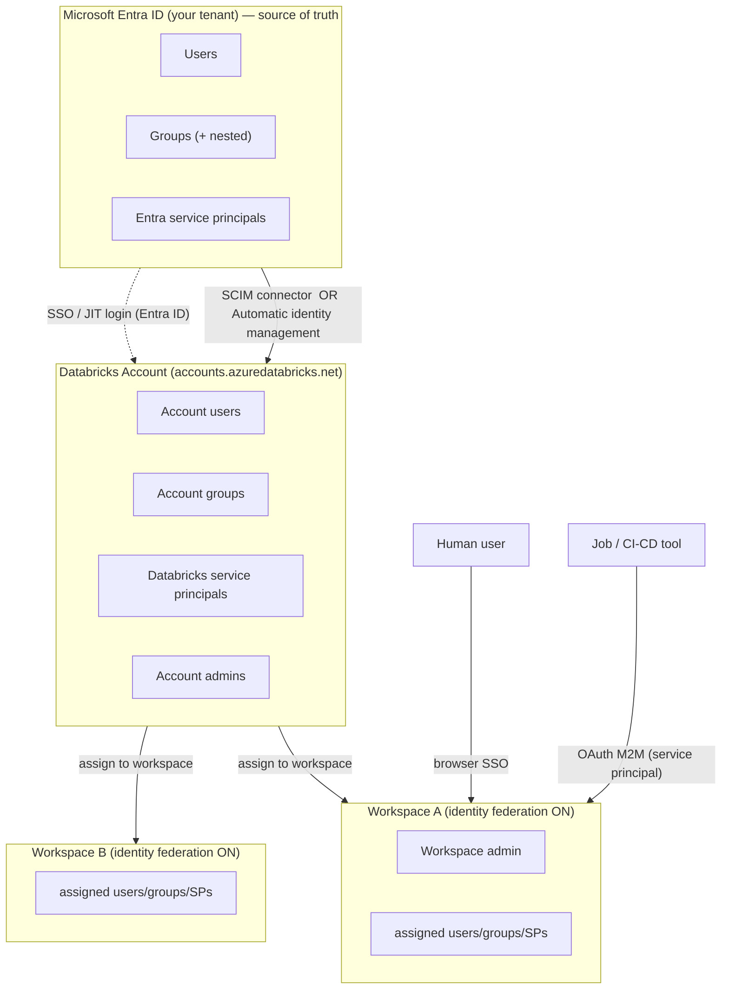
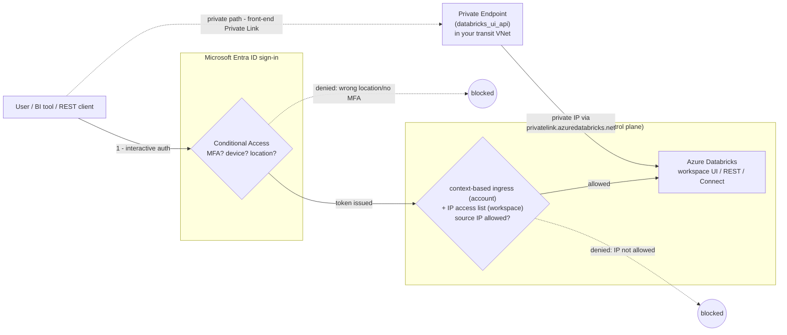

# Topic 6 — Security, Identity & Access (Azure-first)

> **Stage 6 · Security, Identity & Access** — the *front door* of the platform.
> Networking (Stages 1–4) decided *which network paths* can reach a workspace.
> This topic decides **who is on the other end of the path, how they prove it, and
> from where they may connect**. It has two subtopics:
>
> - **6.1 Identity & Authentication** — *who are you, and how do you prove it?*
>   (Microsoft Entra ID SSO, provisioning, service principals, tokens).
> - **6.2 Network Access Controls for Users** — *where are you connecting from?*
>   (IP access lists, context-based ingress, Conditional Access, front-end Private Link).
>
> Authorization (*what are you allowed to do* — Unity Catalog grants/ABAC/masking)
> is the next topic (6.3) and is referenced but not taught here.

---

## 🧠 Topic mental model — hold this in your head

> **Identity is the front door; network access controls are the layers around the
> door. Microsoft Entra ID is the single keymaker, and the workspace front door has
> a bouncer (IP), a badge-reader (Conditional Access), and an optional private
> tunnel (front-end Private Link) that can brick the public door entirely.**

- **Dominant picture — a building security desk + a guarded front door.**
  - **Entra ID** *issues the badges* (SSO); the **HR feed** (SCIM / automatic
    identity management) *adds and removes badge-holders automatically*; a **service
    principal** is a *robot's badge*; a **token** is a *day-pass* a tool carries
    instead of the master badge. (6.1)
  - **Conditional Access** is the **badge reader** at the door (right badge, managed
    device, swiped at a trusted location); **IP access lists** are the **bouncer
    reading the return address** on every envelope; **front-end Private Link** is a
    **private tunnel that replaces the public door**. (6.2)
- **The one sentence to remember:** *define an identity once in Entra ID, prove it
  via SSO (humans) or short-lived OAuth (robots), then gate the door by where the
  request comes from — IP lists filter the public door, Conditional Access
  conditions who walks through, and front-end Private Link removes the public door.*
- **Where it sits in the three-path scaffold (M1.2):** this entire topic hardens
  the **start of path ① user/client → control plane**. 6.1 answers *who/how-proven*;
  6.2 answers *from where*. It does **nothing** for path ② (compute ↔ control, secured
  by SCC / back-end Private Link) or path ③ (compute → storage). **The one crossover:**
  under SCC the classic compute plane's *egress* IP also knocks on this same front
  door — so a path-① IP allow list can accidentally break path ② if you forget it.

---

## Terms used here (define-before-use)

Quick glosses for borrowed terms so you can read top-to-bottom; each points to the
module that owns the deep dive.

| Term | Plain-language gloss | Owner |
| --- | --- | --- |
| **IdP (identity provider)** | The system that holds users/passwords and verifies logins (here, Microsoft Entra ID). | 6.1 (here) |
| **Microsoft Entra ID** | Azure's cloud IdP (formerly "Azure AD / AAD"); Azure Databricks logs in against it by default. | 6.1 (here) |
| **SSO / JIT** | Single Sign-On (log in once via the IdP); Just-in-Time creates the Databricks user on first login. | 6.1 (here) |
| **SCIM** | Open standard that *pushes* users/groups from your IdP into an app via a connector. | 6.1 (here) |
| **Automatic identity management** | The newer, SCIM-free way Azure Databricks reads Entra ID directly (incl. nested groups + SPs). | 6.1 (here) |
| **Service principal (SP)** | A non-human "robot" identity for jobs/CI-CD with its own credential and lifecycle. | 6.1 (here) |
| **OAuth M2M / U2M** | Machine-to-machine / user-to-machine OAuth — short-lived tokens, the recommended path. | 6.1 (here) |
| **PAT** | Personal access token — a long-lived bearer secret; legacy. **Not** an interactive sign-in, so Conditional Access can't see it. | 6.1 (here) |
| **Conditional Access** | An Entra ID policy that gates a *sign-in* on conditions (MFA, compliant device, trusted location). | 6.2 (here) |
| **IP access list** | A workspace/account allow/block list of source IPv4 ranges permitted to reach the UI/API. | 6.2 (here) |
| **Context-based ingress control** | Account-level ingress policy combining identity + request type + network source; governs many workspaces. | 6.2 (here) |
| **Named location** | An Entra ID-defined set of trusted IP ranges/countries a Conditional Access policy can match. | 6.2 (here) |
| **VNet injection** | Deploying the workspace into *your own* VNet so you own subnets/NSGs/routing. Front-end Private Link **requires** it. | **deep dive M2.1** |
| **SCC / No Public IP (NPIP)** | Secure Cluster Connectivity: cluster VMs get no public IP, open no inbound ports, and dial *out* to the control plane via a public **egress IP** you must allow-list. | **deep dive M2.3** |
| **Front-end / back-end Private Link** | Front-end = private path for *user → workspace*; back-end = private path for *compute → control*. | **deep dive M3.1** |
| **Private DNS zone** | Azure internal "phonebook" (`privatelink.azuredatabricks.net`) resolving workspace/SSO URLs to private PE IPs. | **deep dive M3.2** |
| **Unity Catalog grant** | A `GRANT` on a UC securable; only **account groups** can receive them (not workspace-local groups). | **deep dive 6.3 / M4b.3** |

---

# Section 6.1 — Identity & Authentication

## What it is (plain language)

- **Authentication** = proving *who you are* (login). **Authorization** = deciding
  *what you can do* (grants — topic 6.3). This section is **authentication + identity
  management**.
- **Microsoft Entra ID** (formerly "Azure AD / AAD") is Azure's cloud IdP — it holds
  your users, groups, and passwords and verifies logins. Azure Databricks uses it for
  login by default; there is nothing to "turn on" for the Microsoft IdP.
- **SSO** lets a user log in once to their corporate identity and reach many apps; on
  Azure Databricks SSO is Entra-ID-backed out of the box.
- **SCIM** automatically pushes users/groups from your IdP into Databricks via a
  connector; **automatic identity management** is the newer, connector-free way
  Databricks reads Entra ID directly.
- **Service principal** = a non-human "robot user" for jobs, pipelines, dbt, and
  CI/CD, so automation never runs as a person.
- **Tokens** = the credential a script/tool presents instead of a password: a **PAT**
  (legacy, long-lived) or an **OAuth / Entra ID token** (short-lived, recommended).

**One-line analogy:** Entra ID is the **building's central security desk** that issues
badges (SSO); SCIM / automatic identity management is the **HR feed** that adds and
removes badge-holders; a service principal is a **robot's badge**; a token is a
**day-pass** a contractor's tool carries instead of the master badge.

**Why an Azure Databricks engineer cares:** a perfectly private network (Private Link,
SCC, NCC) is worthless if a stale leaver still holds a 2-year PAT, or if every job runs
as a named human who gets off-boarded. Identity is the control a security reviewer
probes *first* — "how do users log in, how are they provisioned, how do you off-board,
and what runs your production jobs?"

## Why it matters

- **Off-boarding is a security event.** Centralizing on Entra ID + SCIM / automatic
  identity management means deactivation in the IdP propagates to Databricks
  automatically (the honest caveat: existing **PATs are not auto-revoked** on
  deactivation — revoke them explicitly).
- **Account-first is the modern model.** Define a user/group/SP **once in the account**,
  then assign to workspaces (identity federation). The legacy per-workspace model
  duplicates identities and drifts.
- **Tokens are the most-leaked credential.** Long-lived PATs in notebooks, repos, and CI
  logs are the classic breach vector. OAuth + service principals + lifetime caps shrink
  the blast radius.
- **Automation must not be a person.** Run production jobs as service principals so no
  human's off-boarding breaks a pipeline and humans never need write access to prod.

## The identity model in one picture



The whole story: **identities live in Entra ID → sync into the Databricks account →
get assigned to identity-federated workspaces → authenticate via SSO (humans) or OAuth
tokens (automation).**

## Traffic path — what actually happens at login

- **Human, browser:** open `adb-<id>.azuredatabricks.net` → redirect to Microsoft Entra
  ID → authenticate (password + MFA) → Entra ID returns a signed assertion → logged in.
  No separate Databricks password. **Conditional Access (6.2) is evaluated here**, at
  sign-in, before a token is issued.
- **Robot, OAuth M2M:** the job/CI tool presents a **client ID + client secret** for a
  service principal to the token endpoint → receives a **short-lived** OAuth token → calls
  the REST API/SQL endpoint. No PAT, no browser, **no Conditional Access** (not an
  interactive sign-in).

## WHY IT BREAKS (cause → effect)

- **User logs in but has no access / wrong groups.** *Cause:* workspace is non-federated,
  or the group is a **workspace-local group** (created inside a legacy workspace) which is
  *not* an account group → *Effect:* it can't receive Unity Catalog grants or be assigned
  centrally. **First check:** is the workspace identity-federated, and is the group an
  account group?
- **Duplicate users / conflicting permissions.** *Cause:* the same principal is
  provisioned via **both SCIM and automatic identity management** → *Effect:* duplicate
  entries + permission conflicts. **First check:** the provisioning source for that
  identity — pick one.
- **A nested group's members or an SP are missing.** *Cause:* SCIM syncs neither nested
  groups nor SPs; or the SP hasn't authenticated yet (SPs **provision on first use**) →
  *Effect:* they're invisible/unusable. **First check:** is automatic identity management
  on, and has the SP run at least once?
- **Job suddenly fails to authenticate.** *Cause:* it ran as a **named human** who got
  off-boarded, or a **PAT** that hit `maxTokenLifetimeDays` / the 90-day-unused
  auto-revoke → *Effect:* 401/403. **First check:** the auth principal and token age.

## Sub-topic deep dive

### A. Entra ID SSO, MFA & JIT
- Entra-ID-backed SSO is **default** for the account and all workspaces — nothing to turn
  on for the Microsoft IdP. Because login *is* an Entra ID login, you enforce **MFA** and
  **Conditional Access** in Entra ID (see 6.2), and they apply to Databricks automatically.
- **JIT provisioning** auto-creates a Databricks user on first Entra ID login — enabled by
  default for accounts created after **2025-05-01**, and always on when automatic identity
  management is enabled.
- **Multi-IdP:** the first-party IdP is always Microsoft Entra ID. Standardize on Okta/Ping
  by **federating that IdP into Entra ID** (Entra ID stays the IdP Databricks talks to).

### B. Identity federation (account vs workspace identities)
- Account-level identities are defined **once in the account console** and *assigned* to
  workspaces. **Identity federation** is what lets an account identity reach a workspace.
- **Enabled by default** for new workspaces and **cannot be disabled**. Older workspaces may
  be non-federated; their **workspace-local groups** can't get Unity Catalog grants —
  convert them to account groups.

### C. Account vs workspace admins

| Role | Scope | Can do |
| --- | --- | --- |
| **Account admin** | Whole account | Add users/SPs/groups; assign admin roles; create/manage workspaces & metastores; assign identities to federated workspaces; account-wide token report, SCIM, SSO, automatic identity management |
| **Workspace admin** | One workspace | Add users/SPs to the account; add groups *if* their workspace is federated; grant workspace access; manage that workspace's PAT policy and tokens |
| **Group manager / SP manager** | One group / one SP | Manage that group's membership / roles on that SP |

Keep admins **few** (highly privileged); use **groups** for everything else; never run
automation as an admin human.

### D. Provisioning — SCIM vs Automatic identity management

| | Automatic identity management | SCIM provisioning |
| --- | --- | --- |
| Sync users | ✓ | ✓ |
| Sync groups | ✓ | ✓ (direct members only) |
| Sync **nested** groups | ✓ | ✗ |
| Sync **service principals** | ✓ | ✗ |
| Needs an Entra app / admin role | ✗ | ✓ (Cloud App Administrator) |
| On by default | ✓ (accounts after **2025-08-01**) | ✗ |
| Requires identity federation | ✓ | recommended (account-level) |

- **Account-level SCIM is recommended**; **workspace-level SCIM is legacy** — migrate off it.
- **Don't mix the two on the same identity** → duplicates + conflicts. Databricks recommends
  automatic identity management as the single source of truth; keep SCIM as a documented
  fallback. Group memberships refresh ~**5 min** after a browser login, ~**40 min** for
  token auth / job runs.

### E. Service principals (identities for automation)
- **Databricks-managed SP** — created in Databricks; authenticates with **OAuth M2M**
  (client ID + secret). **Recommended** for Databricks-only automation.
- **Entra ID SP** — an Entra app registration; use it when an Azure resource only speaks
  Entra ID tokens (e.g. Azure DevOps).
- Run **all production jobs as service principals** — interactive humans then never need
  write/delete on prod. SPs are account-level identities; assign access via **groups**.

### F. PAT vs OAuth tokens (and token lifetime — the part reviewers probe)

| Credential | Lifetime | Use it when | Avoid because |
| --- | --- | --- | --- |
| **PAT** (legacy) | Default **max 730 days**; auto-revoked after **90 days unused** | A tool only supports PATs (some partner integrations) | Long-lived bearer secret — the classic leak vector; **bypasses Conditional Access** |
| **OAuth U2M** | Short-lived, auto-refreshed | Attended CLI/SDK use as yourself | — |
| **OAuth M2M** (service principal) | Short-lived | **Automation / CI-CD / jobs** — recommended | — |
| **Entra ID token** | Per Entra policy | Azure-native resources that only speak Entra ID | Not recommended for hand-creating ADB user tokens |

- **PATs are enabled by default** per workspace; an admin can **disable** them entirely or
  scope creation/use to specific groups. Set a shorter cap with `maxTokenLifetimeDays`
  (Databricks advises **< 90 days**; `"0"` reverts to the 730-day default).
- **Account admins** get an account-wide **Token report** (Account console → Security →
  Token report) to find/revoke long-lived or orphaned tokens.

> **Analogy:** a PAT is a **house key you cut once and never change** — convenient until
> it's copied. OAuth M2M is a **smart-lock code that expires hourly** and is tied to a
> specific robot. Prefer the expiring code.

## Illustrative config (6.1) — one snippet (full IaC → hands-on artifact)

```bash
# Create a Databricks-managed service principal for prod jobs + an OAuth M2M secret.
# Auth: ACCOUNT ADMIN against the account host. (Illustrative — not the full module.)
databricks account service-principals create --json '{"displayName":"prod-job-runner"}'
# -> returns application_id (client ID) used for OAuth M2M
databricks account service-principal-secrets create <SP_ID>
# -> { "id": "...", "secret": "..." }   # store the secret in Azure Key Vault, never in VCS

# Cap NEW PATs at 90 days for a workspace (Databricks advises < 90). Workspace-admin auth.
databricks workspace-conf set-status --json '{ "maxTokenLifetimeDays": "90" }'
# Disable PATs entirely (warning: Partner Connect / partner integrations need PATs ON):
databricks workspace-conf set-status --json '{ "enableTokensConfig": "false" }'
```

**Portal/Account Console click-paths:**
- **MFA / Conditional Access:** `Azure Portal → Microsoft Entra ID → Security → Conditional
  Access → + New policy` → target the **AzureDatabricks** app.
- **Automatic identity management:** `Account console → Security → User provisioning →
  Automatic identity management = Enabled` (5–10 min), then add Entra users/groups/SPs from
  a federated workspace.
- **Service principal:** `Account console → User management → Service principals → Add` →
  **Generate secret** (records client ID + secret).
- **PAT policy:** `Workspace → Settings → Advanced → Personal Access Tokens` toggle;
  account-wide find/revoke at `Account console → Security → Token report`.

> ⚠️ Verify provider/REST argument names against current docs before applying — schemas
> drift. `maxTokenLifetimeDays` and `enableTokensConfig` are the documented Workspace
> Configuration keys.

## Comparison table (6.1) — provisioning & auth at a glance

| Question | Modern / recommended | Legacy / fallback |
| --- | --- | --- |
| How do humans log in? | Entra ID SSO + MFA / Conditional Access (default) | — |
| How are identities provisioned? | **Automatic identity management** (no Entra app) | Account-level SCIM connector |
| Where are identities defined? | **Account** (identity federation) | Per-workspace (workspace-local) |
| What runs production jobs? | **Service principal** + OAuth M2M | A named human + PAT |
| Credential for API/CLI? | OAuth (U2M / M2M / token federation) | PAT |
| Token lifetime | Short-lived OAuth, auto-refresh | PAT capped < 90 days (default 730) |

## Uses, edge cases & limitations (6.1)

**Uses** — centralized onboarding/off-boarding driven by Entra ID; one group assigned to
many workspaces; SPs for every pipeline; auditable token policy. Pairs with the 6.2 network
controls.

**Edge cases**
- **Mixing SCIM + automatic identity management** on the same identity → duplicates/conflicts.
- **Workspace-local groups** can't get Unity Catalog grants — convert to account groups.
- **Cross-tenant Entra ID** is **not supported** by automatic identity management; use SCIM
  with Entra B2B if you must span tenants.
- **SPs provision on first use**; **nested groups/SPs not directly provisioned** are visible
  in the UI but **can't be managed via API/Terraform**.
- **Partner Connect requires PATs enabled** — disabling PATs workspace-wide breaks it.
- **Stale tokens of deactivated users are NOT auto-revoked** — revoke explicitly.

**Limitations** — SCIM/identity features need **Premium**; account limits **10,000 combined
users + SPs** and **5,000 groups**. The Entra SCIM connector is **not available in Azure China**.
First-party SSO IdP is **Microsoft Entra ID** (federate others into it).

## FDE field notes (6.1)

**Common customer asks**
- *"When someone leaves, does access really disappear?"* — yes if Entra ID is the source of
  truth via SCIM / automatic identity management; caveat: **existing PATs aren't auto-revoked**.
- *"Can we force MFA / block off-network logins?"* — yes, via Entra ID **Conditional Access**
  on the AzureDatabricks app (6.2), not a Databricks toggle.
- *"Can we ban PATs entirely?"* — yes per workspace, but it breaks Partner Connect / PAT-only tools.
- *"Can we use Okta directly?"* — on Azure, federate it *into* Entra ID; Entra ID stays the IdP.

**Talk-track:** "Identity is the front door — we make Microsoft Entra ID the single source of
truth, run every production job as a service principal on short-lived OAuth, and cap or kill
long-lived PATs, so off-boarding in your IdP is the only lever you need."

**What breaks + first check** — see *WHY IT BREAKS* above.

**Decision rule** — default everyone to **Entra ID SSO + automatic identity management +
service principals on OAuth M2M** (Premium, no extra Azure cost). Reach for **SCIM** only when
automatic identity management can't apply (cross-tenant B2B, or an existing governed SCIM
pipeline). Keep **PATs** only where a partner tool requires them, scoped + capped < 90 days.

## Common mistakes / gotchas (6.1)
- Running prod jobs as a person; long-lived PATs (default 730 days); disabling PATs without
  checking Partner Connect; assuming deactivation revokes tokens (it doesn't); leaving
  workspaces non-federated / relying on workspace-local groups; double-provisioning via SCIM
  *and* automatic identity management; calling Entra ID "AAD"; forgetting MFA/Conditional Access
  live in **Entra ID**, not Databricks.

---

# Section 6.2 — Network Access Controls for Users

## What it is (plain language)

A user reaching an Azure Databricks workspace logs in over the public internet **by default**
— from any coffee shop, any country, any IP. Network access controls add a second question on
top of "who are you?": **"are you coming from a network we trust?"** Three layers, weakest to
strongest:

- **IP access lists** — allow/block list of source **IPv4** ranges (CIDR). Configurable at two
  scopes: the **account console** (account admins) and the **workspace** (workspace admins).
  *Analogy: a bouncer checking the return address on every envelope.*
- **Microsoft Entra ID Conditional Access** — identity-aware sign-in policy on the
  **AzureDatabricks** enterprise app (`2ff814a6-3304-4ab8-85cb-cd0e6f879c1d`): require MFA,
  compliant/managed device, trusted named location, or block legacy auth.
  *Analogy: the building's badge reader.*
- **Front-end (inbound) Private Link** — the strongest control: give the workspace a **private
  IP inside your VNet** and (optionally) **disable public network access**, so the workspace
  has no internet-facing front door. *Analogy: an unlisted private phone line — there is no
  public number left to dial.*

**One-line framing:** IP access lists *filter* the public door, Conditional Access *conditions*
who walks through it, and front-end Private Link *removes* the public door altogether.

**Why an engineer cares:** if a password is phished, authentication alone won't stop the
attacker — but a request from an unrecognized IP/country, an unmanaged device, or outside your
VNet will be denied by these network controls. This is the layer compliance teams probe hardest.

> **All three require the Databricks Premium plan.** Conditional Access additionally requires
> **Microsoft Entra ID P1/P2 (Premium)**. IP access lists are **IPv4 only**.

## Why it matters

- **Defense in depth on the front door.** Credentials get stolen; network location is far
  harder to spoof. IP + identity + private connectivity means one compromised secret isn't enough.
- **Compliance mandates it.** "No access from outside the corporate network" maps to IP access
  lists (soft) or front-end Private Link with public access disabled (hard).
- **These controls compose, they don't replace each other.** A mature deployment runs
  Conditional Access *and* front-end Private Link *and* IP access lists / context-based ingress.

## The big picture — where each control sits



> **Evaluation order that matters:** Entra ID Conditional Access is evaluated at **sign-in**
> (before a token is issued). Databricks then evaluates network ingress on the **request**:
> the account-level **context-based ingress** policy and the **workspace IP access list** are
> **enforced together — a request must be allowed by both** (per the doc), and a workspace list
> can only **narrow**, never widen, what the account policy allows. Front-end Private Link
> operates at the network layer beneath all of this (it changes *which IP* the request arrives on).

## Traffic path — public door vs private tunnel

- **Public door (gated):** client → Entra ID sign-in (Conditional Access) → token →
  request to `adb-<id>.azuredatabricks.net` → context-based ingress (account) **and** IP access
  list (workspace) check the source IP → allowed → workspace UI/REST/Connect.
- **Private tunnel:** client inside (or peered to) your VNet → `privatelink.azuredatabricks.net`
  Private DNS resolves the workspace URL to the **private IP** of the `databricks_ui_api` Private
  Endpoint → control plane; SSO redirect resolves the regional `*.pl-auth.azuredatabricks.net` URL
  to the `browser_authentication` endpoint's private IP. With **Public Network Access = Disabled**
  the public door is bricked over.

## WHY IT BREAKS (cause → effect)

- **Classic clusters won't launch after enabling workspace IP access lists.** *Cause:* under SCC,
  the compute plane's **egress public IP** calls the control plane (path ②) and that IP is **not on
  the ALLOW list** → *Effect:* clusters fail to launch. **First check:** is the **SCC/NAT egress IP**
  on the allow list? (This is the #1 self-inflicted break — a path-① control breaking path ②.)
- **Admins locked out.** *Cause:* an ALLOW list that omits your current IP → *Effect:* you can't
  reach the UI/console. **First check:** hit the **REST API/CLI as account admin** or disable
  `enableIpAccessLists`.
- **Lists "do nothing" after being added.** *Cause:* `enableIpAccessLists` is still `false` →
  *Effect:* lists are silently ignored. **First check:** `databricks workspace-conf get-status
  enableIpAccessLists`.
- **A request the workspace list permits is still denied.** *Cause:* the **account-level
  context-based ingress** policy denies it (the two are enforced together) → *Effect:* blocked.
  **First check:** the account policy (and whether it's in dry-run vs enforced mode).
- **SSO redirect fails after front-end Private Link.** *Cause:* missing `browser_authentication`
  endpoint or custom-DNS forwarding for `*.pl-auth.azuredatabricks.net` → *Effect:* login redirect
  can't complete. **First check:** `nslookup` the regional SSO URL — public IP/NXDOMAIN = the web-auth
  endpoint or DNS forwarding is missing, not `databricks_ui_api`.
- **Conditional Access "isn't blocking" a tool.** *Cause:* the client uses a **PAT/pre-issued
  OAuth token** → *Effect:* it bypasses Conditional Access (not an interactive sign-in).
  **First check:** the auth method, not the CA policy.

## Sub-topic deep dive

### A. IP access lists — account & workspace scope
- **Account scope** controls the **account console** (`accounts.azuredatabricks.net`); **workspace
  scope** controls one workspace's **UI, REST API, and Databricks Connect**.
- **ALLOW/BLOCK semantics:** a list is typed `ALLOW` or `BLOCK`; **BLOCK beats ALLOW** (excluded
  even if it matches an allow list). When the feature is enabled but **no lists exist, all IPs are
  allowed** — the moment you add an allow list, everything not on it is blocked.
- **IPv4 only.** No IPv6, no Azure Government, no Azure China (Mooncake). Serverless that calls the
  account console may need *additional* Databricks-side IPs allow-listed (contact your account team).
- **The SCC gotcha (critical):** the compute plane's **egress public IP(s)** must be on the workspace
  allow list, or classic clusters won't launch (see *WHY IT BREAKS*).
- **Direction of travel:** Databricks now recommends **context-based ingress control** (account-level)
  as the *primary* ingress method — identity + request type + network source, dry-run or enforced,
  one policy across many workspaces. Workspace IP lists can only **narrow** it.

### B. Microsoft Entra ID Conditional Access
- Identity-aware sign-in policy on the **AzureDatabricks** app, evaluated **at sign-in** before a
  token is issued. Enforce **MFA**, **compliant/Hybrid-joined device**, **trusted named location**,
  **block legacy auth**, or a sign-in-risk threshold (P2).
- **Requirements:** Databricks **Premium** **and** **Entra ID Premium (P1/P2)**; you hold the
  **Conditional Access Administrator** role.
- **Key limitation (interview favorite):** it governs **interactive Entra ID sign-ins** only — it
  does **not** gate a **PAT** or a pre-issued OAuth/SP token. Lock down/disable PATs (6.1) if
  Conditional Access is your location/MFA gate.
- **Doc status caveat:** the dedicated Azure Databricks Conditional Access page is **archived**, but
  the mechanism is standard Entra ID and the **app ID + Premium requirements are current**.

### C. Front-end (inbound) Private Link — the strongest control
- **Two sub-resources (exact names):**
  - **`databricks_ui_api`** — private endpoint for the **workspace UI, REST API, and Databricks
    Connect** (the inbound user path).
  - **`browser_authentication`** — private endpoint for the **SSO/OAuth browser callback**. Without
    it, the login redirect can't complete privately. Host it on a **dedicated, delete-locked web-auth
    workspace** (e.g. `WEB_AUTH_DO_NOT_DELETE_<region>`) in the transit VNet so a deleted prod
    workspace doesn't break regional SSO.
- **Private DNS:** both integrate with **`privatelink.azuredatabricks.net`**. The workspace record
  resolves to the `databricks_ui_api` private IP; the regional SSO URL
  (`<region>.pl-auth.azuredatabricks.net`) resolves to the `browser_authentication` private IP.
- **Public access — two models:** **No public access** (Public Network Access = **Disabled**, the
  hard fully-private posture) or **Hybrid** (Private Link active *and* public still enabled but gated
  by context-based ingress + IP access lists).
- **Requirements:** **Premium**, **VNet injection**, and the ability to create PEs + manage DNS.

## Illustrative config (6.2) — one snippet (full IaC → hands-on artifact)

```bash
# Workspace IP access list. MUST include the SCC/NAT egress IP or classic clusters fail.
databricks workspace-conf set-status --json '{ "enableIpAccessLists": "true" }'  # enable first; lists ignored until true
databricks ip-access-lists create --json '{
  "label": "office-and-vpn",
  "list_type": "ALLOW",
  "ip_addresses": ["1.1.1.0/24", "203.0.113.7/32"]   # include the SCC/NAT egress IP!
}'
```

```hcl
# Front-end Private Endpoint (the user-facing databricks_ui_api sub-resource) in the transit VNet.
# Prereq: VNet-injected Premium workspace; PE subnet; Network Contributor. (Illustrative.)
resource "azurerm_private_endpoint" "ui_api" {
  name                = "adb-fe-ui-api-pe"
  subnet_id           = azurerm_subnet.transit_pe.id      # PE subnet in the TRANSIT VNet
  location            = var.region
  resource_group_name = var.rg
  private_service_connection {
    name                           = "adb-ui-api"
    private_connection_resource_id = azurerm_databricks_workspace.this.id
    is_manual_connection           = false
    subresource_names              = ["databricks_ui_api"]  # exact sub-resource name
  }
  private_dns_zone_group {                                  # resolve URL to the PRIVATE IP
    name                 = "adb-fe-dns"
    private_dns_zone_ids = [azurerm_private_dns_zone.adb.id] # privatelink.azuredatabricks.net
  }
}
```

**Portal click-paths:**
- **Workspace IP list (CLI-led):** `databricks workspace-conf set-status enableIpAccessLists=true`
  → add ALLOW/BLOCK lists. **Account console list:** `Account console → Security → Account console IP
  access list → Enabled → Add rule`.
- **Conditional Access:** `Azure Portal → Microsoft Entra ID → Security → Conditional Access → +New
  policy` → Target resources → search app `2ff814a6-3304-4ab8-85cb-cd0e6f879c1d` (**AzureDatabricks**)
  → Conditions → Locations / Grant → Require MFA / compliant device → **Report-only first**, then On.
- **Front-end Private Link (hybrid):** confirm VNet injection + SCC on → `Workspace → Networking →
  Private endpoint connections → +Private endpoint` (`databricks_ui_api`, transit VNet, Integrate with
  private DNS = Yes) → create a delete-locked **web-auth workspace** + `browser_authentication` PE →
  verify `nslookup` returns the **private** IP.

> ⚠️ Conditional Access has no clean first-party Terraform in the `databricks` provider — use the
> `azuread` provider's `azuread_conditional_access_policy` or the Portal. The Private DNS zone name
> `privatelink.azuredatabricks.net` is fixed by the platform — do not invent another. Verify
> `azurerm`/`azuread` argument names against current docs before applying.

## Comparison table (6.2) — the three controls

| Control | Scope | What it checks | Strength | Tier / prereq | Key limitation |
| --- | --- | --- | --- | --- | --- |
| **IP access list (account)** | Account console | Source **IPv4** | Soft | Premium | IPv4 only; no Gov/Mooncake; serverless may need extra IPs |
| **IP access list (workspace)** | One workspace UI/API/Connect | Source **IPv4** | Soft | Premium | Must allow SCC/NAT egress IP; only narrows context-based ingress |
| **Context-based ingress** | Account → many workspaces | Identity + request type + IP | Medium | Premium | Newer primary method — verify GA/region before prod |
| **Entra ID Conditional Access** | AzureDatabricks app sign-in | Identity, MFA, device, named location | Medium-strong | Premium **+ Entra ID Premium** | Interactive sign-in only — **PATs bypass it** |
| **Front-end Private Link** | Workspace network path | Arrives on a **private IP** in your VNet | **Strongest** | Premium **+ VNet injection** | Needs `browser_authentication` PE + private DNS; custom-DNS care |

## Uses, edge cases & limitations (6.2)

**Uses** — Conditional Access: baseline MFA + block-legacy-auth on every tenant. IP access lists: pin
access to corporate egress/VPN ranges. Front-end Private Link: regulated workloads requiring zero
public exposure (pair with back-end Private Link + DEP firewall).

**Edge cases** — locking yourself out (omit your IP); **SCC egress IP not allow-listed** (most common
break); **PAT bypass of Conditional Access**; **custom DNS** must forward both `*.azuredatabricks.net`
*and* `*.pl-auth.azuredatabricks.net`; **BI tools / partner apps** (Power BI) must originate from an
allow-listed IP or the private path.

**Limitations** — all three need **Premium**; Conditional Access also **Entra ID Premium**. IP access
lists are **IPv4 only** and **soft**. Front-end Private Link needs **VNet injection**, careful DNS, the
`browser_authentication` endpoint, and a resilient delete-locked web-auth workspace.

## FDE field notes (6.2)

**Common customer asks**
- *"Can a user reach our workspace from a personal laptop at home?"* → Conditional Access
  (compliant device + named location) + IP access lists; front-end Private Link with public access
  **Disabled** removes the path entirely.
- *"Does any user traffic ever cross the public internet?"* → only front-end Private Link with
  **Public Network Access = Disabled** gives a clean "no."
- *"We're rolling out MFA tenant-wide — does that cover Databricks?"* → yes, via the AzureDatabricks
  app, but warn **PATs and pre-issued tokens bypass it**.
- *"Will turning this on lock our admins or break clusters?"* → two real risks: omitting your own IP,
  and omitting the SCC/NAT egress IP.

**Talk-track:** "Authentication proves *who* you are; these controls prove *where you're connecting
from*. Start with Conditional Access (MFA + device + location) on every workspace — cheap, high value
— then add IP access lists to pin to your networks, and move to front-end Private Link only when you
need to delete the public door for a regulator. They stack; you don't choose one."

**What breaks + first check** — see *WHY IT BREAKS* above.

**Decision rule** — **every Premium customer:** Conditional Access (MFA, block legacy auth, compliant
device for admins). **"Users must be on our network" (cost-sensitive):** IP access lists /
context-based ingress (fast, no VNet-injection prerequisite, but IPv4-only and soft). **Regulated /
"no public internet path":** front-end Private Link with **Public Network Access = Disabled** (needs
VNet injection, a delete-locked web-auth workspace, DNS work; pair with back-end Private Link).

## Common mistakes / gotchas (6.2)
- Forgetting the SCC/NAT egress IP on the allow list; assuming Conditional Access covers tokens;
  treating IP access lists as a substitute for Private Link; skipping `browser_authentication`;
  putting the web-auth endpoint on a normal (deletable) workspace; editing lists without
  `enableIpAccessLists=true`; expecting IPv6 or Azure Government/Mooncake support.

---

## Topic decision guide

| Customer profile | Recommend | Why |
| --- | --- | --- |
| Any Premium customer | Entra ID SSO + automatic identity management + SPs on OAuth M2M + **Conditional Access** (MFA, block legacy auth) | Lowest cost, highest baseline value; off-boarding via the IdP; no extra Azure cost |
| "Users must be on our network" (policy, not law) | + **IP access lists / context-based ingress** | Fast, no VNet-injection prerequisite; IPv4-only and soft, but good enough when the mandate is policy |
| Regulated / "no public internet path" (FSI, health, gov) | + **front-end Private Link, Public Network Access = Disabled** | Only option that truly removes the public door; pair with back-end Private Link for end-to-end privatization |
| Cross-tenant identity | **SCIM + Entra B2B** (not automatic identity management) | Automatic identity management is single-tenant only |

**Rule of thumb:** *identity first, then network location.* Make Entra ID the single source of truth
and run jobs as service principals before you touch any network control. Then layer the network
controls from cheap (Conditional Access) → soft (IP lists) → hard (front-end Private Link), only as the
regulatory bar demands. They stack.

---

## References (Azure-first)

**6.1 — Identity & Authentication**
- [Authorize access to Azure Databricks resources](https://learn.microsoft.com/azure/databricks/dev-tools/auth/) — OAuth U2M/M2M, Entra ID tokens, OAuth token federation, account vs workspace APIs.
- [Automatic identity management](https://learn.microsoft.com/azure/databricks/admin/users-groups/automatic-identity-management/) — default after 2025-08-01, nested groups + service principals, vs-SCIM table, ~5/40-min sync, cross-tenant not supported, SP-on-first-use, JIT always on.
- [Sync users and groups from Microsoft Entra ID using SCIM](https://learn.microsoft.com/azure/databricks/admin/users-groups/scim/) — account vs workspace SCIM, Premium, 10k user / 5k group limits, China-region caveat.
- [Identity best practices](https://learn.microsoft.com/azure/databricks/admin/users-groups/best-practices) — account vs workspace admins, identity federation, SPs for production.
- [Configure SSO in Azure Databricks](https://learn.microsoft.com/azure/databricks/security/auth/single-sign-on/) — Entra-ID SSO default, MFA, JIT (default after 2025-05-01).
- [Monitor and revoke personal access tokens](https://learn.microsoft.com/azure/databricks/admin/access-control/tokens) — 730-day default max, 90-day-unused auto-revoke, `maxTokenLifetimeDays`, token report, disable PATs.

**6.2 — Network Access Controls for Users**
- [Users to Azure Databricks networking (front-end overview)](https://learn.microsoft.com/azure/databricks/security/network/front-end/) — Premium requirement; private connectivity, context-based ingress, IP access lists.
- [Configure IP access lists for workspaces](https://learn.microsoft.com/azure/databricks/security/network/front-end/ip-access-list-workspace) — `enableIpAccessLists`, ALLOW/BLOCK, IPv4 only, **enforced together with context-based ingress (must pass both)**, SCC egress-IP requirement.
- [Configure IP access lists for the account console](https://learn.microsoft.com/azure/databricks/security/network/front-end/ip-access-list-account) — Account Console path, ALLOW/BLOCK, IPv4 only, no Gov/Mooncake.
- [Context-based ingress control](https://learn.microsoft.com/azure/databricks/security/network/front-end/context-based-ingress) — identity + request type + network source, dry-run/enforced, account-level.
- [Configure Inbound (front-end) Private Link](https://learn.microsoft.com/azure/databricks/security/network/front-end/front-end-private-connect) — `databricks_ui_api` & `browser_authentication`, `privatelink.azuredatabricks.net`, Public Network Access Disabled, web-auth workspace, custom DNS.
- [Conditional access for Azure Databricks (archived)](https://learn.microsoft.com/azure/databricks/archive/azure-admin/conditional-access) — AzureDatabricks app ID `2ff814a6-3304-4ab8-85cb-cd0e6f879c1d`, Premium + Entra ID Premium, Conditional Access Administrator role. *(Archived; mechanism is standard Entra ID.)*

> **Verified against Azure Databricks docs**, fetched **2026-06-26**: automatic identity management
> page updated 2026-06-11 (GA, default after 2025-08-01, single-tenant, nested groups + SPs); workspace
> IP access list page updated 2026-05-04 (IPv4 only, Premium, **enforced together with context-based
> ingress — a request must pass both**, SCC egress-IP requirement). The Conditional Access doc is
> **archived** (mechanism is standard Entra ID) — reconfirm time-sensitive items (default dates, token
> lifetimes, preview/GA, account limits) before quoting to a customer.
