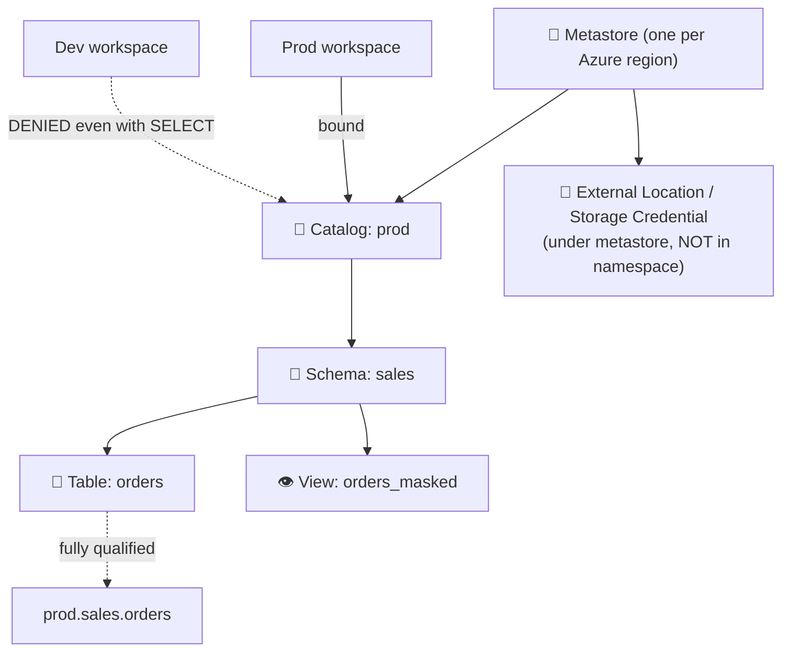
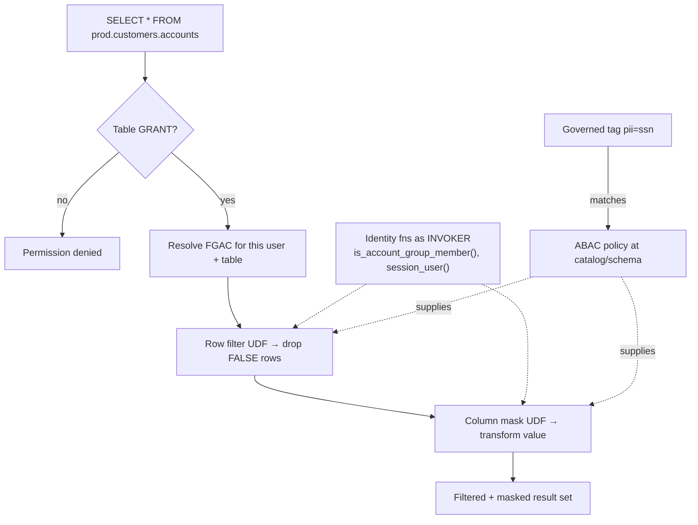
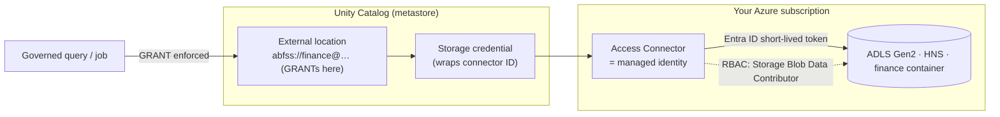
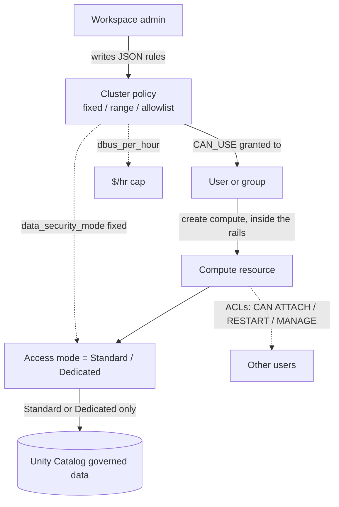

# Topic 7 — Security, Authorization & Governance (Azure-first)

> **Stage 7 · Azure Databricks Networking & Security** — for the **FDE / RSA /
> Solutions Architect** who has to *explain and defend* the **authorization** half
> of "Networking & Security" to a customer's security team. Stages 2–6 decided
> **which packets can reach storage**. This topic decides **who can read which row
> of which table, who Databricks proves it is to your storage, and who can launch
> the compute that touches the data** — controls that ride *on top of* every
> network path. A regulated customer needs *both*: a Private Endpoint stops the
> path; a missing `GRANT` stops the query.
>
> **This one page covers all four subtopics:**
> - **7.1 — Unity Catalog hierarchy & grants** (who can do what to which object)
> - **7.2 — ABAC, row filters & column masks** (which rows / column values come back)
> - **7.3 — Storage credentials, external locations & the access connector** (how a
>   governed query reaches ADLS Gen2 with no key to rotate)
> - **7.4 — Cluster policies & access modes** (who can launch compute, what it can
>   be, who can touch the objects)
>
> Companion interactive page: `index.html` (tabbed, one interactive architecture
> diagram per subtopic). Static topology: `architecture.svg`.

---

## 🧠 Topic mental model (hold this in your head)

> **Governance is a secured building with four nested controls — and the network is
> the wall around it.**
>
> - **7.1 Grants** — the **keys**. To open a cabinet (table) you need the *floor key*
>   (`USE CATALOG`) **and** the *room key* (`USE SCHEMA`) **and** the *cabinet key*
>   (`SELECT`), all at once.
> - **7.2 FGAC** — the **frosted glass and the bouncer inside the room**. Same key for
>   everyone, but *which rows you see and how clearly you see each value* is decided at
>   query time, by who you are. **ABAC** installs that frosted glass *by a label*
>   (`pii=ssn`) instead of by hand, so it follows the data everywhere.
> - **7.3 Storage credential / access connector** — the **contractor's badge issued by
>   the building (Azure)**. You never hand over a copy of your house key; you authorize
>   a managed-identity badge at the front desk (RBAC on ADLS), point one door at it (the
>   external location), and revoke it anytime.
> - **7.4 Policy + access mode + ACL** — **three locks on the compute door, in series**:
>   the policy is the *vending machine* an admin stocks (you can only pull the levers
>   loaded, never above the price cap); the access mode is the *kind of room* (shared-
>   but-isolated vs private) that decides whether UC will even trust it; the ACL is the
>   *badge reader* on each object.
>
> **The one sentence:** *the network decides which packets reach storage; Unity Catalog
> decides which principal reads which row; the access connector decides who Databricks
> proves it is to ADLS; and policies/access modes/ACLs decide who can launch the compute
> and touch the objects — five locks on the same door, and a regulated customer needs
> all of them.*
>
> **Where it sits in the three-path scaffold (from 2.2):** this whole topic is the
> **authorization layer that rides on top of all three connectivity paths** — Path ①
> (user ↔ Databricks: the SSO login carries the Entra ID principal UC enforces and FGAC
> redacts), Path ② (compute ↔ control plane: where UC mints short-lived storage
> credentials and the policy/access-mode contract is enforced), and Path ③ (compute →
> ADLS Gen2: where the external location + access connector authorize the access the
> network path permits). FGAC, grants, policies and ACLs are **not** a fourth network
> path — they secure *content and capability* after the packet is already allowed.

---

## Why this topic matters to an architect

- **It's the other half of every regulated-customer review.** Once the network is
  locked down (Stages 2–6), the security team pivots to *"prove an analyst can never see
  PII in another catalog,"* *"show me there's no storage key to leak,"* and *"stop anyone
  launching a six-figure GPU cluster."* None of those are firewall questions — they're
  this topic.
- **It's where networking and governance meet.** **Workspace-catalog binding** (7.1) and
  **storage-credential/external-location binding** (7.3) tie a *data domain* to a
  *processing environment*, so prod data is unreachable from a dev workspace **even with
  a valid grant**. The access connector (7.3) is the identity half of Path ③ that the
  network half (Service/Private Endpoint, NCC) must also permit.
- **It separates "understood" from "memorised."** Saying *which three grants are needed
  together*, *that FGAC is a UDF with an identity check inside*, *that there is no key on
  the credential chain*, and *that a policy, an access mode, and an ACL are three
  separate locks* is what earns credibility in the room.
- **It's the audit anchor.** Every grant, query, access decision, and policy change is
  logged to the `system.access` system tables — the evidence a compliance team asks for.

---

## Terms used here (define-before-use)

Most identity/network terms get their **deep dive in earlier stages** — here is the 2–3
line gloss so this page reads top-to-bottom, plus the module that owns the full
treatment.

| Term | Plain-language gloss | Owning module |
| --- | --- | --- |
| **Principal** | A security identity a grant/ACL can target: a **user**, a **group**, or a **service principal** (a non-human app identity). | Deep dive **Stage 4** (Identity) |
| **Microsoft Entra ID** | Azure's cloud identity provider (formerly "Azure AD"); the source of truth for users/groups Databricks consumes. | **Stage 4** |
| **SSO & SCIM** | **SSO** authenticates the user at login; **SCIM** auto-provisions/syncs users & groups from Entra ID into the Databricks account. | **Stage 4** |
| **Identity federation** | Makes **account-level** users/groups usable inside individual workspaces, so one grant works everywhere. | **Stage 4** |
| **ADLS Gen2** | Azure Data Lake Storage Gen2 — hierarchical-namespace (**HNS**) blob storage that actually holds the data UC governs. | **Stage 1**, network path **Stages 5–6** |
| **Managed identity** | An Entra ID identity Azure creates and manages *for a resource*, with **no secret you ever see or store**; Azure mints short-lived tokens for it. | **Stage 4 / 6** |
| **RBAC** (role-based access control) | Azure's authorization model: assign a *role* (e.g. `Storage Blob Data Contributor`) to an identity at a *scope*. The Azure-side gate, separate from UC grants. | Azure foundations |
| **Storage firewall / trusted Resource instance** | ADLS can refuse all public traffic and admit only named Azure resources; a managed identity (not a service principal) can be on that allowlist. | Network path **Stages 5–6** |
| **Private Link / Private Endpoint** | An Azure feature giving a service a private IP inside your VNet — the *network* control complementing UC's *authorization* control. | **Stage 5** |
| **UDF** (user-defined function) | A SQL function registered in UC; FGAC uses one as its rule engine — a row-filter UDF returns `BOOLEAN`, a mask UDF returns the column's type. | **7.2 (owns it)** |
| **Governed tag** | An **account-level** tag with a controlled value list and assign-permissions; ABAC keys off these (plain tags can't drive ABAC). | **7.2 (owns it)** |
| **DBU** (Databricks Unit) | Databricks' normalized unit of processing per hour; your bill ≈ DBUs/hr × VM cost. The `dbus_per_hour` policy cap bounds it. | **7.4 (owns it)** |
| **Access mode / `data_security_mode`** | A compute resource's security mode — **Standard** (`USER_ISOLATION`) or **Dedicated** (`SINGLE_USER`); UC requires one of these. | **7.4 (owns it)** |
| **System table** | A read-only, Databricks-managed table (e.g. `system.access.audit`) recording account activity for audit/observability. | Audit-logs lesson (**Stage 7**) |

---

# 7.1 — Unity Catalog hierarchy & grants

## What it is (plain language)

- **Unity Catalog (UC)** is Azure Databricks' single, **account-level** governance layer
  for data and AI — the one place you say "who can do what to which object," enforced
  everywhere (notebooks, SQL warehouses, jobs, BI tools).
- It organizes everything as a **hierarchy of securable objects** (a *securable* is "a
  thing you can grant on"). Data objects sit in a **three-level namespace**:
  `catalog.schema.object` (table, view, volume, function, or model).
- You control access with two SQL verbs: **`GRANT`** (give a privilege to a principal)
  and **`REVOKE`** (take it away). A *principal* is a user, group, or service principal.

**Analogy:** UC is a **filing system in a secured building**. The **metastore** is the
building; **catalogs** are floors; **schemas** are rooms; **tables/views/volumes** are
the cabinets. A `GRANT` is a key — and to reach a cabinet you need the *floor* key
(`USE CATALOG`), the *room* key (`USE SCHEMA`), **and** the *cabinet* key (`SELECT`).
Holding only the cabinet key gets you nowhere.

**Why a networking/security engineer cares:** in a security review you'll be asked "show
me how a data analyst is restricted to one schema and can never see PII in another
catalog." That's a UC grant-design question, not a firewall question. And
**workspace-catalog binding** is where networking and governance meet — it pins a *data
domain* (catalog) to a *processing environment* (workspace) so prod data is unreachable
from a dev workspace **even with a valid grant**.

## Traffic path / where it sits

UC is the **authorization layer on top of all three paths**: the SSO login on Path ①
carries the Entra ID principal UC enforces; Path ② is where UC mints short-lived storage
credentials; Path ③ is where the external location authorizes the access the network
permits.

## How it works — deep dive

### The securable hierarchy

| Level | Object | What it is | Lives under |
| --- | --- | --- | --- |
| 0 | **Metastore** | Top-level container; **one per cloud region** per account | the account |
| 1 | **Catalog** | First namespace level; a *data domain* (per team / SDLC stage) | metastore |
| 2 | **Schema** (database) | Second level; a project / use-case grouping | catalog |
| 3 | **Table / View / Volume / Function / Model** | The data & AI assets | schema |

- **Data objects use the 3-level namespace** `catalog.schema.object` — always fully
  qualify in scripts and grants.
- **Non-data securables sit *directly under the metastore*, not in the namespace** —
  storage credentials, external locations, connections, shares, recipients. They govern
  *how* UC reaches storage/external systems (7.3); they are securable but not
  `catalog.schema.x`.
- **Metastore-level privileges do NOT inherit** (`CREATE CATALOG`, `CREATE EXTERNAL
  LOCATION` are metastore *operations* only) — unlike catalog/schema grants, which
  cascade. **Metastore admin** is `root`-equivalent (can take ownership of any object) —
  minimize who holds it.

### Privileges — the two-rule mental model (recite this)

1. **Usage privileges are gates, not access.** To read `prod.sales.orders` a user needs
   **three** grants together: `USE CATALOG` on `prod` **+** `USE SCHEMA` on `prod.sales`
   **+** `SELECT` on the table. `USE CATALOG`/`USE SCHEMA` grant *traversal*, never data.
2. **The usage gate is the owner's control boundary.** Only a catalog owner (or `MANAGE`)
   can grant `USE CATALOG`, so a table owner who grants `SELECT` still can't give access
   unless the catalog owner lets them in. Ownership cascades control downward.

Key privileges: `USE CATALOG` / `USE SCHEMA` (gates), `SELECT` / `MODIFY` (table data),
`READ VOLUME` / `WRITE VOLUME` (files), `EXECUTE` (functions/models), `BROWSE`
(discovery without `USE`, catalog level only), `ALL PRIVILEGES` (excludes `MANAGE`,
`EXTERNAL USE SCHEMA`, `EXTERNAL USE LOCATION`), `MANAGE` (administer grants without
being owner — but **not** auto-granted data).

### Privilege inheritance (the cascade)

- A grant on a **container** (catalog or schema) applies to **all current *and future***
  child objects — the power *and* the footgun. Grant at the **narrowest level** that
  satisfies the need.
- **Metastore grants are the exception — they do NOT inherit.**

### Workspace-catalog binding (the networking/governance bridge)

- **Default: a catalog is reachable from *every* workspace** attached to the metastore.
  Binding overrides that to a chosen set.
- **Binding supersedes grants.** From an unbound workspace, access is **denied even with
  an explicit `SELECT`** — environment isolation that keeps prod data reachable only from
  prod workspaces. **Read-only binding** is available per workspace. Also bindable:
  external locations, storage credentials, credentials.

## WHY IT BREAKS (cause → effect)

- *"I granted `SELECT` but the user still can't read it."* → almost always a **missing
  `USE CATALOG`/`USE SCHEMA` gate** (the #1 cause), **or** the catalog isn't **bound** to
  their workspace, **or** a **view** references a base table the *view owner* can't read.
- *Read works from one workspace, denied in another* → the catalog is `ISOLATED` and
  **not bound** to that workspace; binding supersedes the grant.
- *Cross-workspace grant silently does nothing* → it was granted to the
  **workspace-local** `workspace admins` group instead of an **account group**.

## 7.1 illustrative config (the primary surface = SQL `GRANT`)

```sql
-- Least-privilege read for a whole GROUP (always grant to groups, not users).
-- A reader needs all THREE: enter the catalog, enter the schema, read the table.
GRANT USE CATALOG ON CATALOG prod             TO `data-analysts`;  -- gate: enter floor
GRANT USE SCHEMA  ON SCHEMA  prod.sales       TO `data-analysts`;  -- gate: enter room
GRANT SELECT      ON TABLE   prod.sales.orders TO `data-analysts`; -- the actual read

-- Inheritance: grant once on the SCHEMA → cascades to ALL current + FUTURE tables.
GRANT SELECT ON SCHEMA prod.sales TO `data-analysts`;

-- Discovery without data access: BROWSE (catalog level only).
GRANT BROWSE ON CATALOG prod TO `account users`;

SHOW GRANTS ON SCHEMA prod.sales;                          -- needs owner/MANAGE/admin
REVOKE SELECT ON TABLE prod.sales.orders FROM `data-analysts`;
```

```bash
# Workspace-catalog binding has no clean SQL surface — switch OPEN → ISOLATED, then bind.
databricks catalogs update prod_catalog --isolation-mode ISOLATED --profile <p>
databricks workspace-bindings update-bindings catalog prod_catalog \
  --json '{"add":[{"workspace_id":1234567890,"binding_type":"BINDING_TYPE_READ_WRITE"}]}' \
  --profile <p>
```

> **Terraform name gotcha:** the `databricks` provider uses **underscores**
> (`USE_CATALOG`, `CREATE_TABLE`) while SQL uses **spaces**. `databricks_grants` is
> *authoritative* (revokes anything not listed) — use `databricks_grant` (singular) for
> additive grants. Full IaC is deferred to the optional hands-on artifact.
> **Catalog Explorer:** workspace → **Catalog** → object → **Permissions** tab → **Grant**;
> binding → catalog → **Workspaces** tab → clear "All workspaces" → **Assign**.

## 7.1 mermaid — securable hierarchy + binding bridge



---

# 7.2 — ABAC, row filters & column masks

## What it is (plain language)

Once a user has `SELECT`, by default they see **every row and every column** — often too
much. **Fine-grained access control (FGAC)** narrows what `SELECT` returns *at query
time*, transparently. UC gives three tools, oldest → most scalable:

- **Dynamic views** — a `VIEW` that filters rows (`WHERE`) or masks columns (`CASE`)
  based on *who is asking*, via `is_account_group_member('grp')`. Point users at the
  view, not the table. *The "redacted photocopy."* The only one that **reshapes/joins**
  data.
- **Table-level row filters & column masks** — attach a **UDF** directly to the table
  with `ALTER TABLE … SET ROW FILTER` / `ALTER COLUMN … SET MASK`. The base table itself
  enforces it. *The "tinted window on the table."*
- **ABAC policies** — define a **governed tag** (`pii=ssn`), tag sensitive
  columns/tables, then write **one policy** at catalog/schema scope that auto-masks/
  filters *every object carrying that tag*, now and in future. *The "label it once, the
  rule follows the label everywhere."* ABAC for row filters/column masks is **generally
  available on Azure** (verify current GA date and per-region status before quoting; GRANT
  policies for models are **Beta** — reconfirm current status; verified Beta per the
  canonical ABAC page); the recommended way to do FGAC at scale
  (governed tags GA — reconfirm date in release notes).

**Analogy:** dynamic views hand each visitor a custom-redacted photocopy; row
filters/masks tint the table's own glass; **ABAC** puts a "CONFIDENTIAL" sticker on the
data and a building-wide rule that auto-redacts anything with that sticker.

## Traffic path / where it sits

FGAC is **not a fourth network path** — it secures the **content returned on Path ①**
*after* authentication and the object `GRANT` (7.1) have let the user in. Network
controls decide *whether* a user reaches the table; FGAC decides *what bytes come back*.

## How it works — the query-time enforcement path

1. UC authorizes the table `GRANT` (`SELECT`). Pass → continue; fail → error.
2. UC resolves FGAC for **this user** on **this table**: table-level row filter / column
   mask attached? → apply. ABAC policies in scope whose tag+principal match? → apply.
   (Querying a dynamic view instead → the view's `WHERE`/`CASE` logic runs.)
3. The filter/mask **UDFs are injected into the query plan before results return** — a
   row-filter UDF returns `BOOLEAN` (drop `FALSE` rows); a mask UDF returns the column's
   type (masked value).
4. **Identity functions inside the UDFs run as the INVOKER** (the person running the
   query) — `is_account_group_member()`, `session_user()`. That is what makes per-user
   logic work.

> **Key insight:** the filter/mask is just **a UDF with an identity check inside**. Once
> you see that, dynamic views, table-level bindings, and ABAC policies are the *same idea
> attached in three different places* — the view, the table, or the governed tag.

## WHY IT BREAKS (cause → effect)

- *Query suddenly returns no data after enabling FGAC* → the **compute floor**: ABAC
  needs serverless or standard/dedicated **DBR ≥ 16.4**; table-level needs **DBR ≥ 12.2
  LTS** (15.4 for dedicated). It **fails secure** (no data), not loud.
- *Mask never applies / filter returns everything* → used **`is_member()`**
  (workspace-local) instead of **`is_account_group_member()`** (account); **or** ANSI is
  off so a STRING-vs-INT param mismatch silently became `NULL`. Enable
  `spark.sql.ansi.enabled`.
- *Pipeline refresh / time travel / clone fails on a protected table* → the **run-as
  identity isn't in the policy's `EXCEPT`**; exempt the trusted ETL service principal.
- *Table became inaccessible* → the **UDF was dropped before the binding**; recover with
  `ALTER TABLE … DROP ROW FILTER`/`DROP MASK`.

## 7.2 illustrative config (one snippet per mechanism)

```sql
-- A) Dynamic view: only the `auditors` account group sees real emails.
CREATE VIEW prod.customers.sales_redacted AS
SELECT user_id,
  CASE WHEN is_account_group_member('auditors') THEN email ELSE 'REDACTED' END AS email,
  country, total
FROM prod.customers.sales_raw;   -- grant SELECT on the VIEW, never the base table

-- B) Table-level row filter UDF (RETURNS BOOLEAN; identity runs as INVOKER) + bind.
CREATE FUNCTION prod.customers.us_filter(region STRING)
  RETURN IF(is_account_group_member('admin'), true, region = 'US');
ALTER TABLE prod.customers.sales SET ROW FILTER prod.customers.us_filter ON (region);
-- DROP the filter BEFORE dropping the UDF, or the table locks up.

-- C) ABAC: governed tag → one policy auto-covers every tagged column in the schema.
CREATE GOVERNED TAG pii VALUES ('ssn','ccn','dob');               -- account-level
ALTER TABLE prod.customers.accounts ALTER COLUMN ssn SET TAGS ('pii' = 'ssn');
CREATE FUNCTION prod.governance.ssn_last(ssn STRING, nr INT) RETURN right(ssn, nr);
CREATE POLICY mask_ssn ON SCHEMA prod.customers
  COLUMN MASK prod.governance.ssn_last
  TO us_analysts EXCEPT admins                                    -- EXCEPT sees raw data
  FOR TABLES MATCH COLUMNS has_tag_value('pii','ssn') AS ssn
  ON COLUMN ssn USING COLUMNS (4);
SHOW EFFECTIVE POLICIES ON SCHEMA prod.customers;                 -- includes inherited
```

> **Catalog Explorer:** governed tags are created in the **Account Console** → **Catalog
> / Settings → Governed tags**; policies in the workspace → **Catalog** → scope object →
> **Policies** tab → **New policy**. `CREATE GOVERNED TAG` **SQL** needs DBR 18.1+; the
> Account Console UI is the cross-version path. Full flow in the hands-on `governance_demo.sql`.

## 7.2 mermaid — FGAC injected at query time



---

# 7.3 — Storage credentials, external locations & the access connector

## What it is (plain language)

The bridge between UC's *logical* permission model and the *physical* ADLS Gen2 that
holds the bytes. Three objects, learned as a chain:

- **Access Connector for Azure Databricks** — a first-party Azure resource
  (`Microsoft.Databricks/accessConnectors`) that holds an **Azure managed identity** —
  the Entra ID identity Databricks authenticates *as* when it reaches your storage. You
  grant *that identity* an RBAC role on ADLS. **No keys, no secrets, nothing to rotate.**
- **Storage credential** — a UC securable that **wraps the access connector's resource
  ID**: UC's record of "here is an auth mechanism I'm allowed to use." Lives at the
  metastore level.
- **External location** — a UC securable that binds a **path**
  (`abfss://container@account.dfs.core.windows.net/path`) **to a storage credential**.
  It's the thing you actually `GRANT` on.

**The one-line chain:** *external location (path + grants) → storage credential (which
identity) → access connector (the managed identity) → RBAC on ADLS Gen2 — and there is
no key to copy or rotate anywhere on that chain.*

**Analogy:** the access connector's managed identity is a **contractor's badge issued by
the building (Azure)** — you never hand over a copy of your house key. Authorize the
badge at the front desk (RBAC), point one door at it (the external location's path),
register it in your access system (the storage credential), revoke anytime.

## Traffic path (trace the call)

This is entirely **Path ③ — compute → storage**, the *identity-and-authorization half*.
When a governed job needs data, Databricks authenticates **as the managed identity** to
Entra ID, receives a **short-lived OAuth token**, and presents it to ADLS Gen2. ADLS
checks the token's identity against its **RBAC role assignments** and allows or denies.
Nothing in the path is a stored secret. Network reachability (Service/Private Endpoint,
firewall, NCC — Stages 5–6) and this credential chain must **both** succeed for a read.

## How it works — deep dive

- **Managed identity flavours:** **system-assigned** (1:1 with the connector lifecycle,
  default when you flip Status → On) vs **user-assigned** (standalone, reusable, survives
  connector deletion — prefer when central IAM owns the identity's lifecycle).
- **Why managed identity over a service principal/storage key?** No secret to store or
  rotate, **and** it **works through a storage firewall** — a managed identity can be
  allowlisted as a trusted **Resource instance** on ADLS; a service principal **cannot**.
  This is the deciding factor for private/locked-down storage.
- **RBAC on ADLS (the Azure-side half):** assign `Storage Blob Data Contributor`
  (account-wide) **to the access connector's identity**, or `Storage Blob Delegator`
  (account) + `Storage Blob Data Contributor` (container) for one-container scope, or
  `Storage Blob Data Reader` for read-only. You need `Owner`/`User Access Administrator`
  on the storage account to assign these.
- **Non-overlapping paths** — UC won't let one external location's path overlap another's,
  so a given `abfss://…` resolves to exactly one location (unambiguous grants).
- **Isolation via physical separation:** separate containers/accounts per catalog
  (`CREATE MANAGED LOCATION`), and **workspace binding** so a dev workspace physically
  cannot mint a token to prod storage even with the UC privilege.

## WHY IT BREAKS (cause → effect)

- *Triage rule — split identity from network first.* **Catalog Explorer → external
  location → Test connection.** Fails on *authorization* → RBAC/identity half; fails on
  *reachability/timeout* → network half (firewall / private endpoint / DNS). Don't chase
  RBAC for a firewall block.
- *Reads fail 403 / `AuthorizationFailure` though the credential validates* → the **RBAC
  role is on the wrong identity** (the workspace managed-RG identity, not the access
  connector's) or the wrong scope.
- *Validation passes, first data read fails* → **HNS not enabled** on the storage account
  (plain Blob / OneLake are unsupported).
- *Identity correct but traffic refused at the network layer* → the connector isn't a
  trusted **Resource instance** (and "trusted Azure services" is off) while public access
  is disabled.
- *Dev workspace can reach prod storage* → the credential/external location is **unbound**
  (metastore-wide).

## 7.3 illustrative config (the two UC securables)

```sql
-- 1) Storage credential wraps the access connector's managed identity. No secret stored.
CREATE STORAGE CREDENTIAL `finance_mi`
  WITH AZURE_MANAGED_IDENTITY
    ACCESS_CONNECTOR_ID = '/subscriptions/<sub>/resourceGroups/<rg>/providers/Microsoft.Databricks/accessConnectors/<name>'
    -- MANAGED_IDENTITY_ID = '…/userAssignedIdentities/<uami>'   -- ONLY if user-assigned
  COMMENT 'MI for the finance ADLS account';

-- 2) External location binds an abfss:// path to that credential.
CREATE EXTERNAL LOCATION IF NOT EXISTS `finance_lake`
  URL 'abfss://finance@mystorageacct.dfs.core.windows.net/'
  WITH (STORAGE CREDENTIAL `finance_mi`);

-- 3) Path-scoped grants — what enforcement keys on.
GRANT READ FILES, WRITE FILES ON EXTERNAL LOCATION `finance_lake` TO `finance-engineers`;
GRANT CREATE EXTERNAL TABLE    ON EXTERNAL LOCATION `finance_lake` TO `finance-engineers`;
```

```bash
# Lock ADLS to ONLY this connector (storage-firewall pattern for private workspaces).
az storage account network-rule add \
  --resource-id "/subscriptions/<sub>/resourceGroups/<rg>/providers/Microsoft.Databricks/accessConnectors/<name>" \
  --tenant-id "<tenant>" -g "<storage-rg>" --account-name "<storage-account>"
# Then CLEAR "Allow Azure services on the trusted services list…" so ONLY the named
# connector (a Resource instance) is trusted — not every Azure service.
```

> **Order is always:** (1) access connector → (2) RBAC on ADLS → (3) storage credential →
> (4) external location → (5) grants. **Portal:** Create a resource → **Access Connector
> for Azure Databricks** → Managed Identity → On; storage account → **Access Control
> (IAM)** → add `Storage Blob Data Contributor` → **Managed identity** → the connector;
> then **Catalog Explorer → + → Create a credential / external location**.

## 7.3 mermaid — the credential chain



---

# 7.4 — Cluster policies & access modes

## What it is (plain language)

Three distinct controls that decide **who can spin up compute, what that compute can be,
and who can touch the objects around it** — the *compute-side* companion to UC data
governance. Keep them separate:

- **Cluster (compute) policy** — a **template + rulebook** an admin writes that
  constrains what a user can configure (node type, max workers, autotermination, runtime,
  **and a hard cap on $/hour via DBUs**). No policy access → can't create compute.
  *Analogy: a corporate travel tool that only shows economy flights under a price cap.*
- **Access mode** — a **security property of each compute resource** deciding *who shares
  it* and *what UC features it gets*: **Standard** (`USER_ISOLATION`, multi-user,
  isolated) or **Dedicated** (`SINGLE_USER`, one user or one group). *Analogy: a shared
  hot-desk with locked drawers vs a private office.*
- **Workspace-object ACL** — a **permission list** on each object (cluster, job, secret
  scope, notebook) saying who gets which verbs (attach, run, edit, manage). *Analogy: the
  per-door badge reader.*

> **Naming note:** the UI now uses **Standard** (was "Shared") and **Dedicated** (was
> "Single user"). Legacy **No Isolation Shared** / **Custom** are **not UC-compliant** —
> avoid them. REST/Terraform `data_security_mode` still uses `USER_ISOLATION` (= Standard)
> and `SINGLE_USER` (= Dedicated). Both names appear in the field — know both.

**Why an engineer cares:** "anyone can launch a 500-node GPU cluster and run a six-figure
bill" and "a contractor's notebook can read prod secrets" are *not* network problems —
they're policy/ACL problems. This is how you answer "how do you control cost and blast
radius of compute?"

## Traffic path / where it sits

**Not a path control** — it sits **on top of all three paths**, governing the compute
resource that *uses* Path ② (compute ↔ control) and Path ③ (compute → storage / UC).
Earlier stages lock the wires; 7.4 locks *what runs on them and who can launch it*.

## How it works — deep dive

- **Policy definition = JSON** mapping *attribute path → limitation*: `fixed`,
  `forbidden`, `allowlist`, `blocklist`, `regex`, `range`, `unlimited` (one limitation
  per attribute). Two **virtual attributes** matter most: **`dbus_per_hour`** (a `range`
  with `maxValue` — *your cost lever*) and **`cluster_type`** (`all-purpose` / `job` /
  `dlt`). **`data_security_mode`** fixed to `USER_ISOLATION`/`SINGLE_USER` is how you
  *force* UC compliance.
- **Default policies:** Personal Compute (Dedicated, all users by default), Shared Compute
  (Standard), Power User Compute (Dedicated ML), Job Compute. **Policy families** let you
  stamp consistent custom policies.
- **Access modes & UC:** only **Standard** and **Dedicated** support Unity Catalog.
  Standard runs commands as a **low-privilege user** that can't reach the instance
  metadata service / Azure WireServer — *that isolation is why it's UC-compliant and
  multi-tenant-safe*, at the cost of **no ML/GPU/R/RDD/Spark-submit**. **Dedicated** lifts
  those limits (single principal) and can be assigned to a **group** (with carve-outs,
  e.g. UC-volume log delivery).
- **ACL ladders:** cluster (NO PERMISSIONS → CAN ATTACH TO → CAN RESTART → CAN MANAGE);
  job (… CAN MANAGE RUN → IS OWNER → CAN MANAGE — **Run Now runs as the *owner*, not the
  clicker**); notebook/folder (CAN READ → RUN → EDIT → MANAGE, folders inherit); secret
  (READ → WRITE → MANAGE, **CLI/API only**, READ reveals *all* secrets in the scope);
  policy (**CAN USE** is the single grant that makes a policy appear in a user's dropdown).
- **Enforcement & drift:** editing a policy does **not** auto-restart running compute — a
  **Compliance** column flags drift; "Enforce on next restart" (non-disruptive) or
  "Restart and enforce." Jobs compute is enforced immediately.

> **Tier:** policies and fine-grained ACLs require the **Premium plan**.

## WHY IT BREAKS (cause → effect)

- *"I can't create a cluster / the policy isn't in my dropdown."* → no **CAN USE** on the
  policy (it's hidden), or `cluster_type` doesn't allow `all-purpose`.
- *"UC data is inaccessible from this cluster."* → it's a legacy `NONE` (No Isolation
  Shared/Custom) mode — not UC-compliant by design. Confirm `data_security_mode`.
- *"We edited the policy but clusters still run the old config / over budget."* → policy
  edits don't auto-restart; check the **Compliance** column and "Enforce on next restart."
- *"A low-priv analyst ran a job as a high-priv identity."* → **Run Now executes as the
  job owner**; check the owner and who holds CAN MANAGE RUN.
- *"A secret got exposed."* → **READ on a secret scope reveals every secret in it**; and
  driver logs default-restricted to CAN MANAGE can leak secrets if loosened.

## 7.4 illustrative config (the cost + UC-compliance enforcer)

```json
// "Team Standard" all-purpose policy: caps cost, forces UC-compliant access mode.
{
  "cluster_type":            { "type": "fixed", "value": "all-purpose" },
  "data_security_mode":      { "type": "fixed", "value": "USER_ISOLATION", "hidden": true }, // = Standard
  "dbus_per_hour":           { "type": "range", "maxValue": 50 },          // THE cost cap
  "autotermination_minutes": { "type": "fixed", "value": 30, "hidden": true },
  "autoscale.max_workers":   { "type": "range", "maxValue": 12, "defaultValue": 4 },
  "node_type_id":            { "type": "allowlist",
                               "values": ["Standard_DS3_v2","Standard_DS4_v2","Standard_D8s_v3"],
                               "defaultValue": "Standard_DS3_v2" },
  "spark_version":           { "type": "fixed", "value": "auto:latest-lts", "hidden": true }
}
```

```bash
# Secret-scope ACL — secrets are CLI/API-managed (no UI permissions modal).
# READ reveals + lists ALL secrets in the scope; scope secrets narrowly.
databricks secrets put-acl --scope prod-kv --principal data-engineers --permission READ
```

> **Portal/UI:** **Compute → Policies → Create policy** (Family optional) → set **Max DBUs
> per hour** + **Definitions** JSON → **CAN USE** to groups. Access mode: **Create compute
> → Advanced → Access mode** = Standard / Dedicated (Auto lets DBR decide). Enforce drift:
> **Policies → Compliance column → Enforce all**. Full Terraform deferred to hands-on.

## 7.4 mermaid — three locks in series



---

## Comparison tables

### The four controls at a glance

| Subtopic | What it decides | Primary surface | "No direct network cost"? |
| --- | --- | --- | --- |
| **7.1 Grants** | Who can do what to which object | SQL `GRANT`/`REVOKE`, Catalog Explorer | Yes (control-plane authorization) |
| **7.2 FGAC / ABAC** | Which rows / column values come back | `CREATE VIEW`/UDF/`CREATE POLICY` | Yes (but FGAC compute floor → may incur serverless) |
| **7.3 Storage credential** | How a governed query reaches ADLS (identity half of Path ③) | Access connector + UC securables | Yes (managed identity is free) |
| **7.4 Policy / access mode / ACL** | Who launches compute, what it can be, who touches objects | Policy JSON, access mode, ACLs | Yes — and the `dbus_per_hour` cap *reduces* cost |

### 7.2 — which FGAC mechanism?

| | Dynamic views | Table-level filter/mask | ABAC policies |
| --- | --- | --- | --- |
| Applies to | A view you build | One table / one column | Tables & columns matched by **governed tag** across a catalog/schema |
| Scales to many tables | No | No | **Yes — one policy, auto-applies by tag** |
| Separation of duties | Weak | Weak | **Strong** (steward tags; governance writes policy; owner can't remove) |
| Reshapes / joins data | **Yes** | No | No |
| Users query | The view | The base table | The base table |
| GA on Azure | Long-standing | DBR ≥ 12.2 LTS | **GA** (row filters/column masks; verify date & region — GRANT policies Beta) |

### 7.3 — how to authenticate UC to ADLS

| Mechanism | Secret to rotate? | Behind storage firewall? | Audited per-user via UC? | Verdict |
| --- | --- | --- | --- | --- |
| **Access connector + managed identity** | **No** | **Yes** | **Yes** | **Recommended** |
| Service principal + client secret | Yes | **No** | Yes | Legacy; avoid for new work |
| Storage account key / SAS | Yes | n/a | **No — bypasses UC** | Never for governed data |

### 7.4 — Standard vs Dedicated access mode

| Dimension | **Standard** (`USER_ISOLATION`) | **Dedicated** (`SINGLE_USER`) |
| --- | --- | --- |
| Shared by | Many users, isolated | One user or one group |
| Unity Catalog | ✅ | ✅ |
| Languages | Python, SQL, Scala | + **R** |
| ML / GPU / RDD / Spark-submit | ❌ | ✅ |
| Best for | Default, BI, collaborative | ML, R, single-team, unsupported-feature workloads |

---

## Uses, edge cases & limitations

**Uses**
- Least-privilege data access (7.1); mask PII / row-restrict by region/tenant, enforced
  server-side and auditable (7.2); keyless, firewall-traversing storage access + physical
  per-domain isolation (7.3); cost guardrails + forced UC compliance + least-privilege on
  compute/jobs/secrets (7.4).

**Edge cases (review/interview favorites)**
- **7.1:** "I granted `SELECT` but they can't read" = missing usage gate / unbound catalog
  / view-owner can't read base table; `main` catalog gives *all users* `USE CATALOG` by
  default — never park regulated data there; metastore grants don't inherit.
- **7.2:** compute floor (ABAC DBR ≥ 16.4 / serverless; table-level 12.2 LTS, dedicated
  15.4) — **fails secure, not loud**; `is_member()` vs `is_account_group_member()`; ANSI
  off → silent `NULL`s; time-travel/clone/pipeline-refresh need `EXCEPT`; AI Search indexes
  don't inherit masks; drop the binding **before** the UDF.
- **7.3:** HNS mandatory (no Blob/OneLake); WORM/immutability containers can't be external
  locations; public-access-disabled storage needs the connector as a trusted Resource
  instance; co-locate connector/storage/metastore to avoid egress; RBAC on the *connector*
  identity, not the managed-RG identity.
- **7.4:** editing a policy doesn't restart running clusters (drift); Run Now uses the
  job *owner's* identity; secret ACLs are CLI/API-only and READ exposes the whole scope;
  Dedicated-to-a-group has feature carve-outs; `dbus_per_hour` new form is `maxValue`-only.

**Limitations**
- One metastore per region; objects region-scoped (7.1). `ALL PRIVILEGES` excludes
  `MANAGE`/`EXTERNAL USE SCHEMA`/`EXTERNAL USE LOCATION` (7.1). ABAC quotas: 10,000
  policies/metastore, 100/catalog-or-schema, 50/table, 20 principals/policy, 3 `MATCH
  COLUMNS` (7.2); ≤ 1,000 governed tags/account, ≤ 50 values/tag. External-location paths
  can't overlap; credentials/locations are metastore-scoped until bound (7.3). Policies and
  fine-grained ACLs require **Premium** (7.4). Governance carries **no direct Azure
  networking cost** — it's a control-plane authorization concern, not a data-path one.

---

## FDE field notes

**Common customer asks (security/network team)**
- *"If we already lock the network with Private Link, why do we need UC grants?"* — the
  network gates the **path** to ADLS; UC gates **who reads which row**. A regulated
  customer needs both; one without the other is incomplete.
- *"Can we mask PII for everyone except a named clearance group, and prove it to auditors?"*
  — yes: a column-mask UDF or an ABAC `COLUMN MASK` policy keyed on a `pii` governed tag;
  the `EXCEPT` group is the documented clearance list; evidence is in `system.access.audit`.
- *"We have 10,000 tables — hand-bind a mask on each?"* — no; that's the ABAC pitch: tag
  once (often via Data Classification `class.*` system tags), one policy at catalog/schema
  scope, new tables auto-covered.
- *"Where is the storage key, and who rotates it?"* — there is none; the access connector's
  managed identity gets short-lived tokens — nothing to store, leak, or rotate.
- *"Can we keep ADLS at 'no public access' and still let Databricks in?"* — yes; the
  managed identity is allowlisted as a trusted **Resource instance** (a service principal
  can't be).
- *"How do we stop a six-figure GPU cluster / guarantee every cluster uses UC?"* — fix
  `node_type_id`/`dbus_per_hour` and `data_security_mode` in a cluster policy; grant CAN
  USE narrowly.
- *"How do we prove prod data is unreachable from the dev workspace?"* — **workspace-catalog
  binding** (7.1) + **storage-credential/external-location binding** (7.3); binding
  supersedes grants.

**Talk-track (positioning)**
- *"Governance is layered on top of the network you already secured. Unity Catalog is your
  single account-level authorization layer — one place to say who can do what, enforced
  identically everywhere. Row filters, column masks and ABAC decide which rows and column
  values come back, server-side at query time, so there's nothing to bypass. The access
  connector is the keyless identity that reaches your storage — no secret to rotate, and
  it's the one mechanism that works behind a locked firewall. And cluster policies +
  access modes + ACLs are the cost-and-compliance guardrail on the compute itself. Binding
  is the lever that pins a data domain to an environment so dev can't touch prod even by
  accident."*

**What breaks in the field + FIRST diagnostic check**
- *"Granted `SELECT`, still can't read"* → **first check `USE CATALOG`/`USE SCHEMA`**
  (`SHOW GRANTS` as owner), then catalog binding, then view-owner access.
- *FGAC returns no data after enabling* → **first check compute** (ABAC DBR ≥ 16.4 /
  serverless); it fails secure.
- *Mask never applies* → **first check** `is_account_group_member()` (not `is_member()`)
  and `spark.sql.ansi.enabled`.
- *Storage read fails* → **first run Test connection** to split identity (RBAC on the
  *connector* identity, HNS on) from network (trusted Resource instance / firewall / DNS).
- *Policy edited but clusters over budget* → **first check the Compliance column**;
  enforce on next restart.
- *Secret exposed / job ran as a high-priv identity* → **first check** secret-scope READ
  (whole-scope) and the **job owner** (Run Now = owner).

**Decision rule for the engagement**
- **Always recommend UC** as the governance baseline (no cheaper "skip governance" option;
  no direct networking cost). Add **binding (ISOLATED)** when separate dev/prod or
  multi-domain workspaces need provable environment isolation.
- **FGAC:** dynamic view to reshape/expose a redacted layer; table-level for one-off
  table-specific logic; **ABAC + governed tags** for a regulated customer with many tables
  and a central governance team — confirm serverless or DBR ≥ 16.4 first.
- **Storage:** access connector + managed identity for essentially every Azure engagement;
  user-assigned identity when central IAM owns the lifecycle; separate accounts/connectors
  per sensitivity tier only when a hard blast-radius boundary is mandated.
- **Compute:** cluster policies for any customer with >1 team or any cost/compliance
  concern; Standard access mode by default, Dedicated only for ML/GPU/R; reserve the
  Unrestricted policy/entitlement for admins. All require **Premium**.

---

## Common mistakes / gotchas

- **Forgetting the usage gates** — `SELECT` without `USE CATALOG`/`USE SCHEMA`. The #1
  "why can't they read it" ticket.
- **Granting to users, not account groups**; **over-granting at the catalog level**
  (future objects auto-exposed via inheritance); **confusing binding with grants** (binding
  overrides grants — both must be satisfied).
- **`is_member()` instead of `is_account_group_member()`** for UC data; **ungoverned tags
  for ABAC** (it needs *governed* tags); **dropping a UDF before unbinding** it (table
  locks); **expecting time-travel/clone/pipeline refresh to "just work"** on protected
  tables (use `EXCEPT`).
- **Granting RBAC to the workspace managed-RG identity** instead of the **access
  connector's** identity; **using a service principal** "because it's familiar" (can't
  cross a firewall, forces rotation); **forgetting HNS**; **leaving "trusted Azure
  services" on** when you meant to lock to just the connector; **overlapping
  external-location paths**.
- **Confusing the three compute controls** (policy = what it can be; access mode = who
  shares it + UC; ACL = who touches the object — they compose); **leaving Unrestricted
  broadly granted**; **a policy with no `dbus_per_hour` cap**; **a legacy access mode**
  then wondering why UC data is inaccessible; **treating secret READ as low-risk**.
- **Putting governed data in workspace storage / DBFS root** instead of a UC external
  location on ADLS Gen2.

---

## References

**7.1 — Unity Catalog hierarchy & grants**
- [What is Unity Catalog?](https://learn.microsoft.com/azure/databricks/data-governance/unity-catalog/) — object model, securables, auto-enable date (2023-11-09).
- [Unity Catalog securable objects reference](https://learn.microsoft.com/azure/databricks/data-governance/unity-catalog/securable-objects) — metastore (one per region), catalog/schema/table/view/volume/function/model.
- [Unity Catalog privileges reference](https://learn.microsoft.com/azure/databricks/data-governance/unity-catalog/access-control/privileges-reference) — full privilege list, `ALL PRIVILEGES`/`MANAGE`/`BROWSE`, inheritance.
- [Manage privileges in Unity Catalog](https://learn.microsoft.com/azure/databricks/data-governance/unity-catalog/manage-privileges/) — `GRANT`/`REVOKE`/`SHOW GRANTS`, Catalog Explorer click-paths.
- [Workspace-catalog binding](https://learn.microsoft.com/azure/databricks/data-governance/unity-catalog/access-control/workspace-catalog-binding) — ISOLATED mode, read-only, CLI bindings, supersedes grants.

**7.2 — ABAC, row filters & column masks**
- [Row filters and column masks (overview)](https://learn.microsoft.com/azure/databricks/data-governance/unity-catalog/filters-and-masks/) — what they are, ANSI/type-mismatch, limitations.
- [Manually apply row filters and column masks](https://learn.microsoft.com/azure/databricks/data-governance/unity-catalog/filters-and-masks/manually-apply) — `CREATE FUNCTION`, `ALTER TABLE SET ROW FILTER/SET MASK`, drop order.
- [Attribute-based access control in Unity Catalog](https://learn.microsoft.com/azure/databricks/data-governance/unity-catalog/abac/) + [policies](https://learn.microsoft.com/azure/databricks/data-governance/unity-catalog/abac/policies) + [requirements/quotas](https://learn.microsoft.com/azure/databricks/data-governance/unity-catalog/abac/requirements).
- [Governed tags](https://learn.microsoft.com/azure/databricks/admin/governed-tags/) · [Create a dynamic view](https://learn.microsoft.com/azure/databricks/views/dynamic) · [April 2026 release notes — claims ABAC GA 28 Apr 2026 / governed tags GA 2 Apr 2026 per the April 2026 release notes; reconfirm against current docs (the canonical ABAC feature page shows no GA date)](https://learn.microsoft.com/azure/databricks/release-notes/product/2026/april).

**7.3 — Storage credentials, external locations & the access connector**
- [Connect to an ADLS Gen2 external location](https://learn.microsoft.com/azure/databricks/connect/unity-catalog/cloud-storage/external-locations-adls) — access connector steps, RBAC roles, `CREATE EXTERNAL LOCATION`, HNS/WORM/trusted-services.
- [Use Azure managed identities in Unity Catalog](https://learn.microsoft.com/azure/databricks/connect/unity-catalog/cloud-storage/azure-managed-identities) — system- vs user-assigned, MI vs SP, storage-firewall trusted Resource instance.
- [Connect to cloud object storage using Unity Catalog (overview)](https://learn.microsoft.com/azure/databricks/connect/unity-catalog/cloud-storage/) · [`databricks_storage_credential`](https://registry.terraform.io/providers/databricks/databricks/latest/docs/resources/storage_credential) · [`databricks_external_location`](https://registry.terraform.io/providers/databricks/databricks/latest/docs/resources/external_location).

**7.4 — Cluster policies & access modes**
- [Create and manage compute policies](https://learn.microsoft.com/azure/databricks/admin/clusters/policies) + [Compute policy reference](https://learn.microsoft.com/azure/databricks/admin/clusters/policy-definition) + [Default policies and policy families](https://learn.microsoft.com/azure/databricks/admin/clusters/policy-families).
- [Compute configuration — Access modes](https://learn.microsoft.com/azure/databricks/compute/configure#access-modes) + [Standard compute requirements and limitations](https://learn.microsoft.com/azure/databricks/compute/standard-limitations).
- [Access control lists](https://learn.microsoft.com/azure/databricks/security/auth/access-control/) · [`databricks_cluster_policy`](https://registry.terraform.io/providers/databricks/databricks/latest/docs/resources/cluster_policy) · [`databricks_permissions`](https://registry.terraform.io/providers/databricks/databricks/latest/docs/resources/permissions).

> Verified against current Azure Databricks docs (UC pages updated 2026-06-23/24; FGAC/ABAC
> verified 2026-06-26; storage/connector pages June 2026; compute/policy pages
> 2026-06-11–16). Time-sensitive: **ABAC GA** for row filters/column masks (the April 2026
> release notes claim GA 28 Apr 2026 / governed tags GA 2 Apr 2026, but the canonical ABAC
> feature page shows no GA date — reconfirm date & region; GRANT policies are Beta),
> compute floors (ABAC DBR ≥ 16.4 / serverless; table-level 12.2 LTS, dedicated 15.4),
> ABAC quotas, `data_security_mode` API values, the Standard-mode limitation list, RBAC role
> names, and **Premium-tier** requirements — reconfirm before quoting a customer.

> **Hands-on artifact decision:** a single SQL companion (`governance_demo.sql`) covering
> 7.1 grants + binding, 7.2 view/filter/mask/ABAC, and 7.3 storage credential + external
> location adds value (the SQL surface is the real configuration surface for this module),
> plus a short Terraform/JSON snippet set for 7.4 policy + ACLs. It is **optional** and
> deferred — the illustrative snippets above are sufficient for architect-altitude
> understanding; build the full companion only if the engagement needs an apply-ready demo.
