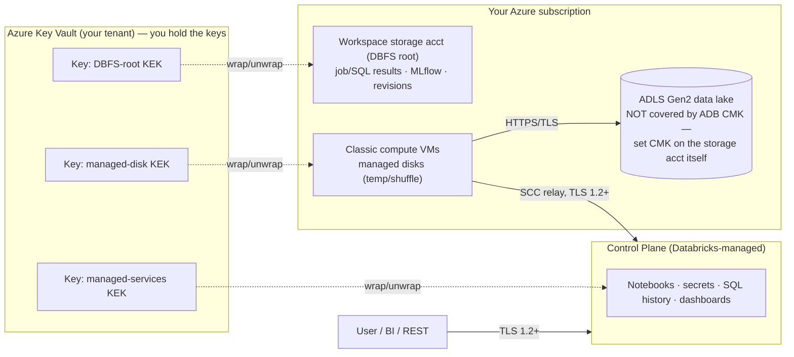
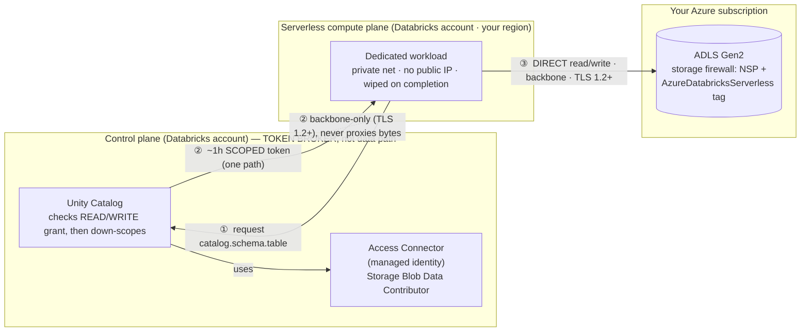
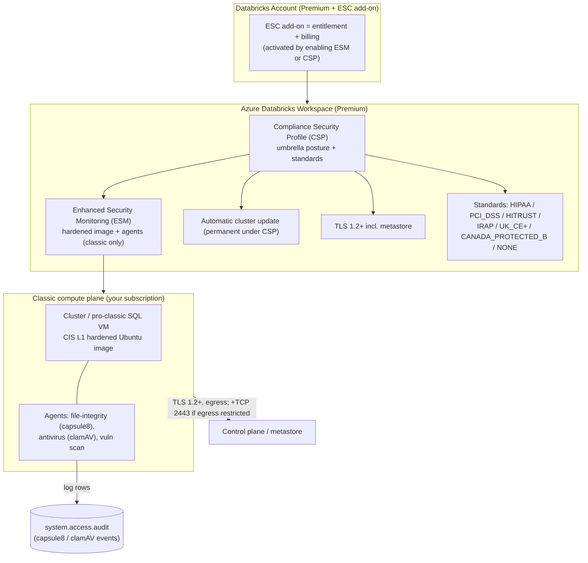
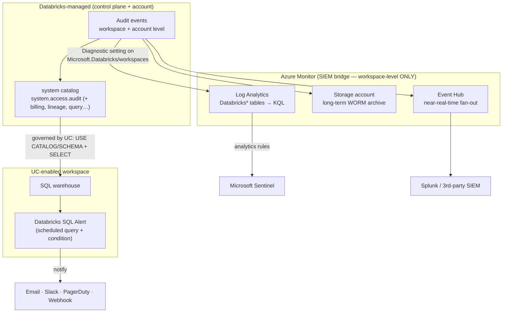

# Topic 8 — Security: Encryption, Isolation & Compliance (Azure-first)

> **Stage 8 · Azure Databricks Networking & Security** — for the **FDE / RSA /
> Solutions Architect** who has to *defend the data-protection story* to a
> customer's security, compliance, and audit teams. Stages 2–7 secured the
> **paths** (planes, SCC, Private Link, NCC, firewalls). This topic protects the
> **data and the workload** sitting on those paths, and **proves** it to an
> auditor.
>
> **This one page covers all four subtopics:**
> - **8.1 — Encryption: TLS, CMK & Azure Key Vault** (bytes in motion + bytes at rest, and who holds the key)
> - **8.2 — Compute security & isolation** (how serverless keeps one tenant/user away from another)
> - **8.3 — Compliance: ESC, ESM & CSP** (the paid add-on, the hardened image, the certified posture)
> - **8.4 — Audit logs, system tables & monitoring** (who-did-what, and how you alert on it)
>
> Companion interactive page: `index.html` (tabbed, one interactive architecture
> diagram per subtopic). Static topology: `architecture.svg`.

---

## 🧠 Topic mental model (hold this in your head)

> **Stages 2–7 locked the doors and hallways; Stage 8 protects what's inside the
> rooms — and installs the cameras.**
>
> - **8.1 Encryption** = the contents are in *sealed envelopes* (TLS, in motion)
>   and *locked safes* (at-rest). **CMK** doesn't add a second safe — it just
>   swaps *whose key* opens the existing one, from Microsoft's to **yours in Azure
>   Key Vault**, so you can rotate or revoke it.
> - **8.2 Isolation** = a *secure hotel where the master key doesn't exist* — each
>   serverless workload gets a private room and a keycard that opens **only that
>   room for one hour**, and the room is wiped at checkout.
> - **8.3 Compliance** = *Russian dolls in a certified building*: `CSP ⊃ ESM ⊃
>   hardened image`, paid for by the **ESC add-on**. Turning CSP on is a **one-way
>   door**.
> - **8.4 Audit/monitoring** = the *CCTV tape + central security desk* — **one
>   audit stream, two taps** (system tables in-platform; Azure diagnostic export to
>   your SIEM).
>
> **The one sentence:** *Encryption is on by default and CMK only changes who holds
> the key; serverless isolation is proven by architecture (scoped, short-lived
> tokens, wiped compute); CSP is the permanent certified posture you scope to
> regulated workspaces; and you prove all of it with system tables + a SIEM export.*
>
> **Where it sits in the 3-path scaffold (from 2.2):** none of these is a *fourth*
> path. **TLS/CMK ride every path** (① user↔DBX, ② compute↔control, ③
> compute→storage); **isolation** is mostly path ③ + the in-box separation under
> all three; **CSP/ESM** act on path ② and the classic compute VMs; **audit/
> monitoring** *watches* all three.

---

## Why this topic matters to an architect

- **It's the back half of every security review.** Once you've explained the
  network paths, the customer's risk/compliance team asks: *"Is our data encrypted
  and who holds the key? How is serverless isolated from other tenants? Are you
  HIPAA/PCI certified? Show me the audit trail."* This topic is those four answers.
- **The expensive mistakes live here.** CMK can *brick a workspace* if the key is
  lost; CSP is *permanent* (delete-and-rebuild to undo); a SIEM-only audit
  strategy has an *account-level blind spot*. Getting these wrong is a re-deploy or
  an audit finding, not a tuning exercise.
- **It separates "encrypted" from "you control the key," and "certified" from
  "configured."** The platform holds attestations and encrypts by default — but
  *processing regulated data* needs CSP **on the workspace**, and *customer key
  custody* needs CMK. Knowing the gap is the architect's credibility.
- **It's where Premium + the ESC add-on earn their cost.** CMK, CSP/ESM, IP ACLs,
  Private Link — all Premium; CSP/ESM additionally bill the ESC add-on. Cost is a
  first-class design input.

---

## Terms used here (define-before-use)

Quick glosses so you can read this page top-to-bottom; the deep dive lives in the
owning module.

| Term | Plain-language gloss | Owning module |
| --- | --- | --- |
| **Control plane vs compute plane** | Databricks-managed services (web UI, REST, UC, job/cluster managers, SCC relay) vs the VMs that actually run Spark on your data. Serverless compute plane lives in *Databricks'* Azure account. | **Stage 2.1** |
| **Three connectivity paths** | ① user→Databricks, ② compute↔control, ③ compute→storage — the scaffold every lesson hangs off. | **Stage 2.2** |
| **Workspace storage account ("DBFS root")** | The Azure Storage account in your subscription holding workspace *system* data (job results, notebook revisions, logs) + the legacy DBFS root. **Not** your governed data lake. | **Stage 2.3** |
| **ADLS Gen2 + UC external locations** | Where your *real* governed data lives — a **separate** storage account, governed by Unity Catalog. | **Stage 7 / UC track** |
| **Managed identity / Access Connector** | A password-less Entra ID identity Azure auto-manages. The **Access Connector for Azure Databricks** (`Microsoft.Databricks/accessConnectors`) is the managed identity UC uses to reach ADLS. | **Stage 7** |
| **Azure Key Vault** | Azure's hardware-backed key/secret store; holds your CMK and performs **wrap/unwrap** so the key never leaves the vault. | **8.1 (here)** |
| **KEK / DEK (envelope encryption)** | A **data-encryption key (DEK)** encrypts the data; a **key-encryption key (KEK)** — your Key Vault key — *wraps* the DEK. Databricks only calls wrap/unwrap; the KEK never leaves the vault. | **8.1 (here)** |
| **VNet injection** | Deploying classic compute into *your* VNet (host + container subnets) so you own routing/egress. Substrate for VNet encryption + managed-disk CMK + the CSP port-2443 rule. | **Stage 3** |
| **NSG / UDR** | NSG = stateful allow/deny firewall on a subnet/NIC; UDR = custom route forcing egress through a firewall. Where the CSP TCP 2443 rule and DEP live. | **Stage 1.3 / 3–4** |
| **NCC (Network Connectivity Configuration)** | Account-level, *regional* object giving serverless its egress / private-endpoint plumbing to your storage. | **Stage 7** |
| **Service tag (`AzureDatabricksServerless`)** | Microsoft-maintained named set of service IP ranges referenced in firewall rules instead of raw IPs. | **Stage 4 / 7** |
| **NSP (Network Security Perimeter)** | A newer Azure construct that puts a logical firewall boundary around PaaS resources (your storage) with explicit inbound/outbound rules. | **8.2 (here)** |
| **Lakeguard** | The engine-level mechanism that isolates users on *shared* compute (Spark Connect, container sandbox, UDF isolation) so UC grants/masks actually hold. | **8.2 (here)** |
| **System table / `system.access.audit`** | Databricks-hosted, UC-governed Delta tables exposing operational data as SQL; `system.access.audit` is the audit log. | **8.4 (here)** |
| **SIEM / Log Analytics / Event Hub** | SIEM = the SOC's central security-log platform (usually **Microsoft Sentinel**/Splunk on Azure); Log Analytics = Azure's native log store (KQL); Event Hub = high-throughput streaming pipe to fan logs to a SIEM. | **8.4 (here)** |

---

# 8.1 — Encryption: TLS, Customer-Managed Keys & Azure Key Vault

## What it is (plain language)

- **Encryption in transit** scrambles data *while it moves* so a wire-tap sees
  gibberish. Azure Databricks uses **TLS 1.2+** on every hop — always on, no toggle.
- **Encryption at rest** scrambles data *while it sits on disk* so a stolen disk is
  useless. Azure Storage does this automatically with **Microsoft-managed keys**
  (AES-256).
- **A "key"** is the secret that locks/unlocks the encryption. By default *Microsoft*
  holds it. With a **Customer-Managed Key (CMK)** *you* hold it in **Azure Key
  Vault**, so you can audit, rotate, or **revoke** it — revoke and the data becomes
  unreadable, even to Databricks.

**Analogy:** at-rest encryption is a *safe* that's always locked; the **key** opens
it. Microsoft-managed = the hotel keeps the master key. **CMK = you bring your own
lock and keep the only key in your own vault** — change the lock or throw the key
away whenever you want. TLS is separate: a *sealed, tamper-evident envelope* on
every letter that travels the wire.

## 🧠 Mental model

> **Encryption is on by default — CMK only changes who holds the key, and the key
> lives in your Key Vault so you can rotate or revoke it.** CMK does *not* add a
> second safe; it swaps whose key opens the existing one. Mantra: **TLS = bytes in
> motion · CMK/at-rest = bytes at rest · SCC/Private Link = the path.**

## The three CMK features at a glance (memorize this)

Three **independent** CMK features, each protecting a different data location;
turning one on does **not** turn the others on.

| CMK feature | Protects | Where that data lives | Compute it covers |
| --- | --- | --- | --- |
| **Managed services** | Notebook source & results in CP, secrets, Databricks SQL queries & history, PATs/Git creds, AI/BI dashboards, Genie Spaces (+ growing list) | **Control plane** (Databricks-managed) | Classic + serverless |
| **DBFS root** (workspace storage) | DBFS root, job results, SQL results, MLflow models, notebook revisions, workspace system data | **Workspace storage account** in *your* subscription | Classic + serverless (data types stored there) |
| **Managed disks** | Temp/shuffle/spill data on the VM disks | **Compute plane** VMs in *your* subscription | **Classic only** (serverless disks are ephemeral) |

All three require **Premium** + **Azure Key Vault** (vault *or* Managed HSM) in the
**same tenant** as the workspace.

> **Critical scope gotcha (#1 review misunderstanding):** **none** of these CMK
> features encrypt your **real data lake** (ADLS Gen2 via UC external locations).
> That's a *separate* storage account — set CMK on it directly in Azure Storage,
> independent of Databricks. CMK-for-DBFS-root only covers the workspace root
> container, which you shouldn't use for governed data anyway.

## How it works — deep dive

- **A. TLS 1.2+ in transit (always on).** User→workspace, compute↔control (incl. the
  SCC relay), compute→ADLS all run over TLS 1.2+. Private Link (Stage 4) keeps the
  same TLS *and* removes the public-internet hop — TLS protects the bytes, Private
  Link hides the path. **The one gap:** worker-to-worker shuffle inside a cluster is
  **not** encrypted by default — close it explicitly (see E).
- **B. At rest, Microsoft-managed by default.** Every Azure Storage account
  (incl. workspace storage / DBFS root) and the compute managed disks are AES-256
  encrypted automatically. CMK doesn't *add* encryption — it **changes who holds the
  key**.
- **C. CMK for managed services (control-plane data).** Envelope encryption: your
  Key Vault key is the **KEK**; Databricks generates a **DEK** to encrypt data, then
  asks Key Vault to **wrap** it. That's why you grant exactly **Get + Wrap Key +
  Unwrap Key** (or the `Key Vault Crypto Service Encryption User` role) — Databricks
  never exports the KEK. Set on the workspace resource; can be added later but
  **never disabled**; **existing data isn't re-encrypted**; on rotation **keep the
  old key 24h**. Identity granted: the first-party **`AzureDatabricks`** enterprise
  app (App ID `2ff814a6-3304-4ab8-85cb-cd0e6f879c1d`) + the workspace storage MI.
- **D. CMK for DBFS root (workspace storage).** Workspace MI gets wrap/unwrap; the
  storage account uses your key. Optional **double / infrastructure encryption**
  (two algorithms, two keys) — **deploy-time only**, can't be retrofitted.
- **E. Inter-node (worker-to-worker) encryption — the gap you close yourself.**
  Either **Azure Virtual Network encryption** (transparent, no Databricks config —
  the cleaner choice) or a **cluster init script** setting Spark configs for **AES
  256-bit over a TLS 1.3** connection (performance penalty on shuffle-heavy jobs;
  secret lives in DBFS; rotation needs a full cluster restart).
- **F. CMK for managed disks (classic VMs).** Temp/shuffle/OS disks encrypted with
  your Key Vault key; supports `rotationToLatestKeyVersionEnabled`. **Not for
  serverless** (disks are ephemeral).

### WHY IT BREAKS (cause → effect)

- **Workspace login / reads fail after a key change** → the Key Vault key was
  disabled/expired, or the `AzureDatabricks` app / storage MI lost the
  wrap/unwrap role. *Effect:* Databricks can't unwrap the DEK, so it can't read the
  control-plane/workspace data → login and reads fail at the end of the DEK cache
  window. **First check:** key enabled + role still assigned.
- **CMK config rejected at deploy** → you passed `latest` as the key version, or a
  non-RSA key, or a non-Premium / cross-tenant vault. **First check:** explicit key
  version + RSA + Premium + same tenant.
- **Auditor: "the data lake isn't customer-keyed"** → CMK was set on the *workspace*,
  not on the **ADLS Gen2 storage account**. *Effect:* false sense of coverage.



## 8.1 illustrative config

```hcl
# Illustrative — Premium ADB workspace with CMK for managed services + DBFS root.
# Prereqs: Key Vault (same tenant, soft-delete + purge protection) + RSA key;
#          "Key Vault Crypto Service Encryption User" granted to the AzureDatabricks app.
# Full apply-ready CMK + Key Vault IaC is the Stage 8 hands-on artifact.
resource "azurerm_databricks_workspace" "this" {
  name                = "adb-cmk"
  resource_group_name = azurerm_resource_group.rg.name
  location            = azurerm_resource_group.rg.location
  sku                 = "premium"                                  # CMK requires Premium

  managed_services_cmk_key_vault_key_id = azurerm_key_vault_key.ms.id    # control-plane data
  managed_disk_cmk_key_vault_key_id     = azurerm_key_vault_key.disk.id   # classic VM disks
  managed_disk_cmk_rotation_to_latest_version_enabled = true

  customer_managed_key_enabled      = true   # enables DBFS-root CMK (bind the key below)
  infrastructure_encryption_enabled = true   # DOUBLE encryption (deploy-time only)
}
```

**Azure Portal:** Entra ID → Enterprise applications → `AzureDatabricks` (copy
Object ID) · Key Vault → enable **Purge protection** → **Keys** → generate an **RSA**
key → **Access control (IAM)** → assign **`Key Vault Crypto Service Encryption User`**
to `AzureDatabricks` + the workspace storage MI · Create Azure Databricks workspace
→ **Encryption** tab → Managed Services / DBFS root / Managed Disks → *Use your own
key* → paste the **Key Identifier** (enable **infrastructure encryption** here for
double encryption — deploy-time only). Verify the **`azurerm` argument names** against
current provider docs before applying — they've evolved across versions.

> ⚠️ Managed-services CMK is **irreversible**; **double encryption is deploy-time
> only**; use a **specific key version** (never `latest`); losing the key with no
> purge protection **permanently bricks** the data and workspace login.

---

# 8.2 — Compute Security & Isolation

## What it is (plain language)

- **Compute isolation** = the guarantee that one running workload can't see, touch,
  or impersonate another — another customer, another user in your workspace, or even
  Databricks platform code.
- **Serverless compute** runs in the **Databricks-managed serverless plane** (in the
  Databricks Azure account), not your VNet — so isolation can't rely on *your*
  network boundary; it's built into the platform.
- **Ephemeral, scoped credential** is the key idea: instead of a long-lived secret on
  the cluster, each workload gets a **short-lived (~1-hour) token scoped to exactly
  that workload's data**, used to talk **directly to your storage**, that expires fast.

**Analogy:** a **secure hotel** — a private room (dedicated compute + private net), a
keycard that opens **only that room and expires at checkout** (1-hour scoped token),
the room stripped and wiped at checkout (compute + disk wiped), and guests can't walk
into each other's rooms or the back office (Lakeguard + network isolation).

## 🧠 Mental model

> **Serverless isolation is a secure hotel where the master key does not exist.** A
> stolen keycard buys an attacker one room for one hour, nothing more. **The one
> sentence:** *authorization happens before the credential is minted, the credential
> is scoped and short-lived, and the control plane hands it over but is never on the
> data path.*

## How it works — deep dive

- **A. Serverless isolation model (between tenants/workloads).** Dedicated compute
  per workload (never shared across customers); **compute + disks wiped on
  completion** (no warm pool holding your data); private network with **no public
  IPs**, lateral movement blocked + monitored; fresh, up-to-date runtime image with
  **no customer credentials** baked in; CP↔serverless always over the **backbone +
  TLS 1.2+**.
- **B. Ephemeral, scoped tokens used DIRECTLY to storage (the heart of 8.2).** Two
  claims: (1) the token is **short-lived (~1h) and scoped** to one path — no
  privileges for anything outside its scope; (2) it goes **direct to ADLS**, not
  through the control plane. **Where it comes from (Azure):** UC is the broker — a
  **storage credential** wraps an **Access Connector** (managed identity) granted
  **Storage Blob Data Contributor**; an **external location** binds it to a path; at
  query time UC checks the caller's `READ`/`WRITE` grant, then **vends a down-scoped,
  time-bound token** (effectively a short-lived SAS) to the workload.
- **C. Confused-deputy protection.** A "deputy" is a privileged service that can be
  tricked into using its broad permissions for an attacker. Serverless resists it
  because the workload holds **no standing broad credential** — authorization happens
  *before* the token is minted, and the token is scoped+short-lived. Even the Access
  Connector is RBAC-limited to the storage you assigned it.
- **D. In-workspace multi-user isolation — Lakeguard.** On **shared** compute
  (Standard mode, serverless, SQL warehouses): **Spark Connect** decouples client from
  driver (no shared JVM/classpath → no over-fetch past row/column filters);
  **container sandboxing** per client; **UDF isolation** (sandbox + egress isolation),
  incl. Python UDFs on serverless & SQL warehouses. This is *why* shared/serverless
  compute can be UC-compliant — the engine enforces the boundary, not just policy.
- **E. Access modes (where isolation is enforced).** **Standard** (was *Shared*) =
  multi-user, Lakeguard-isolated (recommended classic default); **Dedicated** (was
  *Single user / No isolation*) = single principal, isolation by *not* sharing;
  **Serverless** = Lakeguard + platform isolation. Standard has capability gaps (no
  DBR ML/GPU/RDD/Scala `SparkContext`) — for those use Dedicated.
- **F. Workspace & data isolation.** Per-isolation-boundary **NCC** (account-level,
  regional); **workspace–catalog binding** so a catalog is only reachable from
  approved workspaces; **serverless egress / network policy** (default-deny outbound,
  allow only UC locations/connections + enumerated FQDNs) closes the exfil path.

### WHY IT BREAKS (cause → effect)

- **Serverless can't reach ADLS / 403 after enabling the storage firewall** → the
  NSP inbound rule uses the wrong region tag, or the account is in a stale subnet-ID
  allowlist instead of the **regional `AzureDatabricksServerless.<region>`** service
  tag in **Transition** mode. *Effect:* storage rejects serverless source.
- **Job: permission denied reading a path** → the caller lacks `READ`/`WRITE` on the
  UC securable, or the **Access Connector** lacks **Storage Blob Data Contributor**
  on that scope. *Effect:* UC vends no token.
- **Multi-user job sees another user's data / UDF escapes** → compute is **Dedicated
  misused** or a non-UC legacy cluster, not **Standard** (Lakeguard). *Effect:* engine
  boundary isn't enforced.
- **Whole storage firewall broke other Azure services** → someone flipped the NSP from
  **Transition** to **Enforced**. *Effect:* all non-matching traffic blocked.



## 8.2 illustrative config

Core isolation (wipe, dedicated compute, 1h token) is **platform-enforced — not
configurable**. What you wire up is the **scoped-credential plumbing** + the
**storage firewall**.

```hcl
# Illustrative — the UC scoped-credential chain serverless uses to reach ADLS.
# Full chain (+ NSP firewall) is the Stage 8 hands-on artifact.
resource "azurerm_databricks_access_connector" "uc" {     # the managed identity UC uses
  name = "adb-access-connector"; resource_group_name = var.rg; location = var.region
  identity { type = "SystemAssigned" }
}
resource "azurerm_role_assignment" "uc_blob" {            # least privilege — NOT Owner/account key
  scope = azurerm_storage_account.adls.id
  role_definition_name = "Storage Blob Data Contributor"
  principal_id = azurerm_databricks_access_connector.uc.identity[0].principal_id
}
resource "databricks_storage_credential" "this" {         # UC down-scopes from here per request
  name = "adls-cred"
  azure_managed_identity { access_connector_id = azurerm_databricks_access_connector.uc.id }
}
resource "databricks_external_location" "this" {          # binds credential to one path (isolation unit)
  name = "prod-data"
  url  = "abfss://data@${azurerm_storage_account.adls.name}.dfs.core.windows.net/"
  credential_name = databricks_storage_credential.this.name
}
```

**Azure Portal:** Network security perimeter → **+ Create** (region = workspace
region) → **Resources → Associate** your ADLS account (**Access Mode = Transition**)
→ **Profiles → Inbound access rules → + Add** → **Service Tag =
`AzureDatabricksServerless.<region>`**. · Access Connector for Azure Databricks → on
ADLS **IAM** assign **Storage Blob Data Contributor** → Workspace → Catalog →
External Data → **Credentials** (Azure Managed Identity) → **External Locations**
bind to the `abfss://` path. · Compute → access mode = **Standard** (Lakeguard) or
**Dedicated**.

> ⚠️ **Deadline:** by **2026-06-09** a storage account that allowlisted serverless
> **subnet IDs** must move to an **NSP** + the **`AzureDatabricksServerless`** service
> tag. NSP Terraform coverage lags the Portal — if a resource is missing, do the
> firewall step in the Portal; **don't invent arguments.**

---

# 8.3 — Compliance features: ESC, ESM & CSP

## What it is (plain language)

Three layers regulated customers conflate, nested like Russian dolls:

- **ESC (Enhanced Security & Compliance add-on)** — the *billing/entitlement* layer:
  a paid add-on on top of **Premium**. Turning on ESM or CSP on *any* workspace
  activates ESC charges. *Analogy:* the "security package" on a car lease.
- **ESM (Enhanced Security Monitoring)** — a *CIS Level 1 hardened Ubuntu image +
  monitoring agents* (antivirus, file-integrity, vuln-scan) for the **classic compute
  plane only**. *Analogy:* cameras + tamper alarm + reinforced door on every cluster
  VM.
- **CSP (Compliance Security Profile)** — the *umbrella posture*: bundles ESM **plus**
  automatic cluster update, TLS 1.2+ everywhere (incl. to the metastore), and lets you
  attach **compliance standards** (HIPAA, PCI-DSS, IRAP, …). Restricts the workspace
  to a vetted feature set. *Analogy:* the whole building certified to a fire code.

**The nesting:** `CSP ⊃ ESM ⊃ hardened image`. CSP forces ESM on (set
`enhancedSecurityMonitoring = Enabled` explicitly) and forces automatic cluster
update permanently on. You can run **ESM alone** for monitoring without the full
profile.

## 🧠 Mental model

> **CSP is a one-way door** — turning it on (and attaching a standard) hardens the
> classic compute plane **permanently**, so you scope it to the workspaces that
> actually touch regulated data. ESC is the *bill*, ESM is the *cameras*, CSP is the
> *certified building*.

## How it works — deep dive

- **A. ESC — entitlement & billing.** Premium-tier add-on; not a direct toggle —
  enabling ESM/CSP on any workspace activates the charge. Don't blanket-enable across
  dev sandboxes.
- **B. ESM — hardened image + 3 agents (classic only).** CIS L1 hardened image; three
  agents you **can't disable**: **file-integrity** (→ `capsule8` audit rows),
  **antivirus** (→ `clamAV` rows), **vuln scan** (emailed to admins). Databricks emits
  the logs; **review/triage is your job**. Base image re-released ~every 2–4 weeks —
  restart clusters (or use auto-update) to pick up patches. **Arm64-based VMs are
  unsupported** (and the VM type must support Azure VNet encryption; verify Gen2
  support against the ESM doc) with ESM/CSP.
- **C. CSP — the umbrella.** Adds (on top of ESM): CIS L1 image, **automatic cluster
  update** (permanent — restarts in a maintenance window), **TLS 1.2+ incl. to the
  metastore**, ESM agents, and **standards**. Standards by configurator: **CLI/PS/ARM/
  Portal** = `HIPAA, PCI_DSS, HITRUST, IRAP_PROTECTED, UK_CYBER_ESSENTIALS_PLUS,
  CANADA_PROTECTED_B, NONE`; **Terraform `azurerm`** = only `HIPAA, PCI_DSS, NONE`.
  **Restricted feature surface:** GA features + a named-preview allow-list **only** —
  any other preview is unsupported. **AI:** Partner-powered AI off by default, some
  assistive AI off; Genie One won't aggregate CSP workspace data. **Region support
  differs classic vs serverless** — verify the standard × region × plane cell.
- **D. Behavioral / network impact.** **Port 2443:** on a restricted-egress VNet (VNet
  injection + NSG/UDR/firewall) CSP **requires outbound TCP 2443** on top of usual ADB
  egress — miss it and CSP compute fails. **Azure VNet encryption required** (on a
  supporting VM type — also why Arm64 is excluded). TLS 1.2+ to the metastore + on
  egress.

### WHY IT BREAKS (cause → effect)

- **CSP compute on a locked-down VNet won't start / can't reach control plane** →
  missing **outbound TCP 2443** allow rule (or Azure VNet encryption off / unsupported
  VM type). *Effect:* CSP compute can't operate. **First check:** NSG/Firewall/UDR for
  the 2443 rule.
- **Cluster fails to launch on a CSP/ESM workspace** → requested VM is **Gen2 or
  Arm64** (both blocked). **First check:** instance type before quotas/policies.
- **"Works in dev, blocked in the regulated workspace"** → the feature is a **preview
  not on the CSP allow-list**. *Effect:* unsupported on CSP.
- **Customer wants to "turn CSP off"** → there's no toggle; if regulated data was
  processed, the only path back is **delete + rebuild** the workspace.



## 8.3 illustrative config

```hcl
# Illustrative — workspace with CSP + ESM + auto-update. NOTE: azurerm accepts ONLY
# HIPAA / PCI_DSS / NONE here; HITRUST/IRAP/UK_CE+/CANADA_PROTECTED_B need Portal/CLI/PS/ARM.
resource "azurerm_databricks_workspace" "this" {
  name = "regulated-workspace"; resource_group_name = azurerm_resource_group.this.name
  location = azurerm_resource_group.this.location
  sku  = "premium"                                          # ESC requires Premium
  enhanced_security_compliance {
    automatic_cluster_update_enabled      = true            # permanent under CSP
    compliance_security_profile_enabled   = true            # CSP on (PERMANENT!)
    compliance_security_profile_standards = ["HIPAA", "PCI_DSS"]   # or ["NONE"]
    enhanced_security_monitoring_enabled  = true            # ESM agents + hardened image
  }
}
# On a restricted-egress VNet, also allow:  Outbound TCP <host+container subnets> -> * : 2443
```

**Azure Portal:** workspace (or Create page) → **Settings → Security & compliance**
→ check **Enable compliance security profile** → pick standard(s) available in the
**region** or **None** (⚠️ permanent) → check **Enable enhanced security monitoring**
(required when CSP on) → check **Enable automatic cluster update**. Confirm: a
**shield icon** appears by the workspace name; missing shield = contact your account
team.

> ⚠️ CSP + any standard is **effectively permanent** (delete + rebuild to revert);
> **ESM is classic-only**; HIPAA/HITRUST/IRAP **become CSP-mandatory 2026-09-01** —
> verify the standard × region × plane cell before promising it.

---

# 8.4 — Audit Logs, System Tables & Monitoring

## What it is (plain language)

- An **audit log** is an immutable, append-only record of *actions* — login, `GRANT`,
  cluster start, notebook command, failed permission check — answering **"who did
  what, to what, when, from where."**
- **System tables** are Databricks-hosted, UC-governed Delta tables in a `system`
  catalog exposing operational data as SQL. The audit log lives at
  **`system.access.audit`**.
- **Azure diagnostic logs** ship the workspace audit stream out to **Log Analytics,
  a Storage account, or an Event Hub** via the workspace resource's **Diagnostic
  settings** blade.
- **Monitoring** = turning logs into **alerts** — a scheduled Databricks SQL query
  that notifies (email/Slack/PagerDuty/webhook) when a condition fires.

**Analogy:** the audit log is the **CCTV + door-badge tape**; system tables are that
tape in a **searchable DVR** you query with SQL; diagnostic settings is the feed wired
to the **central security desk (SIEM)**; SQL alerts are the **motion trigger** that
pages the guard.

## 🧠 Mental model

> **One audit stream, two taps.** System tables = the tap *inside* (query in SQL; the
> **only** tap carrying **account-level** events, `workspace_id = 0`). Azure
> diagnostic settings = the tap *out* to your SIEM (**workspace-level only**). **The
> one sentence:** *account-level events live only in `system.access.audit`, so the
> enterprise answer is always "run both taps."* This isn't a 4th path — it **watches
> all three**.

## How it works — deep dive

- **A. Two delivery paths.** **System tables** (`system.access.audit`): Delta in the
  `system` catalog, read via SQL, **carry account-level events** (`workspace_id = 0`,
  `audit_level = ACCOUNT_LEVEL`), 365-day free retention. **Azure diagnostic logs**:
  Azure Monitor (Log Analytics/Storage/Event Hub), **workspace-level only**, retention
  you pay for. **The trap:** account-admin / account-SCIM / metastore-grant events
  appear **only** in the system table — a SIEM-only strategy has a blind spot. Best
  practice = **both**.
- **B. The `system` catalog.** `system.access` → `audit`, `table_lineage`,
  `column_lineage`, `outbound_network`, `inbound_network`, …; `system.billing` →
  `usage`, `list_prices`; `system.compute`; `system.query.history`;
  `system.lakeflow`. (Audit table is **Public Preview**; billing GA — verify
  GA/Preview, it drifts.)
- **C. The audit schema — columns you'll use.** `event_time`/`event_date`,
  `workspace_id` (`0` = account-level), `audit_level`, `service_name` (`unityCatalog`,
  `accounts`, `clusters`, …), `action_name` (`getTable`, `login`, `generateDbToken`,
  …), `user_identity`, `request_params`, `response` (**`statusCode != 200` =
  failed/denied**), `source_ip_address`, `user_agent`. Reading rule:
  **`service_name` + `action_name`** identify the event; **non-200** is your
  denied/failed filter.
- **D. Latency & the "verbose" knob.** System tables are **not real-time** (~15 min to
  a few hours) — don't build sub-minute detection on them (use Event Hub→Sentinel for
  that). **Verbose audit logging** (workspace-admin toggle) adds data-plane command
  events (`runCommand`, SQL `commandSubmit`) — high volume; enable only where a regime
  requires command-level capture.
- **E. Diagnostic settings — the SIEM bridge.** A Diagnostic setting on the
  `Microsoft.Databricks/workspaces` resource selects log categories (each maps to a
  `service_name`) → Log Analytics (KQL → Sentinel rules) / Storage (WORM archive) /
  Event Hub (near-real-time → Splunk). A few services (cluster policies, vector search,
  legacy groups) **don't** emit here — another reason to keep both.
- **F. Monitoring — Databricks SQL alerts.** A saved query runs on a schedule,
  evaluates a condition, notifies on `TRIGGERED`. Latest alerts own their query inline;
  can run **as a Lakeflow Job task** to chain a quarantine response.

### WHY IT BREAKS (cause → effect)

- **Query/alert fails "query returned too much data"** → no `event_date` predicate.
  *Effect:* system tables reject broad scans. **First check:** add `event_date`.
- **SIEM "missing" account-admin / metastore-grant events** → those are
  `ACCOUNT_LEVEL` (`workspace_id = 0`) and **never** flow to diagnostic settings.
  *Effect:* blind spot, not a pipeline bug.
- **Analyst can't see `system.access.audit`** → missing UC grants
  (`USE CATALOG`/`USE SCHEMA system.access`/`SELECT`) or the `access` schema isn't
  enabled — *not* a workspace permission.
- **New event category silently absent from Log Analytics** → a hard-coded
  `enabled_log` list missed a category Databricks added. **First check:** the live
  category list.



## 8.4 illustrative config

```sql
-- Grant least-privilege read on the audit log (run as metastore admin).
GRANT USE CATALOG ON CATALOG system            TO `secops-analysts`;
GRANT USE SCHEMA  ON SCHEMA  system.access      TO `secops-analysts`;
GRANT SELECT      ON TABLE   system.access.audit TO `secops-analysts`;

-- Failed-login burst alert (event_date predicate is REQUIRED — system tables reject broad scans).
SELECT user_identity.email AS user_email, count(*) AS failed_logins,
       max(event_time) AS last_attempt, collect_set(source_ip_address) AS source_ips
FROM system.access.audit
WHERE event_date >= current_date() - INTERVAL 1 DAY
  AND service_name = 'accounts'
  AND action_name IN ('login','aadBrowserLogin','tokenLogin')
  AND response.statusCode <> 200                     -- failed/denied only
  AND event_time >= current_timestamp() - INTERVAL 15 MINUTES
GROUP BY user_identity.email
HAVING failed_logins >= 5;                           -- alert threshold
```

```hcl
# Ship workspace audit/diagnostic logs to Log Analytics for Sentinel.
resource "azurerm_monitor_diagnostic_setting" "adb_audit" {
  name                       = "adb-audit-to-sentinel"
  target_resource_id         = azurerm_databricks_workspace.this.id
  log_analytics_workspace_id = azurerm_log_analytics_workspace.sec.id
  enabled_log { category = "accounts" }       # auth, users/groups, tokens, IP ACLs
  enabled_log { category = "clusters" }
  enabled_log { category = "jobs" }
  enabled_log { category = "databrickssql" }  # SQL warehouse + (verbose) commands
  enabled_log { category = "unityCatalog" }   # grants, securable access
  # Tip: use a dynamic block over a category list — Databricks adds categories over time.
}
```

**Azure Portal:** Catalog Explorer → expand **`system`** → confirm
`system.access.audit` (enable the `access` schema if off) · workspace resource →
**Monitoring → Diagnostic settings → + Add** → pick categories (account-level **not**
available here) → Log Analytics / Storage / Event Hub · SQL → **Alerts → Create** →
paste query → condition `>= 5` → schedule every 5 min → notifications.

> ⚠️ Audit table is **Public Preview** (free during preview); **365-day** free
> retention (longer/WORM = Azure archive); always filter on **`event_date`**; match
> alert cadence to ingestion latency (mins–hours).

---

## Decision guide (what an architect recommends)

| Situation | Recommend | Why |
| --- | --- | --- |
| "Is it encrypted?" with no key-custody mandate | **Microsoft-managed keys** (default) | Free, zero ops, TLS 1.2+ in transit + AES-256 at rest already satisfy it |
| Regulator demands customer key custody / revocation | **CMK** (managed services first; DBFS root / disks as mandated) on **Premium** | Kill-switch + rotation in your Key Vault; accept cost + recovery risk |
| "Encrypted at all times" incl. shuffle | **Azure VNet encryption** (over the init-script path) | No DBFS secret, no cluster-restart-to-rotate |
| Most workloads incl. regulated | **Serverless** (pair with CSP) | Fast start, smallest credential blast radius, platform-proven isolation |
| Need network path in your subscription (custom firewall/DEP, on-prem) | **Classic + VNet injection** | You own the route; accept network-management cost |
| Must process data under a named standard | **CSP + matching standard** | Hard gate; verify standard × region × plane |
| Strict internal bar, no formal attestation | **CSP with `NONE`** | Same hardened posture, no standard |
| Hardened image/monitoring on classic, no permanence | **ESM-only** | CIS image + AV/file-integrity; still bills ESC, still classic-only |
| Dev/sandbox, never touches regulated data | **ESC features OFF** | Every enabled workspace bills the add-on + inherits restrictions |
| In-platform investigation + scheduled alerts | **System tables + SQL alerts** | No extra infra, 365-day, incl. account-level events |
| Mandated central SIEM / >365-day / sub-minute | **Diagnostic export** (Event Hub/Log Analytics) **+ system tables** | Asymmetry means **both** is the only complete answer |

**Rule of thumb:** *encryption defaults are enough until a regulator wants the key;
serverless + CSP is the regulated default; CSP is permanent so scope it; and audit =
system tables for completeness + SIEM export for correlation — never one alone.*

---

## Uses, edge cases & limitations

- **Uses:** the data-protection + compliance + evidence half of every security
  review; the answer to "encrypted & who holds the key," "prove serverless tenant
  isolation," "are you HIPAA/PCI," and "show me the audit trail + alerting."
- **Edge cases:** CMK **doesn't cover the ADLS data lake** (set CMK on that account
  directly — the #1 misunderstanding); inter-node shuffle is **unencrypted by
  default**; the **1-hour token isn't a network control** (still need the storage
  firewall + egress policy); **NSP enforced mode** blocks all non-matching traffic
  (stay in **Transition**); CSP **restricted-preview** surface blocks brand-new
  previews; **account-level audit blind spot** in a SIEM-only setup; system tables
  reject **broad scans** (need `event_date`).
- **Limitations:** all CMK + CSP/ESM + IP ACLs + Private Link are **Premium**;
  managed-services CMK + CSP are **irreversible**; **double encryption is deploy-time
  only**; managed-disk CMK + ESM are **classic-only**; Terraform `azurerm` standards =
  `HIPAA/PCI_DSS/NONE` only; NSP Terraform coverage **lags** the Portal; audit table is
  **Public Preview**, **365-day** free retention, **not real-time**.

## FDE field notes

**Common customer asks:**
- *"Encrypted in transit & at rest, and who holds the keys?"* — yes to both by default
  (TLS 1.2+ / Microsoft-managed AES-256); **CMK** is how *they* hold the key.
- *"Can we revoke Databricks' access to our data unilaterally?"* — yes, disable/delete
  the Key Vault key (kill switch within the DEK cache window).
- *"Does CMK cover our ADLS data lake?"* — **no**; CMK that storage account directly.
- *"If serverless runs in Databricks' account, what stops another tenant — or
  Databricks — reading our data?"* — dedicated per-workload compute wiped on
  completion, private no-public-IP net, **no warm pool**, UC vends **~1h path-scoped
  tokens used directly to ADLS**; the control plane mints but never proxies bytes.
- *"Are you HIPAA/PCI/IRAP?"* — the platform holds the attestations, **but** processing
  regulated data needs **CSP + the matching standard on the workspace**; and it's
  **permanent**.
- *"Where's your audit trail / can you feed our SIEM?"* — system tables (365-day, incl.
  account-level) **and** Diagnostic export to Sentinel/Splunk; account-level events are
  **only** in the system table — run both.

**Talk-track:** *"Encryption and TLS are on by default and answer 'is it encrypted?'
for free — CMK just hands you key custody and a kill switch in your own Key Vault.
Serverless proves isolation by architecture, not your perimeter: dedicated compute
wiped between workloads plus short-lived, path-scoped tokens used directly to your
ADLS. For regulated data we turn on the Compliance Security Profile with your standard
— it's the certified posture, and it's permanent, so we scope it. And you prove all of
it two ways: query the audit trail in SQL via system tables, and export it natively to
your SIEM — run both, because account-level events live only in the system table."*

**What breaks + FIRST diagnostic check:**
- *Login/reads fail after a key change* → Key Vault key enabled + the `AzureDatabricks`
  app/storage MI still hold wrap/unwrap.
- *Auditor says the lake isn't customer-keyed* → CMK on the **ADLS account itself**.
- *Serverless 403 to firewalled storage* → regional **`AzureDatabricksServerless.<region>`**
  tag, NSP in **Transition** (not a stale subnet-ID rule).
- *Multi-user job sees another user's data* → access mode is **Standard** (Lakeguard),
  not Dedicated-misused/legacy.
- *CSP compute won't start on a locked-down VNet* → outbound **TCP 2443** rule (+ Azure
  VNet encryption / supported VM type).
- *Cluster won't launch on CSP/ESM* → VM isn't **Gen2/Arm64**.
- *SIEM missing account-admin events* → they're `ACCOUNT_LEVEL` (`workspace_id = 0`);
  query the **system table**.
- *"Too much data" query error* → add an **`event_date`** predicate.

**Decision rule for the engagement:** Microsoft-managed keys until a regulator wants
the key (then CMK on Premium); serverless + CSP as the regulated default, classic +
VNet injection only when the network path must live in the customer's subscription;
CSP permanent → scope it (CSP+standard for regulated, CSP `NONE` for high-bar
unregulated, ESM-only for monitoring without permanence, off for sandboxes); audit =
system tables + Diagnostic export, never one alone.

---

## Common mistakes / gotchas

- **Assuming CMK covers the data lake** — it covers control-plane data, workspace root,
  and VM disks, **not** ADLS Gen2 governed data.
- **Using `latest` as the key version**, a non-RSA key, or forgetting **purge
  protection** — breaks the config or permanently bricks the data.
- **Trying to disable managed-services CMK or CSP** — both irreversible; plan first.
- **Forgetting inter-node shuffle is unencrypted** by default — use VNet encryption.
- **Putting a standing storage key / broad MSI secret on compute** — reintroduces
  confused-deputy risk; let UC vend short-lived, path-scoped tokens.
- **Over-granting the Access Connector** (Owner/account-key) — grant **Storage Blob
  Data Contributor**, scoped narrowly.
- **Flipping NSP to Enforced** — breaks every other service on that storage firewall;
  stay in **Transition**.
- **Confusing access modes** — **Standard** is the multi-user-isolated mode, *not*
  Dedicated.
- **Assuming ESM covers serverless** — it's classic-only.
- **Locking down egress without opening TCP 2443** — CSP compute silently fails.
- **Blanket-enabling ESC/CSP across dev** — every workspace bills + inherits
  restrictions.
- **Treating the SIEM as complete** — account-level events live only in the system
  table; run both.
- **Forgetting the `event_date` predicate** / reading `response.statusCode` wrong
  (200 = success; non-200 = the signal) / polling a near-real-time alert on an hourly
  table.

---

## Hands-on artifacts (decision)

This module **ships one SQL companion** — `audit_monitoring.sql` — because **8.4** has
a genuinely runnable code surface (system-table grants + alert queries) and the
conventions call for a SQL artifact for audit/governance topics. The encryption,
isolation, and compliance subtopics are **IaC/Portal-configured**; their full
apply-ready Terraform (CMK + Key Vault, the UC scoped-credential chain + NSP firewall,
the CSP `enhanced_security_compliance` block, the diagnostic-setting export) is
illustrated inline above and best delivered as the module's optional Terraform module
rather than duplicated per subtopic. Net: **one SQL file (8.4) + the inline IaC
snippets**; no per-subtopic files.

---

## References

**8.1 — Encryption / CMK**
- [Data security and encryption — Azure Databricks](https://learn.microsoft.com/azure/databricks/security/keys/) — TLS in transit, at-rest, the three CMK features, double encryption, inter-node.
- [Customer-managed keys for encryption (overview)](https://learn.microsoft.com/azure/databricks/security/keys/customer-managed-keys) — which CMK feature covers which data; Premium; vault vs Managed HSM.
- [Enable CMK for managed services](https://learn.microsoft.com/azure/databricks/security/keys/cmk-managed-services-azure/customer-managed-key-managed-services-azure) — Key Vault role / Get-Wrap-Unwrap, `AzureDatabricks` App ID `2ff814a6-3304-4ab8-85cb-cd0e6f879c1d`, 24h rotation rule, irreversibility.
- [CMK for DBFS root](https://learn.microsoft.com/azure/databricks/security/keys/customer-managed-keys-dbfs/) · [CMK for managed disks](https://learn.microsoft.com/azure/databricks/security/keys/cmk-managed-disks-azure/) · [Encrypt traffic between worker nodes](https://learn.microsoft.com/azure/databricks/security/keys/encrypt-otw) (AES-256 / TLS 1.3) · [Azure Storage encryption](https://learn.microsoft.com/azure/storage/common/storage-service-encryption).

**8.2 — Compute security & isolation**
- [High-level architecture](https://learn.microsoft.com/azure/databricks/getting-started/high-level-architecture) — serverless plane in the Databricks account, per-region, isolation layers.
- [How does Databricks enforce user isolation? (Lakeguard)](https://learn.microsoft.com/azure/databricks/compute/lakeguard) — Spark Connect, container sandbox, UDF isolation.
- [Serverless security (Databricks Trust)](https://www.databricks.com/trust/security-features/serverless-security) — dedicated compute, wiped on completion, **~1-hour scoped tokens**, no public IPs.
- [Serverless compute plane networking + NCC](https://learn.microsoft.com/azure/databricks/security/network/serverless-network-security/) · [NSP for Azure resources](https://learn.microsoft.com/azure/databricks/security/network/serverless-network-security/serverless-nsp-firewall) (`AzureDatabricksServerless` tag, Transition vs Enforced, 2026-06-09 migration) · [Standard compute limitations](https://learn.microsoft.com/azure/databricks/compute/standard-limitations).

**8.3 — Compliance (ESC/ESM/CSP)**
- [Compliance security profile](https://learn.microsoft.com/azure/databricks/security/privacy/security-profile) — standards requiring CSP, the HIPAA/HITRUST/IRAP 2026-09-01 change, classic vs serverless region support.
- [Enhanced security monitoring](https://learn.microsoft.com/azure/databricks/security/privacy/enhanced-security-monitoring) — CIS L1 image, the three agents (`capsule8`/`clamAV`/vuln), classic-only, Gen2/Arm64 exclusion.
- [Configure enhanced security & compliance](https://learn.microsoft.com/azure/databricks/security/privacy/enhanced-security-compliance) — Portal/CLI/PS/ARM/Terraform keys, permanence, **port 2443**, Azure VNet encryption, shield confirmation.
- [Automatic cluster update](https://learn.microsoft.com/azure/databricks/admin/clusters/automatic-cluster-update) · [azurerm_databricks_workspace (Terraform)](https://registry.terraform.io/providers/hashicorp/azurerm/latest/docs/resources/databricks_workspace) — the `enhanced_security_compliance` block.

**8.4 — Audit logs / system tables / monitoring**
- [System tables reference](https://learn.microsoft.com/azure/databricks/admin/system-tables/) · [Audit log system table (`system.access.audit`)](https://learn.microsoft.com/azure/databricks/admin/system-tables/audit-logs) — columns, account-vs-workspace level, `workspace_id = 0`.
- [Diagnostic log reference (audit events)](https://learn.microsoft.com/azure/databricks/admin/account-settings/audit-logs) — categories, action names, verbose audit logging.
- [Databricks SQL alerts](https://learn.microsoft.com/azure/databricks/sql/user/alerts/) · [Azure Monitor diagnostic settings](https://learn.microsoft.com/azure/azure-monitor/essentials/diagnostic-settings) · [Billable usage system table](https://learn.microsoft.com/azure/databricks/admin/system-tables/billing).

> Verified against Azure Databricks docs (encryption May–Jun 2026; isolation /
> Databricks Trust serverless page fetched 2026-06-26; compliance 2026-05 to 2026-06;
> system tables 2026-06-17, audit table 2026-04-22, SQL alerts 2026-05-19). **Time-
> sensitive — reconfirm before quoting a customer:** the **2026-06-09** NSP/service-tag
> migration; **HIPAA/HITRUST/IRAP CSP-mandatory 2026-09-01**; the standard × region ×
> plane cells; the **1-hour** token lifetime; inter-node **AES bit-length** (overview
> page has historically said 128 vs the how-to's 256); audit table **Public Preview**
> status; and NSP Terraform coverage.
