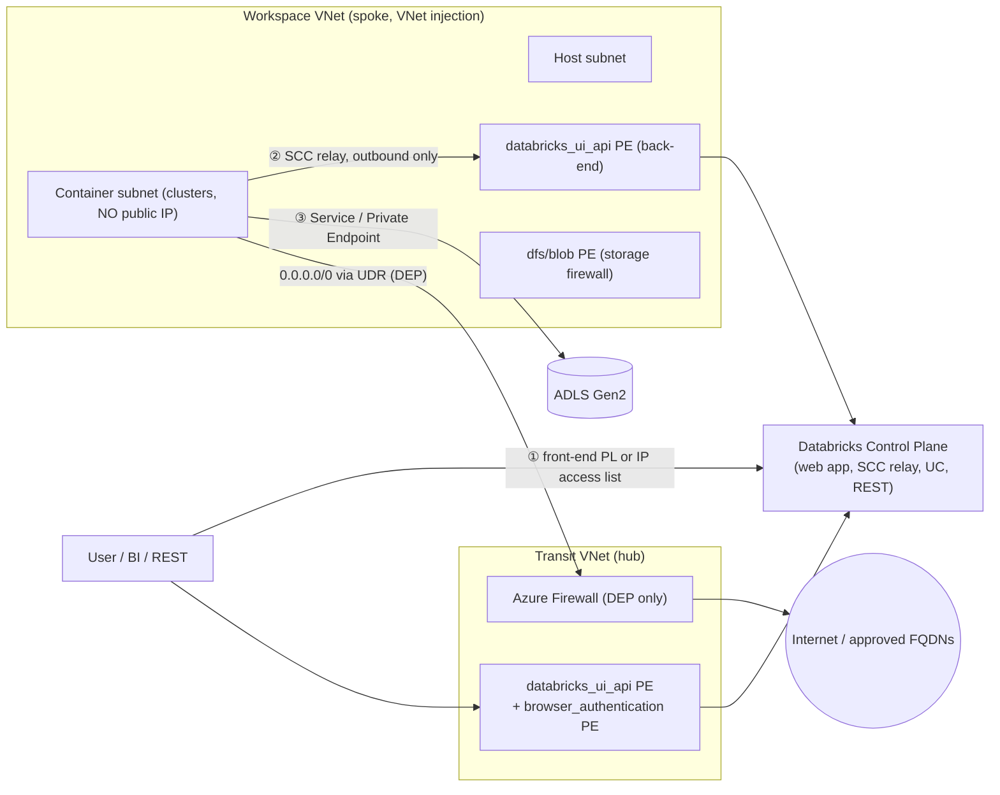
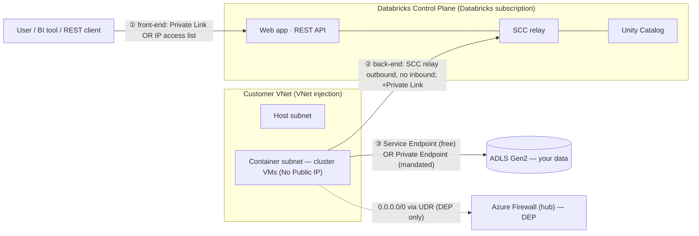
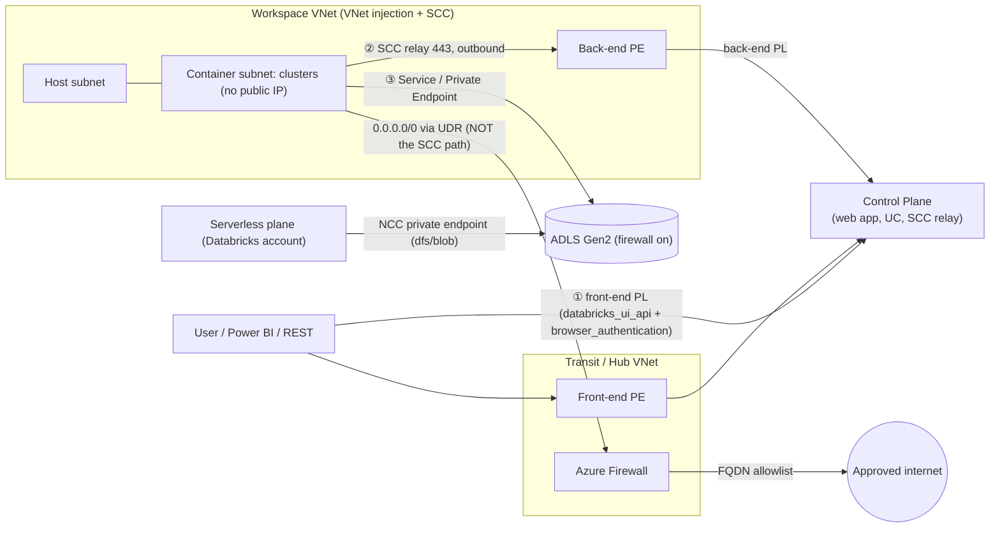

# Topic 9 — Synthesis, Best Practices & Interview/Customer Prep (Azure-first)

> **Stage 9 · Azure Databricks Networking & Security** — the **capstone**, for the
> **FDE / RSA / Solutions Architect** who has to *assemble and defend* a design
> across the table from a customer's security team. Stages 1–8 each taught one
> control (CIDR sizing, VNet injection, SCC, Private Link, DNS, NCC, storage
> firewall, Unity Catalog, CMK). This topic does **not** teach a new control — it
> teaches the three things a senior gets asked: **(a)** name a reference design and
> draw it, **(b)** recite the hardening checklist and say *which items are overkill*,
> and **(c)** walk a packet from a browser to a byte in ADLS, naming the control at
> every hop and the trade-off you're making.
>
> **This one page covers all three subtopics:**
> - **9.1 — Reference architectures end-to-end** (the four named blueprints + the packet walk)
> - **9.2 — Networking & security best-practices checklist** (the pre-flight list, MUST vs when-mandated)
> - **9.3 — Customer-conversation & interview scenarios** (the five whiteboard answers)
>
> Companion interactive page: `index.html` (tabbed, one interactive architecture
> diagram per subtopic). Static topology: `architecture.svg`.

---

## 🧠 Topic mental model (hold this in your head)

> **A reference architecture is a floor plan for a secure building, and every
> question is "which lock goes on which of three doors — and what's the cheapest
> lock the regulator will accept?"**
>
> - You **never invent a new map**. There are only **three doors** (the scaffold
>   from Stage 2.2): ① **user → workspace** (front door), ② **compute ↔ control
>   plane** (staff intercom, outbound-only), ③ **compute → storage** (loading dock).
> - A **blueprint** = a choice of one control on each door, plus identity,
>   governance, and encryption layered on top. Name the control on each door and
>   you've drawn the whole architecture.
> - A **checklist** = the same three doors with, for each, *the floor control* (free,
>   always-on) and *the mandated upgrade* (costs money — add only when a regulator
>   pays for it).
> - An **interview/customer answer** = *trace the packet, name the control at each
>   hop, state the trade-off (security vs cost vs complexity), and know what breaks.*
>
> **The one sentence:** *Pick the closest of four floor plans, harden the three
> doors with the cheapest lock that meets the compliance language, and be able to
> walk the packet and name what breaks at each hop.*

---

## Why this topic matters to an architect

- **It's the interview and the security review.** Customers don't ask "what is
  SCC?" — they ask *"is this workspace safe for our PII?"* and *"walk me through
  how a query reaches our private storage without touching the internet."* The
  grader/auditor checks whether you **name the control at each hop** and know the
  **trade-offs** (cost, DNS, IP sizing).
- **Wrong blueprint = rework or breach.** Quote Simplified for a bank → fail the
  audit. Quote full-DEP for a sandbox → burn budget on a firewall and Private
  Endpoints nobody needs. The senior skill is matching the design to the mandate.
- **Most breaches are missed checklist items, not exotic attacks** — public access
  left on, an over-privileged token, an under-sized subnet that forced someone to
  "temporarily" open egress. The checklist makes the boring-but-fatal omissions
  impossible to forget.
- **Some decisions are permanent.** Subnet CIDR **cannot change after deployment** —
  the sizing must be right on day one.

---

## Terms used here (define-before-use)

This capstone reuses terms taught deeply in earlier modules. Quick gloss + where
the deep dive lives, so you can read this page top-to-bottom without a gap.

| Term | Plain-language gloss | Owning module |
| --- | --- | --- |
| **VNet injection** | Deploy classic compute into **your own** Azure VNet (vs the Databricks-managed default) so you own the NSGs, UDRs, and egress. | Deep dive **Stage 3.1** |
| **Host / container subnet** | The two delegated subnets a VNet-injected workspace needs; "host"=old "public", "container"=old "private" — **both private under SCC**. | **Stage 3.1** |
| **Subnet delegation** | Handing a subnet to the `Microsoft.Databricks/workspaces` provider (immutable *network intent policy*) — why Service Endpoint *Policies* can't attach. | **Stage 3.1** |
| **NSG** (network security group) | A stateful allow/deny firewall on a subnet/NIC; `NoAzureDatabricksRules` tells Databricks not to inject its managed rules because Private Link covers that traffic. | **Stage 1.3** |
| **UDR** (user-defined route) | A custom route overriding Azure's default routing — here, `0.0.0.0/0` → an Azure Firewall. | **Stage 1.3 / 3.4** |
| **SCC / NPIP** (Secure Cluster Connectivity / No Public IP) | Cluster VMs get no public IP and no inbound ports; they dial *outbound* to the SCC relay on 443. | **Stage 2.3** |
| **SCC relay** | The control-plane endpoint the cluster opens its outbound 443 tunnel to; admin commands ride back down that same reverse tunnel. | **Stage 2.3** |
| **NAT Gateway** | Azure's managed outbound translation — gives clusters a **stable egress IP** for partner/storage allowlists. | **Stage 2.4** |
| **Service Endpoint (SE)** | A **free**, egress-only, subnet-scoped route onto the Azure backbone; storage keeps its public FQDN but trusts the subnet. | **Stage 2.5** |
| **Private Endpoint (PE)** | A real NIC + **private IP** in your VNet mapped to one service; needs DNS, per-GB cost; works on-prem / across peering. | **Stage 2.5 / 3.1** |
| **Front-end / back-end / web-auth Private Link** | The three PL connection types: user→workspace, compute→control, and the SSO callback. | **Stage 3.1** |
| **Private DNS zone** | The private "phonebook" (`privatelink.azuredatabricks.net`, `privatelink.dfs.core.windows.net`) mapping an FQDN to a private IP. | **Stage 3.2** |
| **Transit / hub-and-spoke** | A central hub VNet hosts shared front-end/web-auth PEs and the firewall; workspace spokes peer to it. | **Stage 3.3** |
| **DEP** (Data Exfiltration Protection) | SCC + VNet injection + Private Link + an Azure Firewall egress chokepoint that allowlists only approved FQDNs. | **Stage 3.4** |
| **NCC** (Network Connectivity Configuration) | An account-level, **regional** object giving *serverless* compute private connectivity / egress control — the serverless analog of VNet-injection+PE. | **Stage 5.2** |
| **UC external location + access connector** | Unity Catalog governs ADLS via a managed-identity *access connector* — the cluster never uses raw keys. | **Stage 7** |
| **CMK** (Customer-Managed Keys) | Your own Azure Key Vault keys for managed services + workspace storage + managed disks. | **Stage 8** |
| **CSP / ESM** (Compliance Security Profile / Enhanced Security Monitoring) | Hardened-image + enhanced monitoring add-on required for regulated profiles (FedRAMP/PCI/HIPAA). | **Stage 8** |
| **ADLS sub-resources `dfs` / `blob`** | Private Endpoint group IDs: `dfs` for hierarchical data access, `blob` for blob/model-artifact APIs. | **Stage 2.5 / 5** |

---

# 9.1 — Reference architectures end-to-end

## What it is (plain language)

A **reference architecture** is a known-good blueprint: "for *this* security
requirement, wire the workspace, network, and storage together *this* way." You
don't invent a design per customer — you pick the closest reference and adapt it.
There are **four** an Azure Databricks SA must draw from memory:

1. **Standard (recommended)** — the enterprise default: VNet injection + SCC +
   back-end Private Link, hub-and-spoke with a **separate transit VNet** hosting
   the front-end / web-auth endpoints.
2. **Simplified** — the same controls collapsed into fewer VNets/subnets for
   smaller or single-region estates.
3. **Full DEP / isolated-regulated** — Standard **plus** an Azure Firewall hub that
   inspects all egress, storage firewall on ADLS, public network access
   **Disabled**, CMK, and the Compliance Security Profile.
4. **IP-exhaustion architecture** — how to size and lay out address space (and what
   to do when you got it wrong) so autoscaling clusters never run out of IPs.

**Analogy:** floor plans for a secure building. Standard = corporate HQ with a
guarded lobby (transit VNet) and badge-only server rooms; DEP adds a mantrap and a
guard who inspects everything leaving (Azure Firewall); the IP-exhaustion plan is
making sure you built enough parking (IP addresses) before move-in — you can't
repave the lot later.

## Why it matters

- **It's the synthesis interview** — "walk me through securing an ADB workspace for
  a regulated bank" checks whether you name the control at each hop and know the
  trade-offs (cost, DNS, IP sizing).
- **A blueprint is just a choice of one control per door** — so if you can name the
  control on each of the three paths, you can draw the whole architecture.

## How it works — the four blueprints

### A. Standard (recommended)

**Two VNets.** **Workspace VNet (spoke)** — VNet injection, holds the **host** +
**container** subnets (both private under SCC), a **back-end** `databricks_ui_api`
PE subnet (`/27`), and a **`/28`** subnet for `dfs`/`blob` storage PEs if the
storage firewall is on. **Transit VNet (hub)** — holds the **front-end**
`databricks_ui_api` PE and the **`browser_authentication`** endpoint, plus the
central egress path.

Controls per door: **①** front-end PL through the transit PE (hybrid keeps public
access **Enabled** + IP access lists; full-private sets it **Disabled**); SSO via
the **`browser_authentication`** endpoint. **②** SCC removes public IPs and reverses
the call direction; **back-end PL** (`databricks_ui_api` PE) puts that outbound call
on the backbone; NSG = **`NoAzureDatabricksRules`**. **③** Service Endpoints (free)
or Private Endpoints (`dfs`+`blob`) to ADLS with the storage firewall denying public.

> **Why a separate transit VNet:** the `browser_authentication` endpoint is
> **one-per-region-per-DNS-zone** and a single point of failure for SSO. Isolating
> it in a dedicated, delete-locked "web-auth workspace" (no workloads) means
> deleting a spoke never breaks login for the other workspaces in the region.

### B. Simplified

Same three controls, fewer moving parts — for non-prod, single-region, or teams
without a central-networking hub. **One VNet** (or transit endpoints folded in);
front-end and back-end both use the **`databricks_ui_api`** sub-resource so a single
PE type covers UI/REST both directions; PEs can be **shared** across workspaces in
the same VNet/region; `browser_authentication` may live on an **existing** workspace.
**Trade-off:** cheaper, but you lose web-auth blast-radius isolation and a later DEP
firewall retrofit is harder.

### C. Full DEP / isolated-regulated

Standard **plus** outbound inspection and lockdown — the blueprint for banks,
healthcare, government. **Azure Firewall in the hub** + a **UDR** on both workspace
subnets sending `0.0.0.0/0` to the firewall's private IP; **application rules**
allowlist only the Databricks FQDNs, everything else denied. **Full Private Link**
(front + back + web-auth) and **Public Network Access = Disabled**. **Storage
firewall on ADLS** with `dfs`/`blob` Private Endpoints. **CMK** + **CSP / ESM**.

**FQDNs to allowlist on the firewall (verified):**

| Purpose | FQDN(s) | Port |
| --- | --- | --- |
| Control plane web app + REST + SCC relay | `*.azuredatabricks.net` (or per-ws `adb-<id>.<n>.azuredatabricks.net`) | 443 + WebSocket |
| Compute-plane (data-plane) traffic | `adb-dp-<id>.<n>.azuredatabricks.net` | 443 + WebSocket |
| UI static assets (CDN) | `*.cloud.databricksusercontent.com`, `ui-assets.azuredatabricks.net`, the workspace `*.azurefd.net` host | 443 |

> ⚠️ **Allowlist FQDNs, not IPs** — the IPs behind these names rotate across AZs.
> **Don't route the SCC relay / back-end-PL traffic *through* the firewall** — once
> back-end PL is on, that traffic is already private on the backbone; an extra
> firewall hop adds latency and cost for no gain. Metastore (`3306`) and EventHub
> telemetry (`9093`) are reached via the `AzureDatabricks`/`EventHub` service tags in
> NSG egress, not application rules.

### D. IP-exhaustion architecture

Prevents "cluster failed to start: insufficient IP addresses."

- **2 IPs per node** (one host + one container) and **Azure reserves 5 IPs** per
  subnet → **max nodes ≈ 2^(32−n) − 5** for a subnet of size `/n`.
- **VNet `/16`–`/24`; subnets `/26` minimum** (technical floor `/28`, but don't go
  below `/26`). Size for **peak** autoscaling, not steady state.
- **Leave VNet headroom** for the extra subnets you'll add: a `/27` back-end PE
  subnet and a `/28` storage-PE subnet. Don't max the VNet with two huge subnets.

| Subnet size | Total | Usable (−5) | ≈ Max cluster nodes |
| --- | --- | --- | --- |
| `/26` | 64 | 59 | ~59 |
| `/24` | 256 | 251 | ~251 |
| `/22` | 1,024 | 1,019 | ~1,019 |
| `/21` | 2,048 | 2,043 | ~2,043 |

**When you got it wrong (recovery):** **Update workspace network configuration**
(Public Preview) — migrate managed→injected, move to a new (larger) VNet, or replace
subnets via ARM (`apiVersion 2026-01-01`); terminate clusters first; ~15 min;
**Terraform not supported** for this flow. Or a **CIDR increase** via your Databricks
account team. Note: moving a back-end-PL workspace to a new VNet **breaks** the old
Private Link — recreate the PE + Private DNS zone.

## Traffic path — walk a packet (full-DEP), name the control at every hop

This is the interview centerpiece. (Why it breaks → the "Without it" column.)

| Hop | What happens | Control(s) | WHY IT BREAKS without it (cause→effect) |
| --- | --- | --- | --- |
| **1. User → workspace URL** | `adb-<id>.<n>.azuredatabricks.net` resolves via **`privatelink.azuredatabricks.net`** to the **front-end PE** private IP in the transit VNet. | Front-end PL; IP access list (hybrid) or public access **Disabled** (full-private). | URL resolves to a **public IP** → anyone on the internet reaches the login page. |
| **2. SSO callback** | Entra ID auth callback returns through **`browser_authentication`** (e.g. `westus.pl-auth.azuredatabricks.net`). | Web-auth PE (one per region/DNS zone). | On a fully-private network the SSO callback has no route → **login fails region-wide**. |
| **3. CP schedules the cluster** | Cluster-manager provisions VMs in the **container subnet**; **no public IPs** (SCC). | SCC/NPIP; VNet injection; subnet delegation. | VMs get **public IPs + open inbound ports** → attack surface. |
| **4. Cluster → control plane** | Cluster dials **outbound** to the SCC relay over the **back-end `databricks_ui_api` PE** → backbone, not internet. | Back-end PL; SCC reversed call; NSG `NoAzureDatabricksRules`. | Outbound rides the **public internet** to the relay (still TLS, but not private-IP). |
| **5. Cluster → ADLS Gen2** | UC resolves the external location; cluster reaches `*.dfs.core.windows.net` via SE (backbone) or `dfs`/`blob` PE (private IP); storage firewall denies all else. | Storage firewall; SE/PE; UC external location + access connector. | Data path traverses **public internet**; storage **open to other networks**. |
| **6. Any other egress (PyPI, APIs)** | `0.0.0.0/0` routed by **UDR** to **Azure Firewall**; only allowlisted FQDNs pass. | UDR + Azure Firewall application rules (DEP). | A **compromised notebook can exfiltrate** data to any host. |

**Say this out loud:** *"The user hits a private endpoint resolved by a private DNS
zone, SSO returns through the web-auth endpoint, SCC gives the cluster no public IP
and dials the control plane outbound over back-end Private Link, the cluster reaches
Unity-Catalog-governed ADLS through a storage private endpoint, and any other egress
is forced through an Azure Firewall that only allows Databricks' own FQDNs."*

## 9.1 mermaid — the full-DEP topology



## 9.1 illustrative config (the load-bearing pieces)

```hcl
# Illustrative — Standard/DEP-shaped workspace: VNet injection + SCC, sized to avoid IP exhaustion.
# Full apply-ready module is the Stage 9 hands-on artifact (main.tf); this is the lines that TEACH the point.
resource "azurerm_virtual_network" "ws" {
  name          = "adb-ws-vnet"
  address_space = ["10.50.0.0/16"]                    # /16: room for big subnets + PE subnets (don't max it)
  # ... location / resource_group_name ...
}
resource "azurerm_subnet" "container" {               # "private" subnet — private under SCC
  name             = "container-subnet"
  address_prefixes = ["10.50.4.0/22"]                 # /22 -> ~1,019 nodes peak; SIZE FOR PEAK, immutable later
  delegation { name = "dbx"; service_delegation { name = "Microsoft.Databricks/workspaces" } }
  # ... vnet / rg ...
}
resource "azurerm_databricks_workspace" "this" {
  name                                  = "adb-standard"
  sku                                   = "premium"   # Private Link / CMK / CSP require Premium
  public_network_access_enabled         = false       # full-private (DEP); set true for hybrid Standard
  network_security_group_rules_required = "NoAzureDatabricksRules"  # required with back-end Private Link
  custom_parameters {
    no_public_ip       = true                         # SCC / No Public IP
    virtual_network_id = azurerm_virtual_network.ws.id
    # ... host/container subnet names + NSG association IDs ...
  }
}
```

**Azure Portal:** Create a resource → Azure Databricks → **Networking** → *Secure
Cluster Connectivity (No Public IP) = Yes*, *Deploy in your own VNet = Yes*, select
host/container subnets → *Allow Public Network Access* Enabled (Standard) or Disabled
(DEP), *Required NSG Rules* = **NoAzureDatabricksRules**. Back-end PE: workspace →
**Networking → Private endpoint connections → + Private endpoint → sub-resource
`databricks_ui_api`** → *Integrate with private DNS = Yes*.

---

# 9.2 — Networking & security best-practices checklist

## What it is (plain language)

A **best-practices checklist** is the short list of settings a secure Azure
Databricks deployment should have *on day one* — what a security architect asks
about and an auditor checks. It spans **two domains at once**: *networking* (traffic
flow + lockdown) and *security* (identity, authz, encryption, audit). Organized into
six themes: **(1) Network architecture, (2) Private connectivity, (3) Storage egress,
(4) Identity & access, (5) Data/encryption/compute, (6) Governance/audit/IaC.**

**Analogy:** a **pre-flight checklist** a pilot runs before takeoff. Each item is
small, but skip one — leave public access on, or size a subnet too small — and the
whole flight is at risk.

## The mental model — floor vs mandated upgrade

> Ten green **MUST** items are the airframe — fly without any one and you crash
> (public access left on, an under-sized subnet, no audit log). Five amber
> **when-mandated** items (back-end PL, front-end PL, storage PEs, CMK, firewall DEP)
> are bolt-ons you add **only when the regulatory profile or a specific mandate pays
> for the cost**. When someone asks "is this workspace secure?", **walk the three
> doors** and at each name (a) the floor control and (b) the mandated upgrade — that
> single move turns a feature dump into a senior answer.

## The checklist — by theme

**Theme 1 — Network architecture (classic).** **(1.1) VNet injection + SCC** — your
own VNet, No Public IP; the floor, practically never overkill. **(1.2) Size subnets
for *peak*** using RFC 1918 (`10.0.0.0/8`) or RFC 6598 (`100.64.0.0/10`); 2 IPs/node,
5 reserved/subnet, **CIDR immutable post-deploy** → only failure mode is *too small*.
**(1.3) Control egress** — keep managed NSG rules + restrictive outbound; **NAT
Gateway** for a stable egress IP; for DEP add **UDR `0.0.0.0/0` → Azure Firewall**
(don't route the SCC relay through it).

**Theme 2 — Private connectivity (Premium).** **(2.1) Back-end PL** — the default
"private" upgrade; compute→CP rides `databricks_ui_api` PE; can be enabled
**independently** of front-end (cost-aware middle ground). **(2.2) Front-end PL +
public access Disabled** — strongest user-access control; needs a
`browser_authentication` PE (**one per region/DNS zone** — delete its host workspace
and SSO breaks region-wide). **(2.3) Private DNS** — create
`privatelink.azuredatabricks.net`, link it, resolve the workspace FQDN to the private
IP; mis-resolution is the #1 "workspace/OAuth denied" cause.

**Theme 3 — Storage egress (validate cost!).** **(3.1)** Lock the ADLS storage
firewall (deny public); grant via **Service Endpoints** (free, backbone — default) or
**Private Endpoints** (per-GB — only when "no public IP on storage" is mandated). SE
*Policies* don't attach to Databricks-delegated subnets.

**Theme 4 — Identity & access.** **(4.1) Premium** as the security floor (PL, CMK, IP
ACLs, encryption add-ons all require it). **(4.2) SSO + SCIM + MFA + identity
federation + separate admins** — identity is the real perimeter; MFA is enforced in
**Entra ID Conditional Access**, not a Databricks toggle; humans use SSO, automation
uses **service principals**. **(4.3) IP access lists** — corporate-egress-only at
account + workspace level; **block lists evaluated first**, an ALLOW list flips to
default-deny; **private-endpoint traffic isn't IP-filtered**.

**Theme 5 — Data, encryption & compute.** **(5.1) Unity Catalog for all governed
data** — `catalog.schema.table` grants, external locations + access connector,
row/column masks; **never** workspace-storage root. **(5.2) Cluster policies + a
UC-compliant access mode** — require **Standard (shared)** or **Dedicated** isolation;
avoid legacy **No Isolation Shared** (CAN ATTACH users can read keys from driver
logs). **(5.3) Encryption** — TLS 1.2+ in transit by default; add **CMK** (Key Vault)
for the three surfaces (managed services, workspace storage, managed disks) only when
key custody is mandated.

**Theme 6 — Governance, audit & IaC.** **(6.1) Audit logging** — enable
`system.access.audit` (*Public Preview — verify*) + diagnostic logging → SIEM
(Sentinel). **(6.2) Everything as IaC** — Terraform (`azurerm`+`databricks`) or
Bicep/ARM; reviewable, repeatable. **(6.3) Serverless: bind an NCC** + egress/network
policy (default-deny); limits **10 NCCs/region, 100 PEs/region, 50 workspaces/NCC**.

## 9.2 mermaid — the three paths the checklist defends



## Comparison table — non-negotiable vs "only when mandated"

| Checklist item | Tier | Always do? | Main trade-off / when it's overkill |
| --- | --- | --- | --- |
| VNet injection + SCC | Any (SCC default) | **Yes** | None — the floor |
| Size subnets for peak | Any | **Yes** | Generous sizing is free; only failure is *too small* |
| NAT gateway egress | Any | **Yes** | Small hourly + per-GB |
| Storage firewall + **Service Endpoints** | Any | **Yes** | Free; default storage choice |
| **Premium** plan | Premium | **Yes** (for security) | Higher per-DBU cost |
| SSO + SCIM + MFA + separate admins | Any | **Yes** | Setup effort only |
| Unity Catalog for governed data | Any | **Yes** | Migration effort off legacy mounts |
| Cluster policies + UC access mode | Premium | **Yes** | Slight friction for power users |
| Audit logging / system tables | Any (Preview table) | **Yes** | Storage/SIEM cost |
| IaC for everything | Any | **Yes** | Up-front authoring |
| Back-end Private Link | Premium | When internal traffic must be private | Per-endpoint + transfer cost |
| Front-end PL + public access Disabled | Premium | When "no public ingress" mandated | Transit VNet, DNS, per-region web-auth |
| **Private Endpoints** to storage | Any (PE) | When private IP on storage mandated | **Per-GB — validate first**; default to SE |
| CMK | Premium | When key custody mandated | Key Vault ops + lockout risk |
| Azure Firewall DEP | Any | When exfil-sensitive | Cost + extra hop; don't route SCC through it |

## 9.2 illustrative config (the items unique to this synthesis lesson)

```hcl
# Item 4.3 — IP access list: only corporate egress reaches the UI/API.
# Enforcement must be ON, else the lists are stored but never applied.
resource "databricks_workspace_conf" "this" {
  custom_config = { "enableIpAccessLists" = "true" }   # turn the feature ON
}
resource "databricks_ip_access_list" "allow_corp" {
  label        = "corp-egress"
  list_type    = "ALLOW"                                # creating an ALLOW flips to default-deny
  ip_addresses = ["203.0.113.0/24"]                     # office / VPN egress (block lists win, evaluated first)
  depends_on   = [databricks_workspace_conf.this]
}
# Item 5.2 — cluster policy: block legacy "No Isolation Shared", require UC-compliant modes.
resource "databricks_cluster_policy" "secure_shared" {
  name = "secure-shared"
  definition = jsonencode({
    "data_security_mode" : { "type" : "allowlist", "values" : ["USER_ISOLATION", "SINGLE_USER"] },
    "autoscale.max_workers" : { "type" : "range", "maxValue" : 20 }   # cost guardrail
  })
}
```

```sql
-- Item 6.1 — who changed permissions / failed to log in (feed to SIEM).
-- system.access.audit is in Public Preview; verify availability before quoting.
SELECT event_time, user_identity.email, action_name, source_ip_address
FROM system.access.audit
WHERE event_date >= current_date() - INTERVAL 7 DAYS
  AND (action_name ILIKE '%Permission%' OR action_name ILIKE '%login%')
ORDER BY event_time DESC;
```

**Azure Portal / Account Console:** Premium = create-time pricing tier; VNet
injection + NPIP = create → **Networking**; **IP access lists** = Account Console →
Settings → Security → IP access lists; **SSO/SCIM/MFA** = Account Console → Settings →
User provisioning / Single sign-on + the Entra ID enterprise app (Conditional Access);
**CMK** = Workspace → Encryption (reference an Azure Key Vault key); **audit** = enable
the `system` schemas, query from a SQL warehouse.

---

# 9.3 — Customer-conversation & interview scenarios

## What it is (plain language)

The five whiteboard answers an SA must give cold. This subtopic does not teach a new
control — it teaches you to **synthesize** Stages 1–8 into structured answers. Each
follows the same shape: **(1) the 30-second headline**, **(2) the whiteboard** (the
path you draw, hop by hop), **(3) the depth** (follow-up probes), **(4) the config
proof**. The golden rule for all five: **trace the packet, name the control at each
hop, state the trade-off, and know what breaks.**

## The mental scaffold (say this before any scenario)

| # | Path | Classic compute | Serverless compute |
| --- | --- | --- | --- |
| ① | **User/BI/REST → workspace** | Public + IP access list, or **front-end PL** | Same (front-end PL) |
| ② | **Compute → control plane** | Outbound via **SCC relay** (443); **back-end PL** removes the public hop | Always backbone (TLS); no customer config |
| ③ | **Compute → data (ADLS Gen2)** | Service Endpoint or **Private Endpoint** | **NCC** SE subnets or **NCC private endpoints** |

### Scenario 1 — "Secure an ADB workspace for a regulated bank"

**30-sec:** *Premium workspace, VNet injection + SCC, lock all three paths with
Private Link (front-end, back-end, NCC PEs for serverless); data in ADLS Gen2 behind
a storage firewall, governed by UC external locations + access connector — never
workspace-storage root; Public network access = Disabled; all cluster egress through
an Azure Firewall hub with an FQDN allowlist (DEP); CSP + CMK; SCIM + Entra ID SSO +
MFA; audit logs → the bank's SIEM; everything in Terraform.* Build it up in **layers**
(baseline → size → front-end → back-end → web-auth → lock → data → egress → serverless
→ identity → crypto → compliance → audit → IaC), justifying each. **Probes:** *Why
Premium?* (PL/CMK/CSP/IP-ACLs/audit need it). *Why not managed VNet?* (can't attach
your own NSG/UDR/firewall). *What do teams get wrong?* (sizing for today, not peak —
CIDR immutable).

### Scenario 2 — "Service Endpoint vs Private Endpoint — when and why?"

**30-sec:** *Both keep ADLS off the public internet. A **Service Endpoint** is a free,
subnet-level door onto the backbone — storage keeps its public FQDN, you allowlist the
subnet. A **Private Endpoint** is a NIC with a private IP in your VNet — the FQDN
resolves to it via a Private DNS Zone, costs per-hour + per-GB, and works on-prem /
cross-VNet. **Default to Service Endpoints; reach for Private Endpoints only when "no
public IP, ever" or on-prem/cross-VNet reach is mandated.*** Key edge case: a Service
Endpoint **Policy** can't attach to a delegated Databricks subnet — use PEs or a
firewall to restrict to *specific* accounts.

| Dimension | Service Endpoint | Private Endpoint |
| --- | --- | --- |
| What it is | Subnet "tag" routing to a service over the backbone | NIC with a **private IP** mapped to one service |
| Storage FQDN resolves to | **Public** IP (firewall trusts the subnet) | **Private** IP (via `privatelink.dfs.core.windows.net`) |
| Cost | **Free** | **Per-hour + per-GB** |
| DNS needed | No | **Yes** |
| On-prem / cross-VNet reach | No | **Yes** |
| Serverless equivalent | NCC default rules expose SE subnet IDs | **NCC private endpoint** (`dfs`/`blob`) |

### Scenario 3 — "How does SCC work, and what does Private Link *add*?"

The most common trap — candidates conflate them. **30-sec:** *SCC removes the
**inbound** attack surface: no public IP on VMs, no open inbound ports; the cluster
dials **out** to the SCC relay on 443 and the control plane sends commands back down
that reverse tunnel. But under plain SCC the CP↔DP traffic still rides **public IPs on
the Microsoft backbone**. **Back-end Private Link** removes that last public hop — the
cluster reaches the control plane through a private endpoint, private IP end to end.*
Probes: connection is **cluster-initiated outbound on 443**; backbone ≠ private IP, so
"no public *hop*" is true only once back-end PL is on; SCC doesn't protect ① or ③.

### Scenario 4 — "How does *serverless* reach my private ADLS?"

**30-sec:** *Serverless runs in **Databricks' account** with **dynamic IPs** — you
can't peer it or allowlist a static IP. The bridge is an **NCC** (account-level,
regional) you create in the Account Console and attach to workspaces. For private ADLS
add a **private endpoint rule** on the NCC (sub-resource `dfs` for ADLS Gen2, `blob`
for blob/model artifacts); Databricks raises a PE request, **you approve it on the
storage account**, status goes PENDING → ESTABLISHED. If you only need firewall
allowlisting, the NCC also exposes stable **service-endpoint subnet IDs**.* Probes:
**`dfs` vs `blob`** (data = dfs; Model Serving artifacts = blob — you may need both);
quotas **10/100/50**; pair with a serverless **egress/network policy** (default-deny);
if storage is PE-only, **classic must also use PEs**.

### Scenario 5 — "How do you prevent data exfiltration?"

**30-sec:** *Defense in depth on the **egress** path: SCC + VNet injection + Private
Link + an **Azure Firewall hub** — a **UDR sends `0.0.0.0/0` to the firewall** whose
**FQDN allowlist** permits only Databricks control-plane / metastore / artifact / log
/ telemetry destinations plus sanctioned data sources. A compromised notebook has **no
route** to an attacker. **Don't** route the SCC relay through the firewall (needless
hop); let it egress via the `AzureDatabricks` service tag and firewall the *rest*.*
Two senior gotchas: with Private Link on, the `AzureDatabricks` service tag isn't even
required in the UDR; and if you put an NSG **network-policy** on the private-endpoint
subnet, it must allow **inbound 443, 6666, 3306, 8443–8451** or control traffic breaks
(Azure Private Link concepts, *Key considerations*, learn.microsoft.com/azure/databricks/security/network/concepts/private-link,
verified 2026-06-26). Note this is the **PE-subnet inbound** list and is distinct from
the **workspace-subnet** auto-managed NSG rules (outbound 443/3306/8443–8451 to the
`AzureDatabricks` tag, 9093 to EventHub; inbound 22/5557 only if SCC is disabled).

## 9.3 mermaid — the cross-scenario whiteboard



## 9.3 illustrative config (the proof points)

```hcl
# Scenario 5 — DEP: force all cluster egress to the Azure Firewall, allowlist ADB FQDNs.
resource "azurerm_route" "to_firewall" {
  name                   = "default-to-fw"
  address_prefix         = "0.0.0.0/0"                  # catch-all egress
  next_hop_type          = "VirtualAppliance"
  next_hop_in_ip_address = azurerm_firewall.hub.ip_configuration[0].private_ip_address
  # ... route_table_name / resource_group_name ...
}
# Application rule allowlist (excerpt) — FQDNs, never IPs (they rotate).
#   target_fqdns = ["*.azuredatabricks.net", "*.blob.core.windows.net", "*.servicebus.windows.net"]
```

```bash
# Scenario 4 — serverless private ADLS via NCC (Databricks CLI, account admin).
databricks account network-connectivity create-network-connectivity-configuration \
  --json '{"name":"ncc-eastus","region":"eastus"}'
databricks account network-connectivity create-private-endpoint-rule <NCC_ID> \
  --json '{"resource_id":"/subscriptions/<SUB>/.../storageAccounts/<ADLS>","group_id":"dfs"}'
# -> then APPROVE on the storage account: Portal -> Storage -> Networking ->
#    Private endpoint connections -> Approve. Rule: PENDING -> ESTABLISHED.
```

**Account Console click-path (NCC):** Account Console → Security → Network connectivity
configurations → Add (name + region = workspace region) → attach to workspace → add a
private endpoint rule (storage resource ID + `dfs`) → approve on the storage account.

---

## Decision guide (what an architect recommends)

| Situation | Recommend | Why |
| --- | --- | --- |
| Non-prod, single team, one region, no regulator | **Simplified** | Lowest cost; accept web-auth blast-radius + harder DEP retrofit |
| Multi-workspace **production** (default) | **Standard** (Premium) | Production baseline unless cost forces Simplified or compliance forces DEP |
| Bank / health / gov / PII, "no public egress" mandate | **Full DEP** | Firewall + PEs + CMK + CSP — justify cost as the price of audit sign-off |
| Any design, always | **IP-exhaustion layout** | Sizing is free; re-CIDRing later is a Preview migration (no Terraform) or account-team request |
| Cost-conscious, no on-prem-private-reach requirement | **Service Endpoints + IP ACLs + SCC** | Free backbone, no per-GB; escalate to PE only when "no public IP" is mandated |
| "Is this workspace secure?" | **Walk the 6-theme checklist** | 10 MUST items are the floor; 5 amber items only when mandated |

**Rule of thumb:** *Start free, step up only when mandated.* SCC + VNet injection (②)
and storage firewall + Service Endpoint (③) cost nothing and are backbone-private. Add
Private Link / NCC PEs / firewall DEP / CMK only when a regulator demands *no public-IP
hop* or on-prem reach. Premium + Unity-Catalog-on-ADLS is the non-negotiable baseline.

---

## Uses, edge cases & limitations

- **Uses:** choosing/defending a design in a security review; the "walk me through it"
  interview; right-sizing address space; retrofitting a workspace toward DEP; security
  questionnaires; reviewing a partner's proposed design.
- **Edge cases (the probes love these):**
  - **`browser_authentication` is one-per-region-per-DNS-zone** and a single point of
    failure — delete its host workspace and **all** workspaces in the region lose SSO.
  - **Power BI / Microsoft Fabric Cloud Fetch** can't traverse the transit VNet — with
    storage firewall on, you need a VNet/on-prem data gateway or `dfs`/`blob` PEs from
    the BI client's VNet.
  - **Custom DNS** in hub-and-spoke must conditional-forward `*.azuredatabricks.net`,
    `*.privatelink.azuredatabricks.net`, and `*.databricksapps.com` to Azure DNS, or
    URLs resolve to public IPs and access breaks.
  - **Service Endpoint Policies don't attach** to the delegated Databricks subnets
    (network intent policy) — use storage-firewall + SE/PE instead.
  - **Cost blow-ups:** routing all egress (including SCC) through firewall/PE, or per-GB
    PE charges on a high-throughput pipeline.
  - **Moving a back-end-PL workspace to a new VNet breaks the PE** — recreate the PE +
    Private DNS zone.
- **Limitations / verify-before-quoting:**
  - **Premium** required for Private Link, CMK, CSP, IP access lists, audit-log
    delivery (some CSP features Enterprise/region-gated).
  - **Subnet CIDR is immutable post-deploy**; the *Update network configuration* rescue
    is **Public Preview** and **not supported via Terraform**.
  - NCC limits: **10 NCCs/region, 100 PEs/region, 50 workspaces/NCC**.
  - **`system.access.audit`**, account-console IP access lists, context-based ingress,
    and **inbound PL for performance-intensive services (Zerobus, Lakebase
    Autoscaling)** are **Public Preview** — flag, don't promise GA.
  - **Don't route SCC/back-end-PL through the firewall** — already private; the extra
    hop only adds cost/latency.
  - **After 2026-03-31, new Azure VNets default to no outbound internet** — new
    workspaces need an explicit NAT Gateway or firewall/UDR. Existing unaffected.

## FDE field notes

**Common customer asks (across all five scenarios):**
- *"Walk me through how a query reaches our private storage without touching the
  internet."* — they want the hop-by-hop trace, not a feature list.
- *"Does any traffic ever touch the public internet?"* — front-/back-end Private Link +
  NCC PEs + storage firewall; SCC alone is backbone-but-public-IP, so say "no public
  *hop*" only once back-end PL is on.
- *"Can you give us a stable egress IP for our allowlist?"* — Azure **NAT Gateway** on
  the subnets for classic; serverless has no static IP → it's **NCC**, not an IP.
- *"How do we stop a compromised notebook from exfiltrating data?"* — **UDR
  `0.0.0.0/0` → Azure Firewall** FQDN allowlist (DEP) + serverless egress policy.
- *"Which design do we actually need for our regulator, and what does the cheaper one
  cost us in audit terms?"* / *"Can we start Simplified and move to full DEP later?"*
- *"What needs Premium, and what's still Preview?"*

**Talk-track (positioning):** *"We don't custom-build per customer — we pick the
closest of four references (Standard, Simplified, full-DEP, IP-exhaustion layout) and
adapt. Every network question reduces to three paths — user→workspace,
compute→control, compute→data — so I trace the packet on each, name the control, and
state the security-vs-cost-vs-complexity trade-off, then default to the cheapest
control that meets your compliance language and only escalate to Private Link /
firewall where the regulation actually requires it."*

**What breaks in the field + FIRST diagnostic check:**
- *SSO down for every workspace in a region* → the shared `browser_authentication` host
  workspace was deleted/changed. **First check:** does it still exist and does
  `*.pl-auth.azuredatabricks.net` resolve to the PE private IP?
- *Workspace/login URL resolves to a public IP on a "private" design* → **first check:**
  the spoke's custom DNS conditional-forwards `*.privatelink.azuredatabricks.net` (and
  `*.azuredatabricks.net`) to Azure DNS — broken forwarding is the usual cause.
- *"Cluster failed to start: insufficient IP addresses"* → **first check:** container
  subnet prefix vs current node count against `2^(32−n) − 5` (2 IPs/node); you're at the
  ceiling, not a quota/capacity issue — CIDR is immutable, confirm before promising a fix.
- *Cluster can't read its own ADLS after the storage firewall goes on* → **first check:**
  the storage **Networking** blade — is the container subnet (SE) or the PE in the allow
  rules, with `default_action = Deny` and the rule missing?
- *Serverless query to private storage hangs/denied* → **first check:** the NCC private
  endpoint rule status — `PENDING` means it was never **Approved** on the storage
  account; also confirm `dfs` vs `blob` group ID.
- *Egress / library install fails after adding the firewall* → **first check:** the
  Azure Firewall application rules for the Databricks FQDNs, and that SCC/back-end-PL
  traffic is **not** also forced through the firewall.
- *Partner sees our egress IP "change" (SOC allowlist breaks)* → **first check:** is a
  **NAT Gateway** (or firewall public IP) attached for a *stable* egress IP? Pin one and
  give the SOC **that**, not a guessed range.
- *IP access list "isn't blocking anything"* → **first check:** `enableIpAccessLists` is
  actually `true` (lists stored but not enforced until on); private-endpoint traffic is
  never IP-filtered.
- *New workspace has no outbound internet (post 2026-03-31)* → **first check:** a NAT
  Gateway; new Azure VNets default to no outbound.

**Decision rule for the engagement (tier · cost · regulatory):** see the Decision guide
above — **Simplified** for non-prod/single-team; **Standard** for multi-workspace
production (the default); **Full DEP + Private Link + NCC PEs + CMK + CSP** for
bank/health/gov/PII with a no-public-egress mandate, all Premium, all Terraform; the
**IP-exhaustion layout is not optional** — apply it to every design.

---

## Common mistakes / gotchas (interview-fatal)

- **Conflating SCC and Private Link.** SCC = no public IP / no inbound; Private Link =
  no public *hop*. Different layers — say both.
- **Claiming SCC privatizes CP↔DP.** It's still public IP on the backbone until
  back-end PL (traffic is TLS, but not private-IP).
- **"Just whitelist the serverless IPs."** They're dynamic — it's **NCC**.
- **Routing the SCC relay through the firewall** — needless hop; firewall the rest.
- **Turning on the storage firewall without the SE/PE allow rule** — locks the cluster
  out of its own data.
- **Quoting Simplified for a regulated customer** (no DEP firewall, public access often
  left Enabled) — banks need full-DEP.
- **Forgetting the web-auth single-point-of-failure** — the classic "SSO broke for the
  whole region" incident.
- **Maxing the VNet** with two huge subnets so there's no room for the `/27` back-end PE
  and `/28` storage-PE subnets you need next.
- **Allowlisting IPs instead of FQDNs** on the firewall — breaks when AZ IPs rotate.
- **Leaving `Public Network Access = Enabled`** on a "fully private" design — front-end
  PL alone doesn't disable the public path; set it Disabled.
- **Creating IP access lists but not enabling enforcement** (`enableIpAccessLists`).
- **Sizing subnets for today, not peak** — immutable CIDR → rebuild.
- **Governed data in the workspace-storage root** instead of UC external locations on
  ADLS Gen2.
- **Quoting Preview features as GA** — verify per region before promising.

---

## Hands-on artifact decision

This is a **synthesis** module: the load-bearing config is shown illustratively above,
and the full, apply-ready building blocks (VNet/subnets, SCC, front/back/web-auth
Private Link, storage firewall + PEs, NCC, firewall/UDR DEP, IP access lists, cluster
policies, audit queries) already live in the **Stage 2–8 hands-on artifacts**. A *new*
deployable artifact for Stage 9 would duplicate those. **Decision: do not ship a
separate IaC file for this module** — instead the optional value-add is a single
`main.tf` that *composes* the earlier modules into the **full-DEP reference**; if the
learner wants it, it is the only artifact worth adding here. The markdown + Portal
click-paths above are sufficient for the architect-altitude goal of this capstone.

---

## References

- [Azure Private Link concepts (front-end / back-end / serverless, transit VNet, sizing)](https://learn.microsoft.com/azure/databricks/security/network/concepts/private-link) — connection types, NCC limits (10/100/50), subnet CIDR guide, web-auth one-per-region rule, **private-endpoint-subnet** inbound NSG-policy ports 443/6666/3306/8443–8451 (per *Key considerations*, verified 2026-06-26), Premium prerequisite.
- [Configure classic compute plane (back-end) private connectivity](https://learn.microsoft.com/azure/databricks/security/network/classic/private-link-standard) — `databricks_ui_api`, `NoAzureDatabricksRules`, `privatelink.azuredatabricks.net` records, hub-spoke best practice.
- [Configure Inbound (front-end) Private Link](https://learn.microsoft.com/azure/databricks/security/network/front-end/front-end-private-connect) — transit VNet, `browser_authentication`, hybrid vs no-public-access, custom DNS conditional forwarding.
- [Deploy Azure Databricks in your VNet (VNet injection)](https://learn.microsoft.com/azure/databricks/security/network/classic/vnet-inject) — VNet `/16`–`/24`, subnets ≥ `/26`, 5 reserved IPs, 2 IPs/node, NSG egress ports, 2026-03-31 outbound change.
- [Configure domain name firewall rules](https://learn.microsoft.com/azure/databricks/resources/firewall-rules) — `*.azuredatabricks.net`, `adb-dp-` data-plane domain, CDN asset FQDNs, FQDN-not-IP guidance.
- [Enable firewall support for workspace storage account](https://learn.microsoft.com/azure/databricks/security/network/storage/firewall-support) — `dfs`/`blob` PEs, access connector, `AzureDatabricksServerless` service tag, `--default-storage-firewall`.
- [Configure private connectivity to Azure resources (serverless / NCC)](https://learn.microsoft.com/azure/databricks/security/network/serverless-network-security/serverless-private-link) — NCC create/attach/approve, `dfs`/`blob`, quotas (10/100/50), Premium requirement.
- [Update workspace network configuration (IP exhaustion rescue)](https://learn.microsoft.com/azure/databricks/security/network/classic/update-workspaces) — Public Preview, replace subnets / move VNet, Terraform not supported.
- [Manage IP access lists](https://learn.microsoft.com/azure/databricks/security/network/front-end/ip-access-list) — Premium; block-then-allow logic; 1000-value cap; Private Link interaction.
- [Data security and encryption (CMK)](https://learn.microsoft.com/azure/databricks/security/keys/) — three CMK surfaces, all Premium; TLS in transit.
- [Audit log system table reference](https://learn.microsoft.com/azure/databricks/admin/system-tables/audit-logs) — `system.access.audit` (Public Preview) schema + sample queries.
- [Compliance security profile](https://learn.microsoft.com/azure/databricks/security/privacy/security-profile) — CSP for regulated workloads.

> Verified against current Azure Databricks docs (Private Link concepts ms.date
> 2026-05-05; serverless PL 2026-06-10; SCC & UDR 2026-05-04; VNet injection / firewall
> rules / storage firewall / IP access lists / CMK / audit 2026-04 to 2026-06).
> GA-vs-Preview status, ports, CIDR limits, NCC quotas, and the time-sensitive changes
> (**no-default-outbound 2026-03-31**, **NSP/service-tag storage migration 2026-06-09**,
> **Standard-tier EOL 2026-10-01**) are version-sensitive — reconfirm in the docs
> before quoting them to a customer.
