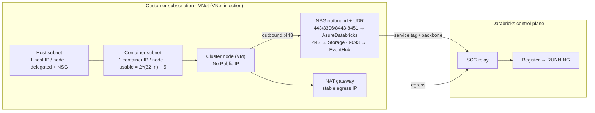
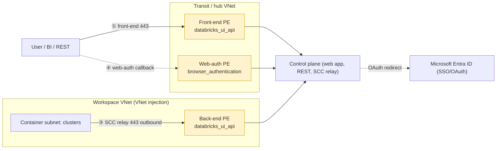
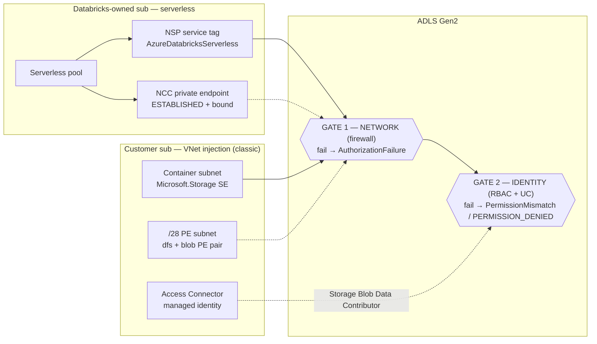
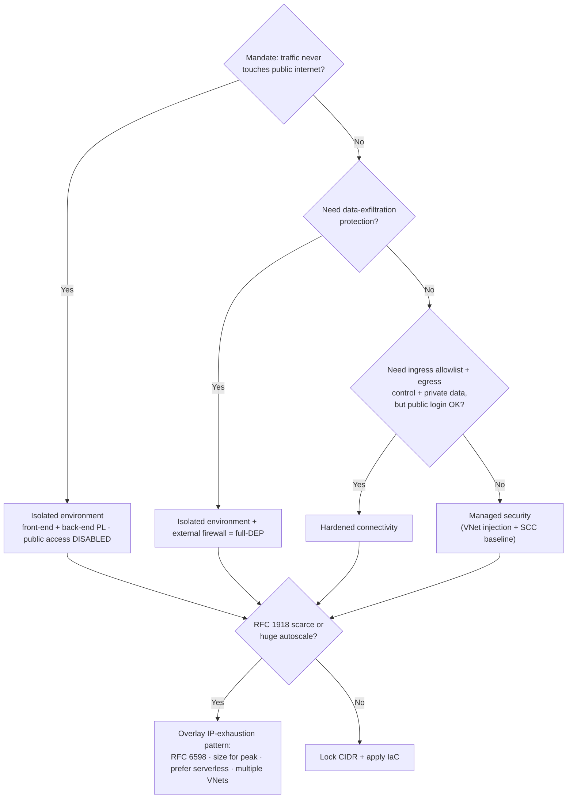
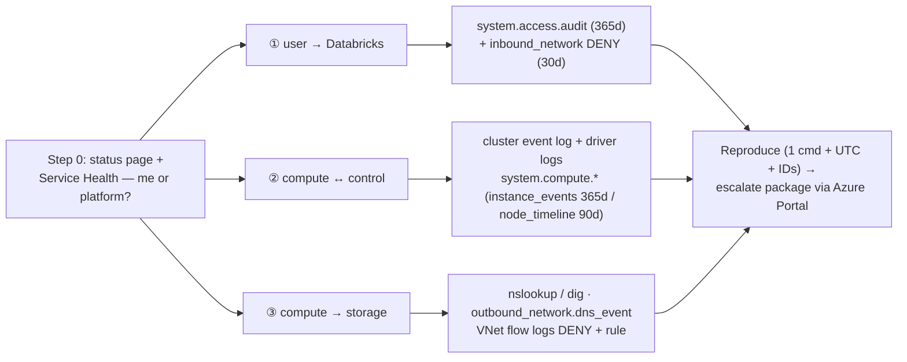

# Topic 10 — FDE Field Playbooks (Azure-first)

> **Stage 10 · Azure Databricks Networking & Security** — the *field-engineering*
> capstone. Stages 1–9 taught you how VNet injection, SCC, Private Link, NCC, DEP
> and Unity Catalog storage access **work**. This topic turns that knowledge into
> **runbooks** — *symptom → first diagnostic check → root cause → fix* — plus the
> **decision flow** an FDE walks a customer through, and the **diagnostics &
> escalation** discipline that resolves a case on round-trip one instead of five.
>
> **This one page covers all five subtopics:**
> - **10.1 — Troubleshooting compute & networking startup failures** (cluster/workspace won't start)
> - **10.2 — Troubleshooting connectivity** (front-end, Private Link, DNS, SCC)
> - **10.3 — Troubleshooting storage & serverless access** (ADLS 403s, NCC, egress)
> - **10.4 — Customer deployment patterns & the architecture decision flow** (which rung to pick)
> - **10.5 — Diagnostics, support & escalation** (evidence, repro, the support package)
>
> Companion interactive page: `index.html` (tabbed, one interactive architecture
> diagram per subtopic). Static topology: `architecture.svg`.

---

## 🧠 Topic mental model (hold this in your head)

> **You are an air-crash investigator standing on the three-path map.**
>
> Every Databricks fault lands on **exactly one of three connectivity paths** (the
> scaffold from 2.2): ① **user → Databricks** (front door), ② **compute ↔ control
> plane** (the SCC relay / back-end), ③ **compute → storage** (the loading dock).
> Troubleshooting is never "what's wrong with Databricks?" — it's:
>
> 1. **Which path is failing?** (the symptom tells you: can't log in = ①; cluster
>    won't start = ②; 403 reading ADLS = ③.)
> 2. **Read that path's black box** — the termination reason, the `nslookup`, the
>    storage error string, the flow-log `DENY`. The message hands you the broken hop.
> 3. **Run ONE check, not ten.** Diagnose *backwards from the message*, not forwards
>    from the architecture.
>
> **The one sentence:** *Pick the path, read the box, run one check — and the root
> cause is almost always in the customer's own VNet / DNS / firewall / RBAC, not in
> the Databricks platform.* The decision flow (10.4) is the same map run *forwards*
> at design time — pick the lowest rung that satisfies the mandate. Diagnostics
> (10.5) is the same map turned into evidence collection — **collect first, theorise
> second, because logs have a shelf life.**

---

## Why this topic matters to an architect

- **It's where credibility is won or lost.** Anyone can draw the architecture; the
  FDE who, given a termination reason, says "that's IP exhaustion on your container
  subnet — check Available IPs" *in one move* is the one the customer trusts.
- **Four of five "Databricks is broken" tickets are the customer's own
  network/identity** — quota, IPs, NSG/UDR, DNS, RBAC. Your value is the one
  diagnostic command that *proves where the break is* without a finger-pointing war.
- **Design and debug are the same map.** The decision flow (10.4) is the
  three-path scaffold run forwards; every runbook (10.1–10.3) is it run backwards.
- **Evidence is perishable.** `inbound_network` is 30-day; cluster event logs die
  with the cluster. The architect who insists on logging *before* go-live is the one
  who can actually root-cause later.

---

## Terms used here (define-before-use)

Stage 10 leans on terms taught earlier — quick glosses so you can read the runbooks
top-to-bottom; the deep dive lives in the owning module.

| Term | Plain-language gloss | Owning module |
| --- | --- | --- |
| **Three connectivity paths** | The map of all Databricks traffic: ① user↔Databricks, ② compute↔control plane, ③ compute→storage. Every fault lands on one. | **2.2** |
| **VNet injection** | Deploying classic compute into *your own* VNet (host + container subnets) so you own NSGs/UDRs/egress. | Stage 2/3 |
| **Host / container subnet** | The two delegated subnets every classic workspace needs; each node burns **1 IP in each**, and the *container* subnet runs out first. | Stage 2/3 |
| **CIDR / `usable = 2^(32−n) − 5`** | Subnet size notation; Azure reserves **5 IPs** per subnet (`/26` → 59 usable). Subnet CIDR is **immutable** after deploy. | Stage 0/2 |
| **NSG** (network security group) | A stateful allow/deny firewall on a subnet/NIC. Databricks injects required **outbound** rules; deleting them breaks startup. | Stage 0/3 |
| **UDR** (user-defined route) | A custom route overriding Azure defaults — e.g. force `0.0.0.0/0` to a firewall. A misrouted UDR is the #1 "can't reach the relay." | Stage 0/3 |
| **NAT gateway** | Azure managed outbound translation giving a subnet a **stable egress IP**. Post-2026-03-31 it's the only implicit-free internet egress a new VNet has. | Stage 3 |
| **SCC relay / No Public IP (NPIP)** | Secure Cluster Connectivity: nodes have no public IP/no inbound ports; they dial **outbound 443** to the relay. Blocked egress → node never registers. | Stage 3 |
| **Private Endpoint (PE)** | A private IP inside your VNet mapping to a PaaS/Databricks service (a *sub-resource*); traffic stays on the backbone. | Stage 4 |
| **Sub-resource** (`databricks_ui_api`, `browser_authentication`, `dfs`, `blob`) | The specific target a PE points at. `databricks_ui_api` = UI/REST + SCC relay; `browser_authentication` = SSO callback (one per region); `dfs`/`blob` = ADLS Gen2. | Stage 4 |
| **Private DNS zone** (`privatelink.azuredatabricks.net`, `privatelink.dfs.core.windows.net`) | Azure-managed name→private-IP table. Must be **linked** to the client's VNet or the FQDN resolves to a *public* IP. | Stage 4 |
| **Conditional forwarding** | A custom/on-prem DNS rule forwarding a domain suffix to Azure's resolver `168.63.129.16` so private zones resolve. | Stage 4 |
| **Service endpoint** (`Microsoft.Storage`) | A free subnet setting letting a storage firewall allow *that subnet* over the backbone. | Stage 4 |
| **Service tag** (`AzureDatabricks`, `AzureDatabricksServerless`, `Storage`, `EventHub`) | A Microsoft-maintained, auto-updated label for a service's IP ranges — use in NSG/UDR/firewall rules instead of IPs (IPs rotate). | Stage 0/4 |
| **NCC** (Network Connectivity Configuration) | Account-level, regional object giving **serverless** compute private/firewalled connectivity + stable egress + network policies. | Stage 5 |
| **NSP** (network security perimeter) | An Azure construct around a storage account that allows the `AzureDatabricksServerless` service tag (the modern serverless allowlist path). | Stage 5 |
| **Access Connector / managed identity** | The first-party Azure resource carrying the Entra ID managed identity Unity Catalog uses to reach storage (needs `Storage Blob Data Contributor`). | Stage 7 |
| **DEP** (data exfiltration protection) | The hardened posture: SCC + VNet injection + full Private Link + an Azure Firewall on a UDR that allows only Databricks FQDNs. | Stage 6 |
| **System tables** (`system.access.*`, `system.compute.*`) | UC-governed tables that record the account's operational history — the platform's own black box. | Stage 9 |
| **VNet flow logs** | Network Watcher L4 records (5-tuple + direction + `D`eny + rule) — the Azure-fabric black box. Must be enabled *before* the incident. | Stage 9 |

---

# 10.1 — Troubleshooting compute & networking startup failures

## What it is (plain language)

When a classic cluster starts, a lot happens in your VNet in ~5 minutes: Azure
allocates VMs (your **quota**), each node takes **two private IPs** (host +
container subnet), the NICs sit in **delegated** subnets governed by an **NSG**, and
the node calls **outbound** to the **SCC relay** to register. If *any* step fails,
the cluster terminates with a message — your job is to map that message to the one
broken hop.

**Analogy:** a cluster starting is a **delivery truck leaving the depot** — it needs
a parking spot (vCPU quota), two licence plates (host + container IP), an open gate
with the right pass (NSG/delegation), and a working road to head office (UDR/NAT →
SCC relay). Troubleshooting is one question: **"which one broke?"**

**This subtopic lives almost entirely on path ②** (compute ↔ control) and the
plumbing it rides over (VNet/subnets/NSG/UDR/NAT). Path ① and ③ failures are 10.2
and 10.3.

## Traffic path — what startup traverses



## WHY IT BREAKS (cause → effect) — the five failure families

| Family | Cause → effect | First diagnostic check | Permanent? |
| --- | --- | --- | --- |
| **A. Quota** | New nodes' total vCPUs exceed the regional per-family limit → fast launch failure (`QuotaExceeded`). Or SCC disabled → every node wants a public IP → `PublicIPCountLimitReached`. | Subscription → **Usage + quotas** (region + VM family / Public IP). | No (request increase) |
| **B. IP exhaustion** | Container subnet ran out of free IPs (2 per node, −5 reserved) → `insufficient IP addresses` / autoscale silently stalls. | VNet → Subnets → **Available IPs** on the *container* subnet. | **Yes** (subnet CIDR immutable) |
| **C. NSG/UDR/egress** | A Deny rule, a `0.0.0.0/0` UDR to a firewall that doesn't allow the relay FQDN, or a post-2026-03-31 VNet with no outbound → node can't reach the relay → bootstrap/NPIP-tunnel timeout. | NSG outbound rules present? `0.0.0.0/0` UDR + firewall allowlist + NAT attached? | No |
| **D. Delegation/NSG assoc.** | Subnet delegation to `Microsoft.Databricks/workspaces` removed, or NSG/foreign resource on the subnet → *every* cluster fails instantly. | Subnet **Delegation** = Databricks + NSG attached, no foreign resources. | No |
| **E. Workspace deploy** | ARM failure before any cluster exists — missing delegation, blocking Policy, RBAC, wrong region. | Portal → RG → **Deployments** (the ARM error, *not* the Databricks UI). | No |

> **The discriminator that trips people:** an IP-exhaustion error *says* "cloud
> provider launch failure," which looks like quota. The tell is **Available IPs on
> the container subnet ≥ requested nodes**. Quota fine but IPs near zero → exhaustion.

## ONE illustrative config — the forced-tunnel UDR that keeps the relay reachable

```hcl
# Illustrative (NOT the full module — that's the hands-on artifact).
# Forced-tunnel pattern: keep Databricks control-plane traffic on the backbone via
# SERVICE TAGS (IPs rotate), send everything else to the hub firewall.
# Missing the first three routes = bootstrap timeout (Family C).
resource "azurerm_route" "adb_cp" {            # SCC relay + webapp + API
  name                = "to-azuredatabricks"
  resource_group_name = "adb-rg"
  route_table_name    = azurerm_route_table.adb.name
  address_prefix      = "AzureDatabricks"      # SERVICE TAG, not a CIDR
  next_hop_type       = "Internet"             # stays on the Microsoft backbone
}
resource "azurerm_route" "default_to_fw" {     # everything else -> inspect at hub FW
  name                   = "default-to-firewall"
  resource_group_name    = "adb-rg"
  route_table_name       = azurerm_route_table.adb.name
  address_prefix         = "0.0.0.0/0"
  next_hop_type          = "VirtualAppliance"
  next_hop_in_ip_address = "10.100.0.4"        # hub Azure Firewall private IP
}
# Also required (not shown): routes for "Storage" (443) and "EventHub" (9093).
```

**Portal:** read the termination reason at Workspace → **Compute → (cluster) → Event
log** + **Driver logs**. For a failed deploy, read **Portal → RG → Deployments**.
Quota: **Subscription → Usage + quotas**. IPs: **VNet → Subnets → Available IPs**.

> ⚠️ **Post-2026-03-31:** new Azure VNets have **no implicit internet egress** — a
> new injected workspace needs a **NAT gateway on both subnets** or clusters can't
> reach the relay. Existing VNets are unaffected. Do **not** use an egress load
> balancer with SCC (SNAT port exhaustion) — use a NAT gateway.

---

# 10.2 — Troubleshooting connectivity (front-end, Private Link, DNS, SCC)

## What it is (plain language)

"I can't get into Databricks" / "clusters won't start" on a **locked-down** (Private
Link, public-access-disabled) workspace is one of **four paths** failing:

1. **Front-end** — browser/BI/REST can't reach the workspace URL.
2. **Private Link / Private DNS** — the PE exists but the name resolves to the
   *public* IP (or nowhere), so traffic fails or "leaks" and gets rejected.
3. **SCC relay (back-end)** — the cluster can't open its outbound tunnel.
4. **Web-auth / OAuth** — the page loads but **login** spins because the SSO callback
   can't complete over the private path.

**Analogy:** the workspace URL is a *phone number*, DNS is the *phonebook*, Private
Link is a *private unlisted line*. Most "the phone doesn't work" tickets are really
*"the phonebook gives out the wrong number."* That's why an FDE checks the phonebook
(**DNS**) first.

**This subtopic is the debugging layer over paths ① and ②.** It's **DNS-first**:
~80% of "Private Link is broken" tickets are name-resolution tickets.

## Traffic path — the four connectivity paths and where each breaks



Every yellow box depends on a `privatelink.azuredatabricks.net` record resolving to
the PE's private IP. Break the DNS and *all* paths fail even though the endpoints are
healthy — hence DNS-first.

## WHY IT BREAKS (cause → effect)

| Symptom | Cause → effect | First check (from the **failing** network) |
| --- | --- | --- |
| Browser times out / "Public access is not allowed" | VNet not **linked** to the Private DNS zone (or custom-DNS forwarder gap) → URL resolves to the *public* IP → rejected on a Disabled-PNA workspace. | `nslookup adb-<id>.<n>.azuredatabricks.net` → public IP/NXDOMAIN ⇒ check **Private DNS zone → Virtual network links** (the #1 omission). |
| Cluster *Pending* → "Control Plane Request Failure" | Back-end name resolves public, PE Pending, or firewall drops the relay → node can't register. | `nslookup` from a **workspace-VNet jump-box** → must be the back-end PE private IP; then PE status + outbound 443 / relay FQDN allowlist. |
| Page loads but **login spins/loops** | Missing `<region>.pl-auth` record, or the **web-auth host workspace was deleted** → SSO callback can't resolve → login breaks **region-wide**. | `nslookup <region>.pl-auth.azuredatabricks.net`; confirm the web-auth endpoint + that its **host workspace still exists** (delete-locked). |
| Works from some sites, not others | Conditional-forwarding gap in one spoke → that spoke queries public DNS → public IP. | Check that site's DNS server + forwarders for all three suffixes. |

## ONE illustrative config — the DNS-first probe + the forwarding fix

```bash
# Run FROM the failing network (jump-box in the VNet, or on-prem over VPN).
# Resolving from your laptop on the public internet proves nothing.
nslookup adb-1111111111111111.1.azuredatabricks.net
#   GOOD: CNAME -> ...privatelink.azuredatabricks.net, Address 10.x.x.x
#   BAD : a public IP (20.x / 40.x) -> Private DNS zone not in use -> Runbook A

# Confirm the client's VNet is linked to the zone (the #1 missing step):
az network private-dns link vnet list \
  --resource-group dns-rg --zone-name privatelink.azuredatabricks.net -o table
```

**Fix (preferred):** **conditional-forward** `*.azuredatabricks.net`,
`*.privatelink.azuredatabricks.net`, and `*.databricksapps.com` to Azure DNS
**`168.63.129.16`** — it auto-tracks new workspaces and regional SSO URLs; manual A
records rot. **Portal:** Private DNS zone → **Virtual network links** / **Recordsets**;
workspace → **Networking → Private endpoint connections** (must be **Approved**).

> ⚠️ Don't route the SCC relay through firewall **deep inspection**, and allowlist
> relay **FQDNs, not IPs** (they rotate). On a Disabled-PNA workspace there is **no
> public fallback** — one missing VNet link = full outage.

---

# 10.3 — Troubleshooting storage & serverless access

## What it is (plain language)

When a query reads `abfss://...dfs.core.windows.net/...`, the request clears **two
independent gates**, and a denial at either looks identical to the user:

1. **Network gate** — *can this compute even reach the storage account?* The
   **storage firewall** checks *where the packet came from* (allowlisted subnet,
   private endpoint, service tag, trusted resource instance).
2. **Identity gate** — *is this caller authorized?* **Azure RBAC + Unity Catalog**:
   the access-connector managed identity needs `Storage Blob Data Contributor`; the
   UC principal needs `READ FILES` / `SELECT`.

**Analogy:** the storage firewall is the **front-door badge reader** (allowed
entrance?); RBAC/UC is the **lock on the specific filing cabinet** (allowed to open
*this* drawer?). A 403 means a turnstile said no — your job is to tell **which
turnstile, for which caller**.

**This is path ③.** The killer nuance: **classic and serverless reach storage by
different paths.** Classic = your VNet subnets; serverless = Databricks' subnets,
allowlisted by the `AzureDatabricksServerless` service tag or an NCC private
endpoint — *not* your subnets.

## Traffic path — two compute paths, one storage account, two gates



## WHY IT BREAKS (cause → effect)

| Symptom | Cause → effect | First check |
| --- | --- | --- |
| Classic 403 after firewall enabled | `Microsoft.Storage` service endpoint on **only one** subnet, or subnet not in the firewall allowlist → packet rejected at the network gate. | **Both** host + container subnets have the SE *and* are in the firewall allowlist. |
| Workspace-storage firewall broke jobs/DBFS/Cloud Fetch | Missing prereq (no SCC/Premium), or a **`dfs` PE without the matching `blob` PE** → ABFS fails in confusing ways. | Premium + VNet-injected + SCC? **`/28` PE subnet with BOTH `dfs` and `blob` PEs Approved**? |
| Serverless 403, classic fine | Customer allowlisted *their* VNet; serverless isn't in it → packet from Databricks subnet rejected. | **NSP `AzureDatabricksServerless` service-tag rule**, OR NCC PE `ESTABLISHED` + **bound + restarted** (~10 min). |
| `AuthorizationPermissionMismatch` / UC `PERMISSION_DENIED` | Identity gate: wrong RBAC role (`...Reader` not `Contributor`), wrong connector ID, or missing UC grant. | Access-connector identity has **`Storage Blob Data Contributor`**; credential references the right connector; principal has `READ FILES`. |
| Serverless code times out under Restricted egress | Destination not allowlisted, or direct-from-code storage (prohibited under Restricted) → network policy denies it. | Is the policy **Restricted**? Is the target an allowed UC external location / listed FQDN? Use **dry-run**. |

> **The diagnostic rule of thumb:** `AuthorizationFailure` = **network gate**;
> `AuthorizationPermissionMismatch` = **identity gate**; UC `PERMISSION_DENIED` (before
> any Azure call) = **grant**. Then ask "classic or serverless?" to pick the door.

## ONE illustrative config — wire the identity gate (the most common 403)

```sql
-- UC side: credential -> external location -> grant. The GRANT is the missing line in many 403s.
CREATE STORAGE CREDENTIAL adls_cred
  WITH AZURE_MANAGED_IDENTITY
  ACCESS_CONNECTOR_ID = '/subscriptions/<sub>/resourceGroups/adb-rg/providers/Microsoft.Databricks/accessConnectors/adb-ac';
CREATE EXTERNAL LOCATION lake_ext
  URL 'abfss://data@mydatalake.dfs.core.windows.net/'
  WITH (STORAGE CREDENTIAL adls_cred);
GRANT READ FILES ON EXTERNAL LOCATION lake_ext TO `data-engineers`;
```

```bash
# Azure side: the access-connector identity needs the DATA-PLANE role (not "...Reader").
az role assignment create \
  --assignee-object-id <access-connector-MI-principal-id> \
  --assignee-principal-type ServicePrincipal \
  --role "Storage Blob Data Contributor" \
  --scope "/subscriptions/<sub>/resourceGroups/data-rg/providers/Microsoft.Storage/storageAccounts/mydatalake"
```

**Portal:** storage account → **Networking** (firewall allowlist / PE connections /
resource-instance rule for `Microsoft.Databricks/accessConnectors`); Account console
→ **NCC** (create, add PE rule, bind, then approve the PE on storage, wait, restart).

> ⚠️ **Service Endpoint *Policies* don't work on Databricks-delegated subnets** —
> use PE + DEP firewall instead. **NCC limits:** 10 NCCs/region, 100 PEs/region, 50
> workspaces/NCC; **Premium** required.

---

# 10.4 — Customer deployment patterns & the architecture decision flow

## What it is (plain language)

A **deployment pattern** is a *named, repeatable combination* of network controls.
Microsoft documents **three reference architectures as a progression** (a security
ladder you climb as requirements get stricter):

1. **Managed security** — secure default baseline (VNet injection + SCC).
2. **Hardened connectivity** — adds ingress allowlisting, serverless egress control,
   NCC private endpoints, back-end Private Link; audit.
3. **Isolated environment** — everything private: front-end Private Link + web-auth
   PE, public access **Disabled**, external firewall (DEP).

**Analogy:** **Managed security** = locked front door + doorman; **Hardened
connectivity** = ID check + guest log + controlled loading dock; **Isolated
environment** = windowless vault with a private tunnel and no public entrance. You
don't build the vault for a coffee shop.

**This subtopic adds no new path** — it decides *which controls go on all three paths
at once*. Each rung flips more of ①/②/③ from "public-ish" to "private."

## The ladder + the decision flow



## The feature matrix (memorize this — it's the interview answer)

| Connectivity | Feature | Managed security | Hardened connectivity | Isolated environment |
| --- | --- | --- | --- | --- |
| Classic | Secure Cluster Connectivity (SCC) | Yes | Yes | Yes |
| Classic | VNet injection | Yes | Yes | Yes |
| Classic | Back-end Private Link | Optional | Yes | Yes |
| Inbound | Front-end (workspace) Private Link | No | No | Yes |
| Inbound | Workspace / account / OpenSharing IP access lists | No | Yes | Yes |
| Outbound | Serverless egress control (network policies) | No | Yes | Yes |
| Outbound | Serverless Private Link (NCC private endpoints) | No | Yes | Yes |
| Outbound | External firewall (DEP) | Optional | Optional | Yes |

## WHY IT BREAKS (cause → effect) — over- and under-building

| Mistake | Cause → effect | First check / fix |
| --- | --- | --- |
| Customer over-scoped to Isolated, users can't log in | Front-end PL deployed without the **`browser_authentication` PE / `pl-auth` record** → SSO callback fails over the private path. | Check the web-auth PE + `privatelink` A record **before** touching front-end PL (→ 10.2). |
| "Control Plane Request Failure" after enabling back-end PL | NSG rules not `NoAzureDatabricksRules`, or workspace VNet resolves the URL to a **public** IP. | NSG mode + back-end DNS resolution (→ 10.2 / 10.3). |
| Over-scoped, serverless jobs can't reach storage | NCC PE rule not **approved** on storage, or egress policy doesn't allowlist the target. | NCC PE `ESTABLISHED` + bound; egress allowlist (→ 10.3). |
| IP exhaustion on autoscale | Container subnet sized for today, not peak; CIDR is immutable. | Container subnet free IPs vs peak nodes (−5); fix is often "move spiky workloads to serverless," not a rebuild. |

> **The rule:** *pick the **lowest rung that satisfies the mandate**, never the
> highest — climbing is cheap to spec but expensive to operate* (PE per-hour, NAT/FW
> per-GB, DNS/firewall ops). Don't route the **SCC relay** through the DEP firewall —
> allow it directly; the firewall is for *data* egress.

## ONE illustrative config — the delta from baseline to Isolated

```hcl
# Managed-security baseline is VNet injection + SCC (no_public_ip = true).
# Isolated environment = the SAME workspace + these two lines + a back-end PE:
resource "azurerm_databricks_workspace" "isolated" {
  name                                  = "adb-isolated"
  resource_group_name                   = var.rg
  location                              = var.region
  sku                                   = "premium"               # all Private Link needs Premium
  public_network_access_enabled         = false                   # <-- Isolated: reject public
  network_security_group_rules_required = "NoAzureDatabricksRules" # <-- back-end PL needs this
  custom_parameters { no_public_ip = true /* + VNet/subnet/NSG associations */ }
}
# + a databricks_ui_api PE (back-end, workspace VNet) and a databricks_ui_api +
#   browser_authentication PE (front-end, TRANSIT VNet) complete the Isolated inbound path.
```

**Portal decision points:** Create → Azure Databricks → **Networking** → SCC = Yes,
own VNet = Yes (all rungs); **Required NSG rules** = `AllRules` (Managed) /
`NoAzureDatabricksRules` (back-end PL); **Allow Public Network Access** = Enabled
(Managed/Hardened) / Disabled (Isolated). Add IP access lists / NCC / network
policies / front-end PEs after creation.

### Mapping old deck terms (so you're not caught out)

| Old / informal term | Current Microsoft term |
| --- | --- |
| "Standard deployment" (separate transit VNet) | **Isolated environment** (hub-spoke transit VNet) |
| "Simplified deployment" (transit subnet, combined PE) | A lighter front-end PL setup → **Isolated** inbound layer |
| "Secure / hardened workspace" | **Hardened connectivity** |
| "Default / managed-VNet workspace" | **Managed security** |
| "Full DEP architecture" | **Isolated environment + external firewall** |

> ⚠️ Subnet CIDR and VNet injection are **deploy-time** decisions — you can't
> retrofit injection onto a managed-VNet workspace. Service-endpoint serverless
> storage firewalling now needs **Azure NSP** (from 2026-04-07). Performance-intensive
> Private Link (Zerobus, Lakebase Autoscaling) is **Public Preview** — no GA SLA.

---

# 10.5 — Diagnostics, support & escalation

## What it is (plain language)

- **Diagnostics** = gathering the *evidence* (who tried, where it was blocked, what
  the platform logged, what the Azure fabric did with the packet).
- **Reproducing** = boiling "it's slow / it failed" down to one minimal, repeatable
  action that fails the same way every time.
- **Escalation** = handing a *well-packaged* case to support — for Azure Databricks,
  filed through the **Azure portal** (first-party service) — with logs, UTC
  timestamps, IDs and repro already attached.

**Analogy:** you're an **air-crash investigator**, not a witness. Your black boxes are
**system tables, VNet flow logs, and diagnostic-settings export** — and they only have
a recording if you switched them on *before* the crash. **Collect first, theorise
second** — evidence has a shelf life.

**This subtopic diagnoses all three paths at once** — each has its own black box.

## Traffic path — the four diagnostic layers, mapped to the three paths



## WHY IT BREAKS (cause → effect) — the diagnostic failures themselves

| Symptom | Cause → effect | First check |
| --- | --- | --- |
| "Cluster failed to start" | Termination reason names IP exhaustion / cloud launch failure — but the cluster gets deleted and the event log vanishes. | Open the **cluster event log termination reason** + `system.compute.instance_events` *before* deleting the cluster. |
| "Can't reach workspace/storage" (timeout) | DNS resolves public where you expected private (zone not linked) — or resolves fine but a flow-log `DENY` at NSG/UDR. | `nslookup` the FQDN; then **VNet flow logs** `D` record (if enabled beforehand). |
| "Permission denied" intermittently | An ingress/IP-access-list policy is dropping by source IP — looks like a UC grant. | `system.access.inbound_network` for `DENY`/`DENY_DRY_RUN` by source IP. |
| Support case stalls on day one | Case filed on the **wrong subscription** → the engineer can't see the resources. | Verify the case is on the workspace's subscription + correct severity/plan. |
| "What happened last quarter?" forensic | `inbound_network` is **30d**, `node_timeline` **90d** → history already aged out. | Must already be exporting to a SIEM/storage — flag retention before go-live. |

> **The discipline:** start at the layer the symptom points to, but **always confirm
> name resolution and the fabric layer** — a "permission" or "timeout" error is very
> often DNS or NSG/UDR in disguise (the 10.2 DNS-first rule, restated).

## ONE illustrative config — read the network-denial black boxes

```sql
-- Denied INBOUND (front-end / IP-access-list) and OUTBOUND (serverless egress) requests.
SELECT event_time, source.ip AS src_ip, authenticated_as, policy_outcome, rule_label
FROM   system.access.inbound_network                       -- 30-day retention
WHERE  event_time >= current_timestamp() - INTERVAL 2 HOUR ORDER BY event_time DESC;

SELECT event_time, destination_type, destination,
       dns_event.rcode AS dns_rcode, storage_event.rejection_reason
FROM   system.access.outbound_network                      -- DNS vs IP vs STORAGE denial
WHERE  event_time >= current_date() - INTERVAL 1 DAY ORDER BY event_time DESC;
```

```bash
# Enable VNet flow logs BEFORE incidents — it's your Azure-fabric black box.
# A 'D' (deny) record names the NSG/UDR rule + 5-tuple that dropped the packet.
az network watcher flow-log create \
  --resource-group rg-network --name adb-vnet-flowlog --location eastus \
  --vnet adb-vnet --storage-account stflowlogseastus \
  --traffic-analytics true --workspace <log-analytics-resource-id>
```

**Portal:** status first — **status.azuredatabricks.net** + **Service Health** +
workspace **Resource health**. Audit export: workspace resource → **Monitoring →
Diagnostic settings** (Premium; `clusterPolicies`/`groups`/`vectorSearch` are
system-table-only). Escalate: **Help + support → Create a support request** →
Technical → **Azure Databricks** → the workspace's **subscription**.

> ⚠️ **Build logging into the deploy, not the incident** — system-table grants, VNet
> flow logs, and diagnostic-settings export on day one. **NSG flow logs are being
> retired** in favour of VNet flow logs (verify the date). Never promise Sev-A speed
> on a Developer support plan.

---

## Comparison table — the five playbooks at a glance

| Subtopic | Path | Tell-tale symptom | First diagnostic check | Usual root cause (customer-side) |
| --- | --- | --- | --- | --- |
| **10.1 Startup** | ② + plumbing | "Cluster won't start" / terminated with a reason | Read termination reason → quota / Available-IPs / NSG-UDR / delegation | IP exhaustion, missing NAT, stripped NSG rule |
| **10.2 Connectivity** | ① + ② | "Can't log in" / "login spins" / "Control Plane Request Failure" | `nslookup` from the **failing** network | Private DNS zone not linked / web-auth record missing |
| **10.3 Storage/serverless** | ③ | "403 reading ADLS" / "serverless can't reach storage" | Read error string → network vs identity gate; classic vs serverless | Allowlisted own VNet for serverless; `dfs` w/o `blob`; wrong RBAC role |
| **10.4 Decision flow** | all (design) | "Which architecture for us?" / over- or under-built | Ask the four mandate questions → name the rung | Sold the vault to the coffee shop |
| **10.5 Diagnostics** | all (evidence) | "Prove what broke" / "where do logs go?" | Status first → match symptom to layer → read its black box | Evidence aged out / wrong subscription on the case |

---

## Decision guide (what an architect recommends)

| Situation | Recommend | Why |
| --- | --- | --- |
| Any new injected deployment | **NAT gateway on both subnets · container subnet sized for peak · SCC on · never hand-edit managed NSG** | Bakes out the four most common startup tickets (10.1) |
| Production Private Link workspace | **Conditional forwarding** of the three suffixes to `168.63.129.16` + **dedicated, delete-locked web-auth workspace per region** | Removes the "new workspace silently fails" and region-wide SSO outage classes (10.2) |
| Regulated storage exposure | **Private endpoints + storage firewall** (no public path); **service endpoints** where free-backbone is acceptable | Matches isolation to mandate; SE is free (10.3) |
| Serverless reaching governed data | **`AzureDatabricksServerless` service tag (transition mode)** by default; **NCC PE** when "no public IP on storage" is mandated | Simplest that works; PE only when required (10.3) |
| Non-regulated analytics | **Managed security** (VNet injection + SCC) | Lowest rung; secure defaults, no private-DNS ops (10.4) |
| Audit + access control, public login OK | **Hardened connectivity** | IP ACLs + egress control + private data without the vault (10.4) |
| FSI/health/gov, "no public / no exfil" mandate | **Isolated environment (+ firewall = full-DEP)** | The only "nothing public" answer; most expensive to operate (10.4) |
| Scarce RFC 1918 / huge autoscale | Overlay **IP-exhaustion** pattern (RFC 6598 + serverless + multiple VNets) | Sizing overlay, independent of the rung (10.4) |
| Every production workspace, before go-live | **System-table grants + VNet flow logs + diagnostic-settings export to SIEM** | The black box must record *before* the crash (10.5) |

---

## Uses, edge cases & limitations

- **Uses:** first-15-minutes triage on any startup / connectivity / storage /
  serverless escalation; the decision conversation that scopes a deployment; standing
  up logging before go-live; packaging an escalation that resolves on round-trip one.
- **Edge cases:**
  - **Serverless ≠ classic** on paths ②/③ — no subnet, no static IP; use NCC + the
    `AzureDatabricksServerless` service tag, not your VNet (the #1 misdiagnosis).
  - **Diagnosing from the wrong network** — `nslookup` from a public laptop returns
    the public IP and proves nothing.
  - **Half-fixes:** `dfs` PE without `blob`; service endpoint on one subnet only;
    `Storage Blob Data Reader` (reads work, writes 403).
  - **Shared blast radius:** deleting the web-auth host workspace breaks login
    region-wide; one missing VNet link breaks every machine on that VNet.
  - **Post-2026-03-31** new VNets have no default outbound — new workspace can't reach
    the relay even when DNS is perfect.
  - **Short retention:** `inbound_network` 30d, `node_timeline` 90d, cluster event
    logs die with the cluster — export early.
  - **Service Endpoint Policies** are a no-op on Databricks-delegated subnets.
- **Limitations:** Private Link / IP access lists / CMK / egress control / diagnostic
  logs require **Premium**; NCC quotas (10/region, 100 PEs/region, 50 workspaces/NCC);
  subnet CIDR + VNet injection are deploy-time; NSG-rules/public-access changes need
  all compute stopped and a 15+ min window; many networking system tables are
  **Public Preview** (free now, behaviour can change) — flag preview status.

---

## FDE field notes

**Common customer asks:**
- *"Our cluster won't start — is it Databricks or our network?"* → Read the
  termination reason; 4 of 5 are quota/IP/NSG-UDR/delegation, i.e. **their** network.
- *"Databricks is down — is it your platform?"* → "One `nslookup` from the failing
  network; if the URL doesn't return a *private* IP, the break is in your DNS linking."
- *"We allowlisted our VNet but serverless still gets 403."* → Serverless isn't in
  your VNet — allow the `AzureDatabricksServerless` service tag or add an NCC PE.
- *"Which architecture do you recommend?"* → Ask the four mandate questions, name the
  rung. Don't lead with the vault.
- *"Where do our audit logs go / how long are they kept?"* → `system.access.audit`
  (recommended) and/or diagnostic settings → Log Analytics; audit 365d, **inbound
  only 30d** — export to a SIEM for more. Open break-fix tickets in the **Azure portal**.

**Talk-track (positioning):** *"Every Databricks fault lands on one of three paths —
users in, clusters to control, clusters to data. We pick the path from the symptom,
read that path's black box — the termination reason, the `nslookup`, the storage error
— and run one check. The root cause is almost always in your own VNet, DNS, firewall or
RBAC, not the platform. We design the same way, forwards: pick the lowest network rung
that satisfies your mandate. And we turn logging on before go-live so the black box is
recording when something breaks."*

**What breaks in the field + FIRST diagnostic check:**
- *insufficient IP addresses* → container subnet **Available IPs** vs requested nodes.
- *bootstrap / NPIP tunnel timeout* → outbound 443 to `AzureDatabricks`: NSG rule? UDR/firewall allow relay FQDN? NAT attached?
- *every cluster fails instantly* → **subnet delegation + NSG association**.
- *"Control Plane Request Failure"* → `nslookup` from a workspace-VNet jump-box → back-end PE private IP + relay egress.
- *login spins* → `nslookup <region>.pl-auth...` → web-auth endpoint + host workspace exists.
- *serverless 403, classic fine* → NSP service-tag rule / NCC PE `ESTABLISHED` + bound + restarted.
- *`AuthorizationPermissionMismatch`* → access-connector identity has `Storage Blob Data Contributor`.
- *timeout, DNS fine* → **VNet flow logs** `DENY` record + effective NSG rules/routes.
- *case stalls* → verify the support case is on the **workspace's subscription**.

**Decision rule for the engagement:** see the Decision guide above — bake the
startup-hygiene four into IaC; conditional-forward DNS + delete-lock web-auth; match
storage exposure (SE vs PE) and serverless allowlisting (service tag vs NCC PE) to the
mandate; default to **Managed security**, climb only as compliance forces; and turn on
the logging black box before go-live.

---

## Common mistakes / gotchas

- **Reading an IP-exhaustion error as a quota error** (both say "launch failure") —
  the discriminator is **Available IPs on the container subnet**.
- **Hand-editing the Databricks-managed NSG rules** — breaks the outbound path to the
  relay/metastore/storage for every future cluster.
- **Allowlisting relay/storage by IP, not FQDN/service tag** — IPs rotate; random
  failures weeks later.
- **Assuming a new VNet has internet egress** (post-2026-03-31 it doesn't — NAT gateway).
- **Diagnosing DNS from the wrong network** / forgetting the **Virtual network link**.
- **Treating "Public access is not allowed" as an access-policy bug** — usually a DNS
  leak to the public IP on a Disabled-PNA workspace.
- **Deleting the web-auth host workspace** — region-wide login outage; lock it.
- **Treating serverless like classic** — allowlisting your VNet never helps serverless.
- **`dfs` without `blob`**, **SE on one subnet only**, **`...Reader` not Contributor**.
- **Selling the vault to the coffee shop** — pick the lowest rung that satisfies the mandate.
- **Routing the SCC relay through the DEP firewall** — adds a hop; allow it directly.
- **Debugging before checking status** / **letting evidence age out** / **filing on the
  wrong subscription** / **promising a SIEM has "everything"** (diagnostic settings omit
  `clusterPolicies`/`groups`/`vectorSearch`) / **building new tooling on NSG flow logs**.

---

## A note on the hands-on artifact

This is a **troubleshooting/decision** module, not a build module — its value is the
*symptom → check → fix* discipline and the decision flow, not one more apply-ready
Terraform module. The build-it IaC for each control already lives in its owning stage's
hands-on artifact (VNet injection in Stage 3, Private Link in Stage 4, NCC in Stage 5,
diagnostics/system-table enablement in Stage 9). **Decision:** no separate IaC file is
added here; the illustrative snippets above (the forced-tunnel UDR, the DNS probe, the
UC credential/grant, the Isolated-environment delta, the flow-log/system-table queries)
are the right altitude for this module. The CLI/SQL/`nslookup` commands here are
copy-pasteable diagnostics, which is the runnable surface this topic actually needs.

---

## References

- [Deploy Azure Databricks in your Azure VNet (VNet injection)](https://learn.microsoft.com/azure/databricks/security/network/classic/vnet-inject) — subnet sizing, 5 reserved IPs, 2 IPs/node, immutable CIDR, managed NSG rules, post-2026-03-31 outbound change.
- [Enable secure cluster connectivity (SCC / NPIP)](https://learn.microsoft.com/azure/databricks/security/network/classic/secure-cluster-connectivity) — outbound 443 to the relay, NAT egress requirement, no egress load balancer, allowlist FQDNs not IPs.
- [User-defined route settings for Azure Databricks (UDR)](https://learn.microsoft.com/azure/databricks/security/network/classic/udr) — `AzureDatabricks`/`Storage`/`EventHub` service-tag routes, port 3306 legacy metastore.
- [Azure Private Link concepts (front-end / back-end / web-auth)](https://learn.microsoft.com/azure/databricks/security/network/concepts/private-link) — `databricks_ui_api` / `browser_authentication`, ports 443/6666/3306/8443–8451, one web-auth per region.
- [Configure inbound (front-end) Private Link — DNS verification, `pl-auth` records, conditional forwarding](https://learn.microsoft.com/azure/databricks/security/network/front-end/front-end-private-connect)
- [Configure classic compute plane (back-end) Private Link](https://learn.microsoft.com/azure/databricks/security/network/classic/private-link-standard) — `NoAzureDatabricksRules`, "Control Plane Request Failure".
- [Enable firewall support for your workspace storage account](https://learn.microsoft.com/azure/databricks/security/network/storage/firewall-support) — classic `dfs`+`blob` PE pair, serverless service tag / NCC, prerequisites.
- [Use Azure managed identities in Unity Catalog to access storage](https://learn.microsoft.com/azure/databricks/connect/unity-catalog/cloud-storage/azure-managed-identities) — access connector, `Storage Blob Data Contributor`, resource-instance rule.
- [Configure private connectivity to Azure resources (NCC private endpoints)](https://learn.microsoft.com/azure/databricks/security/network/serverless-network-security/serverless-private-link) — NCC, `dfs`/`blob`, PENDING→ESTABLISHED, limits.
- [Configure an Azure network security perimeter for Azure resources](https://learn.microsoft.com/azure/databricks/security/network/serverless-network-security/serverless-nsp-firewall) — `AzureDatabricksServerless` service tag, transition vs enforced.
- [What is serverless egress control?](https://learn.microsoft.com/azure/databricks/security/network/serverless-network-security/network-policies) — Full vs Restricted, dry-run, deny-by-default.
- [Network reference architecture overview](https://learn.microsoft.com/azure/databricks/security/network/deployment-architecture/) — Managed security / Hardened connectivity / Isolated environment progression + feature matrix.
- [Understand Databricks networking costs](https://learn.microsoft.com/azure/databricks/security/network/serverless-network-security/cost-management) — PE /hr (/GB waived), NAT /GB; Azure NSP for service endpoints from 2026-04-07.
- [System tables reference](https://learn.microsoft.com/azure/databricks/admin/system-tables/) · [Network access events system table](https://learn.microsoft.com/azure/databricks/admin/system-tables/network) — retention, `DENY`/`DENY_DRY_RUN`, schemas.
- [Diagnostic log reference (audit logs)](https://learn.microsoft.com/azure/databricks/admin/account-settings/audit-logs) · [Configure diagnostic log delivery](https://learn.microsoft.com/azure/databricks/admin/account-settings/audit-log-delivery) — coverage gaps, Premium, ~15-min latency.
- [Virtual Network flow logs — Azure Network Watcher](https://learn.microsoft.com/azure/network-watcher/vnet-flow-logs-overview) · [Create an Azure support request](https://learn.microsoft.com/azure/azure-portal/supportability/how-to-create-azure-support-request) · [Azure Databricks status page](https://status.azuredatabricks.net/).

> Verified against current Azure Databricks + Azure docs (consolidated from the
> per-subtopic lessons, fetched 2026-06-26). The **post-2026-03-31 default-outbound
> retirement**, **Azure NSP for service endpoints (2026-04-07)**, **NSG-flow-log
> retirement**, **Public-Preview status** of the network/audit system tables and
> performance-intensive Private Link, **NCC limits**, and **Azure support SLAs by
> plan** are time-/region-sensitive — reconfirm in the docs before quoting a customer.
> Exact Azure error strings vary by API version; treat the *message theme* as the signal.
