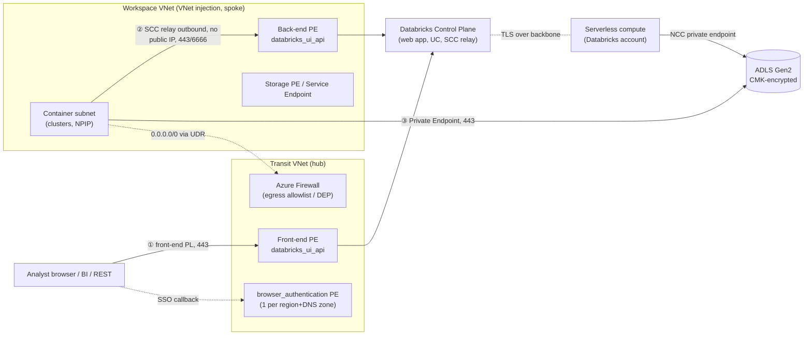
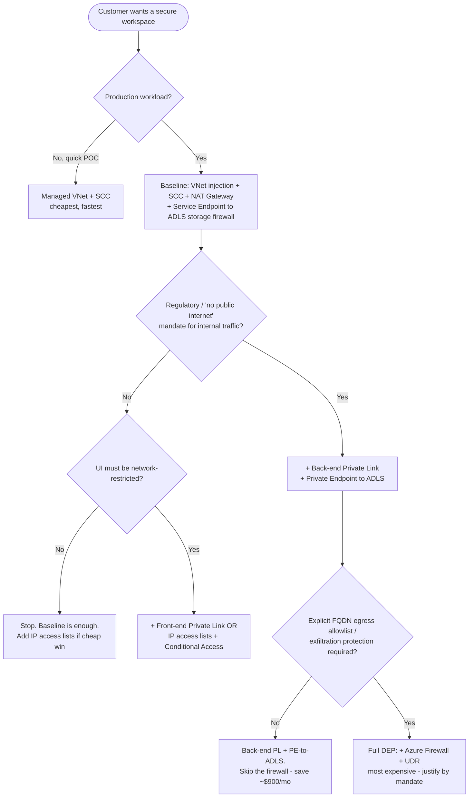

# Topic 11 — FDE Interview Prep Capstone (Azure-first)

> **Stage 11 · Azure Databricks Networking & Security** — for the **FDE / RSA /
> Solutions Architect** sitting across the table from a customer's security and
> FinOps teams (or a senior interviewer). This is the **synthesis** topic: it
> assumes Stages 1–9 (CIDR/VNet injection, SCC, the three Private Link types,
> Private DNS, NCC, CMK, Unity Catalog, audit) and turns that knowledge into three
> field skills — **draw it, answer it, defend it**.
>
> **This one page covers all three subtopics:**
> - **11.1 — Whiteboard scenarios** (design end-to-end secure ADB; trace a packet hop-by-hop; name the control at every hop)
> - **11.2 — Rapid-fire Q&A bank** (crisp, defensible model answers that survive the follow-up probe)
> - **11.3 — Defending trade-offs & cost** (justify each control against a driver, put real Azure dollars on it, and know when cheaper wins)
>
> Companion interactive page: `index.html` (tabbed, one interactive architecture
> diagram per subtopic). Static topology: `architecture.svg`.

---

## 🧠 Topic mental model (hold this in your head)

> **You are a security guard walking a VIP from the street to the vault — then the
> doctor who decides which locks are worth the money.**
>
> - There are exactly **three doors** (the Stage 2 scaffold): ① **user → workspace**
>   (front door), ② **compute → control plane** (service entrance), ③ **compute →
>   storage/egress** (loading dock).
> - **Two compute planes, two mechanisms.** **Classic** lives in *your* VNet → secure
>   it with **VNet injection + SCC + back-end Private Link** and **Service/Private
>   Endpoint** to storage. **Serverless** lives in *Databricks'* account → you can't
>   peer or pin an IP, so you use **NCC** (service-tag firewall or private endpoints)
>   and the control-plane leg is **always backbone TLS**.
> - **Every control must trace to a driver** (a regulatory mandate, a named threat, a
>   requirement). **No driver → it's over-build, and the cheaper default wins.**
>
> **The one sentence:** *Secure all three paths privately, set **Public network
> access = Disabled**, name the control at each hop — and be ready to say which locks
> you'd take off when the customer has no driver to pay for them.*
>
> **Cost rule of thumb:** Service Endpoint = **free** · NAT Gateway = **~$32/mo flat**
> · Private Endpoint = **cheap to exist (~$7/mo) but per-GB bites** on hot paths ·
> **Azure Firewall = the ~$900/mo cliff** (reserve for a real exfiltration mandate).

---

## Why this topic matters to an architect

- **It's the integration test of the whole track.** Any one feature is easy; the value
  is wiring SCC, back-end PL, front-end PL, web-auth, NCC, CMK, UC, and audit together
  *without redundancy* and *without leaving a public hole* — and pricing it honestly.
- **Regulated customers buy on the packet path.** A bank's architect won't sign off until
  you can prove "data never touches the public internet" hop-by-hop, with the doc behind
  each claim. The whiteboard walk is the deliverable.
- **Cost is a credibility test.** "Roughly what does back-end Private Link add per month?"
  A confident, defensible estimate separates a trusted advisor from a brochure-reader. So
  does the senior move of talking a customer *out* of a control they don't need.
- **It's the opener and the close of every senior interview and security workshop.**
  *"Design a secure Azure Databricks deployment for a regulated bank — and tell me when
  you'd NOT do the expensive version."*

---

## Terms used here (define-before-use)

This is a synthesis topic, so it *borrows* terms whose full deep dive lives in earlier
stages. Quick glosses so you can read top-to-bottom, with the owning module.

| Term | Plain-language gloss | Owning module |
| --- | --- | --- |
| **VNet injection** | Deploying the classic compute plane into *your own* Azure VNet (two delegated subnets — **host** + **container**) instead of the Databricks-managed one, so you own NSGs, UDRs, and the egress path. | **Stage 2.1 / 3** |
| **SCC / No Public IP (NPIP)** | Secure Cluster Connectivity: cluster nodes have **no public IP** and dial **outbound** to the control-plane **SCC relay** over 443 — no inbound door. The classic baseline. | **Stage 2.3 / 4** |
| **NSG** (network security group) | A stateful allow/deny firewall on a subnet/NIC; `NoAzureDatabricksRules` turns off the Databricks-managed *public* rules once traffic is private. | **Stage 1.3 / 2.4** |
| **UDR** (user-defined route) | A custom route overriding Azure defaults — e.g. send `0.0.0.0/0` (all egress) to an Azure Firewall. | **Stage 1.3 / 2.4** |
| **NAT Gateway** | Azure outbound-only translation giving a subnet a **stable public egress IP** (SNAT) for partner allowlists; flat hourly + per-GB. | **Stage 2.4 / 3.4** |
| **SNAT** (source NAT) | The translation that lets many private nodes share one egress IP; over-subscribing its ports = "SNAT port exhaustion." | **Stage 2.4** |
| **Service Endpoint** | A **free**, subnet-scoped, egress-only trust that lets a storage firewall allow a specific subnet over the backbone — no NIC, no DNS change, storage keeps a public-routable address. | **Stage 2.5 / 5** |
| **Private Endpoint (PE) / Private Link** | A real **NIC + private IP** in your VNet mapping a service (ADLS, workspace, control plane) onto your private address space; needs a Private DNS zone; per-hour + per-GB **both directions**. | **Stage 2.5 / 6** |
| **Front-end / back-end / web-auth PL** | Front-end = user→workspace private (`databricks_ui_api` + `browser_authentication`); back-end = classic compute→control-plane private (`databricks_ui_api`); web-auth = the SSO callback private. | **Stage 6** |
| **Private DNS zone** | The Azure DNS zone (`privatelink.azuredatabricks.net`) that resolves the workspace FQDN to the **private** endpoint IP instead of the public IP. | **Stage 3.2** |
| **FQDN** | Fully-qualified domain name (e.g. `adb-123.azuredatabricks.net`) — the name DNS resolves to an IP. | **Stage 0.4** |
| **Service tag** | An Azure-maintained, auto-updating label for a service's IP ranges (e.g. `AzureDatabricksServerless.EastUS2`) used in firewall/NSG rules instead of raw IPs. | **Stage 0.3 / 4a.4** |
| **NSP** (Azure Network Security Perimeter) | A logical isolation boundary you associate PaaS resources with, to allowlist sources by service tag instead of IP lists. | **Stage 4a.4** |
| **NCC** (Network Connectivity Configuration) | Account-level, **regional** Databricks object giving the **serverless** plane its egress/private-connectivity rules (service-tag firewall or private endpoints); attached to workspaces. | **Stage 4a.2 / 7** |
| **DEP** (data exfiltration protection) | SCC + VNet injection + a UDR sending all egress to an **Azure Firewall** with an explicit FQDN allowlist, so a compromised job has nowhere to send data. | **Stage 3.4 / 8** |
| **CMK** (customer-managed keys) | At-rest keys you own/rotate in **Azure Key Vault**; revoking the key cuts Databricks' access. Premium-gated. | **Stage 4b.4 / 9** |
| **Unity Catalog (UC)** | Databricks' governance layer (`catalog.schema.table`) — grants, row filters, column masks, external locations + storage credentials (managed-identity access connector) — the layer *above* the network. | **Stage 4b.3** |
| **Conditional Access** | A Microsoft Entra ID policy gating sign-in by network/device/MFA; pairs with IP access lists to restrict who reaches the workspace. | **Stage 10** |

---

# 11.1 — Whiteboard scenarios: designing end-to-end secure Azure Databricks

## What it is (plain language)

- A **whiteboard scenario** is the classic FDE/SA interview and customer-workshop
  exercise: *"Design a secure Azure Databricks deployment for a regulated bank. Walk me
  through how a query gets from an analyst's browser to data in ADLS, and tell me what
  protects each step."*
- You are not reciting features — you are **assembling them into one coherent
  architecture** and defending the trade-offs (cost, complexity, blast radius).
- The skill tested: can you **trace the packet** (who initiates, in which direction, over
  which port, to which endpoint) and **name the control at each hop** (VNet injection,
  SCC, back-end PL, front-end PL, web-auth, NCC, CMK, UC, audit)?

**Analogy:** it's an architect asked to draw a bank vault on a napkin — not "we have a
strong door," but *which* door, *which* lock, *who holds the key*, and *what the camera
sees* at every threshold from the street to the cash.

> **The end-state has a name.** Securing all three paths privately and setting **Public
> network access = Disabled** is Microsoft's **"Complete private isolation"** posture
> (front-end + back-end + web-auth Private Link + NCC for any serverless).

## The scaffold — three connectivity paths, two compute planes

Every control secures one of **three traffic paths** (the Stage 2 scaffold), and the
mechanism differs for **classic** vs **serverless**:

| Path | Classic compute (your VNet) | Serverless compute (Databricks account) |
| --- | --- | --- |
| **① User → workspace** (UI/REST/Connect) | Front-end Private Link or IP access list | Same — front-end PL / IP access list (control plane is shared) |
| **② Compute → control plane** (REST + SCC relay) | SCC (outbound, no public IP) + **back-end** Private Link | Always over the **Microsoft backbone (TLS)**; customer doesn't manage it |
| **③ Compute → data** (ADLS Gen2, Azure SQL) | Service Endpoint or **Private Endpoint** from your subnet | **NCC** private endpoints (outbound serverless PL) |

> **The most common whiteboard slip:** mixing the two planes' mechanisms. **Back-end PL
> secures *classic* compute→CP; NCC secures *serverless*→data.** They are not
> interchangeable.

## How it works — deep dive: the controls, hop by hop

This is the canonical regulated end-state. Each block is one hop / one control — exactly
how you'd narrate it at the whiteboard.

### A. Foundation — VNet injection
- **What:** Deploy the workspace into a customer-owned VNet with two delegated subnets — a
  **host subnet** and a **container subnet** (clusters run in the container subnet).
- **Why first:** back-end Private Link, custom NSGs, UDRs, and storage Private Endpoints
  from the cluster subnet are **only possible with VNet injection**. The managed VNet
  gives none of that.
- **Sizing:** VNet `/16`–`/24`; two equal subnets, each `≥ /26`; Azure reserves 5
  IPs/subnet; 2 IPs/node. **Subnet CIDR is immutable after deploy** — size for peak; leave
  headroom for a `/27` classic **PE subnet**.

### B. Secure Cluster Connectivity (SCC / No Public IP)
- **What:** cluster VMs get **no public IP** and **no open inbound ports**. The cluster
  makes an **outbound** connection to the **SCC relay** and holds it open; the control
  plane sends commands back over that **reversed** channel.
- **Why baseline:** "VNet injection + SCC" is the recommended classic baseline and a
  **prerequisite for back-end Private Link**. Default in ARM API `2024-05-01+`.

### C. Back-end Private Link (compute → control plane, privately)
- **What:** a **private endpoint** (sub-resource **`databricks_ui_api`**) in the
  **workspace VNet** gives the cluster a private path to control-plane services (REST +
  **SCC relay**). With SCC alone the relay hop still used public IPs on the backbone;
  back-end PL replaces that with a private IP end-to-end.
- **NSG setting:** **Required NSG rules = `NoAzureDatabricksRules`**.
- **Ports (if an NSG policy is on the PE subnet):** allow inbound **443, 6666, 3306,
  8443–8451**.

### D. Front-end Private Link (user → workspace, privately)
- **What:** a **`databricks_ui_api`** PE in a **transit VNet** so users reach the workspace
  UI/REST/Connect privately, **plus** a **`browser_authentication`** PE so Microsoft Entra
  ID **SSO callbacks** work over the private path.
- **Critical rule:** **only one `browser_authentication` endpoint per Azure region per
  private DNS zone.** Best practice: a dedicated **"web-auth workspace"** in the transit
  VNet hosts it. **Delete that workspace → web login breaks for every workspace in the
  region.**
- **Lockdown:** set **Public network access = Disabled** to reject all public connections.

### E. Private DNS — the glue that makes Private Link work
- **What:** the zone **`privatelink.azuredatabricks.net`** must resolve the workspace FQDN
  to the **private endpoint IP**, not the public IP (an `A` record like `adb-<id>.<n>` →
  PE private IP, plus the browser-auth record).
- **Why it's the #1 break:** if DNS still resolves the public IP (zone not linked to the
  VNet, or hub-spoke forwarding misconfigured), Private Link "exists" but traffic never
  uses it — or access fails. **DNS is the first thing to check on any PL failure.**

### F. Serverless connectivity — NCC (the other compute plane)
- **What:** serverless lives in the **Databricks account**, not your VNet — you can't peer
  or pin a static IP. A **Network Connectivity Configuration (NCC)** — account-level,
  **regional**, bound to up to **50 workspaces** — manages **private endpoints from
  serverless to your ADLS / Azure SQL**.
- **Limits:** up to **10 NCCs/region/account**, **100 private endpoints/region** across
  them. Supported from SQL warehouses, jobs, notebooks, Lakeflow Spark Declarative
  Pipelines, and model serving.
- **Approval flow:** Databricks raises the PE request → the **resource owner approves** it
  in the Azure portal → `PENDING` → `ESTABLISHED`.
- **Control-plane ↔ serverless** is always TLS over the **backbone** — you don't manage it.

### G. Compute → storage — Service Endpoint vs Private Endpoint
- **Service Endpoint:** free, backbone, subnet-scoped, egress-only — add the workspace
  subnets to the **storage firewall** allowlist. Default when the customer just needs "off
  the public internet."
- **Private Endpoint:** a real NIC + private IP, needs DNS, **per-GB cost**, but works from
  on-prem/peered networks. Use when private-only is **mandated** or on-prem reach is needed.
  > **Doc rule:** if a resource accepts connections **only** from private endpoints, your
  > **classic** compute must *also* use a private endpoint to reach it.

### H. Encryption — Customer-Managed Keys (CMK)
- **In transit:** TLS 1.2+ everywhere — nothing to configure.
- **At rest with your key (Premium, Azure Key Vault / Managed HSM):** three features —
  **managed services** (notebooks/secrets/query history), **DBFS root / workspace
  storage**, and **managed disks** (classic VM local disks). Revoking the key cuts access.

### I. Governance — Unity Catalog
- **What:** UC enforces authorization over `metastore → catalog → schema → table` with
  `GRANT`s, **row filters**, **column masks**, **ABAC**. Physical data sits behind
  **external locations + storage credentials** (a managed-identity **access connector**),
  so even an admin can't bypass governance via raw paths. **Catalog-to-workspace binding**
  keeps a regulated catalog visible only in its sanctioned workspace.

### J. Audit — proving it after the fact
- **What:** **system tables** (`system.access.audit`) + diagnostic logging record who did
  what; feed a SIEM and alert via Databricks SQL. The evidence every regulator wants.



## Three worked whiteboard walk-throughs

### Walk-through 1 — Regulated bank, classic compute, "complete private isolation"
> *"A retail bank runs PySpark risk models. Nothing may touch the public internet.
> Analysts connect from the corporate network. Design it and trace a query."*

**Design (state as a list, then draw):** VNet injection (`10.10.0.0/16`, two `/22`
subnets) + **SCC** → **back-end PL** (`databricks_ui_api`, `NoAzureDatabricksRules`) →
**front-end PL** in a transit VNet + dedicated **web-auth workspace** + **Public access =
Disabled** → **Private DNS** linked to both VNets → **PE to ADLS** (storage public access
Disabled) + **CMK** → **Unity Catalog** with masks + catalog binding → **audit** to SIEM.

**Trace the query (the narration that wins):**
- Analyst opens the workspace URL → resolves via `privatelink.azuredatabricks.net` to the
  **front-end PE IP** in the transit VNet → control plane over the backbone, 443. SSO via
  the **`browser_authentication`** PE. *Control: front-end PL + SSO; public access Disabled.*
- Cluster starts (container subnet, **no public IP**) → dials **out** to the **SCC relay**
  via the **back-end PE** → backbone, not public. *Control: SCC + back-end PL.*
- Job reads a table → UC checks the `GRANT`, applies the **column mask** on the account
  number, resolves the **external location**, reads ADLS via the **storage PE**;
  **CMK-encrypted**. *Control: UC + PE + CMK.*
- Every step lands in `system.access.audit`. **No hop touched the public internet.**

### Walk-through 2 — Healthcare, serverless-first (SQL warehouses + notebooks)
> *"A hospital wants serverless SQL/notebooks over PHI in ADLS, HIPAA-compliant. How does
> serverless reach private storage?"*

**Design:** Premium workspace; users via **front-end PL** (or IP access list) + SSO →
**NCC** for the region with **private endpoint rules to ADLS** (and Azure SQL for
federation) → approve the PEs (`PENDING`→`ESTABLISHED`), storage public access Disabled →
**serverless egress control / network policies** = default-deny except UC locations → **CMK
(managed services)** + **UC** row filters on PHI + **audit**.

**Trace the query:** user → workspace via front-end PL → serverless (in the **Databricks
account**) talks to the control plane **over the backbone, TLS** (you don't manage that
leg) → query reads PHI via the **NCC private endpoint**; UC applies the **row filter**.
**Key contrast to teach:** with serverless you **cannot** peer or whitelist a static IP —
*that's the whole reason NCC exists.*

### Walk-through 3 — Cost-conscious data exfiltration protection (DEP)
> *"We want to prevent exfiltration but back-end PL on every workspace is expensive."*

**Design:** VNet injection + SCC → **UDR** on the cluster subnet sends `0.0.0.0/0` to an
**Azure Firewall** in the hub → firewall **allowlists only** the required Databricks FQDNs
(control plane/SCC relay, artifact, log/telemetry, metastore) → **PE to ADLS** for the data
path → **don't route the SCC relay through the firewall** (extra hop/latency) — let back-end
PL or direct SCC carry it.

**Trace an exfiltration attempt:** a malicious notebook POSTs to `evil.example.com`. No
public IP (SCC) → it must egress via **UDR → Azure Firewall** → allowlist doesn't include
that FQDN → **denied**. *Control: SCC + UDR + firewall allowlist = DEP.*

## 11.1 illustrative config (the decision-bearing fragments)

```hcl
# VNet-injected workspace with No Public IP (SCC). Foundation for back-end PL.
# Full multi-file IaC (PEs, DNS, firewall) lives in Stages 3-8 (hands-on artifacts).
resource "azurerm_databricks_workspace" "bank" {
  name                                  = "bank-adb"
  resource_group_name                   = azurerm_resource_group.adb.name
  location                              = azurerm_resource_group.adb.location
  sku                                   = "premium"                # PL/CMK/UC binding need Premium
  public_network_access_enabled         = false                    # "complete private isolation"
  network_security_group_rules_required = "NoAzureDatabricksRules"  # back-end PL: managed public rules off
  custom_parameters {
    no_public_ip       = true                                      # SCC / NPIP
    virtual_network_id = azurerm_virtual_network.spoke.id
    public_subnet_name  = azurerm_subnet.host.name                 # "host" subnet
    private_subnet_name = azurerm_subnet.container.name            # "container" subnet
  }
}
```

> Terraform argument names above (and in the private-endpoint snippet later) are *verified — manual check required*: spot-check them against the live `registry.terraform.io/providers/hashicorp/azurerm` and `registry.terraform.io/providers/databricks/databricks` docs before a customer hands-on. The underlying ARM properties (`enableNoPublicIp`, `requiredNsgRules`, `publicNetworkAccess`) are confirmed against learn.microsoft.com.

```bash
# Serverless: an NCC private endpoint rule to ADLS (account scope). Storage owner then
# APPROVES it in the Azure portal (PENDING -> ESTABLISHED), then attach NCC to workspace.
databricks account network-connectivity create-private-endpoint-rule "$NCC_ID" --json '{
  "resource_id": "/subscriptions/<sub>/resourceGroups/<rg>/providers/Microsoft.Storage/storageAccounts/<acct>",
  "group_id": "dfs"
}'
```

**Azure Portal (regulated end-state, abbreviated):** Create Azure Databricks → **Networking**
→ No Public IP = Yes, Deploy in your VNet = Yes, Required NSG rules = NoAzureDatabricksRules,
Public network access = Disabled → add `databricks_ui_api` PEs (back-end in workspace VNet,
front-end in transit VNet) + one `browser_authentication` PE on the web-auth workspace →
verify `privatelink.azuredatabricks.net` A-records, link both VNets → Account Console →
Security → Network connectivity configurations → create NCC, add ADLS PE rule, attach,
approve on storage → enable CMK + UC + system tables.

---

# 11.2 — Rapid-fire Q&A bank

## What it is (plain language)

Crisp, defensible model answers to the networking/security questions an interviewer or a
customer security architect actually fires. Each answer is **short enough to say out loud,
deep enough to survive the follow-up probe**. Read the one-liner first (that's what you
say in the room), then the "why/probe" line (the follow-up and the sentence that nails it).
**Bold the load-bearing fact** — the port, the limit, the direction of the call. Those are
what get graded.

> **One-line framing for the whole stack:** Azure Databricks security is controlling
> **three connectivity paths** — ① users→workspace, ② compute→control plane, ③
> compute→storage/egress — for **classic** (compute in your subscription) and **serverless**
> (compute in the Databricks account). Almost every question is *"which control secures
> which path, and what does it cost?"*

## Section A — Service Endpoint vs Private Endpoint
- **Q: What's the difference?** A **Service Endpoint** keeps storage traffic on the backbone
  and lets the storage firewall trust a **subnet** — **free, egress-only, no private IP or
  DNS change**, storage still has a (firewalled) **public endpoint**. A **Private Endpoint**
  puts a **NIC with a private IP** in front of storage, so the FQDN resolves to a **private
  `10.x` address** — **per-hour + per-GB, needs Private DNS, works from on-prem/peered**.
- **Q: Which is more secure?** PE — the data path never touches a public IP and works across
  peering/ExpressRoute. SE still uses storage's public IP (firewalled) and only from the
  attached subnet.
- **Q: When choose each?** **Default to Service Endpoints** (free, good enough). Reach for
  **Private Endpoints** only when policy says "no public IP on the data path," on-prem/peered
  reach is needed, or a regulated workload — and warn about the per-GB cost.
- **Q: Why no Service Endpoint *Policy* on a Databricks subnet?** The subnets are **delegated
  to `Microsoft.Databricks/workspaces`** with an **immutable network intent policy**; SE
  *Policies* can't attach. Scope at the **storage-account firewall** instead.

## Section B — Secure Cluster Connectivity (SCC)
- **Q: Trace the SCC call.** Cluster VMs have **no public IP**, VNet has **no open inbound
  ports**. At start, each node opens an **outbound** connection to the **SCC relay over 443**
  and holds it; the control plane sends admin commands **back down that open tunnel** — it
  never dials in. *That's why there are zero inbound rules.*
- **Q: Is it the default?** Yes — ARM API **2024-05-01+** defaults `enableNoPublicIp = true`;
  the Portal Networking tab defaults SCC = Yes. NPIP + VNet injection is the classic baseline.
- **Q: With SCC, does compute→CP hit the public internet?** No — it's always the **Microsoft
  backbone**, even with SCC disabled. But the relay is reached over a **public IP on the
  backbone** until you add **back-end Private Link**, which makes that hop a private IP too.
- **Q: Stable egress IP for an allowlist?** Put an **Azure NAT Gateway** on both subnets
  (stable SNAT IP). **Don't use an egress load balancer with SCC** — SNAT port exhaustion.

## Section C — Private Link (front / back / web-auth)

| Type (doc name) | Path it secures | Endpoint(s) | Prereqs |
| --- | --- | --- | --- |
| **Inbound / front-end** | User/BI/REST → **workspace** | `databricks_ui_api` + `browser_authentication` | Premium, VNet injection, SCC |
| **Classic / back-end** | Cluster → **control plane** | `databricks_ui_api` | Premium, VNet injection, SCC |
| **Outbound / serverless** | Serverless → **your Azure resources** | NCC private endpoints | Premium |

- **Q: What's web-auth?** A **`browser_authentication`** PE handling the **Entra ID SSO
  callback** for browser logins over a private path (REST auth unaffected). **Only one per
  region per private DNS zone** — best practice a dedicated "web-auth workspace."
- **Q: What does PL *add* over SCC?** SCC removes inbound + node public IPs; the compute→CP
  and user→workspace hops still use public IPs on the backbone. **Back-end PL** privatizes
  compute→CP; **front-end PL** privatizes user→workspace; together they let you set **public
  access = Disabled**.
- **Q: What does "complete private isolation" require?** Front-end + back-end + web-auth PL +
  NCC, **plus** `publicNetworkAccess = Disabled` and `requiredNsgRules = NoAzureDatabricksRules`.
- **Q: Ports on the PE subnet NSG?** **443, 6666, 3306, 8443–8451** inbound.
- **Q: Standard vs simplified topology?** **Standard** uses a separate **transit VNet** (hub)
  for front-end + web-auth PEs peered to the workspace VNet (back-end PE). **Simplified**
  collapses them — fewer VNets/endpoints, lower cost, less isolation. PEs are VNet-level and
  **shareable** across workspaces in the same VNet+region.

## Section D — DNS for Private Link
- **Q: What's the zone and what does it do?** **`privatelink.azuredatabricks.net`** — linked
  to your VNet, it overrides the public `adb-<id> → public IP` so the FQDN resolves to the
  **private endpoint IP**. Without it (or a misconfigured custom resolver), the client
  resolves the public IP and — with public access disabled — the connection is **refused**.
- **Q: Most front-end PL failures are…?** **DNS.** First move on any "can't reach workspace /
  OAuth denied" with PL: **`nslookup` the workspace FQDN from the client subnet** and confirm
  it returns the **private** IP.

## Section E — Serverless networking & NCC
- **Q: How does serverless reach my *private* ADLS?** Via a **NCC** (account-level, regional,
  attached to up to 50 workspaces). Add a **private endpoint rule** pointing at your ADLS
  resource ID + subresource (e.g. `dfs`); Databricks raises a managed PE request **you
  approve on the storage side**; serverless then reaches storage privately — no public internet.
- **Q: Why not whitelist serverless IPs?** Serverless has **dynamic IPs** in the Databricks
  account — you can't peer or pin one. NCC is the abstraction that solves exactly that.
- **Q: Only firewall allowlisting, not full PEs?** Use **storage-firewall allowlisting via the
  Azure NSP** with the **`AzureDatabricksServerless.<region>`** service tag — covers serverless
  service-endpoint + NAT IPs, stays on the backbone, **auto-updates**. Cheaper than PEs; keep
  NSP in **transition mode** so existing paths keep working.
- **Q: Does serverless reach the public internet to talk to the CP?** No — always **backbone +
  TLS**; serverless VMs have **no public IP**.
- **Q: Stop a serverless notebook exfiltrating?** **Serverless egress control / network
  policies** — default-deny outbound, only UC securables reachable. *(Verify GA per region.)*

## Section F — Data exfiltration protection (DEP)
- **Q: Prevent exfiltration from classic?** VNet injection + SCC + back-end (usually front-end)
  PL + **Azure Firewall in a hub** + **UDR (`0.0.0.0/0`) → firewall**; firewall **allowlists
  only** required Databricks FQDNs + sanctioned destinations; everything else denied.
- **Q: Route SCC through the firewall too?** **No** — extra hop/latency and you'd filter your
  own control path; use **back-end PL** for that.

## Section G — CIDR sizing
- **Q: Size the VNet/subnets.** VNet **`/16`–`/24`**; **two equal subnets ≥ `/26`**; **2 IPs
  per node**, **5 reserved per subnet** → **max nodes ≈ `2^(32−prefix) − 5`**. Size for
  **peak** — **CIDR is immutable after deploy**. Leave headroom for a `/27`–`/28` PE subnet.

| Subnet | Usable (−5) | ≈ Max nodes |
| --- | --- | --- |
| `/26` | 59 | ~59 |
| `/24` | 251 | ~251 |
| `/22` | 1,019 | ~1,019 |

- **Q: Out of `10/8`?** Smaller VNets work, and **RFC 6598 `100.64.0.0/10`** (CGNAT) is
  supported — confirm peers/firewalls tolerate it.

## Section H — Classic vs Serverless
- **Q: Difference in one breath?** **Classic** runs in **your subscription/VNet** — you own
  the network (VNet injection, NSG, UDR, SCC, NAT, back-end PL). **Serverless** runs in the
  **Databricks account** — you control egress with **NCC** + **network policies**, not VNet
  constructs.
- **Q: When steer to which?** **Serverless** for fast startup, no infra, elastic SQL/jobs when
  NCC expresses the egress needs. **Classic** for deep network control, on-prem/peered sources,
  or a regulatory posture mandating compute in their subscription. Many run **both**.

## Section I — Identity & encryption follow-ups
- **Q: Lock down *who* reaches the workspace?** **Entra ID SSO** for users, **SCIM** to
  provision, **service principals** for automation. Network controls weakest→strongest: **IP
  access lists → Entra ID Conditional Access → front-end Private Link**.
- **Q: In transit / at rest?** TLS **1.2+** everywhere; default at-rest encryption; add **CMK**
  via Key Vault for managed services + workspace storage + managed disks (Premium).
- **Q: Prove "is it secure" with evidence?** **`system.access.audit`** + diagnostic logging to
  a SIEM, **Compliance Security Profile (CSP) / ESM** for regulated, plus certifications
  (SOC 2, HIPAA, PCI, FedRAMP per region). "Here's the control *and* the log that proves it."

## 11.2 the answer key on one table

| Path | Classic control | Serverless control | Strongest option |
| --- | --- | --- | --- |
| User → workspace | IP access list → front-end PL | (same workspace front door) | Front-end PL + public access Disabled |
| Compute → control plane | SCC relay → back-end PL | Backbone TLS (managed) | Back-end Private Link |
| Compute → storage | Service / Private Endpoint | NCC service-tag firewall / private endpoint | Private Endpoint + storage public access Disabled |
| Egress → internet | NAT + UDR → Azure Firewall (DEP) | Network policies / egress control | Firewall allowlist + Private Link (full DEP) |

---

# 11.3 — Defending trade-offs & cost conversations

## What it is (plain language)

- A **trade-off defense** is the short, honest story you tell when a customer pushes back —
  *"why this control and not the cheaper one?"* You name the threat it closes, the cost it
  adds, and the condition under which the cheaper option is the right call.
- A **cost conversation** puts a credible number (not a hand-wave) on the controls: NAT
  egress, Private Endpoint per-GB, Azure Firewall, extra hops/latency.
- The skill is **knowing when cheaper wins.** The senior move is talking a customer *out* of a
  control they don't need.

**Analogy:** you're a **doctor, not a salesman** — match the intervention (control) to the
diagnosis (driver), state the side-effects (cost/latency/ops), and be willing to prescribe
"watchful waiting" (the cheaper default).

## A. Anchor every control to a driver

Never defend a control on its own merits — defend it against a **threat or requirement the
customer has**. No driver → over-build.

| Control | Driver that justifies it | If no driver → cheaper default |
| --- | --- | --- |
| **VNet injection + SCC** | Any production workspace; org wants to own NSGs/UDRs/egress | (baseline; managed VNet only for quick POCs) |
| **Back-end Private Link** | "No internal cloud traffic on the public internet" / exfil mandate | SCC alone — DP→CP already has no inbound, just public-routed outbound TLS |
| **Front-end Private Link** | "Workspace UI/API only reachable from our network" | IP access lists + Conditional Access (free; IP lists Premium-gated) |
| **Private Endpoint to ADLS** | Storage firewall must be private-only; regulated data | **Service Endpoint** + storage firewall (free, backbone) |
| **Azure Firewall + UDR (DEP)** | Explicit FQDN egress allowlist + exfil mandate | NSG egress rules + NAT Gateway (no per-GB firewall fee) |
| **CMK (Key Vault)** | Customer must hold/rotate their own keys | Microsoft-managed keys (default, free, still encrypted) |

**Defense sentence template:** *"We're adding [control] because you told us [driver]. It
costs [rough number] and adds [latency/ops]. If [driver] weren't a hard requirement, I'd
recommend [cheaper default]."*

## B. Price each control

Two cost buckets customers conflate — separate them:
1. **Classic compute:** *you* pay Azure directly for NAT, PEs, Firewall, bandwidth.
   Databricks doesn't meter the network.
2. **Serverless compute:** **Databricks** meters the networking (it lives in the Databricks
   account) and passes Azure's charge through (visible in the billing system table).
   Serverless **Private Connectivity /GB is waived until further notice**; you still pay the
   **/hour** endpoint charge and public-egress/data-transfer /GB.

**Verified Azure list rates (East US, USD — region-varying; always say "approximately"):**

| Control | Hourly | Per-GB | Notes |
| --- | --- | --- | --- |
| **Azure NAT Gateway** | ~$0.045/hr (~$32/mo) | ~$0.045/GB | Per resource-hour regardless of traffic |
| **Private Endpoint** | ~$0.01/hr (~$7.30/mo)/endpoint | ~$0.01/GB **in *and* out** | Per-GB both directions; partial hours billed full |
| **Azure Firewall (Standard)** | $1.25/hr (~$912/mo) | $0.016/GB | The big-ticket cliff — ~$900+/mo before any traffic |
| **Bandwidth (egress)** | — | per-GB tiered | Cross-region/internet egress on top |

**The intuition to carry:** a PE is **cheap to exist (~$7/mo)** but **per-GB bites** — a
TB/day path ≈ ~$300/mo *just for the PL premium* → justify PE-to-ADLS by *mandate*, not
"it's free." **Azure Firewall is the cliff** (~$900/mo flat + a second one for HA). **NAT
Gateway is the cheap sensible egress default** (~$32/mo).

## C. Know the tier gates

**Every** Private Link variant requires the **Premium plan**. Back/front-end also require
**VNet injection + SCC**.

| Capability | Plan | Other prerequisites |
| --- | --- | --- |
| Front-end / Back-end Private Link | **Premium** | VNet injection, SCC |
| Serverless (outbound) PL via NCC | **Premium** | account admin; NCC bound to workspace |
| Complete private isolation (public access Disabled) | **Premium** | VNet injection, SCC, all endpoints |
| IP access lists / CMK / CSP / ESM | **Premium** | (CMK: Key Vault; CSP/ESM: enable per workspace) |

> Talk-track: *"Private Link, IP access lists, CMK — all Premium features. If you're on
> Standard, the tier upgrade is the first line item, before any per-resource cost."* Confirm
> the plan **early** — it reframes the whole cost conversation.

## D. The decision tree — when cheaper wins



**Cheaper-wins rules, stated plainly:**
- **No regulatory driver → stop at the baseline** (~$32/mo of incremental Azure spend).
- **Service Endpoint beats Private Endpoint** for storage unless private-only/cross-region/
  on-prem is required.
- **IP access lists + Conditional Access** can replace **front-end PL** when the ask is
  "restrict who reaches the UI," not "zero public DNS."
- **Don't route SCC through the Firewall** (needless hop, latency, per-GB).
- **Skip the Firewall** entirely without an FQDN-allowlist/DEP mandate — it's the cliff.

## E. Talk-tracks for the pushbacks
- **"Can we drop the Private Endpoints?"** — *"For storage, yes — without a private-only
  mandate we use service endpoints (free, backbone). PEs stay only where policy requires the
  storage firewall to reject all public networks; that saves the per-GB premium on your
  hottest data path."*
- **"Why VNet injection? Managed is simpler."** — *"Managed is great for a POC. For prod you
  want to own NSGs, UDRs, egress — that's VNet injection. Not a cost item; it's control.
  Without it you can't add back-end PL or a firewall later."*
- **"Security wants Azure Firewall everywhere."** — *"That's full DEP — right if you need an
  explicit FQDN egress allowlist. It's ~$900/mo flat per firewall before traffic, plus a
  second for HA. If the real ask is 'no public inbound,' SCC + back-end PL gets there without
  the firewall."*
- **"Serverless — who pays for the network?"** — *"Databricks meters it and passes Azure's
  charge through on your bill (billing system table). The per-GB private-connectivity charge
  is currently waived; you pay the hourly endpoint fee and public egress. Classic = you pay
  Azure directly."*

## 11.3 illustrative config — evidence over slides

```sql
-- Show a customer their ACTUAL serverless networking spend, not a guess (system.billing).
SELECT u.usage_date, u.sku_name,
       SUM(u.usage_quantity)                     AS qty,
       SUM(u.usage_quantity * p.pricing.default) AS approx_usd
FROM system.billing.usage u
JOIN system.billing.list_prices p
  ON u.sku_name = p.sku_name
 AND u.usage_end_time BETWEEN p.price_start_time AND COALESCE(p.price_end_time, current_timestamp())
WHERE u.sku_name ILIKE '%NETWORK%'                -- networking-related SKUs
  AND u.usage_date >= current_date() - INTERVAL 30 DAYS
GROUP BY u.usage_date, u.sku_name
ORDER BY u.usage_date DESC;
```

```hcl
# CHEAPER DEFAULT: Service Endpoint to ADLS — free, backbone, no per-GB premium.
resource "azurerm_subnet" "container" {
  name                 = "adb-container"
  resource_group_name  = "adb-rg"
  virtual_network_name = "adb-vnet"
  address_prefixes     = ["10.179.64.0/18"]
  service_endpoints    = ["Microsoft.Storage"]   # free; subnet-scoped egress to ADLS
  delegation { name = "databricks-del"
    service_delegation { name = "Microsoft.Databricks/workspaces" } }
}
# HARDENED (only when mandated): Private Endpoint to ADLS — ~$0.01/hr + ~$0.01/GB BOTH ways.
resource "azurerm_private_endpoint" "adls" {
  name = "adls-pe"; location = "eastus"; resource_group_name = "adb-rg"
  subnet_id = azurerm_subnet.plink.id            # dedicated PE subnet
  private_service_connection {
    name                           = "adls-psc"
    private_connection_resource_id = var.storage_account_id
    subresource_names              = ["dfs"]     # ADLS Gen2 = dfs sub-resource
    is_manual_connection           = false
  }
  # + azurerm_private_dns_zone "privatelink.dfs.core.windows.net" — the hidden cost is the DNS, not the dollars.
}
```

**Azure Portal (where the levers live):** **Plan check first** (Account Console → Workspaces
→ Pricing tier = Premium) → Service endpoint (VNet → Subnets → Service endpoints →
`Microsoft.Storage`; Storage → Networking → allow subnet) → Private Endpoint (Storage →
Networking → Private endpoint connections → choose PE subnet + `dfs` → wire
`privatelink.dfs.core.windows.net`) → Serverless NCC (Account Console → Security → NCC →
attach → add PE rule → approve on resource) → Cost (`system.billing.usage` / Azure Cost
Management).

## 11.3 control vs cost vs when to choose

| Control | Rough Azure cost | Latency / ops | Choose when | Cheaper alternative |
| --- | --- | --- | --- | --- |
| Managed VNet + SCC | ~$0 extra (auto NAT) | none | Quick POC / demo | (it *is* the cheap option) |
| VNet injection + SCC + NAT | ~$32/mo + per-GB | minimal | **Every production workspace** | none — baseline |
| Service Endpoint to ADLS | **Free** | none | Default storage hardening | (already cheapest) |
| Private Endpoint to ADLS | ~$7/mo/ep + ~$0.01/GB ×2 + DNS | small + DNS | Private-only / regulated storage | Service endpoint |
| Front-end Private Link | ~$7/mo/ep + per-GB + web-auth | DNS + web-auth ws | "UI only from our network" | IP access lists + Conditional Access |
| Back-end Private Link | ~$7/mo/ep + per-GB + DNS | DNS burden | "No public internet for internal traffic" | SCC alone (outbound TLS) |
| Azure Firewall + UDR (DEP) | **~$900/mo flat** + $0.016/GB | extra hop + FQDN ops | Explicit FQDN egress allowlist / DEP | NSG egress + NAT |

---

## Decision guide (what an architect recommends)

| Situation | Recommend | Why |
| --- | --- | --- |
| Regulated bank/healthcare (PCI/HIPAA), no-public-internet mandate | **Complete private isolation** (VNet injection + SCC + back-end + front-end + web-auth PL + NCC for serverless + CMK + UC + audit) | Proves "no public hop" end-to-end; regulators buy on the packet path |
| Internal analytics on non-sensitive data | **Front-end PL or IP access list + SCC + Service Endpoints** | Full PL on every workspace is cost + DNS complexity you don't need |
| Exfiltration is the named threat, back-end PL too costly to fan out | **SCC + VNet injection + Azure Firewall DEP** (UDR allowlist) | Closes egress without per-workspace back-end PL; reserve the ~$900/mo cliff |
| Serverless-first shop securing data access | **NCC** — service-tag firewall (cheap) or private endpoints (mandated) | The only private path for serverless→storage; dynamic IPs rule out allowlisting |
| Quick POC / demo | **Managed VNet + SCC** | Cheapest, fastest; no VNet to run |
| Any real production workspace | **Premium tier**, **governed data in UC + ADLS Gen2** | Private Link/CMK/IP ACLs/CSP are Premium-only |

**Three questions before recommending an architecture:** (1) Is there a regulatory mandate
for *no public-IP hop*, or is backbone-private enough? (2) Full network-path control (custom
firewall, UDR, DEP) or is speed/low-ops the priority? (3) Where will governed data live —
and are you on Premium?

---

## Uses, edge cases & limitations

- **Uses:** senior FDE/SA interviews; the opening security workshop with a regulated customer;
  designing/reviewing a reference architecture; a sizing/cost estimate; the talk-track that
  talks a customer *out* of an over-built design.
- **Edge cases the interviewer/reviewer probes:**
  - **Web-auth single point of failure** — only **one `browser_authentication` per region per
    DNS zone**; delete its host workspace → all workspaces in the region lose web login.
  - **Custom DNS / hub-spoke forwarding** — `privatelink.azuredatabricks.net` must be reachable
    via conditional forwarding or the private IPs won't resolve; PL silently no-ops.
  - **Power BI / third-party SaaS** can't always traverse the transit VNet privately — may need
    the public front door (IP access list) or a gateway.
  - **Serverless can't peer/whitelist a static IP** — NCC is the *only* private path; never
    promise a static serverless egress IP.
  - **NSP enforced mode** breaks service-endpoint/classic paths — stay in **transition mode**.
  - **Cost sleepers:** PE per-GB is **bidirectional**; **Azure Firewall HA doubles** the
    ~$900/mo; cross-region egress adds bandwidth — co-locate workspace, storage, NCC region.
  - **Serverless /GB private-connectivity waiver is a moving target** — never quote it as
    permanently free; the /hour fee still bills.
- **Limitations:** Private Link, CMK, CSP, IP access lists need **Premium**. **Subnet CIDR is
  immutable** after deploy. **NCC limits: 10/region, 100 PEs/region, 50 workspaces/NCC.**
  All Azure rates are **region-varying list prices** (EAs discount). GA-vs-Preview drifts (e.g.
  PL for performance-intensive services is in **Public Preview**) — verify per region.

---

## FDE field notes

**Common customer asks:**
- *"Can you prove no traffic ever hits the public internet?"* → Yes, in complete isolation
  (front-end + back-end PL + NCC + public access Disabled) — walk them hop-by-hop.
- *"How does serverless reach our private ADLS if it's in Databricks' account?"* → NCC private
  endpoints; you can't peer to serverless — that's why NCC exists.
- *"Who holds the encryption keys?"* → You do — CMK via your Key Vault.
- *"This design looks expensive — what's driving the cost?"* → Name the big rocks: Azure
  Firewall ~$900/mo flat is the cliff; PE per-GB on hot data paths is the sleeper.
- *"Can we drop the firewall / PEs and still be secure?"* → Yes if there's no regulatory
  driver — pivot to service endpoints / NSG egress.
- *"What do we need Premium for?"* → All Private Link, IP access lists, CMK, CSP.

**Talk-track (positioning):** *"We secure three paths — who connects, how compute talks to the
brain, how compute reaches your data — for both classic and serverless. Each gets a private
channel and an identity/governance control on top; you hold the keys and every action is
audited. My job is to match controls to your actual threat model and budget — not bolt on every
feature. Tell me your regulatory drivers and I'll give you the cheapest design that satisfies
them, with a dollar figure on each control beyond the baseline."*

**What breaks in the field + FIRST diagnostic check:**
- *Front-end access fails after enabling PL* → **first check DNS**: does the workspace FQDN
  resolve to the **private** PE IP in `privatelink.azuredatabricks.net`, or still the public IP?
  (Zone not linked / forwarding misconfigured is the #1 cause.)
- *Cluster won't start, "Control Plane Request Failure"* → back-end PL / SCC relay misconfig;
  **check the back-end PE and NSG `NoAzureDatabricksRules`** first.
- *Web login broken region-wide* → **check the `browser_authentication` host workspace** still
  exists and its PE is healthy (single point of failure).
- *Serverless query can't reach storage* → **check NCC PE status is `ESTABLISHED` (not
  `PENDING`)**, that it's attached to the workspace, and that storage public access wasn't
  flipped to Disabled before the endpoint was approved.
- *Cluster won't start, "insufficient IPs"* → **check container-subnet free IPs vs peak nodes
  minus 5 reserved** — subnet exhaustion, not quota.
- *Surprise networking bill (FinOps escalation)* → **first check `system.billing.usage` for
  networking SKUs** — usually one line item (a Firewall or high-volume PE path), not "Databricks
  is expensive."
- *A control isn't enabling* → **first check the workspace pricing tier** — Private Link / CMK /
  IP access lists silently require **Premium**.
- *Latency complaint after hardening* → **check whether SCC or storage egress is forced through
  the Azure Firewall** (unnecessary hop) instead of going direct via NAT.

**Decision rule for the engagement:** baseline every prod workspace at **VNet injection + SCC +
Premium + NAT + service-endpoint storage firewall** (cheap, private-enough). Add **back-end PL +
PE-to-ADLS** only on a documented *no-public-internet* mandate; add **Azure Firewall (DEP)** only
on an *explicit FQDN egress allowlist* requirement (the ~$900/mo cliff); try **IP access lists +
Conditional Access** before front-end PL for UI restriction; **NCC private endpoints** only when
serverless must reach storage with no public endpoint. Default storage to **Service Endpoints**
and escalate to **Private Endpoints** only on a regulatory/no-public-IP mandate — cost is the
tie-breaker. Always confirm **Premium** first and price in *Azure's* terms ("approximately,
region-varying — here's the live pricing page").

---

## Common mistakes / gotchas

- **Confusing the two compute planes** — back-end PL secures *classic* compute→CP; **NCC**
  secures *serverless*→data. Not interchangeable. (#1 whiteboard slip.)
- **Saying SCC makes traffic "private"** — it removes **inbound + node public IPs**; the CP hop
  is public-on-backbone until **back-end Private Link**.
- **Forgetting front-end PL needs `browser_authentication`** for SSO — front-end PE alone fixes
  REST but breaks browser login. And **only one per region/DNS zone** — don't build it on a
  random workspace then delete it.
- **Enabling Private Link but leaving Public network access Enabled** — the private path exists
  but the public door is still open; set it **Disabled** for isolation.
- **Skipping DNS** — the most common "Private Link doesn't work" ticket is always DNS resolving
  the public IP.
- **Promising a static egress IP for serverless** — there isn't one; that's NCC's whole reason.
- **Routing the SCC relay (or storage egress) through the firewall** — adds a hop, latency, and
  per-GB; keep the relay on back-end PL / direct SCC, egress direct via NAT.
- **Confusing Service Endpoint (subnet trust, public storage IP, free) with Private Endpoint**
  (private IP/NIC, DNS change, per-GB cost).
- **Quoting "whitelist the serverless IPs"** — they're dynamic; it's NCC (service tag or PE).
- **Maxing out subnet CIDR** with no room for the `/27` classic PE subnet — can't resize after
  deploy.
- **Defending a control on its features instead of the customer's driver** — no mandate → you're
  over-building and they'll feel sold-to.
- **Quoting hard dollar figures** — Azure list prices vary by region and EAs discount; say
  "approximately" and link the live page. **Forgetting the Firewall HA pair** (doubles ~$900/mo).
- **Promising Private Link / CMK / IP access lists on a Standard-plan workspace** — Premium-gated.

---

## References

- [Azure Private Link concepts (inbound/front-end, outbound/serverless, classic/back-end)](https://learn.microsoft.com/azure/databricks/security/network/concepts/private-link) — three PL types, `databricks_ui_api` + `browser_authentication`, one web-auth per region/DNS zone, transit vs workspace VNet, ports 443/6666/3306/8443–8451, the "complete private isolation" / public-access-Disabled matrix, relative-cost column, Premium + VNet injection + SCC prereqs. (ms.date 2026-05-05.)
- [Configure classic compute plane (back-end) private connectivity](https://learn.microsoft.com/azure/databricks/security/network/classic/private-link-standard) — `NoAzureDatabricksRules`, `privatelink.azuredatabricks.net` zone, A-records, "Control Plane Request Failure" diagnostic.
- [Configure front-end (inbound) private connectivity](https://learn.microsoft.com/azure/databricks/security/network/front-end/front-end-private-connect).
- [Configure private connectivity to Azure resources (serverless / NCC)](https://learn.microsoft.com/azure/databricks/security/network/serverless-network-security/serverless-private-link) — NCC account-level/regional, **Premium** required, limits (10/region, 100 PEs/region, 50 workspaces/NCC), supported services, `PENDING`→`ESTABLISHED` approval flow. (ms.date 2026-06-10.)
- [Configure an Azure network security perimeter for serverless (storage firewall)](https://learn.microsoft.com/azure/databricks/security/network/serverless-network-security/serverless-nsp-firewall) — `AzureDatabricksServerless.<region>` service tag, transition vs enforced mode.
- [Secure cluster connectivity (No Public IP)](https://learn.microsoft.com/azure/databricks/security/network/classic/secure-cluster-connectivity) — SCC relay outbound 443, reversed call, NPIP default in ARM 2024-05-01+, NAT egress, no egress LB.
- [Deploy Azure Databricks in your VNet (VNet injection) — address space](https://learn.microsoft.com/azure/databricks/security/network/classic/vnet-inject) — VNet `/16`–`/24`, subnets ≥ `/26`, 2 IPs/node, 5 reserved, immutable CIDR.
- [Customer-managed keys for encryption](https://learn.microsoft.com/azure/databricks/security/keys/customer-managed-keys) — three CMK features, Premium, Key Vault + Managed HSM.
- [Unity Catalog row filters and column masks](https://learn.microsoft.com/azure/databricks/tables/row-and-column-filters) · [Audit log system table](https://learn.microsoft.com/azure/databricks/admin/system-tables/audit-logs).
- [Understand Databricks networking costs](https://learn.microsoft.com/azure/databricks/security/network/serverless-network-security/cost-management) — serverless networking billing; **Private Connectivity /GB waived until further notice**; /hour billed; NSP requirement.
- [Azure NAT Gateway pricing](https://azure.microsoft.com/pricing/details/azure-nat-gateway/) · [Azure Private Link pricing](https://azure.microsoft.com/pricing/details/private-link/) · [Azure Firewall pricing](https://azure.microsoft.com/pricing/details/azure-firewall/) · [Bandwidth pricing](https://azure.microsoft.com/pricing/details/bandwidth/) — live, region-varying rates. · [Billing system table reference](https://learn.microsoft.com/azure/databricks/admin/system-tables/billing).

> Verified against current Azure Databricks docs (Private Link concepts ms.date 2026-05-05;
> serverless NCC ms.date 2026-06-10) on 2026-06-26 — NCC limits, the three PL types,
> `databricks_ui_api`/`browser_authentication`, ports 443/6666/3306/8443–8451, the one-web-auth-
> per-region rule, `NoAzureDatabricksRules`, and the public-access-Disabled isolation posture all
> confirmed. **Azure list rates are region-varying** (spot-checked East US) — quote as
> "approximately" and reconfirm on the live pricing page. Tier gates (Premium), the serverless
> /GB waiver, and GA-vs-Preview status are time-sensitive — reconfirm before quoting a customer.
