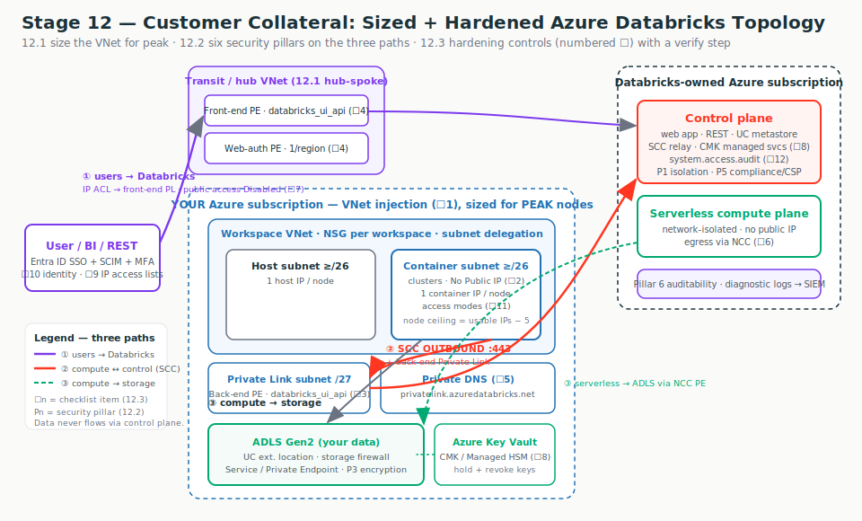
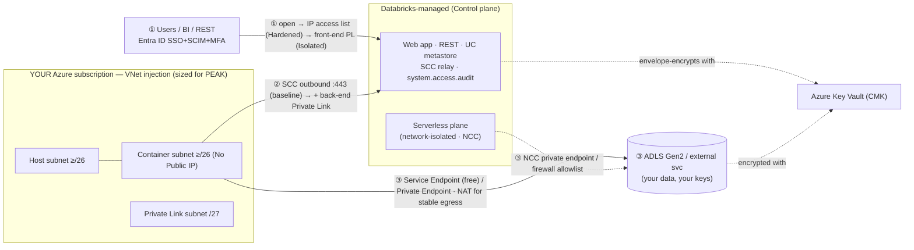
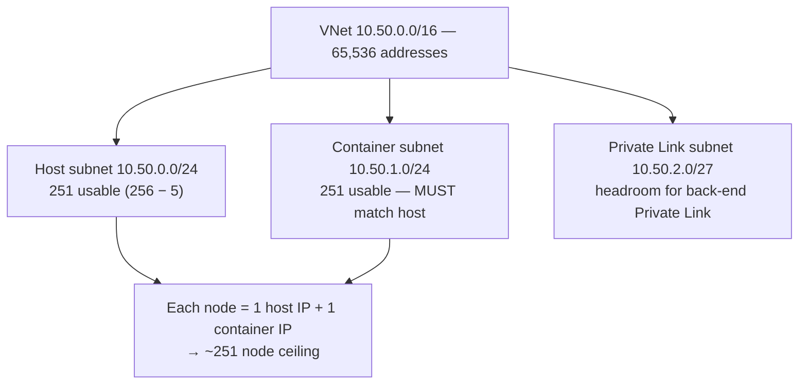
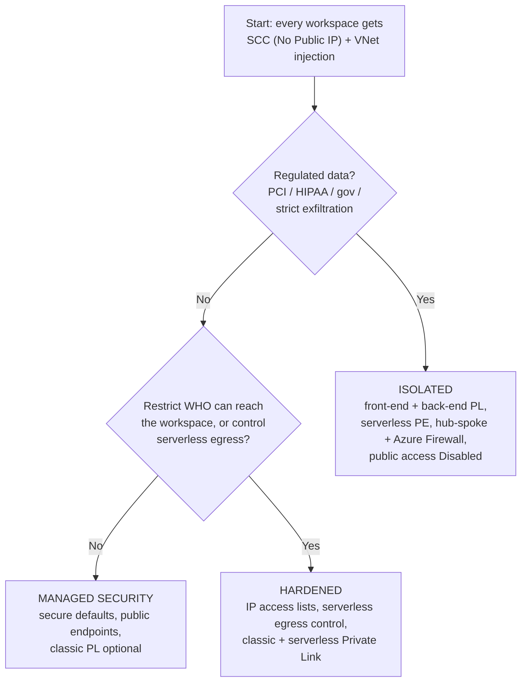
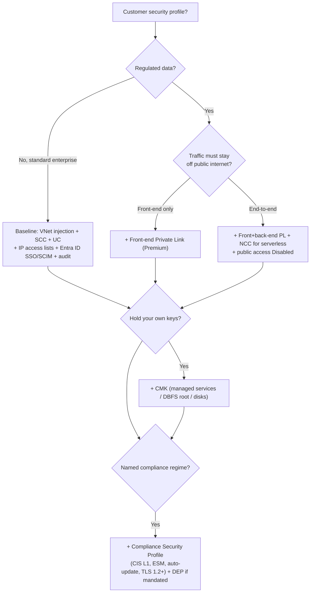
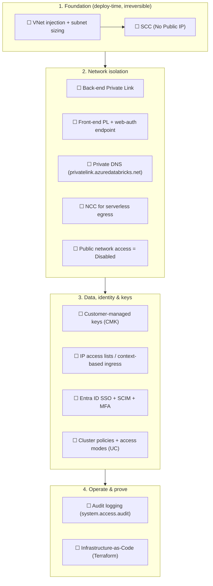

# Topic 12 — Customer-Facing Collateral (Azure-first)

> **Stage 12 · Customer-Facing Collateral** — the three artifacts an FDE/RSA
> actually puts on the table in front of a customer's cloud, network, and security
> teams. This is *not* new technical content; it is how you **assemble** Stages
> 1–11 into three reusable, defensible deliverables:
>
> - **12.1 Sizing & Architecture Decision Guide** — the CIDR/subnet worksheet (so
>   they never rebuild for IP exhaustion) + the topology decision tree (so they
>   pick the right reference architecture for their regulatory + cost profile).
> - **12.2 Customer Security & Networking Overview** — the "is it secure?"
>   briefing, organised as **six pillars**, grounded in named controls (no
>   marketing hand-waving).
> - **12.3 Deployment & Hardening Checklist** — the pre-go-live, **verify-don't-
>   assume** checklist with a *why / how / verify* per item.
>
> Azure-first. Illustrative config only in this lesson body; full apply-ready IaC
> is deferred to the hands-on artifact (see "Hands-on artifact decision" below).

---

## 🧠 Topic mental model

> **Hold this in your head:** *these three artifacts are the design, the pitch, and
> the sign-off for the same building.* **12.1 pours the foundation and counts the
> doors** (sizing you can't redo + how many locked doors the regulator demands).
> **12.2 is the guided tour you give the security team** (six pillars: this is what
> protects each room and why you can trust it). **12.3 is the building inspector's
> pre-occupancy checklist** (every switch in the known-good position *and the light
> that proves it's on*).

- **One picture:** a fixed-size plot of land (the VNet, footings you can't widen),
  wrapped in a progression of gates you bolt on only when needed (Managed →
  Hardened → Isolated), explained through six trust pillars, and signed off with a
  13-item pre-flight checklist where every item has a confirmation light.
- **Where it sits in the three-path scaffold (from M2.2):** Stage 12 is the
  *meta* layer — it does not add a new path, it **decides how hard to lock down all
  three at once** and proves it. Every sizing number, every pillar, every checklist
  item maps to **① users ↔ Databricks**, **② compute ↔ control plane**, or **③
  compute → storage/egress**. If you can name the path, the control, and whether
  it's default or opt-in, you can run the entire customer engagement.
- **The single sentence:** *"Secure by default, hardened by configuration, sized
  once for peak — and we prove every control is on, not just configured."*

---

## Terms used here (define-before-use)

This topic assembles controls taught deeply in earlier modules. Quick glosses so
the page reads top-to-bottom; the deep dive lives in the cross-referenced module.

| Term | 2–3 line gloss | Owning module |
| --- | --- | --- |
| **CIDR / subnet** | A block of IP addresses written `network/prefix` (`/24` = 256 addresses). A subnet is a slice of a VNet's address block; smaller prefix number = more addresses. | M0.1 / M0.2 |
| **VNet injection** | Deploying the classic compute plane into *your* Azure Virtual Network so you own the subnets, NSGs, routes, and DNS. The baseline for every classic architecture here. | M2.1 |
| **Subnet delegation** | Handing a subnet to the `Microsoft.Databricks/workspaces` service so Databricks auto-manages its NSG and places cluster NICs there. No other resource may use a delegated subnet. | M2.1–2.2 |
| **SCC / No Public IP (NPIP)** | Secure Cluster Connectivity: cluster VMs have no public IP and no open inbound ports; each cluster dials *outbound* to an SCC relay on **:443**. The baseline in all architectures. | M2.3 |
| **NSG (network security group)** | A stateful allow/deny firewall on a subnet/NIC; rules match by port, protocol, and **service tag** (a Microsoft-maintained named IP set, e.g. `AzureDatabricks`). | M0.3 / M2.4 |
| **UDR (user-defined route)** | A custom route overriding Azure's default routing — e.g. send all `0.0.0.0/0` egress to an Azure Firewall (the basis of data exfiltration protection). | M0.3 / M3.4 |
| **NAT gateway** | Azure-managed outbound translation giving clusters a **stable egress IP** for partner allowlists. | M0.3 / M2.4 |
| **Service Endpoint vs Private Endpoint** | Two ways for compute to reach ADLS: a Service Endpoint (free, Azure-backbone, subnet-scoped, egress-only) or a Private Endpoint (a real NIC + private IP, per-GB cost, needs DNS). | M2.5 / M3.1 |
| **Private DNS zone** | A private name→IP table (`privatelink.azuredatabricks.net`) that overrides the public answer so the workspace FQDN resolves to the Private Endpoint IP. | M0.4 / M3.2 |
| **Hub-spoke / transit VNet** | A central "hub" VNet carrying shared ingress/egress (user traffic, firewall, shared Private Endpoints) for one or more "spoke" workspace VNets. | M3.3 |
| **NCC (Network Connectivity Configuration)** | An account-level, *regional* object giving **serverless** compute stable egress IPs and private endpoints to your resources — the serverless answer to VNet injection. | M4a.2 |
| **CMK (Customer-Managed Keys)** | Encryption keys *you* hold in Azure Key Vault / Managed HSM (and can revoke), envelope-encrypting control-plane data, disks, and workspace storage. | M4b.4 |
| **Managed identity / access connector** | The Azure Databricks Access Connector (a managed identity) Unity Catalog uses to reach ADLS — storage access brokered by identity, not embedded keys. | M4b.3 |
| **SCIM** | The protocol Entra ID uses to push user/group create/update/delete into Databricks so leavers lose access automatically. | M4b.1 |
| **CSP (Compliance Security Profile)** | A workspace switch enabling a CIS-L1 hardened image, auto cluster updates, ESM monitoring agents, and enforced TLS 1.2+ — required for several regulated standards. | M4b.6 |
| **`system.access.audit`** | A Unity Catalog *system table* holding the immutable who-did-what audit log. *(Public Preview — verify before quoting GA.)* | M4b.6 |
| **IPAM** | The customer's IP Address Management team/tooling that owns the address plan — ask them for a non-overlapping CIDR block. | (customer org) |

---

## The topic in one diagram

The static picture below (`architecture.svg`, in this folder, embedded in
`index.html`) overlays all three artifacts on the three connectivity paths: the
**sized VNet** (12.1), the **six security pillars** mapped to hops (12.2), and the
**hardened topology with each checklist item bolted on** (12.3).





---

# 12.1 — Sizing & Architecture Decision Guide

## What it is (plain language)

- A **sizing worksheet** is a fill-in-the-blanks table: the customer tells you
  their peak node count, you hand back the VNet + subnet CIDRs to put in their
  Terraform/Portal. It bakes in the three Azure rules that trip everyone up:
  **5 reserved IPs per subnet**, **2 IPs per cluster node**, **subnet CIDR is
  immutable after deployment**.
- A **topology decision tree** is a small flow: answer a handful of yes/no
  questions about public exposure, exfiltration controls, and serverless, and it
  points at one of Databricks' three published **network reference architectures**
  — *Managed security*, *Hardened connectivity*, or *Isolated environment*.

**One-line analogy:** the worksheet is **pouring the foundation** — size it once
for the tallest building you'll ever raise, because you can't widen the footings
later. The tree is choosing **how many locked doors** stand between the street and
the vault — more doors cost more and slow you down, so add exactly as many as the
regulator requires.

**Why an FDE cares:** these are the two decisions a customer **cannot cheaply
undo**. Subnet CIDR can't be resized post-deploy, and moving from public-endpoint
to fully-private mid-flight means re-plumbing DNS, private endpoints, and
firewalls. Getting both right in the first workshop is the highest-leverage thing
an FDE does on a networking engagement.

## Why it breaks (cause → effect)

- **IP exhaustion is the #1 avoidable production incident.** Cause: a too-small
  container subnet sized for today's cluster. Effect: "cluster failed to start —
  insufficient IP addresses" the day autoscale grows; the only fixes are a
  Public-Preview *Update network configuration* or an account-team CIDR increase —
  neither instant, and a rebuild is worse.
- **Over-engineering burns money and weeks.** Cause: routing every byte through
  Azure Firewall + Private Endpoints when an IP access list was the requirement.
  Effect: NAT/PE/firewall hourly + per-GB cost plus weeks of DNS work for security
  the customer never needed.

## Traffic path (what the sizing shapes)

The worksheet shapes the VNet that **paths ② (compute ↔ control)** and **③
(compute → storage/egress)** live in — every cluster node draws **1 host IP + 1
container IP** from the two equally-sized subnets, so one subnet's usable count is
the node ceiling. The decision tree chooses how many controls to apply across all
three paths (① open → IP ACL → front-end PL; ② SCC → back-end PL; ③ SE/PE → NAT →
firewall).

### Part 1 — the three rules that drive every number

1. **VNet CIDR `/16`–`/24`.** Subnets **≥ `/26`** (Databricks-recommended floor;
   technical min `/28`, but don't go below `/26`). The two subnets must be the
   **same size**.
2. **Azure reserves 5 IPs per subnet** (`.0` network, `.1` gateway, `.2`/`.3`
   Azure DNS, last = broadcast). So **usable = total − 5**.
3. **2 IPs per cluster node** — one host, one container (the container IP runs the
   Databricks Runtime). Because the subnets are equal, **one subnet's usable count
   is the node ceiling.**

> ⚠️ **Subnet CIDR is immutable after the workspace deploys.** Size for *peak*.

### Subnet-size → max-nodes lookup

**Max nodes ≈ usable IPs in one subnet = `2^(32 − n) − 5`:**

| Subnet CIDR | Total IPs | Usable (− 5) | ≈ Max nodes (all clusters at once) | Good for |
| --- | --- | --- | --- | --- |
| `/26` | 64 | 59 | ~59 | Small/dev workspace |
| `/25` | 128 | 123 | ~123 | Small prod, light autoscale |
| `/24` | 256 | 251 | ~251 | Typical prod workspace |
| `/23` | 512 | 507 | ~507 | Busy prod, several autoscaling clusters |
| `/22` | 1,024 | 1,019 | ~1,019 | Large prod / many concurrent jobs |
| `/21` | 2,048 | 2,043 | ~2,043 | Very large data engineering |
| `/20` | 4,096 | 4,091 | ~4,091 | Exceptional; usually split into more workspaces |

### The fill-in worksheet (hand this to the customer)

| Step | Question | Answer | Rule / formula |
| --- | --- | --- | --- |
| 1 | Peak **concurrent** nodes across all clusters (sum of driver+workers at busiest moment)? | ___ | Biggest job + headroom |
| 2 | Add **~30% growth headroom** | ___ | `step1 × 1.3` |
| 3 | Add the **5 reserved IPs** | ___ | `step2 + 5` |
| 4 | Round **up** to a subnet that holds it | `/__` | smallest table row ≥ step 3 |
| 5 | Pick **both** subnets this size (host + container) | `/__` ×2 | subnets must match |
| 6 | Size the **VNet 2+ bits larger** than the subnets | `/__` | leaves room for a PL subnet |
| 7 | Carve a **`/27`–`/28` Private Link subnet** from headroom | `/__` | needed for back-end PL later |
| 8 | Confirm the block **doesn't overlap** on-prem / peered / hub VNets | y/n | get the block from IPAM |

**Worked example (peak ~180 nodes):** 180 → ×1.3 ≈ 234 → +5 = 239 → a `/24` gives
251 usable ≥ 239 → **`/24` subnets**; VNet a couple bits larger → **`/22`** (or
`/16` if IPAM is generous).



### ONE illustrative config (sizing — not exhaustive)

```hcl
# Goal: VNet + two equally-sized, delegated subnets for ~180 peak nodes (+ growth).
# These CIDRs are PERMANENT once the workspace deploys — size for peak, not today.
resource "azurerm_virtual_network" "adb" {
  name          = "adb-vnet"
  address_space = ["10.50.0.0/16"]            # /16: room for big subnets + a PL subnet
  # ...location / resource_group_name...
}
resource "azurerm_subnet" "host" {            # "public subnet" in the Portal
  name             = "adb-host"
  address_prefixes = ["10.50.0.0/24"]         # /24 = 251 usable → ~251 node ceiling
  delegation { name = "databricks-del"
    service_delegation { name = "Microsoft.Databricks/workspaces" } }  # required
}
resource "azurerm_subnet" "container" {       # "private subnet" — MUST equal host size
  name             = "adb-container"
  address_prefixes = ["10.50.1.0/24"]
  delegation { name = "databricks-del"
    service_delegation { name = "Microsoft.Databricks/workspaces" } }
}
# 10.50.2.0/27 left free for a back-end Private Link endpoint subnet (added later).
```

**Portal path:** Virtual networks → + Create → set address space (`10.50.0.0/16`)
→ + Add subnet ×2 (host + container, each `/24`, non-overlapping) → Create a
resource → Azure Databricks → **Networking → Deploy to your VNet = Yes** → select
VNet + both subnets. ⚠️ Subnet CIDR **cannot change after this** — confirm the
worksheet before **Create**.

> **2026 change to flag:** after **March 31, 2026** new Azure VNets default to *no*
> outbound internet. New workspaces need explicit egress — Databricks recommends
> an **Azure NAT gateway** on both subnets (also gives a stable egress IP).
> Existing workspaces are unaffected.

### Part 2 — the topology decision tree

Databricks publishes **three reference architectures** as a progression — start at
the baseline and layer controls on as requirements grow.

| Architecture | Goal | Layered in | Tier |
| --- | --- | --- | --- |
| **Managed security** | Secure defaults, public endpoints OK | SCC (NPIP), VNet injection, serverless stable IPs | classic PE optional |
| **Hardened connectivity** | Lock ingress/egress, keep auditability, *not* fully private | + IP access lists, + serverless egress control, + classic compute Private Link, + serverless Private Link | **Premium** for PL |
| **Isolated environment** | Everything private; regulated industries | + **inbound (front-end) Private Link**, + PL for performance-intensive services, + external firewall (hub-spoke + Azure Firewall), public access **Disabled** | **Premium** |

> SCC + VNet injection are in **all three** — the baseline, not an upgrade.



### Legacy-name mapping (so old decks don't confuse the customer)

| Current doc name | Older-deck labels |
| --- | --- |
| **Managed security** | "default / out-of-the-box", "Standard deployment" baseline |
| **Hardened connectivity** | "back-end Private Link", "Simplified deployment", "NPIP + IP access lists" |
| **Isolated environment** | "full DEP", "hub-spoke + Azure Firewall", "front+back-end PL, public access disabled" |
| **Classic compute plane Private Link** | "back-end Private Link" |
| **Inbound Private Link** | "front-end Private Link" |

### Back-end Private Link essentials (the most-asked topology detail)

- **Tier:** workspace must be **Premium**.
- **Sub-resources:** `databricks_ui_api` (back-end cluster→control + front-end
  user→UI/API) and `browser_authentication` (the SSO/web-auth callback — host on a
  dedicated browser-auth workspace in the transit VNet).
- **Private DNS:** `privatelink.azuredatabricks.net` linked to the workspace VNet
  (or forwarded in hub-spoke) so the URL resolves to the **private endpoint IP**.
- **Topology:** Microsoft-recommended **hub-spoke**; transit VNet carries
  user/on-prem traffic and the egress route.
- **Private-Link-only build:** set **Required NSG rules = NoAzureDatabricksRules**,
  keep SCC = Yes; for fully isolated, also set **public network access = Disabled**.

```bash
# Back-end (and front-end) Private Endpoint on the workspace VNet.
az network private-endpoint create \
  --name pe-databricks-ui-api --resource-group adb-rg \
  --vnet-name adb-vnet --subnet adb-privatelink \      # the /27 PE subnet
  --private-connection-resource-id "$WORKSPACE_RESOURCE_ID" \
  --group-id databricks_ui_api --connection-name conn-ui-api   # verified sub-resource
# Link the Private DNS zone so the workspace URL resolves to the PE private IP.
az network private-dns zone create -g adb-rg -n privatelink.azuredatabricks.net
```

## Comparison table — picking the architecture

| Dimension | Managed security | Hardened connectivity | Isolated environment |
| --- | --- | --- | --- |
| Public workspace endpoint | Yes (open / NSG-limited) | Restricted by **IP access lists** | **Disabled** (front-end PL only) |
| Cluster → control plane | SCC outbound (backbone) | + classic compute **Private Link** | classic Private Link |
| Serverless egress | stable IPs | + **egress control** + serverless PE | egress control + serverless PE |
| Exfiltration controls | minimal | egress control | + **external Azure Firewall** (hub-spoke) |
| Tier needed | Premium for any PL | **Premium** | **Premium** |
| Relative cost / effort | $ | $$ | $$$ (NAT + PE per-GB + firewall + DNS) |
| Typical customer | startup / internal analytics | enterprise needing auditability | FSI / healthcare / gov, regulated |

## Uses, edge cases & limitations (12.1)

- **Uses:** the worksheet for **every** VNet-injection workspace (tier-independent);
  the tree in the first design workshop to set the target and avoid under-/over-build.
- **Edge cases:**
  - **IP exhaustion mid-life** → "insufficient IP addresses"; fix = *Update network
    configuration* (Preview) or account-team CIDR increase — neither instant.
  - **Multiple workspaces, one VNet** → subnets **can't be shared**; each workspace
    needs its own host+container pair — size the VNet for the *sum*.
  - **Power BI / SaaS into an isolated workspace** → can't ride the transit VNet
    like corporate users; needs front-end PL + DNS or an approved public path with
    IP ACLs.
  - **Custom DNS in hub-spoke** → `privatelink.azuredatabricks.net` must be
    resolvable from the workspace VNet or clusters resolve the public IP and PL
    silently does nothing.
- **Limitations:** VNet `/16`–`/24`, subnets ≥ `/26`; CIDR **immutable**; subnets
  **non-shareable**; all PL variants + Isolated require **Premium**; some features
  (serverless PE, inbound PL for performance-intensive services) are region-/
  Preview-gated — verify per region.

## FDE field notes (12.1)

- **Common asks:** "How big, and can we change later?" → peak via worksheet; **no**,
  CIDR immutable. "Which architecture do *we* need?" → run the tree; don't sell
  Isolated to someone who only needs an IP access list. "What will Isolated cost?"
  → NAT + PE per-GB + firewall + DNS effort — quantify before they commit.
- **Talk-track:** "We size the network once for your five-year peak so you never
  rebuild for IP exhaustion, and we add exactly the locked doors your regulator
  requires — no more, because each costs money and DNS complexity."
- **What breaks + first check:**
  - *"Cluster failed to start — insufficient IPs"* → **first check container subnet
    free-IP count vs peak nodes minus the 5 reserved** — almost always subnet
    exhaustion, not quota.
  - *Isolated workspace, login spins / SSO fails* → **first check
    `privatelink.azuredatabricks.net` is linked and the `browser_authentication`
    A-record resolves to the PE IP**.
  - *Node math "off by 5"* → that's Azure's 5 reserved IPs, not a bug.
- **Decision rule:** default every workspace to **SCC + VNet injection**; choose
  **Managed** unless ingress/egress restriction (→ **Hardened**) or regulated/
  exfiltration (→ **Isolated**). PL/Isolated implies **Premium**. Size for peak +
  ~30%, equal subnets, VNet 2+ bits larger, `/27` PL subnet reserved.

---

# 12.2 — Customer Security & Networking Overview

## What it is (plain language)

The "**is Azure Databricks secure?**" briefing — the one-pager/talk-track an FDE
walks a CISO, security architect, or questionnaire reviewer through. It answers the
question with **specific, named, verifiable controls** (name the feature, name the
doc, name the trade-off). The spine is **six pillars**; everything hangs off them.

**One-line analogy:** a **secure managed office inside your own building** —
Databricks runs the front desk and booking system (control plane), the actual work
happens in *rooms you own* (your subscription / classic compute) or a sound-proofed
serviced suite (network-isolated serverless), the doors open *outward* (SCC), you
fit your own locks (CMK), keep a private hallway (Private Link), and read the
visitor log any time (`system.access.audit`).

**The one sentence to remember:** *"Secure by default, hardened by configuration."*
The baseline (isolation, SCC, TLS, Entra ID, Unity Catalog, audit) is on out of the
box on Premium; Private Link, CMK, and CSP are **opt-in controls you add only when a
named requirement justifies the cost.** Every claim must match the deployed config.

## The six pillars

| # | Pillar | One-line claim | Anchor control(s) |
| --- | --- | --- | --- |
| 1 | **Architecture & isolation** | Your data and compute stay in *your* subscription; the management plane is logically separate. | Control plane vs classic/serverless compute plane |
| 2 | **Network isolation** | No open inbound ports; traffic can be kept entirely off the public internet. | SCC (NPIP), Private Link, NCC |
| 3 | **Encryption** | Encrypted in transit and at rest; you can hold your own keys. | TLS 1.2+, platform-managed + CMK |
| 4 | **Identity & access** | One identity source, least-privilege, fine-grained data governance. | Entra ID SSO/SCIM, Unity Catalog |
| 5 | **Compliance** | Independently attested; a hardened mode for regulated data. | Compliance Security Profile, ESM |
| 6 | **Auditability** | Every action is logged and queryable. | `system.access.audit`, diagnostic logs |

## Why it breaks (cause → effect)

- **Overselling.** Cause: saying "fully isolated" when front-end + back-end PL and
  public access Disabled aren't actually deployed. Effect: the security team finds
  the gap in their own review and trust collapses — match the claim to the config.
- **"Everything is encrypted with your key."** Cause: not understanding CMK scopes.
  Effect: a false statement in a questionnaire — CMK covers managed services / DBFS
  root / managed disks, **not** serverless ephemeral disks. Be precise.
- **Serverless ≠ classic for compliance.** Cause: promising serverless under a
  regime classic supports. Effect: a blocked workload — check the per-standard
  *and* region table for serverless under CSP first.

## Pillars 1–6 (the briefing content)

### Pillar 1 — Architecture & plane separation

Control plane (Databricks-managed: web app, REST, scheduler, cluster manager, UC
metastore) vs **classic** compute (in *your* subscription/VNet; labelled "Hybrid
workspace" in the Portal) vs **serverless** compute (network-isolated boundary in
the Databricks account, same region, layered isolation between customers and
clusters). **Talk-track:** *"Separation of duties at the infrastructure level —
Databricks runs the brains, but the muscle that touches your data runs in your
subscription or an isolated serverless boundary, never co-mingled."*

### Pillar 2 — Network isolation (probed hardest)

- **SCC (No Public IP):** classic clusters launch with no public IP and no inbound
  ports; the cluster dials *outbound* to a relay. Answer to "can anyone reach our
  clusters from the internet?" → **No.**
- **Private Link (three types):** **inbound/front-end** (user→workspace,
  `databricks_ui_api` + `browser_authentication`), **classic/back-end**
  (compute→control, `databricks_ui_api`), **outbound/serverless** (serverless→your
  resources, NCC private endpoints). Front-end + back-end + **public access
  Disabled** = complete private isolation. **Web-auth nuance:**
  `browser_authentication` is **one per region per DNS zone** — deleting its host
  workspace breaks browser SSO for the whole region.
- **NCC:** account-level, regional; gives serverless private endpoints + stable
  egress subnet IDs for storage-firewall allowlisting. **Limits:** up to 10 NCCs/
  region, 100 PE/region, 50 workspaces/NCC.
- **IP access lists & DEP:** IP ACLs restrict to known CIDRs (cheap first layer);
  DEP = VNet injection + UDR forcing `0.0.0.0/0` through an Azure Firewall with an
  FQDN allowlist.

### Pillar 3 — Encryption

- **In transit:** TLS 1.2+ everywhere (enforced under CSP); optional worker-to-worker.
- **At rest:** platform-managed by default; **CMK** (Premium; Key Vault / Managed
  HSM) covers three scopes:

| CMK feature | Protects | Where data lives |
| --- | --- | --- |
| **Managed services** | Notebooks, SQL query history, secrets, PATs, dashboards | Control plane |
| **DBFS root / workspace storage** | Job results, SQL results, MLflow models, revisions | Workspace storage (your sub) |
| **Managed disks** | Cluster VM local/temp disks (classic only) | Your sub |

Managed-disk CMK does **not** apply to serverless (ephemeral disks).

### Pillar 4 — Identity & access

Entra ID SSO (+ Conditional Access / MFA), SCIM provisioning + identity federation,
service principals/OAuth (prefer over PATs), and **Unity Catalog**
(`catalog.schema.object`, fine-grained grants, row filters, column masks, ABAC in
Preview; storage credentials + external locations backed by a managed identity —
no embedded keys; lineage + unified audit).

### Pillar 5 — Compliance

Standing attestations (SOC 2 Type II, ISO 27001/27017/27018, etc. — point to the
Trust Center for the current list). **CSP** applies a CIS-L1 hardened image, auto
cluster updates, **ESM** monitoring agents, and enforced TLS 1.2+. CSP is
**required** for C5, K-FSI, PCI-DSS, UK Cyber Essentials Plus, CCCS Medium, TISAX,
ISMAP; **HIPAA, HITRUST, IRAP require CSP from September 1, 2026** (verify). Billed
as the Enhanced Security & Compliance add-on; constrains Preview features. Serverless
supports a **narrower** set of standards/regions than classic under CSP.

### Pillar 6 — Auditability

`system.access.audit` (UC system table, Public Preview) records who/what/when/where
(`user_identity`, `action_name`, `service_name`, `source_ip_address`, `response`,
`event_time`; account-level events show `workspace_id = 0`). Queryable in SQL →
dashboards, alerts, SIEM export. Diagnostic logs also deliver to Azure Monitor /
storage.

### ONE illustrative config (12.2 — the live "prove the audit trail" query)

```sql
-- "Show every failed action in the last 7 days, newest first" — the query an FDE
-- runs live in a security review to prove the audit surface is real.
SELECT event_time, user_identity.email AS who, service_name, action_name,
       source_ip_address, response.status_code
FROM system.access.audit
WHERE event_date >= current_date() - INTERVAL 7 DAYS
  AND response.status_code >= 400          -- 4xx/5xx = denied or errored
ORDER BY event_time DESC
LIMIT 100;
```



## Comparison — default vs opt-in (12.2)

| Control | Default (Premium) | Opt-in / add-on | Question it answers |
| --- | --- | --- | --- |
| Plane separation, isolation | ✅ Always | — | "Where does my data run?" |
| SCC / No Public IP | ✅ Default (classic) | — | "Are clusters exposed inbound?" |
| Encryption in transit (TLS 1.2+) | ✅ Always | worker-to-worker opt-in | "Is traffic encrypted?" |
| Encryption at rest | ✅ Platform-managed | **CMK** (Key Vault / HSM) | "Can we hold the keys?" |
| Entra ID SSO / SCIM | ✅ | Conditional Access | "One identity? MFA?" |
| Unity Catalog governance | ✅ | ABAC (Preview), masks/filters | "Row/column control?" |
| Front-end / back-end Private Link | — | ✅ Premium | "Off the internet?" |
| NCC (serverless private/egress) | — | ✅ | "Trust serverless egress?" |
| Compliance Security Profile / ESM | — | ✅ Add-on | "PCI/HIPAA-ready?" |
| Audit (`system.access.audit`) | ✅ (Preview) | SIEM export | "Who did what?" |

## Uses, edge cases & limitations (12.2)

- **Uses:** customer security review, questionnaire response, architecture-approval
  conversation that unblocks deployment.
- **Edge cases:** serverless ≠ classic for compliance/region; `browser_authentication`
  regional + singular; CMK scope gaps (not serverless disks); audit table is Preview;
  compliance is **shared responsibility** (free-text fields can leave the boundary).
- **Limitations:** Private Link, CMK, CSP all need **Premium** (CSP a paid add-on);
  PL/CMK add cost + complexity; some Preview features disallowed under CSP; GA-vs-
  Preview and region coverage **drift** — verify before committing in writing.

## FDE field notes (12.2)

- **Common asks:** "Is my data co-mingled?" → classic in your sub, serverless
  network-isolated. "Does data touch the public internet?" → with SCC + front+back-
  end PL + public access Disabled + NCC, **no public path**. "Can we hold/revoke
  keys?" → CMK. "PCI/HIPAA?" → CSP + the right standard; shared responsibility.
  "Prove the audit trail." → run the live query.
- **Talk-track:** *"Secure by default, hardened by configuration — each control
  maps to a specific feature and a specific doc, not a marketing claim."*
- **What breaks + first check:** "overview ≠ what we deployed" → **first check tier
  + which add-ons (PL/CMK/CSP) are actually enabled**. "serverless not allowed for
  our regime" → **first check the per-standard region table**. Browser SSO fails
  region-wide → **first check whether the `browser_authentication` host workspace
  was deleted**.
- **Decision rule:** lead with the **six pillars + the diagram**; baseline is
  usually enough for standard enterprise; reach for PL + CMK + CSP only when a
  **named** regulatory/residency requirement justifies it. Frame compliance as
  shared responsibility and cite the doc.

---

# 12.3 — Deployment & Hardening Checklist

## What it is (plain language)

A single **ordered list** of the network and security controls a production
workspace should have **before it goes live** — and a way to **verify** each one
rather than assume it. It's the **pre-flight checklist** a pilot runs before
takeoff: every switch in a known-good position, each confirmed *out loud*, nothing
left to "I think we turned that on."

**One-line analogy:** the building inspector's sign-off sheet — locks fitted (SCC),
property fenced into your own land (VNet injection), private driveways (Private
Link), a guest list at the gate (IP access lists), the safe re-keyed to your key
(CMK), and CCTV recording (audit logs).

**Why an FDE cares:** customers ask "is it secure and ready?" The honest answer is
"only if these items are checked **and verified**." The default managed deployment
is *functional* but not *hardened* — hardening is opt-in.

## Why it breaks (cause → effect)

- **"Configured" ≠ "effective."** Cause: an NSG rule overwritten, a Private DNS
  zone not linked, an audit schema never enabled. Effect: a control that *looks*
  done but silently isn't — half of field incidents. The **verify** column is the
  defence.
- **IP ACL lockout.** Cause: forgetting the compute stable-egress IP in the ALLOW
  list. Effect: *clusters* (not just users) fail to launch — the classic
  self-inflicted outage.
- **DNS the #1 Private Link failure.** Cause: a custom/on-prem forwarder that
  doesn't conditionally forward `privatelink.azuredatabricks.net`. Effect: clusters
  resolve public IPs and the PE appears "broken." Always test resolution first.

## Traffic path — the checklist *is* the three paths, locked

The 13 items are the three-path scaffold with a control bolted onto each hop:
**path ① users→Databricks** (front-end PL + web-auth, IP ACLs, Entra ID — items
4, 9, 10), **path ② compute↔control** (SCC + back-end PL + Private DNS — items 2,
3, 5), **path ③ compute→storage** (ADLS firewall + PE/SE, serverless via NCC —
item 6). Foundation + cross-cutting: VNet injection (1) holds ② and ③; public
access Disabled (7) seals public hops; CMK (8), audit (12), IaC (13) wrap it.



## The 13 items (why · how · verify)

| # | Item | Why (risk closed) | Verify (the proof) |
| --- | --- | --- | --- |
| 1 | **VNet injection + subnet sizing** | Control NSGs/UDRs/egress/DNS; foundation for back-end PL. CIDR immutable. | Subnets show NSG + delegation to `Microsoft.Databricks/workspaces`; cluster IPs in container range. |
| 2 | **SCC / No Public IP** | No inbound attack surface; cluster dials out :443. Prereq for back-end PL. | Cluster VM NICs have no public IP; JSON `enableNoPublicIp = true`. |
| 3 | **Back-end Private Link** | Removes last public hop for classic. Premium + VNet injection + SCC. | PE `databricks_ui_api` Approved; `nslookup` host → private IP; NSG `NoAzureDatabricksRules`. |
| 4 | **Front-end PL + web-auth** | Users reach workspace privately; `browser_authentication` makes browser SSO work. **1 web-auth/region.** | URL → transit-VNet PE IP; SSO completes; both PEs Approved. |
| 5 | **Private DNS** | A PE is useless if DNS returns the public IP. | `nslookup` from VNet → private IP; custom DNS forwards zone to `168.63.129.16`. |
| 6 | **NCC for serverless** | VNet injection/back-end PL don't apply to serverless; NCC gives stable egress + PE. | Account Console NCC binding + PE rules Established; serverless query of firewalled ADLS succeeds. |
| 7 | **Public access = Disabled** | Rejects all public connections (complete isolation). Needs front+back-end PL. | Outside corp net: URL unreachable; JSON `publicNetworkAccess = Disabled`. |
| 8 | **Customer-managed keys (CMK)** | You hold/revoke keys for managed services / disks / DBFS root. Premium. | Encryption blade shows Key Vault key URI; Key Vault logs show unwrap calls. |
| 9 | **IP access lists** | Restrict front-end to known IPs. Premium; IPv4 only. | `enableIpAccessLists = true`; off-list blocked; **compute egress IP in ALLOW list**. |
| 10 | **Entra ID SSO + SCIM + MFA** | Central identity; leavers auto-deprovisioned; MFA enforced. | Test user syncs/de-syncs; login forces MFA; audit shows `oidcLogin`. |
| 11 | **Cluster policies + access modes** | Constrain config; force UC-capable Standard/Dedicated; forbid legacy No Isolation Shared. | Non-admins only get policy-matching clusters; legacy mode rejected. |
| 12 | **Audit logging** | Immutable who-did-what. *(Preview.)* | `SELECT count(*) ... WHERE event_date = current_date()` returns rows; `system.access` schema enabled. |
| 13 | **IaC (Terraform)** | Reproducible, drift-detectable, DR-stampable. | `terraform plan` shows **no diff** (no drift); CI runs plan on PRs. |

### ONE illustrative config (12.3 — the SCC + VNet-injection workspace)

```hcl
# The workspace flag set that defines the secure boundary. Full hardened module
# (PEs, Private DNS, NCC, IP ACLs, cluster policies) is the hands-on artifact.
resource "azurerm_databricks_workspace" "this" {
  name                = "adb-prod"
  sku                 = "premium"            # Premium → PL, CMK, IP ACLs, CSP
  custom_parameters {
    no_public_ip                = true        # SCC / NPIP (item 2)
    virtual_network_id          = azurerm_virtual_network.adb.id   # VNet injection (item 1)
    public_subnet_name          = azurerm_subnet.host.name
    private_subnet_name         = azurerm_subnet.container.name
    # ...NSG association IDs...
  }
  public_network_access_enabled = false       # item 7 (with front+back-end PL in place)
}
```

```json
// Cluster policy (item 11): pin a UC-capable access mode; forbid No Isolation Shared.
{
  "data_security_mode": { "type": "fixed", "value": "USER_ISOLATION" },
  "autotermination_minutes": { "type": "fixed", "value": 30 }
}
```

**Portal/CLI quick paths:** VNet injection → Create → Azure Databricks →
**Networking → Deploy in your own VNet = Yes**. IP ACLs →
`databricks workspace-conf set-status --json '{"enableIpAccessLists":"true"}'`.
NCC → Account Console → Cloud resources → Network Connectivity Configurations.

## Comparison table — default vs hardened baseline (12.3)

| Control | Default (managed) | Hardened production baseline | Tier |
| --- | --- | --- | --- |
| Compute placement | Databricks-managed VNet | **VNet injection** | Any |
| Inbound to clusters | SCC / No Public IP | SCC + **back-end Private Link** | PL: Premium |
| User access path | Public URL | **Front-end PL** + web-auth, public access **Disabled** | Premium |
| Serverless egress | Default | **NCC** stable egress / PE | — |
| Encryption | Microsoft-managed | **CMK** | Premium |
| Front-end IP filtering | Open | **IP access lists** | Premium |
| Identity | Local + Entra ID | **Entra ID SSO + SCIM + MFA** | Any (federation) |
| Compute config | User-chosen | **Cluster policies**, UC access modes | Any |
| Auditing | Diagnostic logs | **`system.access.audit`** + alerting | Any (UC) |
| Reproducibility | Manual | **Terraform IaC**, no drift | Any |

## Uses, edge cases & limitations (12.3)

- **Uses:** go-live sign-off; security-team review; pre-prod gate; DR stamping;
  quarterly re-attestation (re-run the verify column).
- **Edge cases:** IP ACL lockout (forgot egress IP); single web-auth/region; custom
  DNS + PL; serverless needs NCC (not VNet injection); CMK not on serverless disks;
  GA-vs-Preview (`system.access.audit`, *Update network configuration*, some inbound
  PL) — confirm per region.
- **Limitations:** PL/CMK/IP ACLs/CSP need **Premium**; IP ACLs **IPv4 only**;
  subnet CIDR **immutable**; NCC quotas (10/region, 100 PE/region, 50 ws/NCC).

## FDE field notes (12.3)

- **Common asks:** "Give us a one-page checklist to sign off." → this. "How do we
  *prove* each control?" → the verify column. "Which items are irreversible?" →
  subnet CIDR + VNet-injection choice.
- **Talk-track:** "Secure-by-default gets you TLS, No-Public-IP, managed
  encryption. This checklist is the *opt-in hardening* — network isolation, your
  keys, your IdP, the audit trail — delivered as Terraform so it's reproducible and
  drift-detectable."
- **What breaks + first check:** clusters won't launch after IP ACLs → **first
  check the egress IP is in ALLOW** (not quota). URL unreachable / SSO fails after
  PL → **first check DNS resolution** + the single regional `browser_authentication`
  endpoint. Serverless can't reach firewalled ADLS → **first check the NCC binding +
  PE rule** (not classic NSG/UDR). "Audit table empty" → **first check the
  `system.access` schema is enabled** (not on by default).
- **Decision rule:** every prod workspace gets items 1, 2, 10, 11, 12, 13
  regardless of tier; add PL (3–5, 7), CMK (8), IP ACLs (9), NCC (6) for
  **regulated** customers or any "no public internet" mandate — these need
  **Premium** and add per-endpoint/per-GB cost, so tie them to the requirement.
  Dev/sandbox: items 1–2 + 10–13 are usually enough.

---

## Common mistakes / gotchas (whole topic)

- **Sizing for today, not peak** — subnet CIDR is immutable; rebuild is the only redo.
- **Forgetting the 5 reserved IPs** — a `/26` is 59 usable, not 64.
- **Unequal host/container subnets** — the smaller is the hidden node ceiling.
- **Maxing the VNet** so there's no room for the `/27` Private Link subnet.
- **Overlapping CIDR** with on-prem/peered/hub VNets — silently blackholes routing.
- **Over-building the topology** — selling Isolated when an IP access list was the ask.
- **Overselling security** — don't say "fully isolated" unless front+back-end PL +
  public access Disabled are deployed; match the claim to the config.
- **"Everything encrypted with your key"** — CMK has defined scopes; not serverless disks.
- **Treating serverless = classic** for compliance/network controls — they differ.
- **"Configured" ≠ "effective"** — run the verify step.
- **Forgetting the compute egress IP** in the IP access list → cluster launch failures.
- **One web-auth endpoint per region** — deleting its host breaks regional SSO.
- **Isolated/PL without a DNS plan** — unlinked zone = clusters resolve public IPs.
- **Quoting Preview as GA / legacy names** ("Standard/Simplified/DEP") to a customer
  on current docs — use Managed / Hardened / Isolated; flag Preview status.

---

## Decision guide (whole topic)

| If the customer… | Recommend |
| --- | --- |
| Is a startup / internal analytics, no regulatory driver | **Managed security**; baseline pillars; size for peak; dev checklist items 1–2 + 10–13 |
| Needs to restrict *who* connects / control serverless egress | **Hardened**: IP ACLs + serverless egress control + classic & serverless PL; add CMK if "hold our keys" |
| Is regulated (FSI / healthcare / gov) or has a "no public internet" / exfiltration mandate | **Isolated**: front+back-end PL + NCC + public access Disabled + Azure Firewall; CSP for the regime; full checklist; **Premium** |
| Asks "prove it's secure" | The **six-pillar overview** + a live `system.access.audit` query |
| Asks "is it ready for go-live?" | The **13-item checklist** with the verify column run, delivered as **Terraform** |

**Rule of thumb:** *start at the baseline, step up only when a named requirement
justifies the cost — and prove every control is on, not just configured.*

## Hands-on artifact decision

**No separate IaC file is created for this module.** Stage 12 is *customer-facing
collateral* — the value is the worksheet, the briefing, the checklist, and the
*illustrative* snippets above. The full apply-ready Terraform for these controls
(VNet injection, subnets/NSG, back-/front-end Private Link, Private DNS, NCC, CMK,
IP access lists, cluster policies) already lives in the hands-on artifacts of the
modules that own each control (M2.x VNet injection/SCC, M3.x Private Link/DNS,
M4a NCC, M4b CMK/identity). Duplicating it here would drift. This lesson points to
those modules instead and keeps the collateral assembly-focused.

---

## References

- [Deploy Azure Databricks in your Azure VNet (VNet injection)](https://learn.microsoft.com/azure/databricks/security/network/classic/vnet-inject) — VNet `/16`–`/24`, subnets ≥ `/26` (min `/28`), 5 reserved IPs, 2 IPs/node, immutable CIDR, subnet delegation, NSG rules, NAT after 2026-03-31.
- [Network reference architecture overview](https://learn.microsoft.com/azure/databricks/security/network/deployment-architecture/) — Managed security / Hardened connectivity / Isolated environment + feature matrix.
- [Configure classic compute plane Private Link](https://learn.microsoft.com/azure/databricks/security/network/classic/private-link-standard) — Premium, `databricks_ui_api` / `browser_authentication`, `privatelink.azuredatabricks.net`, hub-spoke, NoAzureDatabricksRules.
- [Azure Private Link concepts](https://learn.microsoft.com/azure/databricks/security/network/concepts/private-link) — front/back-end/serverless, NCC limits, public access Disabled, ports 443/6666/3306/8443–8451.
- [Security and compliance — Azure Databricks](https://learn.microsoft.com/azure/databricks/security/) — pillar landing page.
- [High-level architecture (control plane, classic & serverless)](https://learn.microsoft.com/azure/databricks/getting-started/high-level-architecture).
- [Secure cluster connectivity (No Public IP)](https://learn.microsoft.com/azure/databricks/security/network/classic/secure-cluster-connectivity).
- [What is serverless egress control? / network policies](https://learn.microsoft.com/azure/databricks/security/network/serverless-network-security/network-policies).
- [Customer-managed keys for encryption](https://learn.microsoft.com/azure/databricks/security/keys/customer-managed-keys) — managed services / DBFS root / managed disks, Key Vault & Managed HSM, Premium.
- [Compliance security profile](https://learn.microsoft.com/azure/databricks/security/privacy/security-profile) — CIS L1, ESM, TLS 1.2+; PCI-DSS, HIPAA, C5, K-FSI, TISAX, ISMAP.
- [Enhanced security monitoring](https://learn.microsoft.com/azure/databricks/security/privacy/enhanced-security-monitoring).
- [Configure IP access lists for workspaces](https://learn.microsoft.com/azure/databricks/security/network/front-end/ip-access-list-workspace) — Premium, IPv4, ALLOW/BLOCK, egress-IP requirement, context-based ingress.
- [Audit log system table reference (`system.access.audit`)](https://learn.microsoft.com/azure/databricks/admin/system-tables/audit-logs) — Public Preview.
- [Unity Catalog overview](https://learn.microsoft.com/azure/databricks/data-governance/unity-catalog/).
- [Azure NAT Gateway overview](https://learn.microsoft.com/azure/virtual-network/nat-gateway/nat-overview) — stable egress IP.
- [Databricks Security & Trust Center](https://www.databricks.com/trust) — current certifications.
- Terraform: [azurerm_databricks_workspace](https://registry.terraform.io/providers/hashicorp/azurerm/latest/docs/resources/databricks_workspace) · [databricks_mws_network_connectivity_config](https://registry.terraform.io/providers/databricks/databricks/latest/docs/resources/mws_network_connectivity_config).

> Verified against Azure Databricks docs as of 2026-06-26 (VNet injection updated
> 2026-06-25; Private Link concepts 2026-05-06; IP access lists 2026-05-04; CMK
> 2026-06-23; audit-log system table 2026-04-22; reference architectures 2026-05/06).
> CIDR limits, the Managed/Hardened/Isolated names, Private Link sub-resource names,
> NCC quotas, CSP standard/region coverage, the HIPAA/HITRUST/IRAP CSP-required date
> (Sep 1 2026), the March 31 2026 outbound change, and GA-vs-Preview status
> (`system.access.audit`, ABAC, *Update network configuration*) are version-/region-
> sensitive — reconfirm in the docs before quoting to a customer.
