# DBX Delta Optimization — Learning Plan

A nine-lesson path through how Databricks physically stores, skips, compacts, and
maintains Delta data. Built from the official **Azure Databricks documentation**
(verified June 2026). Each lesson is a self-contained interactive HTML page + a
markdown companion + a runnable Databricks notebook.

> **The one-line goal:** finish able to *design* a table's layout and maintenance,
> *defend* the design in an interview, and *debug* it in production.

## How to use this plan

- Go in order — each lesson builds on the last (it's one continuous story).
- For each lesson: read the markdown or open the interactive page, play with the
  diagrams, then run the notebook on a small cluster and watch the numbers move
  (`DESCRIBE DETAIL` file counts, `DESCRIBE HISTORY` metrics).
- After each lesson, answer its self-check questions below without looking.

## The story arc

> A **write** makes files → **layout** (partitioning / clustering) decides what
> queries can skip → **data skipping** is the payoff → **compaction & auto file
> sizing** keep files right-sized → **liquid clustering** is the modern layout →
> **deletion vectors** make edits cheap → **time travel & VACUUM** manage the file
> history those edits leave behind → **predictive optimization** does it all for you.

```mermaid
flowchart LR
  A[01 Traditional write<br/>small files] --> B[02 Partitioning]
  B --> C[03 Data skipping & Z-order]
  C --> D[04 OPTIMIZE / compaction]
  D --> E[05 Optimized writes]
  E --> F[06 Auto compaction]
  F --> G[07 Auto optimize & autotuning]
  G --> H[08 Liquid clustering]
  H --> I[09 Deletion vectors]
  I --> J[10 VACUUM & time travel]
  J --> K[11 Predictive optimization]
```

## Lessons, timings & self-check

| # | Lesson | Focus | Est. time | Self-check question |
| --- | --- | --- | --- | --- |
| 01 | Traditional writes & the small-file problem | Why naive writes make many tiny files | 25 min | Why does a Spark write produce many small files, and why is that slow to read? |
| 02 | Partitioning (and when NOT to) | The classic layout tool and its traps | 35 min | When should you partition, and why is partitioning on `customer_id` a bad idea? |
| 03 | Data skipping & Z-ordering | The stats that let queries skip files | 40 min | What stats does Delta keep per file, and how does `ZORDER BY` help data skipping? |
| 04 | OPTIMIZE / compaction (bin-packing) | The manual fix for small files | 30 min | What does `OPTIMIZE` do, why is it idempotent, and when do you need `OPTIMIZE FULL`? |
| 05 | Optimized writes | Right-sizing files *as you write* | 30 min | How do optimized writes work, and which operations enable them automatically? |
| 06 | Auto compaction | Compacting small files *after* a write | 30 min | How is auto compaction different from optimized writes and from predictive optimization? |
| 07 | Auto optimize & file-size autotuning | The umbrella + how file size is chosen | 35 min | What's the autotuned target file size for a 5 TB table, and what doesn't auto optimize replace? |
| 08 | Liquid clustering | The modern replacement for partition + Z-order | 45 min | Why can you change clustering keys with no rewrite, and why is it incompatible with partitioning/ZORDER? |
| 09 | Deletion vectors (merge-on-read) | Editing without rewriting whole files | 35 min | How do deletion vectors make DELETE/UPDATE/MERGE cheap, and how are the soft-deletes applied physically? |
| 10 | VACUUM, time travel & retention | Managing the file history operations leave behind | 40 min | Why does VACUUM limit time travel, and which two retention dials must you raise to time-travel further back? |
| 11 | Predictive optimization | Let the platform run maintenance | 35 min | What does predictive optimization run, on which tables, and how do you enable it? |

Total: roughly **6 hours** of focused study, plus notebook runtime.

## The decision framework to memorize

> **New table?** Use a Unity Catalog **managed** table, add **liquid clustering**
> on the columns you filter/join on most (≤ 4 keys), and enable **predictive
> optimization**. Done — the platform handles layout (`OPTIMIZE`), cleanup
> (`VACUUM`), and stats (`ANALYZE`).
>
> **Legacy / external table, or a special very-large case?** You may still need
> partitioning (low-cardinality keys, ≥ 1 GB partitions, tables ≥ 1 TB), Z-order,
> a scheduled `OPTIMIZE`, or an explicit `delta.targetFileSize`. Lessons 02–07
> teach exactly when.

## Key numbers worth memorizing (verified June 2026)

- **Don't partition** tables < 1 TB; aim for **≥ 1 GB** per partition.
- Data-skipping stats: first **32 columns** by default (UC external tables).
- **OPTIMIZE** target / autotuning: **256 MB** (< 2.56 TB) → linear → **1 GB** (> 10 TB).
- Optimized writes & auto compaction (`true`): **128 MB** target.
- Liquid clustering: **GA on DBR 15.4 LTS+**, up to **4 keys**, change keys with no rewrite.
- `OPTIMIZE FULL`: **DBR 16.0+**. Convert partitioned → liquid: **DBR 18.1+**.
- Deletion vectors: **merge-on-read** (no full-file rewrite); write DBR **14.3 LTS+**,
  read DBR **12.2 LTS+**; `delta.enableDeletionVectors`; apply physically via
  `OPTIMIZE` / `REORG … APPLY (PURGE)`.
- Retention dials: `delta.deletedFileRetentionDuration` = **7 days** (data files, VACUUM)
  and `delta.logRetentionDuration` = **30 days** (history). Time travel needs **both**.
- Predictive optimization: UC **managed** tables only; **on by default** for
  accounts created on/after **Nov 11 2024**; runs on **serverless**; auto-runs
  OPTIMIZE / VACUUM / ANALYZE.

## References (official Azure Databricks docs)

- Liquid clustering — https://learn.microsoft.com/en-us/azure/databricks/tables/clustering
- Data skipping & Z-order — https://learn.microsoft.com/en-us/azure/databricks/tables/data-skipping
- OPTIMIZE — https://learn.microsoft.com/en-us/azure/databricks/tables/operations/optimize
- Control file size — https://learn.microsoft.com/en-us/azure/databricks/tables/tune-file-size
- When to partition — https://learn.microsoft.com/en-us/azure/databricks/tables/partitions
- Deletion vectors — https://learn.microsoft.com/en-us/azure/databricks/tables/features/deletion-vectors
- VACUUM — https://learn.microsoft.com/en-us/azure/databricks/tables/operations/vacuum
- Table history & time travel — https://learn.microsoft.com/en-us/azure/databricks/tables/history
- Predictive optimization — https://learn.microsoft.com/en-us/azure/databricks/optimizations/predictive-optimization
