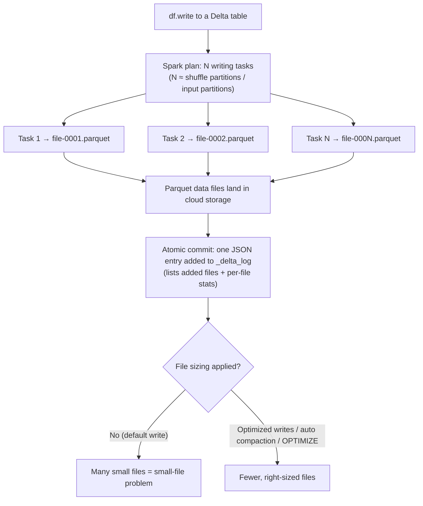

# Lesson 01 — Traditional Writes & the Small-File Problem

> **Track:** DBX Delta Optimization · **Lesson:** 01 (foundation) · **Previous:** none / track intro · **Next:** Lesson 02 — Partitioning
> **Verified against:** Azure Databricks docs, June 2026.

## What it is (plain language)

When Spark writes a DataFrame to a table, it doesn't write **one** neat file. Each
parallel task that is doing the writing produces **its own file**. If you have 200
tasks writing, you get roughly **200 files** — even if the data is tiny. Do that
again on the next micro-batch, and the next, and you end up with **thousands of
tiny files**. That pile of tiny files is the **small-file problem**, and it quietly
makes every future query slower and more expensive.

This lesson is the **foundation** of the whole track: every later technique
(OPTIMIZE, optimized writes, auto compaction, liquid clustering) exists to fix or
prevent the small-file problem. To know *why* those tools matter, you first need to
understand *how* a default write creates the mess.

- **One-line analogy:** Imagine 200 cashiers each bagging one item into its own
  shopping bag. You walk out with 200 bags instead of a few well-packed ones —
  carrying them (reading them later) is slow and clumsy.
- **Concrete use case:** A streaming job appends a small micro-batch every 10
  seconds. After a day that's ~8,600 commits, each writing several files. A
  dashboard query over that table now has to open tens of thousands of files just
  to answer one question.

---

## Why it matters — the cost of a tiny file

A query's cost is not just "how many bytes" — it's also "how many files". **Every
file carries fixed overhead that the engine pays no matter how small the file is:**

- **File open / object-store request** — each file is a separate cloud-storage
  `GET`. Listing and opening 50,000 files is dominated by request latency, not data
  size.
- **Footer read** — Parquet stores its schema + column metadata in a footer at the
  end of every file. The engine reads that footer per file before it can read data.
- **Min/max statistics parse** — Delta records per-file min/max/null/count stats in
  the transaction log; more files = more stats to load and evaluate.
- **Task scheduling** — Spark schedules roughly one task per file to read. 50,000
  files = 50,000 tasks to plan, ship, and collect, which floods the driver.
- **Metadata bloat** — every file is an entry in the Delta transaction log
  (`_delta_log`). Millions of tiny files make the log huge and slow to replay.

The healthy target is **fewer, larger files** (hundreds of MB each). The rest of
this track is about getting there automatically.

---

## The lifecycle of a Delta write (mermaid)



---

## How it works — deep dive, sub-topic by sub-topic

### 1. One file per writing task/partition

- **Mechanism:** A Spark write is a distributed job. The DataFrame is split into
  partitions; each partition is processed by one **task**, and each task writes
  **its own output file** to cloud storage. So the number of output files ≈ the
  number of partitions Spark has *at write time*.
- **Why:** Tasks run in parallel on different executors and cannot append to the
  same file safely, so each one owns a file. This is what makes writes fast and
  parallel — but it also means parallelism directly controls file count.
- **Trade-off:** More parallelism = faster write but **more, smaller files**. Less
  parallelism = fewer files but a slower, less-parallel write. Neither extreme is
  right; you want right-sized files *and* good parallelism — which is exactly what
  optimized writes later gives you for free.

```python
# PySpark — the number of DataFrame partitions decides the number of output files
df = spark.range(0, 1_000_000)
print(df.rdd.getNumPartitions())   # e.g. 8 -> a plain write makes ~8 files

# A plain write: ~one Parquet file per partition lands in the table's storage
df.write.mode("overwrite").saveAsTable("main.delta_opt_demo.events")
```

```sql
-- SQL: an INSERT is also a distributed write; file count tracks write parallelism.
-- Delta is the default format, so no `USING DELTA` is needed.
INSERT INTO main.delta_opt_demo.events
SELECT * FROM main.delta_opt_demo.staging_events;
```

### 2. `spark.sql.shuffle.partitions` and micro-batch appends multiply files

- **Mechanism:** Any operation that **shuffles** (join, groupBy, repartition,
  window) resets the partition count to `spark.sql.shuffle.partitions`
  (historically **200**). If a shuffle happens right before the write, the write
  inherits ~200 partitions → ~200 files **per write**.
- **Why it compounds:** Streaming or frequent batch jobs **append** on every
  micro-batch. 200 files × thousands of commits = a tiny-file avalanche. Nothing in
  a plain Delta write merges across commits.
- **Trade-off:** Lowering `shuffle.partitions` reduces files but can cause skew and
  spill on large shuffles; raising it helps big jobs but worsens the small-file
  problem on small outputs. It's a global knob fighting a per-write problem.

```python
# A shuffle (e.g. groupBy) repartitions the data to spark.sql.shuffle.partitions.
spark.conf.get("spark.sql.shuffle.partitions")   # historically "200"

agg = (df.groupBy((df.id % 5).alias("bucket")).count())   # forces a shuffle
# Without AQE/optimized writes this write would emit ~200 files for a tiny result.
agg.write.mode("overwrite").saveAsTable("main.delta_opt_demo.events_agg")
```

### 3. The old manual controls: `coalesce(n)` vs `repartition(n)`

These are the **legacy** knobs engineers used to reduce file count *before* a write.
You should understand them (interviewers ask), but on Databricks with optimized
writes enabled, **you should not use them before a write**.

- **`df.coalesce(n)` — NO shuffle.** Merges existing partitions down to `n` by
  combining neighbors on the same executor. Cheap (no data movement), but it can
  create **skewed, uneven** files and can **reduce upstream parallelism** of the
  whole stage (it pushes the lower partition count back up the plan).
- **`df.repartition(n)` — FULL shuffle.** Redistributes all rows evenly across `n`
  partitions → `n` evenly-sized files. Gives clean sizes but pays a **full network
  shuffle**, which is expensive.
- **Why both are brittle:** You have to **guess `n`** for every dataset and it
  drifts as data volume changes. Hardcode `repartition(1)` and a growing table
  eventually writes one giant file (or OOMs); hardcode a big `n` and you re-create
  the small-file problem. It's manual tuning that goes stale.

```python
# Naive (brittle) — guess a file count and force it before writing:
df.coalesce(1).write.mode("overwrite").saveAsTable("main.delta_opt_demo.events")   # one big file, kills parallelism
df.repartition(8).write.mode("overwrite").saveAsTable("main.delta_opt_demo.events") # full shuffle, must guess 8

# Right (Databricks): DON'T coalesce/repartition before a write when optimized
# writes is enabled — let the platform size files. (Covered in Lesson 05.)
spark.conf.set("spark.databricks.delta.optimizeWrite.enabled", True)
df.write.mode("overwrite").saveAsTable("main.delta_opt_demo.events")
```

> **Databricks guidance:** Do **not** run `coalesce(n)` / `repartition(n)` just
> before a write when optimized writes is enabled — it fights the engine's own
> file sizing.

### 4. AQE (Adaptive Query Execution) coalescing — a partial mitigation

- **Mechanism:** AQE (on by default) looks at the **actual** shuffle output sizes at
  runtime and **coalesces** many small post-shuffle partitions into fewer, larger
  ones before the next stage. So a job that would have produced 200 tiny partitions
  may collapse to, say, 12.
- **Why it helps:** It reduces — but does not eliminate — tiny files for the
  *current* write, with no manual tuning.
- **Trade-off / limit:** AQE tunes a **single query's** partitions; it does **not**
  merge files **across separate write commits**, and it isn't a table-layout
  solution. Frequent appends still accumulate small files over time. You still need
  optimized writes / auto compaction / OPTIMIZE for durable file sizing.

```python
# AQE is on by default; these are the relevant knobs (read, don't blindly change):
spark.conf.get("spark.sql.adaptive.enabled")                          # "true"
spark.conf.get("spark.sql.adaptive.coalescePartitions.enabled")       # "true"
```

### 5. What a Delta write actually does (Parquet + `_delta_log`)

- **Mechanism:** A Delta table = **Parquet data files** + a **transaction log**
  (`_delta_log`). A write (a) writes new Parquet files to storage, then (b) commits
  one **atomic JSON log entry** listing the files it added (with per-file size and
  min/max/null/count stats). Readers read the log to know the current set of files —
  not the directory listing.
- **Why it matters:** The commit is what makes the write **ACID/atomic** — readers
  never see half-written data. But a plain write performs **no file sizing**: it
  appends whatever files the tasks produced. Sizing only happens via optimized
  writes, auto compaction, or OPTIMIZE.
- **Trade-off:** You get reliability and time travel "for free", but the file
  layout is whatever your write parallelism happened to be — hence the small-file
  problem if you don't manage it.

```sql
-- The transaction log is the source of truth. Inspect what a write produced:
DESCRIBE DETAIL main.delta_opt_demo.events;   -- numFiles, sizeInBytes, format = delta
DESCRIBE HISTORY main.delta_opt_demo.events;  -- one row per commit: WRITE / MERGE / OPTIMIZE
```

### 6. `spark.sql.files.maxRecordsPerFile` — capping rows per file

- **Mechanism:** This Spark setting (and the equivalent `maxRecordsPerFile` writer
  option) caps how many **rows** go into a single output file. When a task would
  write more than the cap, it rolls over to a new file. `0` or a negative value =
  **no limit** (the default).
- **Why:** It's a guardrail against one task writing a single, enormous file (which
  hurts parallelism on read and can stress memory). It bounds the **upper** size.
- **Trade-off / limit:** It only sets a **ceiling on rows**, not a true target
  **file size** in bytes, and set too low it *creates* small files. It's a blunt
  instrument compared to optimized writes / OPTIMIZE, which target bytes.

```python
# Cap rows per file at 5,000,000 (a guardrail against one giant file).
# 0 or negative = no limit (the default).
spark.conf.set("spark.sql.files.maxRecordsPerFile", 5_000_000)

# Or as a per-write option (does not change the session-wide config):
df.write.option("maxRecordsPerFile", 5_000_000).mode("overwrite") \
  .saveAsTable("main.delta_opt_demo.events")
```

---

## What fixes this later (the road ahead)

This lesson defines the problem; the rest of the track is the cure:

- **Lesson 04 — OPTIMIZE (bin-packing):** the manual cleanup — merge many small
  files into fewer right-sized ones *after the fact*.
- **Lesson 05 — Optimized writes:** size files **as you write** (a shuffle before
  the write → fewer, larger files). On by default for MERGE/UPDATE/DELETE.
- **Lesson 06 — Auto compaction:** a small compaction job that runs **right after**
  a successful write to merge the just-written small files.
- **Lesson 08 — Liquid clustering:** the modern layout that keeps related data
  together *and* keeps files right-sized — replacing partitioning + Z-order.
- **Lesson 09 — Predictive optimization:** Databricks runs OPTIMIZE/VACUUM/ANALYZE
  for you on Unity Catalog managed tables, so you never hand-tune file counts again.

---

## Comparison table — the file-count controls

| Control | Shuffle? | What it does | Why it's brittle / its role | Verdict for new code |
| --- | --- | --- | --- | --- |
| `coalesce(n)` | No | Merges partitions to `n` (combine neighbors) | Must guess `n`; uneven files; cuts upstream parallelism | Avoid before writes |
| `repartition(n)` | Yes (full) | Even redistribution into `n` partitions | Must guess `n`; full-shuffle cost; goes stale | Avoid before writes |
| `spark.sql.shuffle.partitions` | n/a (sets shuffle width) | Default post-shuffle partition count (~200) | Global knob; large default → many tiny files | Leave to AQE |
| AQE coalesce | n/a (runtime) | Collapses small post-shuffle partitions per query | Per-query only; can't merge across commits | Keep on (default) |
| `maxRecordsPerFile` | No | Caps **rows** per file | Row cap, not a byte target; can create small files | Guardrail only |
| **Optimized writes** (L05) | Yes (managed) | Sizes files at write time | The recommended fix | **Prefer** |
| **OPTIMIZE / auto compaction** (L04/L06) | n/a | Compacts files after write | Cleans up what's already there | **Prefer** |

---

## Uses, edge cases & limitations

**Uses (when these manual controls still make sense)**
- One-off, **non-Databricks / OSS Spark** jobs where optimized writes isn't
  available — `repartition(n)` is the pragmatic way to control file count.
- Writing a **deliberately single-file** export (e.g. a small CSV/Parquet handoff)
  with `coalesce(1)` — acceptable for small data, never for large tables.

**Edge cases an interviewer probes**
- **Streaming sink with a tiny trigger interval:** each micro-batch commits files;
  thousands of micro-batches → file explosion. Fix with auto compaction / OPTIMIZE,
  not by lowering trigger frequency alone.
- **`repartition(1)` on a growing table:** works on day 1, then writes a multi-GB
  single file (or OOMs) as data grows — the classic stale-hardcode trap.
- **`coalesce` reducing upstream parallelism:** `coalesce(1)` before a wide
  transformation can serialize the *whole* stage, not just the write — surprising
  slowdowns.
- **AQE gives a false sense of safety:** it fixes one query's partitions but never
  compacts across commits, so small files still accumulate on append-heavy tables.
- **`maxRecordsPerFile` set too low:** turns a sizing guardrail into a small-file
  *generator*.

**Limitations**
- A plain Delta write does **no automatic file sizing** — Parquet files are
  appended exactly as the tasks produced them; only optimized writes / auto
  compaction / OPTIMIZE resize them.
- `coalesce`/`repartition` require a **hand-picked `n`** that doesn't adapt to data
  growth — they are guesswork by design.
- AQE coalescing operates **within a single query**, not across the table's history.
- Hive-style directory layout is **not** the source of truth for Delta; the
  `_delta_log` is — don't reason about a Delta table by listing directories.

---

## Common gotchas

- **Don't `coalesce`/`repartition` right before a write when optimized writes is
  enabled.** It fights the engine's own file sizing. (Databricks best practice.)
- **A shuffle resets your partition count** to `spark.sql.shuffle.partitions`. If
  your write makes ~200 files for a small result, a shuffle (join/groupBy) is why.
- **Tiny-file pain is about *count*, not bytes.** 100,000 × 50 KB files can be
  slower to query than a few hundred-MB files holding the same data.
- **Appends never self-merge.** Frequent small appends accumulate small files until
  you OPTIMIZE / auto-compact — Delta will not consolidate them on its own.
- **`maxRecordsPerFile` is a ceiling, not a target.** It can't *raise* file size; it
  only caps rows, so don't treat it as a file-sizing solution.
- **Read the log, not the folder.** Use `DESCRIBE DETAIL` / `DESCRIBE HISTORY` to
  see `numFiles` and what each commit did — not a storage directory listing.

---

## References

Official Azure Databricks documentation (verified June 2026):

- Control / tune file size (optimized writes, auto compaction, `maxRecordsPerFile`,
  target file size, autotuning):
  <https://learn.microsoft.com/en-us/azure/databricks/tables/tune-file-size>
- Best practices: Delta Lake (file sizing, when not to coalesce/repartition):
  <https://learn.microsoft.com/en-us/azure/databricks/delta/best-practices>
- OPTIMIZE (compaction / bin-packing) — the manual fix referenced ahead:
  <https://learn.microsoft.com/en-us/azure/databricks/tables/operations/optimize>
- When to partition tables (the next lesson's foundation):
  <https://learn.microsoft.com/en-us/azure/databricks/tables/partitions>
