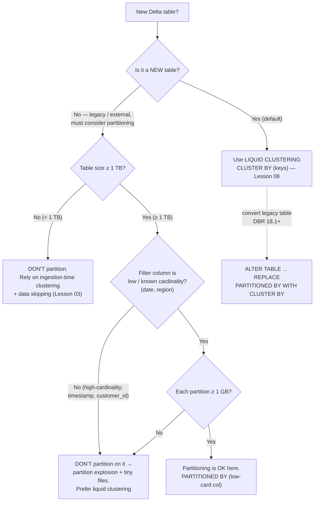

# Lesson 02 — Partitioning (and when NOT to)

> **Track:** DBX Delta Optimization · **Lesson:** 02 · **Previous:** Lesson 01 — Traditional writes & the small-file problem · **Next:** Lesson 03 — Data skipping & Z-ordering
> **Verified against:** Azure Databricks docs, June 2026.

## What it is (plain language)

**Partitioning** physically splits a table's files into separate folders by the
value of one or more columns. If you partition a table `PARTITIONED BY (event_date)`,
all the rows for `2026-06-01` live in their own directory, all the rows for
`2026-06-02` in another, and so on. When a query says `WHERE event_date = '2026-06-01'`,
the engine can jump straight to that one folder and ignore every other day — this is
called **partition pruning** (skipping whole folders the query can't match).

That sounds great, and for a long time it was *the* way to make big tables fast. But
partitioning is **rigid and easy to get wrong**: you choose the column at table
creation, changing it later means rewriting the whole table, and if you pick a column
with too many distinct values you shatter the table into millions of tiny files — the
exact small-file problem from Lesson 01, now baked into the directory layout.

So the modern guidance is blunt: **Databricks recommends liquid clustering (Lesson
08) for ALL new tables instead of partitioning.** Partitioning is still legal and
occasionally right, but it is now the *legacy* layout. This lesson teaches what it
is, the few cases where it still wins, and — most importantly — **when NOT to use it**.

- **One-line analogy:** Partitioning is like filing paper records in drawers labeled
  by year. Filing by *year* (a handful of drawers) is tidy. Filing by *customer ID*
  (millions of one-sheet drawers) is a nightmare to store and to search — you spend
  all day opening drawers. Pick a label with few, stable values.
- **Concrete use case:** A 5 TB clickstream table queried almost always with a
  `WHERE event_date BETWEEN ...` range, where `event_date` has ~365 values/year, is a
  textbook *good* partition column. A table keyed on `customer_id` (50,000+ values)
  is a textbook *bad* one — use liquid clustering there instead.

---

## Why it matters — the cost of getting the layout wrong

- **Right partition column → huge skipping win.** Low-cardinality, frequently-filtered
  columns (date, region) let the engine prune entire folders, reading a tiny fraction
  of the table.
- **Wrong partition column → permanent damage.** A high-cardinality column
  (timestamp, `customer_id`) creates a **partition explosion**: thousands or millions
  of partitions, each holding very little data → millions of tiny files → slow listing,
  slow scans, and metadata bloat. And because the choice is locked into the directory
  layout, fixing it means rewriting the table.
- **It's a one-time, hard-to-undo decision.** Unlike liquid clustering (where you can
  redefine keys anytime with no rewrite), changing a partition column requires a full
  table rewrite. The cost of a wrong guess is high.

The healthy rule of thumb: **partition only low/known-cardinality columns on very
large (≥ 1 TB) tables; otherwise prefer liquid clustering + data skipping.**

---

## The decision flow (mermaid)



---

## How it works — deep dive, sub-topic by sub-topic

### 1. Hive-style partitioning and the `PARTITIONED BY` syntax

- **Mechanism:** "Hive-style" partitioning writes data into nested directories named
  `col=value` (e.g. `.../event_date=2026-06-01/...`). You declare it once at table
  creation with `PARTITIONED BY (col)`. At query time, a predicate on the partition
  column lets the engine **prune** whole directories without reading their files.
- **Why:** Pruning a folder is the cheapest possible "skip" — the engine never even
  lists the files inside. For a low-cardinality, always-filtered column, that's a big
  win on a large table.
- **Trade-off:** The layout is fixed at creation; the partition column is duplicated
  into the directory path; and the wrong column produces the small-file problem by
  design. **Important:** Hive-style directory layout is **NOT part of the Delta
  protocol** — the `_delta_log` is the source of truth, so never reason about (or
  depend on) the physical directory structure.

```sql
-- Partition a large table by a LOW-cardinality, frequently-filtered column.
-- Delta is the default format, so no `USING DELTA` is needed.
CREATE TABLE main.delta_opt_demo.events (
  event_id   BIGINT,
  customer_id BIGINT,
  region     STRING,
  event_ts   TIMESTAMP,
  event_date DATE
)
PARTITIONED BY (event_date);   -- one folder per day; date has few, stable values

-- Partition pruning: this reads only the 2026-06-01 folder, skips all other days.
SELECT count(*) FROM main.delta_opt_demo.events
WHERE event_date = DATE'2026-06-01';
```

```python
# PySpark equivalent: partitionBy() at write time defines the partition columns.
(df.write
   .partitionBy("event_date")          # low-cardinality column
   .mode("overwrite")
   .saveAsTable("main.delta_opt_demo.events"))
```

### 2. The modern recommendation: liquid clustering replaces partitioning for ALL new tables

- **Mechanism:** Liquid clustering (`CLUSTER BY`) colocates related rows using
  clustering keys *without* baking the layout into directories. It gives the skipping
  benefit of partitioning **and** the colocation benefit of Z-order, but you can
  **redefine the keys anytime with no rewrite of existing data**.
- **Why:** It removes every sharp edge of partitioning — no upfront guessing, handles
  high-cardinality and skew, keeps files right-sized, and is incremental to maintain.
- **Trade-off / rule:** Liquid clustering is **not compatible** with partitioning or
  `ZORDER` — you use it *instead of* them, never alongside. For a brand-new table this
  is the default choice; partitioning is only for legacy/external scenarios.

```sql
-- The modern default for a NEW table: liquid clustering, NOT partitioning.
CREATE TABLE main.delta_opt_demo.events (
  event_id    BIGINT,
  customer_id BIGINT,
  region      STRING,
  event_date  DATE
)
CLUSTER BY (event_date, region);   -- redefine these keys later with NO rewrite
-- (Deep dive in Lesson 08. Do NOT combine CLUSTER BY with PARTITIONED BY/ZORDER.)
```

### 3. Don't partition tables < 1 TB

- **Mechanism:** Below ~1 TB the whole table is small enough that file listing +
  data skipping already make scans fast; partitioning just fragments the data into
  small partitions/files for no benefit.
- **Why:** Databricks explicitly says **most tables under 1 TB need no partitions**.
  Partitioning a small table usually *hurts* — you trade a fast full scan for slow
  many-tiny-file scans.
- **Trade-off:** If you partition a 50 GB table by date, each daily partition might be
  tens of MB split across several files — far below the healthy file size, so every
  query pays small-file overhead.

```sql
-- ANTI-PATTERN: partitioning a small (< 1 TB) table.
-- Don't do this — it fragments a small table into tiny partitions.
CREATE TABLE main.delta_opt_demo.small_orders (order_id BIGINT, order_date DATE)
PARTITIONED BY (order_date);   -- ❌ < 1 TB: no benefit, creates tiny files

-- DO THIS instead: leave it unpartitioned. Ingestion-time clustering + data
-- skipping handle it, and you can add liquid clustering if filters demand it.
CREATE TABLE main.delta_opt_demo.small_orders (order_id BIGINT, order_date DATE);
```

### 4. Minimum partition size ≥ 1 GB (fewer, larger partitions win)

- **Mechanism:** Aim for **at least 1 GB of data per partition**. Fewer, larger
  partitions consistently outperform many small ones, because each partition holds
  enough data to be read efficiently and produce right-sized files.
- **Why:** A partition is a folder of files; if a partition holds only a few MB, you
  re-create the small-file problem at the folder level — lots of folders, each with
  tiny files, all carrying fixed overhead.
- **Trade-off:** Coarser partitions skip *fewer* folders per query but each scan is
  efficient; over-fine partitions skip more folders but every scan is dominated by
  tiny-file overhead. The 1 GB floor is the practical balance.

```sql
-- Coarser partition grain keeps each partition ≥ 1 GB.
-- e.g. partition by MONTH instead of DAY if daily partitions are < 1 GB:
CREATE TABLE main.delta_opt_demo.events_monthly (
  event_id BIGINT, region STRING, event_month STRING  -- 'YYYY-MM'
)
PARTITIONED BY (event_month);   -- ~30x fewer, ~30x larger partitions than daily
```

### 5. Over-partitioning on high-cardinality columns → partition explosion → tiny files

- **Mechanism:** Partitioning by a high-cardinality column (e.g. `timestamp` down to
  the second, or `customer_id`) creates **one folder per distinct value**. A timestamp
  column can produce millions of folders; `customer_id` produces one folder per
  customer. Each folder holds very little data → millions of tiny files.
- **Why it's bad:** This is the worst form of the small-file problem — slow file
  listing, slow scans, exploded transaction-log metadata, and a layout that's
  expensive to undo.
- **Trade-off / rule:** Partition only **low / known-cardinality** fields (date,
  region). For high-cardinality filter columns, use **liquid clustering** — it's
  *built* for exactly those columns.

```sql
-- ANTI-PATTERN: high-cardinality partition column = partition explosion.
CREATE TABLE main.delta_opt_demo.bad (event_ts TIMESTAMP, customer_id BIGINT, v DOUBLE)
PARTITIONED BY (event_ts);    -- ❌ millions of 1-row folders → tiny files

-- RIGHT: cluster on the high-cardinality column instead (no folder explosion).
CREATE TABLE main.delta_opt_demo.good (event_ts TIMESTAMP, customer_id BIGINT, v DOUBLE)
CLUSTER BY (customer_id);     -- ✔ liquid clustering handles high cardinality
```

### 6. Partition columns must be top-level (no complex types / struct fields)

- **Mechanism:** A partition column must be a **top-level** column of the table. You
  **cannot** partition by a complex type (Struct / Map / Array / Variant) or by a
  field *inside* a struct (`struct_col.field`).
- **Why:** The directory naming scheme (`col=value`) needs a single scalar value per
  column; nested fields and complex types have no clean directory representation.
- **Trade-off / workaround:** If you need to colocate by a struct field, use **liquid
  clustering**, which *does* support struct fields via dot notation
  (`CLUSTER BY (struct_col.field)`).

```sql
-- ❌ Cannot partition by a struct field or a complex type:
-- PARTITIONED BY (payload.region)   -- not allowed
-- PARTITIONED BY (tags_array)       -- not allowed (complex type)

-- ✔ Liquid clustering supports struct fields via dot notation:
ALTER TABLE main.delta_opt_demo.events CLUSTER BY (payload.region);
```

### 7. Supported partition data types

- **Mechanism:** Partition columns must be a partition-friendly scalar type. Supported
  types are: **Date, Timestamp, TimestampNTZ, Interval, String, Binary, Boolean,
  Integer / Long / Short / Byte, Float / Double / Decimal.**
- **Why:** These types have a clean, stable string form for the `col=value` directory
  name.
- **Trade-off / caution:** Just because a type is *supported* doesn't mean it's a good
  *choice* — `Timestamp` is supported but is almost always a partition-explosion trap.
  Type support is necessary, not sufficient; cardinality is what matters.

### 8. Ingestion-time clustering (DBR 11.3 LTS+) — date-partition benefit, no tuning

- **Mechanism:** On DBR 11.3 LTS+, **unpartitioned** Delta tables are automatically
  clustered by **ingestion time** — rows written together (same time window) tend to
  land together on disk. This gives a **date-partition-like benefit** for time-range
  queries with **zero tuning**.
- **Why:** It's why "just don't partition a < 1 TB table" works in practice — you
  still get good skipping on recency filters because recent data is colocated.
- **Trade-off:** It clusters by *when data arrived*, not by an arbitrary key. If your
  ingestion order matches your query's time filter (very common), it's free
  performance; if you filter on something unrelated, add liquid clustering on that key.

```sql
-- No syntax needed: just DON'T partition, and let ingestion-time clustering work.
CREATE TABLE main.delta_opt_demo.events (event_id BIGINT, region STRING, event_ts TIMESTAMP);
-- Rows ingested together are colocated, so recency filters still skip well:
SELECT * FROM main.delta_opt_demo.events WHERE event_ts >= current_timestamp() - INTERVAL 1 DAY;
```

### 9. Z-order works only WITHIN a partition

- **Mechanism:** `ZORDER BY` (Lesson 03) colocates related rows, but on a partitioned
  table it operates **within each partition only** — it **cannot combine files across
  partition boundaries**. And you **cannot Z-order on a partition column** (the column
  is already the directory split).
- **Why:** Each partition is a separate logical bucket of files; OPTIMIZE/ZORDER
  reorganizes files inside one partition at a time.
- **Trade-off:** Partition + Z-order is the *old* two-tool combo (partition for coarse
  pruning, Z-order for fine colocation inside the partition). Liquid clustering
  replaces **both** with one mechanism and no partition boundaries to fight.

```sql
-- On a partitioned table, Z-order reorganizes files WITHIN each partition only.
OPTIMIZE main.delta_opt_demo.events
WHERE event_date = DATE'2026-06-01'   -- scope to one partition
ZORDER BY (customer_id);              -- colocate within that partition (NOT a partition col)
```

### 10. Converting partitioned → liquid clustering

- **Mechanism (DBR 18.1+):** Convert a partitioned table to liquid clustering in place
  with `ALTER TABLE ... REPLACE PARTITIONED BY WITH CLUSTER BY [(cols) | AUTO]`. This
  swaps the rigid directory layout for clustering keys.
- **Why:** It's the migration path off a bad/legacy partition layout without a manual
  full rewrite of your pipeline.
- **Trade-off:** Requires DBR 18.1+. After converting, run `OPTIMIZE ... FULL` to
  recluster existing data to the new keys (the conversion changes the metadata; the
  physical reclustering is the OPTIMIZE step).

```sql
-- DBR 18.1+: convert a partitioned table to liquid clustering in place.
ALTER TABLE main.delta_opt_demo.events
  REPLACE PARTITIONED BY WITH CLUSTER BY (event_date, region);

-- Then recluster existing data to the new keys (can be slow on huge tables):
OPTIMIZE main.delta_opt_demo.events FULL;
```

---

## Comparison table — partition keys and the alternative

| Approach | Cardinality fit | Layout | Change later? | Result | Verdict for new code |
| --- | --- | --- | --- | --- | --- |
| `PARTITIONED BY (date)` | Low / known | Directories per day | Full rewrite | Good pruning on date filters | OK only on ≥ 1 TB tables |
| `PARTITIONED BY (region)` | Low / known | Directories per region | Full rewrite | Good pruning on region filters | OK only on ≥ 1 TB tables |
| `PARTITIONED BY (customer_id)` | High | Folder per customer | Full rewrite | **Partition explosion → tiny files** | ❌ Never — use clustering |
| `PARTITIONED BY (timestamp)` | Very high | Folder per timestamp | Full rewrite | **Partition explosion → tiny files** | ❌ Never — use clustering |
| No partition (ingestion-time clustering) | n/a | Single flat layout | n/a | Date-partition-like benefit, no tuning | ✔ Default for < 1 TB |
| **Liquid clustering** `CLUSTER BY` | Any (incl. high) | Clustered, no folders | **Anytime, no rewrite** | Skipping + colocation, right-sized files | ✔ **Prefer for all new tables** |

---

## Uses, edge cases & limitations

**Uses (when partitioning still makes sense)**
- A **very large (≥ 1 TB)** table almost always filtered on a **low/known-cardinality**
  column (date, region) where each partition is ≥ 1 GB.
- **Legacy / external** tables already partitioned, or non-Databricks consumers that
  expect Hive-style directory layout.
- When you don't (yet) have a runtime that supports liquid clustering — but for new
  tables, prefer liquid clustering.

**Edge cases an interviewer probes**
- **High-cardinality partition key** (`customer_id`, `timestamp`) → partition
  explosion → millions of tiny files; the canonical mistake.
- **Tiny table partitioned** (< 1 TB) → small partitions, small files, slower than an
  unpartitioned full scan.
- **Partition under 1 GB** → folder-level small-file problem; coarsen the grain
  (day → month) so each partition ≥ 1 GB.
- **Z-order across partitions** → not possible; Z-order is per-partition, and you
  can't Z-order the partition column itself.
- **Reasoning by directory listing** → wrong; Hive layout is not the Delta protocol,
  the `_delta_log` is the source of truth.
- **Struct-field / complex-type partitioning** → not allowed; use liquid clustering's
  dot-notation keys.

**Limitations**
- Partition column must be **top-level**; no complex types (Struct/Map/Array/Variant)
  or struct fields.
- The partition column choice is **fixed at creation** — changing it requires a full
  rewrite (or `REPLACE PARTITIONED BY WITH CLUSTER BY` on DBR 18.1+).
- Partitioning is **not compatible** with liquid clustering — pick one, never both.
- Hive-style layout is **not part of the Delta protocol** — don't depend on the
  directory structure.

---

## Common gotchas

- **Don't partition tables < 1 TB.** Most small tables need no partitions —
  ingestion-time clustering + data skipping already make them fast.
- **Never partition on a high-cardinality column** (`customer_id`, `timestamp`). It
  creates a partition explosion and millions of tiny files. Use liquid clustering.
- **Keep each partition ≥ 1 GB.** Fewer, larger partitions beat many small ones; if
  daily partitions are < 1 GB, partition by month instead.
- **You can't Z-order a partition column, and Z-order can't cross partitions.** It
  works only *within* a partition.
- **Partition columns are top-level only** — no struct fields or complex types; use
  liquid clustering for those.
- **The directory layout is not the source of truth.** Use `DESCRIBE DETAIL`
  (`partitionColumns`, `numFiles`) — never reason from a folder listing.
- **For all new tables, prefer liquid clustering.** Partitioning is the legacy layout;
  reach for it only on very large, low-cardinality, legacy/external cases.

---

## References

Official Azure Databricks documentation (verified June 2026):

- When to partition tables (recommendation, 1 TB threshold, ≥ 1 GB partitions,
  supported types, top-level requirement, ingestion-time clustering, convert to
  liquid clustering):
  <https://learn.microsoft.com/en-us/azure/databricks/tables/partitions>
- Use liquid clustering for tables (the modern replacement; `CLUSTER BY`,
  `REPLACE PARTITIONED BY WITH CLUSTER BY`, struct-field keys):
  <https://learn.microsoft.com/en-us/azure/databricks/tables/clustering>
- Data skipping for Delta Lake (per-file stats, `ZORDER BY`, why layout matters):
  <https://learn.microsoft.com/en-us/azure/databricks/tables/data-skipping>
- OPTIMIZE (compaction within partitions, `OPTIMIZE ... FULL`):
  <https://learn.microsoft.com/en-us/azure/databricks/tables/operations/optimize>
- Best practices: Delta Lake (layout guidance):
  <https://learn.microsoft.com/en-us/azure/databricks/delta/best-practices>
