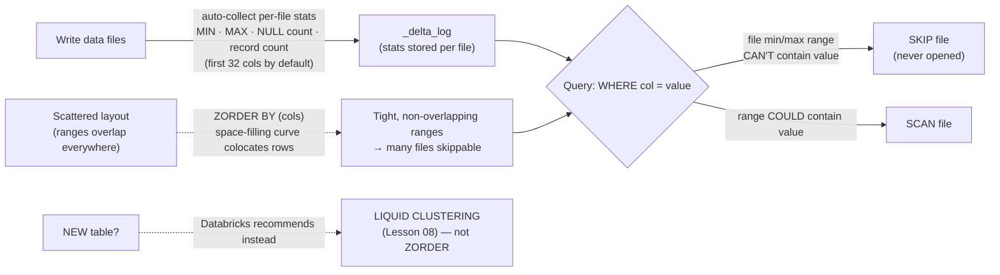

# Lesson 03 — Data skipping & Z-ordering

> **Track:** DBX Delta Optimization · **Lesson:** 03 · **Previous:** Lesson 02 — Partitioning (and when NOT to) · **Next:** Lesson 04 — OPTIMIZE / compaction (bin-packing)
> **Verified against:** Azure Databricks docs, June 2026.

## What it is (plain language)

**Data skipping** is how Delta makes a query fast by *not reading files it doesn't
need to*. Every time Delta writes a data file, it records a few **per-file
statistics** in the transaction log: the **MIN** value, the **MAX** value, the
**NULL count**, and the **total record count** for each column. At query time, when
you write `WHERE amount > 5000`, the engine looks at each file's min/max range first.
If a file's `amount` ranges only from 0 to 100, that file *cannot possibly* contain a
row above 5000 — so the engine **skips the entire file without opening it**. The more
files it can skip, the less data it reads, and the faster and cheaper the query.

But there's a catch: skipping only works well if related rows are **physically stored
near each other**. If rows matching your filter are scattered across every file, then
every file's min/max range overlaps your predicate, nothing can be skipped, and you're
back to a full scan. That's where **Z-ordering** comes in. `ZORDER BY` rewrites the
data so that rows with similar values in the chosen columns land in the *same* files,
using a **space-filling curve** (the "Z-order" curve) that keeps multiple columns
clustered at once. Tight, non-overlapping min/max ranges = aggressive skipping.

- **One-line analogy (data skipping):** It's like the index tabs on a filing cabinet.
  Before pulling a folder you glance at the label range ("Customers 1000–1999"); if the
  ID you want is 5500, you don't even open that drawer. The MIN/MAX stats are the labels.
- **One-line analogy (Z-ordering):** Z-ordering is **re-shelving the warehouse so items
  people buy together sit on the same shelf**. Once like-with-like is colocated, a
  picker walks far fewer aisles.
- **Concrete use case:** An 8 TB `orders` table queried daily with
  `WHERE order_status = 'RETURNED' AND region = 'EU'`. Run `OPTIMIZE … ZORDER BY
  (order_status, region)` and those rows colocate into a handful of files, so the
  engine skips the rest. (For a *new* table you'd reach for liquid clustering instead —
  see "the modern recommendation" below.)

---

## Why it matters — skipping is the whole game on big tables

- **Reading less data is the single biggest query win.** On a small table the engine
  just reads everything; on a billion-row table, the difference between scanning 5% of
  the files and 100% of them is the difference between seconds and minutes — and between
  a small bill and a large one.
- **Stats are free; you already have them.** Delta collects MIN/MAX/NULL/count
  automatically on every write. Data skipping is on by default — you don't enable it,
  you just *benefit from layout that lets it work*.
- **Layout decides how much you can skip.** Stats tell the engine *whether* a file can
  match; **colocation** (Z-order, or better, liquid clustering) decides *how tightly*
  matching rows are packed, which decides how many files can be skipped.

The decision rule to carry into an interview: **data skipping is automatic; your job is
to give it tight, non-overlapping min/max ranges on the columns you filter on** — by
choosing the right stats columns and the right colocation strategy.

---

## The mechanism (mermaid)



---

## How it works — deep dive, sub-topic by sub-topic

### 1. Per-file statistics: MIN, MAX, NULL count, record count

- **Mechanism:** On every write, Delta computes and stores four statistics **per file,
  per column**: the column **MIN**, the column **MAX**, the **NULL count**, and the
  file's **total record count**. These live in the `_delta_log`, not in the data files,
  so reading them is cheap.
- **Why:** At query time the engine reads only these tiny stats first. For a predicate
  like `WHERE x = 42`, any file whose `x` range is `[100, 200]` is provably non-matching
  and is **pruned without being opened**. NULL counts let it skip files for `IS NOT
  NULL` / `IS NULL` predicates; the record count powers fast `COUNT(*)`.
- **Trade-off:** Stats add a small write-time cost and only help **range-comparable**
  predicates (`=`, `<`, `>`, `BETWEEN`, `IN`). They do nothing for, e.g., a `LIKE
  '%middle%'` on an unindexed column. Skipping is **best-effort** — it never returns
  wrong rows, it just may scan more files than strictly necessary if ranges overlap.

```sql
-- Data skipping is automatic — no syntax to "turn it on". Stats are collected on write.
-- This predicate lets the engine prune any file whose amount MIN/MAX can't reach 5000:
SELECT * FROM main.delta_opt_demo.orders
WHERE amount > 5000;

-- Inspect the per-file stats the engine uses (numRecords, min/max/nullCount per col):
DESCRIBE DETAIL main.delta_opt_demo.orders;   -- numFiles, sizeInBytes (file-level view)
```

```python
# Same query in PySpark — skipping happens transparently under the hood.
(spark.table("main.delta_opt_demo.orders")
      .where("amount > 5000")           # min/max pruning kicks in automatically
      .count())
```

### 2. How the optimizer prunes files at query time

- **Mechanism:** The query planner intersects each predicate with every file's min/max
  range. A file is **kept** only if its range *could* overlap the predicate; otherwise
  it's **skipped**. This happens before any data file is opened — pruning operates
  purely on the small stats in the log.
- **Why:** It turns "read the table" into "read a few files", which is the dominant cost
  on large tables. The win scales with how *non-overlapping* the per-file ranges are.
- **Trade-off:** If matching rows are scattered (every file's range spans the whole
  domain), the ranges all overlap the predicate and **nothing can be skipped** — you
  pay a full scan despite having stats. That's the problem Z-order / clustering fixes.

### 3. Stats columns = first 32 columns by default (UC EXTERNAL tables)

- **Mechanism:** By default Delta collects skipping stats only on the **first 32
  columns** of the table (for **Unity Catalog EXTERNAL** tables). Columns beyond the
  32nd get **no** min/max stats, so predicates on them can't drive skipping.
- **Why:** Collecting and storing stats has a cost; capping at 32 keeps writes fast and
  the log small. Leading, frequently-filtered columns get stats; the long tail doesn't.
- **Trade-off:** If a hot filter column sits past position 32, it's silently un-indexed
  and skipping won't help it. Fix by **reordering** the column earlier, **raising**
  `dataSkippingNumIndexedCols`, or naming it explicitly via `dataSkippingStatsColumns`.

### 4. UC MANAGED tables: predictive optimization handles stats (no 32-col limit)

- **Mechanism:** For **Unity Catalog MANAGED** tables, **predictive optimization (PO)**
  provides *intelligent* stats — there is **no 32-column limit**, and PO runs `ANALYZE`
  to compute and maintain the stats it judges useful based on the table's queries.
- **Why:** It removes the manual "is my filter column within the first 32?" footgun.
  On managed tables you generally don't tune stats columns at all — the platform does.
- **Trade-off:** This is a **managed-only** benefit. EXTERNAL tables still get the 32-col
  default and must be tuned manually. (Predictive optimization is Lesson 09.)

```sql
-- On UC MANAGED tables, predictive optimization manages stats (runs ANALYZE for you);
-- no 32-column limit. Verify PO is in effect on the table:
DESCRIBE EXTENDED main.delta_opt_demo.orders;   -- look for the "Predictive Optimization" field
```

### 5. `dataSkippingNumIndexedCols` vs `dataSkippingStatsColumns`

- **Mechanism:**
  - `delta.dataSkippingNumIndexedCols` (**all DBR**) — sets *how many* **leading**
    columns get stats. It's **order-dependent**: it indexes columns 1..N in schema
    order. Default is 32.
  - `delta.dataSkippingStatsColumns` (**DBR 13.3 LTS+**) — an **explicit list** of the
    exact columns to collect stats on, regardless of position. It **supersedes**
    `dataSkippingNumIndexedCols`.
- **Why:** The explicit list is the better tool — you name precisely the columns you
  filter on (and *exclude* expensive ones like long strings) instead of relying on
  column order. The numeric knob is the older, order-coupled approach.
- **Trade-off:** Indexing more columns costs more on write and grows the log; index the
  ones you actually filter on, not everything. Prefer `dataSkippingStatsColumns` on DBR
  13.3 LTS+; fall back to `dataSkippingNumIndexedCols` only on older runtimes.

```sql
-- PREFERRED (DBR 13.3 LTS+): name exactly the columns to collect stats on.
-- Supersedes dataSkippingNumIndexedCols. Pick the columns you filter/join on.
ALTER TABLE main.delta_opt_demo.orders
  SET TBLPROPERTIES (
    'delta.dataSkippingStatsColumns' = 'order_status, region, amount'
  );

-- OLDER / order-dependent knob (all DBR): index the first N columns instead.
ALTER TABLE main.delta_opt_demo.orders
  SET TBLPROPERTIES ('delta.dataSkippingNumIndexedCols' = '8');
```

```python
# PySpark: set the same table property via SQL through spark.sql().
spark.sql("""
  ALTER TABLE main.delta_opt_demo.orders
  SET TBLPROPERTIES (
    'delta.dataSkippingStatsColumns' = 'order_status, region, amount'  -- explicit list (DBR 13.3 LTS+)
  )
""")
```

### 6. Changing these properties does NOT recompute existing stats

- **Mechanism:** Setting `dataSkippingStatsColumns` or `dataSkippingNumIndexedCols`
  affects **future writes only**. Files already written keep whatever stats they had
  when written — the property change does **not** retroactively recompute them.
- **Why:** Recomputing stats means re-reading every existing file, which is expensive;
  Delta won't do that implicitly on a metadata change.
- **Trade-off:** After changing the property you have a **mixed** table — new files have
  the new stats, old files don't — until you explicitly recompute (next sub-topic) or
  rewrite the data.

### 7. `ANALYZE TABLE … COMPUTE DELTA STATISTICS` (DBR 14.3 LTS+) to recompute

- **Mechanism (DBR 14.3 LTS+):** `ANALYZE TABLE t COMPUTE DELTA STATISTICS` recomputes
  the Delta data-skipping stats for **existing** files according to the *current* stats
  configuration — without rewriting the data files themselves.
- **Why:** It's how you "backfill" stats after changing `dataSkippingStatsColumns` /
  `dataSkippingNumIndexedCols`, so old files start skipping on the newly-chosen columns.
- **Trade-off:** Requires DBR 14.3 LTS+. It reads the existing files to compute stats,
  so it has a cost — but far less than rewriting the table.

```sql
-- After changing the stats-columns property, recompute stats on EXISTING files
-- so they too can be skipped on the newly-indexed columns. DBR 14.3 LTS+.
ANALYZE TABLE main.delta_opt_demo.orders COMPUTE DELTA STATISTICS;
```

### 8. Long strings are truncated during stats collection

- **Mechanism:** When Delta collects MIN/MAX for a **long string** column, it
  **truncates** the value during stats collection (it stores a prefix, not the whole
  string). Min/max on a truncated value is coarser and less useful for skipping.
- **Why:** Storing full long strings as stats would bloat the log and slow writes; a
  prefix is a pragmatic cap.
- **Trade-off:** For long free-text columns, stats give weak skipping anyway — so
  **consider excluding long string columns from stats** (via `dataSkippingStatsColumns`)
  to spend the stats budget on columns that actually prune well.

```sql
-- Spend the stats budget on selective columns; EXCLUDE a long free-text column
-- (its truncated min/max barely helps skipping anyway).
ALTER TABLE main.delta_opt_demo.orders
  SET TBLPROPERTIES (
    'delta.dataSkippingStatsColumns' = 'order_status, region, amount'  -- note: 'notes_text' omitted on purpose
  );
```

### 9. Z-ordering: `OPTIMIZE … ZORDER BY (cols)` and the Z-order curve

- **Mechanism:** `OPTIMIZE t [WHERE …] ZORDER BY (colA, colB)` **rewrites** the data so
  that rows with nearby values in the chosen columns are colocated in the same files.
  It uses a **space-filling (Z-order) curve** that interleaves the columns' bits so
  *multiple* columns stay clustered together — not just one sort key. The result is
  **tight, non-overlapping per-file min/max ranges** on the Z-ordered columns, which is
  exactly what data skipping needs.
- **Why:** Plain min/max stats are useless if matching rows are scattered. Z-order
  *creates* the locality that makes skipping aggressive. Use it for **high-cardinality
  columns that appear often in predicates** (e.g. `customer_id`, `order_status`).
- **Trade-off:** Multiple columns are allowed, but **effectiveness drops with each extra
  column** (the curve has to balance more dimensions, so any single-column filter gets
  less locality). Practically, Z-order on the 1–2 columns that dominate your filters.

```sql
-- Compact AND colocate by the columns you filter on most (high-cardinality is fine).
-- The WHERE scopes the rewrite to one partition (cheaper) on a partitioned table.
OPTIMIZE main.delta_opt_demo.orders
WHERE order_date >= DATE'2026-06-01'
ZORDER BY (order_status, region);     -- 1-2 dominant filter columns; more cols = less benefit each
```

```python
# PySpark / DeltaTable API equivalent of OPTIMIZE ... ZORDER BY.
from delta.tables import DeltaTable
dt = DeltaTable.forName(spark, "main.delta_opt_demo.orders")
(dt.optimize()
   .where("order_date >= '2026-06-01'")   # scope the rewrite (optional)
   .executeZOrderBy("order_status", "region"))
```

### 10. ZORDER columns must have stats; Z-order is NOT idempotent; can't Z-order partition cols

- **Mechanism / constraints:**
  - **Stats required:** A Z-ordered column **must have stats collected** (it must be
    within the indexed columns) — skipping reads min/max, so a column with no stats
    gains nothing from being Z-ordered.
  - **Not idempotent:** Unlike plain `OPTIMIZE` (bin-packing), `OPTIMIZE … ZORDER BY`
    is **not idempotent** — re-running it **may rewrite files again**, so it's not a
    free no-op the way compaction is.
  - **No partition columns:** You **cannot Z-order on a partition column** (the column
    already defines the directory split; Z-order only reorganizes *within* a partition).
- **Why:** These flow from how Z-order interacts with stats and partition boundaries.
- **Trade-off:** Because it's not idempotent and rewrites data, Z-order is heavier than
  compaction — schedule it deliberately, not on every job. And ensure your Z-order
  columns are actually in the stats set.

```sql
-- Make sure the Z-order columns are in the stats set FIRST (they need min/max),
-- recompute on existing files, THEN Z-order. Don't Z-order a partition column.
ALTER TABLE main.delta_opt_demo.orders
  SET TBLPROPERTIES ('delta.dataSkippingStatsColumns' = 'order_status, region, amount');
ANALYZE TABLE main.delta_opt_demo.orders COMPUTE DELTA STATISTICS;  -- DBR 14.3 LTS+
OPTIMIZE main.delta_opt_demo.orders ZORDER BY (order_status, region);  -- NOT idempotent
```

### 11. The modern recommendation: liquid clustering instead of Z-order (DBR 13.3+)

- **Mechanism:** Since **DBR 13.3+**, Databricks recommends **liquid clustering**
  (`CLUSTER BY`, Lesson 08) **instead of Z-order** for laying out tables. Liquid
  clustering gives the same colocation-for-skipping benefit but is **incremental** (no
  full rewrite per maintenance run) and lets you **change keys with no rewrite**.
- **Why:** Z-order is heavyweight (not idempotent, full rewrites) and the keys are
  effectively baked into how you run `OPTIMIZE`. Liquid clustering removes those sharp
  edges and is the default for all new tables.
- **Trade-off / hard rule:** **`ZORDER` is NOT compatible with liquid clustering** — you
  use one *or* the other, never both. Reach for Z-order only on **legacy / external**
  tables you're not converting to liquid clustering.

```sql
-- MODERN DEFAULT for a NEW table: liquid clustering, NOT ZORDER (Lesson 08).
-- Same skipping benefit, incremental maintenance, change keys with no rewrite.
CREATE OR REPLACE TABLE main.delta_opt_demo.orders (
  order_id     BIGINT,
  order_status STRING,
  region       STRING,
  amount       DOUBLE,
  order_date   DATE
)
CLUSTER BY (order_status, region);   -- do NOT also ZORDER this table — they're incompatible
```

---

## Comparison table — choosing a skipping strategy

| Approach | What it does | Maintenance | Change keys later | Idempotent? | Verdict for new code |
| --- | --- | --- | --- | --- | --- |
| **Data skipping (stats)** | Auto min/max/null/count pruning per file | Free (on by default) | n/a | n/a | ✔ Always on — give it good layout |
| `dataSkippingNumIndexedCols` | Index first *N* columns (order-dependent) | Property + recompute | Reorder cols / change N | n/a | OK on older DBR; prefer the explicit list |
| `dataSkippingStatsColumns` (13.3+) | Index an explicit column list | Property + `ANALYZE` recompute | Edit the list + recompute | n/a | ✔ Preferred way to control stats |
| `OPTIMIZE … ZORDER BY` | Colocate rows via space-filling curve | Manual, full rewrites | Re-run with new cols (rewrite) | **No** (rewrites) | Legacy/external only |
| **Liquid clustering** `CLUSTER BY` | Colocate via clustering keys | Incremental `OPTIMIZE` | **Anytime, no rewrite** | Incremental | ✔ **Prefer for all new tables** |

---

## Uses, edge cases & limitations

**Uses (when to reach for each)**
- **Data skipping:** always — it's automatic. Your lever is *layout* and *stats columns*.
- **`dataSkippingStatsColumns`:** when a hot filter column is past position 32, or to
  *exclude* a long-string column and spend the stats budget on selective columns.
- **`ANALYZE … COMPUTE DELTA STATISTICS`:** to backfill stats on existing files after
  changing the stats-columns config (DBR 14.3 LTS+).
- **`ZORDER BY`:** legacy/external Delta tables you filter on a high-cardinality column
  and won't convert to liquid clustering. For new tables, use liquid clustering instead.

**Edge cases an interviewer probes**
- **Hot filter column past column 32** → no stats, no skipping; reorder, raise the
  numeric knob, or name it in `dataSkippingStatsColumns`.
- **Scattered data, perfect stats** → ranges overlap everywhere → nothing skippable
  despite stats; you need Z-order / clustering to create locality.
- **Long free-text column** → truncated min/max → weak skipping; exclude it from stats.
- **Z-order too many columns** → per-column locality drops; keep it to 1–2 dominant cols.
- **Re-running `OPTIMIZE … ZORDER`** → NOT a no-op (not idempotent); it can rewrite again.
- **Changing stats props and expecting old files to improve** → they won't until you
  `ANALYZE … COMPUTE DELTA STATISTICS` (or rewrite).
- **Z-order on a partition column** → not allowed; Z-order works only *within* a partition.

**Limitations**
- Stats default to the **first 32 columns** on **UC EXTERNAL** tables; columns past 32
  are un-indexed unless configured.
- `dataSkippingStatsColumns` requires **DBR 13.3 LTS+**; `ANALYZE … COMPUTE DELTA
  STATISTICS` requires **DBR 14.3 LTS+**.
- Changing the stats properties **does not** recompute existing files' stats.
- **Long strings are truncated** during stats collection (coarser min/max).
- `ZORDER BY` is **not idempotent**, **cannot target partition columns**, requires its
  columns to **have stats**, and is **not compatible with liquid clustering**.

---

## Common gotchas

- **Skipping needs locality, not just stats.** Perfect min/max stats do nothing if
  matching rows are scattered across every file — colocate with Z-order or (preferred)
  liquid clustering.
- **Check the first 32 columns.** On UC EXTERNAL tables, a hot filter column past
  position 32 gets no stats; reorder it, raise `dataSkippingNumIndexedCols`, or list it
  in `dataSkippingStatsColumns`.
- **Prefer the explicit list.** On DBR 13.3 LTS+, `dataSkippingStatsColumns` supersedes
  the numeric knob and lets you exclude long-string columns.
- **Property changes don't backfill.** After changing stats props, run `ANALYZE …
  COMPUTE DELTA STATISTICS` (DBR 14.3 LTS+) to update existing files.
- **Z-order is not idempotent and not free.** It rewrites data; schedule it
  deliberately. And its columns must have stats.
- **You can't Z-order a partition column.** It works only within a partition.
- **Don't mix Z-order with liquid clustering** — they're incompatible. For new tables,
  use liquid clustering (Lesson 08); reach for Z-order only on legacy/external tables.
- **UC MANAGED tables: let predictive optimization handle stats** — no 32-col limit,
  it runs `ANALYZE` for you (Lesson 09).

---

## References

Official Azure Databricks documentation (verified June 2026):

- Data skipping for Delta Lake (per-file MIN/MAX/NULL/count stats, first-32-columns
  default, `dataSkippingNumIndexedCols`, `dataSkippingStatsColumns`, `ANALYZE … COMPUTE
  DELTA STATISTICS`, long-string truncation, `ZORDER BY` and the Z-order curve,
  not-idempotent, can't Z-order partition columns, liquid-clustering recommendation):
  <https://learn.microsoft.com/en-us/azure/databricks/tables/data-skipping>
- OPTIMIZE — optimize data file layout (running `OPTIMIZE … ZORDER BY`, `WHERE`
  predicate scoping, compaction integration):
  <https://learn.microsoft.com/en-us/azure/databricks/tables/operations/optimize>
- OPTIMIZE SQL language reference (`ZORDER BY` clause syntax):
  <https://learn.microsoft.com/en-us/azure/databricks/sql/language-manual/delta-optimize>
- Use liquid clustering for tables (the modern replacement for Z-order; `CLUSTER BY`):
  <https://learn.microsoft.com/en-us/azure/databricks/tables/clustering>
- Predictive optimization (intelligent stats / `ANALYZE` on UC MANAGED tables):
  <https://learn.microsoft.com/en-us/azure/databricks/optimizations/predictive-optimization>
- Best practices: Delta Lake (layout & skipping guidance):
  <https://learn.microsoft.com/en-us/azure/databricks/delta/best-practices>
