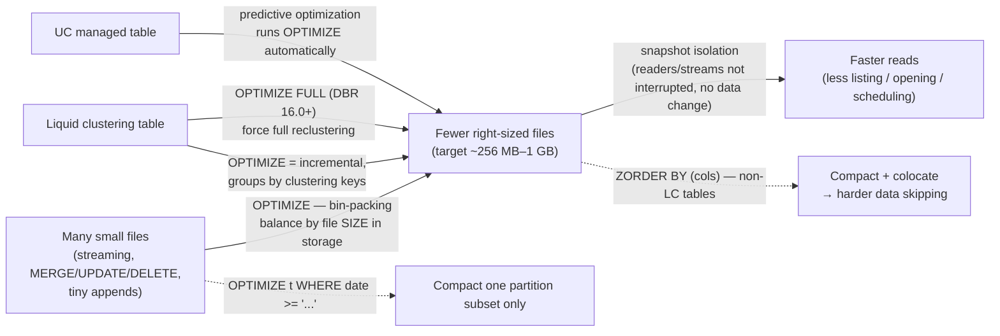

# Lesson 04 — OPTIMIZE / compaction (bin-packing)

> **Track:** DBX Delta Optimization · **Lesson:** 04 · **Previous:** Lesson 03 — Data skipping & Z-ordering · **Next:** Lesson 05 — Optimized writes
> **Verified against:** Azure Databricks docs, June 2026.

## What it is (plain language)

`OPTIMIZE` is the command that **takes the many small files a table has accumulated
and rewrites them into fewer, right-sized files**. That merging is called
**bin-packing** — packing lots of little items into a smaller number of evenly-filled
bins (here, the "bins" are data files of a healthy size). Nothing about your *data*
changes — same rows, same values, same query results — only the **physical file
layout** on storage gets tidier.

Why does a table end up with too many small files in the first place? Every streaming
micro-batch, every `MERGE`/`UPDATE`/`DELETE`, every small append writes new Parquet
files. Over a day a busy table can grow thousands of tiny files. Each file carries
fixed overhead — the engine has to list it, open it, read its footer and stats, and
schedule a task for it — so **thousands of tiny files make every read slow and
metadata-heavy**. `OPTIMIZE` is the manual broom that sweeps them back into a small
number of well-sized files so reads get fast again.

- **One-line analogy:** It's like **consolidating a junk drawer of half-empty
  envelopes into a few full folders**. Same papers inside, far fewer things to pick
  up and flip through. Bin-packing balances the folders by *how thick they are*
  (file size in storage), not by *how many papers* each holds (row count).
- **Concrete use case:** A streaming `events` table ingests every few seconds and by
  noon has 40,000 files averaging 2 MB each. A nightly `OPTIMIZE` compacts them to a
  few hundred ~256 MB files; the morning dashboards that scan a day of events go from
  minutes to seconds. (On a Unity Catalog managed table you'd let **predictive
  optimization** run this for you — see the last sub-topic.)

---

## Why it matters — the small-file tax, paid on every read

- **Small files make reads slow and expensive.** Listing, opening, and scheduling a
  task per file is pure overhead. Replace 40,000 tiny files with a few hundred
  right-sized ones and the engine does far less bookkeeping before it touches a single
  useful byte.
- **Compaction is the read-side fix for write-side fragmentation.** Frequent small
  writes (streaming, MERGE-heavy CDC) inevitably fragment a table. `OPTIMIZE` is how
  you pay that debt down on a schedule instead of letting it accumulate forever.
- **It composes with skipping.** Lesson 03 showed that data skipping wins by reading
  *fewer* files. `OPTIMIZE` makes each file *bigger and better-sized*, and (with
  `ZORDER` or liquid-clustering keys) **colocates** related rows so skipping prunes
  even harder. Right-sized + well-clustered = the fast read.

The decision rule to carry into an interview: **`OPTIMIZE` fixes the small-file
problem after the fact; it's idempotent, safe to run on a live table, and on modern
UC managed tables you let predictive optimization run it automatically.**

---

## The mechanism (mermaid)



---

## How it works — deep dive, sub-topic by sub-topic

### 1. `OPTIMIZE table_name` — bin-packing many small files into fewer right-sized files

- **Mechanism:** `OPTIMIZE catalog.schema.table` reads the table's small Parquet
  files and **rewrites their contents into a smaller number of larger files**, then
  commits a new version of the table pointing at the new files. This consolidation is
  **bin-packing** — it greedily packs rows into output files until each reaches the
  target size, producing evenly-filled files.
- **Why:** Fewer, larger files mean less listing/opening/footer-reading/task-scheduling
  overhead on every read. It directly removes the small-file tax.
- **Trade-off:** `OPTIMIZE` is a **rewrite** — it spends compute (CPU-heavy Parquet
  decode/encode) and writes new files. You're trading a one-time maintenance cost for
  faster reads thereafter. Run it on a schedule, not after every micro-batch.

```sql
-- Compact ALL of the table's small files into fewer right-sized files (bin-packing).
-- Same data, same results afterward — only the physical file layout changes.
OPTIMIZE main.delta_opt_demo.events;
```

```python
# PySpark / DeltaTable API equivalent of `OPTIMIZE table_name`.
from delta.tables import DeltaTable
dt = DeltaTable.forName(spark, "main.delta_opt_demo.events")
dt.optimize().executeCompaction()   # bin-packing (compaction only, no Z-order)
```

### 2. `OPTIMIZE t WHERE …` — limit the rewrite to a partition subset

- **Mechanism:** `OPTIMIZE t WHERE <partition predicate>` restricts compaction to the
  files matching the predicate (e.g. only yesterday's partitions). The `WHERE` must be
  on **partition columns** — it scopes *which files get rewritten*, not which rows.
- **Why:** On a large partitioned table you rarely need to recompact history that's
  already well-sized. Scoping to the recently-written partitions makes maintenance
  **cheap and fast** — you only pay to rewrite the part that actually fragmented.
- **Trade-off:** It only helps **partitioned** tables (you need partition columns to
  predicate on). It compacts *just* that subset, so other partitions keep whatever
  layout they had. Pick the predicate to match where new small files land.

```sql
-- Only recompact the partitions that recently accumulated small files (cheaper).
-- The predicate must reference PARTITION columns; it scopes which files are rewritten.
OPTIMIZE main.delta_opt_demo.events
WHERE event_date >= DATE'2026-06-25';
```

```python
# DeltaTable API: scope compaction with .where() before executeCompaction().
from delta.tables import DeltaTable
dt = DeltaTable.forName(spark, "main.delta_opt_demo.events")
(dt.optimize()
   .where("event_date >= '2026-06-25'")   # partition predicate — limits the rewrite
   .executeCompaction())
```

### 3. Python / Scala DeltaTable API: `optimize().executeCompaction()` and `.where(...)`

- **Mechanism:** The DeltaTable API mirrors the SQL command.
  `DeltaTable.forName(spark, "t").optimize().executeCompaction()` runs bin-packing;
  chain `.where("…")` to scope it to a partition subset, exactly like SQL `WHERE`.
  A Scala equivalent exists with the same call shape. (For Z-order on non-LC tables
  the API method is `.executeZOrderBy(...)` instead of `.executeCompaction()`.)
- **Why:** Use the API when you're already orchestrating maintenance in PySpark/Scala
  (a job that compacts several tables in a loop, reads `DESCRIBE DETAIL` between runs,
  etc.) instead of issuing raw SQL strings.
- **Trade-off:** Functionally identical to the SQL command — pick whichever fits your
  codebase. The API is Delta-specific (it won't run against non-Delta tables).

```python
# Programmatic maintenance: compact a list of tables, scoped to recent partitions.
from delta.tables import DeltaTable
for tbl in ["main.delta_opt_demo.events", "main.delta_opt_demo.clicks"]:
    (DeltaTable.forName(spark, tbl)
       .optimize()
       .where("event_date >= '2026-06-25'")   # optional scope; drop for a full compaction
       .executeCompaction())
```

```scala
// Scala equivalent — same call shape as Python.
import io.delta.tables._
val dt = DeltaTable.forName(spark, "main.delta_opt_demo.events")
dt.optimize().where("event_date >= '2026-06-25'").executeCompaction()
```

### 4. Bin-packing is **idempotent**, and balances by file **size** in storage

- **Mechanism:** Bin-packing is **idempotent** — run `OPTIMIZE` twice in a row and the
  **second run has no effect**, because the files are already right-sized and there's
  nothing left to merge. It aims to produce **evenly-balanced files by their size in
  storage**, *not* by the number of tuples (rows) per file — though size and row count
  are usually correlated.
- **Why:** Idempotency makes `OPTIMIZE` **safe to schedule aggressively**: a no-op
  second run costs almost nothing, so you never have to worry about "did I already
  optimize this?" Balancing by storage size (not row count) is what actually fixes the
  small-file tax, since read overhead tracks file count and byte layout, not rows.
- **Trade-off:** Idempotency is specific to plain **bin-packing**. `OPTIMIZE … ZORDER
  BY` is **NOT idempotent** (sub-topic 6) — re-running it can rewrite files again. So
  "safe to re-run as a no-op" applies to compaction, not to Z-order.

```sql
-- First run compacts the small files...
OPTIMIZE main.delta_opt_demo.events;
-- ...a second, immediate run is a NO-OP: nothing left to bin-pack (idempotent).
OPTIMIZE main.delta_opt_demo.events;   -- numFiles unchanged, no files rewritten
```

### 5. Liquid clustering vs partitioned tables: how `OPTIMIZE` behaves

- **Mechanism:**
  - On a **liquid clustering** table, `OPTIMIZE` doesn't just compact — it **groups
    data by the clustering keys**, and it does so **incrementally** (it rewrites only
    what's needed to keep the layout healthy, not the whole table).
  - On a **partitioned** table, compaction and data layout happen **within each
    partition** — `OPTIMIZE` never merges files *across* partition boundaries.
- **Why:** On a clustered table, plain compaction would lose the colocation that makes
  skipping work; so `OPTIMIZE` re-establishes the clustering as it compacts.
  Incremental behavior keeps routine maintenance on clustered tables cheap. On
  partitioned tables, the partition is the unit of layout, so compaction respects it.
- **Trade-off:** Because clustering-`OPTIMIZE` is incremental, it may leave some data
  not-yet-clustered after key changes — that's what `OPTIMIZE FULL` (sub-topic 7) is
  for. On partitioned tables, a partition that's still small can't be merged into a
  neighbor, so over-partitioning still produces small files (see Lesson 02).

```sql
-- On a LIQUID CLUSTERING table, OPTIMIZE is INCREMENTAL and groups by clustering keys:
OPTIMIZE main.delta_opt_demo.events;   -- only rewrites what's needed to keep layout healthy

-- On a PARTITIONED table, compaction happens WITHIN each partition (never across them):
OPTIMIZE main.delta_opt_demo.events_partitioned
WHERE event_date = DATE'2026-06-25';   -- compacts files inside that one partition
```

### 6. `OPTIMIZE t ZORDER BY (col)` — compaction **plus** Z-order (non-LC tables only)

- **Mechanism:** Adding a `ZORDER BY (cols)` clause makes `OPTIMIZE` do **two jobs at
  once**: bin-pack the small files **and** colocate rows along a space-filling curve so
  the chosen columns get tight, non-overlapping per-file min/max ranges (Lesson 03).
- **Why:** When you're going to pay for a rewrite anyway, you can compact *and* improve
  data skipping in the same pass — useful on a legacy/external table you filter on a
  high-cardinality column.
- **Trade-off:** **Only for non-liquid-clustering tables** — `ZORDER` is **not
  compatible** with liquid clustering (you use one or the other). And unlike plain
  compaction, `OPTIMIZE … ZORDER BY` is **NOT idempotent** — re-running can rewrite
  again. For new tables Databricks recommends liquid clustering instead of `ZORDER`.

```sql
-- Compact AND colocate by the columns you filter on most (non-LC tables only).
-- NOTE: not idempotent — schedule deliberately, not on every job.
OPTIMIZE main.delta_opt_demo.events
ZORDER BY (event_type, user_id);   -- 1-2 dominant filter columns; more cols = less benefit each
```

```python
# DeltaTable API: Z-order uses executeZOrderBy(...) instead of executeCompaction().
from delta.tables import DeltaTable
dt = DeltaTable.forName(spark, "main.delta_opt_demo.events")
dt.optimize().executeZOrderBy("event_type", "user_id")   # non-LC tables only; NOT idempotent
```

### 7. `OPTIMIZE table_name FULL` (DBR 16.0+) — force full reclustering for LC tables

- **Mechanism (DBR 16.0+):** For a **liquid clustering** table, `OPTIMIZE t FULL`
  forces a **full reclustering** — it rewrites *all* the data to the current clustering
  keys, not just the incremental delta that a plain `OPTIMIZE` would touch.
- **Why:** Plain `OPTIMIZE` on a clustered table is incremental, so right after you
  **first enable clustering** or **change the clustering keys**, much of the existing
  data is still laid out the old way. `OPTIMIZE FULL` reorganizes everything to the new
  keys in one pass.
- **Trade-off:** It rewrites the **whole** table, so it can take **hours** on a big
  table and costs accordingly. Run it deliberately (after a key change), not routinely;
  for steady-state upkeep, plain incremental `OPTIMIZE` is enough.

```sql
-- After first enabling clustering or CHANGING the keys, force a full recluster (DBR 16.0+).
-- Rewrites ALL data to the current clustering keys — can be slow/expensive on big tables.
ALTER TABLE main.delta_opt_demo.events CLUSTER BY (event_type, event_date);
OPTIMIZE main.delta_opt_demo.events FULL;   -- one-time, after the key change
```

### 8. Snapshot isolation: readers/streams aren't interrupted, and there's no data change

- **Mechanism:** Delta readers use **snapshot isolation** — they read a consistent
  committed version of the table. When `OPTIMIZE` removes the old small files from the
  transaction log and adds the new compacted ones, in-flight readers keep reading their
  snapshot and **aren't interrupted**. Because `OPTIMIZE` makes **no data changes**, a
  read **before and after** returns the **same results**. Running `OPTIMIZE` on a table
  that is a **streaming source** does **not affect** any current or future streams.
- **Why:** This is what makes `OPTIMIZE` safe to run on a **live, busy** production
  table — you don't need a maintenance window or to pause pipelines.
- **Trade-off:** None for correctness. The only cost is the compute the rewrite spends
  and the new files it commits; concurrent *writers* still follow normal Delta
  concurrency rules, but readers and streaming sources are unaffected.

### 9. `OPTIMIZE` returns file statistics

- **Mechanism:** `OPTIMIZE` returns a result row with **file statistics** for the
  operation — min/max/total size of files **removed** and files **added**, plus
  Z-ordering stats (when used), the **number of batches**, and the **partitions
  optimized**. The same metrics show up in `DESCRIBE HISTORY` under `operationMetrics`.
- **Why:** These numbers are how you *measure* the effect — confirm files actually got
  compacted (removed ≫ added), and how much work a run did. Pair with `DESCRIBE DETAIL`
  (`numFiles`, `sizeInBytes`) for a clean before/after.
- **Trade-off:** None — it's free reporting. Use it (and `DESCRIBE HISTORY`) instead of
  guessing whether a maintenance run did anything.

```sql
-- OPTIMIZE returns stats (files removed/added, batches, partitions optimized).
OPTIMIZE main.delta_opt_demo.events;

-- The same numbers land in DESCRIBE HISTORY under operationMetrics:
DESCRIBE HISTORY main.delta_opt_demo.events;   -- look at the latest OPTIMIZE row's operationMetrics
DESCRIBE DETAIL  main.delta_opt_demo.events;   -- numFiles / sizeInBytes for a before/after check
```

### 10. Predictive optimization runs `OPTIMIZE` automatically; frequency & compute

- **Mechanism:** On **Unity Catalog managed** tables, **predictive optimization (PO)**
  runs `OPTIMIZE` **automatically** when it's cost-effective — no scheduled job needed.
  When you do run it manually, frequency is a **cost/performance trade-off**: more
  often = faster reads but higher compute; less often = cheaper but more fragmentation.
  Databricks recommends **start daily, then tune**. `OPTIMIZE` is **CPU-intensive**
  (Parquet decode/encode) — use **compute-optimized** instance types, and it benefits
  from attached **SSDs**.
- **Why:** PO removes the manual maintenance burden entirely for managed tables and
  only runs `OPTIMIZE` when the benefit outweighs the cost. The compute guidance is
  about getting the rewrite done quickly and cheaply.
- **Trade-off:** PO is **managed-tables only** (Lesson 09). For external/legacy tables
  you still schedule `OPTIMIZE` yourself and tune the cadence. The target file size the
  rewrite aims for is set by `delta.targetFileSize` / autotuning (forward-ref Lesson
  07): no explicit target → autotune (≈256 MB for tables < 2.56 TB, growing toward 1 GB
  for very large tables).

```sql
-- Let the platform run OPTIMIZE for you on UC MANAGED tables (Lesson 09):
ALTER SCHEMA main.delta_opt_demo ENABLE PREDICTIVE OPTIMIZATION;

-- Optional: pin the target file size the rewrite aims for (else autotuned — Lesson 07).
ALTER TABLE main.delta_opt_demo.events
  SET TBLPROPERTIES ('delta.targetFileSize' = '256mb');
```

---

## Comparison table — `OPTIMIZE` variants & related maintenance

| Operation | What it does | Idempotent? | Scope | Use when |
| --- | --- | --- | --- | --- |
| `OPTIMIZE t` | Bin-pack small files into fewer right-sized files | **Yes** | Whole table | Routine compaction of a fragmented table |
| `OPTIMIZE t WHERE …` | Compact only matching **partitions** | **Yes** | Partition subset | Large partitioned table; only recent partitions fragmented |
| `OPTIMIZE t ZORDER BY (…)` | Compact **+** colocate via Z-order | **No** | Whole table / subset | Non-LC table you filter on high-cardinality cols |
| `OPTIMIZE t` (LC table) | Compact **+** group by clustering keys (incremental) | Incremental | Whole table | Routine upkeep of a liquid-clustering table |
| `OPTIMIZE t FULL` (DBR 16.0+) | **Full** recluster all data to current keys | n/a (forces rewrite) | Whole table | Right after enabling LC or changing keys |
| Predictive optimization | Auto-runs `OPTIMIZE` when cost-effective | n/a | UC managed tables | The default for new managed tables (Lesson 09) |

---

## Uses, edge cases & limitations

**Uses (when to reach for each)**
- **Plain `OPTIMIZE`:** routine compaction of any fragmented Delta table (streaming
  sinks, MERGE-heavy CDC, many small appends). It's the read-side fix for write-side
  fragmentation.
- **`OPTIMIZE … WHERE`:** large **partitioned** tables where only recently-written
  partitions fragmented — recompact just those, cheaply.
- **`OPTIMIZE … ZORDER BY`:** legacy/external non-LC tables — compact and improve
  skipping in one pass.
- **`OPTIMIZE … FULL`:** one-time, after enabling liquid clustering or changing keys.
- **Predictive optimization:** the modern default — let the platform run `OPTIMIZE`
  on UC managed tables.

**Edge cases an interviewer probes**
- **`OPTIMIZE` on a streaming source** → safe; snapshot isolation means current and
  future streams are unaffected and results don't change.
- **Re-running compaction** → idempotent no-op; but re-running `OPTIMIZE … ZORDER BY`
  is **not** a no-op and can rewrite again.
- **`WHERE` on a non-partition column** → the predicate scopes which **partitions/files**
  are rewritten; on partitioned tables compaction is *within* partitions only, never across.
- **Over-partitioned table** → tiny partitions can't be merged across boundaries, so
  `OPTIMIZE` can't fully fix small files caused by partition explosion (Lesson 02).
- **Very large table with autotuned target** → growing the target file size does **not**
  re-optimize existing files; set a fixed `delta.targetFileSize` if you need uniformity
  (Lesson 07).
- **`OPTIMIZE FULL` on a huge table** → can take **hours**; it's a full rewrite, not
  routine maintenance.

**Limitations**
- `OPTIMIZE` is a **rewrite** — it costs compute and writes new files (CPU-heavy
  Parquet decode/encode; prefer compute-optimized instances + SSDs).
- `ZORDER BY` is **not idempotent** and is **not compatible with liquid clustering**.
- `OPTIMIZE … FULL` requires **DBR 16.0+** (for liquid-clustering reclustering).
- On **partitioned** tables, compaction never merges files **across** partitions.
- Plain `OPTIMIZE` **only changes file layout** — it does not change data, schema, or
  the clustering/partition design; it won't fix a table that's small because it's
  over-partitioned.
- **Predictive optimization** is **UC managed tables only** (not external/OpenSharing).

---

## Common gotchas

- **`OPTIMIZE` is safe on live tables.** Snapshot isolation means readers and streaming
  sources aren't interrupted and results don't change — no maintenance window needed.
- **Compaction is idempotent; Z-order is not.** Re-running plain `OPTIMIZE` is a free
  no-op; re-running `OPTIMIZE … ZORDER BY` can rewrite files again — schedule it
  deliberately.
- **Bin-packing balances by file SIZE, not row count.** Don't expect equal rows per
  file; expect evenly-sized files (which is what fixes the small-file tax).
- **`WHERE` is for partitions.** Use it to scope compaction to recently-written
  partitions on big partitioned tables; it can't merge files across partition boundaries.
- **Don't `ZORDER` a liquid-clustering table.** They're incompatible — on LC tables
  plain `OPTIMIZE` already groups by the clustering keys.
- **After changing clustering keys, run `OPTIMIZE FULL`.** Plain incremental `OPTIMIZE`
  won't re-lay-out the existing data to the new keys (DBR 16.0+).
- **Measure, don't assume.** Use `OPTIMIZE`'s returned stats + `DESCRIBE DETAIL`
  (numFiles/sizeInBytes) + `DESCRIBE HISTORY` (operationMetrics) to confirm the win.
- **On UC managed tables, prefer predictive optimization** over a hand-scheduled
  `OPTIMIZE` job (Lesson 09).

---

## References

Official Azure Databricks documentation (verified June 2026):

- OPTIMIZE — optimize data file layout (bin-packing, idempotency, balance by storage
  size, `WHERE` partition predicate, Python/Scala `optimize().executeCompaction()` /
  `.where(...)`, liquid-clustering vs partitioned behavior, `OPTIMIZE FULL`, snapshot
  isolation & streaming-source safety, returned file stats, recommended frequency &
  compute-optimized instances + SSDs):
  <https://learn.microsoft.com/en-us/azure/databricks/tables/operations/optimize>
- OPTIMIZE SQL language reference (`OPTIMIZE … [WHERE …] [ZORDER BY …]` / `FULL` syntax):
  <https://learn.microsoft.com/en-us/azure/databricks/sql/language-manual/delta-optimize>
- Use liquid clustering for tables (incremental `OPTIMIZE`, `OPTIMIZE FULL` / force
  reclustering, incompatibility with `ZORDER`):
  <https://learn.microsoft.com/en-us/azure/databricks/tables/clustering>
- Data skipping for Delta Lake (why colocation + `ZORDER` make skipping work):
  <https://learn.microsoft.com/en-us/azure/databricks/tables/data-skipping>
- Control the data file size (target file size, autotuning, `delta.targetFileSize`):
  <https://learn.microsoft.com/en-us/azure/databricks/tables/tune-file-size>
- Predictive optimization for Unity Catalog managed tables (auto-runs `OPTIMIZE`):
  <https://learn.microsoft.com/en-us/azure/databricks/optimizations/predictive-optimization>
