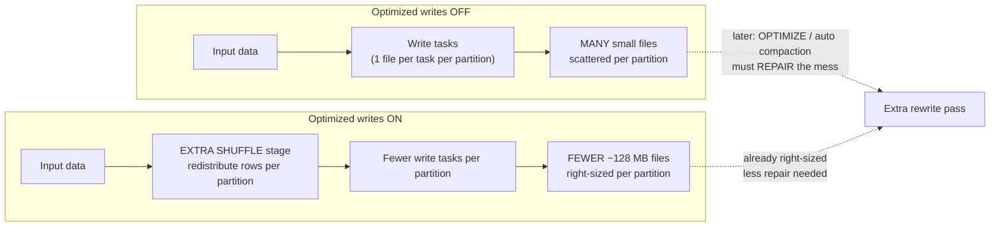

# Lesson 05 — Optimized writes

> **Track:** DBX Delta Optimization · **Lesson:** 05 · **Previous:** Lesson 04 — OPTIMIZE / compaction (bin-packing) · **Next:** Lesson 06 — Auto compaction
> **Verified against:** Azure Databricks docs, June 2026.

## What it is (plain language)

**Optimized writes** fix file sizes **at the moment data is written** — *before* the
files ever land in storage. Normally Spark writes roughly **one output file per
write task**, so a job with many parallel tasks (or many small partitions) emits a
swarm of tiny files. Optimized writes insert **one extra shuffle stage just before
the write**: it re-distributes (reshuffles) the rows so that each table partition
receives its data from **fewer tasks**, and each of those tasks writes a **larger,
right-sized file** instead of many small ones. The target file size when optimized
writes is enabled is **128 MB**.

In short: rather than letting the shape of your *compute* (how many tasks happened
to run) decide the shape of your *storage* (how many files you get), optimized
writes reshuffles the data so the storage layout is sized on purpose. It is **most
effective for partitioned tables**, where the default behavior tends to scatter
each partition's rows across every task and produce the worst small-file fan-out.

- **One-line analogy:** It's like a **packing station before shipping**. Without it,
  ten workers each toss whatever they're holding into its own box — you ship ten
  half-empty boxes. Optimized writes is the worker at the end of the line who first
  *consolidates* everything destined for the same address, then packs a few full
  boxes. Same goods, far fewer boxes.
- **Concrete use case:** A nightly `MERGE` that upserts change-data-capture rows
  into a large partitioned `sales` table. Without optimized writes each micro-task
  appends a tiny file per partition it touched, bloating the table with thousands of
  small files. With optimized writes (which is **on by default for MERGE**) the rows
  are reshuffled per partition first, so each partition gets a handful of ~128 MB
  files. Fewer files means faster downstream scans and less metadata to manage.

---

## Why it matters — fix the small-file problem at the source

- **It prevents small files instead of cleaning them up afterward.** Manual
  `OPTIMIZE` (Lesson 04) and auto compaction (Lesson 06) *repair* a table that
  already has too many small files — a second pass that reads and rewrites data.
  Optimized writes avoids creating most of those small files in the first place, so
  you do less repair work later.
- **It removes the guesswork of `coalesce`/`repartition`.** The old way to control
  write file count was `df.coalesce(n)` or `df.repartition(n)` right before `.write`
  — but you had to *guess* `n`, and the right `n` changes with data volume.
  Optimized writes sizes files automatically based on the 128 MB target.
- **It is on automatically where it matters most.** For `MERGE`, `UPDATE` with
  subqueries, and `DELETE` with subqueries, optimized writes is **always on and
  cannot be turned off** — exactly the row-level operations that otherwise spray
  tiny files across many partitions.

The decision rule to carry into an interview: **optimized writes is a write-time
fix; it trades a little extra shuffle latency for far fewer small files.** Reach for
it (or just rely on its defaults) on partitioned tables and on MERGE/UPDATE/DELETE
workloads, and stop hand-tuning `coalesce`/`repartition` before writes.

---

## The mechanism (mermaid)



---

## How it works — deep dive, sub-topic by sub-topic

### 1. The mechanism: shuffle before write so each partition gets fewer, larger files

- **Mechanism:** Without optimized writes, Spark writes about **one file per write
  task per output partition**. If 200 tasks each hold a few rows for partition
  `region=EU`, you get ~200 tiny `region=EU` files. Optimized writes adds an **extra
  shuffle stage immediately before the write** that redistributes rows so all of a
  partition's data is concentrated into a **small number of tasks**; each writes one
  **right-sized** file. The target file size when enabled is **128 MB**.
- **Why:** It decouples the **number of files** from the **number of compute tasks**.
  File count becomes a function of *data size and the 128 MB target* rather than an
  accident of how parallel the job happened to be — so writes self-size.
- **Trade-off:** The extra shuffle **moves data across the network**, which adds some
  **write latency**. In exchange you avoid emitting (and later repairing) thousands
  of small files. For most batch and merge workloads that trade is strongly worth it.

```python
# Session config (applies to writes in this session) — DBR sizes files toward ~128 MB.
spark.conf.set("spark.databricks.delta.optimizeWrite.enabled", "true")

# A normal write now goes through an extra shuffle and emits FEWER, larger files.
(spark.table("main.delta_opt_demo.sales_src")
      .write.mode("overwrite")
      # DON'T add .coalesce(n)/.repartition(n) here — let optimized writes size files.
      .saveAsTable("main.delta_opt_demo.sales"))
```

### 2. Most effective for partitioned tables

- **Mechanism:** On a **partitioned** table, the default write fans each partition's
  rows out across many tasks → the worst small-file explosion (many tiny files *per
  partition directory*). The pre-write shuffle groups rows by their output partition
  first, so each partition is written by just a few tasks.
- **Why:** Partitioning multiplies the small-file problem — a job touching 50
  partitions with 200 tasks can write up to 50 × 200 files. Optimized writes is
  designed for exactly this fan-out, which is why the docs call partitioned tables
  the case where it helps most.
- **Trade-off:** On an **unpartitioned** table the benefit is smaller (AQE already
  coalesces post-shuffle partitions somewhat), but it still right-sizes output. The
  shuffle cost is the same either way, so the *payoff* is largest where the fan-out
  was worst — partitioned tables.

```sql
-- Most effective on partitioned tables: enable the property so writes self-size.
-- (For NEW tables, prefer liquid clustering over partitioning — see Lesson 08.)
ALTER TABLE main.delta_opt_demo.sales
  SET TBLPROPERTIES ('delta.autoOptimize.optimizeWrite' = 'true');
```

### 3. Turning it on: table property and session config

- **Mechanism:** Two independent switches:
  - **Table property** `delta.autoOptimize.optimizeWrite` (`true`/`false`) — travels
    with the table, so every write to it goes through optimized writes.
  - **Session config** `spark.databricks.delta.optimizeWrite.enabled` — applies to
    writes in the current Spark session, regardless of the table property.
- **Why:** The table property is the durable, declarative choice for a specific
  table; the session config is handy for a one-off job or to turn the behavior on/off
  broadly without altering table metadata.
- **Trade-off:** Two scopes can interact — knowing which one is in force prevents
  surprises. The property pins behavior to the table; the session config affects
  everything the session writes. Set the property for tables you always want sized.

```sql
-- Durable, per-table switch (recommended for a table you always want right-sized):
ALTER TABLE main.delta_opt_demo.sales
  SET TBLPROPERTIES ('delta.autoOptimize.optimizeWrite' = 'true');

-- Set it at CREATE time too:
CREATE TABLE main.delta_opt_demo.sales (
  sale_id BIGINT, region STRING, amount DOUBLE, sale_date DATE
)
PARTITIONED BY (region)
TBLPROPERTIES ('delta.autoOptimize.optimizeWrite' = 'true');
```

```python
# Session-scoped switch (one-off jobs, or to toggle broadly without ALTER TABLE):
spark.conf.set("spark.databricks.delta.optimizeWrite.enabled", "true")
```

### 4. Enabled BY DEFAULT for MERGE, UPDATE with subqueries, DELETE with subqueries

- **Mechanism:** For three row-level operations — **`MERGE`**, **`UPDATE` with
  subqueries**, and **`DELETE` with subqueries** — optimized writes is **enabled by
  default**. These operations rewrite scattered subsets of rows across many
  partitions, the exact pattern that produces the most small files, so Databricks
  applies the pre-write shuffle automatically.
- **Why:** A CDC merge or a subquery-driven update typically touches a little data in
  many partitions; without the shuffle each touched partition gets another tiny file
  every run, and tables degrade fast. Defaulting it on protects these workloads.
- **Trade-off:** It is **always on for these operations and cannot be disabled** — see
  the hard rule below. You accept the shuffle cost on every MERGE/UPDATE/DELETE in
  return for not flooding the table with small files. This is almost always correct.

```sql
-- MERGE gets optimized writes automatically (always on) — no property needed.
-- The pre-write shuffle keeps the touched partitions from gaining many tiny files.
MERGE INTO main.delta_opt_demo.sales AS t
USING main.delta_opt_demo.sales_updates AS s
  ON t.sale_id = s.sale_id
WHEN MATCHED THEN UPDATE SET *
WHEN NOT MATCHED THEN INSERT *;

-- UPDATE/DELETE *with a subquery* also get optimized writes by default:
UPDATE main.delta_opt_demo.sales
  SET amount = amount * 1.05
  WHERE region IN (SELECT region FROM main.delta_opt_demo.promo_regions);  -- subquery → optimized write
```

### 5. Also on for CTAS + INSERT on SQL warehouses; UC-registered tables in DBR 13.3 LTS+

- **Mechanism:** Beyond the always-on row-level ops, optimized writes is also applied
  for **`CTAS` (CREATE TABLE AS SELECT)** and **`INSERT`** statements **run on SQL
  warehouses**. Additionally, since **DBR 13.3 LTS+**, **all Unity Catalog–registered
  tables** get optimized writes for **CTAS and INSERT on partitioned tables**.
- **Why:** CTAS and large INSERTs into partitioned tables are common bulk-load paths
  that also fan out per partition; extending optimized writes to them (on warehouses,
  and broadly for UC tables on modern DBR) right-sizes those loads automatically.
- **Trade-off:** Coverage depends on **where you run** (SQL warehouse vs cluster) and
  **runtime/registration** (UC-registered, DBR 13.3 LTS+, partitioned). When in
  doubt, set the table property explicitly so the behavior is guaranteed and durable.

```sql
-- CTAS on a SQL warehouse gets optimized writes automatically.
-- (Set the property anyway to make it durable across compute types.)
CREATE TABLE main.delta_opt_demo.sales_eu
  PARTITIONED BY (region)
  TBLPROPERTIES ('delta.autoOptimize.optimizeWrite' = 'true')
AS SELECT * FROM main.delta_opt_demo.sales WHERE region = 'EU';

-- INSERT into a partitioned UC table (DBR 13.3 LTS+) is sized by optimized writes too:
INSERT INTO main.delta_opt_demo.sales
SELECT * FROM main.delta_opt_demo.sales_late_arrivals;
```

### 6. The trade-off: extra shuffle latency vs far fewer small files

- **Mechanism:** The single cost of optimized writes is the **extra shuffle stage** —
  a network redistribution of rows before the write. The single benefit is **far
  fewer, right-sized (~128 MB) files**.
- **Why:** Small files are expensive *forever* (slow listing, slow scans, metadata
  bloat, more compaction work), while the shuffle is paid **once, at write time**.
  Trading a one-time write cost to avoid a permanent read-and-maintenance cost is
  usually a clear win.
- **Trade-off / when to reconsider:** For an extremely latency-sensitive streaming
  micro-batch where a few extra hundred milliseconds matter more than file count, you
  might weigh it differently — but for batch loads, merges, and most pipelines the
  shuffle cost is negligible against the small-file savings.

### 7. Hard rule: don't `coalesce(n)` / `repartition(n)` right before an optimized write

- **Mechanism:** Optimized writes already performs a shuffle to size files. Adding a
  manual `df.coalesce(n)` or `df.repartition(n)` immediately before `.write` **fights
  that mechanism**: `coalesce` can re-create skew and small files, and `repartition`
  forces a *second*, redundant shuffle with a number you guessed.
- **Why:** The whole point of optimized writes is to take the file-sizing decision off
  your plate. Hand-setting partition counts overrides its sizing and reintroduces the
  exact problem (wrong file count) it was built to solve.
- **Trade-off / rule:** **Databricks explicitly says: do NOT use `coalesce(n)` or
  `repartition(n)` just before a write when optimized writes is enabled.** Let
  optimized writes size the files; only set `targetFileSize` if you need a different
  target.

```python
# ANTI-PATTERN — fights optimized writes (guessed n, redundant/again-skewed shuffle):
(df.repartition(16)            # ❌ don't do this when optimized writes is on
   .write.mode("overwrite")
   .saveAsTable("main.delta_opt_demo.sales"))

# CORRECT — let optimized writes size the files; no manual partition count:
(df.write.mode("overwrite")    # ✔ optimized writes adds its own shuffle and targets ~128 MB
   .saveAsTable("main.delta_opt_demo.sales"))
```

### 8. Where it sits: write-time vs post-write vs manual (Lessons 04 & 06)

- **Optimized writes (this lesson) = write-time.** Shuffles *before* the write so the
  files land right-sized. Prevents small files.
- **Auto compaction (Lesson 06) = post-write.** Runs *after* a write commits and
  merges small files **within partitions** in a follow-up step. Cleans up small files.
- **Manual `OPTIMIZE` (Lesson 04) = on-demand.** A separate command you (or a
  schedule) run later to bin-pack the whole table or a partition subset.
- **They compose.** Optimized writes reduces how many small files you create; auto
  compaction mops up whatever still slips through; periodic `OPTIMIZE` consolidates
  large tables further. Both optimized writes **and** auto compaction are **always on
  for MERGE/UPDATE/DELETE**. They reduce — but do **not replace** — `OPTIMIZE`; for
  tables over 1 TB still schedule `OPTIMIZE`.

---

## Comparison table — optimized writes vs auto compaction vs manual OPTIMIZE

| Aspect | **Optimized writes** (L05) | **Auto compaction** (L06) | **Manual `OPTIMIZE`** (L04) |
| --- | --- | --- | --- |
| **When it runs** | *Before* the write (write-time) | *After* the write commits (post-write) | On demand / scheduled |
| **How** | Extra shuffle → fewer, larger files | Synchronous compaction within partitions | Bin-packing command you run |
| **Goal** | **Prevent** small files | **Clean up** small files just written | Consolidate the table later |
| **Target file size** | **128 MB** when enabled | `auto` (autotunes) / `true` = 128 MB | Autotuned / `targetFileSize` |
| **Switch** | `delta.autoOptimize.optimizeWrite` · `spark…optimizeWrite.enabled` | `delta.autoOptimize.autoCompact` · `spark…autoCompact.enabled` | `OPTIMIZE t [WHERE …] [ZORDER BY …]` |
| **Always-on for MERGE/UPDATE/DELETE?** | **Yes — can't disable** | **Yes — can't disable** | No (manual) |
| **Adds shuffle/latency?** | Yes (pre-write shuffle) | Some (post-write rewrite) | N/A (separate job) |
| **Replaces OPTIMIZE?** | No — reduces its frequency | No — reduces its frequency | — |

---

## Uses, edge cases & limitations

**Uses (when to reach for it)**
- **Partitioned tables** with per-partition write fan-out — the case it helps most.
- **MERGE / UPDATE-with-subquery / DELETE-with-subquery** workloads — it's already on
  (and cannot be turned off), so just rely on it.
- **CTAS / INSERT bulk loads**, especially on SQL warehouses and UC-registered
  partitioned tables (DBR 13.3 LTS+) — set the table property to guarantee it.
- **Replacing `coalesce`/`repartition` tuning** — turn optimized writes on and remove
  the manual partition-count hacks.

**Edge cases an interviewer probes**
- **You `repartition`/`coalesce` before the write anyway** → you fight the mechanism
  and re-create small files or a redundant shuffle. Remove it.
- **Unpartitioned table** → smaller benefit (AQE already coalesces somewhat), but the
  shuffle cost is the same; payoff is largest on partitioned tables.
- **Latency-critical streaming micro-batch** → the pre-write shuffle adds latency;
  weigh it, though file-count savings usually still win.
- **Expecting it to compact EXISTING files** → it doesn't. It sizes *new* writes only;
  use `OPTIMIZE` / auto compaction to fix files already on disk.
- **Running on a cluster (not a SQL warehouse) for plain CTAS/INSERT on older DBR** →
  may not get optimized writes automatically; set the property explicitly.

**Limitations**
- It is a **write-time** mechanism: it sizes new files, it does **not** rewrite files
  already in the table.
- For **MERGE/UPDATE/DELETE it is always on and cannot be disabled** (same for auto
  compaction).
- Automatic coverage for **CTAS/INSERT** depends on compute (SQL warehouse) and on
  **DBR 13.3 LTS+ + UC registration + partitioned** for the broad case.
- It adds an **extra shuffle** → some added write latency.
- It **reduces but does not replace** `OPTIMIZE`; tables > 1 TB still need scheduled
  `OPTIMIZE`.

---

## Common gotchas

- **Don't `coalesce`/`repartition` right before the write.** Databricks says not to
  when optimized writes is on — it overrides the sizing and reintroduces small files.
- **It won't fix files you already have.** Optimized writes is write-time only; run
  `OPTIMIZE` or rely on auto compaction to repair an already-small-file table.
- **MERGE/UPDATE/DELETE: it's always on — you can't turn it off.** Don't burn time
  trying to disable it; design around the (small) shuffle cost.
- **Know your coverage.** Plain CTAS/INSERT get it automatically on SQL warehouses,
  and broadly on UC tables in DBR 13.3 LTS+ for partitioned tables — elsewhere set
  the table property to be sure.
- **Write-time vs post-write are different tools.** Optimized writes prevents small
  files; auto compaction (Lesson 06) cleans them up after the commit — they compose,
  they don't replace each other.
- **It complements, not replaces, `OPTIMIZE`.** For large tables (> 1 TB) still
  schedule `OPTIMIZE` to consolidate further; prefer liquid clustering for skipping.

---

## References

Official Azure Databricks documentation (verified June 2026):

- Configure Delta Lake to control data file size — **optimized writes** (write-time
  shuffle, 128 MB target, `delta.autoOptimize.optimizeWrite` /
  `spark.databricks.delta.optimizeWrite.enabled`, always-on for MERGE/UPDATE/DELETE,
  CTAS+INSERT on SQL warehouses, DBR 13.3 LTS+ for UC partitioned tables, the
  don't-`coalesce`/`repartition` rule, auto compaction contrast):
  <https://learn.microsoft.com/en-us/azure/databricks/tables/tune-file-size>
- OPTIMIZE — optimize data file layout (the manual/post-write consolidation
  optimized writes complements; bin-packing, `WHERE`, frequency):
  <https://learn.microsoft.com/en-us/azure/databricks/tables/operations/optimize>
- When to partition tables (optimized writes is most effective on partitioned
  tables; prefer liquid clustering for new tables):
  <https://learn.microsoft.com/en-us/azure/databricks/tables/partitions>
- Best practices: Delta Lake (write/layout guidance, optimized writes + auto
  compaction posture):
  <https://learn.microsoft.com/en-us/azure/databricks/delta/best-practices>
