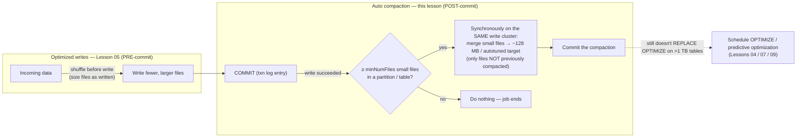

# Lesson 06 — Auto compaction

> **Track:** DBX Delta Optimization · **Lesson:** 06 · **Previous:** Lesson 05 — Optimized writes · **Next:** Lesson 07 — Auto optimize & file-size autotuning
> **Verified against:** Azure Databricks docs, June 2026.

## What it is (plain language)

**Auto compaction** is Delta automatically cleaning up after a write. Right **after a
write succeeds**, Delta looks at the table and, if a partition (or the table) now holds
too many small files, it **merges those small files into fewer, right-sized ones** — in
the *same job*, on the *same cluster*, before the job ends. You don't schedule anything;
the write itself triggers the tidy-up. It runs **synchronously on the write cluster,
post-commit**, and it only ever touches files that **haven't been compacted before**, so
it never re-chews work it already did.

The contrast with the previous lesson is the whole point:

- **Optimized writes (Lesson 05)** act **before the commit** — they shuffle the data so
  the write *emits* fewer, larger files in the first place. It's "size the files as
  you write them."
- **Auto compaction (this lesson)** acts **after the commit** — it's a safety net that
  *merges the small files that still ended up on disk*. It's "tidy up once the write
  landed."

They're complementary: optimized writes reduces how many small files appear; auto
compaction sweeps up whatever small files still slipped through. Both are part of the
"auto optimize" umbrella (Lesson 07).

- **One-line analogy:** Auto compaction is the **busboy who clears and consolidates
  tables right after each seating** — the meal (write) finishes, then, in the same shift,
  the small plates get stacked into a few trays so the next service starts clean. (Optimized
  writes is the host *seating fewer, fuller tables to begin with*.)
- **Concrete use case:** A streaming/`MERGE` pipeline that micro-batches into a `bronze`
  table every minute. Each batch commits a handful of tiny files; left alone they pile up
  into thousands. With `delta.autoOptimize.autoCompact = auto`, each write's tail merges
  the new small files into ~128 MB+ chunks, so the table stays query-fast **without a
  separate nightly OPTIMIZE job** doing all the work.

---

## Why it matters — the small-file problem keeps coming back

- **Streaming and `MERGE` create small files continuously.** Every micro-batch or merge
  commit adds a few files. Optimized writes helps at write time, but frequent small
  commits still accumulate small files. Auto compaction is the **automatic, per-write
  cleanup** that keeps the count under control between (or instead of) manual `OPTIMIZE`.
- **It runs where the data already is.** Because it executes on the **write cluster right
  after the commit**, the data is hot and the cluster is already up — no separate job, no
  separate cluster spin-up.
- **It's safe by construction.** It only compacts files **not previously compacted**, so
  re-running pipelines doesn't re-compact the same data; and it commits as a normal Delta
  transaction, so readers and streams see consistent snapshots throughout.

The decision rule to carry into an interview: **optimized writes sizes files *as you
write*; auto compaction merges the small files *after you write*. Turn on both for
high-churn tables; for `MERGE/UPDATE/DELETE` they're already on and can't be disabled.**

---

## The mechanism (mermaid)



---

## How it works — deep dive, sub-topic by sub-topic

### 1. What auto compaction does, and exactly when it runs

- **Mechanism:** Auto compaction combines small files **within partitions** *after a
  write succeeds*. It runs **synchronously on the write cluster, post-commit** — i.e. the
  write transaction commits first, then the same job, on the same cluster, performs a
  compaction pass and commits that as a second transaction before the job finishes.
- **Why:** It catches the small files a write leaves behind without you scheduling a
  separate maintenance job. The data and the cluster are already there, so cleanup is
  immediate and local.
- **Trade-off:** Because it's **synchronous**, it adds time to the **tail of the write
  job** — the job isn't "done" until the compaction pass finishes. For latency-critical
  micro-batches that's a real cost; for most pipelines the steady-state file hygiene is
  worth it. (If you want the maintenance to happen *off* the write path entirely, that's
  predictive optimization / background compaction — see sub-topics 6–7.)

```sql
-- Turn on auto compaction at the TABLE level (applies to all writers of this table).
-- 'auto' autotunes the target file size (recommended); see sub-topic 3 for the values.
ALTER TABLE main.delta_opt_demo.events
  SET TBLPROPERTIES ('delta.autoOptimize.autoCompact' = 'auto');
```

```python
# Same thing from PySpark via spark.sql(). Auto compaction is a TABLE PROPERTY,
# so any cluster/job that writes this table will run the post-write compaction pass.
spark.sql("""
  ALTER TABLE main.delta_opt_demo.events
  SET TBLPROPERTIES ('delta.autoOptimize.autoCompact' = 'auto')
""")
```

### 2. "Only compacts files not previously compacted" — why it's cheap to leave on

- **Mechanism:** Each compaction pass considers **only files that have not already been
  compacted by auto compaction**. Once a set of small files has been merged into a
  right-sized file, that output won't be picked up and re-merged on the next write.
- **Why:** This makes auto compaction **incremental and self-limiting** — leaving it on
  permanently doesn't cause the cluster to repeatedly rewrite the same data. It targets
  only the *new* small files each write produced.
- **Trade-off:** It's a *good-enough, local* cleanup, not a global re-layout. It won't go
  back and re-balance previously-compacted regions or recluster by query keys — that's
  what `OPTIMIZE` (Lesson 04) and liquid clustering (Lesson 08) are for.

### 3. The values: `auto`, `true`, `legacy`, `false`

- **Mechanism:** The behavior is selected by the value you set on the property/config:
  - **`auto`** — *recommended*. Turns auto compaction on **and autotunes the target file
    size** (it adapts the target rather than fixing it). Use this unless you have a reason
    not to.
  - **`true`** — on, with a **fixed 128 MB target** and **no dynamic sizing**.
  - **`legacy`** — an **alias for `true`** (same fixed-128 MB behavior).
  - **`false`** — **off**.
- **Why:** `auto` lets Delta pick a sensible target as the table grows instead of pinning
  every table to 128 MB; `true`/`legacy` give you the older, fixed behavior for
  compatibility; `false` opts a table out.
- **Trade-off:** `true`/`legacy` are predictable (always ~128 MB) but won't grow the
  target for large tables the way `auto` does. Prefer **`auto`** for new work.

```sql
-- The four values, side by side (set whichever you want on the table):
ALTER TABLE main.delta_opt_demo.events
  SET TBLPROPERTIES ('delta.autoOptimize.autoCompact' = 'auto');    -- recommended: on + autotuned target

-- 'true'   = on, FIXED 128 MB target, no dynamic sizing
-- 'legacy' = alias for 'true' (same fixed 128 MB behavior)
-- 'false'  = off
ALTER TABLE main.delta_opt_demo.events
  SET TBLPROPERTIES ('delta.autoOptimize.autoCompact' = 'false');   -- opt this table OUT
```

### 4. Table property vs session config (and the precedence to keep straight)

- **Mechanism:** Two ways to control it:
  - **Table property:** `delta.autoOptimize.autoCompact` — travels with the table; every
    writer of that table gets the same behavior.
  - **Session config:** `spark.databricks.delta.autoCompact.enabled` — set on the cluster/
    session; affects writes from *that* session.
- **Why:** The table property is the durable, per-table choice (best for production
  tables); the session config is handy for one-off jobs or to flip behavior cluster-wide
  without altering every table.
- **Trade-off:** Mixing both is the classic source of "why is compaction running?"
  confusion. Prefer the **table property** as the source of truth; reach for the session
  config deliberately.

```sql
-- SESSION-level switch (affects writes from THIS session/cluster).
-- Same value vocabulary as the table property: auto / true / legacy / false.
SET spark.databricks.delta.autoCompact.enabled = auto;
```

```python
# PySpark equivalent of the session config (cluster/session scope, not per-table).
spark.conf.set("spark.databricks.delta.autoCompact.enabled", "auto")
```

### 5. Tuning knobs: `maxFileSize` and `minNumFiles`

- **Mechanism:**
  - `spark.databricks.delta.autoCompact.maxFileSize` — the **target/cap for the
    compacted output file size**. (With `auto`, the target is autotuned; this knob lets
    you override the size auto compaction aims for.)
  - `spark.databricks.delta.autoCompact.minNumFiles` — the **minimum number of small
    files** that must exist in a partition (or the table) before a compaction pass is
    triggered. Below this threshold, auto compaction does nothing.
- **Why:** `minNumFiles` prevents compaction from firing on trivial writes (you don't
  want a rewrite every time two small files appear); `maxFileSize` lets you steer the
  output size to match your read patterns.
- **Trade-off:** Set `minNumFiles` **too low** → compaction fires constantly and adds
  latency to nearly every write; set it **too high** → small files accumulate longer
  before they're swept up. Tune to your commit cadence.

```sql
-- Don't compact until at least this many small files exist (avoid firing on tiny writes).
SET spark.databricks.delta.autoCompact.minNumFiles = 50;

-- Steer the target size of the compacted output files (here ~128 MB).
SET spark.databricks.delta.autoCompact.maxFileSize = 134217728;   -- 128 * 1024 * 1024 bytes
```

### 6. Always on for `MERGE` / `UPDATE` / `DELETE` (you can't disable it)

- **Mechanism:** Auto compaction **and** optimized writes are **always on for `MERGE`,
  `UPDATE`, and `DELETE`** operations — and this **cannot be disabled** for those
  operations.
- **Why:** Those operations are exactly the ones that produce lots of small files (they
  rewrite affected files row-group by row-group). Forcing the file-hygiene features on
  protects you from the small-file blowup that `MERGE`-heavy pipelines would otherwise hit.
- **Trade-off:** You can't opt a `MERGE`-heavy job out of the post-write compaction cost
  even if you wanted ultra-low latency — it's a deliberate guardrail, not a tunable.

```sql
-- This MERGE will rewrite affected files; auto compaction + optimized writes are
-- ALWAYS ON for MERGE/UPDATE/DELETE (can't be disabled) — small files get swept up.
MERGE INTO main.delta_opt_demo.events AS t
USING staged_updates AS s
  ON t.event_id = s.event_id
WHEN MATCHED THEN UPDATE SET *
WHEN NOT MATCHED THEN INSERT *;
-- No autoCompact property needed here: MERGE/UPDATE/DELETE get it automatically.
```

### 7. Background auto compaction for UC managed tables (no predictive optimization needed)

- **Mechanism:** For **Unity Catalog managed tables**, there is a **background auto
  compaction** mode that **does not require predictive optimization** to run.
- **Why:** It gives managed tables ongoing file hygiene even where predictive optimization
  isn't enabled — the platform can compact in the background rather than only on the
  synchronous write path.
- **Trade-off:** This is a **managed-table** capability. It is *distinct from* both the
  synchronous write-cluster auto compaction described above and from predictive
  optimization — see the independence point next.

### 8. Auto compaction and predictive optimization are INDEPENDENT

- **Mechanism:** **Auto compaction** runs **synchronously on the write cluster**;
  **predictive optimization** runs **asynchronously on serverless** compute (Lesson 09).
  They are **independent** — you can use either one alone, or both together.
- **Why:** They solve overlapping problems from different angles: auto compaction is
  immediate and local to the write; predictive optimization is a managed, asynchronous
  service that runs `OPTIMIZE`/`VACUUM`/`ANALYZE` on UC managed tables off the write path.
- **Trade-off:** Running both can mean some redundant work, but they coexist by design.
  Pick based on where you want the cost: on your write cluster (auto compaction) or on
  serverless, off the write path (predictive optimization).

### 9. Auto compaction does NOT replace `OPTIMIZE` on big tables

- **Mechanism:** Auto compaction (like optimized writes) **reduces** the small-file
  problem but does **not replace** a periodic `OPTIMIZE`. For tables **> 1 TB**, you still
  schedule `OPTIMIZE` (or let predictive optimization run it) to further consolidate, and
  you use **liquid clustering** for query-key colocation/skipping.
- **Why:** Auto compaction is a *local, per-write* sweep with a target size; it doesn't
  do global re-layout or clustering by your filter columns. Large tables still benefit
  from a full consolidation/clustering pass.
- **Trade-off:** Treat auto compaction as "keeps the table from degrading between
  `OPTIMIZE` runs," not "I never need `OPTIMIZE`." (Forward-ref: Lesson 04 `OPTIMIZE`,
  Lesson 07 auto optimize & autotuning, Lesson 09 predictive optimization.)

### 10. Migrating off the legacy config

- **Mechanism:** To migrate a table/cluster from the older fixed behavior to the modern
  default, **remove the session config** and **unset the table property**:
  - drop `spark.databricks.delta.autoCompact.enabled` from your cluster/session config, and
  - `ALTER TABLE t UNSET TBLPROPERTIES (delta.autoOptimize.autoCompact)`.
- **Why:** Clearing both removes the explicit (possibly `legacy`/`true`) setting so the
  table falls back to the platform default rather than the pinned 128 MB legacy behavior.
- **Trade-off:** Unsetting the property changes behavior for *all* writers of the table —
  do it deliberately and re-verify with `SHOW TBLPROPERTIES`.

```sql
-- Migration: stop pinning legacy/fixed behavior. (1) clear the session config, then
-- (2) unset the table property so the table uses the platform default.
SET spark.databricks.delta.autoCompact.enabled = false;   -- or remove it from cluster config entirely
ALTER TABLE main.delta_opt_demo.events
  UNSET TBLPROPERTIES (delta.autoOptimize.autoCompact);

-- Confirm the property is gone:
SHOW TBLPROPERTIES main.delta_opt_demo.events;
```

---

## Comparison table — optimized writes vs auto compaction

| | **Optimized writes** (Lesson 05) | **Auto compaction** (this lesson) |
| --- | --- | --- |
| **When it acts** | **Before** the commit (write-time) | **After** the commit (post-write) |
| **How** | Shuffles data so the write *emits* fewer, larger files | Merges small files *that landed* on disk, within partitions |
| **Where it runs** | On the write path, during the write | **Synchronously on the write cluster, post-commit** |
| **Property** | `delta.autoOptimize.optimizeWrite` | `delta.autoOptimize.autoCompact` |
| **Session config** | `spark.databricks.delta.optimizeWrite.enabled` | `spark.databricks.delta.autoCompact.enabled` |
| **Target size** | 128 MB when enabled | `auto` = autotuned · `true`/`legacy` = 128 MB |
| **Always on for `MERGE`/`UPDATE`/`DELETE`?** | **Yes** (can't disable) | **Yes** (can't disable) |
| **Replaces `OPTIMIZE`?** | No | No — still schedule `OPTIMIZE` on > 1 TB tables |

> Both are the two halves of "auto optimize" (Lesson 07). Optimized writes reduces how
> many small files *appear*; auto compaction merges the ones that *still do*.

---

## Uses, edge cases & limitations

**Uses (when to reach for it)**
- **Streaming / micro-batch ingestion** and **`MERGE`-heavy** pipelines that commit small
  files frequently — set `delta.autoOptimize.autoCompact = auto` so each write's tail
  merges the new small files.
- **Pair with optimized writes** on high-churn tables to attack small files from both
  sides (pre-write sizing + post-write cleanup).
- **UC managed tables** can also lean on **background auto compaction** for ongoing
  hygiene without predictive optimization.

**Edge cases an interviewer probes**
- **Latency-critical micro-batches** — auto compaction is *synchronous*, so it lengthens
  the write job's tail. If you need the lowest possible batch latency, consider moving
  maintenance off the write path (predictive optimization / background compaction) and
  raising `minNumFiles`.
- **`minNumFiles` too low** → compaction fires on nearly every write (constant overhead);
  **too high** → small files accumulate longer. Tune to commit cadence.
- **`MERGE`/`UPDATE`/`DELETE`** → auto compaction is **always on and can't be disabled**;
  don't expect to opt those operations out.
- **Big tables (> 1 TB)** → auto compaction alone is not enough; still run `OPTIMIZE`
  (and use liquid clustering for skipping).
- **Mixed table property + session config** → conflicting settings cause confusing
  behavior; make the table property the source of truth.

**Limitations**
- Auto compaction is a **local, per-write** sweep — it does **not** do global re-layout or
  cluster by query keys; it does **not replace `OPTIMIZE`** on large tables.
- It only compacts **files not previously compacted** — it won't re-balance already-
  compacted regions.
- It runs **synchronously on the write cluster** by default (extra write-tail latency);
  background/async behavior is a separate capability (managed-table background compaction
  / predictive optimization).
- `legacy` is just an **alias for `true`** (fixed 128 MB, no dynamic sizing) — not a
  different mode.

---

## Common gotchas

- **Optimized writes ≠ auto compaction.** Optimized writes acts **before** the commit
  (sizes files as written); auto compaction acts **after** the commit (merges what
  landed). Use both for high-churn tables.
- **It's synchronous.** Auto compaction runs on the **write cluster, post-commit**, so it
  adds latency to the tail of the write job — budget for it on tight micro-batch SLAs.
- **Prefer `auto`.** `auto` turns it on *and* autotunes the target size; `true`/`legacy`
  pin a fixed 128 MB; `false` is off.
- **`MERGE`/`UPDATE`/`DELETE` always compact.** You can't disable auto compaction (or
  optimized writes) for those operations.
- **Tune `minNumFiles` to your cadence.** Too low = constant rewrites; too high = small
  files linger.
- **It doesn't replace `OPTIMIZE`.** On tables > 1 TB still schedule `OPTIMIZE` (or use
  predictive optimization); use liquid clustering for query-key skipping.
- **Migrating off legacy?** Remove `spark.databricks.delta.autoCompact.enabled` **and**
  `ALTER TABLE … UNSET TBLPROPERTIES (delta.autoOptimize.autoCompact)`, then verify.
- **Auto compaction and predictive optimization are independent** — write-cluster
  (synchronous) vs serverless (asynchronous); use either or both.

---

## References

Official Azure Databricks documentation (verified June 2026):

- Configure Delta Lake to control data file size — **auto compaction** (`delta.autoOptimize.autoCompact`,
  `spark.databricks.delta.autoCompact.enabled`, the `auto`/`true`/`legacy`/`false` values,
  `autoCompact.maxFileSize` / `autoCompact.minNumFiles`, synchronous post-commit on the
  write cluster, only compacts files not previously compacted, always-on for
  `MERGE`/`UPDATE`/`DELETE`, background auto compaction for UC managed tables, migration
  from legacy, optimized writes vs auto compaction):
  <https://learn.microsoft.com/en-us/azure/databricks/tables/tune-file-size>
- OPTIMIZE — optimize data file layout (auto compaction reduces but does not replace
  `OPTIMIZE`; schedule `OPTIMIZE` on large tables):
  <https://learn.microsoft.com/en-us/azure/databricks/tables/operations/optimize>
- Predictive optimization (asynchronous, serverless maintenance on UC managed tables;
  independent of write-cluster auto compaction):
  <https://learn.microsoft.com/en-us/azure/databricks/optimizations/predictive-optimization>
- Best practices: Delta Lake (file-size / maintenance guidance):
  <https://learn.microsoft.com/en-us/azure/databricks/delta/best-practices>
