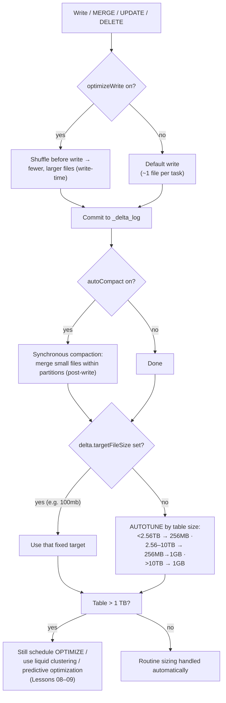

# Lesson 07 — Auto optimize (umbrella) & file-size autotuning

> **Track:** DBX Delta Optimization · **Lesson:** 07 · **Previous:** Lesson 06 — Auto compaction · **Next:** Lesson 08 — Liquid clustering
> **Verified against:** Azure Databricks docs, June 2026.

## What it is (plain language)

**"Auto optimize"** is an umbrella name for **two settings working together** that keep
your files a healthy size automatically, so you don't drown in tiny files:

1. **`delta.autoOptimize.optimizeWrite`** — the **write-time** half (Lesson 05). Before
   data lands, Spark shuffles it so each write produces **fewer, larger files**.
2. **`delta.autoOptimize.autoCompact`** — the **post-write** half (Lesson 06). After a
   write commits, a quick compaction pass merges leftover small files **within
   partitions**.

This lesson ties those two together and answers the next natural question: **how does
Databricks decide how big a "right-sized" file should be?** The answer is **target file
size** — either an explicit number you set (`delta.targetFileSize`), or, when you set
nothing, an **autotuned size based on how big the table is** (256 MB for most tables,
scaling up to 1 GB for very large ones).

- **One-line analogy:** Auto optimize is the **self-cleaning kitchen**. Optimized writes
  is plating food onto a few big plates instead of dozens of tiny ramekins (write-time);
  auto compaction is the busser who clears and consolidates leftover small plates right
  after the meal (post-write). **Target file size** is the rule "use dinner plates, not
  saucers" — and **autotuning** is "the bigger the banquet, the bigger the platters."
- **Concrete use case:** A streaming-fed `bronze.events` table getting hundreds of tiny
  micro-batch commits per hour. Turn on **both** auto-optimize settings so each commit
  writes larger files *and* gets compacted right after — the small-file problem never
  builds up. For the table's *long-term* consolidation and skipping you still schedule
  `OPTIMIZE` / use liquid clustering (below).

---

## Why it matters — routine small-file control, automatically

- **The small-file problem never sleeps.** Streaming and frequent MERGE/UPDATE/DELETE
  workloads commit constantly; without help, every commit drips more tiny files, and
  scans + file listing get slower and pricier over time.
- **Auto optimize handles the routine case for you.** Optimized writes prevents many
  small files at the source; auto compaction mops up the rest right after each write —
  no separate job, no scheduling.
- **But it REDUCES, it does not REPLACE, `OPTIMIZE`.** Auto optimize keeps files from a
  *single* write healthy; it does **not** globally consolidate the whole table or give
  you data-skipping locality. **For tables larger than 1 TB, schedule `OPTIMIZE`** to
  further consolidate, and **prefer liquid clustering** when you need files laid out for
  fast filtering (Lesson 08).
- **File size is a real tuning knob.** Too small → metadata bloat and slow scans; too
  big → expensive rewrites on small updates and less effective skipping. Databricks
  picks a sensible target automatically, but you can override it per table.

The decision rule to carry into an interview: **let auto optimize + autotuning handle
day-to-day file sizing; reach for scheduled `OPTIMIZE` / liquid clustering / predictive
optimization for whole-table consolidation and query-layout — especially past 1 TB.**

---

## The mechanism (mermaid)



---

## How it works — deep dive, sub-topic by sub-topic

### 1. "Auto optimize" = optimizeWrite + autoCompact (the umbrella term)

- **Mechanism:** "Auto optimize" is not a single switch — it's the **pair** of
  `delta.autoOptimize.optimizeWrite` (write-time shuffle → fewer, larger files; Lesson
  05) and `delta.autoOptimize.autoCompact` (post-commit compaction within partitions;
  Lesson 06). They run at **different moments** of the same write: one *before* data is
  written, one *after* the commit succeeds.
- **Why:** Together they attack the small-file problem from both ends. Optimized writes
  prevents most tiny files at the source; auto compaction cleans up whatever small files
  remain (e.g. the last under-filled file of a write, or many tiny commits).
- **Trade-off:** It's a **legacy umbrella term** — modern guidance is to think in terms
  of the individual settings (and, for new tables, liquid clustering + predictive
  optimization). The two settings are **independent**: you can enable either alone.

```sql
-- Enable BOTH halves of "auto optimize" on a table (the umbrella, set explicitly).
ALTER TABLE main.delta_opt_demo.events
  SET TBLPROPERTIES (
    'delta.autoOptimize.optimizeWrite' = 'true',   -- write-time: fewer, larger files (Lesson 05)
    'delta.autoOptimize.autoCompact'   = 'auto'    -- post-write: compact small files; 'auto' autotunes size
  );

-- Confirm both are set.
SHOW TBLPROPERTIES main.delta_opt_demo.events;
```

```python
# Session-level equivalents (apply to writes from this Spark session).
spark.conf.set("spark.databricks.delta.optimizeWrite.enabled", "true")   # write-time half
spark.conf.set("spark.databricks.delta.autoCompact.enabled",  "auto")    # post-write half ('auto' autotunes)
```

### 2. They REDUCE but don't REPLACE OPTIMIZE — schedule OPTIMIZE for tables > 1 TB

- **Mechanism:** Optimized writes + auto compaction keep the files from *each write*
  healthy, but they operate **per write / within partitions** — they don't do a global,
  whole-table consolidation, and they don't give you data-skipping **locality** on your
  filter columns. `OPTIMIZE` (and liquid clustering) do that.
- **Why:** On a large, long-lived table, many independent writes still leave the table as
  a whole sub-optimal (lots of medium files, no colocation by query keys). A periodic
  `OPTIMIZE` consolidates across the table; liquid clustering lays data out for skipping.
- **Trade-off / rule:** **For tables larger than 1 TB, schedule `OPTIMIZE`** to further
  consolidate — and **prefer liquid clustering** for the skipping benefit (Lesson 08).
  On UC managed tables, **predictive optimization** can run `OPTIMIZE` for you (Lesson 09).

```sql
-- Auto optimize handles routine sizing; for big tables ALSO consolidate periodically.
-- Scheduled OPTIMIZE compacts across the whole table (or a partition subset).
OPTIMIZE main.delta_opt_demo.events
WHERE event_date >= DATE'2026-06-01';   -- scope to recent data to keep the job cheap

-- For NEW tables, prefer liquid clustering so data is also laid out for fast filtering
-- (same OPTIMIZE triggers clustering incrementally). See Lesson 08.
ALTER TABLE main.delta_opt_demo.events CLUSTER BY (event_type, event_date);
```

### 3. `delta.targetFileSize` — the explicit target

- **Mechanism:** `delta.targetFileSize` sets the **size each file should aim for**. You
  can give it a human-readable size like `'100mb'` or a raw byte count like `104857600`
  (= 100 MB). Its **default is None** (unset → autotuning takes over, next sub-topic).
  When set, the target is honored by **OPTIMIZE, liquid clustering, auto compaction, and
  optimized writes**.
- **Why:** Sometimes you *know* the right size — e.g. you want larger files for a
  scan-heavy table, or you want to pin a stable size on a huge table so it doesn't keep
  small files (see autotuning's caveat below).
- **Trade-off / gotcha:** On **UC managed tables with a SQL warehouse, or DBR 11.3 LTS+**,
  **only `OPTIMIZE` respects `targetFileSize`** — the write-time / auto-compaction paths
  use the automatic sizing there. So setting it doesn't always change every write path.

```sql
-- Pin an explicit target file size. Accepts '100mb' or a raw byte count (104857600).
ALTER TABLE main.delta_opt_demo.events
  SET TBLPROPERTIES ('delta.targetFileSize' = '128mb');   -- honored by OPTIMIZE, LC, autoCompact, optimizeWrite

-- Equivalent using raw bytes (128 MB = 134217728). Same effect.
ALTER TABLE main.delta_opt_demo.events
  SET TBLPROPERTIES ('delta.targetFileSize' = '134217728');
```

```python
# Set the same property from PySpark via spark.sql().
spark.sql("""
  ALTER TABLE main.delta_opt_demo.events
  SET TBLPROPERTIES ('delta.targetFileSize' = '128mb')   -- explicit; default is None (autotune)
""")
```

### 4. File-size autotuning by table size (when no explicit target)

- **Mechanism:** When `delta.targetFileSize` is **not set**, Databricks **autotunes the
  target based on the table's size**:
  - **< 2.56 TB** → **256 MB** target
  - **2.56–10 TB** → target **grows linearly from 256 MB to 1 GB**
  - **> 10 TB** → **1 GB** target
- **Why:** Small/medium tables want smaller files (so updates and skipping stay cheap);
  very large tables want bigger files (so the file *count* and metadata stay manageable).
  Scaling the target with table size balances both automatically.
- **Trade-off / the important caveat:** A **growing target does NOT re-optimize existing
  files**. As a table crosses size thresholds, the target goes up, but files already
  written stay their old size. So **large tables may keep some small files** unless you
  set a **fixed `targetFileSize`** (or run `OPTIMIZE` to rewrite them). This is a classic
  interview gotcha.

```sql
-- Autotuning is the DEFAULT (no targetFileSize set) — nothing to enable.
-- To AVOID the "growing target leaves old small files" caveat on a huge table,
-- pin a fixed target and OPTIMIZE so existing files are rewritten to it:
ALTER TABLE main.delta_opt_demo.events
  SET TBLPROPERTIES ('delta.targetFileSize' = '512mb');   -- fixed target for a very large table
OPTIMIZE main.delta_opt_demo.events;                      -- rewrite existing files to the new target
```

### 5. `delta.tuneFileSizesForRewrites`

- **Mechanism:** `delta.tuneFileSizesForRewrites` biases file sizing toward
  **rewrite-friendly** sizes — useful for tables that see frequent rewrites (heavy
  MERGE/UPDATE/DELETE), where smaller files make each rewrite cheaper.
- **Why:** A table that is constantly updated benefits from files that are quick to
  rewrite; this property lets sizing lean that way rather than purely toward scan-optimal
  large files.
- **Trade-off:** It's a niche tuning knob — most workloads are fine with autotuning or a
  single `targetFileSize`. Reach for it only when rewrite cost is your dominant problem.

```sql
-- For very rewrite-heavy tables (frequent MERGE/UPDATE/DELETE), bias toward
-- rewrite-friendly file sizes. Most tables don't need this — autotuning is enough.
ALTER TABLE main.delta_opt_demo.events
  SET TBLPROPERTIES ('delta.tuneFileSizesForRewrites' = 'true');
```

### 6. UC managed tables autotune file size by default; background auto compaction

- **Mechanism:** **Unity Catalog managed tables** get **automatic file-size tuning by
  default** (DBR 11.3 LTS+ / SQL warehouse). Managed tables can also benefit from
  **background auto compaction**, which does **not** require predictive optimization.
- **Why:** It removes one more tuning decision on the recommended table type — you create
  a managed table and the platform sizes files sensibly without any properties.
- **Trade-off:** This is a **managed-table** benefit; EXTERNAL tables don't get the same
  automatic behavior. Background auto compaction (on the write cluster) and predictive
  optimization (async, serverless, Lesson 09) are **independent** — you can use either or
  both.

```sql
-- On UC MANAGED tables, file-size tuning is automatic by default (DBR 11.3 LTS+ /
-- SQL warehouse). Verify properties / predictive-optimization status:
DESCRIBE EXTENDED main.delta_opt_demo.events;   -- table properties + Predictive Optimization field
SHOW TBLPROPERTIES main.delta_opt_demo.events;  -- see autoOptimize.* and targetFileSize if set
```

### 7. Making the relationship crisp (where auto optimize ends and the rest begins)

- **Auto optimize** (optimizeWrite + autoCompact) → handles **routine, automatic
  small-file control** on every write. Set-and-forget for streaming / frequent DML.
- **Scheduled `OPTIMIZE`** → **whole-table consolidation**; required past **1 TB** to keep
  the table globally tidy (auto optimize only fixes per-write / per-partition).
- **Liquid clustering** (Lesson 08) → lays data out for **fast filtering** (skipping) and
  consolidates incrementally via `OPTIMIZE`; the modern default for new tables.
- **Predictive optimization** (Lesson 09) → on UC managed tables, runs `OPTIMIZE` /
  `VACUUM` / `ANALYZE` **for you** — fully managed maintenance.

> Decision rule: auto optimize for the day-to-day; OPTIMIZE / liquid clustering /
> predictive optimization for whole-table layout and the long-tail consolidation.

---

## Comparison table — who does what

| Lever | When it runs | Scope | Honors `targetFileSize`? | Reach for it when |
| --- | --- | --- | --- | --- |
| **`optimizeWrite`** (Lesson 05) | Write-time (shuffle before write) | This write | Yes (note: managed/SQL-warehouse path may autosize) | Prevent small files at the source; partitioned writes |
| **`autoCompact`** (Lesson 06) | Post-commit, synchronous on write cluster | Within partitions of this write | Yes (`'auto'` autotunes) | Mop up small files after frequent commits/streaming |
| **`delta.targetFileSize`** | Setting consumed by the above + OPTIMIZE/LC | Per table | — (it *is* the target) | You know the right size, or to pin a fixed size on a huge table |
| **Autotuning** (default) | When no `targetFileSize` set | Per table, by table size | n/a | Let the platform size files (256 MB → 1 GB) |
| **Scheduled `OPTIMIZE`** (Lesson 04) | On demand / scheduled | Whole table or `WHERE` subset | Yes | Whole-table consolidation; **tables > 1 TB** |
| **Liquid clustering** (Lesson 08) | `OPTIMIZE` triggers it | Whole table, by clustering keys | Yes | Lay data out for fast filtering on new tables |
| **Predictive optimization** (Lesson 09) | Async, serverless, automatic | Whole table (UC managed) | via OPTIMIZE | Hands-off maintenance on UC managed tables |

---

## Uses, edge cases & limitations

**Uses (when to reach for each)**
- **Both auto-optimize settings:** streaming / frequent MERGE-UPDATE-DELETE tables where
  many small commits would otherwise pile up small files. Set-and-forget.
- **`delta.targetFileSize`:** when you know the ideal size, or to **pin a fixed size on a
  very large table** so a growing autotune target doesn't leave old small files behind.
- **Autotuning (default):** virtually all tables — leave `targetFileSize` unset and let
  the platform scale 256 MB → 1 GB with table size.
- **`tuneFileSizesForRewrites`:** rewrite-heavy tables where each MERGE/UPDATE rewrite
  cost dominates.

**Edge cases an interviewer probes**
- **Table grows past a size threshold** → autotune target rises, but **existing files
  are NOT re-optimized**; the table keeps old small files until you `OPTIMIZE` or pin a
  fixed `targetFileSize`.
- **You set `targetFileSize` on a UC managed table + SQL warehouse / DBR 11.3 LTS+ and
  nothing changes on writes** → only **`OPTIMIZE`** respects `targetFileSize` there; the
  write/auto-compaction paths autosize. Run `OPTIMIZE` to apply it.
- **Tiny table** → autotune still targets 256 MB; auto compaction won't fire unless the
  small-file count threshold is met (`autoCompact.minNumFiles`).
- **Table > 1 TB and you rely only on auto optimize** → it won't globally consolidate;
  schedule `OPTIMIZE` / use liquid clustering.
- **MERGE/UPDATE/DELETE** → optimized writes + auto compaction are **always on** for these
  (can't disable) — file sizing already applies even if you didn't set the properties.

**Limitations**
- Auto optimize **reduces but does not replace `OPTIMIZE`** — no whole-table consolidation
  or skipping locality on its own.
- A **growing autotune target does not re-optimize existing files** (large tables may
  keep small files unless you set a fixed `targetFileSize`).
- On **UC managed tables with SQL warehouse / DBR 11.3 LTS+, only `OPTIMIZE` respects
  `targetFileSize`** (write-time / auto-compaction paths autosize).
- Automatic file-size tuning by default is a **UC managed-table** behavior (DBR 11.3 LTS+
  / SQL warehouse); EXTERNAL tables differ.

---

## Common gotchas

- **"Auto optimize" is two settings, not one** — `optimizeWrite` (write-time) +
  `autoCompact` (post-write). Know which moment each runs at.
- **It reduces, doesn't replace, `OPTIMIZE`.** For tables **> 1 TB**, schedule `OPTIMIZE`
  (and prefer liquid clustering for skipping).
- **The autotune target grows but doesn't backfill.** A big table can keep small files
  from when it was smaller — pin a fixed `targetFileSize` and `OPTIMIZE` to rewrite them.
- **`targetFileSize` isn't honored everywhere on managed tables.** On UC managed + SQL
  warehouse / DBR 11.3 LTS+, **only `OPTIMIZE`** respects it; the rest autosize.
- **Default is autotuning, not a fixed size.** `delta.targetFileSize` defaults to None —
  don't assume 128 MB everywhere (that's the optimized-writes / `autoCompact='true'`
  target, not the table-size autotune).
- **MERGE/UPDATE/DELETE already optimize writes + auto compact** (always on) — you don't
  need to enable the properties for those operations to get file sizing.
- **For new tables, think liquid clustering + predictive optimization** — auto optimize is
  routine plumbing; the modern layout/maintenance story is Lessons 08–09.

---

## References

Official Azure Databricks documentation (verified June 2026):

- Configure Delta Lake to control data file size — auto optimize (optimizeWrite +
  autoCompact), `delta.targetFileSize`, file-size autotuning by table size
  (256 MB → 1 GB), `delta.tuneFileSizesForRewrites`, UC managed automatic tuning,
  background auto compaction, "reduce but don't replace OPTIMIZE" / >1 TB guidance:
  <https://learn.microsoft.com/en-us/azure/databricks/tables/tune-file-size>
- OPTIMIZE — optimize data file layout (whole-table consolidation, `WHERE` scoping,
  honoring `targetFileSize`):
  <https://learn.microsoft.com/en-us/azure/databricks/tables/operations/optimize>
- Use liquid clustering for tables (modern layout for skipping; `CLUSTER BY`):
  <https://learn.microsoft.com/en-us/azure/databricks/tables/clustering>
- Predictive optimization (automatic OPTIMIZE/VACUUM/ANALYZE on UC managed tables):
  <https://learn.microsoft.com/en-us/azure/databricks/optimizations/predictive-optimization>
- Best practices: Delta Lake (file sizing & maintenance guidance):
  <https://learn.microsoft.com/en-us/azure/databricks/delta/best-practices>
