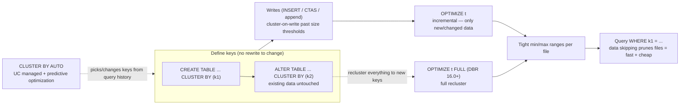

# Lesson 08 — Liquid clustering

> **Track:** DBX Delta Optimization · **Lesson:** 08 · **Previous:** Lesson 07 — Auto optimize (umbrella) · **Next:** Lesson 09 — Predictive optimization
> **Verified against:** Azure Databricks docs, June 2026 (`/tables/clustering`, updated 2026-06-23).

## What it is (plain language)

**Liquid clustering** is the modern way to lay out a Delta table so queries are fast.
You name up to **four columns** you filter or join on most (`CLUSTER BY (col1, col2)`),
and Databricks keeps rows with similar values **physically near each other** in the
same files. That tight layout is what lets **data skipping** prune files the query
can't possibly need (see Lesson 03). It is the single replacement for the two older
layout tools — **partitioning** and **Z-ordering** — and it fixes their biggest pain:
you can **change the clustering columns at any time without rewriting existing data**.

- **One-line analogy:** Liquid clustering is like **re-shelving a library by the labels
  people actually search for** — and you can re-shelve later without emptying the
  building. Partitioning is like nailing the shelves to the floor on day one; if the
  search habits change, you have to tear the room apart to move them.
- **Concrete use case:** A fast-growing `events` table you filter by `event_type` and
  `event_date`. `CLUSTER BY (event_type, event_date)` colocates those rows so a query
  for one event type on one day reads a handful of files instead of the whole table —
  and six months later you can switch the keys to `(customer_id, event_date)` with a
  single `ALTER TABLE`, no full rewrite.

---

## Why it matters — the headline benefits

- **No upfront, irreversible guess.** With partitioning you committed to a column at
  `CREATE TABLE`; changing it meant rewriting the entire table. Liquid clustering lets
  you **redefine the keys anytime** and only re-lay-out data incrementally.
- **Built for high-cardinality and skew.** Partitioning on `customer_id` or a timestamp
  produces a *partition explosion* — millions of tiny directories and tiny files.
  Liquid clustering is designed for exactly those columns.
- **Incremental, cheap maintenance.** Plain `OPTIMIZE` only reorganizes new/changed
  data, so routine upkeep stays fast — unlike `ZORDER`, which can rewrite far more.
- **It's the default recommendation.** Databricks recommends liquid clustering for
  **all new Delta tables** (and managed Iceberg in preview), including **streaming
  tables and materialized views**.

> **The one rule to remember:** Liquid clustering is **not compatible** with
> partitioning or `ZORDER`. Use it *instead of* them — never alongside.

---

## The mechanism (mermaid)



---

## How it works — deep dive (sub-topic by sub-topic)

### 1. `CLUSTER BY` vs `CLUSTER BY AUTO`

- **Mechanism — `CLUSTER BY (cols)` (manual):** You choose up to 4 columns. Databricks
  groups rows by those keys on write (past a size threshold) and on `OPTIMIZE`.
- **Mechanism — `CLUSTER BY AUTO`:** Databricks analyzes the table's **query history**
  and chooses (and later *changes*) the clustering keys for you, cost-aware. Requires
  **DBR 15.4 LTS+**, a **Unity Catalog managed table**, and **predictive optimization**
  enabled — it's what drives automatic key selection.
- **Why:** Manual is right when you already know your filter/join columns. AUTO is right
  when access patterns drift and you want the platform to keep up without you re-tuning.
- **Trade-off:** AUTO removes the guesswork but only works on UC managed tables with
  predictive optimization; manual works anywhere liquid clustering is supported.

```sql
-- Manual: you pick the keys (choose the columns you filter/join on most)
CREATE OR REPLACE TABLE catalog.schema.events (
  event_id    BIGINT,
  event_type  STRING,
  event_date  DATE,
  customer_id BIGINT
)
CLUSTER BY (event_type, event_date);   -- up to 4 keys; CLUSTER BY comes after the column list

-- Automatic: Databricks chooses/maintains keys from query history
-- (UC managed table + predictive optimization required)
ALTER TABLE catalog.schema.events CLUSTER BY AUTO;
SHOW TBLPROPERTIES catalog.schema.events;   -- look for clusterByAuto = true
```

```python
# PySpark / DeltaTable API (DBR 14.3 LTS+ for the DataFrame/DeltaTable clustering API)
from delta.tables import DeltaTable

# Create a clustered table with the DeltaTable builder
(DeltaTable.create(spark)
    .tableName("catalog.schema.events")
    .addColumn("event_id", "BIGINT")
    .addColumn("event_type", "STRING")
    .addColumn("event_date", "DATE")
    .addColumn("customer_id", "BIGINT")
    .clusterBy("event_type", "event_date")   # the clustering keys
    .execute())

# Or cluster on write straight from a DataFrame
(df.write
   .clusterBy("event_type", "event_date")    # write-time clustering keys
   .saveAsTable("catalog.schema.events"))

# Automatic key selection from a DataFrame write
(df.write
   .option("clusterByAuto", "true")          # let Databricks choose the keys
   .saveAsTable("catalog.schema.events"))
```

### 2. Choosing keys (≤ 4) and key requirements

- **Mechanism:** Up to **4 clustering keys**. Keys must have **statistics collected**
  (the first 32 columns by default), because skipping relies on per-file min/max stats.
- **Supported types:** Date, Timestamp, TimestampNTZ (14.3+), String, the integer
  family (Integer/Long/Short/Byte), Float/Double/Decimal — and **struct fields via dot
  notation** (`CLUSTER BY (address.city)`). **Not** complex types (Map/Array/Variant).
- **Why:** Pick the columns that appear most in `WHERE`/`JOIN`. High-cardinality is a
  *strength* here (unlike partitioning). For tables under ~10 TB, **fewer keys is often
  better** — too many keys can dilute the benefit for single-column filters.
- **Trade-off:** More keys spreads the colocation budget thinner; order matters less
  than with Z-order but still favor your most-selective filter column.

```sql
-- Struct fields are valid clustering keys (partitioning can't do this)
CREATE OR REPLACE TABLE catalog.schema.web_events (
  event_id BIGINT,
  payload  STRUCT<city: STRING, ts: TIMESTAMP>
)
CLUSTER BY (payload.city, payload.ts);   -- dot notation into a struct
```

### 3. Triggering clustering: incremental `OPTIMIZE` vs `OPTIMIZE FULL`

- **Mechanism — `OPTIMIZE t` (incremental):** Reclusters only the data that needs it
  (new/changed files). Cheap to run often. This is the routine maintenance command.
- **Mechanism — `OPTIMIZE t FULL` (DBR 16.0+):** Forces a **full recluster of all
  data**. Run it the first time you enable clustering on an existing table, or right
  after you **change the keys**, so existing data is laid out to the new keys. Can take
  hours on a large table. `OPTIMIZE t FULL WHERE <pred>` (DBR 18.1+) reclusters a subset.
- **Why:** Clustering-on-write only kicks in past a size threshold (below), so not every
  write is fully clustered. Regular `OPTIMIZE` closes the gap; `OPTIMIZE FULL` re-lays
  out history after a key change.
- **Trade-off:** Incremental is cheap but won't retro-fix old data to new keys; FULL is
  thorough but expensive — schedule it deliberately, not on every run.

```sql
-- Incremental: cheap, run frequently (every 1-2h for high-churn tables)
OPTIMIZE catalog.schema.events;

-- Full recluster: run after FIRST enabling clustering or after CHANGING keys (DBR 16.0+)
OPTIMIZE catalog.schema.events FULL;

-- Partial full recluster of a slice (DBR 18.1+)
OPTIMIZE catalog.schema.events FULL WHERE event_date >= '2026-01-01';
```

```python
# PySpark equivalent of incremental OPTIMIZE
from delta.tables import DeltaTable
DeltaTable.forName(spark, "catalog.schema.events").optimize().executeCompaction()
```

### 4. Changing keys with NO rewrite (the headline)

- **Mechanism:** `ALTER TABLE t CLUSTER BY (newcols)` changes the *clustering definition*
  in metadata. **Existing data is left exactly where it is** — only future writes and the
  next `OPTIMIZE` use the new keys. Run `OPTIMIZE … FULL` when you want history reclustered.
- **Why:** This is what partitioning could never do. Your access patterns change; your
  layout can follow without a full table rewrite.
- **Trade-off:** Until you run `OPTIMIZE FULL`, old data still reflects the old keys, so
  queries on the new keys won't get the full skipping benefit on historical data yet.

```sql
-- Step 1: change the clustering keys -- metadata only, existing files NOT rewritten
ALTER TABLE catalog.schema.events CLUSTER BY (customer_id, event_date);

-- Step 2: new writes + incremental OPTIMIZE use the new keys (cheap)
OPTIMIZE catalog.schema.events;

-- Step 3 (optional): recluster ALL historical data to the new keys (DBR 16.0+)
OPTIMIZE catalog.schema.events FULL;

-- Stop clustering entirely (existing data untouched)
ALTER TABLE catalog.schema.events CLUSTER BY NONE;
```

### 5. Clustering-on-write thresholds

- **Mechanism:** Some write operations cluster data as they write (INSERT INTO, CTAS,
  RTAS, COPY INTO from Parquet, append) — but **only past a size threshold** that scales
  with the number of keys. Below the threshold, the write skips clustering for speed.
- **Thresholds (UC managed / other Delta):** 1 key 64 MB / 256 MB · 2 keys 256 MB / 1 GB
  · 3 keys 512 MB / 2 GB · 4 keys 1 GB / 4 GB.
- **Why / trade-off:** Because small writes aren't fully clustered, you must **run
  `OPTIMIZE` frequently** (every 1–2 h for high-churn tables) or rely on **predictive
  optimization** on managed tables to do it for you.

### 6. Converting a partitioned table to liquid clustering

- **Mechanism:** `ALTER TABLE t REPLACE PARTITIONED BY WITH CLUSTER BY [(cols)|AUTO]`
  (DBR 18.1+) swaps Hive partitioning for liquid clustering in place.
- **Why:** Migrate legacy partitioned tables onto the modern layout without a manual
  rebuild. Follow with `OPTIMIZE … FULL` to recluster existing data.

```sql
-- Convert an existing partitioned table to liquid clustering (DBR 18.1+)
ALTER TABLE catalog.schema.events REPLACE PARTITIONED BY WITH CLUSTER BY (event_type, event_date);
OPTIMIZE catalog.schema.events FULL;   -- recluster the historical data to the new layout
```

### 7. Protocol upgrade (and why you can't undo it)

- **Mechanism:** Enabling liquid clustering upgrades the table to **Delta writer v7 /
  reader v3** (deletion vectors, row tracking, checkpoint V2 by default).
- **Why / limitation:** Old Delta clients that don't support reader v3 **cannot read**
  the table, and you **cannot downgrade** the protocol. Confirm your readers (external
  engines, old connectors) support it before enabling on a shared table.

### 8. Inspecting clustering state

```sql
DESCRIBE DETAIL catalog.schema.events;     -- clusteringColumns shows the active keys
DESCRIBE HISTORY catalog.schema.events;    -- see CLUSTER BY / OPTIMIZE operations + metrics
SHOW TBLPROPERTIES catalog.schema.events;  -- clusterByAuto = true when AUTO is on
```

---

## Comparison table — liquid clustering vs partitioning vs Z-order

| Aspect | Liquid clustering | Partitioning (`PARTITIONED BY`) | Z-order (`ZORDER BY`) |
| --- | --- | --- | --- |
| What it does | Colocates rows by up to 4 keys; the modern layout | Splits data into directories by column value | Colocates rows on a space-filling curve via OPTIMIZE |
| Change keys later | **Yes — no rewrite of existing data** | No — requires full table rewrite | Re-run with new columns (rewrites data) |
| High-cardinality keys | **Designed for it** | Partition explosion → tiny files | OK but per-extra-column benefit drops |
| Maintenance | `OPTIMIZE` (incremental) / `OPTIMIZE FULL` | Manual; compaction within partitions | `OPTIMIZE … ZORDER` (not idempotent) |
| Struct fields as keys | **Yes** (dot notation) | No (top-level cols only) | Yes (with stats) |
| Combine with the others | **No** — replaces both | Z-order works *within* partitions | Z-order can't target partition cols |
| Min runtime | GA **DBR 15.4 LTS+** (API 14.3+) | All DBR | All DBR |
| Recommendation | **Default for all new tables** | Only tables > 1 TB / legacy | Legacy; prefer liquid clustering |

---

## Uses, edge cases & limitations

**Uses (reach for it when):**
- **All new Delta tables** — Databricks' default layout recommendation.
- Fast-growing tables filtered/joined on a few columns (events, orders, telemetry).
- High-cardinality filter columns (`customer_id`, `device_id`) that would explode partitions.
- Streaming tables and materialized views.
- **When NOT to:** truly tiny tables (the engine just reads them — clustering adds
  little) or external tables you need old Delta clients to read (protocol upgrade blocks
  them). Partitioning still has a niche for tables **> 1 TB** with a low-cardinality
  filter that benefits from physical separation, but liquid clustering is preferred.

**Edge cases (interviewers probe these):**
- **Changing keys:** `ALTER TABLE … CLUSTER BY` is metadata-only; old data stays on the
  old layout until `OPTIMIZE FULL`. Don't expect instant skipping on history.
- **Too many keys:** for tables under ~10 TB, 3–4 keys can dilute single-column-filter
  skipping; start with your most selective 1–2 keys.
- **Tiny / sub-threshold writes:** clustering-on-write is skipped below the size
  threshold, so frequent small writes need regular `OPTIMIZE` (or predictive optimization).
- **Concurrent writes:** `OPTIMIZE` runs under snapshot isolation — readers and streams
  aren't blocked and no data changes; concurrent appends are fine.
- **Stats on long strings:** stats are truncated on long strings; a long-string key
  skips poorly — prefer shorter, selective columns.

**Limitations (honest constraints):**
- **≤ 4 clustering keys.**
- **Incompatible with partitioning AND `ZORDER`** — use instead of, never alongside.
- **Protocol v7 (writer) / v3 (reader); no downgrade** — old clients can't read.
- **`CLUSTER BY AUTO`** requires **DBR 15.4 LTS+, a UC managed table, and predictive
  optimization**.
- **`OPTIMIZE FULL`** needs **DBR 16.0+**; `OPTIMIZE FULL WHERE` and `REPLACE
  PARTITIONED BY WITH CLUSTER BY` need **DBR 18.1+**.
- Keys must have **stats** (first 32 columns by default); **not** complex types.

---

## Common gotchas

- **Don't mix layouts.** Adding `ZORDER` or `PARTITIONED BY` to a clustered table is an
  error — liquid clustering replaces both.
- **`OPTIMIZE` after a key change only touches new data.** Use `OPTIMIZE … FULL` to
  recluster existing data to the new keys.
- **Clustering-on-write isn't every write.** Below the size threshold, writes don't
  cluster — schedule `OPTIMIZE` regularly or enable predictive optimization.
- **The protocol upgrade is one-way.** Verify all readers support reader v3 before
  enabling on a shared/external table; you can't downgrade.
- **GA is DBR 15.4 LTS+** (not 15.2). `OPTIMIZE FULL` is DBR 16.0+. State the runtime.
- **AUTO is not magic anywhere.** It needs a UC managed table + predictive optimization;
  on an external table it won't pick keys for you.

---

## References (cited Azure Databricks docs, June 2026)

- Liquid clustering — <https://learn.microsoft.com/en-us/azure/databricks/tables/clustering>
- OPTIMIZE (compaction) — <https://learn.microsoft.com/en-us/azure/databricks/tables/operations/optimize>
- OPTIMIZE SQL reference — <https://learn.microsoft.com/en-us/azure/databricks/sql/language-manual/delta-optimize>
- When to partition tables — <https://learn.microsoft.com/en-us/azure/databricks/tables/partitions>
- Predictive optimization — <https://learn.microsoft.com/en-us/azure/databricks/optimizations/predictive-optimization>
- Best practices: Delta Lake — <https://learn.microsoft.com/en-us/azure/databricks/delta/best-practices>
