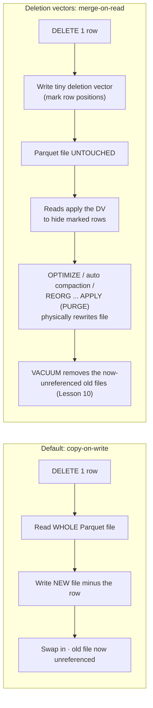

# Lesson 09 — Deletion vectors (merge-on-read)

> **Track:** DBX Delta Optimization · **Lesson:** 09 · **Previous:** Lesson 08 — Liquid clustering · **Next:** Lesson 10 — VACUUM, time travel & retention
> **Verified against:** Azure Databricks docs, June 2026 (`/tables/features/deletion-vectors`, updated 2026-06-11).

## What it is (plain language)

A **deletion vector** is a tiny side-file that records *"these row positions in this
Parquet file are no longer here"* — without touching the Parquet file itself.

By default, Delta uses **copy-on-write**: to delete or update even a single row,
Databricks must read the *entire* Parquet file that holds it, write a brand-new file
**minus** that row, and swap it in. One changed row can rewrite hundreds of megabytes.

Turn deletion vectors on and Delta switches to **merge-on-read**: a `DELETE`, `UPDATE`,
or `MERGE` just **marks** the affected rows as gone (a "soft delete") and leaves the
big data file in place. The cost moves to *read* time — every reader applies the
deletion vector to hide the marked rows and return the correct, current state.

- **One-line analogy:** Copy-on-write is **photocopying a 300-page book to remove one
  sentence**. A deletion vector is a **sticky note on the cover that says "skip line 12
  on page 88"** — the book is untouched; anyone reading it just honors the note.
- **Concrete use case:** A GDPR/CDC pipeline that does many small `DELETE`s and `MERGE`
  upserts into a large `customers` table all day. With copy-on-write, each delete
  rewrites whole files (slow, expensive, lots of versions to vacuum later). With
  deletion vectors, those writes are near-instant; you periodically run `OPTIMIZE`
  (or `REORG … APPLY (PURGE)`) to fold the soft deletes into the files for good.

---

## Why it matters — the headline benefits

- **Cheap modifications.** No full-file rewrite per `DELETE`/`UPDATE`/`MERGE`; only a
  small vector is written. Big win for high-churn tables and many-small-deletes workloads.
- **Less write amplification.** Copy-on-write rewrites can dwarf the size of the change
  (delete 1 row → rewrite a 256 MB file). Deletion vectors keep the write proportional
  to the change, not the file.
- **Photon predictive I/O.** Photon uses deletion vectors to **accelerate**
  `DELETE`/`UPDATE`/`MERGE` (predictive I/O), so the engine reads/rewrites less.
- **It's already on under the hood for modern tables.** **Liquid clustering enables
  deletion vectors by default** (it ships the Delta writer v7 / reader v3 protocol that
  includes them) — so if you did Lesson 08, your clustered tables already have them.

> **The one rule to remember:** Deletion vectors trade a **cheap write** for a **small
> read-time cost** (applying the vector). The data is *soft-deleted* until `OPTIMIZE` /
> auto compaction / `REORG … APPLY (PURGE)` physically rewrites the file — and only
> `VACUUM` (Lesson 10) actually removes the old files from storage.

---

## The mechanism (mermaid)



---

## How it works — deep dive per sub-topic

### 1) The copy-on-write problem (the default)

- **Mechanism:** Parquet files are immutable. To change rows, Delta must produce a new
  file. The default strategy rewrites the **whole** file(s) containing the affected
  rows and commits a new table version that points at the new files.
- **Why it hurts:** the work is proportional to **file size**, not to how many rows you
  changed. Deleting one row from a 256 MB file rewrites all 256 MB. A daily stream of
  small `DELETE`/`MERGE` operations becomes a rewrite storm and piles up old file
  versions that you later have to `VACUUM`.
- **Trade-off:** copy-on-write keeps reads dead simple (no vector to apply) at the cost
  of expensive writes — the opposite balance from deletion vectors.

### 2) Merge-on-read with deletion vectors

- **Mechanism:** with `delta.enableDeletionVectors = true`, `DELETE`/`UPDATE`/`MERGE`
  write a compact **deletion vector** that marks the affected row *positions* as
  soft-deleted. The data file stays exactly where it is. (An `UPDATE` is modeled as
  *mark old row + write the new value*.) On read, the engine **applies** the deletion
  vector to filter out marked rows and return current state.
- **Why it helps:** the write is proportional to the *change*, not the file size — so
  modifications are far cheaper, and you generate fewer rewritten files.
- **Trade-off:** a small **read-time** cost — every scan must apply the vector. Photon's
  predictive I/O minimizes this. Soft deletes also linger physically until a compaction
  or purge rewrites the file (so storage isn't reclaimed until then + `VACUUM`).

```sql
-- SQL: enable deletion vectors at table creation (Delta is the default format)
CREATE TABLE catalog.schema.customers (
  customer_id BIGINT,
  email       STRING,
  region      STRING
)
TBLPROPERTIES ('delta.enableDeletionVectors' = true);   -- opt in to merge-on-read

-- A small DELETE now writes a tiny deletion vector instead of rewriting the file.
DELETE FROM catalog.schema.customers WHERE customer_id = 42;

-- UPDATE and MERGE behave the same way: soft-delete + new value, no full rewrite.
UPDATE catalog.schema.customers SET region = 'EU' WHERE customer_id = 99;
```

```python
# PySpark: enable on an existing table, then modify via the DeltaTable API
from delta.tables import DeltaTable

spark.sql("""
  ALTER TABLE catalog.schema.customers
  SET TBLPROPERTIES ('delta.enableDeletionVectors' = true)
""")  # ALTER works on normal tables (NOT on materialized views / streaming tables)

dt = DeltaTable.forName(spark, "catalog.schema.customers")
dt.delete("customer_id = 42")                       # writes a deletion vector
dt.update("customer_id = 99", {"region": "'EU'"})   # soft-delete old + write new value
```

### 3) Enabling it: `delta.enableDeletionVectors`

- **Mechanism:** set the table property at `CREATE TABLE … TBLPROPERTIES (…)` or via
  `ALTER TABLE … SET TBLPROPERTIES (…)`. Iceberg uses `iceberg.enableDeletionVectors`.
- **Where it's already on:**
  - **Liquid clustering enables DVs by default** (its v7/v3 protocol) — ties back to
    Lesson 08.
  - **All Apache Iceberg v3 tables** include deletion vectors by default; **Delta tables
    must opt in.**
  - **Auto-enable on new Delta tables** is governed by a **workspace setting** (SQL
    warehouse or DBR 14.3 LTS+); the **default varies by region**.
- **Constraint:** you **cannot `ALTER`-enable or remove** deletion vectors on a
  **materialized view** or **streaming table**.
- **Trade-off:** turning it on **upgrades the table protocol** (see sub-topic 5) — a
  one-way door unless you drop the feature.

```sql
-- Enable on an existing table (normal tables only — not MV / streaming tables)
ALTER TABLE catalog.schema.customers
SET TBLPROPERTIES ('delta.enableDeletionVectors' = true);

-- Confirm it's set (and see the upgraded protocol versions)
SHOW TBLPROPERTIES catalog.schema.customers;   -- delta.enableDeletionVectors = true
```

### 4) Runtime support (read it on the right DBR)

Deletion vectors upgrade the protocol, so **old clients can't read the table**. Know
the version floors:

- **WRITE with all optimizations:** DBR **14.3 LTS+**.
- **READ:** DBR **12.2 LTS+**.
- **Row-level concurrency with DVs:** DBR **14.2+**.
- **Non-Photon write support:** `DELETE` 12.2 LTS+ · `UPDATE` 14.1+ · `MERGE` 14.3 LTS+.
- **Photon:** all three (`DELETE`/`UPDATE`/`MERGE`) from **12.2 LTS+**.

- **Trade-off:** enabling DVs locks out clients older than the read floor; standardize
  your readers on **DBR 12.2 LTS+** before turning it on broadly.

### 5) Protocol upgrade & downgrade

- **Mechanism:** enabling deletion vectors **upgrades the table's protocol** so it
  records the `deletionVectors` writer feature. Clients without DV support can no
  longer read the table.
- **Downgrade:** drop the feature to restore broad readability (DBR **14.1+**):
  `ALTER TABLE t DROP FEATURE deletionVectors`.
- **Trade-off / limitation:** you **cannot downgrade the protocol** once DVs are enabled
  on a **materialized view or streaming table** — choose deliberately for those.

```sql
-- Downgrade: drop the deletion-vectors feature so older clients can read again (DBR 14.1+)
ALTER TABLE catalog.schema.customers DROP FEATURE deletionVectors;
```

### 6) Physically applying soft-deletes: OPTIMIZE / auto compaction / REORG … PURGE

- **Mechanism:** soft-deleted rows are only *hidden* until a file is rewritten. A file's
  deletion vector is **physically applied** (the file rewritten without the dead rows)
  when:
  - `OPTIMIZE` runs (bin-packing / clustering rewrites the file), or
  - **auto compaction** rewrites a file that carries a DV, or
  - you run `REORG TABLE t APPLY (PURGE)` — which rewrites **all** files that have
    DV-recorded changes.
- **Then remove old data:** rewriting only *replaces* the file; the old file still sits
  in storage until `VACUUM` deletes it after the retention window (compliance/GDPR).
  That physical-cleanup half is **Lesson 10 (VACUUM, time travel & retention)**.
- **`spark.databricks.delta.reorg.purgeMode`** controls how `REORG … PURGE` scans:
  - `all` (default) — scans **all** file footers.
  - `rows` — scans **only files with soft-deletes**; faster on large tables.
- **Trade-off:** purge/compaction does real rewrite work (and creates new versions to
  vacuum), so run it on a schedule, not after every tiny delete.

```sql
-- 1) Fold the deletion vectors into the data files (rewrite files that carry DV changes)
REORG TABLE catalog.schema.customers APPLY (PURGE);

-- Faster purge on a large table: only touch files that actually have soft-deletes
SET spark.databricks.delta.reorg.purgeMode = rows;   -- vs default 'all' (scan all footers)
REORG TABLE catalog.schema.customers APPLY (PURGE);

-- OPTIMIZE also physically applies DVs as it bin-packs / reclusters
OPTIMIZE catalog.schema.customers;

-- 2) THEN physically remove the now-unreferenced old files (see Lesson 10)
VACUUM catalog.schema.customers;   -- removes files older than the retention threshold (default 7 days)
```

### 7) Photon predictive I/O

- **Mechanism:** Photon uses deletion vectors as the substrate for **predictive I/O**,
  which accelerates `DELETE`/`UPDATE`/`MERGE` by reading and rewriting less data.
- **Why it matters:** it's the engine-side payoff of merge-on-read — DML on big tables
  gets materially faster on Photon clusters.

---

## Copy-on-write vs merge-on-read (comparison)

| Aspect | Copy-on-write (default) | Merge-on-read (deletion vectors) |
| --- | --- | --- |
| What a `DELETE`/`UPDATE` does | Rewrites the **whole** Parquet file(s) | Writes a **tiny deletion vector**; file untouched |
| Write cost | Proportional to **file size** (high) | Proportional to the **change** (low) |
| Read cost | None extra | Small — readers **apply** the vector |
| Storage reclaimed | At write time (old file unreferenced) | After `OPTIMIZE`/`REORG … PURGE` **then** `VACUUM` |
| Best for | Read-heavy tables with rare edits | High-churn DML, many small deletes, CDC/GDPR, `MERGE` upserts |
| Enable | Default — nothing to do | `delta.enableDeletionVectors = true` (or via liquid clustering) |
| Protocol | Unchanged | Upgraded (writer v7 / reader v3); old clients can't read |

---

## Uses, edge cases & limitations

### Uses — when to reach for it (and when not)

- **High-churn tables with frequent small `DELETE`/`UPDATE`/`MERGE`** — CDC ingestion,
  GDPR "right to be forgotten" deletes, dedup/upsert pipelines.
- **`MERGE`-heavy upserts** into large tables where copy-on-write rewrite cost dominates.
- **Any liquid-clustered table** — DVs come on for free with the protocol (Lesson 08).
- **When NOT to (or be deliberate):** tables that must stay readable by **very old Delta
  clients** (the protocol upgrade blocks them); **materialized views / streaming tables**
  where you can't `ALTER`-toggle or later downgrade; purely read-only tables with no DML
  see no benefit, only the read-apply cost.

### Edge cases interviewers probe

- **"Where did my space go?"** A `DELETE` with DVs frees **no storage** until
  `OPTIMIZE`/`REORG … PURGE` rewrites the file **and** `VACUUM` removes the old one.
- **Compliance deletes:** soft-delete ≠ erased. For GDPR you must `REORG … APPLY (PURGE)`
  then `VACUUM` after retention so the bytes are physically gone (Lesson 10).
- **Mixed-version readers:** a DBR 11.x cluster can't read a DV-enabled table — read
  floor is **12.2 LTS+**.
- **`UPDATE`/`MERGE` non-Photon floors:** `UPDATE` needs **14.1+**, `MERGE` needs
  **14.3 LTS+** without Photon (all three from 12.2 LTS+ on Photon).
- **Purge cost on huge tables:** prefer `purgeMode = rows` so `REORG … PURGE` only
  touches files that actually carry soft-deletes.

### Limitations (honest constraints)

- **UniForm Iceberg v2 is unsupported** with deletion vectors (Iceberg **v3 is OK**).
- **`GENERATE` manifest** requires a `REORG … APPLY (PURGE)` **first**, and there is
  **no incremental manifest generation** with DVs.
- **Cannot `ALTER`-enable/remove** DVs on a **materialized view or streaming table**, and
  you **cannot downgrade the protocol** after enabling on an MV/streaming table.
- **Enabling upgrades the protocol** (writer v7 / reader v3) — old clients lose read
  access; `DROP FEATURE deletionVectors` (DBR 14.1+) downgrades normal tables.

---

## Common gotchas

- **Soft delete is not physical delete.** Storage and time-travel history persist until
  `REORG … APPLY (PURGE)` + `VACUUM`. Don't claim GDPR compliance after just a `DELETE`.
- **`DELETE` looks free but isn't, later.** You deferred the rewrite cost to
  `OPTIMIZE`/`PURGE`; schedule that maintenance (or use predictive optimization,
  **Lesson 11**, which applies DVs automatically).
- **Protocol upgrade is broadly one-way.** Standardize readers on **DBR 12.2 LTS+**
  before enabling; remember MV/streaming tables can't be downgraded.
- **Don't try to toggle it on a materialized view or streaming table** — `ALTER` is not
  allowed there.
- **Manifest-based external readers** (e.g. some Presto/Athena setups) need a
  `REORG … APPLY (PURGE)` before `GENERATE`, with no incremental option.

---

## Forward references

- **Lesson 10 — VACUUM, time travel & retention:** the physical-cleanup half. After
  `REORG … APPLY (PURGE)` (or `OPTIMIZE`) rewrites files, `VACUUM` removes the old,
  unreferenced files once they pass `delta.deletedFileRetentionDuration` (default 7 days).
- **Lesson 11 — Predictive optimization:** on UC managed tables, the platform runs
  `OPTIMIZE`/`VACUUM`/`ANALYZE` for you — which **applies deletion vectors automatically**,
  so you rarely run `REORG … PURGE` by hand.

---

## References (Azure Databricks docs)

- Deletion vectors: <https://learn.microsoft.com/en-us/azure/databricks/tables/features/deletion-vectors>
- VACUUM: <https://learn.microsoft.com/en-us/azure/databricks/tables/operations/vacuum>
- Liquid clustering: <https://learn.microsoft.com/en-us/azure/databricks/tables/clustering>
- OPTIMIZE (compaction): <https://learn.microsoft.com/en-us/azure/databricks/tables/operations/optimize>
- Predictive optimization: <https://learn.microsoft.com/en-us/azure/databricks/optimizations/predictive-optimization>
- Best practices (Delta): <https://learn.microsoft.com/en-us/azure/databricks/delta/best-practices>

> Content verified against Azure Databricks docs, June 2026. Part of the Databricks Delta
> Optimization learning path. Naming reflects the 2025 Lakeflow rebrand.
