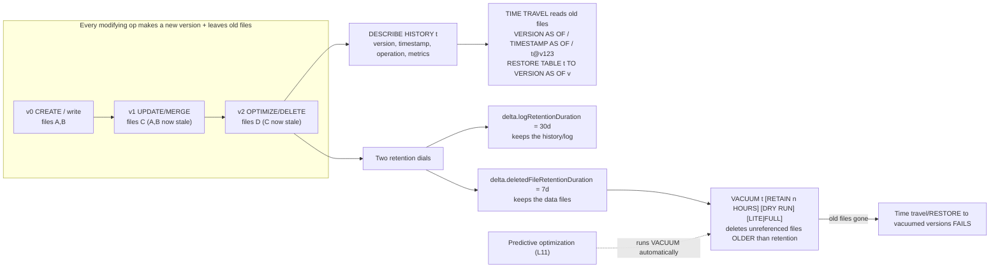

# Lesson 10 — VACUUM, time travel & retention

> **Track:** DBX Delta Optimization · **Lesson:** 10 · **Previous:** Lesson 09 — Deletion vectors · **Next:** Lesson 11 — Predictive optimization
> **Verified against:** Azure Databricks docs, June 2026 (`/tables/operations/vacuum`, updated 2026-06-18; `/tables/history`, updated 2026-06-12).

## What it is (plain language)

Every time you change a Delta table — an `INSERT`, `UPDATE`, `DELETE`, `MERGE`,
`OPTIMIZE`, or a deletion-vector op — Delta does **not** overwrite the old data in
place. It writes **new** Parquet files and commits a new **version** in the
transaction log, leaving the **old files** sitting in storage. Those leftover files
are not waste — they are the backbone of two features and a cost trade-off:

- **Time travel** *uses* the old files: you can query or restore any past version
  (`VERSION AS OF`, `TIMESTAMP AS OF`, `RESTORE`).
- **VACUUM** *reclaims* the old files: it physically deletes unreferenced files
  older than a retention window to cut storage cost and purge deleted data.
- **Two retention dials** govern the trade-off: how long the **log/history** is kept
  (`delta.logRetentionDuration`, default 30 days) and how long the **data files** are
  kept (`delta.deletedFileRetentionDuration`, default 7 days). They decide how far
  back you can travel — and how much storage you pay for.

This is the natural **"manage the file history"** capstone before predictive
optimization (Lesson 11), which runs VACUUM for you automatically.

- **One-line analogy:** A Delta table is like a document with **track changes** and
  **version history** turned on. Time travel = "open the version from last Tuesday."
  VACUUM = "permanently purge the change history older than N days to shrink the
  file." The two retention dials = how long you keep the *edit log* vs. the actual
  *old text* — and you can only reopen a past version if **both** still exist.
- **Concrete use case:** An analyst runs a bad `DELETE` that wipes 2 M rows from
  `orders`. Because the pre-delete version's files still exist, you `RESTORE TABLE
  orders TO VERSION AS OF 412` (or `INSERT`/`MERGE` the lost rows back from
  `orders VERSION AS OF 412`) in seconds — no backup restore, no downtime. Later,
  for GDPR, you run `VACUUM` so the deleted rows are physically gone from storage.

---

## Why it matters — the headline points

- **Mistakes become reversible.** Accidental deletes/updates, a bad pipeline run,
  or a schema mishap are recoverable from a past version instead of a backup tape.
- **Storage doesn't grow forever.** Without VACUUM, every rewrite (OPTIMIZE, MERGE,
  deletion-vector purge) leaves old files behind that you keep paying to store.
- **Compliance needs real deletion.** A soft `DELETE` only stops *queries* from
  seeing rows; the bytes survive in old files until VACUUM removes them past the
  retention window.
- **The trade-off is a dial you control.** Longer retention = more time travel and
  recoverability, but more storage cost. VACUUM is where you cash in the savings —
  and where you can accidentally cut off time travel if you set it too aggressively.

> **The one rule to remember:** **VACUUM is one-way.** Once it deletes a version's
> data files, time travel and `RESTORE` to that version (and anything older) **fail
> permanently**. Raise both retention dials *before* you need long time travel —
> time travel is **not** a backup strategy.

---

## The mechanism (mermaid)



---

## How it works — deep dive (sub-topic by sub-topic)

### 1. Every modifying op creates a new version (table history)

- **Mechanism:** Each commit (`INSERT`, `UPDATE`, `DELETE`, `MERGE`, `OPTIMIZE`,
  `CREATE`, `RESTORE`, deletion-vector ops, etc.) appends a JSON entry to
  `_delta_log` and bumps the table **version** by one. Old data files referenced by
  earlier versions stay in storage until VACUUM removes them.
- **Inspect with `DESCRIBE HISTORY`:** returns rows in **reverse chronological**
  order. Useful columns: `version`, `timestamp`, `operation` (e.g. `WRITE`, `MERGE`,
  `DELETE`, `OPTIMIZE`, `RESTORE`), `operationMetrics` (rows/files written),
  `isolationLevel`, and `isBlindAppend`. `LIMIT 1` shows just the latest commit.
- **Why:** History is your audit trail and the index you time-travel against — you
  read it to find the version/timestamp you want to query or restore.
- **Trade-off:** History (the log) is bounded by `logRetentionDuration` (default 30
  days). Past that, old log entries are pruned and those versions are no longer
  enumerable — separate from whether their *data files* still exist.

```sql
-- Full history, newest first: find the version/timestamp you want.
DESCRIBE HISTORY catalog.schema.orders;

-- Just the latest commit (handy for the current version number / last operation).
DESCRIBE HISTORY catalog.schema.orders LIMIT 1;
```

```python
# PySpark / DeltaTable API equivalent of DESCRIBE HISTORY
from delta.tables import DeltaTable
history_df = DeltaTable.forName(spark, "catalog.schema.orders").history()   # all versions
history_df.select("version", "timestamp", "operation", "operationMetrics").show(truncate=False)

# The current session's last commit version (no extra query):
print(spark.conf.get("spark.databricks.delta.lastCommitVersionInSession"))
```

### 2. Querying a past version (`VERSION AS OF` / `TIMESTAMP AS OF` / `@` syntax)

- **Mechanism:** Time travel reads the snapshot a version pointed to — the engine
  resolves which data files were live at that version/timestamp and reads only those.
  It is a **read**; it does not change the table.
- **Three ways to ask:** `VERSION AS OF <n>`, `TIMESTAMP AS OF '<ts>'`, and the
  shorthand `@` syntax — `t@v123` (version) or `t@yyyyMMddHHmmssSSS` (timestamp).
- **Why:** Re-create an old report, compare "before vs after" a load, debug a
  pipeline, or read a stable snapshot of a fast-changing table.
- **Trade-off:** You can only reach versions whose **data files still exist** (not
  vacuumed) **and** whose **log entry still exists** (within log retention).

```sql
-- By version number (from DESCRIBE HISTORY)
SELECT * FROM catalog.schema.orders VERSION AS OF 412;

-- By timestamp (point-in-time; resolves to the version live at that instant)
SELECT * FROM catalog.schema.orders TIMESTAMP AS OF '2026-06-20T09:30:00.000Z';

-- @ shorthand: @v<version> or @<yyyyMMddHHmmssSSS> timestamp
SELECT * FROM catalog.schema.orders@v412;
SELECT * FROM catalog.schema.orders@20260620093000000;
```

```python
# PySpark: versionAsOf / timestampAsOf read options
df_v = spark.read.option("versionAsOf", 412).table("catalog.schema.orders")
df_t = spark.read.option("timestampAsOf", "2026-06-20").table("catalog.schema.orders")
```

### 3. Fixing accidental changes — `RESTORE` and read-from-past

- **Mechanism — `RESTORE`:** `RESTORE TABLE t TO VERSION AS OF <v>` (or `TIMESTAMP
  AS OF <ts>`) makes the table's **current** state equal to that past version. It is
  **data-changing** — it commits a new version that re-points to the old files —
  and needs the **MODIFY** privilege.
- **Mechanism — surgical fix:** instead of restoring the whole table, `INSERT` or
  `MERGE` only the lost/changed rows back from the past version, leaving newer good
  data intact.
- **Why:** Recover from a bad `DELETE`/`UPDATE`/overwrite without a backup restore.
- **Trade-off / limitation:** You **cannot** `RESTORE` to a version whose files were
  **vacuumed/deleted**. Also, `RESTORE` is itself a write — **downstream streaming
  consumers may reprocess** the changed data.

```sql
-- Whole-table rollback to a known-good version (data-changing; needs MODIFY)
RESTORE TABLE catalog.schema.orders TO VERSION AS OF 412;
-- ...or to a point in time
RESTORE TABLE catalog.schema.orders TO TIMESTAMP AS OF '2026-06-20T09:30:00.000Z';

-- Surgical alternative: re-insert only the rows a bad DELETE removed, from the past version
INSERT INTO catalog.schema.orders
SELECT * FROM catalog.schema.orders VERSION AS OF 412 AS past
WHERE past.order_id NOT IN (SELECT order_id FROM catalog.schema.orders);

-- Or MERGE the past snapshot back in by key (upsert the lost/changed rows)
MERGE INTO catalog.schema.orders AS t
USING (SELECT * FROM catalog.schema.orders VERSION AS OF 412) AS past
  ON t.order_id = past.order_id
WHEN NOT MATCHED THEN INSERT *;
```

```python
# PySpark RESTORE via the DeltaTable API
from delta.tables import DeltaTable
dt = DeltaTable.forName(spark, "catalog.schema.orders")
dt.restoreToVersion(412)                       # by version
# dt.restoreToTimestamp("2026-06-20T09:30:00")  # by timestamp
```

### 4. VACUUM — reclaim unreferenced files older than retention

- **Mechanism:** `VACUUM t` finds data files that are (a) **no longer referenced** by
  the current table version **and** (b) **older than the retention threshold**, then
  physically deletes them. Two reasons to run it: **cut storage cost** and
  **permanently purge** modified/deleted records (compliance).
- **Retention:** default **7 days**, governed by `delta.deletedFileRetentionDuration`
  (default `interval 7 days`). `RETAIN n HOURS` overrides for one run.
- **`DRY RUN`:** lists the files VACUUM *would* delete and **deletes nothing** —
  always preview first on an unfamiliar table.
- **Why:** OPTIMIZE/MERGE/deletion-vector ops constantly leave stale files; VACUUM is
  how you stop paying for them and how soft-deleted bytes finally leave storage.
- **Trade-off:** VACUUM is the operation that actually **caps time travel** — after it
  runs, you lose the ability to query/restore versions whose files it removed. It
  ignores dirs starting with `_`/`.` (e.g. `_delta_log`, `_checkpoints`).

```sql
-- ALWAYS preview first — lists files that WOULD be deleted, deletes nothing.
VACUUM catalog.schema.orders DRY RUN;

-- Reclaim files older than the table's retention (default 7 days).
VACUUM catalog.schema.orders;

-- Override the window for this run (168 hours = 7 days). Shorter than 7 days is BLOCKED (see below).
VACUUM catalog.schema.orders RETAIN 168 HOURS;
```

```python
# PySpark / DeltaTable API
from delta.tables import DeltaTable
dt = DeltaTable.forName(spark, "catalog.schema.orders")
dt.vacuum()        # default retention (7 days)
dt.vacuum(168)     # RETAIN 168 HOURS
```

### 5. LITE vs FULL VACUUM

- **`VACUUM t FULL` (the default):** lists **every** file under the table path to
  decide what to delete — thorough, but slow on huge tables. It can clean files not
  referenced in the log (e.g. from aborted transactions).
- **`VACUUM t LITE` (Public Preview, DBR 16.4 LTS+):** uses the **transaction log**
  to find expired files instead of listing all files — much faster on big tables. It
  **won't** delete files that aren't referenced in the log (e.g. aborted-txn
  leftovers), and it needs a **prior successful VACUUM within the 30-day log
  retention** to work.
- **Why / trade-off:** LITE trades completeness for speed; FULL trades speed for
  completeness. Use LITE for routine cleanup on large tables; fall back to FULL
  periodically to sweep non-log-referenced files.

```sql
-- FULL (default): lists all files; thorough, slower; cleans aborted-txn leftovers.
VACUUM catalog.schema.orders FULL;

-- LITE (Public Preview, DBR 16.4 LTS+): uses the txn log; faster on big tables.
VACUUM catalog.schema.orders LITE;
```

### 6. The `retentionDurationCheck` safety check

- **Mechanism:** Databricks **blocks** `VACUUM … RETAIN n HOURS` when `n` is **less
  than 7 days** unless you disable the safety flag
  `spark.databricks.delta.retentionDurationCheck.enabled = false`.
- **Why it exists:** A too-short window can delete files that a **long-running
  concurrent job** is still writing/reading, corrupting that job or the table. The
  7-day floor protects in-flight work.
- **Trade-off:** Disabling it is **strongly discouraged** — only do so with full
  knowledge that no concurrent readers/writers depend on the files you're removing.

```sql
-- This is BLOCKED by default (retention < 7 days):
-- VACUUM catalog.schema.orders RETAIN 1 HOURS;

-- Override ONLY if you're certain no long-running job needs those files (discouraged):
SET spark.databricks.delta.retentionDurationCheck.enabled = false;
VACUUM catalog.schema.orders RETAIN 1 HOURS;
-- Re-enable the guard immediately afterward:
SET spark.databricks.delta.retentionDurationCheck.enabled = true;
```

### 7. Deletion-vector / column-mapping soft-deletes: REORG … APPLY (PURGE) then VACUUM

- **Mechanism:** With deletion vectors (Lesson 09), `DELETE`/`UPDATE`/`MERGE` mark
  rows as removed **without rewriting** the Parquet file (merge-on-read). The bytes
  are still in the file. `REORG TABLE t APPLY (PURGE)` **rewrites** files to
  physically apply those soft-deletes; then `VACUUM` (after the retention window)
  removes the now-unreferenced old files.
- **Why:** This two-step is how you make soft-deleted data **physically gone** for
  GDPR/storage — a plain `DELETE` with deletion vectors does **not** free the bytes.
- **Trade-off:** `purgeMode` — `all` (default, scans all file footers) vs `rows`
  (only files with soft-deletes; faster on large tables).

```sql
-- Step 1: physically apply deletion-vector / column-mapping soft-deletes (rewrites files).
REORG TABLE catalog.schema.orders APPLY (PURGE);

-- Faster on large tables: only touch files that actually have soft-deletes.
SET spark.databricks.delta.reorg.purgeMode = rows;
REORG TABLE catalog.schema.orders APPLY (PURGE);

-- Step 2: after the retention window, VACUUM removes the now-stale old files for good.
VACUUM catalog.schema.orders;
```

### 8. The two retention dials — and how they bound time travel

- **Mechanism — `delta.logRetentionDuration`** (default **30 days**): how long the
  **history/log** (version entries) is kept. Past it, old versions can't be
  enumerated or referenced.
- **Mechanism — `delta.deletedFileRetentionDuration`** (default **7 days**): the
  **data-file** threshold VACUUM uses. Past it, VACUUM may delete those files.
- **The key insight:** to time-travel **N days back you need BOTH** the log entry
  **and** the data files for that version. So the **effective** time-travel window is
  roughly the **minimum** of the two dials. Raising only one doesn't help: keep the
  log but vacuum the files and the query fails (files gone); keep the files but prune
  the log and you can't reference the version. **Raise both.**
- **DBR 18.0+ rule:** `logRetentionDuration` must be **≥** `deletedFileRetentionDuration`,
  and time-travel requests **older than `deletedFileRetentionDuration` are blocked**.
- **Trade-off:** longer retention = more recoverability but more storage cost.
  Databricks does **not** recommend time travel as a long-term backup — assume only
  the past 7 days unless you raised both.

```sql
-- To reliably time-travel 30 days back, raise BOTH dials (data files AND the log).
ALTER TABLE catalog.schema.orders SET TBLPROPERTIES (
  'delta.deletedFileRetentionDuration' = 'interval 30 days',  -- keep DATA FILES 30 days (VACUUM threshold)
  'delta.logRetentionDuration'         = 'interval 30 days'   -- keep HISTORY/LOG 30 days (must be >= data on DBR 18.0+)
);

-- Inspect the current dials
SHOW TBLPROPERTIES catalog.schema.orders;
```

### 9. Time travel to a vacuumed version FAILS (the capstone demo)

- **Mechanism:** Once VACUUM removes a version's data files, querying or restoring
  that version (or anything older) errors out — the files it would read are gone.
- **Why it matters:** This is the whole trade-off made concrete: VACUUM saves storage
  by destroying the very files time travel depends on. Order matters — set retention
  *before* you rely on a long window.

```sql
-- Worked: this query succeeds BEFORE vacuuming version 412's files...
SELECT count(*) FROM catalog.schema.orders VERSION AS OF 412;

-- ...you run VACUUM (with a short retention, for demo only)...
SET spark.databricks.delta.retentionDurationCheck.enabled = false;
VACUUM catalog.schema.orders RETAIN 0 HOURS;
SET spark.databricks.delta.retentionDurationCheck.enabled = true;

-- ...and now the SAME query FAILS because v412's data files were deleted.
-- SELECT count(*) FROM catalog.schema.orders VERSION AS OF 412;   -- ERROR: files no longer exist
```

### 10. Predictive optimization runs VACUUM for you (forward reference to Lesson 11)

- **Mechanism:** On UC **managed** tables, predictive optimization runs VACUUM (and
  OPTIMIZE/ANALYZE) automatically on serverless — no scheduled job needed.
- **Why it matters here:** Because PO's VACUUM uses `delta.deletedFileRetentionDuration`
  (default 7 days), **raise that property BEFORE enabling PO** if you need longer
  time travel; otherwise PO can delete files you expected to reach.

```sql
-- Raise retention BEFORE enabling PO, or PO's VACUUM (7-day default) reclaims files you wanted.
ALTER TABLE catalog.schema.orders
  SET TBLPROPERTIES ('delta.deletedFileRetentionDuration' = 'interval 30 days');
-- Then enable PO at the schema/catalog level (Lesson 11).
```

---

## Comparison table — time travel vs VACUUM (and the two dials)

| Aspect | Time travel | VACUUM | The two retention dials |
| --- | --- | --- | --- |
| What it does | **Reads/restores** an old version from old files | **Deletes** unreferenced files past retention | **Bound** how far back you can travel |
| Data-changing? | `SELECT … AS OF` no; `RESTORE` yes | Yes — permanent file deletion | No (just properties) |
| Key commands | `VERSION AS OF`, `TIMESTAMP AS OF`, `t@v…`, `RESTORE` | `VACUUM [RETAIN n HOURS] [DRY RUN] [LITE\|FULL]` | `ALTER TABLE … SET TBLPROPERTIES (…)` |
| Default window | as far as files **and** log exist | retention = **7 days** | log **30 days** · data files **7 days** |
| Privilege | `RESTORE` needs **MODIFY** | needs delete rights on the path | table owner / ALTER |
| Main risk | querying a vacuumed version → **fails** | deleting files a job still needs (use `DRY RUN`) | raising only one dial doesn't extend travel |
| Relationship | **uses** old files | **reclaims** old files | effective travel ≈ **min** of the two |

---

## Uses, edge cases & limitations

**Uses (reach for it when):**
- **Recover from mistakes:** `RESTORE` (whole table) or `INSERT`/`MERGE` from a past
  version (surgical) after a bad `DELETE`/`UPDATE`/overwrite.
- **Audit & reproducibility:** re-run a report against the exact data of a past day;
  read `DESCRIBE HISTORY` for who-changed-what.
- **Snapshot isolation:** pin a stable snapshot of a fast-changing table for a long
  query/join.
- **Reclaim storage & comply:** run `VACUUM` (after the retention window) to delete
  stale files and physically purge soft-deleted data.
- **When NOT to:** as a **backup/DR strategy** (use real backups) or to reach back
  weeks on a table where you never raised retention.

**Edge cases (interviewers probe these):**
- **Vacuumed version:** time travel/`RESTORE` to it **fails** — files are gone.
- **Raised only one dial:** keep the log but vacuum files → query fails (no files);
  keep files but prune the log → version not referenceable. Raise **both**.
- **Deletion-vector soft-deletes:** a plain `DELETE` doesn't free bytes; you need
  `REORG … APPLY (PURGE)` then `VACUUM`.
- **`RETAIN < 7 days`:** blocked by `retentionDurationCheck`; disabling it can delete
  files a long-running concurrent job still needs.
- **`RESTORE` and streaming:** it's a write, so downstream streams may reprocess.
- **DBR 18.0+:** `logRetentionDuration` must be ≥ `deletedFileRetentionDuration`, and
  travel older than `deletedFileRetentionDuration` is blocked.
- **Big-table VACUUM cost:** phase 1 lists files on workers (parallel); phase 2
  deletes from the **driver** (single node) — size the driver up for large deletes.

**Limitations (honest constraints):**
- **VACUUM is irreversible** — there is no undo for deleted files.
- Default retention is **7 days** (data files) / **30 days** (log); time travel
  beyond that requires raising **both** properties in advance.
- **LITE VACUUM** is **Public Preview (DBR 16.4 LTS+)**, needs a prior successful
  VACUUM within log retention, and won't delete non-log-referenced files.
- Time travel is **not** a backup — Databricks recommends relying only on the past 7
  days unless retention was raised.
- VACUUM ignores dirs beginning with `_`/`.` (e.g. `_delta_log`, `_checkpoints`).

---

## Common gotchas

- **`DRY RUN` first.** Always preview which files VACUUM would delete before running
  it for real on an unfamiliar table.
- **VACUUM kills old time travel.** After it runs, versions whose files were removed
  can't be queried or restored — set retention *before* you need a long window.
- **Raise BOTH dials, not one.** Effective travel ≈ min(log, data-file) retention.
  On DBR 18.0+, `logRetentionDuration` must be ≥ `deletedFileRetentionDuration`.
- **Soft-delete ≠ purged.** With deletion vectors, run `REORG … APPLY (PURGE)` then
  `VACUUM` to physically remove deleted bytes (GDPR).
- **Don't disable `retentionDurationCheck`.** Sub-7-day VACUUM can corrupt
  long-running concurrent jobs by deleting files they're still using.
- **`RESTORE` is a write.** It needs MODIFY and may make downstream streaming
  consumers reprocess.
- **Not a backup.** Time travel is for recent recovery/audit, not disaster recovery.
- **Predictive optimization vacuums for you.** Raise
  `delta.deletedFileRetentionDuration` *before* enabling PO if you need long travel.

---

## References (cited Azure Databricks docs, June 2026)

- VACUUM — <https://learn.microsoft.com/en-us/azure/databricks/tables/operations/vacuum>
- Work with table history / time travel — <https://learn.microsoft.com/en-us/azure/databricks/tables/history>
- Deletion vectors — <https://learn.microsoft.com/en-us/azure/databricks/tables/features/deletion-vectors>
- Predictive optimization — <https://learn.microsoft.com/en-us/azure/databricks/optimizations/predictive-optimization>
- Best practices: Delta Lake — <https://learn.microsoft.com/en-us/azure/databricks/delta/best-practices>
