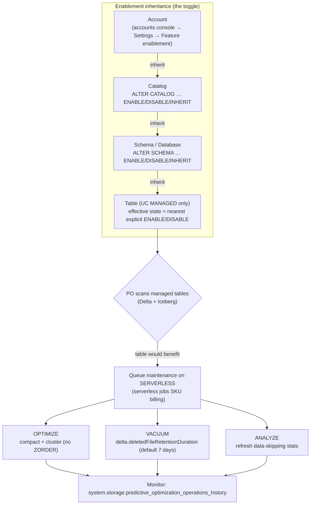

# Lesson 11 — Predictive optimization

> **Track:** DBX Delta Optimization · **Lesson:** 11 (final) · **Previous:** Lesson 10 — VACUUM, time travel & retention · **Next:** — (end of track; see the whole-track recap below)
> **Verified against:** Azure Databricks docs, June 2026.

## What it is (plain language)

**Predictive optimization (PO)** is Databricks running your table maintenance **for
you**, automatically, on Unity Catalog **managed** tables. Instead of you scheduling
and babysitting jobs, the platform watches how each table is written and queried and
then **runs the three maintenance commands you'd otherwise run by hand**:

- **`OPTIMIZE`** — compacts many small files into fewer right-sized ones (Lesson 04)
  and, for liquid-clustered tables, groups data by the clustering keys (Lesson 08).
- **`VACUUM`** — deletes old, no-longer-referenced data files to reclaim storage.
- **`ANALYZE`** — collects/refreshes the statistics that power data skipping (Lesson 03).

It also **collects stats on write** and **eliminates manual maintenance** — you stop
writing OPTIMIZE/VACUUM/ANALYZE jobs entirely on managed tables. PO runs on
**serverless** compute in the background, so it doesn't compete with your clusters.

- **One-line analogy:** It's like a **self-cleaning oven**. You cook (write and query);
  the oven decides when it's dirty enough to run a cleaning cycle and does it quietly on
  its own — you never schedule "clean the oven every Tuesday at 2am" again.
- **Concrete use case:** A platform team owns 4,000 UC managed tables across dozens of
  pipelines. Hand-scheduling OPTIMIZE/VACUUM/ANALYZE per table is unmaintainable and
  always either over- or under-runs. Enable PO at the **catalog** level once; every
  table inherits it, and Databricks runs the right maintenance on each table on
  serverless — no jobs to write, no schedules to tune.

> **The closing message of this whole track:** for new work, stop hand-tuning layout
> and maintenance. Use a **UC managed table + liquid clustering + predictive
> optimization**, and let the platform do it.

---

## Why it matters — maintenance you don't have to run is maintenance that never drifts

- **Manual maintenance doesn't scale and silently rots.** Hand-scheduled OPTIMIZE/
  VACUUM/ANALYZE jobs are guesswork: run too often and you burn compute; run too
  rarely and queries slow down, small files pile up, and storage bloats. PO decides
  *which* tables benefit and *when*, per table, from real write/query signals.
- **It closes the loop on everything you learned in this track.** Small files →
  OPTIMIZE handles them. Stale skipping stats → ANALYZE refreshes them. Dead files →
  VACUUM reclaims them. Liquid-clustered tables → PO triggers clustering and even
  **drives automatic key selection** for `CLUSTER BY AUTO`.
- **Default-on going forward.** PO is **enabled by default for accounts created on/after
  Nov 11, 2024**, with a **gradual rollout to existing accounts (expected complete ~Aug
  2026)**. The industry default is moving to "the platform maintains your tables".

The decision rule to carry into an interview: **on UC managed tables, prefer predictive
optimization over hand-scheduled maintenance jobs** — and raise
`delta.deletedFileRetentionDuration` *before* you enable it if you need long time travel.

---

## The mechanism (mermaid)



---

## How it works — deep dive, sub-topic by sub-topic

### 1. What PO runs: OPTIMIZE, VACUUM, ANALYZE (and stats on write)

- **Mechanism:** On UC **managed** tables (both **Delta** and **Iceberg**), PO
  automatically runs **`OPTIMIZE`** (compaction; clustering for liquid-clustered tables),
  **`VACUUM`** (remove unreferenced files), and **`ANALYZE`** (collect/refresh skipping
  stats). It also **collects statistics on write**, so freshly written data is skippable
  without you scheduling anything.
- **Why:** These three commands are the entire manual-maintenance burden of a Delta/
  Iceberg table. Automating all three means **no maintenance jobs to author or schedule**.
- **Trade-off:** PO is the *operational* layer — it does **not** choose your physical
  layout for you on classic tables. You still pick liquid clustering vs. (legacy)
  partitioning/Z-order; PO then keeps that layout healthy. And it runs only on **managed**
  tables (see limitations).

```sql
-- There is no "run PO" command — it runs automatically once enabled.
-- These are the operations PO performs FOR you on a managed table; you stop scheduling them:
--   OPTIMIZE  catalog.schema.t;                       -- compaction (+ clustering for LC tables)
--   VACUUM    catalog.schema.t;                       -- reclaim files past the retention window
--   ANALYZE   catalog.schema.t COMPUTE DELTA STATISTICS;  -- refresh data-skipping stats
-- After enabling PO, DELETE the hand-scheduled jobs that used to run the above.
```

### 2. Prerequisites: Premium plan, supported region, serverless/DBR 12.2 LTS+, UC managed

- **Mechanism / requirements:** PO requires a workspace on the **Premium** plan, in a
  **supported region**, with a **SQL warehouse or DBR 12.2 LTS+**, and the table must be
  a **Unity Catalog managed** table. (PO's maintenance itself executes on serverless.)
- **Why:** These gates reflect that PO is a managed serverless capability layered on
  Unity Catalog governance — it needs UC ownership semantics and serverless availability.
- **Trade-off:** If any prerequisite is missing (external table, hive_metastore table,
  non-Premium, unsupported region), PO simply won't run there — you're back to manual
  maintenance for those tables.

### 3. The enablement inheritance model: account → catalog → schema → table

- **Mechanism:** Enablement flows **down a hierarchy**. You set a state at the
  **account**, **catalog**, or **schema** level; lower levels **inherit** by default,
  and a **table's effective state is the nearest explicit ENABLE/DISABLE above it**. The
  three states are:
  - **ENABLE** — turn PO on here (and for everything that inherits below).
  - **DISABLE** — turn PO off here (and block it for everything that inherits below).
  - **INHERIT** — defer to the parent level's decision.
- **Why:** One toggle can govern thousands of tables. Set it once at the catalog or
  schema and every table picks it up — no per-table administration.
- **Trade-off / the rule that trips people up:** a **DISABLE at a lower level wins over
  an ENABLE higher up**. If you `DISABLE` a schema, then later `ENABLE` the account or
  catalog, that schema (and its tables) **stays off** until you set it back to `INHERIT`
  or `ENABLE`. The *nearest explicit* decision governs — see the interactive tree below.

```sql
-- CATALOG level: turn PO on for the whole catalog; schemas/tables inherit unless overridden.
ALTER CATALOG analytics ENABLE PREDICTIVE OPTIMIZATION;

-- SCHEMA / DATABASE level: explicitly OFF for one schema (this wins over the catalog ENABLE).
ALTER SCHEMA analytics.staging DISABLE PREDICTIVE OPTIMIZATION;

-- Go back to inheriting the parent's decision (removes the explicit override).
ALTER SCHEMA analytics.staging INHERIT PREDICTIVE OPTIMIZATION;
```

### 4. Account-level enablement is UI-driven (accounts console)

- **Mechanism:** The **account-level** toggle lives in the **accounts console**, not in
  SQL. Path: **Accounts console → Settings → Feature enablement → Predictive
  optimization**, then choose the enablement state. Catalog/schema overrides are then
  done in SQL (sub-topic 3).
- **Why:** Account-wide feature governance is an admin/console concern, so it's exposed
  in the accounts console UI rather than as a data-plane SQL statement.
- **Trade-off:** Because it's UI-driven, it can't be scripted as plain table SQL — the
  exact step-by-step UI actions are below.

**Step-by-step UI actions (account-level enablement):**

1. Sign in to the **Databricks accounts console** as an **account admin**.
2. In the left sidebar, click **Settings**.
3. Open the **Feature enablement** tab.
4. Find **Predictive optimization**.
5. Set the enablement state (enable for the account). Save/confirm.
6. (Optional) Override below: use SQL `ALTER CATALOG …` / `ALTER SCHEMA …` to
   `ENABLE` / `DISABLE` / `INHERIT` specific catalogs or schemas.

> Verify the exact labels against the current docs — accounts-console wording drifts.

### 5. Privileges: who can change the toggle at each level

- **Mechanism:** Changing the PO state requires the right privilege **at that level**:
  - **Account** state → **account admin** (in the accounts console).
  - **Catalog** state → **catalog owner**.
  - **Schema** state → **schema owner**.
- **Why:** PO enablement is a governance decision, so it's tied to UC ownership — the
  person who owns the object decides its maintenance policy.
- **Trade-off:** If you're not the owner, you can't flip the toggle; you request the
  owner (or an account admin) to set it. Plan ownership accordingly.

### 6. PO's OPTIMIZE does NOT run ZORDER — use liquid clustering

- **Mechanism:** The `OPTIMIZE` that PO runs performs **compaction (and clustering for
  liquid-clustered tables)** but **does not run `ZORDER`** — in fact it **ignores
  Z-ordered files**. To get colocation-for-skipping under PO, use **liquid clustering**,
  which PO understands and maintains. PO even **drives automatic liquid clustering key
  selection** for `CLUSTER BY AUTO`.
- **Why:** Z-order is heavyweight, non-idempotent, and the legacy approach (Lesson 03);
  liquid clustering is the modern, incremental layout PO is built to maintain.
- **Trade-off / interview trap:** if you rely on `ZORDER` for skipping and then expect PO
  to keep it up, **it won't** — PO leaves those files alone. Migrate the table to liquid
  clustering so PO can colocate it.

```sql
-- WRONG expectation: PO will NOT maintain this Z-order layout (it ignores Z-ordered files).
-- OPTIMIZE legacy_tbl ZORDER BY (customer_id);   -- manual-only; PO does not run ZORDER

-- RIGHT for PO: use liquid clustering so PO's OPTIMIZE colocates data by the keys.
CREATE OR REPLACE TABLE analytics.prod.events (
  event_id   BIGINT,
  event_type STRING,
  event_date DATE
)
CLUSTER BY (event_type, event_date);   -- PO maintains this; CLUSTER BY AUTO lets PO pick keys
```

### 7. VACUUM retention: `delta.deletedFileRetentionDuration` (default 7 days)

- **Mechanism:** PO's `VACUUM` deletes data files that are no longer referenced **and**
  older than the table's retention window, set by
  **`delta.deletedFileRetentionDuration`** (default **7 days**). Time travel and
  `RESTORE` can only reach back as far as files still exist — so the retention window
  bounds how far back you can time-travel.
- **Why:** Reclaiming dead files is the point of VACUUM; the retention window protects
  recent versions and in-flight readers from having their files deleted.
- **Trade-off / the critical gotcha:** once PO is enabled it **will** VACUUM on the
  default 7-day window. If you need **longer time travel**, you must **raise
  `deletedFileRetentionDuration` BEFORE enabling PO** — otherwise PO can delete files you
  expected to time-travel to.

```sql
-- Need 30 days of time travel? RAISE retention BEFORE enabling PO on this table/schema,
-- or PO's VACUUM (default 7 days) will reclaim files you wanted to keep.
ALTER TABLE analytics.prod.events
  SET TBLPROPERTIES ('delta.deletedFileRetentionDuration' = '30 days');

-- THEN enable PO (e.g. at the schema or catalog level) so it respects the new window.
ALTER SCHEMA analytics.prod ENABLE PREDICTIVE OPTIMIZATION;
```

### 8. Runs on serverless compute (serverless jobs SKU billing)

- **Mechanism:** PO executes its maintenance on **serverless** compute, billed under the
  **serverless jobs SKU**. It runs **asynchronously in the background** — it doesn't run
  on, or compete with, your interactive/job clusters.
- **Why:** Serverless lets Databricks schedule maintenance elastically and independently
  of your workloads, so OPTIMIZE/VACUUM/ANALYZE never block your pipelines.
- **Trade-off:** PO is not free — it consumes serverless jobs DBUs. It's typically far
  cheaper and more correct than over-running hand-scheduled jobs, but it is a billed line
  item; monitor it (next sub-topic) to understand cost.

### 9. Monitor with the system table

- **Mechanism:** Every PO operation is logged to the system table
  **`system.storage.predictive_optimization_operations_history`** — you can query which
  tables PO touched, which operation ran (OPTIMIZE/VACUUM/ANALYZE), and the associated
  metrics/cost.
- **Why:** Because PO is automatic and on serverless, the system table is how you get
  observability — what ran, when, and how much it cost.
- **Trade-off:** Requires the `system.storage` schema to be enabled and read access to
  system tables.

```sql
-- What has PO done lately, and what did it cost? Audit + cost attribution.
SELECT operation_type, catalog_name, schema_name, table_name,
       operation_status, start_time
FROM system.storage.predictive_optimization_operations_history
WHERE start_time >= current_timestamp() - INTERVAL 7 DAYS
ORDER BY start_time DESC;
```

### 10. Verify the effective state with DESCRIBE … EXTENDED

- **Mechanism:** Use **`DESCRIBE (CATALOG | SCHEMA | TABLE) EXTENDED name`** to read the
  **"Predictive Optimization"** field and see the **effective** state at that level
  (including whether it's inherited). This is how you confirm a table is actually covered.
- **Why:** Because of inheritance + overrides, the effective state isn't always obvious;
  `DESCRIBE … EXTENDED` is the source of truth per object.
- **Trade-off:** It reports the effective state — to change it you go back to the right
  level's toggle (account UI / `ALTER CATALOG` / `ALTER SCHEMA`).

```sql
-- Confirm PO is in effect (and whether it's inherited) at each level:
DESCRIBE CATALOG EXTENDED analytics;                 -- catalog-level state
DESCRIBE SCHEMA  EXTENDED analytics.prod;            -- schema-level state
DESCRIBE TABLE   EXTENDED analytics.prod.events;     -- table-level "Predictive Optimization" field
```

### 11. What PO does NOT run on: OpenSharing recipient tables and EXTERNAL tables

- **Mechanism:** PO does **not** run on **Delta Sharing (OpenSharing) recipient tables**
  or on **EXTERNAL** tables — only on UC **managed** tables.
- **Why:** PO needs ownership/lifecycle control over the table's files; shared-in and
  external tables are managed elsewhere (the provider, or your own external storage/jobs).
- **Trade-off:** For external/legacy tables you still schedule maintenance manually
  (OPTIMIZE/VACUUM/ANALYZE), or migrate them to UC managed tables to get PO.

---

## Comparison table — PO vs. hand-scheduled maintenance

| Dimension | **Predictive optimization (managed)** | **Hand-scheduled OPTIMIZE/VACUUM/ANALYZE** |
| --- | --- | --- |
| Who runs it | Databricks, automatically | You, via jobs/schedules |
| What it runs | OPTIMIZE, VACUUM, ANALYZE (+ stats on write) | Whatever you script |
| Table scope | UC **managed** only (Delta + Iceberg) | Any table (managed/external/hive_metastore) |
| Z-order | **Not run** (ignores Z-ordered files) — use liquid clustering | You can run `ZORDER` manually |
| Compute | **Serverless** (serverless jobs SKU), async | Your clusters/warehouses |
| Tuning | Platform decides which tables + when | You guess frequency per table |
| Enablement | Inherited account → catalog → schema → table | n/a (you author each job) |
| Time travel | Bound by `deletedFileRetentionDuration` (default 7d) | Same property, but you control VACUUM timing |
| Verdict for new code | ✔ **Prefer on UC managed tables** | Legacy/external tables, or special timing needs |

---

## Uses, edge cases & limitations

**Uses (when to reach for it)**
- **Default for UC managed tables.** Enable at the catalog/schema level and let PO run
  OPTIMIZE/VACUUM/ANALYZE — especially across many tables where hand-scheduling doesn't scale.
- **Pairs with liquid clustering.** PO maintains liquid-clustered tables and drives
  `CLUSTER BY AUTO` key selection — the modern "managed table + LC + PO" default.
- **When NOT to:** external/hive_metastore tables, OpenSharing recipient tables, or when
  you genuinely need manual control over VACUUM timing — there you still schedule jobs.

**Edge cases an interviewer probes**
- **Child DISABLE vs. later parent ENABLE** → the DISABLE wins; the schema/table stays
  off until set to INHERIT/ENABLE. (See the inheritance tree.)
- **You relied on ZORDER** → PO won't maintain it (ignores Z-ordered files); migrate to
  liquid clustering.
- **You need long time travel** → raise `deletedFileRetentionDuration` **before** enabling
  PO, or its VACUUM (7-day default) deletes files you wanted to reach.
- **External or shared-in table** → PO doesn't run there at all.
- **Cost surprise** → PO bills serverless jobs DBUs; check
  `system.storage.predictive_optimization_operations_history`.
- **Not owner** → you can't flip the toggle at that level (need catalog/schema owner or
  account admin).

**Limitations**
- **UC managed tables only** (Delta + Iceberg); not external, not OpenSharing recipients.
- Requires **Premium plan**, **supported region**, **SQL warehouse or DBR 12.2 LTS+**.
- PO's `OPTIMIZE` **does not run `ZORDER`**.
- Account-level enablement is **UI-only** (accounts console); catalog/schema via SQL.
- Runs on **serverless** (billed serverless jobs SKU).
- VACUUM is bound by `delta.deletedFileRetentionDuration` (**default 7 days**).

---

## Common gotchas

- **Raise retention BEFORE enabling PO** if you need long time travel — PO's VACUUM uses
  the 7-day default and will reclaim files past it.
- **PO does not Z-order.** It ignores Z-ordered files; use liquid clustering (and let PO
  drive `CLUSTER BY AUTO`) for colocation-for-skipping.
- **A child DISABLE beats a parent ENABLE.** Set the level back to `INHERIT` (or `ENABLE`)
  to re-cover it; the nearest explicit decision governs.
- **Managed-only.** External, hive_metastore, and OpenSharing recipient tables get nothing
  from PO — keep manual maintenance there or migrate to UC managed.
- **Account toggle is in the accounts console**, not SQL — catalog/schema overrides are SQL.
- **It's billed.** PO consumes serverless jobs DBUs; monitor
  `system.storage.predictive_optimization_operations_history`.
- **Verify, don't assume.** Use `DESCRIBE … EXTENDED` to confirm the *effective* state per
  catalog/schema/table — inheritance can hide an override.

---

## Whole-track recap — the decision ladder

This is the final lesson, so here is the entire track as one decision ladder. Each rung
solves a problem the previous rung exposed:

1. **Traditional write (Lesson 01)** — the baseline and the **small-file problem**:
   Spark writes ~1 file per task, producing many tiny files.
2. **Partitioning (Lesson 02)** — the old physical layout; useful only on **large**
   tables (>1 TB) and low-cardinality keys — over-partitioning makes the small-file
   problem *worse*.
3. **Data skipping & Z-ordering (Lesson 03)** — *why* layout matters: per-file min/max
   stats let the engine **skip files**; Z-order colocates rows so skipping is aggressive.
4. **OPTIMIZE / compaction (Lesson 04)** — the **manual** fix for small files
   (bin-packing into right-sized files), idempotent, optionally with `WHERE`/`FULL`.
5. **Optimized writes + auto compaction (Lessons 05–06)** — **automatic file sizing** at
   and just-after write (always on for MERGE/UPDATE/DELETE).
6. **Auto optimize (Lesson 07)** — the umbrella over optimized writes + auto compaction,
   plus target-file-size autotuning by table size.
7. **Liquid clustering (Lesson 08)** — the **modern layout**: `CLUSTER BY` replaces
   partitioning *and* Z-order; change keys with no rewrite.
8. **Deletion vectors (Lesson 09)** — **merge-on-read** modifications: DELETE/UPDATE/MERGE
   mark rows as deleted instead of rewriting whole Parquet files.
9. **VACUUM, time travel & retention (Lesson 10)** — manage the **file history** every
   operation leaves behind: time-travel to old versions, then VACUUM to reclaim storage.
10. **Predictive optimization (Lesson 11 — this one)** — **fully managed maintenance**:
    the platform runs OPTIMIZE/VACUUM/ANALYZE on UC managed tables so you don't.

### The one-line modern default

> **UC managed table + liquid clustering + predictive optimization.**
> Pick a governed managed table, lay it out with liquid clustering (or `CLUSTER BY AUTO`),
> enable predictive optimization — and **let the platform do it**. Reach for
> partitioning, Z-order, or hand-scheduled OPTIMIZE/VACUUM/ANALYZE only for legacy or
> external tables, or genuinely special cases.

---

## References

Official Azure Databricks documentation (verified June 2026):

- Predictive optimization (what it runs — OPTIMIZE/VACUUM/ANALYZE; default-on date and
  rollout; prerequisites; account → catalog → schema → table inheritance; `ALTER
  CATALOG/SCHEMA … ENABLE | DISABLE | INHERIT PREDICTIVE OPTIMIZATION`; accounts-console
  enablement; privileges; no-ZORDER behavior; `deletedFileRetentionDuration`; serverless
  billing; `system.storage.predictive_optimization_operations_history`; `DESCRIBE …
  EXTENDED`; managed-only / not external / not OpenSharing):
  <https://learn.microsoft.com/en-us/azure/databricks/optimizations/predictive-optimization>
- Use liquid clustering for tables (the layout PO maintains; `CLUSTER BY AUTO` key
  selection driven by PO):
  <https://learn.microsoft.com/en-us/azure/databricks/tables/clustering>
- OPTIMIZE — optimize data file layout (the compaction PO automates):
  <https://learn.microsoft.com/en-us/azure/databricks/tables/operations/optimize>
- Data skipping for Delta Lake (the stats `ANALYZE` refreshes; PO provides intelligent
  stats on managed tables):
  <https://learn.microsoft.com/en-us/azure/databricks/tables/data-skipping>
- Best practices: Delta Lake (managed table + liquid clustering + predictive optimization
  as the modern default):
  <https://learn.microsoft.com/en-us/azure/databricks/delta/best-practices>
