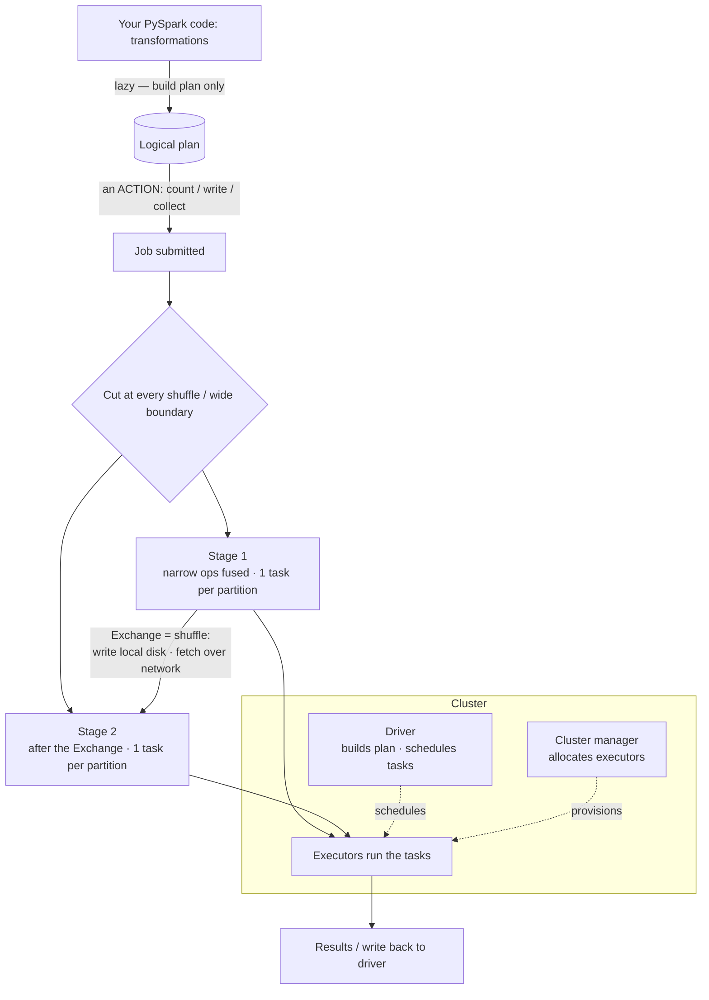

# Spark architecture & the execution model

> **Databricks · PySpark Performance · Lesson 01**
> *How one line of PySpark becomes a fleet of tasks running across a cluster — the driver, the executors, and the shuffle that decides whether the job is fast or slow.*
>
> `Spark 3.2+ / DBR LTS` · `shuffle.partitions = 200` · `Verified Jun 2026 docs`

---

## What it is

A Spark **application** is one program (your notebook or job) that runs as a small society of processes:

- **Driver** — the brain. It runs your `main()` / notebook, holds the `SparkSession` (and the older `SparkContext`), turns your DataFrame code into a plan, splits that plan into work, and schedules it. There is exactly **one** driver per application.
- **Executors** — the muscle. JVM processes on the worker nodes that actually **run tasks** and **hold cached data**. There are **N** of them.
- **Cluster manager** — the landlord. It hands out the worker machines the driver asks for (Standalone, YARN, or Kubernetes in OSS; on Databricks the platform manages this for you).

You also need a place to *launch* the application from — the **edge / gateway node** — and a decision about *where the driver runs* — the **deployment mode** (client vs cluster). Everything else in this track (joins, memory, AQE, skew, caching) is a refinement of this one picture.

> 🟣 **The one rule to remember:** Spark is **lazy**. Your transformations only *describe* work; nothing runs until an **action** fires a **job**. That job is split at **shuffle boundaries** into **stages**, and each stage runs as **tasks — one task per partition**. Read those four words (job → stage → task → partition) and you can read any Spark UI.

---

## Why it matters

- **Every performance problem is a problem with this picture.** A slow job is a job with too much work on the driver, too few/too many partitions, or an expensive **shuffle** between stages. You can't tune what you can't see — and this is the mental model you use to read `df.explain()` and the Spark UI.
- **The shuffle is the villain of the whole track.** A shuffle = Spark moving rows across the network so that all rows with the same key land on the same executor. It writes intermediate files to local disk and reads them back over the network — the single most expensive operation Spark does. Lessons 02–11 are largely about **avoiding, repairing, or surviving** the shuffle.
- **Interviewers start here.** "Walk me through what happens when you call `df.count()`" separates people who *use* Spark from people who *understand* it. The answer is: an action triggers a job → the job is cut into stages at shuffle boundaries → each stage runs one task per partition on the executors → results return to the driver.

---

## How it works — deep dive

### 1 · The three roles: driver, executors, cluster manager

`<chip:analogy>` *Analogy:* a restaurant kitchen — the **driver** is the head chef calling out orders and plating the final dish; the **executors** are the line cooks each working their own station; the **cluster manager** is the restaurant owner who decides how many cooks you get.

- **Driver** — runs the user code, builds the logical → physical plan via the Catalyst optimizer, breaks it into jobs/stages/tasks, and schedules tasks onto executors. It also collects results back (`collect()`, `show()`) and **builds the small side of a broadcast join** before shipping it. Because it's a single point, overloading it (huge `collect()`, broadcasting a too-big table) sinks the whole application — that's Lesson 03.
- **Executors** — long-lived JVM processes launched at application start. Each has a fixed number of **cores** (task slots) and a fixed **heap** (Lesson 04). They run tasks, cache blocks, and write/read shuffle files. More executors/cores = more parallelism, up to the number of partitions.
- **Cluster manager** — only allocates resources (containers/VMs). It does **not** schedule your tasks; the driver does. On Databricks this is fully managed — you pick a cluster, and the platform provisions a driver node and worker nodes.

`<chip:usecase>` *Use case:* sizing a cluster — if a stage has 800 partitions and each executor has 4 cores, you need 200 executor-cores running concurrently to do it in one wave; fewer cores = more waves = longer wall-clock.

### 2 · The edge / gateway node

- **Definition (one sentence):** an **edge node** (a.k.a. gateway node) is a machine that can *submit* work to the cluster and talk to the cluster manager, but is **not** part of the worker pool that runs tasks.
- It's where `spark-submit` / your client lives, holds the Spark client libraries and cluster config, and is the network bridge between your laptop and the cluster.
- **On Databricks** you rarely manage an edge node directly — the notebook front-end plays this role, and the **driver node** of your cluster is where your commands are interpreted. But the concept matters the moment you submit jobs from CI/CD, an Airflow worker, or a bastion host: that host is the edge node, and in **client mode** the driver runs *there*.

`<chip:analogy>` *Analogy:* the edge node is the **drive-thru window** — you place your order there and it relays it to the kitchen, but no food is actually cooked at the window.

### 3 · Deployment modes: client vs cluster

The deployment mode answers **one question: where does the driver run?** This changes failure behavior, latency, and who must stay online.

- **Client mode** — the **driver runs on the submitting machine** (your edge node / laptop / the Databricks driver node).
  - *YARN client mode (OSS):* "the driver runs in the client process, and the application master is only used for requesting resources from YARN." If the client dies, the application dies.
  - **Best for:** interactive work — notebooks, `spark-shell`, REPL — because you need the driver local to stream results back to you.
- **Cluster mode** — the **driver runs inside the cluster**.
  - *YARN cluster mode (OSS):* "the Spark driver runs inside an application master process which is managed by YARN on the cluster, and the client can go away after initiating the application." The launcher can disconnect; the job keeps running.
  - **Best for:** production, fire-and-forget batch jobs — the submitting host isn't a single point of failure.
- **On Databricks:** for notebooks the driver always runs on the cluster's **driver node** — it "maintains the SparkContext, interprets all the commands you run from a notebook…, and runs the Apache Spark master that coordinates with the Spark executors." On a **single-node** cluster the driver node is *both* master and worker.

`<chip:usecase>` *Use case:* an Airflow DAG submitting a nightly ETL → use **cluster mode** so the Airflow worker can hand off the job and move on. A data scientist exploring in a REPL → **client mode** so results stream to their terminal.

### 4 · Lazy evaluation, transformations vs actions

- **Lazy evaluation (one sentence):** Spark records what you *want* but does nothing until you ask for a result. Transformations build a **logical plan**; only an **action** triggers execution.
- **Transformations** (`select`, `filter`, `withColumn`, `join`, `groupBy`) return a new DataFrame and run **nothing** — they just extend the plan.
- **Actions** (`count`, `collect`, `show`, `write`, `take`, `foreach`) force Spark to actually run the plan and produce a value or side-effect. **Each action triggers a job.**
- **Why it's good:** because Spark sees the whole chain before running it, Catalyst can fuse operations, push filters down to the scan, and prune columns — optimizations impossible if each line ran eagerly.

`<chip:analogy>` *Analogy:* lazy evaluation is a **shopping list** — writing items down (transformations) costs nothing; you only walk the aisles (the job) when you actually go to the store (an action).

### 5 · Narrow vs wide dependencies (and the shuffle)

This is the most important distinction in the lesson, because it's what creates stages.

- **Narrow dependency:** each input partition contributes to **exactly one** output partition. `map`, `filter`, `select`, `withColumn`, `union`. No data moves between executors — Spark **pipelines** these together inside one stage.
- **Wide dependency:** an output partition depends on **many** input partitions, so rows must be **redistributed across the network** — a **shuffle**. `groupBy`, `join` (non-broadcast), `distinct`, `repartition`, `reduceByKey`.
- **The shuffle, mechanically:**
  1. **Map side** — each task partitions its output by the target key and **writes shuffle files to local disk**.
  2. **Stage boundary** — Spark waits for all map-side tasks to finish (a barrier).
  3. **Reduce side** — the next stage's tasks **fetch** their slices **over the network** from every map-side disk, then process them.
- That's why a shuffle is the most expensive thing Spark does: **disk write + network transfer + serialization + a stage barrier** where every executor waits for the slowest. `spark.sql.shuffle.partitions` (default **200** in OSS; `auto` available on Databricks) sets how many partitions exist *after* the shuffle.

`<chip:usecase>` *Use case:* `events.groupBy("user_id").count()` shuffles all events so every user's rows land together — fine at small scale, a cluster-killer when one user has 90% of the rows (skew, Lesson 08).

### 6 · The execution hierarchy: job → stage → task

Putting it together, here's exactly what happens when you call an action:

1. **Action → Job.** Each action (`count`, `write`, …) submits **one job**.
2. **Job → Stages.** Spark walks the plan backwards and cuts a **new stage at every shuffle (wide) boundary**. Narrow operations are fused into the same stage. A job with one shuffle has two stages; two shuffles, three stages.
3. **Stage → Tasks.** Each stage runs as a set of **tasks — exactly one task per partition** of that stage's data. 200 partitions ⇒ 200 tasks. Tasks are the unit Spark ships to executor cores.
4. **Tasks → executor cores.** The driver schedules tasks onto free executor cores; partitions are processed in **waves** (total tasks ÷ total cores).

> The whole track lives in this hierarchy. "Too many tiny tasks" → AQE coalesce (Lesson 05). "One task runs 10× longer" → skew (Lesson 08). "A stage with huge Shuffle Read" → an avoidable shuffle (Lessons 02, 11). Learn to read it once and every later lesson clicks into place.

### Reading it in the Spark UI

- **SQL / DataFrame tab** — the query DAG. Each `Exchange` node is a shuffle (a stage boundary). Per-node metrics show rows and **shuffle read/write** bytes.
- **Jobs tab** — one row per action; click in to see its stages.
- **Stages tab** — per-stage **task count** (= partition count), the **task-time distribution** (min / median / max — skew shows as max ≫ median), and **Shuffle Read/Write** sizes.
- **Executors tab** — how many executors/cores you actually got, plus per-executor task counts and GC time.

---

## How to do it (code + verification)

> **Track rule:** every technique is paired with *how to prove it* — the `.explain()` plan node or the Spark-UI signal. Apply, then verify. Never assume.

### Prove lazy evaluation (transformations build, actions fire)

```python
# None of these run anything — they only extend the logical plan (LAZY).
df = spark.range(0, 1_000_000)                  # a 1M-row DataFrame
df2 = df.filter("id % 2 = 0")                    # transformation — no job
df3 = df2.withColumn("bucket", df2.id % 10)      # transformation — no job

# VERIFY: open the Spark UI > Jobs tab now — it is EMPTY. Nothing has executed.

count = df3.count()                              # ACTION — this fires exactly one job
# VERIFY: the Spark UI > Jobs tab now shows ONE new job for the count() action.
```

### See the plan and the stage boundaries (narrow vs wide)

```python
from pyspark.sql.functions import col   # used by the col("id") snippets below

# A narrow-only pipeline: filter + withColumn fuse into ONE stage, no shuffle.
narrow = spark.range(1_000_000).filter("id > 10").withColumn("x", col("id") * 2)
narrow.explain(mode="formatted")
#   == Physical Plan ==
#   Project ... +- Filter ... +- Range ...     <-- no Exchange = no shuffle = single stage ✅

# A wide operation: groupBy forces a shuffle -> a stage boundary appears.
wide = spark.range(1_000_000).groupBy(col("id") % 100).count()
wide.explain(mode="formatted")
#   == Physical Plan ==
#   HashAggregate ...
#   +- Exchange hashpartitioning(...)          <-- Exchange = the shuffle = a NEW stage ❌(costly)
#      +- HashAggregate ...   +- Range ...
```

```sql
-- Same idea in Spark SQL: the GROUP BY introduces the Exchange.
EXPLAIN FORMATTED
SELECT id % 100 AS g, count(*) FROM range(1000000) GROUP BY id % 100;
-- Look for the `Exchange` node — that is the shuffle / stage boundary.
```

### Inspect and control partitions (one task per partition)

```python
df = spark.range(1_000_000)
print(df.rdd.getNumPartitions())   # in-memory partitions => this many tasks per stage

# A wide op lands on spark.sql.shuffle.partitions (200 by default in OSS).
shuffled = df.groupBy(col("id") % 7).count()
print(shuffled.rdd.getNumPartitions())   # -> 200 (the post-shuffle partition count)

# Set it explicitly to see tasks change (AQE may then coalesce it — Lesson 05).
spark.conf.set("spark.sql.shuffle.partitions", 8)   # demo only; reset afterwards
# VERIFY: Spark UI > Stages tab — the post-shuffle stage now shows 8 tasks instead of 200.
```

### Time a plan without pulling data to the driver

```python
import time
# The "noop" sink runs the FULL job (all stages/tasks) but writes nothing —
# the clean way to time a plan WITHOUT a driver-OOM-risky collect().
t0 = time.time()
wide.write.format("noop").mode("overwrite").save()
print(round(time.time() - t0, 2), "s")
# VERIFY: Spark UI > SQL tab shows the completed query; Stages tab shows the
# shuffle Read/Write bytes for the Exchange — that's the cost of the wide op.
```

---

## Comparison table

| Dimension | Narrow dependency | Wide dependency (shuffle) |
| --- | --- | --- |
| **Examples** | `map`, `filter`, `select`, `withColumn`, `union` | `groupBy`, `join` (non-broadcast), `distinct`, `repartition` |
| **Data movement** | None — stays on the same executor | Rows redistributed **across the network** |
| **Stage** | Fused into the **same** stage (pipelined) | Forces a **new stage** (a barrier) |
| **Plan node** | no `Exchange` | `Exchange` (one per shuffle) |
| **Cost** | Cheap (CPU only) | **Expensive** — disk write + network + serialize + wait |
| **Tuning lever** | column/predicate pushdown | broadcast, bucketing, AQE coalesce/skew (Lessons 02–11) |

| Deployment mode | Where the driver runs | Client can disconnect? | Best for |
| --- | --- | --- | --- |
| **Client** | On the submitting / edge node (Databricks: driver node) | No — client death kills the app | Interactive notebooks, REPL |
| **Cluster** | Inside the cluster (YARN ApplicationMaster) | **Yes** — fire-and-forget | Production batch / scheduled jobs |

---

## Uses, edge cases & limitations

**Uses**
- The mental model for **reading any Spark UI / `.explain()`** — locate the `Exchange` nodes (shuffles = stage boundaries), count tasks per stage (= partitions), watch the task-time spread.
- **Sizing a cluster** — match executor cores to partition counts so a stage runs in as few waves as possible.
- **Choosing a deployment mode** — cluster mode for scheduled production jobs, client mode for interactive sessions.

**Edge cases**
- **A "no-op"-looking action still runs a job** — `show()` and `take(n)` trigger jobs (sometimes partial). Even `df.write.format("noop")` runs the full plan; only the *output* is discarded.
- **Too few partitions** → low parallelism (idle cores, huge tasks that spill/OOM). **Too many tiny partitions** → scheduling overhead dominates. Both show in the Stages tab; AQE (Lesson 05) auto-coalesces the over-partitioned case.
- **`spark.sql.shuffle.partitions` only affects shuffles** — it does *not* change the partition count of a plain scan; use `repartition`/`coalesce` for that.
- **Single-node Databricks cluster** — the driver node is also the only worker, so "driver" and "executor" share one machine; useful for dev, misleading for perf intuition.

**Limitations**
- The driver is a **single point of failure and a bottleneck** — it can't be scaled out; protect it (Lesson 03).
- A shuffle **cannot be made free**, only avoided (broadcast, bucketing) or reduced (AQE coalesce, fewer wide ops). There's no flag that "turns off" a required shuffle.
- **Lazy evaluation hides cost** — a long transformation chain looks instant until the action fires and *all* of it runs at once; always reason from the plan, not the line count.
- `spark.sql.shuffle.partitions` is **200 in OSS Spark**; on **Databricks** it can be set to `auto` for auto-optimized shuffle. State which you mean.

---

## Common mistakes / gotchas

- **Thinking transformations run.** They don't — only actions do. A "slow `filter`" is really the action that finally executed the whole chain. Time the **action**, read the plan.
- **Confusing the two meanings of "partition."** In this lesson "partition" = an **in-memory Spark partition** (a chunk → one task). On-disk Hive/Delta partitions (directories) are a different thing (Lesson 07). Keep them straight.
- **`collect()` to "just check" a big DataFrame.** That pulls every row to the driver and risks driver OOM (Lesson 03). Use `take(n)`, `show()`, or a `noop` write to trigger work safely.
- **Assuming more executors = faster.** Parallelism is capped by the **number of partitions** — 1000 cores can't help a stage with 8 partitions. Match partitions to cores.
- **Ignoring the `Exchange` in the plan.** Every `Exchange` is a shuffle you're paying for. The first question for a slow job is "which `Exchange` nodes are here, and can I remove one?"
- **Mixing up the cluster manager and the driver.** The cluster manager only *allocates* machines; the **driver** schedules tasks. Spark doesn't depend on the manager for scheduling.

---

## At a glance



---

## References

- Apache Spark — Cluster Mode Overview (driver, executors, cluster manager, jobs/stages/tasks): https://spark.apache.org/docs/latest/cluster-overview.html
- Apache Spark — Running on YARN (client vs cluster deploy modes): https://spark.apache.org/docs/latest/running-on-yarn.html
- Apache Spark — RDD Programming Guide (transformations vs actions, narrow/wide, shuffle): https://spark.apache.org/docs/latest/rdd-programming-guide.html
- Apache Spark — Configuration (`spark.sql.shuffle.partitions`): https://spark.apache.org/docs/latest/configuration.html
- Apache Spark — SQL Performance Tuning (shuffle partitions, AQE): https://spark.apache.org/docs/latest/sql-performance-tuning.html
- Azure Databricks — Compute configuration (driver node): https://learn.microsoft.com/en-us/azure/databricks/compute/configure

*Content verified against Apache Spark & Azure Databricks docs, June 2026. OSS-Spark vs Databricks defaults are noted where they differ.*
