# Joins: Sort-Merge vs Shuffle-Hash vs Broadcast

> **Databricks · PySpark Performance · Lesson 02**
> *How the same join can be a sub-second lookup or a cluster-melting shuffle — and how to control which one you get.*
>
> `Spark 3.2+ / DBR LTS` · `autoBroadcastJoinThreshold = 10 MB` · `Verified Jun 2026 docs`

---

## What it is

A **join** combines two DataFrames on a key. Spark can execute that one logical join
three physically different ways — and the choice decides whether the job moves gigabytes
across the network or almost nothing:

- **Broadcast Hash Join (BHJ)** — copy the *small* table to every executor, join locally,
  **no shuffle of the big table**.
- **Shuffle Sort-Merge Join (SMJ)** — shuffle *both* tables by key, sort, merge. The
  default for big-vs-big.
- **Shuffle Hash Join (SHJ)** — shuffle both, build an in-memory hash table on one side.
  A rarely-chosen middle ground.

> 🟣 **The one rule to remember:** Spark picks the strategy from its *size estimate* of
> each side. Get the estimate (or the threshold) right and big-vs-small joins broadcast
> automatically; get it wrong and you pay for a full shuffle you didn't need.

---

## Why it matters

- A **shuffle** — Spark moving rows across the network so equal keys land together — is the
  single most expensive thing a join can do: network I/O + disk spill + serialization + a
  stage boundary that makes every executor wait for the slowest.
- The classic enterprise join is a **huge fact table ⋈ a small dimension** (orders ⋈
  countries, events ⋈ device-lookup). If that broadcasts, the fact table is never shuffled
  — often a 10× win. If it falls back to sort-merge, you shuffle the whole fact table for
  nothing.
- Interviewers probe this constantly: *"Your join is slow — what do you check?"* The answer
  starts with **"which join strategy did the planner pick, and why?"** — which you read from
  `df.explain()` and the Spark UI.

---

## How it works — deep dive

### Quick recap: the shuffle is the enemy

`<chip:analogy>` *Analogy:* a shuffle is like making every shopper in a mall walk to one
central desk to be sorted by surname before they can be served — slow, and everyone waits
for the longest queue.

A join needs matching keys on the same executor. Two ways to achieve that: **move the data
to the keys** (shuffle both sides) or **move a copy of the small table to every executor**
(broadcast). Every strategy below is just a different answer to "how do we get matching keys
together?"

### 1. Broadcast Hash Join (BHJ) — the fast path

- **Mechanism:** Spark collects the small side to the **driver**, ships a read-only copy to
  **every executor** (a `BroadcastExchange`), and each task probes that in-memory hash table
  while streaming its slice of the big side. The big side is **never shuffled**.
- **When Spark picks it:** automatically when one side's *estimated* size is below
  `spark.sql.autoBroadcastJoinThreshold` (**10 MB** default), or when you force it with
  `broadcast()` / a `BROADCAST` hint. AQE can also flip a sort-merge join to a broadcast
  join *at runtime* once it sees the real (post-filter) size.
- **Trade-off:** blazing fast and shuffle-free, but the small side must fit in the driver's
  memory and in each executor's memory. Broadcast something too big → driver OOM /
  `maxResultSize` exceeded, or executor memory pressure.

`<chip:usecase>` *Use case:* `orders` (2 TB) joined to `country_codes` (8 KB) — broadcast the
country table; the 2 TB is read once, never shuffled.

### 2. Shuffle Sort-Merge Join (SMJ) — the default for big-vs-big

- **Mechanism:** both sides are shuffled by the join key (two `Exchange` nodes), each
  partition is **sorted** by key, then the two sorted streams are **merged** (walk both in
  lockstep, emit matches). Sorting is what lets it merge without holding either side fully in
  memory — so it scales to two enormous tables.
- **When Spark picks it:** the default for large-vs-large equi-joins, because
  `spark.sql.join.preferSortMergeJoin = true`. Chosen whenever neither side is broadcastable.
- **Trade-off:** robust and memory-friendly (it streams, sorted), but you pay the **full
  double shuffle + sort** — the price of joining two big tables.

`<chip:usecase>` *Use case:* `transactions` (1 TB) ⋈ `accounts` (300 GB) on `account_id` —
neither fits in memory, so sort-merge is correct.

### 3. Shuffle Hash Join (SHJ) — the rare middle ground

- **Mechanism:** both sides shuffled by key, then one side is built into a **per-partition
  hash table** (no sort) and the other side probes it.
- **When Spark picks it:** only when neither side is broadcastable **and**
  `preferSortMergeJoin = false` (or you give a `SHUFFLE_HASH` hint), and one side is small
  enough to build a hash table per partition without OOM.
- **Trade-off:** skips the sort (can be faster than SMJ when one side is moderately small),
  but the hash table must fit in execution memory per partition — risky on skew, which is why
  Spark prefers sort-merge by default.

### How Spark chooses (the decision order)

1. Is there a **hint**? Priority: `BROADCAST` → `MERGE` → `SHUFFLE_HASH` → `SHUFFLE_REPLICATE_NL`.
2. Else, is one side **estimated** ≤ `autoBroadcastJoinThreshold` (10 MB)? → **Broadcast Hash Join.**
3. Else, for an equi-join with `preferSortMergeJoin = true` → **Shuffle Sort-Merge Join.**
4. Else (a small-ish side, `preferSortMergeJoin = false`) → **Shuffle Hash Join.**
5. No equi-key at all → broadcast/shuffle nested-loop or Cartesian (slow — usually a bug).

> The estimate comes from table statistics / file sizes. **A filter or aggregation before the
> join shrinks a side — but Spark may not re-estimate it until runtime.** That's exactly the
> gap AQE closes (Lesson 05) and the reason you sometimes have to force `broadcast()`.

### Reading it in the Spark UI

- **SQL / DataFrame tab:** the query DAG shows the join node. `BroadcastHashJoin` with a
  `BroadcastExchange` feeding the small side and **no `Exchange` on the big side** = broadcast
  worked. Two `Exchange` nodes + `Sort` + `SortMergeJoin` = a full shuffle join.
- **Stages tab:** a shuffle join produces extra stages with large **Shuffle Read/Write**; a
  broadcast join doesn't shuffle the big side. Watch the task-time distribution — a skewed key
  shows as max task time ≫ median (Lessons 05 & 08).

---

## How to do it (code + verification)

> **Track rule:** every technique is paired with *how to prove it worked* — the `.explain()`
> plan node or the Spark-UI signal. Apply, then verify. Never assume.

### Force (or guarantee) a broadcast join

```python
from pyspark.sql.functions import broadcast

# orders is huge; country is tiny (a few KB). broadcast() tells the planner:
# ship `country` to every executor and DO NOT shuffle `orders`.
joined = orders.join(broadcast(country), on="country_code", how="inner")

# VERIFY: the plan must show BroadcastHashJoin + a BroadcastExchange on the country side,
# and NO Exchange on the orders side.
joined.explain(mode="formatted")
#   == Physical Plan ==
#   * BroadcastHashJoin ... (orders.country_code = country.country_code)
#   :- * <orders scan, no Exchange>            <-- big side NOT shuffled  ✅
#   +- BroadcastExchange ...                   <-- small side broadcast    ✅
```

Equivalent Spark SQL hint (same effect):

```sql
-- The hint goes immediately after SELECT. BROADCAST(country) == broadcast(country) in code.
SELECT /*+ BROADCAST(country) */ o.*, c.country_name
FROM   orders o
JOIN   country c ON o.country_code = c.country_code;
```

### Tune the auto-broadcast threshold (when the estimate is just under/over)

```python
# Raise the threshold so a ~50 MB dimension still auto-broadcasts (default is 10 MB).
spark.conf.set("spark.sql.autoBroadcastJoinThreshold", 50 * 1024 * 1024)  # bytes

# Or disable auto-broadcast entirely to FORCE a sort-merge join (useful to A/B a plan):
spark.conf.set("spark.sql.autoBroadcastJoinThreshold", -1)  # -1 = never auto-broadcast

# VERIFY by re-running .explain() and confirming the join node changed
# (BroadcastHashJoin <-> SortMergeJoin) — reset the conf afterwards.
```

### Contrast: naive big-vs-small vs broadcast

```python
# ❌ Naive: if Spark mis-estimates `country` as "big", it shuffles the 2 TB orders table.
slow = orders.join(country, "country_code")          # may plan SortMergeJoin → double shuffle

# ✅ Right: force the broadcast so only the tiny side moves.
fast = orders.join(broadcast(country), "country_code")  # BroadcastHashJoin → no big-side shuffle
# Confirm in the Spark UI SQL tab: `fast` has no Exchange on the orders branch; `slow` has two.
```

---

## Comparison table

| Dimension | Broadcast Hash Join | Shuffle Sort-Merge Join | Shuffle Hash Join |
| --- | --- | --- | --- |
| **Shuffle** | None (broadcasts small side) | **Both** sides shuffled | **Both** sides shuffled |
| **Sort?** | No | **Yes** (both sides) | No |
| **Best when** | One side ≤ ~10 MB (fits in memory) | Both sides large | One side small-ish, sort too costly |
| **Default trigger** | side ≤ `autoBroadcastJoinThreshold` (10 MB) / `BROADCAST` hint | `preferSortMergeJoin=true` (the default) | neither broadcastable **and** `preferSortMergeJoin=false` / `SHUFFLE_HASH` hint |
| **Main risk** | Driver/executor OOM if small side too big | Cost of the full double shuffle + sort | Hash table OOM on a skewed partition |
| **Plan node** | `BroadcastHashJoin` + `BroadcastExchange` | `SortMergeJoin` + 2× `Exchange` + `Sort` | `ShuffledHashJoin` + 2× `Exchange` |

---

## Uses, edge cases & limitations

**Uses**
- Big fact ⋈ small dimension → **broadcast** (the highest-leverage join tuning there is).
- Big ⋈ big on a shared key → **sort-merge** (and consider **bucketing**, Lesson 11, to
  pre-shuffle once and skip it on every future read).
- Let **AQE** (Lesson 05) switch sort-merge → broadcast at runtime instead of hand-forcing,
  when the small side only becomes small *after* a filter.

**Edge cases**
- A dimension that's *almost* under the threshold: a column projection or filter can shrink it
  enough to broadcast — but Spark may not re-estimate pre-AQE, so force `broadcast()`.
- **Broadcasting the wrong (big) side** — `broadcast()` is a *hint*; broadcasting a 5 GB table
  will OOM the driver / blow `spark.driver.maxResultSize` (Lesson 03). Only hint the genuinely
  small side.
- **Outer joins limit broadcast:** you can broadcast only the side that's allowed to be the
  build side (e.g. for a LEFT outer join, the *right* side). The planner may refuse otherwise.
- **No equi-key** (`a.x > b.y`): Spark falls back to a nested-loop join — broadcast it if a side
  is tiny, otherwise it's a Cartesian-shaped disaster; usually rewrite the query.

**Limitations**
- BHJ needs the small side to fit in **driver and executor** memory — there's no "stream a huge
  broadcast." Above your memory budget, sort-merge (or bucketing) is the only safe choice.
- The auto-broadcast decision uses an **estimate**; bad/missing stats → wrong choice. Run
  `ANALYZE TABLE … COMPUTE STATISTICS` or rely on AQE's runtime sizes.
- `autoBroadcastJoinThreshold` is **10 MB in OSS Spark**; on **Databricks** AQE also uses a
  higher *runtime* switch (`spark.databricks.adaptive.autoBroadcastJoinThreshold`, **30 MB**).
  State which you mean when you quote a number.

---

## Common mistakes / gotchas

- **Reading the plan bottom-up wrong.** In `explain`, the `BroadcastExchange` should be on the
  *small* side. If it's on your big table, you're broadcasting the wrong one.
- **Forcing broadcast on a table that grows.** A dimension that's 8 MB today and 80 MB next
  quarter will silently start OOMing. Prefer letting AQE decide; hint only with a known cap.
- **Bumping `autoBroadcastJoinThreshold` globally** to force one join — it changes *every* join
  in the session. Scope it, or use a per-query `broadcast()`/hint instead.
- **Assuming a small DataFrame broadcasts.** If it's the result of a wide transformation, its
  *estimated* size may be huge even if the real size is tiny — check `.explain()`, don't assume.
- **Confusing a broadcast _join_ with a broadcast _variable_** (Lesson 09). A broadcast join is
  a join *strategy*; a broadcast variable is a value you reference in a UDF/`map`. Different tools.
- **Disabling AQE to "control" joins.** AQE's runtime sort-merge→broadcast switch and skew-join
  split usually beat hand-tuning. Keep it on (Lesson 05).

---

## At a glance

```mermaid
flowchart TD
  A[Equi-join of two DataFrames] --> H{BROADCAST / MERGE / SHUFFLE_HASH hint?}
  H -- hint --> HINT[Use hinted strategy]
  H -- none --> T{One side estimated &le; 10 MB?}
  T -- yes --> BHJ[Broadcast Hash Join<br/>ship small side · no big-side shuffle]
  T -- no --> P{preferSortMergeJoin = true?}
  P -- yes default --> SMJ[Shuffle Sort-Merge Join<br/>shuffle both · sort · merge]
  P -- no --> SHJ[Shuffle Hash Join<br/>shuffle both · build hash table]
  BHJ --> V[VERIFY in .explain&#40;&#41; / Spark UI:<br/>BroadcastHashJoin · no Exchange on big side]
  SMJ --> V
  SHJ --> V
```



---

## References

- Apache Spark — SQL Performance Tuning (join strategies, AQE): https://spark.apache.org/docs/latest/sql-performance-tuning.html
- Apache Spark — Join hints (`BROADCAST`/`MERGE`/`SHUFFLE_HASH`/`SHUFFLE_REPLICATE_NL`): https://spark.apache.org/docs/latest/sql-ref-syntax-qry-select-hints.html
- Apache Spark — Configuration (`spark.sql.autoBroadcastJoinThreshold`, `spark.sql.shuffle.partitions`): https://spark.apache.org/docs/latest/configuration.html
- Azure Databricks — Adaptive Query Execution: https://learn.microsoft.com/en-us/azure/databricks/optimizations/aqe

*Content verified against Apache Spark & Azure Databricks docs, June 2026. OSS-Spark vs Databricks defaults are noted where they differ.*
