# Driver Memory & Driver OOM

> **Databricks · PySpark Performance · Lesson 03**
> *The driver is a single point of failure: one bad `collect()` or one over-sized broadcast can take down a job that 200 healthy executors were running perfectly.*
>
> `Spark 3.2+ / DBR LTS` · `spark.driver.memory = 1g` · `spark.driver.maxResultSize = 1g` · `Verified Jun 2026 docs`

---

## What it is

Every Spark application has exactly **one driver** — the JVM that runs your notebook/`main()`,
holds the `SparkSession`, builds the query plan, and schedules tasks onto the executors. The
**driver heap** is a fixed, finite chunk of memory (`spark.driver.memory`, default **1g**).
A **driver OOM** is what happens when something you asked Spark to bring *back to the driver*
doesn't fit in that heap.

Four kinds of data live on the driver — and each is a way to fill its heap:

- **The plan & scheduling state** — the logical/physical plan and the bookkeeping for every
  job, stage, task, and partition.
- **Action results** — whatever an action pulls back: `collect()`, `take()`, `head()`,
  `toPandas()`, `show()`.
- **The broadcast build** — the small side of a broadcast join is *collected to the driver
  first*, then shipped to every executor.
- **Partition / file metadata** — for a job touching a huge number of partitions or files,
  the driver holds the listing and per-partition metadata.

> 🟣 **The one rule to remember:** executors scale *out* (add nodes for more data); the driver
> does **not**. If you move data *to* the driver — by `collect()`, by broadcasting, or by
> exploding partition counts — you are loading one fixed heap. Keep big data on the executors.

---

## Why it matters

- **The driver is a single point of failure.** When the driver dies, the whole application
  dies — every executor's work is thrown away. A slow executor degrades one task; a dead
  driver kills the job.
- **`collect()` on a big result is the #1 cause.** A `display()` of millions of rows, a
  `toPandas()` on a fact table, a `collect()` to "just check the data" — each tries to
  serialize every partition back into one heap. The docs are explicit: results above
  `spark.driver.maxResultSize` (default **1g**) **abort the job**, and *raising* that limit
  "may cause out-of-memory errors in driver."
- **A mis-sized broadcast hits the driver, not the executor.** Lesson 02's broadcast join is
  fast because the small side is collected to the driver and shipped out — but broadcast a
  table that's too big and the *driver* OOMs while building it, before any executor sees it.
- **Interviewers probe the asymmetry.** *"Your job ran fine for months, then started failing
  with no data growth on the executors — where do you look?"* The answer is often the driver:
  a result set, a broadcast, or a partition-count explosion that crept over the limit.

---

## How it works — deep dive

### Sub-topic 1 — Driver memory management: what the driver holds

`<chip:analogy>` *Analogy:* the driver is the **air-traffic controller** in the tower — it
doesn't fly the planes (the executors do), but it tracks every flight. Hand the controller a
job meant for the whole fleet (collect all the cargo to the tower) and the tower is crushed.

**The driver heap (`spark.driver.memory`, default 1g)** is the JVM heap of the driver process.
On Databricks the driver runs on the cluster's **driver node**; in OSS Spark client mode it
runs in the submitting/edge process, and in cluster mode inside the cluster. Either way it is
**one** heap, and these things compete for it:

- **The plan and the scheduler.** Catalyst's logical/physical plan, the DAG scheduler, and the
  task-set state for in-flight stages. Cheap for normal jobs; expensive when a job fans out to
  **hundreds of thousands of partitions/files** (each carries metadata the driver tracks).
- **Action results.** Any action that returns rows to the program — `collect()` (all rows),
  `take(n)`/`head(n)`/`limit(n).collect()` (n rows), `toPandas()` (all rows, as a pandas frame),
  `show()` (a capped preview, usually safe). These are serialized on the executors and
  **deserialized into the driver heap**.
- **The broadcast build.** For a broadcast hash join, Spark **collects the small side to the
  driver**, builds the broadcast relation, then sends it to every executor. That build lives in
  the driver heap momentarily — so the broadcast size budget is a *driver* budget.

**The overhead region.** Beyond the heap, cluster-mode drivers also reserve
`spark.driver.memoryOverhead` = `driverMemory × spark.driver.memoryOverheadFactor`
(**factor 0.10**; 0.40 for non-JVM Kubernetes), with a floor of `spark.driver.minMemoryOverhead`
= **384m** (a settable key since Spark 4.0.0; the 384 MB minimum predates it as a hardcoded
value). Overhead covers off-heap allocations and the **PySpark driver process** (the Python
interpreter running your notebook code, separate from the JVM). Heavy `toPandas()` /
local-Python work pressures *overhead*, not the JVM heap — a subtle second OOM surface.

```python
# Inspect the driver's budget (read-only; these are the defaults on a fresh cluster).
print(spark.conf.get("spark.driver.memory"))          # '1g'  — driver JVM heap
print(spark.conf.get("spark.driver.maxResultSize"))   # '1g'  — cap on serialized action results

# VERIFY in the Spark UI → Executors tab: the row labelled "driver" shows its memory.
# Driver memory is NOT shown per-executor — it's the single 'driver' line.
```

### Sub-topic 2 — `spark.driver.maxResultSize`: the guardrail

`<chip:usecase>` *Use case:* a guardrail so a stray `collect()` **aborts cleanly** with a clear
error instead of silently hanging the cluster while the heap thrashes and GC pauses pile up.

- **What it is (doc-quoted):** "Limit of total size of serialized results of all partitions for
  each Spark action (e.g. `collect`). Jobs will be aborted if the total size is above this limit.
  Having a high limit may cause **out-of-memory errors in driver**." Default **1g**.
- **Mechanism:** as task results stream back for an action, Spark **sums their serialized sizes**.
  The moment the running total crosses `maxResultSize`, the job is **aborted** — you get a
  `Total size of serialized results … is bigger than spark.driver.maxResultSize` error. This is a
  *pre-emptive* abort: it stops you *before* the heap is necessarily exhausted.
- **Why it exists:** it converts a creeping driver OOM (slow, GC-thrashing, hard to diagnose)
  into a **fast, explicit failure** with an actionable message.
- **The trap — raising it is not a fix.** Setting `maxResultSize` higher (or `0` = unlimited)
  removes the guardrail, so a too-big `collect()` now sails past the abort and runs the driver
  heap straight into a real **OutOfMemoryError**. Raise it only when you've sized
  `spark.driver.memory` to match, and you genuinely need a larger (but bounded) result.

```python
# The guardrail and the heap are two different limits — size them together.
spark.conf.set("spark.driver.maxResultSize", "2g")   # allow a bigger result...
# ...but ONLY if the driver heap can hold it. Set on the CLUSTER (Spark config), not at runtime,
# because spark.driver.memory is a launch-time JVM flag:
#   spark.driver.memory 8g          <- in the cluster's Spark config (requires restart)
# spark.conf.set("spark.driver.maxResultSize", 0)    # 0 = UNLIMITED — removes the guardrail; avoid.

# VERIFY: if a collect() exceeds the limit you'll see in the driver log / notebook:
#   "Total size of serialized results of N tasks (X) is bigger than spark.driver.maxResultSize (1024.0 MiB)"
# That message = the guardrail fired. The fix is usually to NOT collect, not to raise the cap.
```

### Sub-topic 3 — Why & how driver OOM happens (the four paths)

A driver OOM is always "data that landed on the one heap didn't fit." The four operational paths:

**(a) `collect()` / `toPandas()` of too many rows — the classic, doc-grounded path.**
- *Mechanism:* every partition's rows are serialized on the executors and pulled into the driver
  heap as one collection. 10M rows × a few hundred bytes = gigabytes on a 1g heap.
- *Symptom:* either the `maxResultSize` abort (if under the heap) or a driver
  `java.lang.OutOfMemoryError: Java heap space` / GC-overhead error (if the cap was raised/disabled).
- *Fix:* don't bring big data to the driver — **write it** (`df.write…`), or pull a bounded sample
  (`take(n)` / `limit(n)`). Use `df.write.format("noop")` to *run* a job without returning rows.

**(b) Broadcasting a too-large table — driver OOM during the build.**
- *Mechanism:* the broadcast build **collects the small side to the driver** before shipping it.
  Force `broadcast()` on a 3 GB "dimension" (or let a bad size-estimate auto-broadcast one) and the
  driver OOMs assembling the broadcast relation — *before* any executor receives it.
- *Symptom:* OOM (or a `maxResultSize`-style abort) on a *join*, with a `BroadcastExchange` in the
  plan, even though no `collect()` is in your code.
- *Fix:* only broadcast a genuinely small side; cap `spark.sql.autoBroadcastJoinThreshold`; let AQE
  decide at runtime instead of hard-forcing. *(Operationally well-known; only the `collect()` path
  is verbatim in the docs — treat this as established practice.)*

**(c) A huge partition / file count — metadata OOM.**
- *Mechanism:* the driver tracks per-partition/per-file metadata and scheduling state. A job that
  fans out to **hundreds of thousands of tasks** (e.g. `repartition(500000)`, or scanning a table
  of millions of tiny files) can exhaust the heap with *metadata alone* — no result collected.
- *Symptom:* the driver OOMs (or GC-thrashes) during planning/scheduling of a very wide job.
- *Fix:* reduce the partition explosion (`coalesce`, sane `shuffle.partitions`, compaction / fewer
  files), and let AQE coalesce post-shuffle partitions (Lesson 05). *(Established practice, not a
  doc quote.)*

**(d) Large local Python objects.**
- *Mechanism:* building big Python structures in driver code (a giant list, a pandas frame from
  `toPandas()`, a model object) consumes the **PySpark driver process** memory, which counts against
  the driver's overhead/container limit.
- *Fix:* keep heavy data in DataFrames on the executors; only materialize summaries on the driver.

### Sub-topic 4 — The fixes, as a decision rule

1. **Don't `collect()` large data.** Write it (`df.write.save(...)`), or trigger the job with the
   `noop` sink. Need rows locally? Pull a **bounded** set with `take(n)` / `limit(n)`.
2. **Aggregate on the cluster, collect the summary.** `groupBy().agg()` then `collect()` a few
   hundred rows — not the raw fact table.
3. **Broadcast only the genuinely small side.** Watch the `BroadcastExchange`; cap the threshold;
   prefer AQE's runtime decision (Lessons 02 & 05).
4. **Raise driver memory *deliberately*, in pairs.** Bump `spark.driver.memory` *and*
   `spark.driver.maxResultSize` together — sizing, not removing, the limit. Never set
   `maxResultSize=0` to "make the error go away."
5. **Tame partition/file explosion.** `coalesce`, sane `shuffle.partitions`, compaction; let AQE
   coalesce.

---

## How to do it (code + verification)

> **Track rule:** every technique is paired with *how to prove it worked* — the `.explain()`
> plan node or the Spark-UI signal. Apply, then verify. Never assume.

### Replace `collect()` with a write (or a bounded pull)

```python
# ❌ Naive: pulls EVERY row of a fact table into the 1g driver heap → maxResultSize abort or OOM.
rows = big_df.collect()                      # all partitions serialized into one heap
pdf  = big_df.toPandas()                     # same hazard — every row, as a pandas frame

# ✅ Right: keep the data on the executors. Write it out…
big_df.write.mode("overwrite").saveAsTable("main.pyspark_perf_demo.result")

# …or, to RUN the job without returning rows (timing / materialize a plan), use the noop sink:
big_df.write.format("noop").mode("overwrite").save()   # full job, nothing pulled to the driver

# ✅ Need a few rows locally? Pull a BOUNDED set, never the whole thing:
sample = big_df.limit(1000).collect()        # at most 1000 rows reach the driver

# VERIFY: in the Spark UI → Jobs/SQL tab, the collect() job shows a final "result" task set
# returning to the driver; the write/noop job has NO result returned to the driver.
# If a collect() is too big you'll see the driver-log message:
#   "Total size of serialized results ... is bigger than spark.driver.maxResultSize"
```

### Aggregate on the cluster, then collect the small summary

```python
from pyspark.sql import functions as F

# ❌ Don't collect the raw rows to compute a total on the driver.
total_bad = sum(r["amount"] for r in big_df.collect())     # pulls every row — driver hazard

# ✅ Do the aggregation on the executors; collect only the tiny result.
total_ok = big_df.agg(F.sum("amount").alias("t")).collect()[0]["t"]   # 1 row to the driver

# VERIFY: .explain() shows a HashAggregate (partial + final) on the cluster; the action returns
# a single row. Spark UI → SQL tab: the final exchange is tiny, not the whole table.
```

### Guard against a mis-sized broadcast (driver-side OOM)

```python
from pyspark.sql.functions import broadcast

# ❌ Forcing broadcast on a table that's actually large OOMs the DRIVER during the build.
risky = fact.join(broadcast(too_big_dim), "k")   # small side collected to driver first → OOM

# ✅ Only broadcast a genuinely small side; otherwise let the planner/AQE choose.
ok = fact.join(small_dim, "k")                    # planner broadcasts only if under the threshold

# Cap auto-broadcast so a creeping dimension can't silently start OOMing the driver:
spark.conf.set("spark.sql.autoBroadcastJoinThreshold", 10 * 1024 * 1024)  # 10 MB (OSS default)

# VERIFY: big_df.join(...).explain(mode="formatted") — a BroadcastExchange feeding the SMALL side
# is fine; a BroadcastExchange on a multi-GB side is the warning sign. The OOM, if it comes, is on
# the DRIVER (driver log), not an executor.
```

### Inspect the driver's limits (and the Spark UI signal)

```python
# Read the current budget. These are the levers; size them TOGETHER, deliberately.
print("driver.memory        =", spark.conf.get("spark.driver.memory"))         # '1g'
print("driver.maxResultSize =", spark.conf.get("spark.driver.maxResultSize"))  # '1g'

# VERIFY in the Spark UI:
#   • Executors tab → the single 'driver' row shows the driver's memory + GC time.
#     Rising driver GC time during a collect() = the heap is under pressure (the OOM warning sign).
#   • SQL/Jobs tab → an action that returns to the driver vs a write that doesn't.
```

---

## Comparison table

| Action | Lands on the driver? | Driver-OOM risk | Use it when |
| --- | --- | --- | --- |
| `df.write.save(...)` / `saveAsTable(...)` | **No** (executors write) | None | Persisting any large result — the default |
| `df.write.format("noop").save()` | **No** | None | Timing / materializing a plan without output |
| `df.show(n)` | A capped preview | Low | Eyeballing a few rows |
| `df.take(n)` / `df.limit(n).collect()` | **n rows** | Low (bounded) | Pulling a small, bounded sample locally |
| `df.agg(...).collect()` | **The summary** (few rows) | Low | Computing totals/metrics on the cluster |
| `df.collect()` | **All rows** | **High** | Only on a known-small result |
| `df.toPandas()` | **All rows** (+ Python proc) | **High** | Only on a known-small result (also pressures overhead) |
| `fact.join(broadcast(dim))` | The **small side** (build) | High **if `dim` is big** | `dim` is genuinely small (≤ ~10 MB) |

---

## Uses, edge cases & limitations

**Uses**
- `maxResultSize` as a **safety guardrail** so a stray `collect()` fails fast and clearly instead
  of silently thrashing the driver heap.
- Raising `spark.driver.memory` **deliberately** for a legitimately large-but-bounded local result
  (e.g. a model object, a moderate aggregation) — paired with a matching `maxResultSize`.
- The `noop` sink to **run** a job (for timing or to materialize a plan) with **zero** data returned
  to the driver — the safe alternative to `collect()` for benchmarking.

**Edge cases**
- **A broadcast that's *almost* too big.** A dimension at 8 MB today, 80 MB next quarter, silently
  starts OOMing the *driver* during the broadcast build — not the executors. Cap the threshold; let
  AQE decide.
- **`toPandas()` hits two limits.** It pulls every row into the JVM heap *and* converts to a pandas
  frame in the **Python driver process** (overhead) — it can OOM the container even when the JVM
  heap looks okay.
- **Partition-count explosion with no big result.** `repartition(500000)` or millions of tiny files
  can OOM the driver on **metadata/scheduling alone**, with no `collect()` in your code.
- **Raised `maxResultSize` without raised heap.** Removing the guardrail just converts a clean abort
  into a real, harder-to-diagnose driver OOM.

**Limitations**
- **The driver does not scale out.** There is exactly one, with one fixed heap — you cannot "add
  driver nodes." Above the heap, the only options are *bring less back* or *a bigger driver node*.
- **`spark.driver.memory` is launch-time.** It's a JVM flag set when the driver starts — set it in
  the **cluster Spark config** (a restart), not via `spark.conf.set(...)` at runtime.
  `maxResultSize` *can* be set at runtime.
- **The broadcast-build and metadata OOM paths aren't verbatim in the docs.** Only the
  `collect()`/large-result path (via `maxResultSize`) is doc-quoted; the others are well-established
  operational practice — true, but state them as such.

---

## Common mistakes / gotchas

- **`collect()` to "just look at the data."** Use `df.show(20)` or `df.limit(20).toPandas()` — never
  `collect()` / `toPandas()` on a full fact table.
- **Setting `maxResultSize=0` to silence the error.** That removes the guardrail and trades a clean
  abort for a real driver OOM. Size the limit; don't disable it.
- **Blaming the executors for a broadcast OOM.** A too-big `broadcast()` OOMs the **driver** during
  the build — check the *driver* log, not the executor logs, and look for a `BroadcastExchange`.
- **Bumping `spark.driver.memory` at runtime.** It's a launch-time JVM flag; `spark.conf.set` won't
  take effect until you set it in the cluster config and restart.
- **`toPandas()` on a big DataFrame for "convenience".** It's the riskiest driver call there is —
  every row, into both the JVM heap and the Python process.
- **Confusing driver OOM with executor OOM (Lesson 04).** Driver OOM = data brought *to* the driver
  (collect/broadcast-build/metadata). Executor OOM = a partition too big to process/spill on a
  worker. Different node, different fix.

---

## At a glance

```mermaid
flowchart TD
  A[Driver JVM heap<br/>spark.driver.memory = 1g] --> B[plan + scheduler state]
  A --> C[action results<br/>collect / take / toPandas]
  A --> D[broadcast build<br/>small side collected here]
  A --> E[partition / file metadata]
  C --> G{serialized results &gt; maxResultSize 1g?}
  G -- yes --> ABORT[Job ABORTED<br/>maxResultSize exceeded]
  G -- no, but heap full --> OOM[Driver OutOfMemoryError]
  D --> H{broadcast side too big?}
  H -- yes --> OOM
  E --> I{too many partitions / files?}
  I -- yes --> OOM
  ABORT --> FIX[Fix: write / take&#40;n&#41; / aggregate first;<br/>broadcast only small side; tame partitions;<br/>raise memory + maxResultSize together]
  OOM --> FIX
```



---

## References

- Apache Spark — Configuration (`spark.driver.memory`, `spark.driver.maxResultSize`, `spark.driver.memoryOverhead*`): https://spark.apache.org/docs/latest/configuration.html
- Apache Spark — Cluster overview (driver, executors, what the driver does): https://spark.apache.org/docs/latest/cluster-overview.html
- Apache Spark — Tuning guide (memory management, serialized results): https://spark.apache.org/docs/latest/tuning.html
- Apache Spark — SQL performance tuning (broadcast join → driver-side build): https://spark.apache.org/docs/latest/sql-performance-tuning.html
- Azure Databricks — Compute configuration (the driver node): https://learn.microsoft.com/en-us/azure/databricks/compute/configure

*Content verified against Apache Spark & Azure Databricks docs, June 2026. OSS-Spark vs Databricks defaults are noted where they differ. The `collect()`/`maxResultSize` driver-OOM path is doc-quoted; the broadcast-build and partition-metadata paths are established operational practice.*
