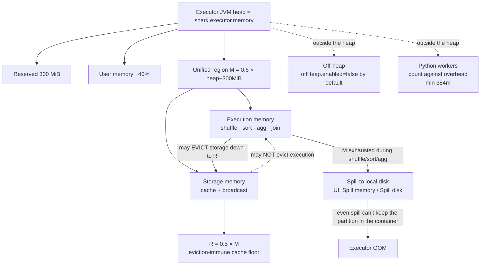

# Executor memory: unified model, spill & OOM

> **Databricks · PySpark Performance · Lesson 04**
> *Where the data actually lives while a task runs — and why the same job either finishes, spills to disk, or dies with an OOM.*
>
> `Spark 3.2+ / DBR LTS` · `spark.memory.fraction = 0.6` · `storageFraction = 0.5` · `reserved 300 MiB` · `Verified Jun 2026 docs`

---

## What it is

An **executor** is a JVM process on a worker node that runs your tasks and holds cached
data. Its heap is not one undifferentiated pool — Spark's **UnifiedMemoryManager** carves
it into four regions, and which region runs out first decides whether your job is fast,
slow (spills to disk), or dead (OOM):

- **Reserved memory (300 MiB)** — a fixed slice carved off first, for Spark's own internals.
- **User memory (~40%)** — your data structures, UDF state, and Spark metadata; *not*
  managed by the unified manager.
- **Unified region `M`** = `spark.memory.fraction` × (heap − 300 MiB), **`0.6`** by default.
  This is the shared pool for the two things that actually do the work:
  - **Execution memory** — shuffle, sort, aggregation, and join buffers (transient, per-task).
  - **Storage memory** — cached/persisted blocks + broadcast data (long-lived).
- **Storage sub-region `R`** = `spark.memory.storageFraction` × M, **`0.5`** by default —
  the part of cache that execution **cannot** evict.

> 🟣 **The one rule to remember:** Execution and Storage share region `M` and borrow from
> each other — but the borrowing is **asymmetric**. **Execution can evict Storage** down to
> `R`; **Storage can never evict Execution.** Execution always wins, because a running task
> must make progress; a cached block can always be recomputed. Internalize that asymmetry
> and spill vs OOM stops being mysterious.

---

## Why it matters

- **Spill and OOM are the two most common "my job is slow / my job died" tickets.** Both
  are memory-region problems, and you can only diagnose them if you know which region
  (execution vs storage) was under pressure and why.
- **Spill is silent tax.** When execution memory is exhausted during a shuffle/sort/agg/
  join, Spark spills to local disk and the job *still finishes* — just much slower (disk
  I/O + extra GC). Many "slow Spark jobs" are really un-noticed spill.
- **Executor OOM kills the task (and often the executor).** It happens when even spilling
  can't keep a partition within the container limit — usually a single skewed partition,
  too many cached blocks pinned in `R`, or **oversized Python workers** that live *outside*
  the JVM heap and blow the container.
- **PySpark adds a hidden region the heap diagram doesn't show.** Python UDFs, `mapInPandas`,
  and Pandas UDFs run in **Python worker processes outside the JVM heap** — they count
  against the container's *overhead*, not `M`. A "memory" bug in a Python-heavy job is
  often an overhead bug, and bumping `spark.executor.memory` does nothing.
- Interviewers love this: *"Walk me through the executor memory model — what's the
  difference between spill and OOM, and why can't storage evict execution?"*

---

## How it works — deep dive

### Sub-topic 1 · Executor memory overview — the four regions

`<chip:analogy>` *Analogy:* think of the executor heap as a **shared commercial kitchen**.
A fixed **back office** (reserved 300 MiB) is walled off first. The rest splits into your
**private pantry** (user memory) and one big **shared counter** (region `M`). On that
counter, the **active cooking workspace** (execution) and the **shelf of prepped
ingredients** (storage/cache) share the same surface — and when the cook needs room *right
now*, they shove prepped ingredients aside, but a shelf can never push the cook off the
counter.

How the heap is partitioned, in order:

1. **Reserved = 300 MiB** (fixed). Carved off the top of the heap before anything else.
2. **Usable heap** = `spark.executor.memory` − 300 MiB (default `spark.executor.memory = 1g`).
3. **Unified region `M`** = `spark.memory.fraction` × usable heap = **0.6** × (heap − 300 MiB).
4. **User memory** = the remaining **~40%** outside `M` — user objects, UDF state, Spark
   internal metadata, and a safety cushion for large/sparse records.

`<chip:usecase>` *Use case:* on a default 1 GB executor, `M ≈ 0.6 × (1024 − 300) MiB ≈ 434 MiB`
is *all* you have shared between every shuffle buffer and every cached block on that
executor. That's why caching a big DataFrame and running a heavy shuffle in the same stage
fight for the same few hundred MiB — and someone spills.

### Sub-topic 2 · Executor memory management — execution vs storage

There are two consumers of region `M`, with very different lifecycles:

- **Execution memory** — buffers for **shuffle, sort, aggregation, and join** (e.g. the
  hash map of a hash aggregation, the sort buffer of a sort-merge join). It is **transient**:
  acquired by a task, released when the task finishes. It is the memory that, when short,
  causes **spill**.
- **Storage memory** — **cached/persisted blocks** (`cache()`/`persist()`) and **broadcast**
  data. It is **long-lived**: a cached block stays until evicted or `unpersist()`-ed. It is
  the memory that, when over-allocated, **starves execution** and causes spill/OOM elsewhere.

`<chip:analogy>` *Analogy:* execution memory is scratch paper you grab, scribble on, and
throw away mid-task; storage memory is a reference book you keep on the desk for the whole
session.

### Sub-topic 3 · The unified memory model — borrow & the evict asymmetry

This is the crux of the lesson. `M` is **unified**, not statically split:

- **Borrow freely:** "When no execution memory is used, storage can acquire all the
  available memory and vice versa." If nothing is cached, a shuffle can use *all* of `M`;
  if nothing is shuffling, cache can fill *all* of `M`.
- **Execution may evict Storage — down to `R`.** When a task needs execution memory and `M`
  is full of cached blocks, Spark **evicts** cached blocks (the ones *above* `R`) to free
  room. Blocks inside `R` (= `storageFraction` × M = **0.5 × M**) are **immune** to eviction.
- **Storage may NOT evict Execution.** If cache wants more room but execution is using it,
  cache just **doesn't get it** — it spills the new block to disk (per its storage level)
  or fails to cache. Execution memory is **never** taken from a running task.

> **Why the asymmetry?** A running task *must* make progress to finish the stage; evicting
> its execution buffers would deadlock or fail the task. A cached block, by contrast, is a
> performance optimization — if evicted, Spark just **recomputes** it from lineage. So the
> design rule is simple: *active work beats cached convenience.*

`<chip:usecase>` *Use case:* you `cache()` a 400 MiB DataFrame, then run a big aggregation on
it. The aggregation needs execution memory; Spark evicts the cached blocks above `R` to
make room, so the "after-first-action" cache is smaller than you expected and the second
read partly recomputes. That's the evict asymmetry biting a real job.

### Sub-topic 4 · Data spilling in Spark — the warning sign before death

- **What it is:** when **execution** memory is exhausted during a shuffle/sort/aggregation/
  join, Spark **spills** the in-memory data structures to **local disk**. The docs: "When
  data does not fit in memory Spark will spill these tables to disk, incurring the
  additional overhead of disk I/O and increased garbage collection."
- **What it means:** the job **still finishes** — spill is a graceful degradation, not a
  crash. But it pays disk I/O (write then read back) and more GC, so a spilling stage can be
  several times slower than an in-memory one.
- **How to see it:** the Spark UI shows **spill (memory)** and **spill (disk)** per task and
  per stage (memory = the in-memory size of what spilled; disk = the bytes written). Any
  non-zero spill on a stage is a flag to investigate. *(The spill mechanism is doc-grounded;
  those exact UI label strings are real UI fields but aren't quotable from the config/tuning
  pages.)*

`<chip:analogy>` *Analogy:* spill is overflow parking. The lot (execution memory) is full,
so cars (data) park in the muddy field down the road (disk). Everyone still parks — it's
just slower to walk back.

### Sub-topic 5 · Why & how executor OOM — when spilling isn't enough

Executor OOM (`java.lang.OutOfMemoryError`) happens when **even spilling can't keep a
partition within the container limit**. Common causes:

- **A single huge/skewed partition** — one key has most of the rows, so one task's buffers
  exceed memory faster than spill can drain them (Lesson 08 fixes this with AQE skew join /
  salting).
- **Too many cached blocks pinned in `R`** — `R` is immune to eviction, so a heavily-cached
  executor leaves little room for execution → pressure → OOM. Cache less, or use a
  disk-spilling storage level.
- **Oversized Python workers** — Python processes outside the JVM heap (see sub-topic 7)
  grow past the container's overhead allotment and the cluster manager kills the container.
- **Too-small `spark.executor.memory` / overhead** — the heap or the overhead is simply
  undersized for the partition size.

`<chip:usecase>` *Use case:* a `groupBy` on a column where 90% of rows share one value →
one task tries to build a hash aggregation for 90% of the data → it spills, spills, then
exceeds the container and the executor dies. Fix the skew, don't just add RAM.

**Fixes (in order):** more/smaller partitions (so each task's slice fits), **fix skew**
(AQE skew join → salting), **cache less / serialized / off-heap**, and only then raise
`spark.executor.memory` or the overhead.

### Sub-topic 6 · Off-heap memory — outside the JVM, no GC

- **What it is:** memory allocated **outside the JVM heap** (via `sun.misc.Unsafe`/Tungsten),
  so it is **not subject to garbage collection** — no GC pauses for that data.
- **Configs:** `spark.memory.offHeap.enabled = false` (default) and
  `spark.memory.offHeap.size = 0` (default; **must be set to a positive value when you
  enable it**). When enabled, off-heap is added to execution+storage capacity, so the docs
  advise you **"shrink your JVM heap size accordingly"** (don't double-count the RAM).
- **Trade-off:** less GC pressure and more predictable latency on large heaps, but you must
  hand-size it (no automatic management) and it's mainly a win when GC is your bottleneck.

### Sub-topic 7 · PySpark (Python-worker) memory — the region outside the bar

This is the most-missed part of the model for PySpark engineers:

- **Where Python runs:** Python UDFs, `mapInPandas`, Pandas/Arrow UDFs, and any RDD `map`
  in Python execute in **separate Python worker processes**, **outside the JVM heap**. They
  do **not** use region `M`.
- **The default:** `spark.executor.pyspark.memory` is **Not set** by default. When unset,
  Spark **does not limit** the Python workers, and their memory counts against the
  **container's overhead/limit** — a common **hidden OOM cause** for Python-heavy jobs.
- **Overhead covers it:** `spark.executor.memoryOverhead` =
  `spark.executor.memory × spark.executor.memoryOverheadFactor` (**factor 0.10**; 0.40 for
  Kubernetes non-JVM), with a minimum `spark.executor.minMemoryOverhead = 384m` (a settable
  key since Spark 4.0.0; the 384 MB minimum predates it). Overhead covers **off-heap, the
  shuffle/network buffers, and — when `pyspark.memory` is unset — the Python workers.** On
  YARN/K8s, setting `spark.executor.pyspark.memory` adds the limit to the executor's resource
  request.

`<chip:usecase>` *Use case:* a Pandas UDF that materializes a big batch per group blows the
container even though the JVM heap looks fine. The cure is **more overhead** (or a smaller
batch / a native function), **not** a bigger `spark.executor.memory`.

### Reading it in the plan and the Spark UI

- **`.explain(mode="formatted")`** shows the *operators* that consume execution memory —
  `HashAggregate`, `SortMergeJoin` + `Sort`, `ShuffledHashJoin`, `Exchange`. These are the
  nodes that spill when memory is short.
- **Spark UI → Stages tab:** per-task and per-stage **Spill (Memory)** and **Spill (Disk)**
  columns — non-zero = execution memory was exhausted. Also **GC Time** (spill drives GC up).
- **Spark UI → Storage tab:** every cached DataFrame, its **storage level**, and the
  **fraction cached in memory vs on disk** — if a cache shows "50% cached," execution
  evicted the rest (the asymmetry in action).
- **Spark UI → Executors tab:** **Storage Memory** used/total per executor, and **Failed
  Tasks / dead executors** — repeated executor death with OOM in the logs = container limit
  blown (heap or overhead).

---

## How to do it (code + verification)

> **Track rule:** every technique is paired with *how to prove it worked* — the
> `.explain()` plan node or the Spark-UI signal. Apply, then verify. Never assume.

### Inspect the unified-memory configs

```python
# The four numbers that define region M. Read them before tuning anything.
print(spark.conf.get("spark.executor.memory"))          # default "1g" — the JVM heap
print(spark.conf.get("spark.memory.fraction"))          # default "0.6" — M = 0.6 * (heap - 300 MiB)
print(spark.conf.get("spark.memory.storageFraction"))   # default "0.5" — R = 0.5 * M (eviction-immune cache)

# VERIFY (do the arithmetic): on a 1g executor,
#   usable = 1024 - 300 = 724 MiB ; M = 0.6 * 724 ≈ 434 MiB ; R = 0.5 * 434 ≈ 217 MiB
# That ~434 MiB is shared by EVERY shuffle buffer and EVERY cached block on the executor.
```

### See (and cure) a spill

```python
# CREATE the condition: a wide aggregation over many groups stresses EXECUTION memory.
from pyspark.sql import functions as F
big = spark.range(0, 200_000_000).withColumn("k", (F.rand() * 50_000_000).cast("long"))
agg = big.groupBy("k").count()

# VERIFY the operator that will spill is in the plan:
agg.explain(mode="formatted")
#   look for: HashAggregate(keys=[k], ...)  +  Exchange hashpartitioning(k, 200)
#   HashAggregate is the execution-memory consumer that spills when M is exhausted.

# Force the job to run, then READ THE UI:
agg.write.format("noop").mode("overwrite").save()
# Spark UI → Stages → the aggregation stage → columns "Spill (Memory)" / "Spill (Disk)".
# Non-zero spill = execution memory ran out. Cure: more shuffle partitions (smaller slices)
# so each task's buffer fits in M:
spark.conf.set("spark.sql.shuffle.partitions", 800)   # smaller partitions → less per-task memory
# Re-run and confirm the spill columns drop toward zero. (Reset the conf afterwards.)
```

### Watch execution evict storage (the asymmetry)

```python
from pyspark import StorageLevel

# Cache a DataFrame, then run heavy EXECUTION work on it in the same stage.
cached = big.persist(StorageLevel.MEMORY_AND_DISK)   # DataFrame default level; spills cache to disk
cached.count()                                        # materialize the cache (lazy until an action)

heavy = cached.groupBy("k").count()                   # execution memory now competes with the cache
heavy.write.format("noop").mode("overwrite").save()

# VERIFY in Spark UI → Storage tab: the cached DataFrame may show < 100% "Cached" / "Fraction in
# memory" — execution EVICTED the cache blocks above R to make room. Storage could not, in turn,
# evict execution. That is the asymmetry, visible.
cached.unpersist()                                    # always release cache when done (frees R)
```

### Enable off-heap memory (when GC is the bottleneck)

```python
# Off-heap lives OUTSIDE the JVM heap → no GC for that data. You MUST size it explicitly,
# and shrink the heap accordingly so you don't double-count RAM (per the tuning docs).
spark.conf.set("spark.memory.offHeap.enabled", "true")
spark.conf.set("spark.memory.offHeap.size", str(2 * 1024 * 1024 * 1024))  # 2 GiB, in bytes (>0 required)

# VERIFY: Spark UI → Executors tab → "Off Heap Memory Used / Total" becomes non-zero, and the
# Stages tab "GC Time" should drop for the same workload. (These are cluster-level confs — set
# them at cluster creation in production, not mid-session.)
```

### Budget Python-worker memory (the hidden OOM)

```python
# Python UDFs / Pandas UDFs run OUTSIDE the JVM heap, against the container's OVERHEAD.
# Default: spark.executor.pyspark.memory is NOT set, so Spark does not limit Python workers.
print(spark.conf.get("spark.executor.pyspark.memory", "<not set>"))   # → "<not set>" by default

# For a Python-heavy job that OOMs the CONTAINER (not the heap), raise OVERHEAD — set these at
# cluster creation (they are not runtime-settable per query):
#   spark.executor.memoryOverheadFactor = 0.10  (default; covers off-heap + shuffle + Python)
#   spark.executor.memoryOverhead       = e.g. "2g"  (an explicit floor for Python-heavy work)
# VERIFY: container OOM kills (in the executor logs / Executors tab "Failed Tasks") stop after
# raising overhead — whereas bumping spark.executor.memory alone would NOT have helped.
```

---

## Comparison table

| Dimension | **Execution memory** | **Storage memory** |
| --- | --- | --- |
| **Holds** | Shuffle / sort / aggregation / join buffers | Cached/persisted blocks + broadcast data |
| **Lifecycle** | Transient (per-task, released on completion) | Long-lived (until evicted / `unpersist()`) |
| **Lives in** | Region `M` (shared) | Region `M` (shared), guaranteed `R` = 0.5 × M |
| **Can evict the other?** | **Yes** — evicts Storage down to `R` | **No** — never evicts Execution |
| **When short →** | **Spill to disk** (slow, but finishes) | New block spills to disk / isn't cached |
| **Failure mode** | OOM if even spill can't keep up | Pressures execution → spill/OOM elsewhere |
| **Tune with** | shuffle partitions, fix skew, off-heap | cache less, serialized/disk levels, `unpersist()` |

| Region | Formula (default) | On a 1g executor |
| --- | --- | --- |
| **Reserved** | 300 MiB (fixed) | 300 MiB |
| **Usable heap** | `executor.memory` − 300 MiB | ~724 MiB |
| **Unified `M`** | `0.6` × usable | ~434 MiB |
| **Storage floor `R`** | `0.5` × M | ~217 MiB |
| **User memory** | ~40% × usable | ~290 MiB |
| **Off-heap** | `0` (disabled by default) | 0 |
| **Python workers** | outside heap; count vs **overhead** (min 384m) | not in `M` |

---

## Uses, edge cases & limitations

**Uses**
- **Diagnose a slow stage** → check **Spill (Memory/Disk)** in the Stages tab; spill means
  execution memory was short. Add partitions / fix skew before adding RAM.
- **Diagnose an executor OOM** → decide *which* region failed: heap (execution/storage) vs
  container overhead (Python/off-heap). The fix differs completely.
- **Right-size caching** → know that cache lives in `M` and only `R` is safe; don't cache so
  much that execution starves (Lesson 06).
- **Tame GC on big heaps** → enable **off-heap** (Lesson 10) so cached data leaves the heap.

**Edge cases**
- **Skew AQE can't fully fix** — a single key so dominant that even split sub-partitions
  exceed memory; you fall back to salting (Lesson 08) or a different key.
- **Cache pinned in `R`** — heavily-cached executors look "fine on heap" but OOM under a
  shuffle because `R` is immune to eviction; the cure is *less* cache, not more memory.
- **Python-worker blow-up** — a Pandas UDF batch that's huge per group OOMs the *container*
  while the JVM heap is idle; raise **overhead**, not `executor.memory`.
- **Broadcast in storage** — a broadcast relation consumes storage memory on every executor;
  a near-threshold broadcast (Lesson 02) can pressure `M` cluster-wide.

**Limitations**
- The unified model manages only the **JVM heap regions** (`M` + user). It does **not**
  manage Python-worker memory, off-heap (unless enabled), or the cluster manager's container
  limit — those are separate budgets you must size yourself.
- `spark.memory.fraction` / `storageFraction` are **cluster/JVM-level** — changing them
  mid-session via `spark.conf.set` does **not** resize an already-running executor; set them
  at cluster creation.
- Spill makes a job **slow, not safe forever** — a large enough skewed partition still OOMs
  no matter how much it spills.
- **OSS vs Databricks:** the unified-memory math (`0.6`/`0.5`/300 MiB/overhead 0.10) is the
  same OSS-Spark and Databricks. Databricks may layer its own overhead/Photon memory
  accounting on top; verify cluster sizing in the Azure Databricks compute docs.

---

## Common mistakes / gotchas

- **"Add more `executor.memory`" as the reflex fix.** If the failure is a Python worker or
  off-heap blowing the **container**, more heap does nothing — raise **overhead**. If it's
  spill from skew, more heap just delays the OOM; fix the skew.
- **Thinking the split is static 60/40 storage/execution.** It's *unified* — either can use
  all of `M`. The only fixed guarantee is `R` (the eviction-immune cache floor).
- **Believing storage can evict execution.** It can't — ever. Cache yields to active work,
  not the other way around. This single fact explains most spill/OOM puzzles.
- **Ignoring non-zero spill because "the job finished."** Spill is the early-warning sign;
  a slightly bigger input tomorrow turns that spill into an OOM.
- **Caching everything.** Cached blocks pin storage memory in `R` and pressure GC; cache
  only reused DataFrames, with the right level, and `unpersist()` when done (Lesson 06).
- **Forgetting Python lives outside the heap.** The unified-memory bar diagram does **not**
  include Python workers — they're an overhead-budget item, the #1 hidden PySpark OOM.
- **Changing `spark.memory.fraction` at runtime and expecting it to apply** — it's a
  cluster-launch setting; set it on the cluster, not in a notebook cell mid-job.

---

## At a glance



---

## References

- Apache Spark — Tuning Guide (memory management, unified model, spill, GC): https://spark.apache.org/docs/latest/tuning.html
- Apache Spark — Configuration (`spark.executor.memory`, `spark.memory.fraction`, `spark.memory.storageFraction`, `spark.memory.offHeap.*`, `spark.executor.memoryOverhead`, `spark.executor.pyspark.memory`): https://spark.apache.org/docs/latest/configuration.html
- Apache Spark — Cluster overview (executors, what runs where): https://spark.apache.org/docs/latest/cluster-overview.html
- Azure Databricks — Compute configuration (cluster/driver/executor sizing): https://learn.microsoft.com/en-us/azure/databricks/compute/configure

*Content verified against Apache Spark & Azure Databricks docs, June 2026. The unified-memory math (0.6 / 0.5 / 300 MiB / overhead 0.10) is identical OSS-Spark vs Databricks; Databricks-specific overhead/Photon accounting is noted where it differs.*
