# Adaptive Query Execution (AQE)

> **Databricks · PySpark Performance · Lesson 05**
> *The plan rewrites itself once it sees real data — coalescing tiny shuffle partitions, splitting skewed ones, and flipping a sort-merge join to a broadcast at runtime.*
>
> `Spark 3.2+ / DBR 7.3+` · `adaptive.enabled = true` · `advisory 64 MB · skew 5× & 256 MB` · `Verified Jun 2026 docs`

---

## What it is

**Adaptive Query Execution (AQE)** is Spark re-optimizing the **physical plan at runtime**, using the *actual* statistics Spark collects after each shuffle — instead of trusting the static, estimate-based plan Catalyst produced before the job ran.

A normal (non-adaptive) plan is decided **once**, before execution, from table stats and file sizes. Those estimates are often wrong: a filter shrinks a table more than expected, a `groupBy` produces wildly uneven partitions, a join side turns out tiny after a `WHERE`. AQE waits until a **shuffle stage finishes**, reads the real map-output sizes, then **rewrites the rest of the plan** to match reality.

It does three things in open-source Spark (a fourth on Databricks):

- **Coalesce post-shuffle partitions** — merge the hundreds of tiny partitions a shuffle produced into a handful of right-sized (~64 MB) ones, so you don't run 200 near-empty tasks.
- **Split skewed partitions** — detect a partition that's far bigger than its peers and break it into balanced sub-partitions, so one straggler task doesn't hold up the stage.
- **Switch the join strategy** — flip a planned sort-merge join to a broadcast hash join once the real (post-filter) size of one side is found to be small enough.
- *(Databricks only)* **Detect & propagate empty relations** — when a stage produces zero rows, prune the dependent branches of the plan.

> 🟣 **The one rule to remember:** AQE needs *real shuffle statistics* to act, so it only re-optimizes at **stage boundaries** (after a shuffle). It is on by default — leave it on, and let it coalesce / split / switch before you hand-tune `spark.sql.shuffle.partitions`.

---

## Why it matters

- **It fixes the two most common shuffle pathologies automatically.** "Too many tiny partitions" (200 default partitions on a small result → 200 wasteful tasks + scheduler overhead) and "one giant skewed partition" (a hot key → one task runs for minutes while the rest finished) are the bread-and-butter of slow Spark jobs. AQE handles both without code changes.
- **Static estimates are routinely wrong.** Catalyst plans from stats gathered *before* filters and aggregations run. A 5 GB dimension that a `WHERE region = 'US'` shrinks to 8 MB will still be planned as a sort-merge shuffle — until AQE sees the real 8 MB at runtime and broadcasts it.
- **It is the modern default answer to "my shuffle is slow."** Before you reach for manual `repartition`, a hand-set `shuffle.partitions`, or salting, AQE has usually already coalesced, split, and switched for you. Interviewers expect you to reach for AQE *first* and only hand-tune what it can't fix.
- **It composes with the rest of the track.** AQE's runtime join switch is the safety net behind Lesson 02's broadcast joins; its skew-join split is the first line of defence before Lesson 08's salting; Photon (Databricks' native execution engine) runs *underneath* AQE's adaptive plan — they're complementary, not alternatives.

---

## How it works — deep dive

### How AQE re-optimizes: the framework

`<chip:analogy>` *Analogy:* a non-adaptive plan is a road-trip route printed before you leave; AQE is live GPS that reroutes you at every junction once it sees the actual traffic.

- **Mechanism:** Spark splits the plan into **query stages** at shuffle (and broadcast) boundaries. It runs the leaf stages, **collects exact map-output statistics** (per-partition byte sizes after the shuffle write), then re-optimizes the *remaining* logical/physical plan with those real numbers before submitting the next stage. This repeats at every shuffle boundary.
- **Why it needs a shuffle:** the statistics AQE relies on are the shuffle's per-partition sizes. No shuffle → no runtime stats → nothing for AQE to adapt. That's why AQE acts at stage boundaries, not mid-stage.
- **Trade-off:** a tiny planning cost at each boundary in exchange for plans built on truth instead of estimates. On by default since **Spark 3.2.0** — note that AQE was *introduced* in 1.6.0 but only became **default-`true`** in 3.2.0 (SPARK-33679); do not conflate "since 1.6" with "default-on."

```python
# AQE master switch — on by default since Spark 3.2.0 / DBR 7.3+.
spark.conf.get("spark.sql.adaptive.enabled")   # -> 'true'

# VERIFY it's actually adapting: run a query with a shuffle, then read the plan.
# AQE-rewritten plans show AdaptiveSparkPlan + AQEShuffleRead nodes, and after a
# run the header flips to "isFinalPlan=true".
df.explain(mode="formatted")
#   == Physical Plan ==
#   AdaptiveSparkPlan isFinalPlan=true        <-- AQE is engaged ✅
#   +- == Final Plan ==
#      *(...) ... AQEShuffleRead coalesced
```

> In the **Spark UI → SQL/DataFrame** tab, an adaptive query shows an `AdaptiveSparkPlan` root and, after it runs, the DAG redraws to the *final* plan (you'll see `AQEShuffleRead` nodes where coalescing/skew-splitting happened).

### 1 · AQE Coalesce — merge tiny shuffle partitions

`<chip:analogy>` *Analogy:* instead of mailing 200 near-empty envelopes, AQE combines them into a few full ones — fewer trips, same contents.

- **The problem:** `spark.sql.shuffle.partitions` is **200** by default. A shuffle on a modestly-sized result therefore produces 200 partitions, many of them a few KB — so Spark schedules 200 tasks, most doing almost nothing. Task scheduling and I/O overhead dwarf the actual work.
- **Mechanism:** with `spark.sql.adaptive.coalescePartitions.enabled = true`, AQE reads the real post-shuffle partition sizes and **greedily merges adjacent partitions** until each coalesced partition is about `spark.sql.adaptive.advisoryPartitionSizeInBytes` (**64 MB**). It won't shrink a partition below `spark.sql.adaptive.coalescePartitions.minPartitionSize` (**1 MB**). The result: 200 tiny partitions → a handful of ~64 MB ones, so you run a handful of full tasks instead.
- **Why it's better than setting `shuffle.partitions` by hand:** the right partition count depends on the *runtime* data size, which you don't know at write time. AQE picks it from the actual shuffle output, per query, automatically.
- **Trade-off:** coalescing reduces parallelism slightly (fewer, bigger tasks) — almost always a win on small/medium results; on a genuinely huge result the 64 MB advisory keeps tasks reasonably sized.

`<chip:usecase>` *Use case:* a daily aggregation that outputs a few hundred MB. Without AQE it writes 200 tiny files / runs 200 tasks; with coalesce it runs ~5 balanced tasks and writes ~5 files.

```python
# These are the defaults; shown to make the levers explicit (and to tune the target).
spark.conf.set("spark.sql.adaptive.enabled", "true")
spark.conf.set("spark.sql.adaptive.coalescePartitions.enabled", "true")   # default true
spark.conf.set("spark.sql.adaptive.advisoryPartitionSizeInBytes", 64 * 1024 * 1024)  # 64 MB target
spark.conf.set("spark.sql.adaptive.coalescePartitions.minPartitionSize", 1 * 1024 * 1024)  # 1 MB floor

agg = sales.groupBy("store_id").sum("amount")   # a shuffle (wide dependency)

# VERIFY: post-shuffle partition count collapses from 200 toward a handful.
print(agg.rdd.getNumPartitions())   # AQE-coalesced count (e.g. ~5), not 200
# Plan shows an AQEShuffleRead node tagged "coalesced":
agg.explain(mode="formatted")       # look for: AQEShuffleRead coalesced
```

> **Spark UI signal:** in the **SQL** tab, the shuffle node reports far fewer post-shuffle partitions than 200; in the **Stages** tab the post-shuffle stage runs a handful of tasks instead of 200.

### 2 · AQE Split Partitions — break up skew

`<chip:analogy>` *Analogy:* if one checkout lane has 500 shoppers and the others have 5, AQE opens extra lanes *for that one queue* so everyone finishes together.

- **The problem (skew):** data unevenly distributed across keys means that after a shuffle, a few partitions are enormous while the rest are tiny. The huge partition becomes a **straggler task** — one task runs for minutes (and may spill or OOM) while every other task in the stage finished long ago. The whole stage waits on it.
- **Mechanism:** with `spark.sql.adaptive.skewJoin.enabled = true`, AQE inspects post-shuffle partition sizes during a sort-merge join. A partition is flagged **skewed** when it is **both**:
  - larger than `spark.sql.adaptive.skewJoin.skewedPartitionFactor` (**5.0**) × the **median** partition size, **and**
  - larger than `spark.sql.adaptive.skewJoin.skewedPartitionThresholdInBytes` (**256 MB**).

  When a partition trips **both** conditions, AQE **splits** it into multiple smaller sub-partitions and replicates the matching partition on the other side so the join still produces correct results — turning one giant task into several balanced ones.
- **Why both conditions:** the factor (`5×` median) catches *relative* skew; the absolute floor (256 MB) avoids splitting partitions that are merely a bit above a tiny median but not actually large enough to matter.
- **Trade-off:** the split adds some replication of the matching side, but converts a single multi-minute straggler into parallel sub-tasks — almost always a large net win. AQE skew join only handles **sort-merge joins**; severe skew it can't tame is where **salting** (Lesson 08) comes in.

`<chip:usecase>` *Use case:* `transactions ⋈ accounts` where one "house" account holds 40% of all rows. That one `account_id` partition is 5× the median and well over 256 MB → AQE splits it so the join doesn't hang on a single task.

```python
# Defaults shown explicitly (this is the skew-join lever set).
spark.conf.set("spark.sql.adaptive.skewJoin.enabled", "true")                       # default true
spark.conf.set("spark.sql.adaptive.skewJoin.skewedPartitionFactor", "5.0")          # > 5x median ...
spark.conf.set("spark.sql.adaptive.skewJoin.skewedPartitionThresholdInBytes",
               256 * 1024 * 1024)                                                    # ... AND > 256 MB

joined = transactions.join(accounts, "account_id")   # sort-merge join on a skewed key

# VERIFY: the plan shows the skew was detected and split.
joined.explain(mode="formatted")    # look for: AQEShuffleRead ... skewed=true (split sub-partitions)
```

> **Spark UI signal:** in the **Stages** tab for the join stage, compare the **task-time distribution** — without skew handling, `max` task time ≫ `median` (one straggler). With AQE skew split, the max collapses toward the median; the SQL-tab `AQEShuffleRead` node is tagged `skewed`.

### 3 · AQE Joins Strategy — switch sort-merge → broadcast at runtime

`<chip:analogy>` *Analogy:* you packed for a long road trip (sort-merge), but at the first stop you discover the destination is round the corner — so you ditch the heavy plan and just walk (broadcast).

- **The problem:** Catalyst chose a sort-merge join from *pre-execution* size estimates. But a filter/aggregation upstream may have shrunk one side far below the broadcast threshold — Catalyst didn't know that at plan time, so it's about to shuffle two big tables needlessly.
- **Mechanism:** after the shuffle that feeds the join, AQE sees the **actual** size of each side. If one side is now small enough, AQE **rewrites the join to a Broadcast Hash Join** — broadcasting the small side and skipping the big side's shuffle entirely. This uses a **runtime** broadcast threshold (distinct from the static `spark.sql.autoBroadcastJoinThreshold` Catalyst used up front).
- **OSS vs Databricks:** OSS uses the runtime broadcast switch tied to the standard threshold logic. **Databricks** exposes a dedicated, *higher* runtime switch, `spark.databricks.adaptive.autoBroadcastJoinThreshold` = **30 MB** (vs the OSS static 10 MB `spark.sql.autoBroadcastJoinThreshold`) — so on Databricks a side that ends up ≤ 30 MB can flip to broadcast at runtime even if it was over 10 MB at plan time.
- **Trade-off:** you trade the double shuffle for a broadcast (small side to driver → every executor). It only fires when the real size is genuinely small, so the risk of broadcasting too much is low — but it's still bounded by the small side fitting in memory.

`<chip:usecase>` *Use case:* `events ⋈ dim_country` where `dim_country` is "big" in the catalog but a `WHERE active = true` reduces it to a few MB. Catalyst plans sort-merge; AQE sees the few MB after the shuffle and flips it to broadcast.

```python
# OSS static broadcast threshold (used by Catalyst BEFORE runtime):
spark.conf.get("spark.sql.autoBroadcastJoinThreshold")   # -> '10485760' (10 MB)

# On Databricks, AQE's RUNTIME switch can use a higher bar:
spark.conf.get("spark.databricks.adaptive.autoBroadcastJoinThreshold")  # -> 30 MB (Databricks)

joined = events.join(dim_country.where("active = true"), "country_code")

# VERIFY: the FINAL (post-run) plan flips SortMergeJoin -> BroadcastHashJoin.
joined.explain(mode="formatted")
#   AdaptiveSparkPlan isFinalPlan=true
#   +- == Final Plan ==
#      BroadcastHashJoin ...     <-- AQE switched it at runtime ✅
#   +- == Initial Plan ==
#      SortMergeJoin ...         <-- what Catalyst planned from stale estimates
```

> **Spark UI signal:** the **SQL** tab shows the *initial* plan as `SortMergeJoin` and, after the run, the **final** plan redrawn with `BroadcastHashJoin` and no big-side `Exchange`.

### Databricks: the 4th feature and Photon

- **Empty-relation propagation (Databricks-listed 4th feature):** when a stage produces **zero rows** at runtime, AQE detects the empty relation and **propagates** it — pruning the dependent branches of the plan (e.g. an inner join with one empty side becomes empty without doing the rest of the work).
- **AQE is on by default on Databricks since DBR 7.3 LTS.** Databricks also exposes `spark.databricks.optimizer.adaptive.enabled = true`.
- **Photon ≠ AQE.** Photon is Databricks' native, vectorized **execution** engine (the layer that runs operators); AQE works at the **planning** layer (it rewrites the plan). They're **complementary** — Photon executes whatever plan AQE finalizes. Keep AQE on with Photon; one does not replace the other.

---

## The code you'll write (and how to verify it)

> **Track rule:** every technique is paired with *how to prove it worked* — the `.explain()` plan node or the Spark-UI signal. Apply, then verify. Never assume.

### See the "before" by turning AQE off (demonstration only)

```python
# DEMO ONLY: disable AQE to capture the non-adaptive baseline, then re-enable it.
spark.conf.set("spark.sql.adaptive.enabled", "false")
agg = sales.groupBy("store_id").sum("amount")
print(agg.rdd.getNumPartitions())     # 200 — the static spark.sql.shuffle.partitions default
agg.explain(mode="formatted")         # no AdaptiveSparkPlan / AQEShuffleRead

spark.conf.set("spark.sql.adaptive.enabled", "true")   # ALWAYS reset — AQE should stay on
print(sales.groupBy("store_id").sum("amount").rdd.getNumPartitions())  # coalesced (e.g. ~5)
```

### Tune the coalesce target and floor

```python
# Make AQE aim for larger post-shuffle partitions (fewer, bigger tasks):
spark.conf.set("spark.sql.adaptive.advisoryPartitionSizeInBytes", 128 * 1024 * 1024)  # 128 MB
# Don't let it produce partitions below 4 MB:
spark.conf.set("spark.sql.adaptive.coalescePartitions.minPartitionSize", 4 * 1024 * 1024)

# VERIFY: re-run the aggregation and confirm getNumPartitions() drops further
# and the SQL-tab AQEShuffleRead node reports the new partition sizing.
```

### Spark SQL equivalents (configs apply the same way)

```sql
-- AQE configs are session SQL confs; SET them in SQL just like in code.
SET spark.sql.adaptive.enabled = true;
SET spark.sql.adaptive.coalescePartitions.enabled = true;
SET spark.sql.adaptive.skewJoin.enabled = true;

-- Then EXPLAIN FORMATTED to read the adaptive plan (AdaptiveSparkPlan root):
EXPLAIN FORMATTED
SELECT account_id, count(*) FROM transactions GROUP BY account_id;
```

### Contrast: hand-tuning vs letting AQE decide

```python
# ❌ Old habit: guess a shuffle partition count globally for the whole session.
spark.conf.set("spark.sql.shuffle.partitions", 8)   # wrong for the next query with a huge result

# ✅ Modern: leave AQE on; it sizes post-shuffle partitions per query from real stats.
spark.conf.set("spark.sql.shuffle.partitions", 200)             # the pre-AQE upper bound
spark.conf.set("spark.sql.adaptive.coalescePartitions.enabled", "true")  # AQE coalesces down per query
# VERIFY: getNumPartitions() adapts to each query's data size — small result coalesces to few,
# large result stays larger — without you re-tuning the conf.
```

---

## Comparison table

| Dimension | AQE Coalesce | AQE Split (skew join) | AQE Join switch |
| --- | --- | --- | --- |
| **Problem it fixes** | Too many tiny shuffle partitions | One skewed/straggler partition | Sort-merge chosen on a stale estimate |
| **Lever (default)** | `coalescePartitions.enabled=true` | `skewJoin.enabled=true` | runtime broadcast threshold |
| **Key number** | advisory **64 MB**, min **1 MB** | **> 5×** median **AND > 256 MB** | OSS 10 MB static → DBX **30 MB** runtime |
| **What it does** | Merges adjacent partitions to ~64 MB | Splits the hot partition into sub-partitions | Flips `SortMergeJoin` → `BroadcastHashJoin` |
| **Needs** | A shuffle's real partition sizes | A sort-merge join + real sizes | Real post-shuffle size of a join side |
| **Plan / UI signal** | `AQEShuffleRead coalesced`; fewer tasks | `AQEShuffleRead skewed`; max task ≈ median | final plan = `BroadcastHashJoin`, no big-side `Exchange` |
| **When it can't help** | Output genuinely needs high parallelism | Skew too extreme → **salt** (Lesson 08) | Small side still too big to broadcast |

---

## Uses, edge cases & limitations

**Uses**
- **Leave AQE on as the default** for every job — it coalesces, splits, and switches with zero code changes and is the first answer to a slow shuffle.
- **Stop hand-setting `spark.sql.shuffle.partitions`** — let coalesce size partitions per query from real stats; only set the conf as an upper bound.
- **First line of defence against skew** — enable AQE skew join before reaching for manual salting (Lesson 08); salt only the skew AQE can't tame.
- **Safety net for join estimates** — AQE's runtime sort-merge → broadcast switch covers the case where a filter shrinks a side after planning (the gap Lesson 02 warned about).

**Edge cases**
- **No shuffle, no adaptation.** A map-only job (pure `select`/`filter`, no wide op) has no shuffle stats, so AQE has nothing to re-optimize — don't expect coalescing on a shuffle-free plan.
- **Skew that misses a threshold.** A hot partition that's 5× the median but only 100 MB (< 256 MB) is **not** split — both conditions must hold. Very large but uniform partitions (high median) can also dodge the 5× factor. Residual skew → salt.
- **AQE skew join is sort-merge only.** It doesn't split skew inside a broadcast or shuffle-hash join; if the strategy isn't sort-merge, the skew split won't apply.
- **Reading the plan too early.** `explain()` before the query runs may show `isFinalPlan=false` / the initial plan. The *final* adaptive plan (the switch/coalesce/split) is only certain after execution — read it post-run or in the Spark UI's final DAG.
- **Forcing `broadcast()` can pre-empt AQE.** A manual hint fixes the strategy up front; usually fine, but it removes AQE's runtime choice — prefer letting AQE decide unless you have a known, capped small side.

**Limitations**
- **Planning-layer only.** AQE rewrites the plan; it does not change *execution* (that's Tungsten/Photon). It can't fix a fundamentally bad data layout — e.g. it won't add partition pruning (Lesson 07) or bucketing (Lesson 11) for you.
- **Version gating.** `spark.sql.adaptive.enabled` defaults to `true` **only since Spark 3.2.0** (introduced 1.6.0); coalesce min-partition-size and several skew configs are **3.2+**. On older runtimes you may need to enable AQE explicitly. On Databricks, on by default since **DBR 7.3 LTS**.
- **OSS lists 3 features; Databricks lists 4.** Empty-relation propagation is the Databricks-documented 4th feature — don't claim it as an OSS AQE feature.
- **It adapts the *remaining* plan, not the past.** Work already done in a completed stage isn't redone; AQE only optimizes downstream of the boundary it just observed.

---

## Common mistakes / gotchas

- **Conflating "AQE since 1.6" with "default-on."** AQE was *introduced* in Spark 1.6.0 but only became **default-`true` in 3.2.0** (SPARK-33679). Quoting "since 1.6" as the default-on version is wrong.
- **Disabling AQE to "control" the plan.** Turning AQE off to force a deterministic plan throws away the runtime coalesce/skew-split/join-switch that usually beats hand-tuning. Keep it on; scope a `broadcast()` hint if you need one specific join fixed.
- **Hand-setting `shuffle.partitions` low and wondering why a big query is slow.** A globally small partition count starves a large query of parallelism. Leave AQE to coalesce per query instead.
- **Expecting skew split when only one threshold is met.** A partition must be **> 5× median *and* > 256 MB**. Many "AQE didn't fix my skew" cases are a hot partition under 256 MB — that's a salting job (Lesson 08).
- **Confusing the OSS 10 MB static threshold with the Databricks 30 MB runtime switch.** `spark.sql.autoBroadcastJoinThreshold` (10 MB) is what Catalyst uses up front; `spark.databricks.adaptive.autoBroadcastJoinThreshold` (30 MB) is the Databricks runtime switch AQE uses. Say which you mean.
- **Thinking Photon replaces AQE (or vice-versa).** Photon is the execution engine; AQE is the runtime planner. Both should be on — they operate at different layers.
- **Reading `explain()` before the run and assuming the initial plan is final.** Look for `isFinalPlan=true` (or read the Spark UI after execution) to see what AQE actually did.

---

## At a glance

```mermaid
flowchart TD
  A[Catalyst plans from pre-run estimates<br/>SortMergeJoin · 200 shuffle partitions] --> B[Run a stage up to a shuffle boundary]
  B --> C[AQE reads REAL map-output stats<br/>per-partition byte sizes]
  C --> D{Too many tiny partitions?}
  D -- yes --> E[Coalesce to ~64 MB chunks<br/>AQEShuffleRead coalesced]
  C --> F{Partition &gt; 5x median AND &gt; 256 MB?}
  F -- yes --> G[Split skewed partition into sub-partitions<br/>AQEShuffleRead skewed]
  C --> H{A join side now small enough?}
  H -- yes --> I[Switch SortMergeJoin to BroadcastHashJoin<br/>no big-side shuffle]
  E --> V[Submit re-optimized next stage]
  G --> V
  I --> V
  V --> W[VERIFY: AdaptiveSparkPlan isFinalPlan=true in .explain&#40;&#41; / Spark UI final DAG]
```



---

## References

- Apache Spark — SQL Performance Tuning (Adaptive Query Execution: coalesce, skew join, join switch): https://spark.apache.org/docs/latest/sql-performance-tuning.html
- Apache Spark — Configuration (`spark.sql.adaptive.*`, `spark.sql.shuffle.partitions`, `autoBroadcastJoinThreshold`): https://spark.apache.org/docs/latest/configuration.html
- Apache Spark — SQL join/partitioning hints (interplay with AQE, `REBALANCE`): https://spark.apache.org/docs/latest/sql-ref-syntax-qry-select-hints.html
- Azure Databricks — Adaptive Query Execution (DBR default, 4th feature, runtime broadcast switch): https://learn.microsoft.com/en-us/azure/databricks/optimizations/aqe
- Azure Databricks — Photon (native execution engine, complementary to AQE): https://learn.microsoft.com/en-us/azure/databricks/compute/photon

*Content verified against Apache Spark & Azure Databricks docs, June 2026. OSS-Spark vs Databricks defaults are noted where they differ.*
