# Cache & persist: stop recomputing the same DataFrame

> **Databricks · PySpark Performance · Lesson 06**
> *Spark is lazy — by default it recomputes a DataFrame from scratch on every action. Cache/persist pin the computed result so later actions reuse it instead of re-running the whole lineage.*
>
> `Spark 3.2+ / DBR LTS` · `DataFrame default = MEMORY_AND_DISK` · `Verified Jun 2026 docs`

---

## What it is

By default a DataFrame holds only a **recipe** (its lineage of transformations), not its
rows. Every **action** (`count`, `write`, `collect`) re-runs that recipe from the source.
**Caching** stores the *computed* partitions so the next action reads them instead of
recomputing:

- **`df.cache()`** — shorthand for `df.persist()` with the **default** storage level.
- **`df.persist(level)`** — same thing, but *you* pick the **storage level** (where the
  blocks live: memory, disk, off-heap; replicated or not).
- **`df.unpersist()`** — drop the cached blocks and free the memory. **Eager** (immediate),
  unlike cache/persist which are lazy.

> 🟣 **The one rule to remember:** `cache()` == `persist()` with the **default level**.
> The most-confused fact on this topic: that default is **not the same for RDDs and
> DataFrames** — RDD `cache()` = `MEMORY_ONLY`, but **DataFrame `cache()` = `MEMORY_AND_DISK`**
> (the PySpark enum is `MEMORY_AND_DISK_DESER`). Quote the right one for the right object.

---

## Why it matters

- **Spark recomputes by default.** Run three actions on the same DataFrame and Spark
  executes the full lineage — every read, filter, join, shuffle — **three times**. If that
  lineage contains an expensive shuffle or a wide join, you're paying for it on every action.
- **Caching trades memory for compute.** Materialize the result once; later actions read the
  stored blocks. The classic win is **iterative / branching** work: ML training loops,
  repeated exploratory queries on the same cleaned DataFrame, or one intermediate result fed
  into several writes.
- **But caching is not free** — and over-caching *hurts*. Cached blocks pin **Storage memory**
  (the `R` region from Lesson 04), which can **evict execution memory** and trigger spill or
  GC pressure. Caching a DataFrame you read **once** is pure overhead. Interviewers love this
  because the wrong instinct ("cache everything") makes jobs slower.

`<chip:usecase>` *Use case:* you clean and join a 500 GB events table once, then run 6
aggregations off it for a dashboard build — cache the cleaned DataFrame so the expensive
join runs **once**, not six times.

---

## How it works — deep dive

### Quick recap: lazy lineage is why caching exists

`<chip:analogy>` *Analogy:* an uncached DataFrame is a **recipe card** — every time you want
the dish you cook it from raw ingredients. Caching is **cooking it once and putting it in the
fridge**: later you just reheat. The catch is fridge space (memory) is finite, and leaving
food in there you'll never eat (a read-once DataFrame) just wastes the shelf.

A DataFrame's transformations are lazy — they only extend the plan. The plan runs from the
source on **each action**. `persist()` inserts a checkpoint: the first action computes **and
stores** the partitions; subsequent actions read the stored copy. That's the entire idea —
everything below is *where* the copy lives and *what shape* it's in.

### 1 · `cache()` — the one-liner

- **Mechanism:** `df.cache()` sets the storage level to the default and returns the DataFrame.
  It is **lazy** — nothing is stored until the first action materializes it.
- **The default level:** for a **DataFrame/Dataset** it's `MEMORY_AND_DISK` — keep blocks in
  memory, and **spill any that don't fit to local disk** (so a too-big cache degrades to disk
  reads rather than failing). In PySpark this enum surfaces as `MEMORY_AND_DISK_DESER`
  ("Disk Memory Deserialized 1x Replicated").
- **Trade-off:** zero ceremony, but you don't control the level. If memory is tight, the
  default still tries memory first — fine for most cases, but you may want `DISK_ONLY` to keep
  cache out of the heap entirely.

```python
df.cache()           # == df.persist()  → default level MEMORY_AND_DISK (DataFrame)
```

### 2 · `persist(level)` — you choose where it lands

- **Mechanism:** identical to `cache()` but you pass a `StorageLevel`. The level encodes four
  independent choices: **memory? disk? off-heap?**, **serialized?**, and **replicated to 2
  nodes?**.
- **When to override the default:**
  - **`DISK_ONLY`** — the DataFrame is too big for memory, or you want zero heap/GC pressure
    from cache; reads come from local disk.
  - **`MEMORY_AND_DISK_2`** / **`DISK_ONLY_2`** — replicate each block to **two** nodes so a
    lost executor doesn't force a recompute (fault tolerance for long, expensive lineages).
  - **`OFF_HEAP`** — store serialized blocks in **off-heap** memory (outside the JVM heap → no
    GC on them); experimental, requires `spark.memory.offHeap.enabled=true` and a positive
    `spark.memory.offHeap.size`.
- **Trade-off:** more memory used (or more disk I/O, or 2× storage for `_2`) in exchange for
  fewer recomputes — pick the level that matches your memory budget and fault-tolerance need.

```python
from pyspark.storagelevel import StorageLevel

df.persist(StorageLevel.MEMORY_AND_DISK)   # explicit form of the DataFrame default
df.persist(StorageLevel.DISK_ONLY)         # too big for RAM → keep heap free, read from disk
df.persist(StorageLevel.MEMORY_AND_DISK_2) # replicate to 2 nodes → survive an executor loss
```

### 3 · Storage levels — the matrix

A `StorageLevel` is a combination of flags. The full **Scala/Java** set:

- `MEMORY_ONLY` (`_2`) — RAM only; if it doesn't fit, the missing partitions are **recomputed**
  on demand. (This is the **RDD** default.)
- `MEMORY_AND_DISK` (`_2`) — RAM, spill overflow to disk. (This is the **DataFrame** default.)
- `DISK_ONLY` (`_2`, `_3`) — local disk only.
- `MEMORY_ONLY_SER`, `MEMORY_AND_DISK_SER` — store a **serialized** byte array per partition
  (smaller, but CPU to deserialize on read).
- `OFF_HEAP` — like `MEMORY_ONLY_SER` but in **off-heap** memory (experimental).
- Suffix **`_2`** = replicate each block to **two** nodes (`_3` = three, disk levels).

**PySpark nuance (the interview trap):** *"In Python, stored objects will always be serialized
with the Pickle library, so it does not matter whether you choose a serialized level."* So
PySpark does **not** separately expose the `_SER` levels — the Python-exposed levels are
`MEMORY_ONLY(_2)`, `MEMORY_AND_DISK(_2)`, `DISK_ONLY(_2/_3)`, and `OFF_HEAP`. (`DISK_ONLY_3`
*does* exist in Python.)

```python
# Inspect the StorageLevel object's four flags: (useDisk, useMemory, useOffHeap, deserialized, replication)
from pyspark.storagelevel import StorageLevel
print(StorageLevel.MEMORY_AND_DISK)   # Disk Memory Deserialized 1x Replicated
print(StorageLevel.DISK_ONLY_2)       # Disk Serialized 2x Replicated
```

### 4 · Lazy materialization — the first action pays

- **Mechanism:** `persist()`/`cache()` only **register** the storage level on the DataFrame —
  they do **not** compute or store anything. The blocks are written during the **first action**
  that materializes the DataFrame. That first action is therefore **slower** (it computes *and*
  stores); every later action reads the cache and is fast.
- **Why it matters:** if you `cache()` and then never run an action, **nothing is cached** —
  and the Spark UI **Storage** tab stays empty. To force materialization deliberately, run a
  cheap action (`df.count()` or a `noop` write) right after caching.
- **Trade-off:** the lazy design avoids storing things you never use, but it surprises people
  who expect `cache()` to be eager. It is not.

```python
df.cache()                  # lazy: nothing stored yet
df.count()                  # FIRST action → computes + stores all partitions (slow once)
df.groupBy("k").count()...  # later actions → read cached blocks (fast)
```

### 5 · `unpersist()` — eager cleanup

- **Mechanism:** `df.unpersist()` **immediately** removes the cached blocks from memory and
  disk and clears the storage level. Unlike cache/persist, it is **eager**. Signature:
  `unpersist(blocking=False)`.
- **Why it matters:** cached blocks sit in the Storage region (`R`) and **stay there** until
  evicted or unpersisted — pinning memory other DataFrames and execution could use, and adding
  to GC pressure. **Always unpersist when you're done** with a cached DataFrame; don't rely on
  eviction.
- **Trade-off:** none, really — failing to unpersist is the cost. The only nuance is
  `blocking=True` waits until every block is gone (useful before a tight memory step).

```python
df.unpersist()              # eager: free the blocks now (default blocking=False)
df.unpersist(blocking=True) # wait until all blocks are removed before continuing
```

### Reading it in the plan and the Spark UI

- **`df.explain(mode="formatted")`** — a persisted DataFrame shows an **`InMemoryTableScan`**
  (reading from `InMemoryRelation`) instead of re-scanning the source / re-running the join.
  That's your proof the cache is being *used*. If you still see the full join/scan subtree,
  the cache isn't wired in (wrong reference, or never materialized).
- **Spark UI → Storage tab** — lists each cached DataFrame (RDD name), its **storage level**,
  **size in memory**, **size on disk**, and **fraction cached**. *Fraction cached < 100%* means
  it didn't all fit — partitions will recompute (`MEMORY_ONLY`) or spill to disk
  (`MEMORY_AND_DISK`). An empty Storage tab after `cache()` = you forgot the materializing action.
- **Spark UI → SQL tab** — a reused query shows the cached scan node; the recomputed stages
  from the source disappear on the second action.

---

## The code you'll write (and how to verify it)

> **Track rule:** every technique is paired with *how to prove it worked* — the `.explain()`
> plan node or the Spark-UI signal. Apply, then verify. Never assume.

### Cache a reused DataFrame and confirm it's used

```python
from pyspark.storagelevel import StorageLevel

# expensive: a wide join we don't want to recompute on every downstream action
clean = (events.join(devices, "device_id")        # the costly shuffle/join
                .filter("event_ts > '2026-01-01'"))

clean.persist(StorageLevel.MEMORY_AND_DISK)        # pick the level explicitly
clean.count()                                      # FIRST action: materialize the cache (slow once)

# ...now several downstream actions reuse the stored blocks instead of re-joining:
a = clean.groupBy("country").count()
b = clean.where("is_fraud").count()

# VERIFY: the plan reads from cache, not from the join/source again.
a.explain(mode="formatted")
#   == Physical Plan ==
#   *(n) HashAggregate ...
#   +- InMemoryTableScan [country#..]            <-- reading the CACHE  ✅
#         +- InMemoryRelation [..], StorageLevel(disk, memory, deserialized, 1 replicas)
#   (no SortMergeJoin / no FileScan events here  <-- the join is NOT re-run ✅)
```

Spark UI: open the **Storage** tab → you should see one cached entry, level
`Disk Memory Deserialized 1x Replicated`, **Fraction Cached 100%**. If it's < 100%, the cache
didn't all fit.

### Equivalent in Spark SQL

```sql
-- CACHE TABLE is EAGER by default (it materializes immediately) — the opposite of df.cache().
-- LAZY makes it match the DataFrame API's lazy behaviour.
CACHE LAZY TABLE clean_events AS
SELECT e.*, d.device_type
FROM   events e JOIN devices d ON e.device_id = d.device_id;

UNCACHE TABLE clean_events;   -- free it when done (eager)
-- VERIFY: EXPLAIN SELECT ... shows InMemoryTableScan; the Storage tab lists `clean_events`.
```

### Choose a non-default level (too big for memory)

```python
# The cleaned DataFrame is 2× cluster RAM — don't fight for heap; cache to disk only.
huge.persist(StorageLevel.DISK_ONLY)   # PySpark also exposes DISK_ONLY_2 / DISK_ONLY_3
huge.count()                           # materialize
# VERIFY: Storage tab shows Size in Memory = 0, Size on Disk > 0, level "Disk Serialized 1x".
```

### Always unpersist when done

```python
clean.unpersist()        # eager: releases Storage memory so execution/other caches can use it
# VERIFY: the Storage tab entry disappears; later .explain() falls back to the source plan.
```

### Contrast: read-once (don't cache) vs reused (do cache)

```python
# ❌ Anti-pattern: caching a DataFrame used by exactly ONE action — pure overhead,
#    you pay to store blocks that are read once and never reused.
once = big.filter("active").cache()
once.write.format("noop").mode("overwrite").save()   # only action → caching added cost for nothing

# ✅ Right: only cache when there are ≥ 2 actions, and unpersist after the last one.
reused = big.filter("active"); reused.persist(StorageLevel.MEMORY_AND_DISK); reused.count()
m1 = reused.groupBy("region").count(); m2 = reused.where("vip").count()   # 2 reuses → cache pays off
reused.unpersist()
```

---

## Comparison table

| Storage level | In memory | On disk | Off-heap | Serialized (JVM) | If it doesn't fit | Replicas |
| --- | --- | --- | --- | --- | --- | --- |
| `MEMORY_ONLY` *(RDD default)* | ✅ | ✗ | ✗ | No (deserialized) | **recompute** missing partitions | 1 (`_2` → 2) |
| `MEMORY_AND_DISK` *(DataFrame default)* | ✅ | ✅ spill | ✗ | No (deserialized) | **spill** overflow to disk | 1 (`_2` → 2) |
| `DISK_ONLY` | ✗ | ✅ | ✗ | Yes (on disk) | n/a (all on disk) | 1 (`_2`,`_3`) |
| `MEMORY_ONLY_SER` *(not in PySpark)* | ✅ | ✗ | ✗ | **Yes** | recompute | 1 (`_2`) |
| `MEMORY_AND_DISK_SER` *(not in PySpark)* | ✅ | ✅ | ✗ | **Yes** | spill | 1 (`_2`) |
| `OFF_HEAP` *(experimental)* | ✗ (off-heap) | ✗ | ✅ | Yes | recompute | 1 |

> **PySpark reality:** objects are **always Pickle-serialized**, so the `_SER` levels aren't
> separately exposed — Python's set is `MEMORY_ONLY(_2)`, `MEMORY_AND_DISK(_2)`,
> `DISK_ONLY(_2/_3)`, `OFF_HEAP`. The `_SER` rows above are Scala/Java only (shown for the
> interview question "what's the full matrix?").

---

## Uses, edge cases & limitations

**Uses**
- **Reuse across ≥ 2 actions:** an iterative ML loop, repeated exploratory queries on a cleaned
  DataFrame, or one intermediate result feeding several writes/branches — cache once, reuse.
- **Break an expensive lineage:** if a DataFrame sits on top of a costly join/shuffle and is
  hit multiple times, caching turns N recomputes of that join into one.
- **Fault tolerance on long jobs:** `_2` levels replicate blocks so losing an executor doesn't
  force a recompute of an expensive lineage.

**Edge cases**
- **`cache()` then no action → nothing is cached.** The Storage tab stays empty; later actions
  still recompute. Force it with a `count()`/`noop` write.
- **Caching a DataFrame read once** — pure overhead. The first-action "compute + store" tax
  buys you nothing because there's no second read.
- **Cache that doesn't fit:** with `MEMORY_ONLY`, missing partitions are silently **recomputed**
  (you think it's cached but it isn't); with `MEMORY_AND_DISK` they **spill to disk** (slower
  reads). Check **Fraction Cached** in the Storage tab.
- **Over-caching evicts execution memory** — cached blocks live in Storage (`R`); pinning too
  many can force shuffles/aggregations to **spill** or push the executor toward OOM (Lesson 04).
  Cache less, use `DISK_ONLY`, or recompute instead.
- **Mutating the source after caching** — the cache holds a *snapshot*; new/changed source rows
  won't appear until you `unpersist()` and recompute. (On Delta, prefer re-reading the table.)

**Limitations**
- Cache/persist are **lazy**; only `unpersist()` is eager. There's no "cache now" without an
  action.
- A `StorageLevel` **can't be changed** once set on a DataFrame without `unpersist()` first
  (persist refuses to reassign a level to an already-persisted DataFrame).
- `OFF_HEAP` is **experimental** and needs `spark.memory.offHeap.enabled=true` +
  `spark.memory.offHeap.size > 0`.
- Caching is **not** a substitute for layout/pruning (Lesson 07) or for fixing a bad join
  (Lesson 02) — it reuses an expensive result, it doesn't make the result cheaper to compute.

---

## Common mistakes / gotchas

- **Quoting the RDD default for a DataFrame.** RDD `cache()` = `MEMORY_ONLY`; **DataFrame
  `cache()` = `MEMORY_AND_DISK`** (`MEMORY_AND_DISK_DESER`). Say the right one.
- **Expecting `cache()` to be eager.** It's lazy — nothing is stored until the first action.
  `df.cache()` alone caches nothing.
- **Never calling `unpersist()`.** Stale cached blocks pin Storage memory and pressure GC for
  the rest of the session. Free them.
- **Caching everything "to be safe."** Over-caching evicts execution memory → spill / GC / OOM.
  Cache only what's reused; the right default is *not* to cache.
- **Asking for `MEMORY_ONLY_SER` in PySpark.** It isn't separately exposed — Python always
  serializes (Pickle), so choosing a `_SER` level is a no-op concept there.
- **`CACHE TABLE` is eager, `df.cache()` is lazy.** The SQL form materializes immediately
  unless you write `CACHE LAZY TABLE`. Easy to mix up.
- **Assuming cache survives `unpersist()` on the source / a cluster restart.** It doesn't;
  cache is in-cluster, ephemeral, and snapshot-in-time.

---

## At a glance

```mermaid
flowchart TD
  A[DataFrame built from a costly lineage<br/>join · shuffle · filter] --> Q{Reused by &ge; 2 actions?}
  Q -- no, read once --> N[Do NOT cache<br/>caching adds cost for no reuse]
  Q -- yes --> P["persist(level) / cache()  (LAZY)"]
  P --> M[First action: compute + STORE blocks<br/>slower once]
  M --> L{Storage level?}
  L -- MEMORY_AND_DISK<br/>DataFrame default --> RAM[RAM, spill overflow to disk]
  L -- DISK_ONLY --> DSK[local disk only · no heap/GC pressure]
  L -- _2 / _3 --> REP[replicate to 2/3 nodes · survive executor loss]
  L -- OFF_HEAP --> OH[off-heap · no GC · experimental]
  RAM --> R[Later actions reuse cache<br/>VERIFY: InMemoryTableScan in .explain&#40;&#41; · Storage tab]
  DSK --> R
  REP --> R
  OH --> R
  R --> U["unpersist()  (EAGER) when done<br/>free Storage memory · cut GC pressure"]
```



---

## References

- Apache Spark — RDD Programming Guide (persistence, storage levels, the PySpark "always serialized" nuance): https://spark.apache.org/docs/latest/rdd-programming-guide.html#rdd-persistence
- Apache Spark — SQL Performance Tuning (caching data in memory, `CACHE TABLE`): https://spark.apache.org/docs/latest/sql-performance-tuning.html#caching-data-in-memory
- Apache Spark — PySpark `DataFrame.persist` / `cache` / `unpersist` API: https://spark.apache.org/docs/latest/api/python/reference/pyspark.sql/api/pyspark.sql.DataFrame.persist.html
- Apache Spark — `pyspark.StorageLevel` (the Python-exposed levels): https://spark.apache.org/docs/latest/api/python/reference/api/pyspark.StorageLevel.html
- Apache Spark — Tuning guide (memory management, serialized caching & GC trade-off): https://spark.apache.org/docs/latest/tuning.html#memory-management-overview
- Azure Databricks — Optimize performance with caching (Spark cache vs disk cache): https://learn.microsoft.com/en-us/azure/databricks/optimizations/disk-cache

*Content verified against Apache Spark & Azure Databricks docs, June 2026. OSS-Spark vs Databricks defaults are noted where they differ.*
