# Partition Pruning & Dynamic Partition Pruning

> **Databricks · PySpark Performance · Lesson 07**
> *The cheapest data to process is the data you never read. Pruning skips whole directories of files — statically when you filter, dynamically when you join.*
>
> `Spark 3.0+ / DBR LTS` · `dynamicPartitionPruning.enabled = true` · `Verified Jun 2026 docs`

---

## What it is

**Partition pruning** is Spark reading *only the on-disk directories it needs* and skipping the rest, instead of scanning every file in a table. It comes in two flavours:

- **Static partition pruning** — a *literal* filter on a partition column (`WHERE country = 'US'`) lets Spark decide **at plan time** to scan only the matching directory.
- **Dynamic Partition Pruning (DPP)** — when a partitioned **fact** table is joined to a **filtered dimension**, Spark pushes the dimension's filter onto the fact's partition column **at runtime**, pruning fact partitions even though no literal filter was written against the fact.

> 🟣 **The one fact to keep straight:** "partition" means two completely different things in Spark. Pruning is about the **on-disk Hive-style table partitions** (`PARTITIONED BY` → one directory per value), *not* the in-memory Spark partitions you set with `spark.sql.shuffle.partitions` / `repartition()`.

---

## Why it matters

- **I/O is usually the first bottleneck.** Before you tune a single join or shuffle, the biggest, cheapest win is to **read less data**. A 5-year, daily-partitioned table that you query for one day should touch ~1/1825 of the files — if pruning fires.
- The classic enterprise query is a **huge partitioned fact ⋈ a small filtered dimension** (`sales` partitioned by `order_date` ⋈ `date_dim WHERE quarter = 'Q4-2025'`). Without DPP, Spark scans *all* of `sales` and only filters after the join. With DPP, it scans **only the Q4 partitions** of `sales` — often a 10×+ reduction in bytes read.
- Interviewers probe it constantly: *"Your query reads the whole fact table even though you only want one region — why, and how do you fix it?"* The answer is in `PartitionFilters` / `dynamicpruningexpression` in the plan.

---

## How it works — deep dive

### 1 · Two meanings of "partition" — never confuse them

`<chip:analogy>` *Analogy:* on-disk partitions are like a **filing cabinet with one labelled drawer per value** — you open only the drawers you need. In-memory partitions are like **how many people you split a task across once the folders are already on the table**. Pruning is about which *drawers* you open, not how many people you hire.

- **(a) On-disk Hive-style table partitions** — created with `PARTITIONED BY (col)` / `partitionBy(col)`. Each distinct value of `col` becomes its **own directory** of files (`/sales/order_date=2025-01-01/…`). These are what pruning skips.
- **(b) In-memory Spark partitions** — the chunks an RDD/DataFrame is split into for parallel work, governed by `spark.sql.shuffle.partitions` (200 by default) and `repartition()`/`coalesce()`. These are about parallelism, not file-skipping.

> **Partition pruning / DPP operate exclusively on (a).** When someone says "partition pruning," they always mean the on-disk directories.

### 2 · How to create on-disk partitions

- **Mechanism:** at write time Spark fans the rows out into one directory per distinct value of the partition column, so a later filter on that column can map directly to a subset of directories.
- **Why:** it pre-organises the table by a column you frequently filter on, turning a "scan everything then filter" into a "scan only the matching directories."
- **Trade-off — the cardinality rule:** partition on a **low-cardinality** column (date, region, country). Partitioning a **high-cardinality** column (`user_id`, `order_id`) explodes the table into millions of tiny directories — the dreaded *small-files problem* + huge metadata on the driver. A good rule of thumb is to keep each partition reasonably sized (hundreds of MB to a GB), not kilobytes.

`<chip:usecase>` *Use case:* `events` partitioned by `event_date` — dashboards almost always filter by a date range, so every dashboard query prunes to a handful of day-directories.

### 3 · Static partition pruning

- **Mechanism:** when your filter is a **literal** on a partition column (`country = 'US'`, `order_date >= '2025-01-01'`), the optimizer resolves it **at plan time** and lists only the matching directories. Files in non-matching directories are never opened.
- **Why it's free:** no extra computation — the partition values are encoded in the directory paths, so Spark prunes from the catalog/file listing before any task runs.
- **Trade-off / the trap:** it only works when the partition column is **filtered directly with a literal**. Wrap the column in a function (`WHERE year(order_date) = 2025`) or compare it to the *output of another query* and static pruning can't fire — that second case is exactly what DPP was built for.

`<chip:usecase>` *Use case:* `WHERE country = 'US'` on a country-partitioned table reads one directory instead of 195.

### 4 · Why partition pruning (the payoff)

- **The goal of this whole track is to do less work**; pruning is the purest form — you don't optimise the scan, you **avoid** it. Fewer files listed → fewer tasks → less shuffle downstream because less data entered the pipeline in the first place.
- It composes with the other "read less" tools: **column pruning** (read only needed columns, automatic for Parquet/Delta) and **predicate pushdown** (push row filters into the file reader). Partition pruning skips whole directories; the other two trim what's read inside the surviving files.

### 5 · Dynamic Partition Pruning (DPP)

`<chip:analogy>` *Analogy:* DPP is like a bouncer who first checks the small VIP list (the filtered dimension), then only opens the cloakroom drawers (fact partitions) for names actually on that list — instead of opening every drawer and checking each coat afterwards.

- **The problem it solves:** `fact JOIN dim WHERE dim.x = 'Q4'`. The filter is on `dim`, not `fact`, so **static pruning can't help** — at plan time Spark has no literal to prune the fact's partitions with. Without DPP it scans the entire fact table and filters *after* the join.
- **Mechanism:** with `spark.sql.optimizer.dynamicPartitionPruning.enabled = true` (default; **since Spark 3.0.0**), Spark runs the small filtered dimension **first**, collects the surviving join-key values (as a broadcast/subquery result), and pushes them **onto the fact table's partition column at runtime** — so the fact scan reads only the matching partitions, *before* the join executes.
- **Requirements (all must hold):**
  1. The fact table must be **partitioned on the join key**.
  2. The filtered (dimension) side must be **broadcastable** (small enough — it rides on the broadcast machinery).
  3. It's a join, with an equi-key on the partition column.
  4. **Not applied to streaming queries.**
- **Trade-off:** when it fires, it's a massive I/O win for free. When the dimension is too big to broadcast or the fact isn't partitioned on the join key, DPP simply doesn't engage — you fall back to a full fact scan.

`<chip:usecase>` *Use case:* `sales` (partitioned by `order_date`, 2 TB) ⋈ `date_dim WHERE quarter = 'Q4-2025'` — DPP prunes `sales` to ~90 day-partitions at runtime instead of scanning all 2 TB.

### Reading it in the plan / Spark UI

- **Static pruning** → `df.explain(mode="formatted")` shows a `PartitionFilters: [isnotnull(country#..), (country#.. = US)]` line on the `FileScan`/`Scan` node, and the scan's **"number of files read" / "partitions read"** metric drops in the Spark UI **SQL** tab.
- **DPP** → the plan shows a `dynamicpruningexpression(...)` on the fact-side scan's `PartitionFilters` (often paired with a `SubqueryBroadcast` / reused broadcast). In the Spark UI SQL tab the fact `Scan` node reports far fewer files/partitions read than the table's total.

---

## How to do it (code + verification)

> **Track rule:** every technique is paired with *how to prove it worked* — the `.explain()` plan line or the Spark-UI signal. Apply, then verify. Never assume.

### Create on-disk partitions

```python
# DataFrame API: partitionBy writes one directory per distinct order_date value.
# Pick a LOW-cardinality column (date/region) — never user_id/order_id.
(sales
   .write
   .partitionBy("order_date")                 # ← creates /order_date=.../ directories
   .mode("overwrite")
   .saveAsTable("main.pyspark_perf.sales"))    # UC 3-level name; Delta is the default format

# VERIFY the table really is partitioned:
spark.sql("DESCRIBE EXTENDED main.pyspark_perf.sales").show(truncate=False)
#   look for a "# Partition Information" / "Partition Columns: [order_date]" section
```

Equivalent Spark SQL (same effect):

```sql
-- Delta is the default on Databricks — don't write USING DELTA.
CREATE TABLE main.pyspark_perf.sales
PARTITIONED BY (order_date)
AS SELECT * FROM main.pyspark_perf.sales_staging;
```

### Trigger static partition pruning

```python
# A LITERAL filter on the partition column → plan-time pruning.
one_day = spark.table("main.pyspark_perf.sales").where("order_date = '2025-01-01'")

# VERIFY: the scan node must carry a PartitionFilters line with your literal.
one_day.explain(mode="formatted")
#   (1) Scan ... main.pyspark_perf.sales
#       PartitionFilters: [isnotnull(order_date#..), (order_date#.. = 2025-01-01)]   ✅ pruned
#   Spark UI SQL tab: "number of partitions read" = 1 (not the full table)
```

```python
# ❌ Anti-pattern: wrapping the partition column in a function defeats static pruning.
slow = spark.table("main.pyspark_perf.sales").where("year(order_date) = 2025")
# explain() shows the filter under "Filter" / PushedFilters, NOT PartitionFilters → full scan.
# Fix: filter the raw column with a literal/range: order_date >= '2025-01-01' AND order_date < '2026-01-01'
```

### Trigger Dynamic Partition Pruning (a fact ⋈ filtered dimension)

```python
from pyspark.sql.functions import col

sales    = spark.table("main.pyspark_perf.sales")        # partitioned by order_date (the join key)
date_dim = spark.table("main.pyspark_perf.date_dim")     # small dimension, broadcastable

# Filter lives on the DIMENSION, not the fact — only DPP can prune the fact here.
q = (sales.join(date_dim, sales.order_date == date_dim.d_date)
          .where(col("d_quarter") == "Q4-2025"))         # ← dim filter

# VERIFY: the fact scan's PartitionFilters carries a dynamicpruningexpression.
q.explain(mode="formatted")
#   (n) Scan ... sales
#       PartitionFilters: [dynamicpruningexpression(order_date#.. IN subquery#..)]    ✅ DPP fired
#   ...and a SubqueryBroadcast / ReusedExchange feeds it the surviving dates.
#   Spark UI SQL tab: the `sales` Scan reads only the Q4 partitions, not the whole table.
```

```python
# DPP is on by default; this is how you'd A/B it (turn it OFF to see the before-state, then reset).
print(spark.conf.get("spark.sql.optimizer.dynamicPartitionPruning.enabled"))  # 'true'
spark.conf.set("spark.sql.optimizer.dynamicPartitionPruning.enabled", "false")  # demo only
# ...re-run q.explain() → the dynamicpruningexpression is gone, fact scan reads ALL partitions ❌
spark.conf.set("spark.sql.optimizer.dynamicPartitionPruning.enabled", "true")   # reset
```

---

## Comparison table

| Dimension | Static partition pruning | Dynamic Partition Pruning (DPP) | In-memory partitions (contrast) |
| --- | --- | --- | --- |
| **What it skips** | On-disk directories that don't match | On-disk fact directories not matched by the dimension filter | *Nothing* — these are parallelism chunks, not files |
| **When decided** | Plan time | **Runtime** (after the dimension filter runs) | n/a |
| **Triggered by** | A literal filter on the partition column | A join of a partitioned fact to a *filtered, broadcastable* dimension | `spark.sql.shuffle.partitions` / `repartition()` |
| **Config** | Always on (no flag) | `spark.sql.optimizer.dynamicPartitionPruning.enabled=true` (Spark 3.0+) | `spark.sql.shuffle.partitions=200` |
| **Plan signal** | `PartitionFilters: [col = literal]` | `PartitionFilters: [dynamicpruningexpression(...)]` + `SubqueryBroadcast` | `Exchange hashpartitioning(..., 200)` |
| **Main requirement** | Partition column filtered directly | Fact partitioned on join key + dimension broadcastable | — |

---

## Uses, edge cases & limitations

**Uses**
- Date/region/country-partitioned fact tables queried with date-range or region filters → **static pruning** on every query.
- Star-schema joins where the filter sits on a dimension (`WHERE date_dim.quarter='Q4'`, `WHERE store_dim.region='EMEA'`) → **DPP** prunes the partitioned fact at runtime.
- Combine with **column pruning** and **predicate pushdown** (the rest of "read less") before reaching for join/shuffle tuning.

**Edge cases**
- **A function on the partition column** (`year(order_date)=2025`, `lower(country)='us'`) silently defeats static pruning → full scan. Filter the raw column with literals/ranges.
- **A UDF in the filter** is a black box to Catalyst — it can't be pushed into `PartitionFilters`. Rewrite as native column expressions.
- **DPP needs a broadcastable dimension.** If the filtered dimension is too big to broadcast, DPP won't fire — pre-filter/shrink the dimension or accept the full fact scan.
- **Fact not partitioned on the join key** → DPP cannot prune (it prunes *partition* directories, so the join key must be the partition column).
- **Over-partitioning** a high-cardinality column gives you pruning power you never use *plus* millions of tiny files and partition-metadata pressure on the driver (Lesson 03) — a net loss.

**Limitations**
- DPP is **not applied to streaming queries**.
- Pruning skips *directories*; it does nothing inside a surviving file — that's column pruning + pushdown's job.
- Static pruning needs the partition column **in the predicate**; a query that filters only on a non-partition column gets no partition pruning (though Delta data-skipping via file stats can still help — a different mechanism).
- `spark.sql.optimizer.dynamicPartitionPruning.enabled` is a **runtime SQL conf** (Spark 3.0+, default true); on a pre-3.0 engine DPP simply doesn't exist.

---

## Common mistakes / gotchas

- **Confusing on-disk partitions with `shuffle.partitions`.** Bumping `spark.sql.shuffle.partitions` does *nothing* for file pruning — it's the wrong "partition." Pruning is about `PARTITIONED BY` directories.
- **Wrapping the partition column in a function** and wondering why the whole table is scanned — `year(order_date)=2025` ≠ a literal filter. Use `order_date >= '2025-01-01' AND order_date < '2026-01-01'`.
- **Expecting static pruning when the filter is on a dimension.** A filter on `dim` can't statically prune `fact`; that's the job DPP exists for — make sure DPP's requirements are met.
- **Over-partitioning** on a high-cardinality column (`user_id`) — millions of one-row directories, tiny files, and a metadata storm. Partition on low-cardinality columns; use **bucketing** (Lesson 11) or **Z-ORDER/liquid clustering** for high-cardinality keys.
- **Assuming DPP fired.** It's silent when it doesn't. Always confirm `dynamicpruningexpression` in `.explain()` and the reduced "partitions read" in the Spark UI — don't assume.
- **Forgetting the dimension must be broadcastable.** If your dimension grew past the broadcast threshold, DPP stops firing and your fact scans go full again.

---

## At a glance

```mermaid
flowchart TD
  A[Query touches a partitioned table] --> B{Filter type?}
  B -- "literal on partition col<br/>WHERE country = 'US'" --> S[Static pruning<br/>plan-time → scan only matching dirs]
  B -- "filter on a joined dimension<br/>WHERE dim.quarter = 'Q4'" --> J{Fact partitioned on join key<br/>AND dim broadcastable?}
  J -- yes --> D[DPP: run dim filter first,<br/>push surviving keys onto fact<br/>partitions at RUNTIME]
  J -- no --> F[No partition pruning<br/>full fact scan ❌]
  B -- "function/UDF on partition col<br/>year&#40;order_date&#41; = 2025" --> F
  S --> V[VERIFY: PartitionFilters in .explain&#40;&#41;<br/>partitions read drops in Spark UI]
  D --> V2[VERIFY: dynamicpruningexpression + SubqueryBroadcast<br/>fact reads only matching partitions]
```



---

## References

- Apache Spark — SQL Performance Tuning (Dynamic Partition Pruning, AQE, joins): https://spark.apache.org/docs/latest/sql-performance-tuning.html
- Apache Spark — Configuration (`spark.sql.optimizer.dynamicPartitionPruning.enabled`, `spark.sql.shuffle.partitions`): https://spark.apache.org/docs/latest/configuration.html
- Apache Spark — SQL syntax: `CREATE TABLE ... PARTITIONED BY`: https://spark.apache.org/docs/latest/sql-ref-syntax-ddl-create-table-datasource.html
- Azure Databricks — Dynamic partition pruning: https://learn.microsoft.com/en-us/azure/databricks/optimizations/dynamic-partition-pruning
- Azure Databricks — When to partition tables (cardinality guidance): https://learn.microsoft.com/en-us/azure/databricks/tables/partitions

*Content verified against Apache Spark & Azure Databricks docs, June 2026. OSS-Spark vs Databricks defaults are noted where they differ.*
