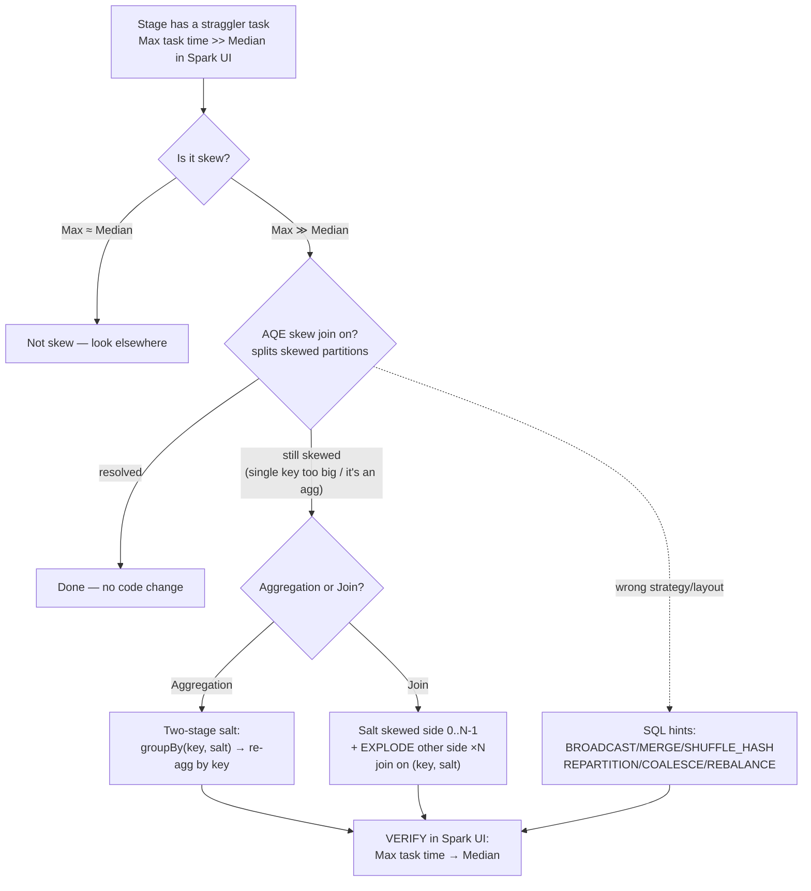

# Data skew: salting & SQL hints

> **Databricks · PySpark Performance · Lesson 08**
> *When one key holds most of the rows, one task does most of the work — here's how to spread that hot key out, and how to steer the planner by hand.*
>
> `Spark 3.2+ / DBR LTS` · `AQE skew join = first defence` · `Verified Jun 2026 docs`

---

## What it is

**Data skew** is when rows are *unevenly* distributed across keys. After a shuffle —
Spark moving rows across the network so all rows with the same key land in the same
partition — a few "hot" keys land in a few huge partitions while the rest stay tiny.
The task that processes a huge partition runs for minutes after every other task has
finished: a **straggler**. The whole stage is only as fast as that slowest task.

Two manual cures (after AQE has done what it can):

- **Salting** — add a small random suffix to the hot key so its rows spread across `N`
  partitions instead of one. Used for a skewed **aggregation** (two-stage group-by) and a
  skewed **join** (salt one side, explode the other).
- **SQL hints** — `/*+ … */` annotations right after `SELECT` that *tell the planner what
  to do*: which **join strategy** to use, or how to **repartition** the data.

> 🟣 **The one rule to remember:** skew is a *data* problem, not a memory problem. Throwing
> a bigger executor at one giant partition just delays the OOM. The fix is to **break the
> hot key into many smaller pieces** so the work spreads across tasks.

---

## Why it matters

- A shuffle splits a stage into one **task per partition**. If 199 partitions hold 1 GB
  each and one holds 80 GB, 199 tasks finish in seconds and one runs for an hour —
  **and may spill to disk or OOM** because a single partition no longer fits in execution
  memory. Your cluster sits ~idle waiting on one core.
- Skew is the recurring villain of this whole track: it makes joins slow (Lesson 02),
  causes spill and executor OOM (Lesson 04), and is the thing AQE's skew-join split
  (Lesson 05) exists to fight. When AQE can't fix it, **salting is the manual lever**.
- Interviewers probe it constantly: *"Your join's last task runs 50× longer than the
  median — what's happening and how do you fix it?"* The answer is **"skew — check AQE
  skew join, then salt the hot key,"** and you must be able to write the salted join.

---

## How it works — deep dive

### Quick recap: how to *see* skew in the Spark UI

`<chip:analogy>` *Analogy:* skew is a supermarket where everyone happens to need the one
cashier who handles loyalty cards — 9 lanes are empty, 1 lane is 200 people deep. Adding a
bigger till to that lane doesn't help; opening more lanes for those customers does.

Before you fix skew, **confirm it**. In the Spark UI:

- **Stages tab → the slow stage → task table:** the **Max** task duration is far larger
  than the **Median** (a 50×–500× gap is classic skew), and the **Max** "Shuffle Read
  Size / Records" is far above the 75th percentile. A handful of tasks dominate the stage.
- **SQL/DataFrame tab:** the slow node is usually an aggregate or join right after an
  `Exchange`. Per-task **spill (memory)/(disk)** appears on the straggler.

If max ≈ median, you don't have skew — look elsewhere. Don't salt a job that isn't skewed:
salting always adds shuffle work, so it only pays off when one key truly dominates.

### 1 · What is salting?

- **Mechanism:** the shuffle decides a row's partition from `hash(key) % numPartitions`.
  All rows with the same key get the same hash → the same partition. **Salting** appends a
  random integer `0..N-1` to the key, so the *combined* key `(key, salt)` hashes to `N`
  different partitions. The hot key's rows are now spread across `N` tasks instead of one.
- **Why it works:** you trade "one task does 100% of a hot key" for "`N` tasks each do
  `~1/N` of it." Skew flattens; the straggler disappears.
- **Trade-off:** you've changed the grouping key, so you must **undo the salt** afterwards
  to get a correct, per-real-key answer — that's the second stage of a salted aggregation,
  and the *explode* step of a salted join. Salting also adds a shuffle, so use it only on
  genuinely skewed keys.

`<chip:usecase>` *Use case:* a `clickstream` table where 90% of rows have
`country = 'US'`. Group-by-country sends nearly all rows to one partition; salting splits
`US` across 16 partitions.

### 2 · Salting an aggregation (two-stage group-by)

The classic skewed `groupBy(key).agg(...)`. A salted aggregation runs in **two stages**:

- **Stage 1 — partial aggregate on the salted key.** Add `salt = floor(rand() * N)`,
  group by `(key, salt)`, and compute a *partial* aggregate. The hot key is now split into
  `N` groups that hash to `N` partitions, so `N` tasks share the work.
- **Stage 2 — final aggregate on the real key.** Drop the salt and re-aggregate the `N`
  partials by `key` alone. Because stage 1 already collapsed each `(key, salt)` group to
  one row, stage 2 is tiny — `N` rows per key, not millions.
- **Choosing the combiner:** the two stages must compose. `sum`/`count`/`min`/`max` are
  trivially re-aggregatable (`sum` of partial `sum`s). An **average** must be done as
  `sum`/`count` partials, then divide at the end — never average the averages.

`<chip:analogy>` *Analogy:* count a stadium by having each section count itself first
(stage 1), then add up the 50 section totals (stage 2) — instead of one person counting
everyone.

### 3 · What is salting in join operations?

- **The skew in a join** is the same idea, but with a twist: if you salt only one side, the
  salted rows won't find their match on the other side. Row `US#7` on the left has no `US#7`
  on the right — it only has `US`.
- **The fix:** salt the **skewed (large) side's** key with a random `0..N-1`, and
  **explode** the other (small/unskewed) side so it has **one copy of each row per salt
  value** — `US` becomes `US#0, US#1, … US#(N-1)`. Now every salted left row finds its
  matching right copy. Join on the **combined `(key, salt)`** key.
- **Why it works:** the hot key's join work is spread across `N` partitions on both sides,
  so no single task gets the whole hot key.

`<chip:usecase>` *Use case:* a 5 TB `transactions` fact (skewed on `merchant_id`, where one
mega-merchant is 40% of rows) ⋈ a `merchants` dimension. Salt `merchant_id` on
transactions; explode `merchants` ×N; join on `(merchant_id, salt)`.

### 4 · How to apply salting with JOINS (and the cost)

- **The cost is an N× blow-up of the exploded side.** If you explode the *entire* other
  side ×N, you multiply its row count by `N` — wasteful for the 99% of keys that aren't
  skewed. So:
  - **Salt only the hot keys.** Give skewed keys a real `0..N-1` salt and non-skewed keys a
    constant salt of `0`; explode the other side only for the hot keys (or explode ×N only
    the rows whose key is hot). This keeps the blow-up proportional to the few hot keys.
  - **Pick `N` from the skew, not at random.** `N` should roughly match how many partitions
    the hot key needs (hot-key row count ÷ a healthy partition size). Too small → still
    skewed; too large → needless explosion and tiny partitions.
- **Always prefer AQE skew join first** (Lesson 05): it splits skewed partitions
  automatically with **no code change**. Reach for salting only when AQE can't (e.g. skew
  inside a single key it can't sub-divide, an aggregation rather than a join, or a join AQE
  declines to split).

### 5 · SQL hints in Spark

Hints are `/*+ … */` comments placed **immediately after `SELECT`** that *instruct the
planner*. Two families:

- **Join-strategy hints** — force how a join executes, overriding the size estimate:
  - `BROADCAST(t)` (aliases `BROADCASTJOIN`, `MAPJOIN`) — broadcast table `t`.
  - `MERGE(t)` (aliases `SHUFFLE_MERGE`, `MERGEJOIN`) — sort-merge join.
  - `SHUFFLE_HASH(t)` — shuffle-hash join.
  - `SHUFFLE_REPLICATE_NL(t)` — shuffle-replicate nested-loop join.
  - **Priority when several are given:** `BROADCAST` > `MERGE` > `SHUFFLE_HASH` >
    `SHUFFLE_REPLICATE_NL`.
- **Partitioning hints** — control how data is repartitioned (an alternative to
  `repartition()`/`coalesce()` in SQL):
  - `COALESCE(n)` — reduce to `n` partitions **without a shuffle** (narrow).
  - `REPARTITION(n)` / `REPARTITION(col)` / `REPARTITION(n, col)` — full shuffle to `n`
    partitions, optionally hash-partitioned by `col`.
  - `REPARTITION_BY_RANGE([n,] col)` — range-partition by `col` (rows ordered into ranges).
  - `REBALANCE([n][, col])` — rebalance to even-sized partitions; **ignored unless AQE is
    enabled** (it relies on AQE to size the output partitions).

- **Trade-off:** a hint *overrides* the cost-based optimizer, so a wrong hint can be worse
  than no hint (e.g. `BROADCAST` a 5 GB table → driver OOM). Hints are a scalpel for when
  you *know* the planner's estimate is wrong; prefer letting AQE decide otherwise.

`<chip:usecase>` *Use case:* a partitioning hint `/*+ REPARTITION(200, customer_id) */`
before a wide aggregation pre-distributes rows by `customer_id`; a `/*+ BROADCAST(dim) */`
forces a broadcast when stats are stale.

---

## How to do it (code + verification)

> **Track rule:** every technique is paired with *how to prove it worked* — the
> `.explain()` plan node or the Spark-UI signal. Apply, then verify. Never assume.

### Step 0 — confirm AQE skew join is on (do this before salting)

```python
# AQE skew join is the FIRST line of defence — it splits skewed partitions with no
# code change. Confirm it's on before reaching for manual salting.
spark.conf.get("spark.sql.adaptive.enabled")              # 'true' (default since Spark 3.2)
spark.conf.get("spark.sql.adaptive.skewJoin.enabled")     # 'true' (default)

# A partition is "skewed" to AQE if its size > skewedPartitionFactor (5.0) × median
# AND > skewedPartitionThresholdInBytes (256 MB). It then SPLITS it into sub-partitions.
# VERIFY in the Spark UI SQL tab: the join's AQEShuffleRead node shows "skewed=true" and
# the straggler task's Max time drops toward the Median after AQE splits it.
```

### Salt a skewed aggregation (two-stage group-by)

```python
from pyspark.sql import functions as F

N = 16  # salt buckets — split each hot key across up to 16 partitions

# clicks is skewed: ~90% of rows are country = 'US'. A plain groupBy("country")
# sends nearly all rows to ONE partition -> one straggler task.

# Stage 1: partial aggregate on the SALTED key (key, salt). rand() spreads the hot
# key's rows across N salt buckets -> N partitions -> N tasks share the work.
salted = (clicks
    .withColumn("salt", (F.rand() * N).cast("int"))        # salt in 0..N-1
    .groupBy("country", "salt")
    .agg(F.sum("revenue").alias("partial_rev")))           # sum is re-aggregatable

# Stage 2: drop the salt, re-aggregate the N partials by the REAL key.
result = (salted
    .groupBy("country")
    .agg(F.sum("partial_rev").alias("revenue")))

# VERIFY: result.explain(mode="formatted") shows TWO HashAggregate/Exchange pairs
# (partial then final). In the Spark UI Stages tab, the partial-agg stage's Max task
# time is now close to its Median — the single straggler is gone.
result.explain(mode="formatted")
```

> Use `sum`/`count`/`min`/`max` for the partial — they re-aggregate trivially. For an
> **average**, carry `sum` and `count` partials and divide at the very end; averaging the
> stage-1 averages is wrong.

### Salt a skewed join (salt one side, explode the other)

```python
from pyspark.sql import functions as F

N = 16

# tx is skewed on merchant_id (one mega-merchant = 40% of rows); merchants is small/unskewed.

# 1) Salt the SKEWED (large) side: append a random 0..N-1 to the join key.
tx_salted = tx.withColumn("salt", (F.rand() * N).cast("int"))

# 2) EXPLODE the other side into N copies — one per salt value — so every salted
#    left row finds its matching right copy. explode(array(0..N-1)) = N rows per key.
merchants_exploded = (merchants
    .withColumn("salt", F.explode(F.array([F.lit(i) for i in range(N)]))))

# 3) Join on the COMBINED (merchant_id, salt) key.
joined = tx_salted.join(merchants_exploded, on=["merchant_id", "salt"], how="inner")

# VERIFY: joined.explain(mode="formatted") still shows a SortMergeJoin, but on
# (merchant_id, salt). In the Spark UI Stages tab the join stage's Max task time now
# tracks the Median — the hot-key straggler is split across N tasks. The cost: the
# merchants side has N× the rows (acceptable only because it's small).
joined.explain(mode="formatted")
```

### Salt ONLY the hot keys (keep the blow-up proportional)

```python
from pyspark.sql import functions as F

N = 16
hot = ["MERCHANT_MEGA"]   # the few keys you confirmed are skewed (from the UI)

# Skewed keys get a real 0..N-1 salt; everyone else gets a constant 0 (no explosion).
tx_salted = tx.withColumn(
    "salt",
    F.when(F.col("merchant_id").isin(hot), (F.rand() * N).cast("int")).otherwise(F.lit(0)))

# Explode the other side ×N ONLY for hot keys; non-hot rows keep a single salt=0 copy.
m_hot = (merchants.filter(F.col("merchant_id").isin(hot))
    .withColumn("salt", F.explode(F.array([F.lit(i) for i in range(N)]))))
m_cold = merchants.filter(~F.col("merchant_id").isin(hot)).withColumn("salt", F.lit(0))
merchants_salted = m_hot.unionByName(m_cold)

joined = tx_salted.join(merchants_salted, on=["merchant_id", "salt"], how="inner")
# VERIFY: same balanced task times as before, but merchants only grew by N× for the few
# hot keys — not the whole dimension. Check Stages tab Max vs Median again.
```

### Join-strategy & partitioning hints (DataFrame API + SQL)

```python
from pyspark.sql.functions import broadcast

# DataFrame-API equivalents of the hints:
tx.join(broadcast(merchants), "merchant_id")          # == /*+ BROADCAST(merchants) */
tx.hint("merge").join(merchants, "merchant_id")       # == /*+ MERGE(...) */  (force sort-merge)
tx.hint("shuffle_hash").join(merchants, "merchant_id")# == /*+ SHUFFLE_HASH(...) */
tx.repartition(200, "merchant_id")                    # == /*+ REPARTITION(200, merchant_id) */
tx.coalesce(50)                                        # == /*+ COALESCE(50) */

# VERIFY: .explain() shows the forced node (BroadcastHashJoin / SortMergeJoin /
# ShuffledHashJoin) or the Exchange with the new partition count / partitioning.
```

```sql
-- Hints go IMMEDIATELY after SELECT, inside /*+ ... */.

-- Join-strategy hint: force a broadcast (priority BROADCAST > MERGE > SHUFFLE_HASH > SHUFFLE_REPLICATE_NL).
SELECT /*+ BROADCAST(m) */ t.*, m.merchant_name
FROM   catalog.schema.transactions t
JOIN   catalog.schema.merchants m ON t.merchant_id = m.merchant_id;

-- Partitioning hints: repartition (full shuffle) or coalesce (no shuffle).
SELECT /*+ REPARTITION(200, customer_id) */ * FROM catalog.schema.transactions;
SELECT /*+ COALESCE(50) */                  * FROM catalog.schema.transactions;

-- REBALANCE evens out partition sizes — but is IGNORED unless AQE is enabled.
SELECT /*+ REBALANCE(merchant_id) */ * FROM catalog.schema.transactions;
```

### Contrast: naive skewed join vs salted join

```python
# ❌ Naive: one straggler task does the whole hot key. Spark UI: Max task time ≫ Median,
#    spill on that task, the stage waits an hour on one core.
slow = tx.join(merchants, "merchant_id")

# ✅ Salted: the hot key is split across N partitions; task times balance.
fast = tx_salted.join(merchants_salted, on=["merchant_id", "salt"])
# Compare the two in the Spark UI Stages tab: `slow` has Max ≫ Median; `fast` has Max ≈ Median.
```

---

## Comparison table

| Dimension | AQE skew join (Lesson 05) | Salting an aggregation | Salting a join | SQL hints |
| --- | --- | --- | --- | --- |
| **What it fixes** | Skewed *join* partitions | Skewed `groupBy` | Skewed *join* key | Wrong join strategy / partitioning |
| **Code change?** | **None** (automatic) | Two-stage group-by | Salt + explode + combined key | Add `/*+ … */` or `.hint()` |
| **Mechanism** | Splits a skewed partition into sub-partitions | Group by `(key, salt)` → re-aggregate by `key` | Salt skewed side `0..N-1`; explode other ×N | Override the optimizer's choice |
| **Cost** | A little extra shuffle bookkeeping | One extra shuffle (second agg) | **N× blow-up** of the exploded side | A wrong hint can be worse than none |
| **When to use** | **First** — always try it before salting | Skewed agg AQE can't help | Skew AQE's split can't resolve | You *know* the estimate/plan is wrong |
| **Verify** | `AQEShuffleRead` "skewed=true"; Max→Median | Two agg stages; balanced task times | `(key, salt)` join; balanced task times | Forced node / new Exchange in `.explain()` |

---

## Uses, edge cases & limitations

**Uses**
- A `groupBy` on a key with one or a few dominant values → **two-stage salted aggregation**.
- A huge fact ⋈ dimension where one join key is a large fraction of rows, and **AQE skew
  join didn't resolve it** → **salted join** (salt the fact, explode the dimension).
- A planner mis-estimate or a stale-stats join → a **join-strategy hint**; a known-bad
  partition layout before a wide op → a **partitioning hint**.

**Edge cases**
- **Salting explodes cardinality.** Exploding the *whole* other side ×N is wasteful — salt
  only the confirmed hot keys (constant `salt=0` for the rest) so the blow-up stays
  proportional. Picking `N` too large makes thousands of tiny partitions.
- **Non-composable aggregates.** `avg`, `countDistinct`, `percentile` don't re-aggregate by
  naively re-applying the same function. Carry `sum`+`count` for `avg`; for distinct/
  percentile, salting two-stage is much harder — often AQE or a different approach wins.
- **`REBALANCE` does nothing with AQE off.** It's a no-op unless `spark.sql.adaptive.enabled`
  is `true`. A hint silently ignored is a classic "why didn't my fix work?" trap.
- **Skew AQE can't fix.** AQE splits a skewed *partition*, but if a *single key* is bigger
  than your split target, splitting partitions doesn't help — that's exactly when salting
  (which sub-divides the key itself) is required.
- **A hint can hurt.** `BROADCAST` on a table that's actually large → driver OOM /
  `maxResultSize`; `SHUFFLE_REPLICATE_NL` on big inputs → a Cartesian-shaped explosion.

**Limitations**
- Salting is **manual and intrusive** — you rewrite the query and must undo the salt
  correctly (re-aggregate / explode). It adds at least one extra shuffle.
- Hints **override** the cost-based optimizer and AQE's runtime switch; a hint frozen into
  code can become wrong as data grows. Prefer AQE; hint only with a known reason.
- Salting helps **skew**, not raw size — a genuinely huge non-skewed join still needs the
  full shuffle (or bucketing, Lesson 11). Salting an unskewed job only adds overhead.

---

## Common mistakes / gotchas

- **Salting before checking the UI.** Salting always adds a shuffle. If Max ≈ Median there's
  no skew — you're adding cost for nothing. Confirm the straggler first.
- **Forgetting the second stage.** A salted `groupBy("key","salt")` without the final
  `groupBy("key")` gives `N` rows per key, not one — wrong answer, not just slow.
- **Averaging the averages.** Re-aggregating stage-1 `avg`s with `avg` is incorrect; carry
  `sum` and `count` and divide at the end.
- **Salting one side of a join only.** Without exploding the other side, salted rows find no
  match and you silently **lose rows** (inner join) — a correctness bug, not a perf bug.
- **Exploding the entire dimension ×N.** Multiplies *every* key, not just the hot ones —
  huge needless cost. Salt only the keys you confirmed are hot.
- **Expecting `REBALANCE` to work with AQE disabled.** It's ignored; the partitions stay
  uneven and you wonder why nothing changed.
- **Reaching for salting before AQE.** AQE skew join needs **zero code** and handles most
  skew. Try it first; salt only the residual it can't split.
- **Confusing a partitioning hint with a join hint.** `REPARTITION`/`COALESCE`/`REBALANCE`
  reshape data; `BROADCAST`/`MERGE`/`SHUFFLE_HASH` pick a join strategy. Different jobs.

---

## At a glance



---

## References

- Apache Spark — SQL Performance Tuning (AQE skew join, coalesce, join strategies): https://spark.apache.org/docs/latest/sql-performance-tuning.html
- Apache Spark — Join & partitioning hints (`BROADCAST`/`MERGE`/`SHUFFLE_HASH`/`SHUFFLE_REPLICATE_NL`, `COALESCE`/`REPARTITION`/`REPARTITION_BY_RANGE`/`REBALANCE`): https://spark.apache.org/docs/latest/sql-ref-syntax-qry-select-hints.html
- Apache Spark — Configuration (`spark.sql.adaptive.skewJoin.*`, `spark.sql.shuffle.partitions`): https://spark.apache.org/docs/latest/configuration.html
- Azure Databricks — Adaptive Query Execution (skew join, default-on DBR 7.3+): https://learn.microsoft.com/en-us/azure/databricks/optimizations/aqe

*Content verified against Apache Spark & Azure Databricks docs, June 2026. OSS-Spark vs Databricks defaults are noted where they differ.*
