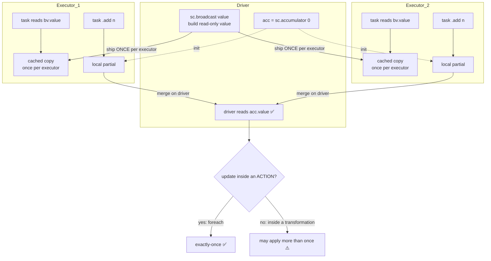

# Broadcast variables & accumulators

> **Databricks · PySpark Performance · Lesson 09**
> *Two ways to share data with your tasks: ship a small read-only value to every executor once, and safely count things back on the driver — and the traps in each.*
>
> `Spark 3.2+ / DBR LTS` · `sc.broadcast(v)` · `sc.accumulator(0)` · `Verified Jun 2026 docs`

---

## What it is

Spark gives you two **shared variables** — values that cross the driver↔executor boundary in a controlled way, instead of being captured ad-hoc by a closure:

- **Broadcast variable** — a **read-only** value you create on the driver and Spark caches **once per executor**, so every task on that executor reads the same in-memory copy. `bv = sc.broadcast(value)`; read it on workers with `bv.value`.
- **Accumulator** — a **write-only-on-workers** counter: tasks only `.add()` to it, and **only the driver** reads the final `.value`. `acc = sc.accumulator(0)`; tasks do `acc.add(1)`; the driver reads `acc.value`.

Think of them as opposite-direction pipes: a **broadcast variable pushes data out** to every executor; an **accumulator pulls aggregated numbers back** to the driver.

> 🟣 **The one rule to remember:** A broadcast **variable** is *not* a broadcast **join**. The variable is a value you reference inside a UDF/`map`; the join is a *strategy* the planner picks via `autoBroadcastJoinThreshold`/the `BROADCAST` hint (Lesson 02). Same word, different mechanism — interviewers love this trap.

---

## Why it matters

- **Without a broadcast variable**, a lookup dict/set/model you reference in a closure is **serialized and shipped with every task** — 10,000 tasks on a stage = 10,000 copies of the same 50 MB map crossing the network. With a broadcast variable it ships **once per executor** and is reused by all its tasks: far less network, far less GC churn, far less duplicated memory.
- **Without an accumulator**, the only way to get a number (bad-record count, rows-skipped, a running metric) out of distributed tasks is to `collect()`/aggregate a whole extra pass. An accumulator lets tasks **report a number as a side-effect of work you're already doing** — no extra job.
- Interviewers probe both: *"How would you ship a 200 MB ML model to your UDF without re-sending it per task?"* (broadcast variable) and *"Can you trust a counter you incremented inside a `map`?"* (no — the exactly-once guarantee only holds inside **actions**).

---

## How it works — deep dive

### 1 · Broadcast variable — ship a read-only value once per executor

`<chip:analogy>` *Analogy:* a broadcast variable is like handing every cashier (executor) **their own laminated price-list** at the start of the shift, instead of faxing the price-list to every single customer (task). One copy per till, reused all day.

- **Mechanism:** you call `bv = sc.broadcast(value)` on the **driver**. Spark serializes the value, and using a **torrent-like (BitTorrent) distribution** ships it to each executor **once**; the executor caches it (in its Storage memory / block manager) and **every task on that executor reads the same `bv.value`** — no per-task re-send. The docs define it as *"a read-only variable cached on each machine rather than shipping a copy of it with tasks."*
- **Read-only:** workers must **only read** `bv.value`. Mutating it on a worker has no effect on the driver or other executors — it's broadcast *once*, not kept in sync.
- **Why it's faster than a plain closure variable:** a captured closure variable is serialized **per task** (one copy per partition); a broadcast variable is serialized **once per executor** and shared by all its tasks. On a wide stage that's the difference between thousands of copies and one.
- **Lifecycle / release:** `bv.unpersist()` drops the cached copies from the executors (Spark will **re-broadcast** if the variable is used again); `bv.destroy()` removes it **permanently** (using it after `destroy()` is an error). Releasing matters because the broadcast pins **Storage memory** on every executor until you free it.
- **Trade-off:** the value must fit comfortably in **each executor's memory** (and is first held on the **driver** while being built). It's read-only and static — if your lookup changes per-row or needs updating, a broadcast variable is the wrong tool.

`<chip:usecase>` *Use case:* a 30 MB `country_code → region` dictionary (or a small scikit-learn model) referenced inside a Python UDF that scores 5 billion rows — broadcast it once so each executor holds one copy, instead of shipping it with every task.

```python
# DRIVER: build the small lookup once, then broadcast it (read-only) to every executor.
lookup = {"US": "NA", "CA": "NA", "DE": "EU", "IN": "APAC"}   # small dict / set / model
bv = sc.broadcast(lookup)                                      # shipped ONCE per executor

from pyspark.sql.functions import udf
from pyspark.sql.types import StringType

# WORKER: each task reads the SAME cached copy via bv.value — no per-task re-send.
@udf(StringType())
def to_region(code):
    return bv.value.get(code, "UNKNOWN")   # bv.value is READ-ONLY on the worker

regions = orders.withColumn("region", to_region("country_code"))

# VERIFY (it's a *variable*, not a plan node, so verify in the Spark UI, not .explain()):
#   • Spark UI → Storage tab: a "Broadcast" block appears, sized ~your value, NOT ×num_tasks.
#   • Spark UI → SQL/Jobs: the broadcast ships once; tasks don't re-serialize the dict.
regions.explain(mode="formatted")   # shows the UDF in the plan; the broadcast is runtime state

# RELEASE when done so it stops pinning executor Storage memory:
bv.unpersist()   # drop cached copies (re-broadcast if reused) …
# bv.destroy()   # … or remove permanently (using it afterwards raises an error)
```

> **Broadcast variable vs broadcast join — keep them apart.** `sc.broadcast(dict)` ships a *value* you read in code. `df.join(broadcast(small_df), …)` (Lesson 02) is a *join strategy* the optimizer applies. The DataFrame `broadcast()` hint takes a **DataFrame**; `sc.broadcast()` takes a **plain Python object**. Don't reach for a broadcast variable to "speed up a join" — use the join hint.

### 2 · Accumulator — count things on workers, read on the driver

`<chip:analogy>` *Analogy:* an accumulator is like a **tally counter at a stadium turnstile** — each gate (task) clicks it as people pass, but only the control room (driver) reads the total. Gates can add; they can't read the running total.

- **Mechanism:** `acc = sc.accumulator(0)` creates a shared counter initialized on the **driver** — this is PySpark's *only* accumulator constructor (there is **no** `sc.longAccumulator(name)` in PySpark; that's a Scala/Java-only method). Inside tasks you call `acc.add(n)` (or `acc += n`); each executor keeps a **local partial** and sends its contribution back, where Spark **merges them on the driver**. Only the driver may read `acc.value`.
- **Write-only on workers / read-only on driver:** if a task tries to read `acc.value`, it sees only its own partial (or raises) — **never** the global total. This asymmetry is deliberate: it's what lets the merge be associative and cheap.
- **Accumulators are lazy:** like everything else in Spark, an accumulator update **only happens when an action runs the transformation that contains it**. If you build a `map` that increments an accumulator but never trigger an action, the count stays `0`.
- **The exactly-once caveat (the whole interview):** the docs guarantee exactly-once **only for updates performed inside actions** (e.g. `rdd.foreach(...)`): *"For accumulator updates performed inside actions only, Spark guarantees that each task's update will only be applied once… In transformations, users should be aware that each task's update may be applied more than once if tasks or stages are re-executed."* A `map`/`filter` that increments an accumulator may run **twice** (a retried task, a recomputed stage, or even a second action over the same uncached DataFrame) → the count is inflated. **So: trust accumulators updated inside actions; treat accumulators updated inside transformations as best-effort/approximate.**
- **Trade-off:** accumulators are great for cheap side-channel metrics (bad-record counts, audit tallies), but they are **not** a substitute for a real aggregation — and a transformation-side accumulator that you "fix" by caching is still fragile across re-execution. For correctness-critical counts, prefer an explicit `groupBy().count()` / `filter().count()`.

`<chip:usecase>` *Use case:* counting malformed/skipped records while writing a cleaned dataset — increment `bad_rows.add(1)` inside the **action that writes** (e.g. `foreachPartition`), then log `bad_rows.value` on the driver, without a second pass over the data.

```python
# DRIVER: create the accumulator. sc.accumulator(value) is PySpark's ONLY accumulator
# constructor — there is no sc.longAccumulator(name) in PySpark (it's a Scala/Java method).
bad_rows = sc.accumulator(0)                       # UNNAMED — not surfaced by name in the UI

def validate_and_write(rows):
    for r in rows:
        if r["amount"] is None:
            bad_rows.add(1)                        # WORKER: only .add() — never read .value here
        # … write/emit the good row …

# ✅ Inside an ACTION (foreachPartition) → each task's update is applied EXACTLY ONCE.
orders.rdd.foreachPartition(validate_and_write)

# DRIVER ONLY reads the merged total — safe because the update ran inside an action.
print("bad rows:", bad_rows.value)

# VERIFY: PySpark's sc.accumulator() is UNNAMED, so it is typically NOT surfaced by name in
#   the Spark UI Stages → Accumulators view (and PySpark has no sc.longAccumulator(name)).
#   Verify the count by comparing bad_rows.value to a real aggregation:
print("true count:", orders.filter(orders.amount.isNull()).count())   # should match bad_rows.value
```

```python
# ❌ Anti-pattern: incrementing inside a TRANSFORMATION (lazy + may re-run).
seen = sc.accumulator(0)
counted = orders.rdd.map(lambda r: (seen.add(1), r)[1])   # transformation — NOT exactly-once
counted.count()        # runs once → seen == N …
counted.count()        # runs AGAIN (DataFrame not cached) → seen == 2N  ⚠️ inflated
# A retried/speculative task or a recomputed stage can double-count even with one action.
# Fix for a real count: orders.count()  /  orders.filter(cond).count()  (a true aggregation).
```

---

## Comparison table

| Dimension | Broadcast variable | Accumulator |
| --- | --- | --- |
| **Direction** | Driver → executors (push out) | Executors → driver (pull back) |
| **Access** | **Read-only** on workers (`bv.value`) | **Write-only** on workers (`acc.add`); driver reads `acc.value` |
| **Shipped / merged** | Cached **once per executor**, reused by all its tasks | Per-task partials **merged on the driver** |
| **Create** | `sc.broadcast(value)` | `sc.accumulator(0)` (PySpark's only constructor; no `longAccumulator`) |
| **Typical use** | Small lookup dict/set/model inside a UDF/`map` | Counters/metrics: bad-record count, audit tallies |
| **Correctness caveat** | Static & read-only — don't expect updates to propagate | **Exactly-once only inside actions**; transformations may double-count |
| **Release / lifecycle** | `unpersist()` (re-broadcast if reused) / `destroy()` (permanent) | Lives with the `SparkContext`; reset by re-creating it |
| **Where to verify** | Spark UI **Storage** tab (one Broadcast block) | Cross-check `acc.value` against a real aggregation (Python accumulators are unnamed → not surfaced by name in the UI) |
| **NOT this** | A broadcast **join** (a strategy, Lesson 02) | A real aggregation (`groupBy().count()`) |

---

## Uses, edge cases & limitations

**Uses**
- **Broadcast variable:** a small, static lookup (`dict`/`set`), a compiled regex set, or a small ML model referenced inside a Python UDF/`mapInPandas`/RDD `map` over a huge dataset — ship it once per executor.
- **Accumulator:** lightweight side-channel metrics gathered *while* doing real work inside an **action** (`foreach`/`foreachPartition`) — bad-record counts, rows-dropped, sampled debug tallies.
- Reach for the **DataFrame `broadcast()` join hint** (Lesson 02), not a broadcast variable, when the goal is to avoid shuffling a small *table* in a join.

**Edge cases**
- **A broadcast value that's almost too big** — it must fit on the **driver** (where it's built) *and* in **each executor's** memory; a 2 GB "small" lookup will pressure executor Storage memory and can OOM. Above your budget, rethink the design (a join, a bucketed lookup table).
- **Mutating a broadcast value on a worker** — it's read-only; local mutations are silently discarded and never propagate. If the lookup must change, re-broadcast a new variable.
- **Forgetting to release** — a long-lived broadcast pins Storage memory (region `R`, Lesson 04) on every executor; call `unpersist()`/`destroy()` when done.
- **Accumulator inside a transformation that runs twice** — two actions over the same **uncached** DataFrame recompute the transformation and **double the count**. Even one action can double-count on a **retried/speculative task** or a **recomputed stage**.
- **Reading an accumulator on a worker** — illegal/meaningless; you only get a partial. Read `.value` on the driver, after the action.

**Limitations**
- **Broadcast variables and accumulators are RDD/`SparkContext`-level APIs** — they are part of the low-level shared-variable model, used via `sc.broadcast` / `sc.accumulator` and read inside UDFs/`rdd` functions. For pure DataFrame work, prefer DataFrame-native tools (the `broadcast()` join hint; built-in aggregations) where possible.
- **Spark Connect / serverless:** `SparkContext.broadcast` and `SparkContext.accumulator` are **classic-`SparkContext` APIs and are *not* supported on Spark Connect**. On Databricks **serverless / shared-access (Spark Connect) clusters** you won't have `sc` available the same way — use a broadcast *join* hint and DataFrame aggregations there instead. (They work on classic single-user DBR clusters where `sc` is accessible.) Verify against your runtime.
- **Accumulators give no exactly-once guarantee inside transformations** — by design. Don't build correctness-critical counts on them; use a real aggregation.

---

## Common mistakes & gotchas

- **Confusing a broadcast _variable_ with a broadcast _join_.** `sc.broadcast(dict)` ships a value you read in a UDF; `join(broadcast(df), …)` is a join strategy. Different APIs, different purposes — this is the #1 trap on this topic.
- **Capturing a big object in a closure instead of broadcasting it.** Referencing a 50 MB dict directly in a UDF serializes it **per task**. Wrap it in `sc.broadcast(...)` and read `bv.value` so it ships once per executor.
- **Trusting an accumulator updated inside a `map`/`filter`.** The exactly-once guarantee holds **only inside actions**; transformation-side updates can double on re-execution. Use `foreach`/`foreachPartition`, or a real aggregation.
- **Assuming an accumulator updates without an action.** Accumulators are **lazy** — no action, no increment. The count stays at the initial value.
- **Reading `acc.value` on a worker.** Workers are write-only; reading there gives a partial, not the total. Read on the driver, after the action.
- **Never releasing a broadcast.** A forgotten broadcast pins executor Storage memory and pressures GC (Lesson 10). `unpersist()`/`destroy()` when done.
- **Expecting a PySpark accumulator to show by name in the UI.** PySpark's `sc.accumulator(0)` is **unnamed** and there is **no** `sc.longAccumulator(name)` in PySpark (that's Scala/Java-only), so Python accumulators are typically not surfaced by name in the Spark UI Stages → Accumulators view. Verify the count by comparing `acc.value` to a real aggregation (`filter().count()`).

---

## At a glance



---

## References

- Apache Spark — RDD Programming Guide (Broadcast Variables & Accumulators, exactly-once caveat): https://spark.apache.org/docs/latest/rdd-programming-guide.html#shared-variables
- Apache Spark — SQL Performance Tuning (broadcast *join* — keep distinct from the variable): https://spark.apache.org/docs/latest/sql-performance-tuning.html
- Apache Spark — Configuration (`spark.sql.autoBroadcastJoinThreshold` — the *join* threshold, not the variable): https://spark.apache.org/docs/latest/configuration.html
- Azure Databricks — Adaptive Query Execution (runtime broadcast-join behavior): https://learn.microsoft.com/en-us/azure/databricks/optimizations/aqe

*Content verified against Apache Spark & Azure Databricks docs, June 2026. `sc.broadcast`/`sc.accumulator` are classic-`SparkContext` APIs (not supported on Spark Connect); OSS-Spark vs Databricks differences are noted where they apply.*
