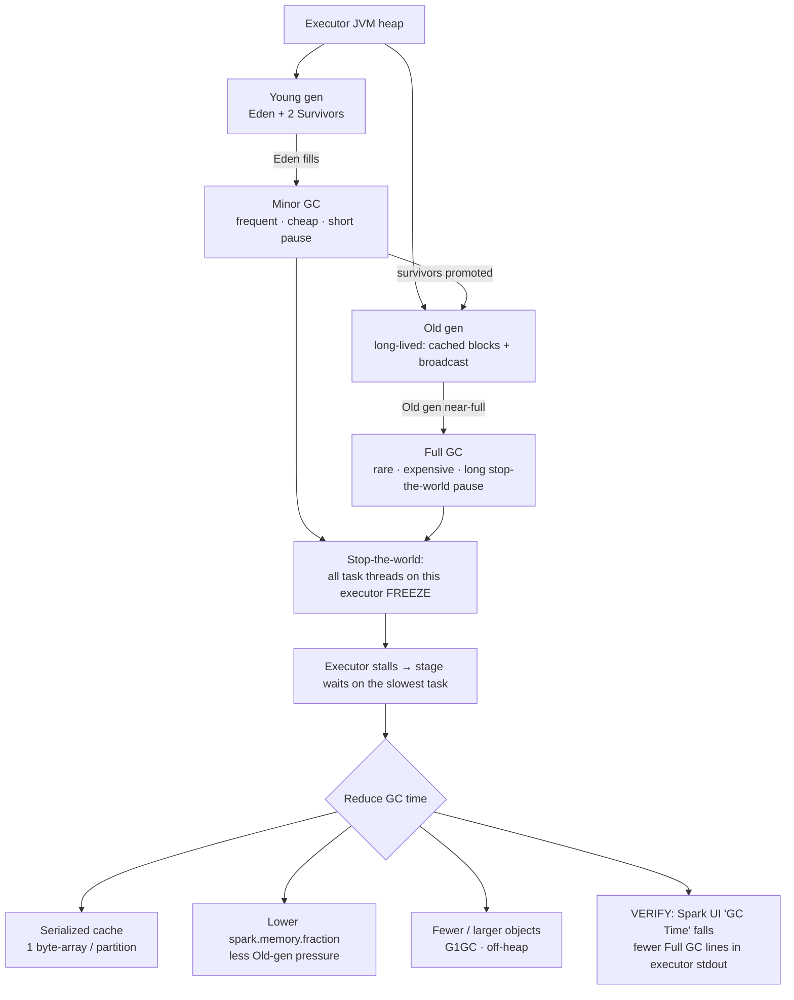

# Garbage-Collection Tuning

> **Databricks · PySpark Performance · Lesson 10**
> *When the JVM pauses, your tasks pause — why a stop-the-world GC stalls an executor, and how to make it stop happening.*
>
> `Spark 3.2+ / DBR LTS` · `spark.memory.fraction = 0.6` · `G1GC default since Spark 4.0 / JDK 17` · `Verified Jun 2026 docs`

---

## What it is

**Garbage Collection (GC)** is the JVM automatically reclaiming the memory of objects your
program no longer references — you never `free()` in Java/Scala, the GC does it for you.
That convenience has a cost, and on a Spark executor that cost shows up as **pauses**:

- The executor heap is split into **generations** — a **Young** generation (where new objects
  are born) and an **Old** generation (where long-lived objects end up).
- A **minor GC** cleans the Young generation — frequent but cheap. A **major / full GC** cleans
  the Old generation — rare but expensive.
- Critically, a GC is **stop-the-world**: while it runs, *every* application thread — including
  all of Spark's task threads on that executor — **freezes**. That freeze is a **GC pause**.

> 🟣 **The one rule to remember:** GC cost is **proportional to the number of Java objects**, not
> the number of bytes. Many tiny objects (boxed values, deserialized cached rows, linked lists) =
> lots of work for the collector = long pauses. Fewer, larger objects = cheaper GC.

---

## Why it matters

- **A GC pause is wasted cluster time.** During a stop-the-world collection no task on that
  executor makes progress — you're paying for CPUs that are sitting idle while the JVM tidies up.
- **Spark stages wait on the slowest task.** GC runs *per executor JVM*, so a long pause on one
  executor stalls its tasks while the rest of the cluster waits at the stage boundary. One
  GC-thrashing executor can dominate a stage's wall-clock.
- **Heavy caching is the usual trigger.** Cached blocks are long-lived, so they pile into the Old
  generation; a full Old-gen heap forces frequent, expensive **full GCs**. The "I cached
  everything and now it's slower" surprise is almost always GC.
- **Interviewers probe it as a symptom-vs-cause question:** *"Your job slowed down and you see high
  GC time — what's happening and what do you change?"* The answer is the chain below: too many
  objects / Old gen too full → stop-the-world pauses → executor stalls → tune cache shape, object
  shape, `spark.memory.fraction`, or the collector.

---

## How it works — deep dive

### Sub-topic 1 · What is Garbage Collection?

`<chip:analogy>` *Analogy:* GC is the cleaning crew at a restaurant. While they sweep the whole
floor (a full GC), they ask every diner to step outside and wait (stop-the-world) — the more
plates and crumbs (objects) on the floor, the longer everyone waits at the door.

- **Mechanism:** the JVM tracks which objects are still **reachable** (referenced) from live
  variables. Anything no longer reachable is garbage; the collector reclaims that memory so new
  allocations have room. You never free memory manually — the JVM does.
- **Why it costs:** the docs are explicit that GC cost is **"proportional to the number of Java
  objects"** the collector must walk, not the raw byte count. A `LinkedList` of a million boxed
  `Integer`s is far more expensive to collect than one `int[]` of a million primitives holding the
  same data.
- **Why Spark cares:** Spark allocates a *lot* — every deserialized cached row, every shuffle
  buffer, every intermediate record is an object on the heap. Object-heavy workloads make the
  collector work harder, which turns into pause time.

`<chip:usecase>` *Use case:* a job that caches a wide DataFrame **deserialized** (one Java object
per field per row) churns millions of objects; switching to a **serialized** cache (one byte array
per partition) collapses that to a handful of objects per partition — dramatically less GC.

### Sub-topic 2 · The heap generations (Young + Old)

- **Mechanism:** the JVM heap is split into a **Young generation** and an **Old generation**.
  - **Young** = **Eden** + **two Survivor spaces (S0/S1)**. New objects are allocated in Eden.
  - When Eden fills, a **minor GC** copies the still-live objects into a Survivor space; objects
    that survive enough minor GCs are **promoted to the Old generation**.
  - **Old** holds long-lived objects — exactly where Spark's **cached blocks** and **broadcast
    data** end up.
- **Why two generations:** most objects die young (the "weak generational hypothesis"). Collecting
  only the small, churny Young space frequently is cheap; the long-lived Old space only needs the
  expensive collection rarely.
- **Trade-off:** if too many objects are promoted (e.g. lots of cached data), the Old generation
  fills, and the JVM is forced into frequent **full GCs** — the worst case for pause time.

`<chip:analogy>` *Analogy:* Eden is the prep counter (constant fast turnover), the Old generation
is the walk-in freezer (things that stick around). You wipe the prep counter constantly and cheaply;
you only defrost the freezer occasionally — and defrosting shuts the kitchen.

### Sub-topic 3 · Minor, major & full GC — and the stop-the-world pause

- **Minor GC** — collects the **Young** generation only. **Frequent and cheap** because Eden is
  small and most objects there are already dead.
- **Major / full GC** — collects the **Old** generation (often the whole heap). **Rare and
  expensive** — it has to walk far more live objects.
- **Stop-the-world (the pause):** during a collection the JVM **suspends every application thread**.
  On a Spark executor that means **all task threads freeze** for the duration. That freeze is the
  **GC pause** — a minor GC is a short blip; a full GC can be a multi-second stall.
- **Why it matters for tuning:** you can't eliminate GC, but you can make it **shorter and rarer** —
  fewer objects to collect (minor and full both get cheaper) and a less-full Old generation (fewer
  full GCs). Every lever in this lesson targets one of those two.

> A long full-GC pause looks like a hung executor: tasks make no progress, no CPU work happens, then
> everything resumes. In the Spark UI it shows up as a large **GC Time** on those tasks (below).

### Sub-topic 4 · The executor's role in the GC cycle

`<chip:usecase>` *Use case:* one executor caches more than its share, its Old gen stays near-full,
and it spends seconds in full GC every few tasks. Its tasks finish late, the stage can't complete
until that straggler does, and the whole job's wall-clock balloons — even though the *other*
executors were idle and healthy.

- **GC is per-JVM:** each executor is its own JVM with its own heap, so **GC runs independently
  inside each executor**. There is no cluster-wide GC.
- **A pause stalls only that executor — but the stage waits for it.** Because a Spark stage completes
  only when its slowest task finishes, a GC-bound executor becomes a **straggler** that holds up the
  whole stage.
- **What loads the Old gen:** **cached blocks** (especially deserialized) and **broadcast data** are
  long-lived → they sit in the Old generation → more pressure → more full GCs. This is the direct
  link between **caching too much** and **GC pain**.
- **The fix is to change what the executor holds:** cache fewer / serialized / off-heap objects, or
  give the cache less of the heap (`spark.memory.fraction`) so execution and short-lived work aren't
  starved into churn.

### Sub-topic 5 · Seeing GC in the Spark UI (and turning on GC logs)

- **Spark UI → Stages tab:** every task row reports **"GC Time"** alongside its duration. If GC Time
  is a large fraction of task time (a common rule of thumb is "more than ~10% is worth investigating"),
  GC is your bottleneck. The **Executors** tab shows a per-executor **Task Time (GC Time)** summary —
  use it to spot the one executor that's GC-thrashing.
- **Verbose GC logs** (for deep diagnosis): pass JVM flags through
  `spark.executor.extraJavaOptions`. The logs land in each worker's **stdout**.

```python
# Turn on detailed GC logging on the executors (set at cluster creation / Spark config).
spark.conf.set(
    "spark.executor.extraJavaOptions",
    "-verbose:gc -XX:+PrintGCDetails -XX:+PrintGCTimeStamps"
)
# VERIFY: open an executor's stdout log (Spark UI → Executors → stdout). You'll see lines per
# collection, e.g. "[GC (Allocation Failure) ...]" (minor) and "[Full GC (Ergonomics) ...]"
# (full). Many "Full GC" lines = Old gen too full → apply the reductions below.
```

> **Note:** `spark.executor.extraJavaOptions` is read when the **executor JVM starts**, so set it in
> the cluster's Spark config (or at session creation) — you can't change it mid-session with
> `spark.conf.set` on a running cluster. On Databricks, set it under the cluster's **Spark config**.

---

## How to do it (code + verification)

> **Track rule:** every technique is paired with *how to prove it worked* — the Spark-UI **GC Time**
> signal or the executor's GC log. Apply, then verify. Never assume.

### Lever 1 · Serialized caching — collapse objects to one byte-array per partition (JVM/Scala-side)

> ⚠️ **PySpark honesty check — there is no deserialized-vs-serialized choice from PySpark.** The
> serialized-cache lever is a **JVM/Scala-side** technique. The PySpark `StorageLevel` enum exposes
> only `MEMORY_ONLY`, `MEMORY_AND_DISK`, `DISK_ONLY` (+ their `_2`/`DISK_ONLY_3` variants) — **no
> `_SER` levels** — because, per the docs, *"in Python, stored objects will always be serialized
> with the Pickle library, so it does not matter whether you choose a serialized level."* So
> `hot_df.cache()` and `hot_df.persist(StorageLevel.MEMORY_AND_DISK)` are the **identical** level
> (`cache()` *is* `persist(MEMORY_AND_DISK)`) — running both changes nothing and GC Time will not
> move. Treat the snippets below as the **Scala/Java** lever, not a PySpark A/B.

```scala
// Scala / Java (JVM-side) — where the serialized-cache GC win is real.
import org.apache.spark.storage.StorageLevel

// ❌ Deserialized JVM cache (MEMORY_AND_DISK): one Java object per field per row →
//    millions of long-lived objects in the Old gen → heavy full GC.
hotDf.persist(StorageLevel.MEMORY_AND_DISK)

// ✅ Serialized JVM cache: the docs say it stores "only one object (a byte array) per RDD
//    partition" → orders of magnitude fewer objects for the collector to track.
hotDf.persist(StorageLevel.MEMORY_AND_DISK_SER)
hotDf.count()   // materialize the cache
```

```python
# PySpark equivalent — there is NO _SER level to switch to; Python already pickles every cache.
# So the GC win above is NOT reachable by changing the StorageLevel from PySpark. The actually-
# effective PySpark GC levers are Lever 2 (memory.fraction) and Lever 5 (off-heap), below.
from pyspark import StorageLevel

hot_df.persist(StorageLevel.MEMORY_AND_DISK)   # same as hot_df.cache() — Python caches are pickled
hot_df.count()

# VERIFY (PySpark): switching StorageLevel here changes nothing, so expect NO GC-Time change.
#   The serialized-cache GC drop only appears on JVM/Scala caches (the Scala block above).
#   To cut GC from PySpark, reach for Lever 2 (lower memory.fraction) or Lever 5 (off-heap).
```

### Lever 2 · Lower `spark.memory.fraction` when the Old gen is full

```python
# The unified region (execution + storage cache) is spark.memory.fraction × (heap − 300 MiB).
# Default 0.6. If cached blocks keep the Old gen near-full and you see constant full GCs,
# give the cache LESS heap so fewer long-lived objects are pinned.
spark.conf.set("spark.memory.fraction", "0.4")   # shrink the cache/exec region → less Old-gen pressure

# The docs' guidance verbatim: it is "better to cache fewer objects than to slow down task
# execution" — i.e. trade some cache capacity for shorter GC pauses.

# VERIFY: re-run the job and compare GC Time in the Stages tab before vs after. If pauses shrink and
# total wall-clock drops, the cache was the GC culprit. (Reset the conf when you're done A/B-ing.)
```

### Lever 3 · Prefer fewer, larger objects

```python
# GC cost ∝ number of objects. Favor primitive arrays / columnar structures over many boxed objects
# or per-row Python/JVM objects.
# ❌ A Python UDF that builds a list-of-dicts per row creates many short-lived objects per record.
# ✅ Use built-in DataFrame/SQL expressions (Tungsten keeps data in compact off-heap/primitive form)
#    or pandas/vectorized UDFs that process a whole batch as one Arrow buffer instead of row objects.
agg = events.groupBy("user_id").agg({"amount": "sum"})   # native expr → no per-row Python objects

# VERIFY: compare GC Time and task duration vs the row-at-a-time UDF version in the Stages tab.
```

### Lever 4 · Use G1GC (and the young-gen / heap-region knobs) on large heaps

```python
# G1GC is designed for large heaps and predictable pause times.
# VERSION NOTE: since Spark 4.0.0 (JDK 17 default), G1GC is ALREADY the default collector.
# On older Spark / JDK 8, ParallelGC was the default and G1GC was the recommended opt-in:
spark.conf.set(
    "spark.executor.extraJavaOptions",
    "-XX:+UseG1GC -XX:G1HeapRegionSize=16m"     # bump region size for very large heaps
    # -Xmn (young-gen size) can be tuned when many short-lived objects churn the Young gen
)

# VERIFY: executor stdout shows G1-style "[GC pause (G1 Evacuation Pause) ...]" lines and shorter
# pause durations; GC Time in the Stages tab should fall on large-heap, allocation-heavy stages.
```

### Lever 5 · Off-heap caching / Tungsten — keep data out of the GC's reach entirely

```python
# Off-heap memory lives OUTSIDE the JVM heap, so the garbage collector never scans it → no GC
# pressure from that data. Enable it and size it (then shrink the JVM heap accordingly).
spark.conf.set("spark.memory.offHeap.enabled", "true")
spark.conf.set("spark.memory.offHeap.size", str(2 * 1024 * 1024 * 1024))   # 2 GB, in bytes (must be > 0)

# VERIFY: with off-heap on, the same caching/shuffle workload shows lower GC Time because those bytes
# no longer sit in the heap the collector walks. (Covered fully in Lesson 04 — Executor memory.)
```

### Contrast: default cache vs lower memory.fraction (the real PySpark GC lever)

```python
# ❌ GC-heavy: cache at the default 0.6 fraction → a large cache region pins many long-lived
#    objects in the Old gen → frequent full GCs.
big.cache(); big.count()                          # == persist(MEMORY_AND_DISK); Python pickles it

# ✅ GC-friendly: SAME cache, but a smaller unified region so the cache pins less of the heap →
#    fewer long-lived objects in the Old gen → cheaper full GCs. (memory.fraction is the lever a
#    PySpark user can actually turn — the _SER cache switch above is JVM/Scala-side only.)
big.unpersist(blocking=True)
spark.conf.set("spark.memory.fraction", "0.4")
big.persist(StorageLevel.MEMORY_AND_DISK); big.count()
# Spark UI Stages tab: with a smaller cache region, the second run's GC Time should be a smaller
# fraction of task time. (The change here is memory.fraction, NOT a serialized-vs-deserialized switch.)
```

---

## Comparison table

| GC type | Collects | Frequency | Cost / pause length | Triggered by |
| --- | --- | --- | --- | --- |
| **Minor GC** | **Young** gen (Eden + Survivors) | Frequent | Short / cheap | Eden fills with new allocations |
| **Major / Full GC** | **Old** gen (often whole heap) | Rare | Long / expensive (stop-the-world stall) | Old gen near-full — heavy caching / promotion |

| Lever to reduce GC | What it changes | Trade-off | How to verify |
| --- | --- | --- | --- |
| **Serialized caching** (`MEMORY_ONLY_SER` — JVM/Scala-side; **not** a PySpark switch, Python always pickles) | One byte array per partition vs one object per field | Slight CPU to (de)serialize on read | GC Time drops **on JVM caches**; fewer Full GC log lines |
| **Lower `spark.memory.fraction`** (0.6 → e.g. 0.4) | Smaller cache/exec region → less Old-gen pressure | Less cache capacity (more recompute/spill) | GC Time & wall-clock drop |
| **Fewer, larger objects** | Primitive arrays / native exprs over boxed objects / row UDFs | Rewrite logic to vectorized form | Lower GC Time per task |
| **G1GC** (`-XX:+UseG1GC`) | Region-based collector for big heaps | Default since Spark 4.0; opt-in before | Shorter pauses in GC logs |
| **Off-heap** (`spark.memory.offHeap.*`) | Data outside the JVM heap → no GC scan | Must shrink JVM heap; experimental for cache | Lower GC Time on cached/shuffle stages |

---

## Uses, edge cases & limitations

**Uses**
- **Large-heap, cache-heavy, or allocation-heavy jobs** where the Spark UI shows GC Time as a big
  fraction of task time — the canonical signal to reach for these levers.
- **"Caching made it slower" diagnosis** — switch to serialized/off-heap cache or lower
  `spark.memory.fraction` rather than blindly adding memory.
- **Python-heavy pipelines** — replace row-at-a-time UDFs with native expressions / vectorized
  (pandas) UDFs to cut per-row object churn (both Python-side and the JVM rows feeding it).

**Edge cases**
- **A bigger heap can make full GCs *worse*, not better** — more Old-gen memory means each full GC
  walks more live objects → *longer* pauses. The fix is usually *fewer objects*, not more heap.
- **Skew amplifies GC** — one huge skewed partition (Lesson 08) allocates far more than its peers on
  one executor, pushing that JVM into GC thrash and spill. Fix the skew first; GC may resolve itself.
- **Spill increases GC** — when execution memory is exhausted Spark spills to disk, and the docs note
  spilling brings **"increased garbage collection"** (the spill data structures churn the heap).
  Curing spill (Lesson 04) often cures the GC symptom too.
- **`extraJavaOptions` is start-time only** — it's read when the executor JVM boots; you can't flip
  the collector or GC flags mid-session, only at cluster/session creation.

**Limitations**
- **You can't eliminate GC** — it's intrinsic to the JVM. You can only make pauses **shorter and
  rarer**; GC tuning is a last-mile lever, not a first resort.
- **GC tuning is workload-specific** — the right `memory.fraction`, young-gen size, and collector
  depend on object churn vs cache size; the docs say to **tune empirically from the GC logs**, not
  from a fixed recipe.
- **Off-heap is partly experimental** for caching (`OFF_HEAP` storage level is marked experimental)
  and you must hand-balance JVM heap vs off-heap size — get it wrong and you trade GC for OOM.
- **Version gate:** **G1GC is the default only since Spark 4.0.0 (JDK 17)**; on older Spark/JDK 8 it
  was an opt-in over ParallelGC. State which runtime you mean when you quote the default.

---

## Common mistakes / gotchas

- **Throwing more heap at high GC time.** A larger Old gen often means *longer* full-GC pauses. Reduce
  the *number of objects* (serialize the cache, vectorize UDFs) before sizing up.
- **Caching everything "to be safe."** Cached blocks are long-lived and pile into the Old gen → more
  full GCs. Cache only reused DataFrames (Lesson 06), serialized or off-heap, and `unpersist()` when done.
- **Confusing GC Time with task compute time.** A slow task with high GC Time isn't slow because the
  *work* is hard — it's stalled in stop-the-world pauses. Read the GC Time column, don't guess.
- **Setting `spark.executor.extraJavaOptions` at runtime** and expecting it to take effect — it's
  applied at executor **startup**. Set it in the cluster's Spark config.
- **Assuming G1GC is always on.** It's the default only from **Spark 4.0 / JDK 17**; on older runtimes
  you must opt in with `-XX:+UseG1GC`.
- **Forgetting off-heap shrinks your usable heap budget.** Off-heap data avoids GC but you must
  *reduce* the JVM heap accordingly, or the container OOMs (Lesson 04).
- **Ignoring skew/spill as the real cause.** High GC is often a *symptom* of a skewed partition or
  execution-memory spill — fix those first; the GC pressure frequently disappears with them.

---

## At a glance



---

## References

- Apache Spark — Tuning Guide (Memory Management & **Garbage Collection Tuning**): https://spark.apache.org/docs/latest/tuning.html
- Apache Spark — Configuration (`spark.memory.fraction`, `spark.executor.extraJavaOptions`, `spark.memory.offHeap.*`): https://spark.apache.org/docs/latest/configuration.html
- Apache Spark — RDD Programming Guide (storage levels, serialized caching): https://spark.apache.org/docs/latest/rdd-programming-guide.html
- Azure Databricks — Compute configuration (Spark config / JVM options on clusters): https://learn.microsoft.com/en-us/azure/databricks/compute/configure

*Content verified against Apache Spark & Azure Databricks docs, June 2026. OSS-Spark vs Databricks defaults are noted where they differ (e.g. G1GC default since Spark 4.0 / JDK 17).*
