# Bucketing to eliminate the shuffle

> **Databricks · PySpark Performance · Lesson 11**
> *Pre-shuffle a table once, at write time, so every future join or aggregation on that key needs no shuffle at all.*
>
> `Spark 3.2+ / DBR LTS` · `spark.sql.sources.bucketing.enabled = true` · `Verified Jun 2026 docs`

---

## What it is

**Bucketing** physically pre-shuffles a table by a key **once, when you write it**, and
stores the result as a fixed number of hash-partitioned files ("buckets"). Later, any
join or aggregation on that key can skip the shuffle entirely, because the data already
sits where the engine would have moved it:

- You write with `df.write.bucketBy(numBuckets, "key").sortBy("key").saveAsTable("cat.sch.tbl")`.
- Spark hashes every row's `key`, sends it to bucket `hash(key) % numBuckets`, and (with
  `sortBy`) sorts within each bucket.
- When two tables are bucketed by the **same key into the same number of buckets**, their
  layouts match exactly — corresponding buckets are co-located — so the planner **omits
  the `Exchange` (shuffle)** before the join.

> 🟣 **The one rule to remember:** the expensive part of a shuffle join is the `Exchange`
> that moves both sides across the network. Bucketing pays that cost **once on write** and
> reuses it on **every** read — but only if both tables share the **same key and the same
> bucket count**. Mismatch either and the shuffle comes right back.

---

## Why it matters

- A **shuffle** — Spark moving rows across the network so equal keys land together — is the
  most expensive thing a wide operation does: network I/O + disk spill + serialization +
  a stage boundary where every executor waits for the slowest. (Lessons 01–02.)
- A **broadcast join** (Lesson 02) removes the shuffle only when one side is small. When you
  join **big ⋈ big** repeatedly on the same key — a daily `transactions ⋈ accounts`, an
  hourly `events ⋈ sessions` — neither side broadcasts and you re-pay the full double
  shuffle **every single run**. Bucketing is the fix: shuffle once on write, never again.
- Interviewers love the contrast: *"You can't broadcast and the join is the same every day —
  what do you do?"* The senior answer is **"bucket both tables on the join key into matching
  buckets so the `Exchange` disappears"** — and you prove it in `df.explain()`.

---

## How it works — deep dive

### Quick recap: why a shuffle join is expensive

`<chip:analogy>` *Analogy:* a shuffle join is like two delivery companies each re-sorting
**all** their parcels by postcode at the depot, every morning, before they can be matched.
Bucketing is pre-sorting the warehouse shelves by postcode **once** so the parcels are
already grouped — every future match just reads the right shelf.

A sort-merge join needs matching keys in the same partition on both sides. It gets there by
**shuffling both sides** (two `Exchange` nodes) into `spark.sql.shuffle.partitions` (200 by
default) buckets-by-hash, then sorting and merging. Bucketing performs that exact
hash-partitioning **ahead of time and stores it**, so the read-side join inherits a layout
that already satisfies the join's distribution requirement.

### 1 · Writing a bucketed table (`bucketBy` + `sortBy` + `saveAsTable`)

- **Mechanism:** `bucketBy(numBuckets, "key")` tells Spark to hash-partition the output into
  exactly `numBuckets` files using `HashPartitioning(key)`. `sortBy("key")` additionally
  sorts each bucket by the key, which is what lets a later join do an efficient
  **sort-merge inside each bucket** with no separate sort stage. `saveAsTable(...)`
  registers the bucket spec (key + count) in the metastore / Unity Catalog so the planner
  can read it on every future query.
- **Why it works:** the bucket count and key are stored as table metadata. When the planner
  sees a join whose required distribution is `HashPartitioning(key, n)` and the table already
  advertises exactly that, it knows the data is **already where it needs to be** and drops
  the pre-join `Exchange`.
- **Trade-off:** you pay a full shuffle + sort **at write time** (and re-pay it whenever you
  rewrite the table). The deal only makes sense when the table is read/joined on that key
  **many** times — write once, save the shuffle on every read.

`<chip:usecase>` *Use case:* a 2 TB `transactions` table joined to a 300 GB `accounts` table
on `account_id` every day. Bucket both by `account_id` into the same N once; every daily
join then runs with no `Exchange`.

### 2 · Two matching buckets → no `Exchange` (the core mechanism)

- **Mechanism:** for the planner to skip the shuffle, **both** sides must satisfy the join's
  distribution. Two conditions, straight from the SQL internals:
  1. **The number of partitions on both sides of the join must be exactly the same** — i.e.
     the same bucket count on both tables.
  2. **Both join operators must use `HashPartitioning`** on the join key — which is exactly
     what `bucketBy` produces.
- **Why it works:** bucket `i` of table A and bucket `i` of table B contain the same set of
  keys (same hash, same modulus), so they can be joined locally, partition-for-partition,
  with **no data movement**.
- **Trade-off:** the guarantee is brittle — it holds **only** when the key and the count
  line up on both sides. Bucket by `account_id` into 256 on one table and 200 on the other,
  and the planner has to shuffle one side to reconcile them (see §4).

`<chip:analogy>` *Analogy:* two decks of cards already sorted into the same 256 numbered
trays — to find all the matching pairs you just compare tray-to-tray; you never re-deal.

### 3 · Bucketing vs partitioning (they're complementary, not rivals)

- **Partitioning** (`partitionBy("col")`, Lesson 07) splits data into **directories**, one
  per distinct value. It's great for **pruning** when you filter on a **low-cardinality**
  column (date, region, country) — Spark scans only the matching directories.
- **Bucketing** (`bucketBy(n, "col")`) splits data into a **fixed number of files by hash**.
  It's great for **join/aggregation keys**, which are often **high-cardinality** (a user id,
  an account id) — exactly the columns you must NOT partition by, because one directory per
  value would explode into millions of tiny files.
- **They stack:** `df.write.partitionBy("event_date").bucketBy(256, "user_id").sortBy("user_id").saveAsTable(...)`
  prunes by date **and** removes the shuffle on `user_id` joins.

`<chip:usecase>` *Use case:* an `events` table **partitioned by `event_date`** (so a day's
query reads one directory) **and bucketed by `user_id`** (so the join to `users` needs no
shuffle).

### 4 · Mismatched bucket counts & `coalesceBucketsInJoin`

- **Mechanism:** if the two tables have **different** bucket counts, their `HashPartitioning`
  doesn't match, so by default the planner **shuffles one side** to reconcile — you lose the
  benefit. Since Spark 3.1, `spark.sql.bucketing.coalesceBucketsInJoin.enabled` lets Spark
  **coalesce the larger side** down to the smaller count **when one count is an exact
  multiple of the other** (e.g. 256 and 64 → coalesce 256 to 64), avoiding the shuffle.
- **Why it matters in interviews:** the default is **`false`** (since 3.1.0). It is *easy to
  assume it's on* — it is not. You must opt in, and it only helps for multiple-of bucket
  counts; arbitrary mismatches (200 vs 256) still shuffle.
- **Trade-off:** coalescing reads the larger side as fewer, bigger buckets — convenient, but
  the best practice is still to **pick one bucket count and use it on both tables**.

### 5 · The classic flag vs the DataSource-V2 flag (don't confuse them)

- `spark.sql.sources.bucketing.enabled` = **true** (default, since 2.0.0) is the **classic
  file-source** bucketing this lesson is about — `bucketBy(...).saveAsTable(...)`.
- `spark.sql.sources.v2.bucketing.enabled` = **true** (since 3.3.0) is a **different
  feature**: it enables the DataSource-V2 **storage-partitioned join**, used by V2 connectors
  that report their own partitioning. *Same word, different machinery.* Don't cite the V2
  flag when you mean classic bucketing.

### Reading it in the plan / Spark UI

- **`df.explain(mode="formatted")`** is the proof. A bucketed sort-merge join that worked
  shows `SortMergeJoin` with **no `Exchange`** under either branch (and often no separate
  `Sort`, because `sortBy` already ordered each bucket). The unbucketed version shows the
  same `SortMergeJoin` with **two `Exchange hashpartitioning(...)` nodes** beneath it.
- **Spark UI → SQL/DataFrame tab:** the bucketed query's DAG has **no Exchange node** before
  the join, and the **Stages** tab shows the shuffle stages (large Shuffle Read/Write) are
  gone. That missing `Exchange` is the whole win.
- **`DESCRIBE EXTENDED cat.sch.tbl`** confirms the stored bucket spec (the bucket columns
  and the number of buckets).

---

## How to do it (code + verification)

> **Track rule:** every technique is paired with *how to prove it worked* — the `.explain()`
> plan node or the Spark-UI signal. Apply, then verify. Never assume.

### Write two tables bucketed by the same key into the same N

```python
# Bucket BOTH tables by the join key (account_id) into the SAME number of buckets.
# bucketBy(n, key)  -> HashPartitioning(account_id) into n files (the pre-shuffle)
# sortBy(key)       -> sort within each bucket so the read-side join skips its Sort too
# saveAsTable(...)  -> REQUIRED: bucketing only works through a metastore/UC table
N = 256

(transactions.write
    .bucketBy(N, "account_id").sortBy("account_id")
    .mode("overwrite")
    .saveAsTable("main.pyspark_perf_demo.transactions_bucketed"))

(accounts.write
    .bucketBy(N, "account_id").sortBy("account_id")   # SAME key, SAME N as above
    .mode("overwrite")
    .saveAsTable("main.pyspark_perf_demo.accounts_bucketed"))

# VERIFY the stored bucket spec:
spark.sql("DESCRIBE EXTENDED main.pyspark_perf_demo.transactions_bucketed").show(50, False)
#   -> look for  Num Buckets: 256   Bucket Columns: [account_id]   Sort Columns: [account_id]
```

`spark.sql.sources.bucketing.enabled` is `true` by default — you don't set it to use
bucketing; you'd only set it to `false` to *disable* and prove the before-state.

### Join the bucketed tables and confirm the `Exchange` is gone

```python
t = spark.table("main.pyspark_perf_demo.transactions_bucketed")
a = spark.table("main.pyspark_perf_demo.accounts_bucketed")

joined = t.join(a, "account_id")        # same key both tables are bucketed on

# VERIFY: a SortMergeJoin with NO Exchange under either side = the shuffle was eliminated.
joined.explain(mode="formatted")
#   == Physical Plan ==
#   * SortMergeJoin [account_id], Inner
#   :- * FileScan ... transactions_bucketed   <-- no Exchange (already bucketed)  ✅
#   +- * FileScan ... accounts_bucketed        <-- no Exchange (already bucketed)  ✅
```

### Contrast: unbucketed join (the shuffle you're removing)

```python
# ❌ Unbucketed big-vs-big join: both sides shuffled (two Exchange nodes).
slow = transactions.join(accounts, "account_id")
slow.explain(mode="formatted")
#   * SortMergeJoin [account_id], Inner
#   :- * Sort  +- Exchange hashpartitioning(account_id, 200)   <-- 2 TB shuffled  ❌
#   +- * Sort  +- Exchange hashpartitioning(account_id, 200)   <-- 300 GB shuffled ❌
# In the Spark UI SQL tab: `slow` has two Exchange nodes; the bucketed join has none.
```

### Combine partitioning (prune) with bucketing (no shuffle)

```python
# Prune by a low-cardinality filter column AND remove the shuffle on the join key.
(events.write
    .partitionBy("event_date")                      # directories -> partition pruning (Lesson 07)
    .bucketBy(256, "user_id").sortBy("user_id")      # hash files  -> no shuffle on user_id joins
    .mode("overwrite")
    .saveAsTable("main.pyspark_perf_demo.events_bpb"))

# VERIFY: the plan shows PartitionFilters on event_date AND no Exchange on the user_id join.
```

### Handle mismatched bucket counts (only when one is a multiple of the other)

```python
# If two tables are bucketed 256 and 64 on the same key, the counts don't match ->
# by default Spark shuffles one side. Opt in to coalesce the larger side to 64.
spark.conf.set("spark.sql.bucketing.coalesceBucketsInJoin.enabled", True)  # default is False (since 3.1)

# VERIFY: re-run .explain(); the 256-bucket side now reads as 64 buckets and the Exchange is gone.
# Best practice is still to pick ONE bucket count for both tables and avoid relying on this.
```

---

## Comparison table

| Dimension | Bucketing (`bucketBy`) | On-disk partitioning (`partitionBy`) | Broadcast join (Lesson 02) |
| --- | --- | --- | --- |
| **Physical layout** | Fixed **N files by hash** of the key | **One directory per value** | No layout change; ships a copy at runtime |
| **Best column type** | **Join / aggregation key** (often high-cardinality) | **Low-cardinality filter** column (date, region) | n/a (about table size, not a column) |
| **What it removes** | The **join/agg `Exchange` (shuffle)** | Files you don't scan (**pruning**) | The big-side shuffle (small side fits memory) |
| **Cost paid** | Full shuffle + sort **once on write** | Many directories; explosion if high-cardinality | Driver/executor memory for the small side |
| **Best when** | **Big ⋈ big** on the same key, **repeatedly** | You filter on that column often | One side ≤ ~10 MB |
| **Requirement** | `saveAsTable()` (metastore/UC table); **same key + same N** on both sides | `partitionBy` on write | Small side fits in memory |
| **Verify in plan** | `SortMergeJoin` with **no `Exchange`** | `PartitionFilters: [...]` | `BroadcastHashJoin` + `BroadcastExchange` |

---

## Uses, edge cases & limitations

**Uses**
- **Big ⋈ big on the same key, run repeatedly** — the canonical case bucketing exists for.
  Shuffle once on write, skip it on every read (and consider it whenever a sort-merge join,
  Lesson 02, is the daily bottleneck).
- **Repeated aggregations on the same key** — a `groupBy(key)` on a table bucketed by `key`
  also avoids the shuffle.
- **Partition + bucket together** — partition by a low-cardinality filter column to prune,
  bucket by the high-cardinality join key to skip the shuffle.

**Edge cases**
- **Mismatched bucket counts** — different N on the two tables means the layouts don't match,
  so a shuffle returns. `coalesceBucketsInJoin` (off by default) only saves you when one count
  is an exact **multiple** of the other; 200 vs 256 still shuffles.
- **Different bucketing key than the join key** — bucketing on `customer_id` does nothing for
  a join on `account_id`. The bucket key must be the join/agg key.
- **AQE coalescing the unbucketed side** — AQE coalesces *post-shuffle* partitions; it does
  not retro-fit bucketing. If only one side is bucketed, the other still shuffles.
- **Tiny tables** — if one side is small enough to broadcast, broadcast it; bucketing is for
  the big-vs-big case where broadcast isn't an option.
- **Over-bucketing** — too many buckets relative to data size produces many tiny files
  (small-file problem); too few makes each bucket huge and skew-prone. Size N to the data.

**Limitations**
- **`saveAsTable()` only.** Bucketing is **not supported** for `DataFrameWriter.save`,
  `.insertInto`, or `.jdbc` — you must write a **metastore / Unity-Catalog-registered table**,
  not plain files in a path.
- **Both sides must be bucketed** the same way to skip the shuffle. Bucketing one table alone
  doesn't help a join — the other side still shuffles to match.
- **Re-bucketing cost.** Changing the key or count means rewriting (re-shuffling) the whole
  table. The write-time shuffle is a real, recurring cost on every full rewrite.
- **Classic ≠ DataSource-V2.** `spark.sql.sources.bucketing.enabled` (this lesson) is not
  `spark.sql.sources.v2.bucketing.enabled` (since 3.3.0, the storage-partitioned-join flag).
  Don't quote the V2 flag for classic file-source bucketing.

---

## Common mistakes / gotchas

- **Using `save()`/`insertInto()`/`jdbc()` with `bucketBy`.** Bucketing is silently a no-op
  (or errors) outside `saveAsTable()`. It requires a registered table.
- **Bucketing only one side of the join.** Both tables must share the **same key and the same
  N** — otherwise the unbucketed side shuffles and you've gained nothing.
- **Assuming `coalesceBucketsInJoin` is on.** It defaults to **`false`** (since 3.1.0), and
  even when on it only works when one bucket count is a multiple of the other. Opt in
  explicitly, or just use the same count everywhere.
- **Mismatched counts.** 200 vs 256 buckets on the same key still triggers a shuffle. Pick one
  number (a power of two is common) and standardize it across the tables you join.
- **Over- or under-bucketing.** Bucket count drives file size — too many → tiny-file problem,
  too few → giant, skew-prone buckets. Choose N from the table's size and key cardinality.
- **Bucketing a column you never join on.** Bucketing costs a write-time shuffle for nothing
  unless the bucket key is the key you actually join / aggregate by, repeatedly.
- **Confusing the classic flag with the V2 flag.** `spark.sql.sources.bucketing.enabled` vs
  `spark.sql.sources.v2.bucketing.enabled` are different features — don't swap them.

---

## At a glance

```mermaid
flowchart TD
  A[Big &#8904; big join on the same key, run repeatedly] --> Q{Can one side broadcast?<br/>side &le; 10 MB}
  Q -- yes --> BHJ[Broadcast Hash Join<br/>no shuffle of big side · Lesson 02]
  Q -- no --> BK[Bucket BOTH tables on the join key<br/>bucketBy&#40;N,key&#41;.sortBy&#40;key&#41;.saveAsTable&#40;&#41;]
  BK --> M{Same key AND same bucket count N<br/>on both sides?}
  M -- yes --> NOEX[SortMergeJoin with NO Exchange<br/>shuffle eliminated &#10003;]
  M -- no, counts differ --> C{coalesceBucketsInJoin on<br/>AND one N is a multiple of the other?}
  C -- yes --> NOEX
  C -- no --> EX[Shuffle returns<br/>Exchange hashpartitioning on one/both sides]
  NOEX --> V[VERIFY in .explain&#40;mode=formatted&#41;:<br/>SortMergeJoin · no Exchange under either branch]
  EX --> V
```



---

## References

- Apache Spark — SQL Performance Tuning (bucketing, join strategies, AQE): https://spark.apache.org/docs/latest/sql-performance-tuning.html
- Apache Spark — Configuration (`spark.sql.sources.bucketing.enabled`, `spark.sql.bucketing.coalesceBucketsInJoin.enabled`, `spark.sql.sources.v2.bucketing.enabled`, `spark.sql.shuffle.partitions`): https://spark.apache.org/docs/latest/configuration.html
- Apache Spark — `DataFrameWriter.bucketBy` / `sortBy` / `saveAsTable` (Python API): https://spark.apache.org/docs/latest/api/python/reference/pyspark.sql/api/pyspark.sql.DataFrameWriter.bucketBy.html
- Azure Databricks — Adaptive Query Execution (complementary to bucketing): https://learn.microsoft.com/en-us/azure/databricks/optimizations/aqe
- Azure Databricks — Unity Catalog table management (`saveAsTable`, three-level names): https://learn.microsoft.com/en-us/azure/databricks/data-governance/unity-catalog/

*Content verified against Apache Spark & Azure Databricks docs, June 2026. OSS-Spark vs Databricks defaults are noted where they differ.*
