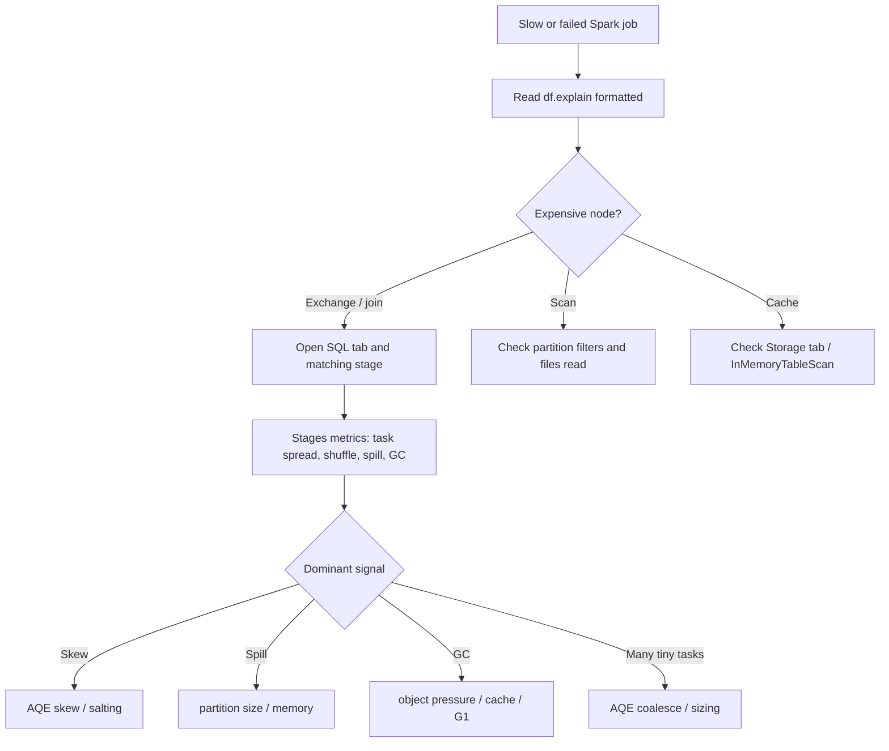

# Spark UI and query plan debugging

> **Databricks · PySpark Performance · Lesson 12**
> *Turn a slow or failed Spark job into evidence: plan nodes, Spark UI tabs, task metrics, and one diagnosis path.*
>
> `Spark 3.2+ / DBR LTS` · `Spark UI + df.explain(mode="formatted")` · `Verified Jun 2026 docs`

---

## What it is

Spark debugging is the habit of reading **what Spark actually ran**, not what you hoped
your code meant. The two primary tools are:

- **`df.explain(mode="formatted")`** — the local view of the physical plan. It tells you
  which operators Spark planned: `Exchange`, `BroadcastHashJoin`, `SortMergeJoin`,
  `HashAggregate`, `InMemoryTableScan`, `AdaptiveSparkPlan`, and `AQEShuffleRead`.
- **Spark UI** — the runtime view. It tells you what happened while the job ran: jobs,
  stages, SQL DAGs, task duration spread, shuffle read/write, spill, GC time, failed tasks,
  storage usage, and executor health.

> **The one rule to remember:** `explain()` tells you the **shape of the work**; the Spark
> UI tells you the **cost of the work**. Use both. A plan without runtime metrics is a
> guess; runtime metrics without the plan are symptoms without a cause.

---

## Why it matters

- **Most Spark performance issues leave fingerprints.** A slow join leaves `Exchange` and
  large shuffle metrics; skew leaves max task time much larger than median; memory pressure
  leaves spill or GC time; driver trouble shows up on the driver row and in result-returning
  actions.
- **Interviewers expect a debugging sequence.** A strong answer is not "increase memory."
  It is "read the SQL plan, find the expensive node, inspect the stage metrics, then choose
  the smallest fix."
- **Databricks FDE work is evidence-driven.** You need to explain why a job is slow to a
  customer, not just list Spark features.

---

## How it works — deep dive

### 1 · Read `explain()` first: find the expensive operators

`<chip:analogy>` *Analogy:* `explain()` is the job's blueprint. It does not tell you how
long the building took, but it shows where the heavy machinery is.

- **`Exchange` means shuffle.** Spark is moving rows across the network so matching keys land
  together. This usually creates a stage boundary and is often the first place to look.
- **Join nodes tell you the strategy.** `BroadcastHashJoin` usually means the big side avoided
  a shuffle; `SortMergeJoin` usually means both sides shuffled and sorted.
- **`AdaptiveSparkPlan` and `AQEShuffleRead` show AQE.** After an action, `isFinalPlan=true`
  and `AQEShuffleRead coalesced` or `skewed=true` show runtime rewrites.
- **Scan details show read reduction.** `PartitionFilters`, pushed filters, and column pruning
  explain why a scan read fewer files or columns.

`<chip:usecase>` *Use case:* a customer says "this join got 10x slower." Start with
`explain("formatted")`: did a previous `BroadcastHashJoin` become a `SortMergeJoin` with two
`Exchange` nodes?

```python
query = (sales
    .join(customers, "customer_id")
    .groupBy("region")
    .sum("amount"))

query.explain(mode="formatted")
# Look for:
# - Exchange hashpartitioning(...)       -> shuffle boundary
# - BroadcastHashJoin or SortMergeJoin   -> join strategy
# - AdaptiveSparkPlan isFinalPlan=true   -> AQE final plan after an action
```

### 2 · SQL tab: connect plan nodes to the DAG

- **SQL/DataFrame tab** groups DataFrame and SQL queries. Use the query description or job
  group label to find the right action.
- **The DAG mirrors the physical plan.** Nodes like `Exchange`, `BroadcastExchange`,
  `HashAggregate`, and `SortMergeJoin` appear visually.
- **Use this tab to compare before/after.** If a fix worked, the expensive node changes:
  a big-side `Exchange` disappears, an `AQEShuffleRead` appears, or an `InMemoryTableScan`
  replaces recomputation.

```python
spark.sparkContext.setJobGroup(
    "L12: debug slow join",
    "L12: debug slow join - compare plan and SQL DAG",
    True,
)

query.write.format("noop").mode("overwrite").save()
# VERIFY: Spark UI -> SQL/DataFrame tab -> open the matching query.
# Compare the DAG nodes to query.explain(mode="formatted").
```

### 3 · Stages tab: diagnose skew, shuffle, spill, and task waves

`<chip:analogy>` *Analogy:* the Stages tab is the race timing sheet. If 199 runners finish
in seconds and one takes an hour, you do not tune the whole team — you investigate the
straggler.

| Signal | Plain meaning | Likely cause | First move |
| --- | --- | --- | --- |
| Max task time >> Median | One or a few tasks dominate the stage | Skew, huge partition, slow executor | Check shuffle read size; use AQE skew or salting |
| Large Shuffle Read/Write | Rows moved across network | Wide dependency, big join/agg | Broadcast, prune, bucket, reduce data |
| Non-zero Spill (memory/disk) | Execution memory could not hold buffers | Large partitions, skew, too little memory | More/smaller partitions, fix skew, tune memory |
| High GC Time | JVM pauses instead of doing work | Too many objects, cache pressure, spill | Reduce cache/object churn; G1/off-heap |
| Many tiny tasks | Scheduler overhead dominates | Too many partitions or small files | AQE coalesce, compact files, sane partition count |

### 4 · Executors tab: separate cluster-wide issues from one bad executor

- **Healthy cluster-wide pressure** means all executors show similar task time, shuffle, spill,
  and GC. Tune the job shape.
- **One bad executor** means one node has much higher failed tasks, GC time, lost executors,
  or task time. Check node health, disk, logs, and whether skew landed there.
- **The driver row matters.** Driver GC or memory pressure during `collect()` or huge metadata
  jobs points to Lesson 03 fixes, not executor-memory fixes.

### 5 · Storage and Environment tabs: confirm cache and configuration

- **Storage tab** proves whether cached DataFrames/RDDs materialized, how many partitions are
  cached, memory vs disk footprint, and whether blocks were evicted.
- **Environment tab** proves which Spark configs actually applied. This is where you catch
  "I set `spark.executor.extraJavaOptions` too late" or "AQE was disabled in this cluster."

---

## Debugging runbook

| Symptom | Check first | If confirmed | Likely lesson |
| --- | --- | --- | --- |
| Slow join | `explain()` join node + SQL DAG | Two `Exchange` nodes | 02, 05, 11 |
| One task runs forever | Stages: Max vs Median task time | Max shuffle read huge | 08 |
| Job finishes but slow | Stages: Spill memory/disk | Spill > 0 | 04, 05 |
| Executor dies | Executor logs + failed task reason | Container OOM / overhead | 04 |
| Driver dies | Driver row + action type | `collect()` or metadata explosion | 03 |
| Repeated recompute | Plan lacks `InMemoryTableScan` | Cache not materialized/reused | 06 |
| Too many tasks | Stage task count | tiny tasks / small files | 05, 13 |
| High GC | Stages: GC Time | GC Time large fraction | 10 |

---

## Uses, edge cases, and limitations

**Uses**

- Diagnose slow Spark jobs before changing code or cluster size.
- Validate that an optimization actually changed the plan or runtime metrics.
- Explain performance issues in customer-facing language: "the join shuffled 800 GB" beats
  "Spark is slow."

**Edge cases**

- AQE plans can change after the action runs. Always inspect the final adaptive plan, not only
  the initial plan.
- `show()` and `take()` are actions too. They can trigger a different amount of work than a
  full write, so use a `noop` write or real target write when benchmarking the full plan.
- A failed task may be retried on a different executor; distinguish one flaky node from a data
  pattern that fails everywhere.

**Limitations**

- The UI is runtime evidence, not a complete root cause by itself. You still need the plan,
  input layout, cluster configuration, and sometimes executor logs.
- Completed UI history may be limited by retention settings.
- Spark UI tab names and Databricks presentation can vary slightly by runtime, but the core
  signals remain the same: plan nodes, stages, task metrics, executor health.

---

## Common mistakes / gotchas

| Mistake | Why it hurts | Better move |
| --- | --- | --- |
| Starting with "add memory" | Treats every symptom as OOM | Read plan + UI first |
| Looking only at average task time | Hides skew | Compare Max, Median, and distribution |
| Trusting the initial AQE plan | It may not be the final plan | Run an action; inspect `isFinalPlan=true` |
| Benchmarking with `collect()` | Adds driver result pressure | Use `noop` or table writes |
| Ignoring Environment tab | You may tune configs that never applied | Verify configs in UI |

---

## Mermaid map



---

## References

- Apache Spark — EXPLAIN syntax: https://spark.apache.org/docs/latest/sql-ref-syntax-qry-explain.html
- Apache Spark — SQL performance tuning: https://spark.apache.org/docs/latest/sql-performance-tuning.html
- Apache Spark — Configuration: https://spark.apache.org/docs/latest/configuration.html
- Apache Spark — Tuning guide: https://spark.apache.org/docs/latest/tuning.html
- Azure Databricks — Adaptive Query Execution: https://learn.microsoft.com/en-us/azure/databricks/optimizations/aqe
