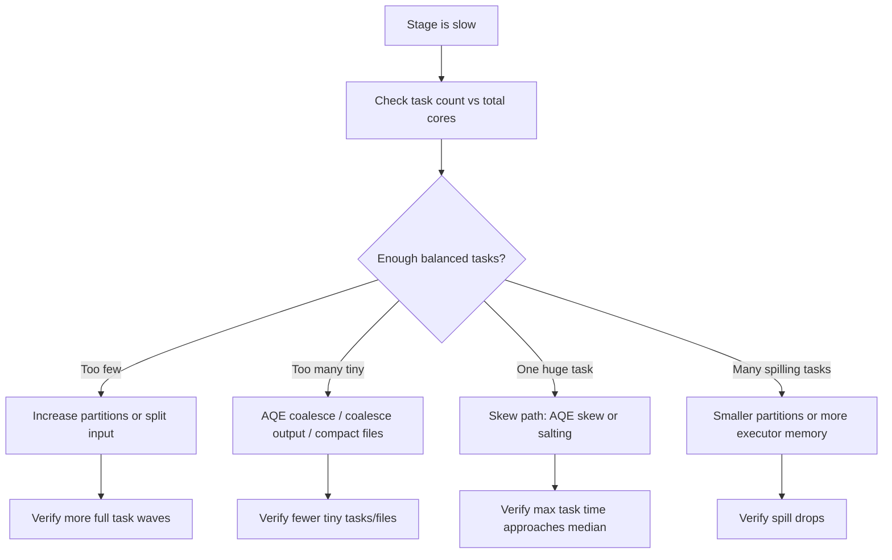

# Partition, shuffle, and cluster sizing

> **Databricks · PySpark Performance · Lesson 13**
> *Match data slices, task waves, executor cores, and memory so Spark runs balanced instead of tiny, skewed, or overloaded.*
>
> `Spark 3.2+ / DBR LTS` · `spark.sql.shuffle.partitions` · `AQE coalesce` · `Verified Jun 2026 docs`

---

## What it is

Spark sizing is deciding **how many pieces of work** a job should create and **how much
cluster capacity** should process those pieces at once.

- A **partition** is one slice of a DataFrame/RDD. In a stage, Spark runs **one task per
  partition**.
- An **executor core** is one task slot. If your cluster has 64 executor cores, Spark can run
  about 64 tasks at the same time.
- A **wave** is one batch of tasks. A stage with 640 tasks on 64 cores runs in roughly 10
  waves.
- A **shuffle partition** is the partition count after wide operations like joins,
  aggregations, `distinct`, and `repartition`.

> **The one rule to remember:** partition count controls **parallelism**, but partition size
> controls **memory pressure**. Too few partitions creates huge tasks that spill or OOM; too
> many creates tiny tasks and scheduler overhead. Aim for enough full task waves, not
> millions of tiny tasks.

---

## Why it matters

- **More workers do not help if there are too few partitions.** A stage with 20 partitions
  cannot use 200 cores at once.
- **More memory does not fix one giant partition.** If one key or file creates a huge task,
  the durable fix is to split the work, prune data, or fix skew.
- **Manual shuffle tuning is less important than it used to be.** AQE can coalesce tiny
  post-shuffle partitions from real runtime sizes, so hand-set counts should usually be an
  upper bound, not a precise guess.

---

## How it works — deep dive

### 1 · Task waves: partition count vs total cores

`<chip:analogy>` *Analogy:* executor cores are checkout counters; partitions are customers.
If there are fewer customers than counters, some counters sit idle. If there are millions
of customers buying one item each, the line-management overhead dominates.

- **Mechanism:** each stage schedules one task per partition. Spark runs up to roughly one
  task per executor core at the same time.
- **Rule of thumb:** a healthy stage has enough partitions to keep all cores busy for several
  waves, but not so many that tasks are mostly scheduler overhead.
- **Spark UI signal:** Stages tab -> task count and task duration distribution. Many
  sub-second tasks often means too many tiny partitions; very few long tasks often means too
  little parallelism.

```python
total_cores = 64
stage_partitions = df.rdd.getNumPartitions()
estimated_waves = (stage_partitions + total_cores - 1) // total_cores

print(stage_partitions, "partitions -> about", estimated_waves, "task waves")
# VERIFY: Spark UI -> Stages tab -> number of tasks in the stage.
```

### 2 · `repartition()` vs `coalesce()`

- **`repartition(n)`** creates a shuffle. It can increase or decrease partitions and
  redistributes rows across the cluster. Use it when you need a new balanced distribution.
- **`coalesce(n)`** usually avoids a shuffle when reducing partitions. It is cheaper, but it
  can preserve imbalance because it mostly collapses existing partitions.
- **`repartition(col)` / SQL `REPARTITION` hints** are distribution tools. They are useful
  before joins, writes, or aggregations when you need rows grouped by a key or a target file
  count.

`<chip:usecase>` *Use case:* before writing a small final result, use `coalesce(8)` to avoid
hundreds of tiny output files. Before a large key-based join, use `repartition("customer_id")`
only if you have evidence Spark's natural distribution is bad.

```python
# Reduce tiny output files cheaply when data is already reasonably balanced.
small_result.coalesce(8).write.mode("overwrite").saveAsTable("main.sales.summary")

# Redistribute by key when you need a balanced key distribution before a wide step.
balanced = events.repartition(400, "customer_id")

# VERIFY:
# - coalesce usually has no Exchange in the plan.
# - repartition shows Exchange hashpartitioning(...).
balanced.explain(mode="formatted")
```

### 3 · `spark.sql.shuffle.partitions`: pre-AQE upper bound

- **OSS default:** `spark.sql.shuffle.partitions = 200`.
- **Databricks:** the value can be `auto` for auto-optimized shuffle on supported runtimes.
- **Modern pattern:** keep AQE enabled and treat shuffle partitions as the starting/upper
  bound. AQE coalesces tiny post-shuffle partitions using real shuffle statistics.

```python
spark.conf.set("spark.sql.adaptive.enabled", "true")
spark.conf.set("spark.sql.shuffle.partitions", 400)  # upper bound before AQE coalesces

agg = events.groupBy("customer_id").sum("amount")
agg.explain(mode="formatted")
# VERIFY after an action:
# AdaptiveSparkPlan isFinalPlan=true
# AQEShuffleRead coalesced
```

### 4 · Partition size and memory pressure

- **Huge partitions** create large per-task sort/join/aggregate buffers. That pressures
  execution memory and causes spill or executor OOM.
- **Tiny partitions** create scheduling overhead, many small shuffle files, and tiny output
  files.
- **Skew is different from bad sizing.** If one partition is huge and the rest are healthy,
  fix skew with AQE skew handling or salting, not a global partition count.

| Symptom | Likely sizing problem | First move |
| --- | --- | --- |
| Few long tasks | Too few partitions | Increase partitions or split input |
| Many sub-second tasks | Too many partitions / small files | AQE coalesce, compact files, coalesce output |
| Spill on many tasks | Partitions too large for execution memory | More partitions or more memory |
| Spill on one task | Skew | AQE skew split, salting |
| Idle cores | Partition count below total cores | Increase parallelism |

### 5 · Cluster sizing: workers, cores, memory, and overhead

`<chip:analogy>` *Analogy:* a cluster is a kitchen. Workers are cooking stations, cores are
cooks, executor memory is counter space, and overhead is the side table used by Python,
off-heap, shuffle, and native memory.

- **Cores:** decide task concurrency. More cores help only when the stage has enough balanced
  tasks.
- **Executor memory:** gives each task room for execution buffers and storage/cache. It does
  not fix driver OOM.
- **Memory overhead:** matters for PySpark workers, Arrow/Pandas UDFs, off-heap, shuffle, and
  native memory. Python-heavy OOMs often need more overhead, not more JVM heap.
- **Driver size:** matters for `collect()`, broadcast build, and metadata. It is not a worker.
- **Autoscaling:** can add capacity, but it cannot fix a single skewed partition, a bad join
  strategy, or too few partitions.

---

## Decision method

1. **Read the stage.** How many tasks? How long? Are Max and Median close?
2. **Check the plan.** Which `Exchange` created the partition count?
3. **Check AQE.** Did `AQEShuffleRead coalesced` or `skewed=true` appear?
4. **Change the smallest lever.** Coalesce output, repartition by key, tune shuffle upper
   bound, fix skew, or resize cluster.
5. **Verify the same metric moved.** Task waves, spill, GC, shuffle read/write, or wall time.

---

## Uses, edge cases, and limitations

**Uses**

- Choosing partition counts before expensive shuffles and writes.
- Explaining why adding workers did or did not improve runtime.
- Avoiding both tiny-file output and giant spilling tasks.

**Edge cases**

- `coalesce()` can make skew worse if it collapses already-imbalanced partitions.
- `repartition()` can fix distribution but costs a full shuffle.
- AQE coalescing helps post-shuffle partitions; it does not compact existing input files.
- Databricks `auto` shuffle behavior is platform-specific; state OSS vs Databricks clearly.

**Limitations**

- There is no universal perfect partition size. Data shape, row width, operator type, and
  cluster hardware all matter.
- Sizing does not replace better algorithms: prune first, avoid shuffle when possible, fix
  skew, then tune partitions and cluster resources.

---

## Common mistakes / gotchas

| Mistake | Why it hurts | Better move |
| --- | --- | --- |
| Setting `shuffle.partitions` globally to a tiny number | Future large jobs spill/OOM | Leave AQE on; use a sane upper bound |
| Repartitioning after every step | Adds unnecessary shuffles | Repartition only for a reason |
| Adding workers for a 10-partition stage | Extra cores sit idle | Increase parallelism or reduce cluster |
| Raising heap for Python worker OOM | Python is outside JVM heap | Raise overhead / tune batch size |
| Coalescing large skewed output | Preserves imbalance | Repartition or fix skew first |

---

## Mermaid map



---

## References

- Apache Spark — SQL performance tuning: https://spark.apache.org/docs/latest/sql-performance-tuning.html
- Apache Spark — Configuration: https://spark.apache.org/docs/latest/configuration.html
- Apache Spark — SQL hints: https://spark.apache.org/docs/latest/sql-ref-syntax-qry-select-hints.html
- Apache Spark — Cluster overview: https://spark.apache.org/docs/latest/cluster-overview.html
- Azure Databricks — Adaptive Query Execution: https://learn.microsoft.com/en-us/azure/databricks/optimizations/aqe
- Azure Databricks — Compute configuration: https://learn.microsoft.com/en-us/azure/databricks/compute/configure
