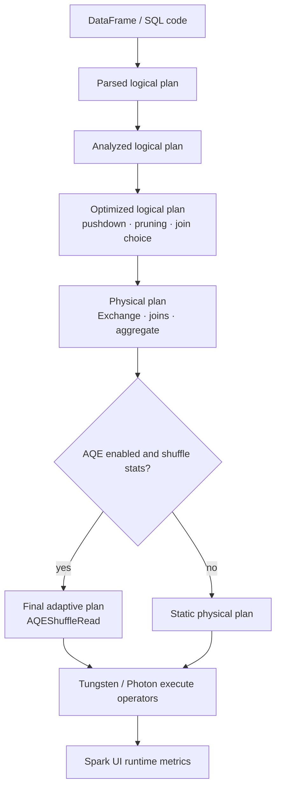

# Catalyst, Tungsten, and physical plan nodes

> **Databricks · PySpark Performance · Lesson 14**
> *Understand how Spark turns DataFrame code into an optimized physical plan, and how to read the nodes that matter in interviews.*
>
> `DataFrame/SQL optimizer` · `EXPLAIN FORMATTED` · `Whole-stage codegen` · `Verified Jun 2026 docs`

---

## What it is

This lesson is the missing bridge between "I wrote PySpark" and "Spark executed a plan."

- **Catalyst** is Spark SQL's optimizer. It analyzes your DataFrame/SQL query, applies rules
  like predicate pushdown and column pruning, chooses join strategies, and produces a
  physical plan.
- **Tungsten** is Spark's execution/memory engine work: compact binary rows, off-heap-aware
  memory handling, and generated JVM code that avoids slow object-heavy execution.
- **Physical plan nodes** are the vocabulary you read in `explain()`: `Exchange`, `Sort`,
  `HashAggregate`, `BroadcastHashJoin`, `SortMergeJoin`, `BroadcastExchange`,
  `InMemoryTableScan`, `AdaptiveSparkPlan`, and `AQEShuffleRead`.

> **The one rule to remember:** Catalyst decides **what plan should run**; Tungsten makes
> the chosen plan **run efficiently**. When debugging, read Catalyst's output in
> `explain()` first, then use Spark UI metrics to see whether the physical execution behaved.

---

## Why it matters

- **DataFrame/SQL gets optimized; arbitrary Python does not.** Built-in expressions are visible
  to Catalyst. Python UDF internals are mostly a black box.
- **Plan nodes explain performance.** `Exchange` means shuffle, `BroadcastExchange` means a
  broadcast build, `InMemoryTableScan` means cache reuse, and `AQEShuffleRead` means AQE
  changed the runtime plan.
- **Advanced interview answers need layer separation.** AQE is planning, Photon/Tungsten are
  execution, caching is storage, and cluster sizing is resource capacity.

---

## How it works — deep dive

### 1 · The plan ladder: parsed -> analyzed -> optimized -> physical

`<chip:analogy>` *Analogy:* Catalyst is an architect. It starts with your rough sketch,
checks the building code, removes unnecessary rooms, then picks a construction method.

- **Parsed logical plan:** Spark has parsed your SQL/DataFrame expression, but names may not
  be resolved.
- **Analyzed logical plan:** tables, columns, functions, and types are resolved.
- **Optimized logical plan:** Catalyst applies rules such as constant folding, predicate
  pushdown, column pruning, and projection/filter simplification.
- **Physical plan:** Spark chooses executable operators: scan, exchange, aggregate, join,
  sort, broadcast, cache scan, and adaptive wrappers.

```python
q = (sales
    .filter("event_date >= '2026-01-01'")
    .select("customer_id", "amount")
    .join(customers.select("customer_id", "region"), "customer_id")
    .groupBy("region")
    .sum("amount"))

q.explain(mode="extended")
# VERIFY: extended explain shows parsed, analyzed, optimized, and physical plans.
```

### 2 · Why DataFrame API beats RDDs for most performance work

- **DataFrame/SQL exposes intent.** Catalyst sees filters, projections, joins, aggregations,
  and column references.
- **RDD code hides intent.** A Python or Scala function over rows looks like arbitrary code,
  so Spark cannot push filters into the scan or prune columns inside the function.
- **The practical rule:** prefer built-in DataFrame functions and SQL expressions. Use UDFs
  only when the logic cannot be expressed with native operations.

`<chip:usecase>` *Use case:* replacing a Python UDF filter with `where(col("status") == "ACTIVE")`
lets Catalyst push the predicate to the file scan and prune unused columns.

```python
from pyspark.sql.functions import col

# Better: visible to Catalyst.
active = events.where(col("status") == "ACTIVE").select("customer_id", "event_ts")

active.explain(mode="formatted")
# VERIFY: scan details show pushed filters / read schema with only needed columns when possible.
```

### 3 · Common physical plan nodes

| Node | Plain meaning | Performance clue |
| --- | --- | --- |
| `Exchange` | Shuffle or repartition boundary | Network + disk + new stage |
| `BroadcastExchange` | Build and distribute small side | Driver builds; executors receive copy |
| `BroadcastHashJoin` | Join big side against broadcast side | Usually no big-side shuffle |
| `SortMergeJoin` | Shuffle both sides, sort, merge | Default big-vs-big join |
| `HashAggregate` | Partial/final aggregation | Often appears around `Exchange` |
| `Sort` | Sort rows before merge/window/order | Memory pressure risk |
| `InMemoryTableScan` | Reading cached data | Cache reuse worked |
| `AdaptiveSparkPlan` | AQE wrapper | Runtime plan can change |
| `AQEShuffleRead` | AQE changed shuffle read | Coalesced or skew-split partitions |

### 4 · Whole-stage codegen and Tungsten in practical terms

- **Whole-stage codegen** fuses compatible operators into generated JVM code, reducing virtual
  function calls and row-by-row overhead.
- **Tungsten-style memory** uses compact binary representation and off-heap-aware execution
  paths to reduce Java object overhead.
- **Why it matters:** native expressions over columns are far cheaper than creating many
  Python/JVM objects per row. This is why row-by-row UDFs often lose to built-in functions.

```python
# SQL EXPLAIN CODEGEN shows generated code for codegen-capable plans.
spark.sql("""
EXPLAIN CODEGEN
SELECT customer_id, sum(amount)
FROM main.pyspark_perf.events
GROUP BY customer_id
""").show(truncate=False)

# VERIFY: generated-code sections appear for whole-stage codegen-compatible parts.
```

### 5 · AQE vs Catalyst vs Tungsten vs Photon

| Layer | Job | Example signal |
| --- | --- | --- |
| Catalyst | Static query optimization before execution | optimized plan, join choice, pushed filters |
| AQE | Runtime plan changes after shuffle stats arrive | `AdaptiveSparkPlan`, `AQEShuffleRead` |
| Tungsten | Efficient JVM execution and memory representation | codegen, compact rows, lower object overhead |
| Photon | Databricks native execution engine | Databricks runtime/UI indicators |

The important interview distinction: **AQE changes the plan**, while Tungsten/Photon change
how operators execute. They are complementary, not replacements for each other.

---

## Uses, edge cases, and limitations

**Uses**

- Reading `explain()` confidently during debugging.
- Explaining why DataFrame/SQL is usually faster than RDD/UDF-heavy code.
- Separating planning problems from execution/resource problems.

**Edge cases**

- UDFs can block pushdown and column pruning because Catalyst cannot inspect their internals.
- AQE means the final plan may differ from the initial plan after an action.
- Some operators are not codegen-compatible, so whole-stage codegen will not cover the entire
  plan.

**Limitations**

- You do not need to memorize every plan node. Focus on nodes that change decisions:
  `Exchange`, joins, scans, aggregates, cache scans, and AQE nodes.
- Tungsten internals are useful context, but most interview debugging still starts with
  `explain()` and Spark UI metrics.

---

## Common mistakes / gotchas

| Mistake | Why it hurts | Better move |
| --- | --- | --- |
| Saying Catalyst "runs the query" | Catalyst plans; executors run tasks | Separate planning and execution |
| Treating all UDFs as harmless | They hide logic from optimizer | Prefer native functions |
| Ignoring `Exchange` | Misses the biggest cost | Investigate shuffle size/stages |
| Reading only the initial AQE plan | Final plan may differ | Run action; inspect final plan |
| Confusing Photon with AQE | Different layers | Photon executes; AQE replans |

---

## Mermaid map



---

## References

- Apache Spark — EXPLAIN syntax: https://spark.apache.org/docs/latest/sql-ref-syntax-qry-explain.html
- Apache Spark — SQL performance tuning: https://spark.apache.org/docs/latest/sql-performance-tuning.html
- Apache Spark — Tuning guide: https://spark.apache.org/docs/latest/tuning.html
- Apache Spark — Configuration: https://spark.apache.org/docs/latest/configuration.html
- Azure Databricks — Photon: https://learn.microsoft.com/en-us/azure/databricks/compute/photon
