# Reading Spark query plans: Catalyst, physical plans, and codegen

> **Databricks · PySpark Performance · Lesson 14**
> *Understand the exact order Spark follows from SQL/DataFrame code to the selected physical plan that runs on executors.*
>
> `EXPLAIN EXTENDED` · `EXPLAIN FORMATTED` · `Catalyst optimizer` · `Physical planning` · `Verified Jun 2026 docs`

---

## What it is

A Spark query plan is the **assembly line** Spark uses to turn your code into distributed
work. The important thing is the order:

1. **SQL / DataFrame** — what you wrote.
2. **Unresolved logical plan** — Spark parsed the shape, but names may not be resolved yet.
3. **Analyzed logical plan** — Spark uses the catalog/schema to resolve tables, columns,
   functions, and data types.
4. **Logical plan** — Spark now has a valid description of the result you want.
5. **Optimized logical plan** — Catalyst rewrites the plan to do less work.
6. **Physical plans** — Spark creates one or more executable strategies.
7. **Cost model** — Spark chooses the best physical strategy it can estimate.
8. **Selected physical plan** — the winning plan.
9. **Code generation / RDD execution** — Spark generates efficient code where possible and
   runs tasks on executors.

> **The one rule to remember:** the top of `explain(True)` shows how Spark understood and
> improved your query; the bottom, **Physical Plan**, shows what Spark will actually run.

---

## Why it matters

- **It makes `explain()` readable.** Instead of seeing a wall of text, you know each section's
  job: parsed, analyzed, optimized, physical.
- **It separates logic from execution.** A logical plan says *what result you want*; a
  physical plan says *how Spark will produce it*.
- **It explains performance clues.** `Exchange` means shuffle, `SortMergeJoin` means a
  shuffle-and-sort join, `HashAggregate -> Exchange -> HashAggregate` means partial/final
  aggregation, and `Coalesce` means fewer partitions without a full shuffle.

---

## How it works — deep dive

### 1 · SQL/DataFrame -> unresolved logical plan

`<chip:analogy>` *Analogy:* this is like writing an order on a form. Spark can read the
sentence, but it has not yet checked whether every item on the form exists.

- **What Spark has:** the syntax tree of your query.
- **What may be missing:** exact column IDs, table metadata, data types, and function
  resolution.
- **What you see in `explain(True)`:** `== Parsed Logical Plan ==`.

```python
df = customers.filter(col("city") == "boston").select("cust_id", "name")
df.explain(True)
# First section: Parsed Logical Plan
```

### 2 · Analysis -> analyzed logical plan

Analysis uses the **catalog** and schema to turn names into real attributes.

- `city` becomes something like `city#52`.
- `cust_id` is resolved to the specific column from the specific input.
- Type casts become explicit when Spark needs them.

If this step fails, you get errors like "cannot resolve column" before Spark ever reaches
physical execution.

### 3 · Logical optimization -> optimized logical plan

Catalyst now asks: **can I produce the same result with less work?**

Common optimizations:

- **Column pruning:** read only needed columns.
- **Predicate pushdown:** push filters toward the file/database scan.
- **Projection collapse:** combine repeated `select` / `withColumn` operations.
- **Null checks:** add `isnotnull(key)` before joins/aggregations when it helps correctness
  and performance.

`<chip:usecase>` *Use case:* in the reference notebook, a filter on `city = 'boston'` and
several `withColumn` calls become a compact optimized plan: one filter, one project, and only
the needed columns.

```python
narrow_plan = (
    customers
    .filter(col("city") == "boston")
    .withColumn("first_name", split("name", " ").getItem(0))
    .withColumn("last_name", split("name", " ").getItem(1))
    .select("cust_id", "first_name", "last_name", "gender")
)

narrow_plan.explain(True)
# Optimized plan should be simpler than the parsed chain you wrote.
```

### 4 · Physical planning -> candidate physical plans

The optimized logical plan still does not say exactly how to run. Physical planning turns it
into executable operators:

- `FileScan` / scan from data source.
- `Filter` / `Project`.
- `Exchange` for shuffle.
- `Sort`, `HashAggregate`, `SortMergeJoin`, `BroadcastHashJoin`.
- `Coalesce` for reducing partitions without full shuffle.

Spark may have multiple ways to run the same logical operation. A join could be broadcast,
sort-merge, or shuffle-hash. This is where the **cost model** chooses.

### 5 · Cost model -> selected physical plan

The cost model uses available statistics and rules to pick a physical plan.

- If one join side is estimated small enough, Spark may pick `BroadcastHashJoin`.
- If both sides are large, Spark often picks `SortMergeJoin`.
- If AQE is enabled, Spark can revise parts of this choice at runtime after seeing real
  shuffle statistics.

The selected physical plan is the plan you debug first.

### 6 · Code generation -> RDD tasks

After the selected physical plan exists, Spark can generate JVM code for compatible operators
through whole-stage codegen. Then the plan runs as distributed tasks over Spark's RDD
execution layer.

```sql
EXPLAIN CODEGEN
SELECT city, count(*) AS n
FROM lesson14_transactions
GROUP BY city;
```

---

## Reading examples from the demo notebook

### Narrow example: no `Exchange`

Filtering, adding columns, and selecting columns usually produce `Filter` and `Project`
operators without `Exchange`.

**Interpretation:** rows do not need to move across the network. Spark can process each input
partition locally.

### `repartition(n)`: look for `Exchange RoundRobinPartitioning`

`repartition(24)` means Spark must redistribute rows into a new set of partitions.

**Interpretation:** physical plan shows `Exchange RoundRobinPartitioning(24)`, which means
full shuffle.

### `coalesce(n)`: look for `Coalesce`, not `Exchange`

`coalesce(5)` reduces partitions by merging existing partitions.

**Interpretation:** physical plan shows `Coalesce 5`. No `Exchange` means Spark avoided a
full shuffle.

### Join: look for selected join strategy

With broadcast disabled, the demo join shows:

- `SortMergeJoin`
- `Sort` on each side
- `Exchange hashpartitioning(cust_id, 200)` on each side

**Interpretation:** both tables shuffle by `cust_id`, then sort, then merge.

### GroupBy: partial aggregate -> Exchange -> final aggregate

A simple `groupBy("city").count()` shows:

- lower `HashAggregate` = partial count near the data
- `Exchange hashpartitioning(city, 200)` = move same-city rows together
- upper `HashAggregate` = final count

**Interpretation:** aggregation is split into local work, shuffle, then final work.

### Count distinct: more exchanges

`countDistinct(city)` can require extra aggregate and exchange steps because Spark must
deduplicate before counting.

**Interpretation:** more `Exchange` nodes usually means more network and more stage
boundaries.

---

## Physical node checklist

| Node | Plain meaning | What to check next |
| --- | --- | --- |
| `FileScan parquet` | Read files | ReadSchema, PushedFilters, PartitionFilters |
| `Filter` | Keep matching rows | Was filter pushed down? Is it still needed for correctness? |
| `Project` | Select/compute columns | Did Catalyst prune unused columns? |
| `Exchange` | Shuffle / repartition | Spark UI shuffle read/write, stage boundary |
| `Coalesce` | Reduce partitions without full shuffle | Possible imbalance, output file count |
| `HashAggregate` | Aggregate rows by key | Partial vs final aggregate around shuffle |
| `SortMergeJoin` | Shuffle, sort, then join | Big shuffle, sort cost, skew |
| `BroadcastHashJoin` | Broadcast small side, join locally | Driver build size, executor memory |
| `AdaptiveSparkPlan` | AQE wrapper | Check final plan after action |
| `AQEShuffleRead` | AQE changed shuffle reads | Coalesced or skew-split partitions |

---

## Predicate pushdown: why filter can still appear

The reference notebook asks an important question: **if Spark pushed the filter into Parquet,
why is there still a `Filter` in the physical plan?**

Short answer: correctness.

- Spark may push `city = 'boston'` into the scan as `PushedFilters`.
- Spark may still keep a `Filter` operator above the scan.
- Not every data source can fully apply every pushed predicate, so Spark keeps a filter as a
  safety check to guarantee correct results.

For casts and complex expressions, pushdown may be partial or absent. Example:

```python
customers.filter(col("age").cast("int") > 50).explain(True)
# Cast expressions are harder to push down fully.
```

---

## Catalyst, AQE, Tungsten, and Photon

| Term | Where it fits | Simple explanation |
| --- | --- | --- |
| Catalyst | Logical + physical planning | Optimizes and chooses query plans |
| Cost model | Physical planning | Chooses among candidate physical plans |
| AQE | Runtime planning | Revises the plan after real shuffle stats arrive |
| Tungsten | Execution engine internals | Compact memory/codegen for JVM execution |
| Photon | Databricks execution engine | Native engine that runs compatible operators faster |

The important distinction: **Catalyst/AQE choose the plan; Tungsten/Photon execute operators
efficiently.**

---

## Uses, edge cases, and limitations

**Uses**

- Read `explain(True)` without getting lost.
- Explain why `repartition()` is expensive and `coalesce()` is cheaper.
- Diagnose joins and aggregations from `Exchange`, `SortMergeJoin`, and `HashAggregate`.

**Edge cases**

- AQE can change the final physical plan after an action.
- Pushed filters can still appear as physical `Filter` nodes.
- UDFs and casts can block or limit pushdown and optimization.

**Limitations**

- Do not memorize every physical node. Focus first on scans, filters, projects, exchanges,
  aggregates, joins, coalesce, and AQE nodes.
- `explain()` shows the plan. The Spark UI shows runtime cost.

---

## Mermaid map

```mermaid
flowchart LR
  A[SQL / DataFrame] --> B[Unresolved logical plan]
  B --> C[Analysis<br/>catalog + schema]
  C --> D[Analyzed logical plan]
  D --> E[Logical optimization<br/>prune · pushdown · simplify]
  E --> F[Optimized logical plan]
  F --> G[Physical planning<br/>candidate plans]
  G --> H[Cost model]
  H --> I[Selected physical plan]
  I --> J[Code generation]
  J --> K[RDD tasks on executors]
```



---

## References

- Apache Spark — EXPLAIN syntax: https://spark.apache.org/docs/latest/sql-ref-syntax-qry-explain.html
- Apache Spark — SQL performance tuning: https://spark.apache.org/docs/latest/sql-performance-tuning.html
- Apache Spark — Configuration: https://spark.apache.org/docs/latest/configuration.html
- Apache Spark — Tuning guide: https://spark.apache.org/docs/latest/tuning.html
- Azure Databricks — Photon: https://learn.microsoft.com/en-us/azure/databricks/compute/photon
